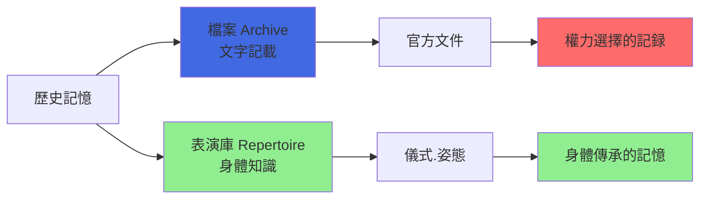
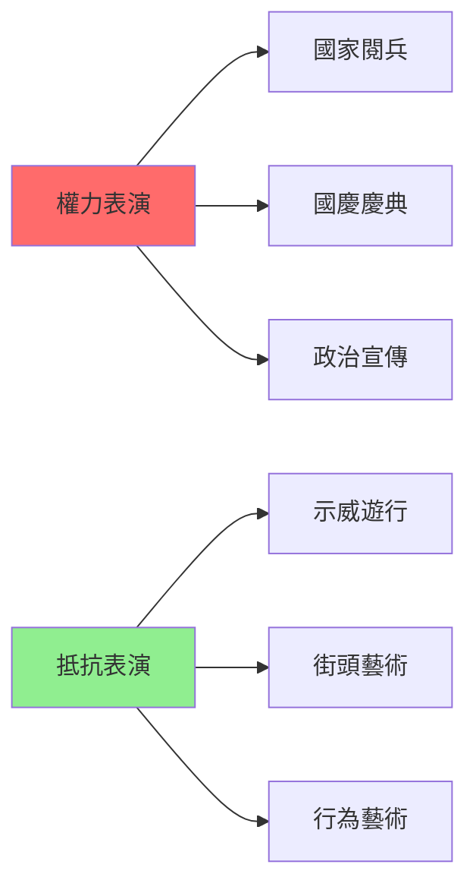
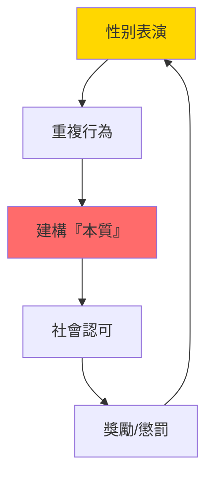
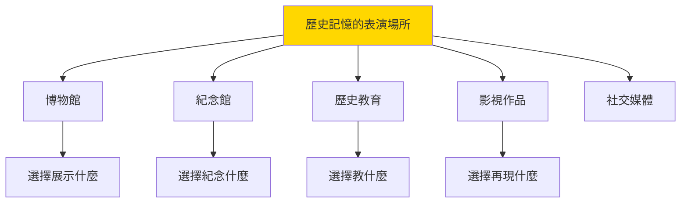
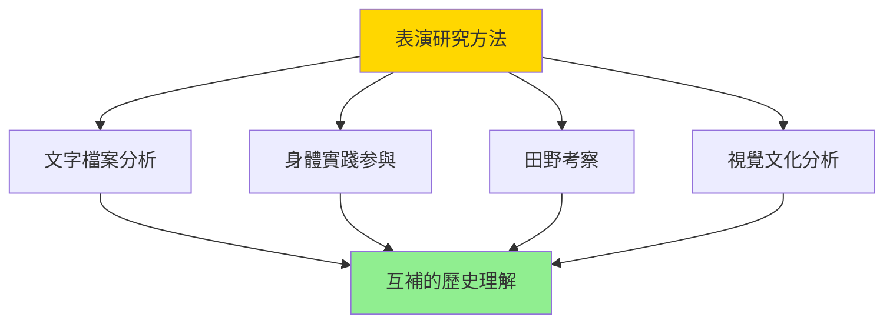

# HIST2212 表演歷史 / Performing History

/** HKU | 6 credits | Instructor: Crystal Kwok */

---

## 問題 1：5 個核心心智模型

### 1. 表演作為歷史方法——挑戰「客觀再現」的神話
**定義**: 表演研究（Performance Studies）提供了一種全新的歷史研究方法——它挑戰了「歷史是客觀再現過去」的傳統假设。學者 **Diana Taylor** 在 *The Archive and the Repertoire* (2003) 中提出：表演（Repertoire）與文獻檔案（Archive）同樣重要——表演是「活」的歷史記憶，而檔案是「死」的歷史記載。

**學者**: **Diana Taylor** — *The Archive and the Repertoire: Performing Cultural Memory in the Americas* (2003); **Peggy Phelan** — *Unmarked: The Politics of Performance* (1993); **Richard Schechner** — *Between Theater and Anthropology* (1985)

**驗證**: 1968 年以來，「表演研究」作為一個獨立學科在北美大學（尤其是 NYU）發展起來；它的核心假設是：表演不僅是藝術形式，更是人類認知和傳播知識的基本模式。

**歷史事件**:
- **1977年**: Richard Schechner 出版 *Performance Theory*——表演研究理論奠基
- **1993年**: Peggy Phelan 出版 *Unmarked*——表演「消失」本體論
- **2003年**: Diana Taylor 出版 *The Archive and the Repertoire*——表演研究與歷史記憶

### 2. 表演與權力——誰有權表演？
**定義**: 表演研究揭示了權力與表演的深层聯繫——「誰有權表演，誰被表演」是權力關係的核心問題。學者 **Erika Fischer-Lichte** 在 *Theatre of the World* (2009) 中分析了表演如何成為權力運作的場所。

**學者**: **Erika Fischer-Lichte** — *Theatre of the World* (2009); **Joseph Roach** — *Cities of the Dead* (1996); **Diana Taylor** — 研究表演與權力

**驗證**: 1968 年全球学生運動——學生佔領大學建築、抗議越戰、要求民主化——這是一場大規模的「政治表演」；它展示了表演如何成為政治動員的工具；歷史上的「起義」「革命」在某種意義上都是「集體表演」——它們重新定義了誰有權、誰被定義。

**歷史事件**:
- **1789年7月14日**: 巴士底監獄風暴——法國大革命的「表演性時刻」
- **1917年3月（俄曆2月）**: 布爾什維克佔領冬宮——革命的「戲劇性重現」
- **1968年**: 全球學生運動——表演作為政治動員
- **1989年6月4日**: 天安門廣場——歷史記憶的「表演性」
- **2019年**: 香港雨傘運動——表演與權力

### 3. 身份表演性——性别、種族與「真實」的我
**定義**: 學者 **Judith Butler** 在 *Gender Trouble* (1990) 中提出「表演性」（Performativity）概念：性别身份不是固定本質，而是通過重複的「表演」建構的——這種表演不是「假裝」，而是建構「真實」的過程。

**學者**: **Judith Butler** — *Gender Trouble* (1990); *Bodies That Matter* (1993); **Stuart Hall** — 文化身份研究

**驗證**: Butler 的表演性理論對歷史研究有深遠影響——如果性别是「表演」的，那麼「男性氣概」和「女性氣質」在歷史上是如何被表演出來的？這種表演如何服務了權力關係？

**歷史事件**:
- **1920年代**: 美國「爵士時代」的「新女性」——短髮、吸煙、跳舞——表演新的女性身份
- **1960年代**: 第二波女性主義——挑战傳統「女性氣質」的表演
- **1990年代**: 酷兒理論興起——性别表演性的理論化

### 4. 歷史記憶的表演——博物館、紀念館與政治
**定義**: 歷史記憶（Historical Memory）不是被動保存的「過去」，而是被主動建構的「現在」。博物館、紀念館、歷史教育——這些都是歷史記憶的「表演性場所」，它們決定了什麼被記憶、什麼被遺忘。

**學者**: **David Dean** — 研究博物館與歷史; **Annie E. Coombes** — *Museums and the Colonial Imagination* (2003); **Yves Samover** — 研究紀念館政治

**驗證**: 日本的廣島和平記念館（1955 年開放）和中國的南京大屠殺紀念館（1985 年開放）——這兩個紀念館紀念同類歷史事件（戰爭中的平民傷亡），但它們的展示方式和政治話語截然不同——這種差異揭示了歷史記憶的政治本質。

**歷史事件**:
- **1889年**: 巴黎世博會——殖民帝國的「人類展覽」
- **1955年**: 廣島和平記念館開放
- **1985年**: 南京大屠殺紀念館開放
- **2001年**: 德國「歐洲被害猶太人紀念碑」開放

### 5. 表演研究的方法論——身體知識與檔案
**定義**: 表演研究提供了一套獨特的方法論——它不僅依赖文字檔案，還重視「身體知識」（Embodied Knowledge）。學者 **Philip Zarilli** 研究表演作為田野考察方法——研究者需要「進入」表演的身體實踐，才能真正理解表演的意義。

**學者**: **Philip Zarilli** — 研究表演作為田野方法; **Diana Taylor** — *Performance* (2016); **Stuart Hall** — 文化研究方法論

**驗證**: 表演研究的方法論創新：傳統歷史學依赖檔案；表演研究則要求研究者「體驗」——這種方法論創新對所有歷史研究都有啟示。

**歷史事件**:
- **1985年**: Schechner 提出「恢復的表演」(Restored Behavior)
- **1993年**: Phelan 表演「消失」理論
- **2003年**: Taylor「檔案 vs 表演庫」框架

---

## 問題 2：3 個根本分歧

### 分歧 1：表演與歷史真實——表演可以「真實」嗎？
- **A 方（表演真實論）**: **Peggy Phelan** — 表演是「不可重複的當下」——它「通過消失而成為自己」；表演捕捉的是檔案無法捕捉的「情感真實」
- **B 方（表演局限論）**: 表演的「真實」是有限度的——表演壓缩了歷史的複雜性，選擇性地呈現某些面向

### 分歧 2：表演研究——藝術方法還是歷史方法？
- **A 方（藝術方法派）**: 表演研究的美學標準——動作、聲音、空間、觀眾——是理解表演的核心
- **B 方（歷史方法派）**: 表演研究應該服務於歷史理解——表演是歷史證據的一種形式，而非藝術品

### 分歧 3：歷史表演——教育功能還是政治工具？
- **A 方（教育功能派）**: 歷史表演讓公眾接觸歷史，是公眾歷史（Public History）的核心工具
- **B 方（政治工具派）**: **Diana Taylor** — 歷史表演是政治話語的場所——它決定了什麼被視為「正當的過去」

---

## 問題 3：10 個深度問題

1. **表演作為歷史證據**：如果歷史記載（檔案）是權力建構的，那麼表演（Repertoire）是否更加「真實」？或者表演只是另一種建構？

2. **1968 年的表演性**：1968 年全球学生運動——從巴黎到墨西哥城到東京——這些運動在某種意義上都是「集體表演」？這些表演如何重新定義了政治可能性？

3. **香港歷史的表演性**：香港的歷史——從殖民地到回歸——在哪些表演形式中被建構和記憶？殖民時期的「歷史表演」（如总督府）和回歸後的「歷史表演」（如國安法）之間有什麼斷裂？

4. **身體知識與歷史研究**：表演研究要求研究者「進入」表演的實踐——這種方法論創新對歷史學有什麼啟示？研究者能否真正「體驗」過去的身體實踐？

5. **博物館的表演性政治**：從巴黎的人類博物館（1889 年殖民展覽）到當代的「痛苦文化」（如廣島紀念館）——博物館如何表演了歷史記憶的政治？

6. **性別表演性與歷史**：如果性别是「表演」的，那麼「中國女性」的歷史身份是如何被表演出來的？這種表演在不同的歷史時期有什麼變化？

7. **表演與創傷記憶**：如南京大屠殺、猶太人大屠殺——這些歷史創傷如何通過表演被記憶和傳播？表演如何在創傷政治中扮演角色？

8. **影視表演與歷史認知**：電影和電視劇中的歷史表演——如《南京！南京！》（2009）或《二十二》（2017）——如何塑造了公眾的歷史認知？

9. **「再現」的倫理**：當歷史學家「再現」過去時，他們在進行什麼樣的表演？這種「再現」的倫理邊界在哪裡？

10. **香港大學的歷史表演教育**：Crystal Kwok 帶領的 HIST2212 課程鼓勵學生拍攝歷史短片——這種「做中學」的歷史教育方法有什麼創新和局限？

---

# 核心心智模型深化（中英對照）

## 1. 表演作為歷史方法 / Performance as Historical Method

### 1.1 定義與背景 / Definition and Context
表演作為歷史方法（Performance as Historical Method）指表演研究（Performance Studies）提供的一套以「表演」（Repertoire）為核心的歷史研究方法。傳統歷史學依赖文字檔案（Archive），而表演研究則強調：表演（身體知識、儀式、姿態）與檔案同樣重要——它是「活」的歷史記憶，與「死」的歷史記載互補。

### 1.2 關鍵方程式或史料 / Key Evidence
- **Repertoire**: 表演庫——身體知識、儀式、姿態——活的历史記憶
- **Archive**: 檔案——文字記載、文件、文物——死的历史记载
- **兩者關係**: Archive 記載什麼被認為值得記録；Repertoire 記載什麼在身體中被傳承

### 1.3 應用場景 / Applications
表演作為歷史方法的應用：在研究非文字社會（如前現代社會、口述傳統社會）時，表演研究提供了替代檔案的方法論工具。

### 1.4 犀利觀察 / Critical Observation
> 「表演研究最犀利之處——它摧毁了『檔案是客觀的、表演是主觀的』這個假設。檔案也是建構的——它選擇性地記録了某些事件某些人某些聲音；表演也是知識——它記載了那些無法被文字捕捉的身體經驗。兩者都是權力的場所，也都是抵抗的場所。」

### 1.5 深度思考題 / Deep Question
**考試題**：分析 Diana Taylor 的「檔案 vs 表演庫」框架。如何評價這種表演研究方法論對傳統歷史學的挑戰？

---

## 2. 表演與權力 / Performance and Power

### 2.1 定義與背景 / Definition and Context
表演與權力（Performance and Power）指表演如何成為權力運作和抵抗的場所。學者 Joseph Roach 在 *Cities of the Dead* (1996) 中提出：表演既是「支配」的場所，也是「抵抗」的場所——被邊緣化的群體可以通過表演挑戰主流叙事。

### 2.2 關鍵方程式或史料 / Key Evidence
- **1968年**: 全球学生運動——作為「集體表演」的政治動員
- **1989年6月4日**: 天安門——歷史記憶的表演性建構
- **2019年**: 香港雨傘運動——雨傘作為表演道具
- **權力表演**: 國家閱兵、國歌、國旗——都是權力的表演

### 2.3 應用場景 / Applications
表演與權力的分析對理解當代政治特別重要——從國家閱兵到政治抗議，從電視辯論到社交媒體——當代政治越來越「表演化」。

### 2.4 犀利觀察 / Critical Observation
> 「表演研究最荒謬之處——它讓我哋看到，『權力』和『反抗』往往走同一條路。當政府組織閱兵展示實力時，反對派也組織遊行展示人數。兩者都是『表演』——只不過一個是权力的表演，一個是抵抗的表演。歷史就是在這兩種表演的張力中前進的。」

### 2.5 深度思考題 / Deep Question
**考試題**：分析 1968 年全球学生運動的「表演性」。這些運動如何通過表演挑戰了主流政治話語？

---

## 3. 性别表演性 / Gender Performativity

### 3.1 定義與背景 / Definition and Context
性别表演性（Gender Performativity）是 Judith Butler 在 *Gender Trouble* (1990) 中提出的核心概念。它指出：性别身份不是固定本質，而是通過重複的「表演」建構的——這種表演不是「假裝」而是建構「真實」的過程。這個理論對歷史研究有深遠影響：如果性别是表演的，那麼「男性氣概」和「女性氣質」在歷史上是如何被表演出來的？

### 3.2 關鍵方程式或史料 / Key Evidence
- ** Butler 的核心論點**: 性别 = 重複的表演 → 建構固定本質的錯覺
- **歷史應用**: 如果性别是表演的，那麼「中國女性」的歷史身份是如何被表演的？
- **批評**: 這個理論是否過度强调了表演的建構性，而忽視了身體的物質性？

### 3.3 應用場景 / Applications
性别表演性的歷史分析：中國傳統社會的「三從四德」是一種性别表演——女性通過服裝、行為、語言、姿態，重複表演著「女性氣質」；這種表演不是「假裝」，而是被整個社會認可和獎勵的「真實」。

### 3.4 犀利觀察 / Critical Observation
> 「性别表演性最犀利之處——它讓我哋看到，性别從來不是『自然的』，而是『被表演的』。裹腳是表演、穿針引線是表演、溫柔賢淑是表演——這些表演被稱為『女性氣質』，然後被用來证明『女性天生就應該如此』。表演創造了它的所謂『本質』。呢種『表演創造本質』的循環，在性别、種族、階級、國籍等所有身份範疇中都存在。」

### 3.5 深度思考題 / Deep Question
**考試題**：用性别表演性框架，分析中國傳統社會中「女性氣質」是如何被建構的。這種建構如何服務了當時的權力關係？

---

## 4. 歷史記憶的表演 / The Performance of Historical Memory

### 4.1 定義與背景 / Definition and Context
歷史記憶的表演（The Performance of Historical Memory）指博物館、紀念館、歷史教育等都是歷史記憶的「表演性場所」。它們決定了什麼被記憶、什麼被遺忘、誰的聲音被听到、誰的聲音被压下。

### 4.2 關鍵方程式或史料 / Key Evidence
- **廣島和平記念館（1955）**: 展示核戰爭的恐怖——但淡化廣島作為軍事目標的歷史爭議
- **南京大屠殺紀念館（1985）**: 展示日本暴行——服務於中國的民族主義話語
- **柏林猶太博物館（2001）**: 展示大屠殺的創傷——拒絕提供「解答」或「和解」
- **香港歷史博物館**: 如何展示香港從殖民到回歸的歷史？

### 4.3 應用場景 / Applications
歷史記憶表演的批判分析對理解當代政治特別重要——每一個「紀念日」背後都有表演政治的選擇：紀念什麼，紀念誰，遗忘了誰。

### 4.4 犀利觀察 / Critical Observation
> 「博物館最荒謬之處——它們被稱為『客觀的歷史教育場所』，但它們每一個展示都是選擇的結果。誰的文物被展示、誰的故事被讲述、誰被放在『陰暗的角落』——這些選擇本身就是政治行為。『客觀的博物館』從來就不存在過——存在的只有不同政治動機的博物館。」

### 4.5 深度思考題 / Deep Question
**考試題**：比較廣島和平記念館和南京大屠殺紀念館的展示策略。這兩種「表演歷史記憶」的方式各自服務了什麼政治話語？

---

## 5. 表演研究方法論 / Performance Studies Methodology

### 5.1 定義與背景 / Definition and Context
表演研究方法論（Performance Studies Methodology）指表演研究提供的一套獨特方法論創新：不僅依赖文字檔案，還重視「身體知識」。研究者需要「進入」表演的身體實踐，才能真正理解表演的意義——這種方法論對所有歷史研究都有啟示。

### 5.2 關鍵方程式或史料 / Key Evidence
- **身體知識 (Embodied Knowledge)**: 無法用文字完全捕捉的知識——通過身體傳承
- **表演性田野 (Performance Ethnography)**: 研究者通過参與表演來研究文化
- **批評**: 這種方法論是否有主觀主義的風險？如何確保歷史研究的嚴謹性？

### 5.3 應用場景 / Applications
表演研究方法論的創新對研究非文字社會、口述傳統、肢體藝術等歷史資料特别重要。

### 5.4 犀利觀察 / Critical Observation
> 「表演研究最有趣之處——它告訴我哋，歷史記載的最後一道防線——『我親眼看到的』——也不是客觀的。任何觀看都是建構性的：當你走進一個歷史場所，你已經带著你的假設、你的問題、你的『理論眼鏡』。歷史研究的『客觀性』從來不是一個可以達到的狀態，而是一個值得追求的方向。」

### 5.5 深度思考題 / Deep Question
**考試題**：分析表演研究方法論對傳統歷史學的挑戰。表演研究是否有可能取代傳統歷史學，還是兩者應該互補？

---

## 深度自測問題詳解

**Q1（表演作為歷史證據）**：表演和檔案都是權力建構的——兩者的區別不在於「主觀 vs 客觀」，而在於它們採用的媒介和建構的方式不同。檔案通過文字記載，表演通過身體傳承——兩者都不可完全信任，也都不可完全抛弃。

**Q2（1968 年表演性）**：1968 年全球学生運動的表演性體現在：這些運動都有「表演性時刻」（如巴黎學生的街頭戲劇、墨西哥學生的靜坐）——這些表演動員了參與者的情感投入，超越了純粹的理性政治號召。

**Q3（香港歷史表演性）**：香港的歷史表演性體現在：殖民時期的總督府慶典（展示帝國權力）和回歸後的國慶慶祝（展示主權移交）——兩種表演之間存在斷裂，揭示了政治轉變的戲劇性。

**Q4（身體知識）**：身體知識與檔案的互補性：檔案記載了事件和話語；身體知識記載了情感和經驗。兩者合在一起，才能形成更完整的歷史理解——但這種互補也要求研究者同時掌握文字分析和身體實踐兩種能力。

**Q5（博物館表演政治）**：博物館表演政治的核心揭示：1889 年巴黎世博會的「人類展覽」將非洲和亞洲人民作為「被展示的物體」——這種殖民主義的展示邏輯，與當代去殖民博物館的展示邏輯（讓邊緣群體自己講述自己的故事）形成尖銳對比。

**Q6（性别表演性與歷史）**：性别表演性框架應用於中國歷史：傳統社會中「女性氣質」的建構通過裹腳（身體表演）、詩歌朗讀（語言表演）、溫柔賢淑（行為表演）——這些表演的「規範性」（即不表演會被懲罰）揭示了性别表演的權力性質。

**Q7（創傷記憶表演）**：創傷記憶的表演揭示了一個倫理困境：表演創傷是讓創傷被記憶和正義化的工具，還是對創傷受害者的再次剝削？《二十二》（2017）——中國首部關於慰安婦的紀錄片——展示了這種倫理困境的複雜性。

**Q8（影視表演與歷史認知）**：影視表演塑造歷史認知的方式：電影不是「客觀再現」過去，而是選擇性地建構歷史叙事。南京大屠殺在中國電影中被展示的方式，與在國際電影中被展示的方式截然不同。

**Q9（再現的倫理）**：歷史再現的倫理邊界：當研究者「再現」過去時，他/她有什麼權力和義務？再現邊緣群體的歷史時，誰有權代表這些群體發聲？

**Q10（香港大學歷史表演教育）**：Crystal Kwok 的 HIST2212 課程鼓勵學生拍攝歷史短片——這種「做中學」的方法讓學生不僅是歷史的「消費者」，更是歷史的「共同建構者」；這種方法論創新對公眾歷史教育有重要啟示。

---

## 5 個 Mermaid 圖解

### 圖解 1：檔案 vs 表演庫

### 圖解 2：表演與權力的張力

### 圖解 3：性别表演性的循環

### 圖解 4：歷史記憶的表演場所

### 圖解 5：表演研究的歷史應用

---

## 總結

**HIST2212 Performing History** 的核心價值：

1. **批判性歷史方法論**——表演研究挑戰了「檔案是客觀的、表演是主觀的」這個傳統假设，揭示了兩者的建構性質。

2. **權力與表演**——表演既是權力運作的場所，也是抵抗的場所；理解表演的政治性質，是理解當代政治的必要前提。

3. **性别與身份的政治建構**——Butler 的表演性理論揭示了性别、種族、階級等身份範疇的表演性質。

4. **歷史記憶的政治**——博物館、紀念館、影視作品——這些都是歷史記憶的表演性場所，它們決定了什麼被記憶、什麼被遺忘。

5. **方法論創新**——表演研究要求研究者「進入」表演的實踐，這種方法論創新對所有歷史研究都有啟示。

**袁騰飛金句**：
> 「表演研究最犀利之處——它讓我哋看到，『歷史真相』從來不是一個擺在那裡的客觀事實，而是被不斷『表演』出來的。每一個歷史博物館、每一本歷史教科書、每一齣歷史劇——都是一種『表演歷史』。而我們，作為觀眾和研究者，同時也是這種表演的参與者和共同建構者。歷史從來不是客觀的——它總是、也永遠是政治的。」

---

## 延伸閱讀

1. Taylor, Diana. *The Archive and the Repertoire: Performing Cultural Memory in the Americas*. Durham: Duke University Press, 2003.
2. Phelan, Peggy. *Unmarked: The Politics of Performance*. London: Routledge, 1993.
3. Butler, Judith. *Gender Trouble: Feminism and the Subversion of Identity*. New York: Routledge, 1990.
4. Fischer-Lichte, Erika. *Theatre of the World: From Early Modern Drama to the Present*. London: Routledge, 2009.
5. Roach, Joseph. *Cities of the Dead: Circum-Atlantic Performance*. New York: Columbia University Press, 1996.
6. Schechner, Richard. *Between Theater and Anthropology*. Philadelphia: University of Pennsylvania Press, 1985.
7. Coombes, Annie E. *Museums and the Colonial Imagination*. Amsterdam: Gordon and Breach, 2003.
8. Hall, Stuart. "Cultural Identity and Diaspora." In *Identity: Community, Culture, Difference*, ed. Jonathan Rutherford. London: Lawrence & Wishart, 1990.
