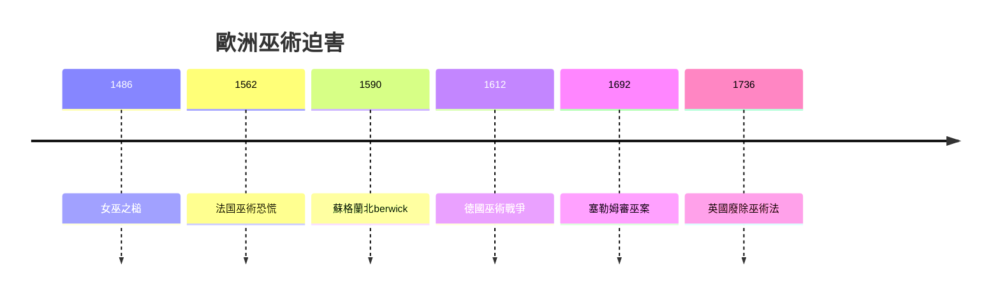
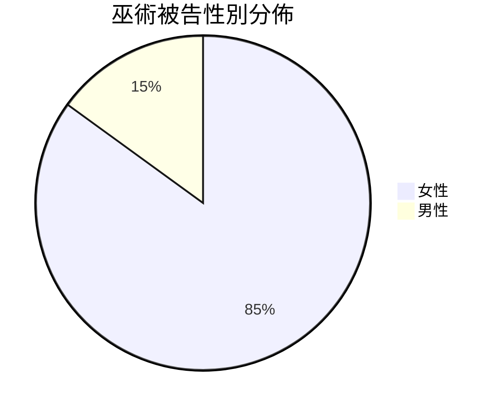
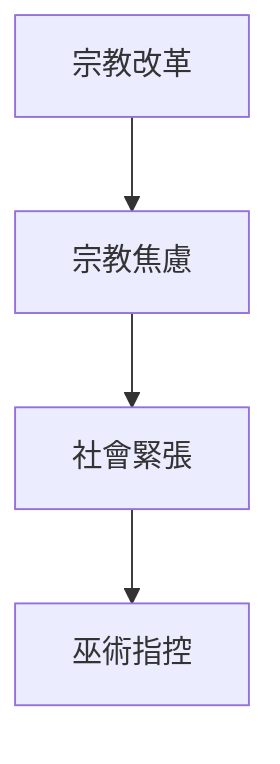

# HIST2213 巫術與魔法 / Witchcraft, Magic, and the Devil (6 credits)

**Instructor**: Christine Walker
**Department**: History, HKU  
**Official source**: [HKU History Course Description 2024-25](https://history.hku.hk/wp-content/uploads/2024/07/HIST-2425.pdf)
**Style**: 袁騰飛式 — 犀利、聚焦巫術點解被建構為邪惡

---

## 問題 1：這個領域所有專家共享的 5 個核心心智模型

### 心智模型 1：巫術恐懼與早期現代危機
學者 **Brian Levack** (*The Witch-Hunt in Early Modern Europe*, 2016) 研究：1400-1700 年歐洲巫術迫害——估計 4-6 萬人被處決。

學者 **John D. Berkshire** 分析：宗教改革、政治危機、經濟壓力交織。

- 1486 《女巫之槌》(Malleus Maleficarum)
- 1562 法國巫術恐慌
- 1692 塞勒姆審巫案

### 心智模型 2：性別與巫術迫害
學者 **Silvia Federici** (*Caliban and the Witch*, 2004) 研究：巫術迫害與女性身體控制——資本主義興起需要服從勞動力。

學者 **Anne Llewellyn Barstow** 分析：85-90% 被告為女性——性別化迫害。

### 心智模型 3：巫術與理性化
學者 **Keith Thomas** (*Religion and the Decline of Magic*, 1971) 研究：理性化導致魔法世界观衰落——但未完全消失。

學者 **Owen Davies** 分析：民間魔法傳統延續。

### 心智模型 4：比較巫術研究
學者 **Edward Bever** 研究：歐洲、北美、非洲巫術恐懼比較。

學者 **Jean Comby** 分析：殖民時期非洲巫術迫害。

### 心智模型 5：當代巫術復興
學者 **Catherine Wessinger** 研究：異教 (Paganism) 復興運動。

學者 **Ronald Hutton** (*Triumph of the Moon*, 1999) 分析：新異教運動歷史。

---

## 問題 2：3 個根本分歧

### 分歧 1：巫術迫害原因——性別壓迫定宗教焦慮？
- **A 方**：性別壓迫
  - 控制女性身體
- **B 方**：宗教焦慮
  - 宗教戰爭後遗症

### 分歧 2：塞勒姆審巫案——心理病理定集體歇斯底里？
- **A 方**：心理病理
  - 集體歇斯底里
- **B 方**：社會緊張
  - 社區衝突

### 分歧 3：巫術——歷史現象定持續實踐？
- **A 方**：歷史現象
  - 已消失
- **B 方**：持續實踐
  - 新異教運動

---

## 問題 3：10 個深度問題

1. 如果你去 1600 年歐洲，你會相信巫術嗎？
2. 點解巫術迫害主要 targeting 女性？
3. 如果你是被告，你點樣為自己辯護？
4. 塞勒姆審巫案點解仍被研究？
5. 點解《女巫之槌》可以暢銷 200 年？
6. 如果你去 1692 年塞勒姆，你會點樣理解？
7. 點解當代仍然有人相信巫術？
8. 如果你是歷史學家，點樣研究被處決者？
9. 巫術恐懼點解往往爆發於 crisis 時期？
10. 如果巫術迫害係錯誤，點解持續幾百年？

---

## 核心心智模型深化

### 1. 巫術迫害時間線



---

## 5 個 Mermaid 圖解

### 📊 Diagram 1: 巫術被告性別



### 📊 Diagram 2: 巫術迫害原因



### 📊 Diagram 3: 塞勒姆審巫案

```mermaid
flowchart TD
    A[1692 塞勒姆] --> B[少女抽搐]
    B --> C[集體指控]
    C --> D[20人被處決}
```

### 📊 Diagram 4: 女巫之槌影響

```mermaid
flowchart TD
    A[1486 女巫之槌] --> B[宗教迫害]
    B --> C[數萬人死亡}
```

### 📊 Diagram 5: 巫術恐懼模式

```mermaid
flowchart TD
    A[社會危機] --> B[替罪羊]
    B --> C[邊緣群體}
```

---

## 總結

1. 巫術迫害揭示早期現代社會危機
2. 性別化迫害反映父權制
3. 塞勒姆審巫案仍被研究
4. 理性化唔等於魔法消失
5. 當代新異教運動延續傳統

**最後問題**: 如果你去 1600 年，你會點樣避免被指控為巫術？

---
**版權所有 © HKU History Self-Study**
