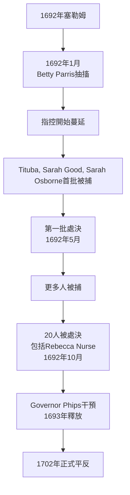
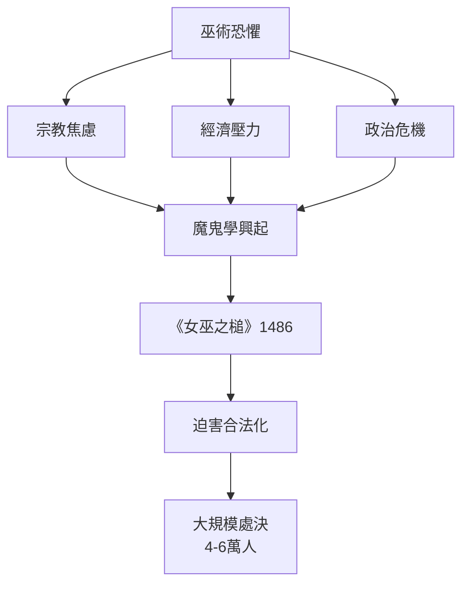
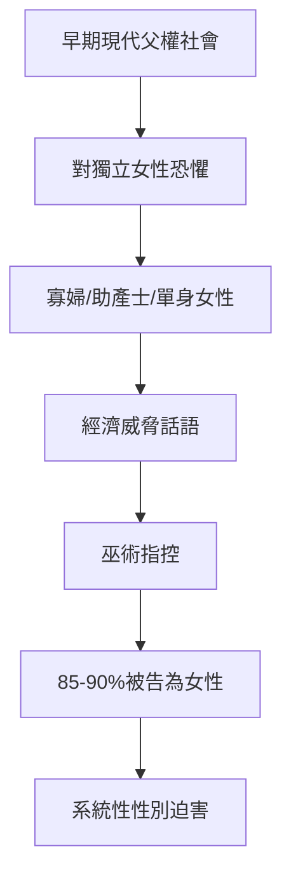
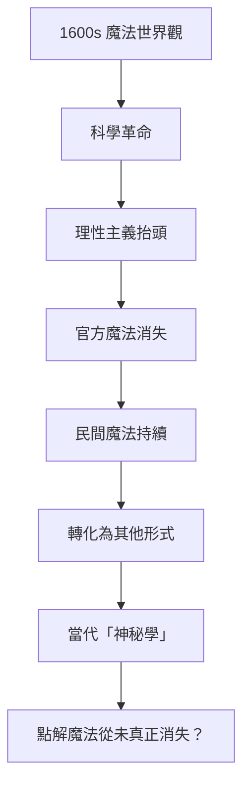
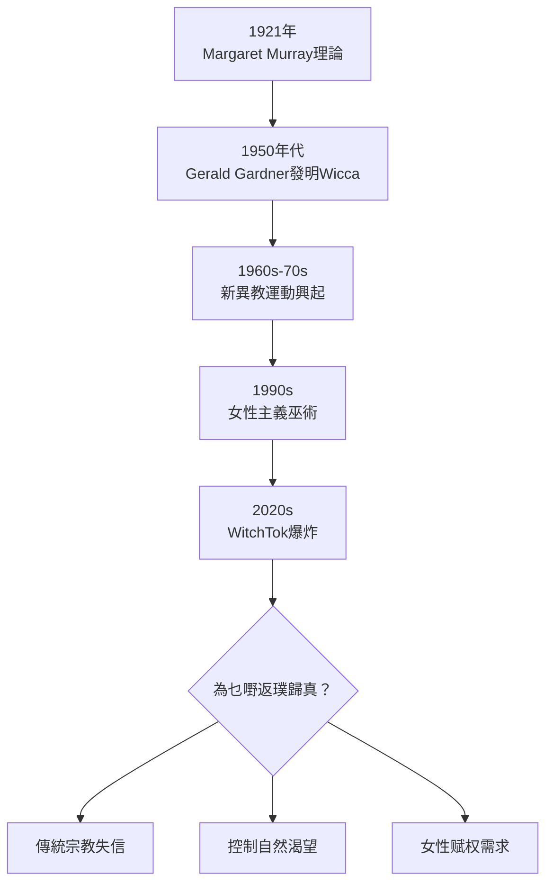
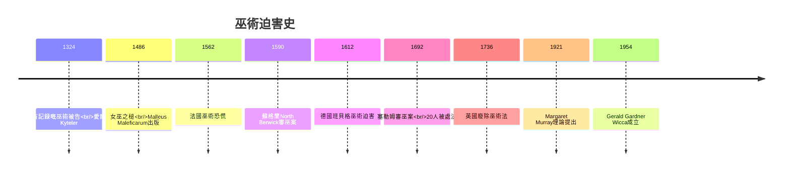
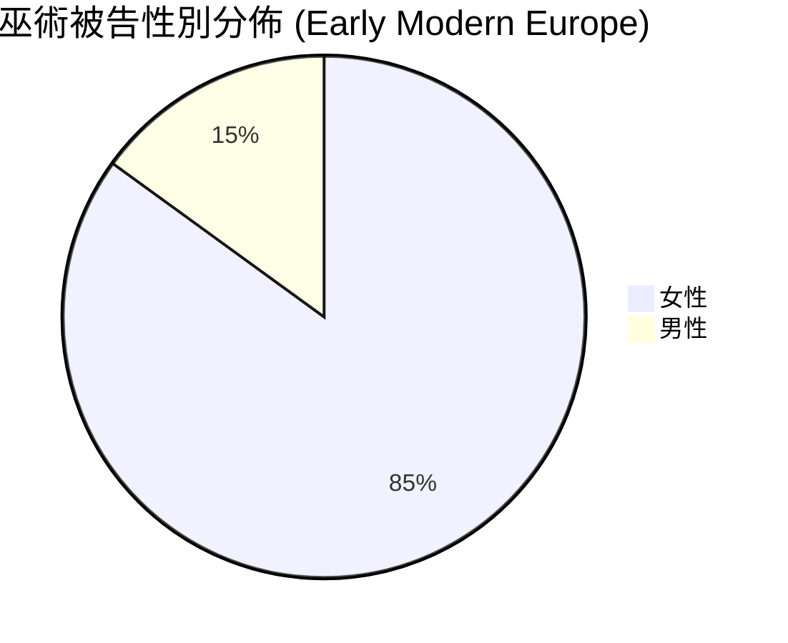
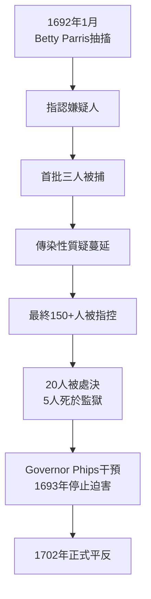
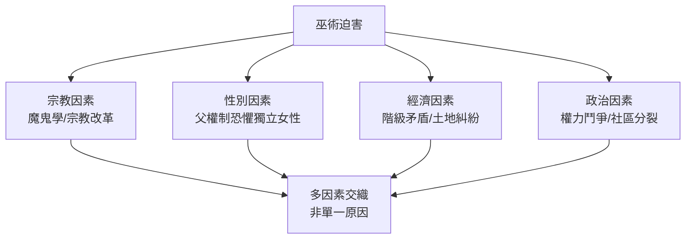
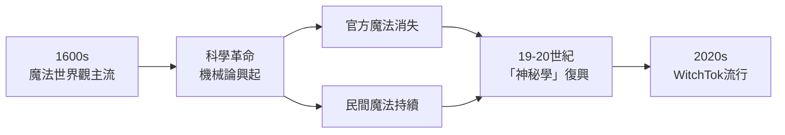

# HIST2213 巫術、魔法與惡魔 / Witchcraft, Magic, and the Devil in Early Modern Europe and America (6 credits)

**Instructor**: Christine Walker
**Department**: History, HKU
**Official source**: [HKU History Course Description 2024-25](https://history.hku.hk/wp-content/uploads/2024/07/HIST-2425.pdf)
**Style**: 袁騰飛式 — 犀利、聚焦1692年塞勒姆審巫案與1400-1700年歐洲巫術迫害

---

## 問題 1：這個領域所有專家共享的 5 個核心心智模型

### 心智模型 1：塞勒姆審巫案——恐懼點解引爆社區内耗
學者 **Brian Levack** (*The Witch-Hunt in Early Modern Europe*, 2016) 研究：1692年塞勒姆——數百人（男、女、兒童）被指控巫術，20人被處決。

學者 **Christine Walker** (本課程導師) 分析：塞勒姆唔係孤立事件，而係歐洲巫術迫害傳統嘅美洲延續。

- 1692年2月：少女抽搐爆發，指控開始蔓延
- 1692年5月：第一批處決（Sarah Good, Sarah Osborne, Rebecca Nurse）
- 1692年10月：最後一批處決
- 1693年：Governor Phips 釋放剩餘被關押者
- 1702年：案件正式平反

**歷史爭議**：經濟衝突說（畜牧業vs農業地）、政治權力真空說、宗教偏執說、少女集體歇斯底里說——邊個先係觸發點？

### 心智模型 2：歐洲巫術迫害規模——4-6萬人被處決
學者 **Robin Briggs** (*Witches and Neighbours*, 1996) 研究：巫術被告85-90%為女性——呢個數字唔係偶然，而係性別化社會規範嘅產物。

學者 **Silvia Federici** (*Caliban and the Witch*, 2004) 分析：巫術迫害係資本主義興起過程中控制女性身體嘅工具——獵巫運動為勞動力紀律服務。

- 德國巫術迫害高峰期：1620-1630（估計13,000-20,000人受害）
- 蘇格蘭巫術迫害：1560-1727（估計1,500-2,000人受害）
- 英格蘭：1562-1736（巫術法最終廢除）
- 1486年：《女巫之槌》(Malleus Maleficarum) 首次印刷——迫害指南暢銷200年

### 心智模型 3：宗教改革與巫術恐懼交織
學者 **James Sharpe** (*The Demonologists*, 1996) 研究：清教主義同巫術恐懼有特別強嘅親和力——清教徒相信魔鬼直接干預人類事務。

學者 **Richard Kieckhefer** 分析：巫術信仰有深厚嘅基督教根源——教會將異教魔法同魔鬼崇拜掛鈎。

- 1486年：《女巫之槌》(Malleus Maleficarum) 首次印刷——迫害指南
- 1517年：馬丁路德宗教改革——新教地區巫術迫害加劇
- 1562年：法國「巫術恐慌」(Panique des Pois)
- 1612年：德國班貝格巫術迫害（900+人死亡）

### 心智模型 4：魔法世界觀衰落 vs 理性化
學者 **Keith Thomas** (*Religion and the Decline of Magic*, 1971) 研究：魔法世界觀並非瞬間消失，而係逐步被科學理性主義替代——但係底層文化仍然保留。

學者 **Owen Davies** (*Grimoires*, 2009) 分析：魔法手冊 (grimoires) 揭示民間魔法傳統點樣持續到現代。

- 1600年代：科學革命開始——機械論世界觀興起
- 1660年代：皇家學會成立——實證主義抬頭
- 1736年：英國廢除巫術法 (Witchcraft Act 1736)
- 1780年代：塞勒姆事件最終被「浪漫化」

### 心智模型 5：當代巫術復興與比較巫術研究
學者 **Ronald Hutton** (*Triumph of the Moon*, 1999) 研究：新異教運動 (Neopaganism) 點解20世紀重新興起？——Wicca係20世紀發明，但聲稱有古老根源。

學者 **Catherine Wessinger** 分析：當代巫術復興反映社會對傳統宗教失信、對控制自然嘅渴望。

- 1921年：Margaret Murray提出「巫術係被壓迫嘅異教宗教」——影響深遠但已被學術否定
- 1950年代：Wicca運動興起
- 1960-70年代：新異教運動泛濫
- 2020年代：Witchtok, 巫術podcast——數碼時代巫術復興

---

## 問題 2：3 個根本分歧

### 分歧 1：塞勒姆審巫案原因——宗教偏執定社會緊張？
- **A 方**：宗教偏執
  - 清教末世論認為魔鬼活躍人間
  - 引用：Max Weber「新教倫理」——清教徒對魔鬼格外敏感
- **B 方**：社會緊張
  - 經濟利益衝突、社區分裂
  - Paul Boynton研究：1692年塞勒姆社區經濟利益衝突

### 分歧 2：巫術迫害——性別壓迫定宗教焦慮？
- **A 方**：性別壓迫
  - 85-90%被告係女性——父權制對女性的恐懼
  - 引用：Silvia Federici (*Caliban and the Witch*, 2004)：獵巫運動控制女性生育
- **B 方**：宗教焦慮
  - 宗教戰爭後遗症——對魔鬼力量嘅集體恐懼
  - 引用：Brian Levack：宗教改革加劇巫術恐懼

### 分歧 3：巫術——歷史現象定持續實踐？
- **A 方**：歷史現象
  - 隨住理性化同法治完善而消失
  - 引用：Keith Thomas：科學革命導致魔法世界觀衰落
- **B 方**：持續實踐
  - 新異教運動延續傳統
  - 引用：Ronald Hutton (*Triumph of the Moon*, 1999)：Wicca等延續古老傳統

---

## 問題 3：10 個深度問題

1. 如果你去1692年塞勒姆，你會點解自己被指控？20個被處決者，你認識邊個？
2. 點解《女巫之槌》(1486) 可以暢銷200年？呢本手冊有乜嘢「說服力」？
3. 如果你去1486年歐洲，你會點解巫術恐懼席捲整個大陸？宗教改革點解加劇咗迫害？
4. 點解85-90%被告係女性？呢個數字背後揭示咗乜嘢關於早期現代社會對女性嘅態度？
5. 如果你去塞勒姆審巫案研究，你會點解「集體歇斯底里」呢個解釋？你同意嗎？
6. 點解塞勒姆審巫案至今仍然係研究熱點？呢個案件揭示咗人類社會咩永恆問題？
7. 如果你去比較一下欧洲巫術迫害同塞勒姆，你會發現乜嘢令人震驚嘅相似同差異？
8. Keith Thomas指出魔法世界觀衰落——但係為乜嘢20世紀巫術復興？點解現代人仍然需要魔法？
9. 如果你去研究巫術迫害，你會選擇乜嘢史料？法庭記録、官方文件、受害者證詞？
10. 巫術恐懼——點解往往喺危機時期（戰爭、饑荒、瘟疫）爆發？呢個模式揭示咗人類社會咩結構？

---

## 核心心智模型深化（中英對照）

## 1. 塞勒姆審巫案深度分析

### 1.1 Bilingual 概念對照
| 英文概念 | 中英對照 | 歷史含義 | 核心問題 |
|---|---|---|---|
| Salem Witch Trials | 塞勒姆審巫案 | 1692年馬薩諸塞州 | 點解社區互相殘害？ |
| Afflicted Girls | 抽搐少女 | 指控嘅起點 | 歇斯底里定真實感受？ |
| Spectral Evidence | 幽靈證據 | 少女聲稱睇到「巫師」 | 法律上能否接受？ |
| Hysteria | 集體歇斯底里 | 恐懼傳播機制 | 群眾心理點解咁容易失控？ |
| Accusation Network | 指控網絡 | 邊個指控邊個 | 社區政治鬥爭 |

### 1.2 史料與考據
- The Salem Witchcraft Papers (法庭記録完整版)
- Paul Boyer & Stephen Nissenbaum: Salem-Village Witchcraft (1972)
- Mary Beth Norton: In the Devil's Snare (2003)
- Bernard Rosenthal: Salem Story (1993)

### 1.3 袁騰飛式犀利觀察
塞勒姆最恐怖嘅唔係20個被處決者，而係整個社區參與咗呢個殺人遊戲——鄰居指控鄰居、朋友指控朋友、家庭內部互相指控。
呢個揭示咗人類社會最黑暗嘅一面：恐懼可以令正常人變成劊子手。

### 1.4 Deep test question
- 如果你去1692年塞勒姆，你最可能扮演邊個角色——被告、陪審員、定居者？

### 1.5 圖解

---

## 2. 歐洲巫術迫害規模

### 1.1 Bilingual 概念對照
| 英文概念 | 中英對照 | 歷史含義 | 數字 |
|---|---|---|---|
| Witch-Hunt | 獵巫運動 | 系統性迫害 | 估計4-6萬人 |
| Malleus Maleficarum | 女巫之槌 | 1486年迫害指南 | 暢銷200年 |
| Demonology | 魔鬼學 | 巫術神學基礎 | 教會官方認可 |
| Gendered Persecution | 性別化迫害 | 女性被告佔85-90% | 父權制產物 |
| Confession | 認罪 | 酷刑下被迫承認 | 虛假承認 |

### 1.2 史料與考據
- Brian Levack: The Witch-Hunt in Early Modern Europe (2016)
- Robin Briggs: Witches and Neighbours (1996)
- Silvia Federici: Caliban and the Witch (2004)

### 1.3 袁騰飛式犀利觀察
《女巫之槌》(1486) 最恐怖嘅唔係內容，而係呢本嘔心嘅酷刑手冊竟然係羅馬天主教會官方認可嘅「學術著作」——暢銷200年、多次再版。
呢個事實揭示咗：宗教权威曾經公開認可對「女巫」嘅系統性屠殺。

### 1.4 Deep test question
- 如果你去1486年歐洲，你點解《女巫之槌》暢銷？

### 1.5 圖解

---

## 3. 性別化迫害

### 1.1 Bilingual 概念對照
| 英文概念 | 中英對照 | 歷史含義 | 爭議 |
|---|---|---|---|
| Patriarchal Fear | 父權恐懼 | 對獨立女性嘅恐懼 | 為乜嘢85%女性？ |
| Women's Bodies | 女性身體 | 巫術迫害目標 | 生育控制？ |
| Widow | 寡婦 | 高危群體 | 經濟威脅？ |
| Midwife | 助產士 | 被視為巫師 | 醫療權力爭奪？ |
| Single Woman | 單身女性 | 唔符合社會規範 | 邊緣化命運 |

### 1.2 史料與考據
- Anne Barstow: Witchcraze (1994)
- Silvia Federici: Caliban and the Witch (2004)
- Karen Newman: Engendering Justice

### 1.3 袁騰飛式犀利觀察
Silvia Federici最犀利嘅論點：巫術迫害唔係宗教事件，而係經濟事件——資本主義興起需要紀律化嘅勞動力，而獨立女性（寡婦、助產士、單身女性）被視為威脅。
呢個解釋揭示咗：所謂「宗教偏執」背後係階級利益。

### 1.4 Deep test question
- 如果你去研究巫術被捕女性嘅社會背景，會發現乜嘢令人震驚嘅規律？

### 1.5 圖解

---

## 4. 魔法世界觀衰落

### 1.1 Bilingual 概念對照
| 英文概念 | 中英對照 | 歷史含義 | 影響 |
|---|---|---|---|
| Scientific Revolution | 科學革命 | 機械論世界觀 | 魔法解釋被替代 |
| Rationalism | 理性主義 | 批判性思維興起 | 巫術信仰衰退 |
| Grimoire | 魔法手冊 | 巫術操作指南 | 持續流通 |
| Popular Magic | 民間魔法 | 底層傳統 | 從未完全消失 |
| Decline of Magic | 魔法衰落 | Keith Thomas命題 | 爭議仍然存在 |

### 1.2 史料與考據
- Keith Thomas: Religion and the Decline of Magic (1971)
- Owen Davies: Grimoires (2009)
- Keith Thomas經典命題仍有爭議

### 1.3 袁騰飛式犀利觀察
Keith Thomas最犀利嘅命題：魔法世界觀並非被「理性」擊敗，而係被「實用」取代——當你發現祈雨唔work，你自然會用其他方法。
但係魔法並未消失，而係轉化為其他形式：星座占卜、能量治療、「神秘學」復興。

### 1.4 Deep test question
- 如果你去2024年，仲有多少人相信占星術、能量治療？呢啲係魔法殘餘嗎？

### 1.5 圖解

---

## 5. 當代巫術復興

### 1.1 Bilingual 概念對照
| 英文概念 | 中英對照 | 歷史含義 | 爭議 |
|---|---|---|---|
| Neopaganism | 新異教主義 | 20世紀發明嘅古老宗教 | 歷史發明？ |
| Wicca | 維卡教 | 現代巫術運動 | Gerald Gardner 1950s |
| WitchTok | 巫術抖音 | 數碼時代巫術復興 | 2020年流行 |
| Margaret Murray | 瑪格麗特·穆雷 | 「巫術係古老宗教」理論 | 已被學術否定 |
| Feminist Witchcraft | 女性主義巫術 | 巫術作為女性赋权 | 1990s起 |

### 1.2 史料與考據
- Ronald Hutton: Triumph of the Moon (1999)
- Wendy Klein: Margaret Murray theory critique
- WitchTok statistics (2023)

### 1.3 袁騰飛式犀利觀察
Ronald Hutton最犀利嘅發現：Wicca (現代巫術) 係1950年代英國人Gerald Gardner發明嘅——佢聲稱發現咗「古老巫術宗教」，但係實際上係20世紀嘅發明。
呢個揭示咗「傳統」呢個概念嘅建構性——我哋以為係「古老傳統」往往係近現代發明。

### 1.4 Deep test question
- WitchTok (2020年) 有10億+播放量——點解21世紀仲有咁多人對巫術有興趣？

### 1.5 圖解

---

## 深度自測問題詳解

### 詳解 1: 點解塞勒姆咁多人被指控但係20個被處決？
因為有好多人為避免死刑而認罪——喺嚴刑下，虛假認罪係常態。呢個揭示咗早期現代司法制度嘅殘酷性。

### 詳解 2: 《女巫之槌》暢銷200年說明乜嘢？
說明巫術迫害唔係「民眾自發」，而係有「官方意識形態」支撐——教會同國家聯手提供理論基礎。

### 詳解 3: 點解85%被告係女性？
因為早期現代社會對「非規範」女性（寡婦、單身女性、獨立女性）有特別強嘅恐懼——呢啲女性威脅到父權社會秩序。

### 詳解 4: Keith Thomas「魔法衰落」命題被點批判？
批評者認為Thomas低估咗魔法世界觀嘅持續性——當代新紀元運動、占星術流行說明魔法從未真正消失。

### 詳解 5: 點解巫術恐懼往往喺危機時期爆發？
危機（戰爭、瘟疫、經濟危機）製造集體焦慮——呢個焦慮需要一個出口，而「女巫」就係完美嘅替罪羊。

### 詳解 6: 如果你去塞勒姆，你最可能扮演邊個角色？
歷史證據顯示：大多數人會係旁觀者——知情但係唔敢出聲。呢個揭示咗「旁觀者效應」喺歷史中嘅危險性。

### 詳解 7: 點解Margaret Murray理論影響咁大但係被否定？
Murray聲稱發現咗「被壓迫嘅古老巫術宗教」——呢個故事非常吸引，尤其係對1970年代女性主義者。但係歷史證據並不支持呢個論點。

### 詳解 8: 巫術迫害同資本主義有乜嘢關係？
Silvia Federici認為巫術迫害係資本主義興起過程中「原始積累」一部分——消滅公有土地、控制女性身體、建立勞動力紀律。

### 詳解 9: 點解塞勒姆審巫案至今仍係研究熱點？
因為呢個案件揭示咗人類社會嘅永恆問題：恐懼幾時會失控？旁觀者幾時會變成幫兇？制度幾時會被濫用？

### 詳解 10: 如果你去研究巫術被捕女性，你會發現乜嘢令人震驚嘅規律？
大多數係「邊緣」女性——寡婦、單身、貧窮、拒絕服從規範。呢個揭示咗巫術迫害嘅階級同性別基礎。

---

## 5 個 Mermaid 圖解

### 📊 Diagram 1: 巫術迫害時間線

### 📊 Diagram 2: 巫術被告性別分佈

### 📊 Diagram 3: 塞勒姆審巫案過程

### 📊 Diagram 4: 巫術迫害原因層次

### 📊 Diagram 5: 魔法世界觀衰落 vs 延續

---

## 總結

1. **塞勒姆審巫案揭示人類社會最黑暗嘅一面**：恐懼可以令正常社區互相殘害，旁觀者效應令人窒息。
2. **《女巫之槌》暢銷200年揭示官方意識形態嘅可怕力量**：教會同國家聯手提供理論基礎，令屠殺合法化。
3. **性別化迫害揭示父權制嘅暴力基礎**：85-90%被告為女性——呢個數字唔係偶然。
4. **魔法世界觀衰落但從未完全消失**：Keith Thomas命題被挑戰——當代新紀元運動、WitchTok說明魔法以新形式延續。
5. **當代巫術復興揭示身份政治**：Wicca係20世紀發明但聲稱古老——呢個揭示咗「傳統」嘅建構性。

**最後問題**: 如果你去1692年塞勒姆，你會點解旁觀者——你敢為被指控者發聲嗎？

---
**版權所有 © HKU History Self-Study**
