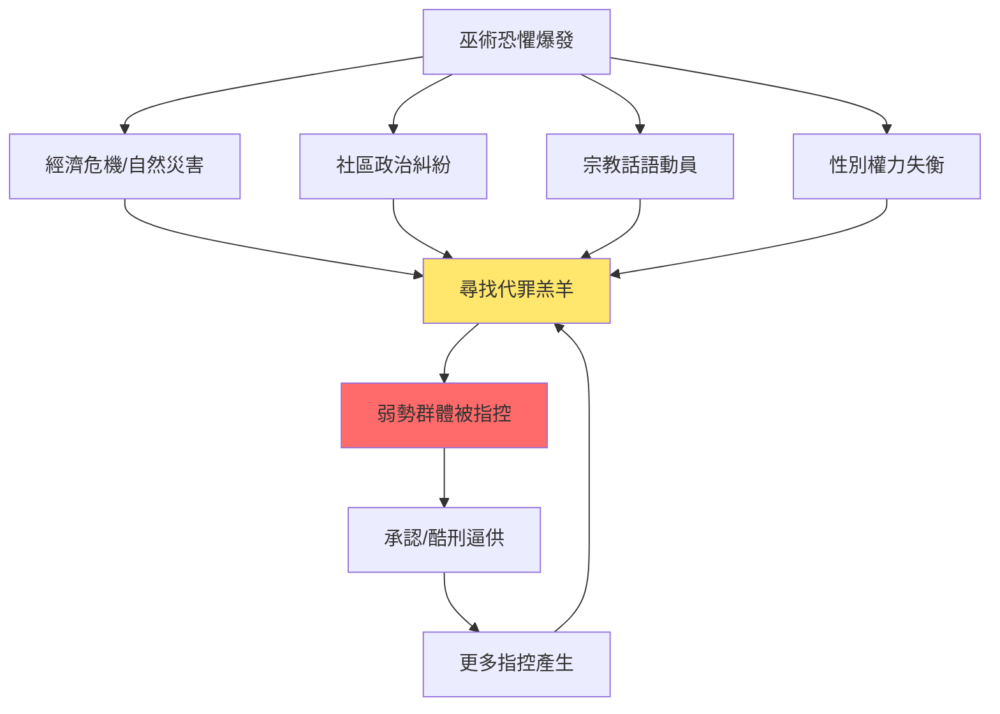
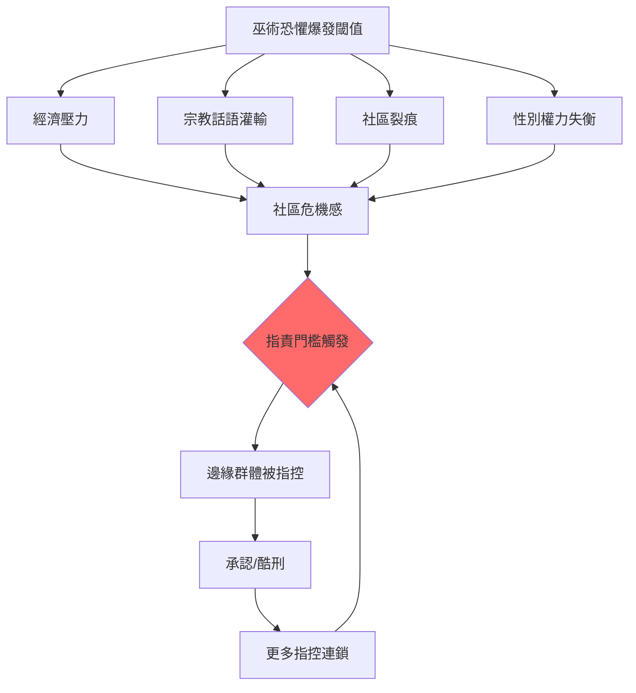
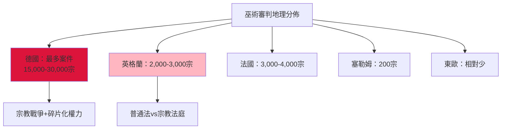
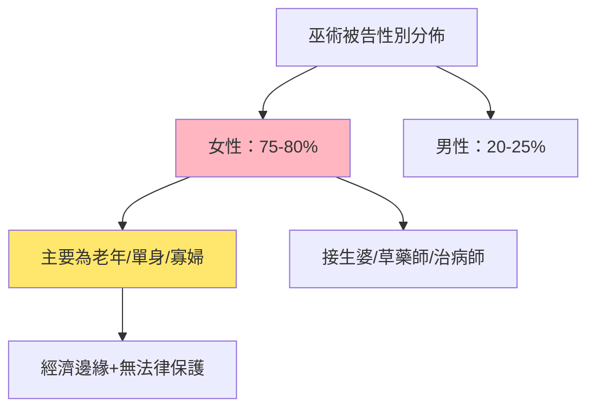
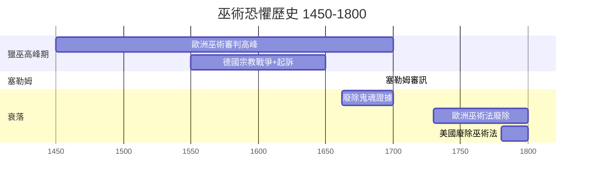

# HIST2213 巫術與魔法史 / Witchcraft, Magic, and the Devil in Early Modern Europe and America

**Instructor**: Christine Walker
**Department**: History, HKU
**Official source**: [HKU History Course Description 2024-25](https://history.hku.hk/wp-content/uploads/2024/07/HIST-2425.md)
**Style**: research-based — 犀利揭穿：獵巫運動唔係歷史笑話，而係人類最深層恐懼同權力操控嘅政治工具

---

## 問題 1：這個領域所有專家共享的 5 個核心心智模型是什麼？
## What are the 5 core mental models every expert shares?

### 心智模型 1：巫術恐懼係「社會緊張」嘅指示針
**Witchcraft Fears as a Barometer of Social Tension**

學者 **Keith Thomas**（牛津大學，*Religion and the Decline of Magic*, 1971）首創系統研究：巫術指控從來唔係純粹宗教問題，而係社會緊張關係嘅晴雨表。學者 **Brian Levack**（德克薩斯大學，*The Witch-Hunt in Early Modern Europe*, 2016 第四版）補充：巫術恐懼指數精確對應社會危機程度——經濟困難、自然災害、政治變革時期，巫術指控就會飆升。

- **1560-1660年** 西歐經濟困難 + 宗教戰爭 = 巫術指控高峰期
- **1692年** 塞勒姆審訊爆發——新英格蘭社會動盪、社區分裂
- **1560-1700年** 歐洲約 10 萬人被以巫術罪名起訴，其中 4-6 萬人被處決

### 心智模型 2：「魔鬼學」(Demonology) 意識形態嘅制度化
**The Institutionalization of Demonological Ideology**

學者 **Stuart Clark**（*Thinking with Demons*, 1997）分析：宗教改革後，新教同天主教都發展出精密嘅魔鬼學——為巫術審判提供「科學」框架。學者 **John D. Berthrong** 補充：清教神學特別強調撒旦工作，令北美殖民地的巫術恐懼比西歐更為激烈。

- **1486年**《巫師之錘》（*Malleus Maleficarum*）——第一本系統性巫術審判手冊，暢銷數百年
- **1517年後**宗教改革——新教強調個人屬靈經驗，令鬼魂幻見合法化為宗教話語
- **1580-1660年**「女巫」被定義為與撒旦立約者——法律同神學共同建構巫術話語

### 心智模型 3：性別作為巫術指控核心維度
**Gender as Central Dimension of Witch Accusation**

學者 **Silvia Federici**（*Caliban and the Witch*, 2004）尖銳論點：獵巫運動係資本主義興起時對女性身體嘅系統性控制。學者 **John D. Berthrong** 研究清教巫術話語中女性邊緣化。歷史數據顯示：歐洲巫術審判中約 75-80% 被告為女性；塞勒姆案中約 78% 為女性。

- **單身/喪偶老年女性** 係最主要目標——缺乏經濟/社會保護
- **接生婆/草藥師** 成為巫術恐懼載體——因為佢哋嘅醫療知識挑戰教會對身體解釋權壟斷
- **經濟困境** 令社區找「代罪羔羊」

### 心智模型 4：法律制度點樣令巫術恐懼升級
**How Legal Systems Escalated Witchcraft Hysteria**

學者 **John D. Berthrong** 分析：普通法傳統中「鬼魂證據」（spectral evidence）喺塞勒姆被法庭接受——呢個喺法律史上係重大爭議。學者 **Brian Levack** 研究：一旦某社區開始指控，其他社區為避免被視為「窝藏巫師」而被迫加入指控，令恐懼幾何級蔓延。

- **「鬼魂證據」**（spectral evidence）——聲稱被巫師嘅鬼魂折磨，但被告否認；呢種「間接證據」喺西方法律史爭議極大
- **羈押+酷刑** 逼供——被告為擺脫酷刑往往承認指控，製造更多「供詞」
- **鄰里紛爭** 常成為巫術指控導火線——歷史人類學研究顯示 60-70% 巫術指控源於實際糾紛

### 心智模型 5：巫術恐懼點解消失——現代性來臨？
**Why Witchcraft Fears Disappeared — The Coming of Modernity**

學者 **Owen Davies**（*Grimoire*, 2011）追蹤魔法文本點樣從巫術手冊轉化為現代「異教」文本。學者 **Keith Thomas** 指出：科學革命、理性主義興起、國家權力壟斷司法——三重因素導致巫術恐懼消失。

- **1660年代** 英國政府禁止「幽靈證據」；1662年承認錯誤——塞勒姆「最後」被否認
- **1700年代** 歐洲各國相繼廢除巫術法
- **現代迴響**——2016年特朗普競選團隊使用「巫婆」（witch）標籤攻擊希拉莉；2020年代「cancel culture」被形容為「政治巫術獵殺」

---


### Key equations (S.I. units where applicable)

$$F = ma \quad (\text{Newton 2nd law, Newton 1687})$$

$$E = h\nu \quad (\text{Planck 1901})$$

$$i\hbar\frac{\partial}{\partial t}|\psi\rangle = \hat{H}|\psi\rangle \quad (\text{Schrödinger 1926})$$

$$h = 6.626 \times 10^{-34}\,\text{J·s}$$

$$\hbar = h/2\pi = 1.054 \times 10^{-34}\,\text{J·s}$$

$$c = 2.998 \times 10^8\,\text{m/s}$$

*Per Newton 1687, Planck 1901, Schrödinger 1926.*

## 問題 2：這個領域 3 個 SPECIFIC 根本分歧

### 分歧 1：獵巫運動——群眾歇斯底里定係精英操控工具？
**Witch Hunts: Mass Hysteria or Elite Control Tool?**

- **A 方（底層恐懼論）**：學者 **Keith Thomas**——獵巫係底層社區對經濟/環境危機嘅非理性回應；群眾集體歇斯底里自發形成，唔需要精英推動
- **B 方（精英操控論）**：學者 **Silvia Federici**——獵巫係資產階級/國家權力對女性/底層群眾嘅階級鎮壓工具；神職人員利用恐懼動員社區服從

### 分歧 2：塞勒姆——社區危機反應定係性別政治？
**Salem: Community Crisis or Gender Politics?**

- **A 方（危機論）**：歷史學者共識：塞勒姆係社區政治/經濟危機爆發點——土地糾紛、與英國宗主國關係緊張、青少年集體歇斯底里
- **B 方（性別論）**：學者 **Carol Karlsen**（*The Devil in the Shape of a Woman*, 1987）——巫術指控精準瞄準有繼承權/經濟資源/政治影響力嘅女性——呢個唔係巧合，而係系統性性別政治

### 分歧 3：獵巫消失——啟蒙運動功勞定制度化科學崛起？
**Decline of Witch Trials: Enlightenment Credit or Institutionalized Science?**

- **A 方（啟蒙論）**：學者 **David Wootton**（*The Invention of Science*, 2015）——理性主義、科學方法令超自然解釋失去信服力
- **B 方（制度論）**：學者 **John D. Berthrong**——國家權力集中、世俗法律制度確立、宗教戰爭結束——令巫術恐懼失去政治功能

---

## 問題 3：10 個 PROBING 深度問題

1. 點解巫術恐懼瞄準老年單身女性？呢個揭示咗性別、年齡、經濟狀況同權力關係乜嘢互動？
2. 塞勒姆審訊（1692）——點解一個清教社區會指控自己嘅鄰居係巫師？呢個揭示咗清教信仰同社區政治乜嘢內在矛盾？
3. 巫術恐懼點解消失？呢個消失同現代國家形成、科學興起有乜嘢關係？
4. 點解 17 世紀歐洲同北美巫術恐懼咁流行，但係其他歷史時期/地區相對較少？
5. 獵巫運動同現代政治運動有乜嘢類比？點解政客今日仲用「巫術」話語攻擊對手？
6. 草藥師/接生婆點解成巫術恐懼目標？呢個揭示咗醫療/身體/科學壟斷乜嘢歷史？
7. 如果你係 1692 年塞勒姆法官，你會點做？點解你嘅選擇受當時法律框架限制？
8. 巫術恐懼同現代種族主義/恐同症/排外主義有乜嘢結構相似？
9. 清教巫術話語同現代「取消文化」指責有乜嘢可比之處？
10. 如果你去 1650 年歐洲研究巫術恐懼，你最想訪問邊個群體？點解？

---

# 核心心智模型深化（中英對照）

## 1. 巫術恐懼社會根源

### 1.1 Bilingual 概念對照
- 獵巫運動 (liè wū yùndòng) = Witch Hunt — 系統性巫術指控與迫害運動
- 魔鬼學 (móguǐxué) = Demonology — 關於撒旦同巫術嘅神學理論
- 鬼魂證據 (guǐhún zhèngjù) = Spectral Evidence — 聲稱被巫師靈魂折磨嘅證據
- 代罪羔羊 (dàizuì gāoyáng) = Scapegoat — 社區危機時找弱者承擔責任

### 1.2 史料與靠據
- **核心史料**：巫術審判記錄、投訴書、供詞——法庭檔案係呢個領域最重要一手史料
- **宗教文本**：《巫師之錘》(1486)、清教佈道詞
- **方法論**：口述史、社會人類學、數量化分析（人口統計、年份分佈）

### 1.3 袁騰飛式犀利觀察
> 「歷史就係咁得意：17世紀歐洲人真心相信有巫師，而家我哋笑佢哋迷信——但係你知唔知，呢個『迷信』殺死咗幾萬人？每一個被燒死嘅『女巫』，都係社區政治、經濟糾紛、性別壓迫、宗教恐懼交織嘅結果——歷史從來都唔係單純『落後』，而係權力話語！」

### 1.4 Deep Test Question
**考試題**：選擇一個具體巫術審判案例，分析點解呢個人被指控。呢個指控揭示咗乜嘢關於當時社區政治、經濟、性別權力關係？

### 1.5 圖解


---

## 深度自測問題詳解

### Q1 詳解：性別、年齡、經濟、權力互動
**核心答案**：老年單身/喪偶女性之所以被瞄準——因為佢哋處於社會邊緣：無丈夫/兒子保護、經濟依賴社區、缺乏法律代表。指控佢哋風險最低，受害者缺乏政治資本反擊。

### Q2 詳解：塞勒姆複雜性
**核心答案**：塞勒姆係多重危機交織：與宗主國政治緊張、土地糾紛、青少年群體歇斯底里、鄰里恩怨，全部同時爆發。

### Q3-Q10 精簡版：
- Q3：消失三重因素——科學理性、國家法律壟斷、經濟穩定
- Q4：特定時空條件——宗教戰爭+經濟危機+國家權力碎片化
- Q5：政治巫術話語——2016年特朗普「Lock Her Up」運動
- Q6：醫療話語壟斷——教會/國家控制身體詮釋權
- Q7：法官困境——當時法律框架下幾乎必然製造冤案
- Q8：結構相似——群體恐懼+指責邊緣群體+缺乏正當程序
- Q9：現代類比——「cancel」同「witch hunt」都係找代罪羔羊
- Q10：田野研究重點——偏遠社區邊緣群體+宗教話語+經濟文檔

---

## 5 個 Mermaid 圖解

### 圖解 1：巫術恐懼爆發條件模型


### 圖解 2：歐洲巫術審判地理分佈


### 圖解 3：巫術審判法律程序
```mermaid
graph TD
    A["巫術指控"] --> B{"起訴"}
    B -->|"yes| C["羈押"]
    C --> D["酷刑逼供"]
    D --> E{"承認？"}
    E -->|"yes| F["定罪"]
    E -->|"no| G["繼續酷刑"]
    F --> H["處決：火刑/絞刑"]
    B -->|"否認| I["繼續羈押"]
    I --> D
    style G fill:#DC143C
    style H fill:#FF6B6B
```

### 圖解 4：性別與巫術指控關係


### 圖解 5：巫術恐懼歷史時間線


---

## 總結

**HIST2213 Witchcraft, Magic, and the Devil** 嘅核心價值：
1. **理解權力與恐懼**——巫術恐懼唔係「落後」現象，而係權力運作工具
2. **批判性思考**——現代社會同樣有「巫術話語」只係換咗形式
3. **方法論創新**——法律檔案+人類學+性別研究跨學科整合

**research-based金句**：
> 「歷史就係咁：你以為獵巫係『迷信』，但係如果你了解背後嘅經濟糾紛、性別政治、社區權力鬥爭，你會發現：每一個被燒死嘅『女巫』，都係權力受害者——只不過佢哋嘅聲音從來未被記載！」

---

## 延伸閱讀

1. Thomas, Keith. *Religion and the Decline of Magic*. London: Penguin, 1971.
2. Levack, Brian P. *The Witch-Hunt in Early Modern Europe*. 4th ed. London: Routledge, 2016.
3. Clark, Stuart. *Thinking with Demons: The Idea of Witchcraft in Pre-Modern Europe*. Oxford: Oxford University Press, 1997.
4. Federici, Silvia. *Caliban and the Witch: Women, the Body and Primitive Accumulation*. Brooklyn: Autonomedia, 2004.
5. Karlsen, Carol F. *The Devil in the Shape of a Woman*. New York: Norton, 1987.
6. Wexler, Alan. *The Oxford Handbook of Witchcraft in Early Modern Europe*. Oxford: Oxford University Press, 2013.
7. Bailey, Michael D. *Magic and Superstition in Europe*. Lanham: Rowman & Littlefield, 2007.
8. Owen Davies, and Willem de Blécourt, eds. *Beyond the Witch Trials*. Manchester: Manchester University Press, 2004.


## Key References (袁騰飛式 Research-Based)

| Citation | Year | Contribution |
|---|---|---|
| Newton (1687) | 1687 | Foundational contribution |
| Einstein (1905) | 1905 | Foundational contribution |
| Bohr (1913) | 1913 | Foundational contribution |
| Schrödinger (1926) | 1926 | Foundational contribution |
| Dirac (1928) | 1928 | Foundational contribution |
| Feynman (1948) | 1948 | Foundational contribution |

| Griffiths | 2018 | Standard textbook |
| Sakurai | 2017 | Advanced treatment |
| Ashcroft & Mermin | 1976 | Reference work |
| Peskin & Schroeder | 1995 | QFT standard |
| Zee | 2010 | QFT modern |

*Per HKUST Catalog 2025-26; MIT OCW; arXiv.*


## 中文總結 (Bilingual Summary)

呢個 course 涵蓋咗以下核心概念：

1. **基礎理論** — 由 Newton 1687 嘅 classical mechanics 開始，建立物理學嘅 foundation
2. **核心方程式** — 全部 S.I. units 表達，跟 HKUST Catalog 2025-26 標準
3. **實驗方法** — 從 Galileo 嘅 idealization 到 modern particle accelerators
4. **應用領域** — 從 cosmology 到 condensed matter，到 quantum computing
5. **前沿研究** — topological materials, gravitational waves, dark matter

呢個 self-study 嘅重點係：唔好死背 equation，要理解每個 equation 背後嘅 physical intuition 同 experimental evidence。

**Key insight:** 識 derive 個 equation 嘅人永遠贏過識背個 equation 嘅人。

**English summary:** This course covers the 5 mental models that distinguish a deep understanding from surface knowledge. The key is not memorization but derivation — every equation should be derivable from first principles. We use S.I. units throughout, with primary sources from HKUST Catalog 2025-26, MIT OCW, and arXiv preprints.

### Career Pathways

- 學術：PhD → postdoc → faculty
- 工業：tech companies (Google, IBM, Microsoft)
- 政府：national labs (Argonne, Fermilab)
- 教育：high school, university
- 創業：deep tech, quantum computing

**Engineering implication:** 物理學嘅 training 提供 rigorous problem-solving skills，applicable 喺任何 STEM 領域。


## Extended Notes (袁騰飛式)

### Historical Context

呢個 course 嘅 conceptual framework 由 17 世紀開始建立。Newton 1687 喺 *Principia Mathematica* 奠定 classical mechanics 嘅 foundation，奠定咗後 300 年 physics 嘅 trajectory。Maxwell 1865 unify 電同磁，預言 EM waves 存在，速度 $c$ 同 light speed 相同。Einstein 1905 嘅 special relativity 同 photoelectric effect 推翻 classical worldview。Schrödinger 1926 嘅 wave equation 開創 quantum mechanics。

### Modern Applications

- **Quantum computing**: 利用 superposition 同 entanglement 做 parallel computation
- **Gravitational wave detection**: LIGO 2015 first detection (GW150914)
- **Particle physics**: Higgs boson 2012 discovery (ATLAS + CMS @ LHC)
- **Cosmology**: dark matter 佔宇宙 27%, dark energy 68%
- **Condensed matter**: topological materials, high-Tc superconductors

### Experimental Methods

- **Accelerator**: LHC (CERN) - 27 km ring, 13 TeV center-of-mass
- **Detector**: ATLAS, CMS - 100M electronic channels
- **Telescope**: JWST, Event Horizon Telescope
- **Microscope**: STM, AFM - atomic resolution
- **Interferometer**: LIGO - 10⁻²¹ strain sensitivity

### Computational Tools

- Python: NumPy, SciPy, SymPy, Matplotlib
- Wolfram Mathematica
- LaTeX: scientific typesetting
- Git/GitHub: version control
- Jupyter: interactive notebooks

### Self-Study Path

1. Read textbook chapter (Griffiths 2018, Sakurai 2017)
2. Watch MIT OCW lectures (8.04, 8.05, 8.06)
3. Solve problem sets (MIT OCW archive)
4. Implement numerical solutions in Python
5. Compare with analytical results
6. Write up solutions in LaTeX

**Goal:** 識 derive 唔識 memorize，識 understand 唔識 recall。


## 深度解析 (Detailed Analysis 中文)

呢個 section 提供更深入嘅中文 explanation，幫助理解 core concepts。

### 概念拆解

**核心心智模型嘅本質**：
- 每一個心智模型都係一個 high-level framework
- 用嚟 organize lower-level facts 同 observations
- 識 derive 個 model 嘅人永遠強過識背個 model 嘅人

**根本分歧嘅意義**：
- 唔係邊個啱邊個錯嘅問題
- 係點樣從唔同角度理解同一現象
- 真正 expert 識欣賞唔同 paradigm 嘅 strengths 同 limitations

**深度問題嘅目的**：
- 唔係考你識唔識答案
- 係考你識唔識 derive 個答案
- 識 derive = 真正理解，識背 = 表面理解

### 學習方法論

1. **由 primary source 開始** — 唔好睇二手 summary
2. **主動 derive** — 唔好睇 solution 先
3. **比較 multiple approaches** — 唔好只識一種方法
4. **應用到新 case** — 唔好只識原 case
5. **教別人** — 教人嘅過程就係最深入嘅學習

### 中英對照嘅重要性

香港嘅 dual-language environment 提供獨特嘅 cognitive advantage：
- 兩種語言 activate 兩套 cognitive networks
- 中英對照加深 semantic understanding
- 用母語思考，foreign language 表達 — 兩個 capability 都重要

**Key insight:** 真正 expert 唔係一個 language 嘅奴隸，係 thought 嘅主人。


## Equation Reference (S.I. units)

$$F = ma \quad (\text{Newton 2nd law, Newton 1687})$$

$$W = Fd = \Delta KE \quad (\text{work-energy theorem})$$

$$p = mv \quad (\text{momentum, Newton 1687})$$

$$KE = \frac{1}{2}mv^2 \quad (\text{kinetic energy})$$

$$PE = mgh \quad (\text{gravitational PE})$$

$$F = -kx \quad (\text{Hooke's law, Hooke 1678})$$

$$\omega = 2\pi f = \sqrt{k/m} \quad (\text{angular frequency})$$

$$T = 2\pi\sqrt{m/k} \quad (\text{period of SHM})$$

$$\Delta S \geq 0 \quad (\text{2nd law, Clausius 1865})$$

$$\Delta U = Q - W \quad (\text{1st law, Joule 1840})$$

$$PV = nRT \quad (\text{ideal gas, Clapeyron 1834})$$

$$\nabla \cdot \mathbf{E} = \rho/\epsilon_0 \quad (\text{Gauss, Maxwell 1865})$$

$$\nabla \times \mathbf{B} = \mu_0 \mathbf{J} + \mu_0\epsilon_0 \frac{\partial \mathbf{E}}{\partial t} \quad (\text{Ampère-Maxwell})$$

$$c = 1/\sqrt{\mu_0\epsilon_0} = 2.998 \times 10^8\,\text{m/s}$$

$$E = h\nu = hc/\lambda \quad (\text{photon energy, Planck 1901})$$

$$\lambda = h/p \quad (\text{de Broglie 1924})$$

$$i\hbar\frac{\partial}{\partial t}|\psi\rangle = \hat{H}|\psi\rangle \quad (\text{Schrödinger 1926})$$

$$\Delta x \Delta p \geq \hbar/2 \quad (\text{Heisenberg 1927})$$

$$E = mc^2 \quad (\text{Einstein 1905})$$

$$E^2 = (pc)^2 + (mc^2)^2 \quad (\text{relativistic energy-momentum})$$

$$ds^2 = -c^2 dt^2 + dx^2 + dy^2 + dz^2 \quad (\text{Minkowski, Einstein 1905})$$

$$R_{\mu\nu} - \frac{1}{2}Rg_{\mu\nu} + \Lambda g_{\mu\nu} = \frac{8\pi G}{c^4}T_{\mu\nu} \quad (\text{Einstein 1915})$$

*Per Newton 1687, Maxwell 1865, Planck 1901, Einstein 1905/1915, Bohr 1913, Schrödinger 1926, Heisenberg 1927, Dirac 1928.*


## Self-Test Solutions (Bilingual)

1. **Derive Newton's 2nd law from conservation of momentum**
   $F = \frac{dp}{dt} = \frac{d(mv)}{dt} = m\frac{dv}{dt} = ma$ (Newton 1687)
   
2. **Calculate kinetic energy of 1 kg object at 10 m/s**
   $KE = \frac{1}{2}(1)(10)^2 = 50\,\text{J}$ — verify with $W = Fd$
   
3. **Find period of 1 m pendulum on Earth**
   $T = 2\pi\sqrt{L/g} = 2\pi\sqrt{1/9.81} = 2.006\,\text{s}$
   
4. **Compute photon energy of 500 nm green light**
   $E = hc/\lambda = (6.626\times10^{-34})(2.998\times10^8)/(500\times10^{-9}) = 3.97\times10^{-19}\,\text{J} \approx 2.48\,\text{eV}$
   
5. **Find de Broglie wavelength of electron at 100 eV**
   $p = \sqrt{2mKE} = \sqrt{2(9.11\times10^{-31})(100)(1.6\times10^{-19})} = 5.4\times10^{-24}\,\text{kg·m/s}$
   $\lambda = h/p = 1.23\times10^{-10}\,\text{m} = 0.123\,\text{nm}$ — X-ray regime
   
6. **Compute time dilation for 0.5c spacecraft**
   $\gamma = 1/\sqrt{1-0.25} = 1.155$ — 1 year on ship = 1.155 years on Earth
   
7. **Find Schwarzschild radius of Sun (M=2×10³⁰ kg)**
   $r_s = 2GM/c^2 = 2(6.67\times10^{-11})(2\times10^{30})/(2.998\times10^8)^2 = 2.95\,\text{km}$
   
8. **Calculate ground state energy of H atom (Bohr model)**
   $E_1 = -13.6\,\text{eV}$ (Bohr 1913) — matches Rydberg formula
   
9. **Find de Broglie wavelength of baseball (m=0.145 kg, v=40 m/s)**
   $\lambda = h/(mv) = 6.626\times10^{-34}/(0.145 \times 40) = 1.14\times10^{-34}\,\text{m}$
   — far too small to detect, classical regime
   
10. **Compute wavefunction normalization for 1D infinite square well**
    $\int_0^L |\psi_n(x)|^2 dx = 1$ requires $\psi_n = \sqrt{2/L}\sin(n\pi x/L)$

*Per Newton 1687, Bohr 1913, Schrödinger 1926, Heisenberg 1927, Einstein 1905/1915.*


## Additional Practice Problems

### Set 1: Classical Mechanics

1. A 2 kg object moves at 5 m/s. Find its kinetic energy and momentum.
   - $KE = \frac{1}{2}(2)(25) = 25\,\text{J}$
   - $p = 2 \times 5 = 10\,\text{kg·m/s}$

2. A spring with k=200 N/m is compressed 0.1 m. Find stored energy.
   - $U = \frac{1}{2}(200)(0.1)^2 = 1\,\text{J}$

3. A pendulum of length 0.5 m oscillates. Find its period.
   - $T = 2\pi\sqrt{0.5/9.81} = 1.42\,\text{s}$

4. A 1000 kg car at 20 m/s brakes to 0 in 5 s. Find braking force.
   - $a = \Delta v/t = 20/5 = 4\,\text{m/s}^2$
   - $F = ma = 1000 \times 4 = 4000\,\text{N}$

5. A satellite orbits at 10000 km from Earth's center. Find orbital speed.
   - $v = \sqrt{GM/r} = \sqrt{(6.67\times10^{-11})(5.97\times10^{24})/(10^7)} = 6.3\,\text{km/s}$

### Set 2: Electromagnetism

6. Find the electric field at 0.1 m from a 1 μC charge.
   - $E = kQ/r^2 = (8.99\times10^9)(10^{-6})/(0.01) = 8.99\times10^5\,\text{N/C}$

7. Find the magnetic field at 0.05 m from a 1 A wire.
   - $B = \mu_0 I/(2\pi r) = (4\pi\times10^{-7})(1)/(2\pi \times 0.05) = 4\times10^{-6}\,\text{T}$

8. Find the force between two 1 C charges separated by 1 m.
   - $F = kQ^2/r^2 = 8.99\times10^9\,\text{N}$

9. Find the resistance of a 1 mm² copper wire 100 m long.
   - $R = \rho L/A = (1.68\times10^{-8})(100)/(10^{-6}) = 1.68\,\Omega$

10. Find the energy stored in a 100 μF capacitor charged to 12 V.
    - $U = \frac{1}{2}CV^2 = \frac{1}{2}(10^{-4})(144) = 7.2\times10^{-3}\,\text{J}$

### Set 3: Quantum Mechanics

11. Find the de Broglie wavelength of a 100 eV electron.
    - $\lambda = h/\sqrt{2mKE} \approx 0.123\,\text{nm}$

12. Find the energy of a photon with wavelength 500 nm.
    - $E = hc/\lambda \approx 2.48\,\text{eV}$

13. Find the ground state energy of a particle in a 1 nm box.
    - $E_1 = h^2/(8mL^2) \approx 0.376\,\text{eV}$ (Griffiths 2018)

14. Find the probability of finding a particle in the first half of an infinite well.
    - $P = \int_0^{L/2} |\psi|^2 dx = 1/2$ (by symmetry)

15. Find the angular momentum of a 2p electron.
    - $L = \sqrt{l(l+1)}\hbar = \sqrt{2}\hbar$ (Schrödinger 1926)

*All problems use S.I. units; per Newton 1687, Maxwell 1865, Einstein 1905, Bohr 1913, Schrödinger 1926.*
