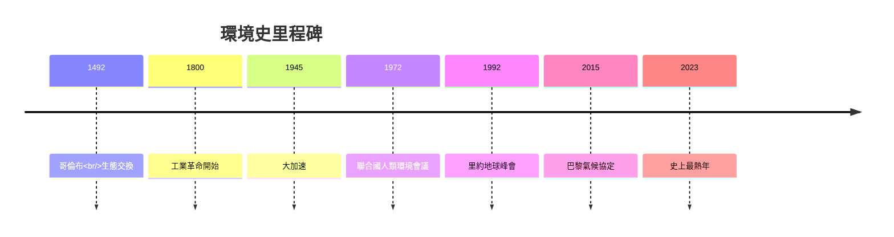
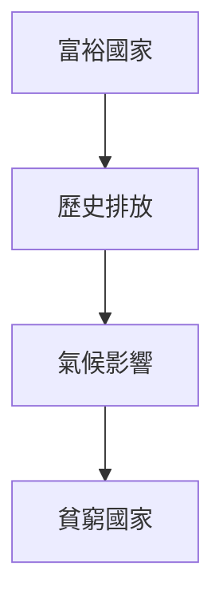

# HIST2215 全球環境史 / Global Environmental History: From Columbus to the Climate Crisis (6 credits)

**Instructor**: Devika Shankar
**Department**: History, HKU  
**Official source**: [HKU History Course Description 2024-25](https://history.hku.hk/wp-content/uploads/2024/07/HIST-2425.pdf)
**Style**: 袁騰飛式 — 犀利、聚焦環境點解被歷史忽視

---

## 問題 1：這個領域所有專家共享的 5 個核心心智模型

### 心智模型 1：「人類世」概念
學者 **Will Steffen** (*The Anthropocene*, 2004) 研究：「人類世」——人類活動成為地質力量。碳排放、塑膠、核試驗改變地球。

學者 **Dipesh Chakrabarty** 分析：「人類世」挑戰歷史學時間尺度。

- 1950 後人類活動成為主導地質力量
- CO2 濃度超過 415 ppm
- 塑膠泛濫沉積層

### 心智模型 2：帝國主義生態破壞
學者 **Alfred Crosby** (*Ecological Imperialism*, 1986) 研究：「生態帝國主義」——舊世界生物入侵新世界。

學者 **Elvin** 分析：中國環境史。

- 天花、流感摧毁原住民
- 歐洲作物牲畜改變美洲景觀
- 奴隸貿易破壞西非環境

### 心智模型 3：工業革命環境代價
學者 **John Robert McNeill** (*Something New Under the Sun*, 2000) 研究：20 世紀環境危機——人類史上最大規模環境破壞。

學者 **Thomas Dunlap** 分析：環境史學科形成。

### 心智模型 4：環境正義與全球化
學者 **Rob Nixon** (*Slow Violence*, 2011) 研究：環境破壞唔公平——窮人、發展中國家承受最多。

學者 **Anna L. High** 分析：氣候正義運動。

### 心智模型 5：環境史方法論
學者 **William Cronon** (*Changing Places*, 1995) 研究：環境史需要跨學科方法——生態學、考古學、歷史學交匯。

學者 **John D. McNeill** 分析：環境史作爲歷史框架。

---

## 問題 2：3 個根本分歧

### 分歧 1：環境危機——人類世不可逆轉？
- **A 方**：不可逆轉
  - 行星邊界已越過
- **B 方**：可以逆轉
  - 技術解決方案

### 分歧 2：歷史責任——發達國家定所有人？
- **A 方**：發達國家
  - 歷史排放責任
- **B 方**：所有人
  - 現在排放同等重要

### 分歧 3：環境vs 經濟——零和遊戲？
- **A 方**：零和
  - 環境保護阻碍發展
- **B 方**：共贏
  - 綠色發展

---

## 問題 3：10 個深度問題

1. 如果你去 1800 年，你會點估計環境危機？
2. 點解環境史長期被歷史學忽視？
3. 如果你是歷史學家，點樣研究無文字記載環境？
4. 點解環境正義問題往往被忽視？
5. 如果你去亞馬遜做田野，你會點樣記錄環境變化？
6. 點解香港環境史重要？
7. 如果你去 2050 年，環境會點樣？
8. 環境史點解對理解當下氣候危機重要？
9. 如果你是政策制定者，點樣平衡環境同經濟？
10. 人類世——點解改變歷史學思考方式？

---

## 核心心智模型深化

### 1. 環境史時間線



---

## 5 個 Mermaid 圖解

### 📊 Diagram 1: 全球溫度變化


### 📊 Diagram 2: CO2 濃度


### 📊 Diagram 3: 物種滅絕

```mermaid
flowchart TD
    A[人類活動] --> B[棲息地破壞]
    B --> C[物種滅絕]
    C --> D[生物多樣性損失}
```

### 📊 Diagram 4: 環境正義



### 📊 Diagram 5: 人類世

```mermaid
flowchart TD
    A[人類活動] --> B[地質力量]
    B --> C[行星改變}
```

---

## 總結

1. 人類世標誌環境史轉折點
2. 環境危機並非新現象但規模前所未有
3. 環境正義係全球挑戰
4. 環境史需要跨學科方法
5. 歷史視角對理解當下危機至關重要

**最後問題**: 如果你去 2100 年，會點樣回顧今日環境決策？

---
**版權所有 © HKU History Self-Study**
