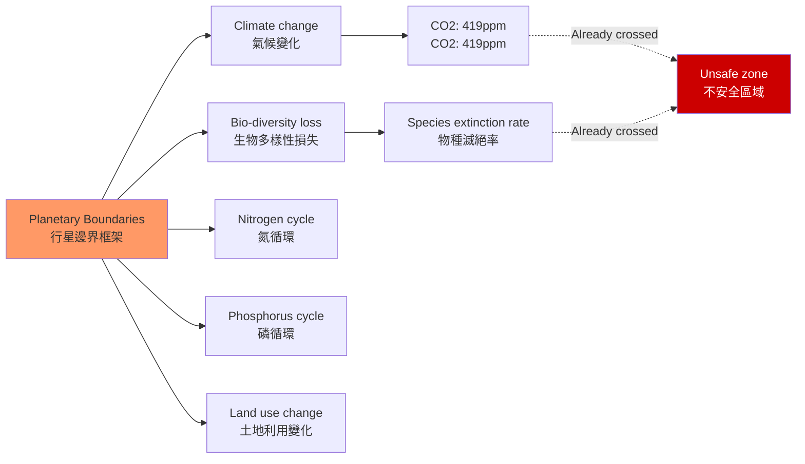
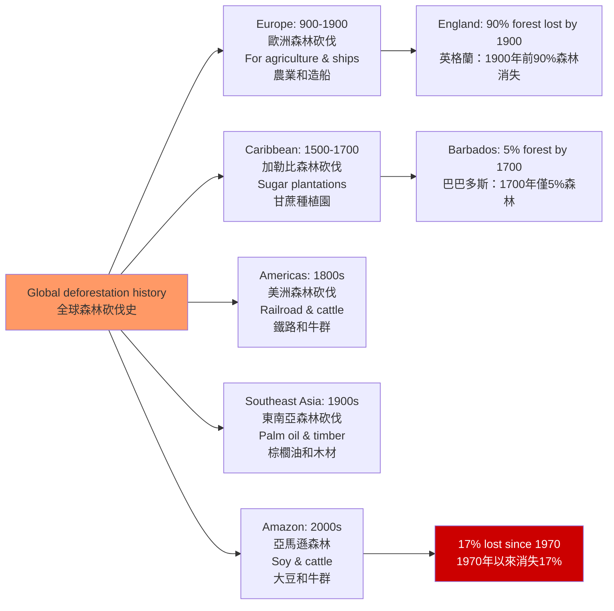
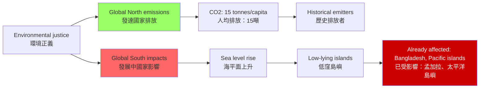

# HIST2215 全球環境史 / Global Environmental History

**Instructor**: HKU History Staff
**Department**: History, HKU
**Official source**: [HKU History Course Description](https://history.hku.hk/ug_cd/)
**Style**: 袁騰飛式 — 犀利、聚焦人類與自然的權力關係——環境從來不是中性的背景，它是歷史的主體之一

---

## 問題 1：5 個核心心智模型

### 1. 人類世的提出（The Anthropocene）
2000 年，大氣化學家 Paul Crutzen 和 Eugene Stoermer 提出了「人類世」（Anthropocene）概念——地質學的一個新時代，其特徵是人類活動對地球系統的根本性改變。學者 **Will Steffen** 等人在 *Science* (2011) 上發表了「行星邊界」（Planetary Boundaries）框架，試圖量化人類對地球系統的影響程度。

### 2. 哥倫布交換的生態學（The Columbian Exchange Revisited）
延續 Alfred Crosby 的理論，學者 **Charles Mann** 在 *1491* (2005) 中運用最新考古證據，重構了美洲原住民文明在哥倫布抵達前的輝煌程度，並揭示了疾病生態學在帝國主義擴張中的關鍵角色。

### 3. 森林砍伐與帝國主義（Deforestation and Imperialism）
學者 **Gregory Cushman** 和 **Michael Williams** 研究：歐洲帝國主義在全球範圍內的森林砍伐（從英格蘭到印度到 Caribbean）如何服務於帝國的軍事和經濟需求。

### 4. 氣候變化作為歷史因素（Climate as Historical Agent）
學者 **Brian Fagan** 在 *The Great Warming* (2008) 中論證：中世紀暖期（900-1300）和小冰期（1300-1850）對農業生產、社會穩定和歷史衝突有著決定性影響。

### 5. 環境正義與全球不平等（Environmental Justice）
學者 **Rob Nixon** 在 *Slow Violence* (2011) 中提出「慢暴力」（slow violence）概念——環境退化對弱勢群體造成的長期傷害，往往被社會所忽視。

---

## 問題 2：3 個根本分歧

### 分歧 1：人類世——地質學事實 vs 政治話語？
「人類世」是一個地質學的事實，還是環境政治話語的科學包裝？學者之間對人類世作為地質時代正式命名的科學根據和社會政治意義存在根本分歧。

### 分歧 2：環境退化——市場失敗 vs 結構性帝國主義？
環境退化是「市場失靈」（缺乏環境成本內部化）的結果，還是帝國主義和資本主義結構性剝削的必然？

### 分歧 3：氣候變化歷史——科學共識 vs 政治否認？
---

## 問題 3：10 個深度問題

1. **「人類世」的定義問題**：人類世的正式起點應該定在哪一年？1950 年（核試驗的放射性同位素標記）？1800 年（工業革命）？還是 1610 年（哥倫布交換導致的生物多樣性低點）？
2. **小冰期與歷史衝突**：1300-1850 年的小冰期對歐洲農業生產、社會穩定和農民起義有什麼具體影響？明清小冰期與王朝末期農民起義之間的生態聯繫是什麼？
3. **亞馬遜熱帶雨林砍伐**：為什麼亞馬遜雨林正在被大規模砍伐？這種砍伐與全球肉類消費（巴西大豆餵養牛群）、巴西的土地不平等（大地產 vs 小農）和國際大宗商品價格之間的關係是什麼？
4. **中國的環境退化史**：從黃河流域的森林砍伐（公元前 1000 年到公元 1000 年）到當代霧霾（2010 年代），中國環境史揭示了什麼樣的人與自然關係模式？
5. **香港的環境史**：香港從一個綠色島嶼（1840 年代）到全球最城市化的地方之一（2020 年代），其環境變遷是什麼？維多利亞港的填海工程（由 1842 年的 5.7 平方公里縮小至 2010 年的約 3.4 平方公里）對海洋生態有什麼影響？
6. **「慢暴力」與環境不公**：為什麼環境退化對窮人和邊緣群體的傷害往往被主流媒體和公眾忽視？這種「慢暴力」的受害者如何組織起來抵抗？
7. **核能在環境史中的位置**：核能作為低碳能源的環境收益 vs 核事故（切爾諾貝利1986年， Fukushima 2011年）的環境破壞——如何在環境正義框架中權衡？
8. **海洋塑料污染的歷史**：從什麼時候開始，塑料從「拯救世界的發明」（1950 年代）變成了「環境災難」的象徵？這種認識轉變背後的社會運動和科學研究是什麼？
9. **帝國主義與外來物種入侵**：英國人在全球範圍內引進物種（如 兔子和狐狸引進澳洲，仙人掌引進南非）作為打獵對象，這種「生態帝國主義」的長期環境後果是什麼？
10. **當代碳減排的歷史背景**：當代碳減排政策的歷史根源可以追溯到 1992 年里約地球峰會、1997 年《京都議定書》和 2015 年《巴黎協定》——這些國際環境協定的歷史成功和失敗是什麼？

---

# 核心心智模型深化（中英對照）

## 1. 人類世

### 1.1 圖解：人類世的行星邊界

---

## 2. 森林砍伐與帝國主義

### 2.1 圖解：全球森林砍伐的歷史

---

## 3. 環境正義

### 3.1 圖解：全球環境不平等的地理

---

# 總結

1. **環境史告訴我們：人類從來不是自然的「管理者」——人類是自然的一部分，在自然的限制和可能中創造歷史**。

2. **「人類世」的提出迫使我們承認：我們的技術能力已經足以摧毁地球系統的穩定性——這種承認是環境政治的必要起點**。

3. **環境退化不是「技術問題」，而是權力問題**：誰承受環境退化的代價，往往是社會中最弱勢的群體——窮人、少數族裔、發展中國家。

4. **中國的環境史是全球環境史的重要組成部分**：從黃河流域的文明衰落到當代的霧霾和塑膠污染，這段歷史揭示了環境與權力之間的深層聯繫。

5. **環境行動的緊迫性**：科學共識是明確的——如果全球升溫超過 1.5°C，將帶來不可逆轉的氣候災難。但這種科學共識轉化為有效政治行動的過程，充滿了政治、經濟和意識形態的障礙。

**自學建議**: 配合 Alfred Crosby 的 *Ecological Imperialism* + Brian Fagan 的 *The Great Warming*，輸出讀書筆記到 `06_Reading_Notes/`。
