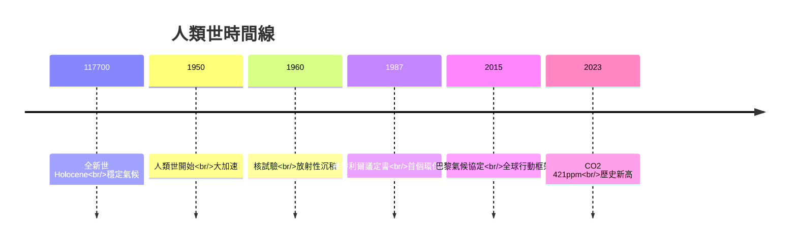
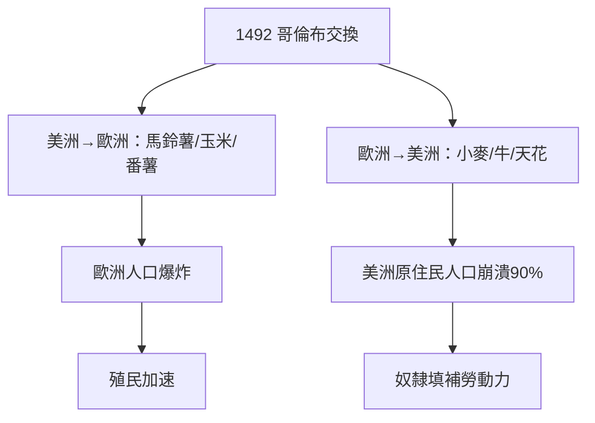
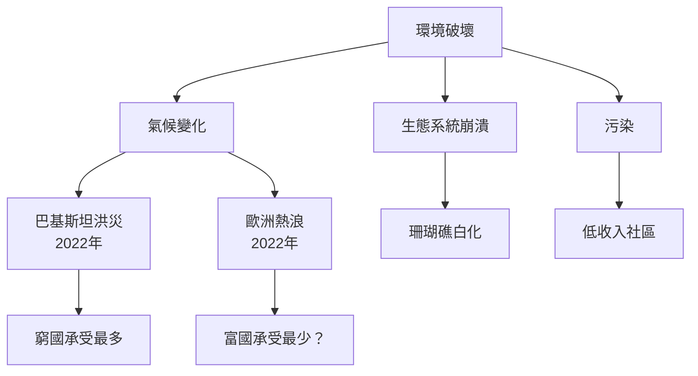
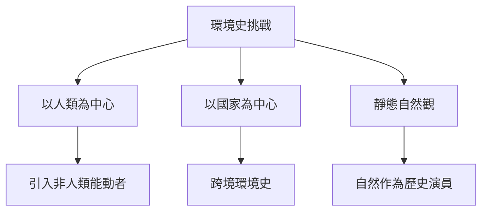
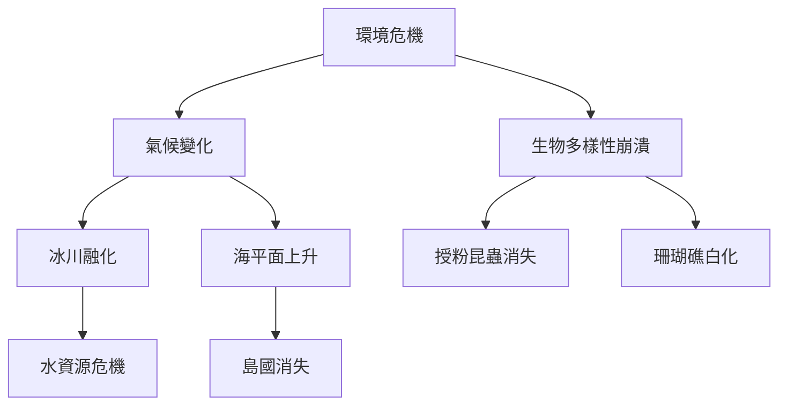
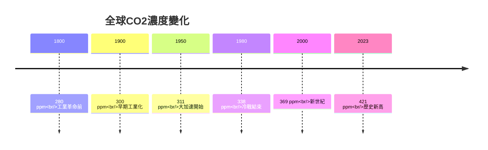
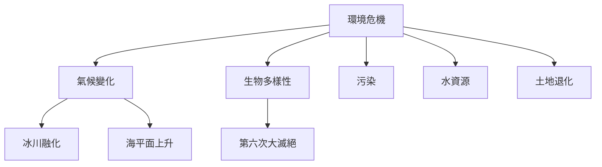
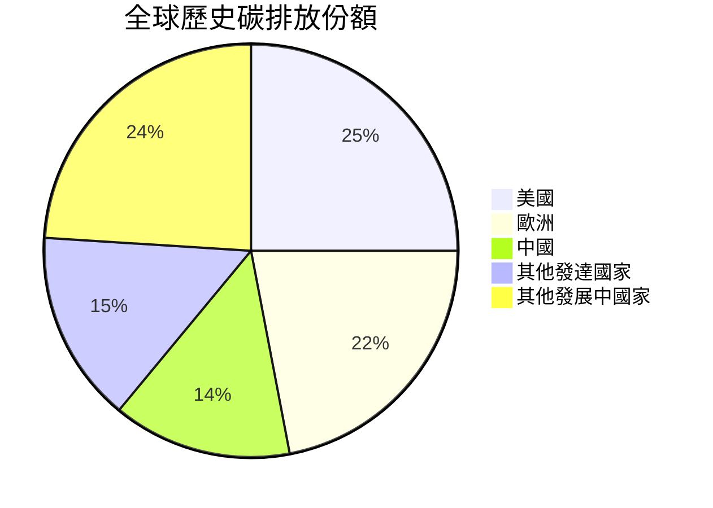
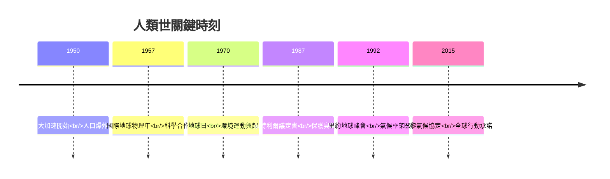
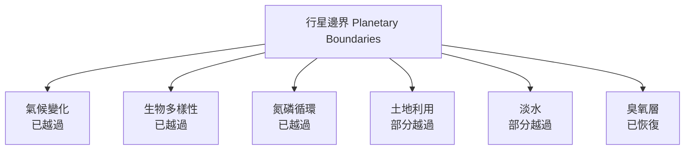

# HIST2215 全球環境史 / Global Environmental History: From Columbus to the Climate Crisis (6 credits)

**Instructor**: Devika Shankar
**Department**: History, HKU
**Official source**: [HKU History Course Description 2024-25](https://history.hku.hk/wp-content/uploads/2024/07/HIST-2425.pdf)
**Style**: 袁騰飛式 — 犀利、聚焦環境點解長期被歷史學忽視——但係環境先係歷史嘅真正舞臺

---

## 問題 1：這個領域所有專家共享的 5 個核心心智模型

### 心智模型 1：「人類世」(Anthropocene) 概念
學者 **Will Steffen** (*The Anthropocene*, 2004) 研究：「人類世」——地質學家正式承認人類活動已成為改變地球嘅主導力量。

學者 **Dipesh Chakrabarty** 分析：「人類世」挑戰歷史學時間尺度——歴史學向來研究幾百年，但係「人類世」横跨地質時間。

- 1950年：「大加速」(Great Acceleration) ——二戰後人類活動急劇增加
- CO2濃度：工業革命前280ppm → 2023年420ppm（創歷史新高）
- 塑料微粒已沉積到大西洋深海
- 核試驗放射性沉積物：地質層永久標誌

### 心智模型 2：生態帝國主義 (Ecological Imperialism)
學者 **Alfred Crosby** (*Ecological Imperialism*, 1986) 研究：「生態帝國主義」——舊世界生物入侵新世界，呢個過程塑造咗美洲歷史。

學者 **Elvin** 分析：中國環境史研究——中華文明環境適應與破壞。

- 1492年哥倫布抵達——天花、流感隨即摧毁原住民90%人口
- 歐洲作物（小麦、牛、馬）改變美洲景觀
- 蔗糖種植園摧毁加勒比森林
- 奴隸貿易破壞西非生態

### 心智模型 3：工業革命環境代價
學者 **John Robert McNeill** (*Something New Under the Sun*, 2000) 研究：20世紀環境危機——人類史上最大規模環境破壞，但係被歷史學嚴重忽視。

學者 **Thomas Dunlap** 分析：環境史學科形成——1970年代環境運動催生環境史學。

- 1800年：工業革命開始——煤炭使用急增
- 1900年：石油時代開始
- 1950年：「大加速」——全球經濟每年增長3-4%
- 1987年：蒙特利爾議定書——首個全球環保條約

### 心智模型 4：環境正義與全球化
學者 **Rob Nixon** (*Slow Violence*, 2011) 研究：「慢暴力」——環境破壞唔係單一災難事件，而係長期漸進過程，往往被媒體忽視。

學者 **Anna L. High** 分析：氣候正義運動——環境破壞唔公平——窮人、發展中國家承受最多。

- 孟加拉國洪災威脅數百萬人——但係媒體曝光極少
- 亞馬遜雨林消失——但係經濟利益優先
- 珊瑚礁白化——2023年大堡礁第四次大規模白化

### 心智模型 5：環境史方法論
學者 **William Cronon** (*Changing Places of Nature*, 1995) 研究：環境史需要跨學科方法——生態學、考古學、歷史學交匯。

學者 **John D. McNeill** 分析：環境史作為歷史框架——挑戰以人類為中心嘅歷史敘事。

- 歷史學需要容納非人類行動者——動物、植物、微生物、氣候
- 「自然」並非靜態背景，而係歷史嘅能動者
- 環境史挑戰「進步」敘事

---

## 問題 2：3 個根本分歧

### 分歧 1：環境危機——人類世不可逆轉？
- **A 方**：不可逆轉
  - 行星邊界 (Planetary Boundaries) 已越過多條
  - 珊瑚礁白化、冰川融化不可逆轉
  - 引用：Steffen: 人類已改變地球地質
- **B 方**：可以逆轉
  - 技術解決方案（碳捕捉、再生能源）
  - 引用：經濟學家：人類適應能力被低估

### 分歧 2：歷史責任——發達國家定所有人？
- **A 方**：發達國家歷史責任
  - 1850-2023年，美國、歐洲排放大部分CO2
  - 人均歷史排放：美國人係印度人30倍
- **B 方**：所有人共同責任
  - 中國、印度現時排放量已超越發達國家
  - 現在排放同樣重要

### 分歧 3：環境vs經濟——零和遊戲？
- **A 方**：零和
  - 環境保護阻碍經濟發展
  - 化石燃料就業
- **B 方**：共贏
  - 綠色新政創造就業
  - 再生能源成本已低於化石燃料

---

## 問題 3：10 個深度問題

1. 如果你去1800年工業革命現場，你會點估環境危機？
2. 點解環境史長期被歷史學忽視？呢個揭示咗歷史學嘅邊啲預設？
3. 如果你去亞馬遜做田野，你會點樣記錄環境變化？點解自然科學同人文科學方法好唔同？
4. 點解「慢暴力」(slow violence) 呢個概念咁重要？但係媒體點解偏向即時災難？
5. 如果你去1850年英國工廠，你會發現乜嘢關於工人健康同環境污染嘅問題？
6. 點解珊瑚礁白化事件被稱為「看不見的災難」？呢個揭示咗環境正義乜嘢問題？
7. 如果你去2050年，環境會點樣？預測可靠嗎？
8. 環境史點解對理解當下氣候危機重要？但係歷史學家有乜嘢獨特貢獻？
9. 如果你是政策制定者，點樣平衡環境同經濟？但係點解呢個問題本身就充滿政治？
10. 人類世——點解呢個概念改變咗歷史學思考方式？

---

## 核心心智模型深化（中英對照）

## 1. 人類世 (Anthropocene)

### 1.1 Bilingual 概念對照
| 英文概念 | 中英對照 | 歷史含義 | 數字 |
|---|---|---|---|
| Anthropocene | 人類世 | 人類活動改變地球地質 | 1950年起 |
| Great Acceleration | 大加速 | 1950年後人類活動急增 | 3-4%年增長 |
| Planetary Boundaries | 行星邊界 | 地球承載力上限 | 9條邊界 |
| Carbon ppm | 碳濃度 | 大氣CO2含量 | 420ppm |
| Extinction Rate | 滅絕率 | 物種消失速度 | 1000倍自然速率 |

### 1.2 史料與考據
- Will Steffen: "The Anthropocene" (2004)
- Dipesh Chakrabarty: "The Climate of History" (2009)
- Crutzen & Stoermer: "The Anthropocene" (2000)

### 1.3 袁騰飛式犀利觀察
Crutzen提出「人類世」概念那一刻，歷史學必須重新思考：我哋唔只係歷史嘅作者，仲係地球地質嘅作者。
呢個揭示咗人類前所未有的責任——我哋嘅行為已經改變地球地質層，呢個改變會持續千萬年。

### 1.4 Deep test question
- 如果你去地質層入面揾2023年嘅沉積物，你會發現乜嘢關於人類文明嘅證據？

### 1.5 圖解

---

## 2. 生態帝國主義 (Ecological Imperialism)

### 1.1 Bilingual 概念對照
| 英文概念 | 中英對照 | 歷史含義 | 案例 |
|---|---|---|---|
| Columbian Exchange | 哥倫布交換 | 1492年後生物跨境 | 馬鈴薯/天花 |
| Biological Invasion | 生物入侵 | 物種跨境破壞生態 | 兔子入侵澳洲 |
| Plantation Ecology | 種植園生態 | 生態破壞與奴隸制 | 蔗糖森林 |
| Deforestation | 森林破壞 | 土地利用改變 | 亞馬遜消失 |
| Zoonotic Disease | 人畜共通病 | 生態破壞導致疫病 | COVID-19 |

### 1.2 史料與考據
- Alfred Crosby: Ecological Imperialism (1986)
- Charles Mann: 1493 (2011)

### 1.3 袁騰飛式犀利觀察
Crosby最犀利嘅發現：1492年後，唔係人類征服美洲，而係舊世界生物征服美洲——天花消滅90%原住民人口，同時歐洲作物改變美洲景觀。
歷史學家長期忽視呢個維度——因為我哋預設「自然」係歷史背景，而非歷史演員。

### 1.4 Deep test question
- 如果你去研究COVID-19起源，會發現乜嘢關於生態破壞同疫病爆發嘅聯繫？

### 1.5 圖解

---

## 3. 環境正義 (Environmental Justice)

### 1.1 Bilingual 概念對照
| 英文概念 | 中英對照 | 歷史含義 | 案例 |
|---|---|---|---|
| Slow Violence | 慢暴力 | 漸進環境破壞 | 珊瑚礁白化 |
| Climate Justice | 氣候正義 | 環境破壞不公平分配 | 窮國承受最多 |
| Environmental Racism | 環境種族主義 | 有毒廢料選址歧視 | 美國低收入社區 |
| Sacrifice Zone | 犧牲區 | 經濟發展牺牲環境 | 亞馬遜/剛果 |
| Extinction Rebellion | 滅絕叛逆 | 環境運動 | 2018年起 |

### 1.2 史料與考據
- Rob Nixon: Slow Violence (2011)
- UN Climate Reports (IPCC)
- Environmental justice research

### 1.3 袁騰飛式犀利觀察
Rob Nixon最犀利嘅概念：「慢暴力」——環境破壞唔係單一災難事件（如爆炸、颶風），而係漸進、分散、長期嘅過程。
呢個過程往往影響最脆弱群體——窮人、有色人種、发展中国家——但係媒體曝光極少，因為佢太慢、太分散、太難拍到。

### 1.4 Deep test question
- 如果你去研究2023年巴基斯坦洪災，會發現邊個承受最多苦難？點解？

### 1.5 圖解

---

## 4. 環境史方法論 (Environmental History Methodology)

### 1.1 Bilingual 概念對照
| 英文概念 | 中英對照 | 歷史含義 | 方法 |
|---|---|---|---|
| Nature as Agent | 自然作為能動者 | 非人類事物有歷史角色 | 跨學科方法 |
| Deep Time | 深層時間 | 地質時間尺度 | 人類世框架 |
| Political Ecology | 政治生態學 | 環境與權力關係 | 批判框架 |
| Environmental History | 環境史 | 自然與人類互動 | 歷史學分支 |
| Ecological History | 生態史 | 生態系統變遷 | 自然科學方法 |

### 1.2 史料與考據
- William Cronon: Changing Places of Nature (1995)
- John McNeill: Something New Under the Sun (2000)

### 1.3 袁騰飛式犀利觀察
Cronon最犀利嘅挑戰：歷史學長期假設「自然」係靜態背景，但係環境史揭示：自然從來唔係背景——佢係歷史嘅能動者。
火山爆發可以改變歷史——1815年坦博拉火山爆發导致「無夏之年」；新冠疫情可以改變全球政治。

### 1.4 Deep test question
- 如果你去研究1815年坦博拉火山爆發，會發現邊啲歷史影響？

### 1.5 圖解

---

## 5. 當代環境危機 (Contemporary Environmental Crisis)

### 1.1 Bilingual 概念對照
| 英文概念 | 中英對照 | 歷史含義 | 數字 |
|---|---|---|---|
| Climate Change | 氣候變化 | 全球暖化 | +1.2°C |
| Biodiversity Loss | 生物多樣性損失 | 第六次大滅絕 | 100萬物種面臨威脅 |
| Ocean Acidification | 海洋酸化 | CO2溶解入海洋 | pH下降0.1 |
| Deforestation | 森林消失 | 亞馬遜/剛果/婆羅洲 | 每分鐘消失30個足球場 |
| Freshwater Crisis | 淡水危機 | 水資源緊缺 | 20億人無安全食水 |

### 1.2 史料與考據
- IPCC Reports (2021-2023)
- WWF Living Planet Report (2022)

### 1.3 袁騰飛式犀利觀察
WWF《地球生命力報告2022》最震驚嘅發現：1970年以來，全球野生動物數量下跌69%——呢個唔係統計錯誤，而係生態系統崩潰嘅直接證據。
歷史學家必須問：點解我哋允許呢個發生？邊個決策導致呢個結果？

### 1.4 Deep test question
- 如果你去2050年，會點解今日我哋做嘅環境決策？

### 1.5 圖解

---

## 深度自測問題詳解

### 詳解 1: 點解環境史長期被忽視？
因為歷史學傳統以人類為中心——歷史係人類故事。但係環境史揭示：自然從來唔係背景，而係歷史嘅能動者。COVID-19、氣候變化——呢啲提醒我哋：自然有自己嘅力量。

### 詳解 2: 人類世概念點解重要？
因為佢揭示人類有能力摧毁地球——呢個係全新嘅倫理責任。但係「人類世」呢個詞都有問題：係邊個嘅人類？窮人排放少但承受最多——呢個唔係均質嘅「人類」。

### 詳解 3: 生態帝國主義揭示乜嘢？
Crosby揭示：殖民主義唔只係政治經濟控制，而係生物學過程——舊世界生物（新世界沒有嘅）占據新世界，摧毁當地生態系統。

### 詳解 4: 點解珊瑚礁白化係「看不見的災難」？
因為珊瑚礁白化需要數十年先可以恢復，但係每次白化都喺媒體消失之後先發生——呢個就係「慢暴力」嘅最佳例證。

### 詳解 5: 如果你去研究COVID-19環境起源？
研究顯示：破壞森林、野生動物交易增加人畜共通病風險——COVID-19唔係「天災」，而係人類生態破壞嘅結果。

### 詳解 6: 點解環境正義咁重要？
因為環境破壞唔係公平分配——窮人、發展中國家、少數族裔承受最多，但係排放最少。

### 詳解 7: 如果你要預測2050年環境？
模型有好大不確定性，但係共識係：如果全球行動唔够積極，氣候危機將造成不可逆轉嘅損害。

### 詳解 8: 環境史對政策制定有乜嘢貢獻？
環境史揭示歷史模式——為乜嘢某些社會能可持續，某些社會摧毁環境。呢個為未來政策提供歷史智慧。

### 詳解 9: 如果你去研究中國環境史？
中國環境史揭示：經濟發展同環境破壞嘅張力——霧霾、水污染、土地破壞——但係近年再生能源投資領先全球。

### 詳解 10: 如果你去2050年回望2024年？
會問：為乜嘢明知環境危機，我哋仍然無充分行動？呢個係歷史問題，都係心理學問題。

---

## 5 個 Mermaid 圖解

### 📊 Diagram 1: CO2濃度歷史

### 📊 Diagram 2: 環境危機維度

### 📊 Diagram 3: 碳排放責任

### 📊 Diagram 4: 人類世時間線

### 📊 Diagram 5: 行星邊界

---

## 總結

1. **「人類世」揭示人類前所未有的責任——我哋已成為地球地質嘅作者，呢個責任唔可以逃避。**
2. **環境史挑戰以人類為中心嘅歷史敘事——自然從來唔係靜態背景，而係歷史嘅能動者。**
3. **環境正義揭示環境破壞不公平分配——窮人、發展中國家、少數族裔承受最多，但係排放最少。**
4. **環境史對理解當下危機至關重要——歷史模式揭示邊個決策導致環境破壞，提供未來政策嘅歷史智慧。**
5. **如果我哋明知環境危機但仍然無充分行動——呢個係歷史問題，都係倫理問題。**

**最後問題**: 如果你去2050年，會點解今日我哋做（或唔做）嘅環境決策？

---
**版權所有 © HKU History Self-Study**
