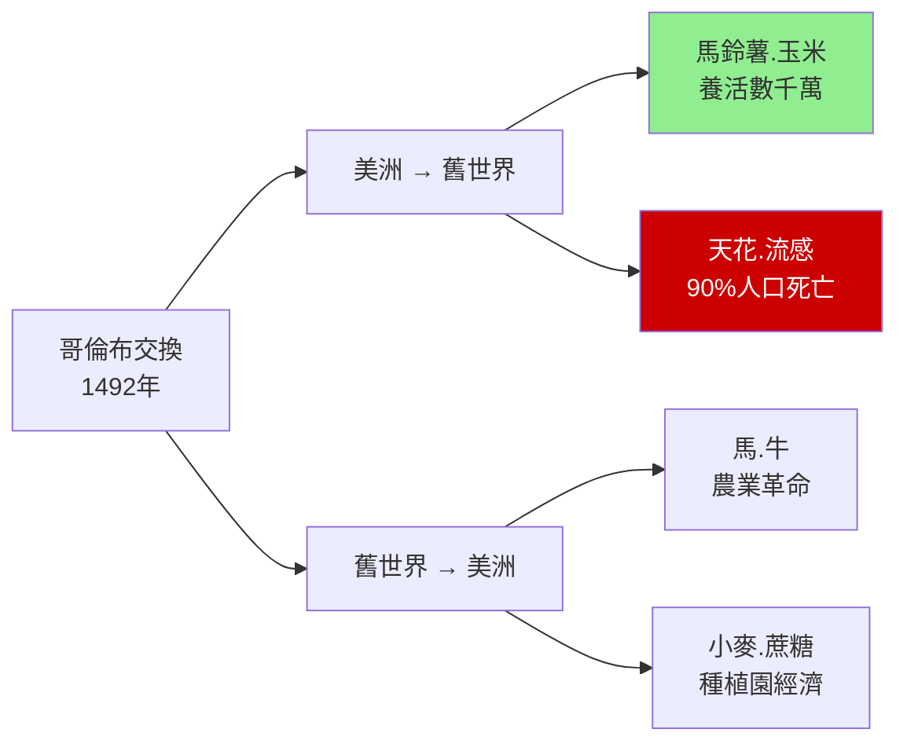
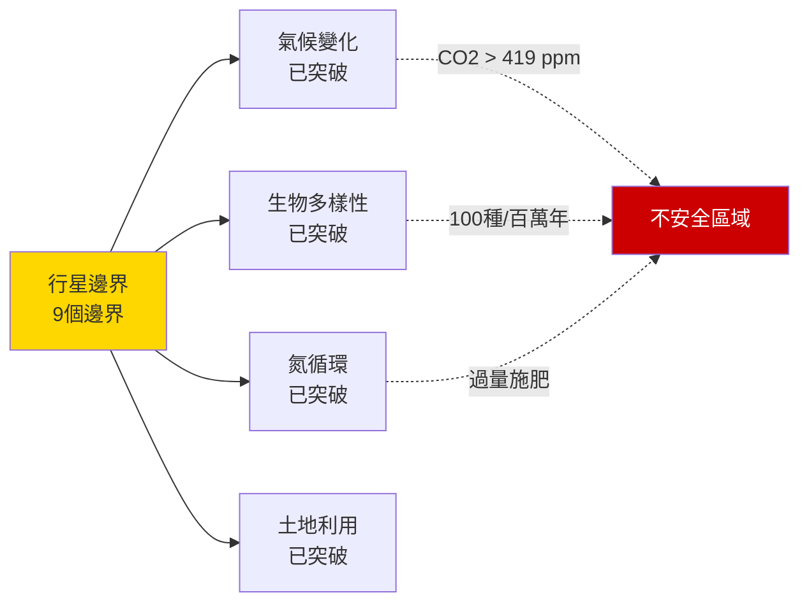
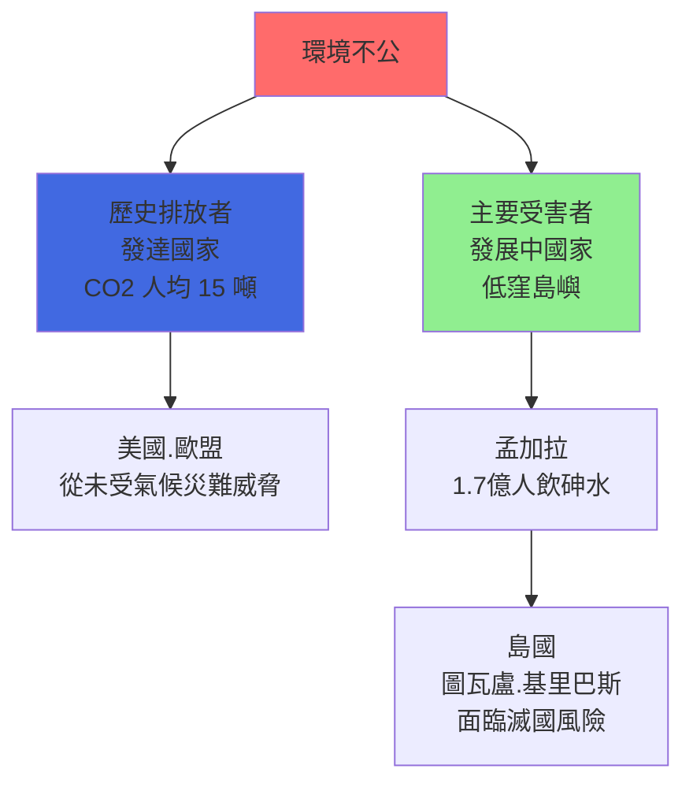
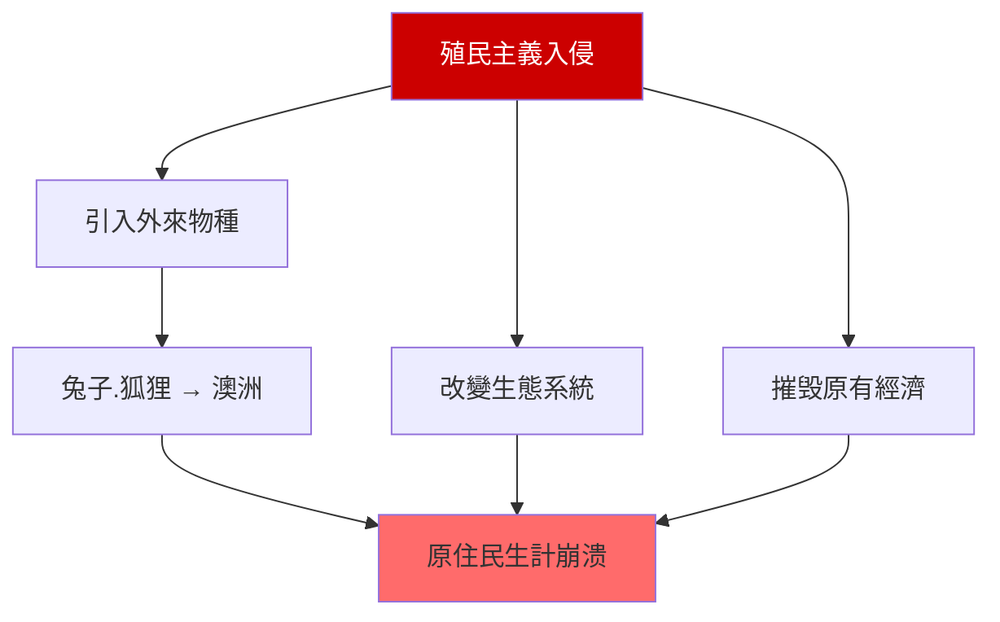
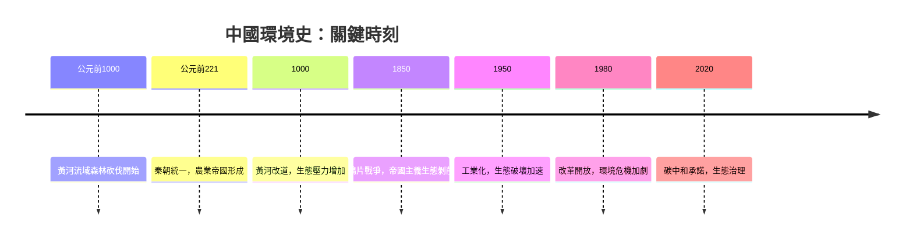

# HIST2215 全球環境史 / Global Environmental History: From Columbus to the Climate Crisis

/** HKU | 6 credits | Instructor: Devika Shankar */

---

## 問題 1：5 個核心心智模型

### 1. 人類世的提出——地質學事實還是政治話語？
**定義**: 「人類世」（Anthropocene）概念由大氣化學家 **Paul Crutzen** 和 **Eugene Stoermer** 在 2000 年提出，指地質學的一個新時代，其特徵是人類活動對地球系統的根本性改變。學者 **Will Steffen** 等人在 *Science* (2011) 上發表了「行星邊界」（Planetary Boundaries）框架，試圖量化人類對地球系統的影響程度。

**學者**: **Paul Crutzen & Eugene Stoermer** — 首次提出 Anthropocene (2000); **Will Steffen** — *Planetary Boundaries* (2011); **Dipesh Chakrabarty** — 「人類世的四個論點」(2009); **Johan Rockström** — 行星邊界框架

**驗證**: 人類世的正式地質定義尚有爭議——1950 年（核試驗放射性同位素信號）、1610 年（哥倫布交換導致的生物多樣性低點）、1800 年（工業革命）都是候選起點；地質學家尚未正式投票確認——這種不確定性本身就揭示了「科學事實」與「政治話語」之間的張力。

**歷史事件**:
- **1610年**: 哥倫布交換導致的大氣 CO2 下降——人類世的候選起點之一
- **1800年**: 工業革命——化石燃料使用開始規模化
- **1950年**: 核武器試驗——人類在地球上留下永久放射性標記
- **2000年**: Crutzen 和 Stoermer 首次提出「人類世」
- **2016年**: 人類世工作組提議以 1950 年為起點

### 2. 哥倫布交換的生態學——疾病的全球旅程
**定義**: 「哥倫布交換」（Columbian Exchange）由學者 **Alfred Crosby** 在 *The Columbian Exchange* (1972) 中首創，指 1492 年後美洲與舊世界之間的生物學交流——包括農作物（馬鈴薯、玉米、番茄）、動物（馬、牛）和疾病（天花、流感、麻疹）。這種交流對全球歷史進程的影響，遠超軍事征服。

**學者**: **Alfred W. Crosby** — *The Columbian Exchange* (1972); *Ecological Imperialism* (1986); **Charles Mann** — *1491* (2005); **J.R. McNeill** — *Mosquito Empires* (2010)

**驗證**: 哥倫布交換的疾病效應：天花在 1520 年抵達美洲——在接下來 100 年內，約 90% 的美洲原住民人口死亡（從約 5,000-6,000 萬降至約 500-600 萬）；這種人口崩潰是歐洲殖民能夠成功的關鍵生態條件。

**歷史事件**:
- **1492年10月12日**: 哥倫布抵達美洲——哥倫布交換開始
- **1520年**: 天花抵達美洲——原住民人口災難性崩潰
- **1545-1600年**: 殖民瘟疫——美洲原住民人口減少約 90%
- **1650年**: 馬鈴薯傳入歐洲——農業革命的一個基礎
- **1700年**: 玉米傳入中國——養活了額外數千萬人口

### 3. 帝國主義生態學——生物學作為征服工具
**定義**: 「生態帝國主義」（Ecological Imperialism）由 **Alfred Crosby** 在 *Ecological Imperialism* (1986) 中提出，指歐洲殖民主義者在征服新領土時，使用的最强大武器不是火槍，而是生物學——引入歐洲物種和疾病，改變當地生態系統，使當地社會无法維持原有生活方式。

**學者**: **Alfred W. Crosby** — *Ecological Imperialism: The Biological Expansion of Europe, 900-1900* (1986); **Jared Diamond** — *Guns, Germs, and Steel* (1997); **William Cronon** — *Changes in the Land* (1983)

**驗證**: 澳洲的例子最典型：1788 年英國殖民者抵達時，携带了兔子、狐狸、貓等物種——這些外來物種與隨後建立的牧羊業結合，在 100 年內摧毁了原住民的狩獵-采集經濟；原住民的土地使用方式與英國的「栅欄農業」不兼容，使原住民被系統性地驅逐。

**歷史事件**:
- **1788年1月26日**: 英國殖民者抵達悉尼——澳洲生態史的轉折點
- **1859年**: 托馬斯·奧斯汀在澳洲釋放 24 隻兔子——兔災的起點
- **1900年**: 澳洲兔子數量達到驚人的數十億——生态系统崩溃
- **1950年代**: 粘液瘤病毒引入——控制了兔災，但付出了生態代價

### 4. 環境史的方法論——自然作爲歷史主體
**定義**: 環境史（Environmental History）將自然環境視為歷史的主體之一，而非被動的背景。學者 **William Cronon** 在 *Changes in the Land* (1983) 中展示了：北美原住民和歐洲殖民者對土地利用的不同方式，不僅改變了生態系統，也改變了兩種社會的權力關係。

**學者**: **William Cronon** — *Changes in the Land* (1983); *Nature's Metropolis* (1991); **Carolyn Merchant** — *The Death of Nature* (1980); **Donald Worster** — *Dust Bowl* (1979)

**驗證**: Cronon 在 *Changes in the Land* 中揭示：北美原住民的「火耕農業」（controlled burning）與歐洲殖民者的「栅欄圈地」（enclosure）是兩種截然不同的土地利用方式——歐洲殖民者將原住民驅逐出他們的土地後，以為自己在「開發荒地」，但實際上他們在摧毁一個已經被原住民管理了數千年的生態系統。

**歷史事件**:
- **13000年前**: 人類首次抵達美洲——狩獵-采集-農業
- **1500年**: 歐洲殖民開始——土地利用方式衝突
- **1850年代**: 美國「Manifest Destiny」——西部開發
- **1934-1940年**: 尘碗（ Dust Bowl）——農業環境災難
- **1970年**: 美國環境保護署成立

### 5. 慢暴力與環境正義——誰承受環境退化的代價？
**定義**: 「慢暴力」（Slow Violence）由學者 **Rob Nixon** 在 *Slow Violence* (2011) 中提出，指環境退化對弱勢群體造成的長期傷害——這種傷害是漸進的、不引人注目的，但卻是持續和毁滅性的。學者 **Pamela Moss** 研究環境正義：環境退化從來不是中性的——它總是權力關係的產物。

**學者**: **Rob Nixon** — *Slow Violence: The Environmentalism of the Poor* (2011); **Carolyn Merchant** — *The Death of Nature* (1980); **J.R. McNeill** — *Something New under the Sun* (2000)

**驗證**: 當代環境不正義的案例：孟加拉國（約 1.7 億人口）飲用水含砷——這是 1970-80 年代世界銀行資助的水井項目造成的——數百萬人長期暴露於砷污染，估計導致了數十萬人死亡；這種「慢暴力」從未被稱為「災難」，但它造成的死亡人數超過大多數「急性災難」。

**歷史事件**:
- **1970年4月22日**: 地球日——環境運動的起點
- **1987年9月16日**: 蒙特婁議定書——保護臭氧層
- **1992年6月3-14日**: 里約地球峰會——氣候變化公約
- **2015年12月12日**: 巴黎氣候協定——全球減排協議
- **2021年11月**: COP26 格拉斯哥——減排承諾落空

---

## 問題 2：3 個根本分歧

### 分歧 1：人類世——地質學事實還是政治話語？
- **A 方（地質學事實派）**: 人類世的提出有地質學證據支持——放射性同位素層、塑膠沉積層、化石燃料灰燼——這些都是人類活動對地球系統造成根本性改變的物質證據
- **B 方（政治話語派）**: **Dipesh Chakrabarty** — 人類世的「所有人類」話語掩盖了環境問題的階級性和帝國主義性質——不是「人類」破壞了環境，而是特定的階級和帝國主義模式破壞了環境

### 分歧 2：環境退化——市場失敗還是結構性帝國主義？
- **A 方（市場失敗派）**: 環境退化是「市場失靈」的結果——環境成本未被打入商品價格；解决方案是「碳定價」「排污權交易」
- **B 方（結構性批判派）**: 環境退化是帝國主義和資本主義結構性剥削的必然結果——在不改變這種結構的情況下，任何「市場解决方案」都只是延缓而非解决問題

### 分歧 3：氣候變化歷史——科學共識还是政治否認？
- **A 方（科學共識派）**: 97% 以上的氣候科學家認為人類活動導致全球暖化——這是科學共識；否認這種共識是出於政治和經濟動機，而非科學根據
- **B 方（批判派）**: 即便接受氣候變化的科學共識，如何解决氣候危機的問題仍然充滿政治選擇——誰承擔減排成本、谁獲得清潔能源補貼、發展中國家是否有權先發展後減排

---

## 問題 3：10 個深度問題

1. **人類世的政治問題**：如果「人類」破壞了環境，那麼誰是「人類」？是所有「人類」同樣地破壞了環境，還是特定的階級和帝國主義發展模式應該負責？Chakrabarty 的批评论点是否有效？

2. **哥倫布交換的道德問題**：哥倫布交換對美洲原住民造成的災難——人口減少約 90%——是否應該被視為「種族滅絕」？這種歷史評價如何影響了當代對「全球化」和「開發」的道德評價？

3. **中國黃河流域的環境退化**：從先秦到當代，黃河流域經歷了人類歷史上最大規模的森林砍伐和水土流失——這種環境退化如何影響了中國的政治格局（中央 vs 地方）？

4. **香港維多利亞港的填海史**：維多利亞港面積從 1842 年的約 5.7 平方公里縮小至 2020 年的約 2.9 平方公里——這種填海工程對香港的海洋生態和城市發展有什麼影響？

5. **孟加拉飲水砷污染的責任歸屬**：1970-80 年代世界銀行資助的水井項目造成數百萬人飲水砷中毒——這種「發展干預」的環境代價應該由誰承擔？發達國家的歷史排放和當代發展中國家的環境受害之間有什麼歷史聯繫？

6. **氣候變化與公平問題**：發達國家（特別是美國和歐盟）歷史上排放了大部分的溫室氣體，但氣候變化的最嚴重受害者卻是發展中國家（非洲、南亞、島國）——這種「歷史不公」如何在氣候談判中被处理？

7. **中國經濟起飛的環境代價**：改革開放以來（1980-2020 年），中國經濟的高速增長付出了巨大的環境代價——霧霾、水污染、土地退化——這種「環境掠奪」的受益者和受害者各自是誰？

8. **日本捕鯨的環境政治**：日本在南極海域的「科研捕鯨」項目——究竟是科學研究還是商業捕鯨的包裝？這種環境「表演」揭示了什麼關於國家利益與環境保護之間的張力？

9. **巴西亞馬遜森林砍伐的全球責任**：巴西是全球最大的熱帶雨林國家之一——亞馬遜森林被砍伐用於養牛和大豆種植——這些產品的消費者主要在中國、歐洲和美國。消費者責任與生產者責任之間如何分配？

10. **環境危機的「去增長」解決方案**：一些環境主義者主張「去增長」（Degrowth）——减少經濟產出以减少環境壓力——但這種方案在政治上是否可行？發展中國家是否有權要求與發達國家同樣的「增長權利」？

---

# 核心心智模型深化（中英對照）

## 1. 人類世 / Anthropocene

### 1.1 定義與背景 / Definition and Context
人類世（Anthropocene）是 2000 年由 Paul Crutzen 和 Eugene Stoermer 提出的地質學概念，指人類活動已成為影響地球系統的主导力量。但學者 Dipesh Chakrabarty 在「人類世的四個論點」(2009) 中批判：這種「所有人類」的話語掩盖了環境問題的階級性和帝國主義性質——不是「人類」，而是特定的帝國主義和資本主義發展模式破壞了環境。

### 1.2 關鍵方程式或史料 / Key Evidence
- **人類世的起點爭議**: 1610 年（哥倫布交換）、1800 年（工業革命）、1950 年（核武器）——尚未定論
- **地質證據**: 放射性同位素層（R. I. Layer）、塑膠沉積層、化石燃料灰燼層
- **行星邊界**: 氣候變化 + 生物多樣性損失 + 氮循環——9 個行星邊界中已有 4 個被突破

### 1.3 應用場景 / Applications
人類世話語的當代應用：碳定價、ESG 投資、氣候訴訟——這些經濟和政策工具都是在「人類」破壞了環境的假設下設計的。但 Chakrabarty 的批评论點提醒我們：如果不解决誰負責、誰受苦的問題，這些工具可能只是在延缓問題而非解决问题。

### 1.4 犀利觀察 / Critical Observation
> 「人類世最荒謬之處——它用『所有人類』的話語掩盖了『某些人類』的責任。不是所有『人類』都同樣破壞了環境——從 1750 年到現在，美國和歐洲不到 15% 的人口排放了約 50% 的歷史碳排放。環境危機是階級問題，也是帝國主義問題——用『人類世』的籠統話語迴避這些問題，只會令危機繼續深化。」

### 1.5 深度思考題 / Deep Question
**考試題**：分析 Dipesh Chakrabarty 對「人類世」的批评论點。如何在承认環境危機的嚴重性的同時，避免這種話語掩盖環境問題的階級性和帝國主義根源？

---

## 2. 哥倫布交換 / Columbian Exchange

### 2.1 定義與背景 / Definition and Context
哥倫布交換（Columbian Exchange）指 1492 年哥倫布抵達美洲後，舊世界與新世界之間的生物學交流。學者 Alfred Crosby 在 *The Columbian Exchange* (1972) 中首創了這個術語，並論證：這種交換對全球歷史的影響，遠超軍事征服——它改變了人類的食物結構、疾病模式和人口格局。

### 2.2 關鍵方程式或史料 / Key Evidence
- **正向交換**: 馬鈴薯、玉米、番茄、辣椒、南瓜、可可（美洲 → 舊世界）；馬、牛、驢、猪（小麥、蔗糖 → 美洲）
- **負向交換**: 天花、流感、麻疹、霍乱、斑疹傷寒（舊世界 → 美洲）；約 90% 美洲原住民人口死亡
- **馬鈴薯效應**: 馬鈴薯傳入歐洲和中國——養活了額外數千萬人口

### 2.3 應用場景 / Applications
哥倫布交換揭示了「全球化」的生態本質：當人與貨物的流動加速時，疾病、害蟲和外來物種的流動也隨之加速——這種「生態全球化」的歷史，是理解當代全球化風險的必要背景。

### 2.4 犀利觀察 / Critical Observation
> 「哥倫布交換最荒謬之處——歐洲人用『文明傳播』的語言描述這一切——但實際上他們帶來的是天花，帶走的是黃金和白銀。『文明傳播者』和『種族滅絕者』，是同一群人。」

### 2.5 深度思考題 / Deep Question
**考試題**：分析哥倫布交換對美洲原住民的災難性影響。這種歷史評價如何影響了當代對「開發」和「全球化」的道德標準？

---

## 3. 生態帝國主義 / Ecological Imperialism

### 3.1 定義與背景 / Definition and Context
生態帝國主義（Ecological Imperialism）由 Alfred Crosby 在 *Ecological Imperialism* (1986) 中提出，指歐洲殖民主義者用生物學作為征服工具——引入外來物種和疾病，改變當地生態系統，使當地社會無法維持原有生活方式。

### 3.2 關鍵方程式或史料 / Key Evidence
- **澳洲兔災**: 1859 年 24 隻 → 1900 年數十億隻 → 1950 年代粘液瘤病毒控制
- **紐西蘭例子**: 殖民者引入羊群 → 環境退化 + 原住民土地喪失
- **加勒比例子**: 蔗糖種植園 → 砍伐森林 → 土壤流失 → 種植園轉移

### 3.3 應用場景 / Applications
生態帝國主義揭示了帝國主義征服的「看不見的武器」——不是所有征服都是槍炮和刀劍，有時是兔子和天花。

### 3.4 犀利觀察 / Critical Observation
> 「生態帝國主義最犀利之處——它告訴我哋，帝國主義的最强大武器不是軍事技術，而是生物學。當欧洲殖民者抵達澳洲時，他們带來的不是来福槍，而是兔子——但兔子和来福槍同樣有效，甚至更加徹底。因為來福槍殺死的是人，而兔子改變的是整個生態系統——生態系統改變了，原住民的生活方式和社會結構就全部崩溃了。」

### 3.5 深度思考題 / Deep Question
**考試題**：用生態帝國主義框架，分析當代「外來物種入侵」的歷史根源。從巴西的水風信子到中國的福壽螺，這些外來物種的傳播與帝國主義歷史有什麼聯繫？

---

## 4. 環境史方法論 / Environmental History Methodology

### 4.1 定義與背景 / Definition and Context
環境史方法論（Environmental History Methodology）將自然環境視為歷史的主體之一。學者 William Cronon 在 *Changes in the Land* (1983) 中展示了：北美原住民和歐洲殖民者對土地利用的不同方式，不僅改變了生態系統，也改變了兩種社會的權力關係。

### 4.2 關鍵方程式或史料 / Key Evidence
- **原住民土地利用**: 火耕農業（controlled burning）——維持生態多樣性
- **殖民者土地利用**: 栅欄圈地（enclosure）——单一种植 + 排除原住民
- **結果**: 殖民者以為自己在「開發荒地」，但實際上摧毁了一個運行了數千年的生態系統

### 4.3 應用場景 / Applications
環境史方法論對理解當代環境爭議特别重要——從亞馬遜森林砍伐到中國黃河治理，每個環境爭議都有其歷史根源。

### 4.4 犀利觀察 / Critical Observation
> 「環境史最犀利之處——它摧毁了『自然』作為『被動的背景』的假設。自然不是歷史的舞台，而是歷史的演員之一。當原住民用火耕農業管理森林時，他們是歷史的演員；當殖民者用栅欄圈地摧毁這種管理時，他們也是在改變歷史的演員——只不過兩種演員扮演的角色，一個是和諧，一個是破壞。」

### 4.5 深度思考題 / Deep Question
**考試題**：用環境史方法論，分析中國黃河流域的環境退化如何影響了中國的政治格局。黃河改道（公元前 2000 年至今）和歷代王朝的興衰有什麼聯繫？

---

## 5. 慢暴力與環境正義 / Slow Violence and Environmental Justice

### 5.1 定義與背景 / Definition and Context
慢暴力（Slow Violence）由 Rob Nixon 在 *Slow Violence: The Environmentalism of the Poor* (2011) 中提出，指環境退化對弱勢群體造成的長期傷害——這種傷害是漸進的、不引人注目的，但却是持續和毁滅性的。環境正義（Environmental Justice）研究則揭示：環境退化從來不是中性的，它總是權力關係的產物。

### 5.2 關鍵方程式或史料 / Key Evidence
- **孟加拉砷污染**: 1970-80 年代水井項目 → 數百萬人長期暴露 → 數十萬人死亡
- **路易斯安那癌症巷**: 化工廠選址在非裔美國人社區附近
- **當代中國霧霾**: 華北平原霧霾 → 平均預期壽命減少約 5.5 年

### 5.3 應用場景 / Applications
慢暴力和環境正義的概念對理解當代環境政治特别重要：環境危機不是均匀分佈的——它總是更加打擊窮人、少數族裔、發展中國家。

### 5.4 犀利觀察 / Critical Observation
> 「慢暴力最荒謬之處——它從不被稱為『災難』。當一場地震殺死 10 萬人時，它被稱為『災難』，有國際援助、媒體報道、歷史記載；當砷污染在 20 年裡慢慢殺死 50 萬人時，它被稱為『環境問題』，没有國際援助、很少媒體報道、很少歷史記載。但『慢暴力』造成的死亡人數，遠超大多數『急性災難』。」

### 5.5 深度思考題 / Deep Question
**考試題**：分析孟加拉砷污染的世界銀行責任。發展干預（development interventions）的環境代價應該由誰承擔？這種責任歸屬如何應用於當代中國的環境問題？

---

## 深度自測問題詳解

**Q1（人類世批评论）**：Chakrabarty 的批评论點有效——用「人類」破壞了環境的話語，实际上是將責任分散化，讓真正的責任者（化石燃料巨頭、帝國主義國家）隐匿在「人類」的群體中。但這種批評也有風險：如果不承认危機的規模和緊迫性，就無法動员足够的政治行動來解决問題。

**Q2（哥倫布交換道德問題）**：哥倫布交換對美洲原住民造成的災難——人口減少約 90%——在當代歷史學界被越來越多地稱為「種族滅絕」。這種歷史評價影響了當代對「全球化」的道德標準——從「全球化是進步的」話語轉向「全球化是有代價的」話語。

**Q3（黃河流域環境退化）**：黃河流域的環境退化與中國政治格局的聯繫：黃河改道威脅了農業基礎，威脅了王朝的财政基礎——這是歷代王朝為什麼大力投資水利工程和運河系統的原因之一。黃河的「政治化」是理解中國中央集權制度的一個重要切入點。

**Q4（香港填海史）**：維多利亞港填海的面積減少（約 50%）導致了：海洋生態系統簡化、碼頭物流效率降低、城市景觀改變。填海工程的受益者（地產商、港口運營商）與受損者（漁民、海洋生態）之間的權力不對稱，揭示了環境政策中的政治經濟學。

**Q5（孟加拉砷污染責任）**：世界銀行的責任：該組織的「發展干預」項目在追求經濟發展目標的同時，沒有充分评估環境風險。這種責任歸屬揭示了「發展干預」的倫理複雜性：發展目標和環境保護之間的張力，在所有發展中國家的工業化過程中都存在。

**Q6（氣候公平問題）**：發達國家與發展中國家的氣候責任爭議：共同但有區別的責任原則（CBDR-RC）在《巴黎協定》中被確認，但落實困難。歷史排放的不公（發達國家應該承担更多減排責任）和發展權利的平等（發展中國家不應該被剝奪發展權利）之間的張力，構成了氣候談判的核心政治困境。

**Q7（中國環境代價）**：中國改革開放的環境代價：受益者主要是城市中產階級和出口導向製造業；受損者主要是農民和城市工人——但這些受害者往往没有組織起來進行環境正義運動的政治能力。

**Q8（日本捕鯨政治）**：日本捕鯨的爭議揭示了環境保護與國家利益之間的張力：日本的「科研捕鯨」被認為是商業捕鯨的包裝，因為捕到的鯨肉最終進入了商業市場。但這種「表演」並非日本独有——各國都有類似的「環境表演」。

**Q9（亞馬遜消費者責任）**：巴西亞馬遜森林砍伐的消費者責任：巴西的大豆和牛肉主要出口到中國、歐洲和美國；這些出口國的消費者雖然沒有直接砍伐森林，但通過他們的購買選擇，支撑了這種砍伐的經濟邏輯。

**Q10（去增長方案）**：去增長（Degrowth）方案的政治可行性問題：去增長意味著减少經濟產出，這在政治上需要大多數人接受较低的生活水平——這在民主社會中幾乎不可能。去增長方案在政治上的可行性可能低於在生態上的必要性。

---

## 5 個 Mermaid 圖解

### 圖解 1：哥倫布交換的生物學影響

### 圖解 2：行星邊界框架

### 圖解 3：環境不公的全球地理

### 圖解 4：生態帝國主義的機制

### 圖解 5：中國環境史時間線

---

## 總結

**HIST2215 Global Environmental History** 的核心價值：

1. **自然作為歷史主體**——環境史將自然環境從「被動背景」提升為「歷史主體」，要求我們重新思考什麼是「歷史」。

2. **帝國主義生態學**——Alfred Crosby 的研究揭示了生態學在帝國主義征服中的核心角色——不是所有征服都是槍炮和刀劍。

3. **人類世的政治批判**——Chakrabarty 的批评论點提醒我們：環境危機的責任不是均匀分佈的，而是與階級和帝國主義權力結構緊密相連。

4. **慢暴力與環境正義**——Rob Nixon 的研究揭示了「看不見的」環境暴力如何比「看得見的」災難更為普遍和持久。

5. **當代緊迫性**——氣候危機不是未來的問題，而是當下的現實；如果全球升溫超過 1.5°C，将帶來不可逆轉的災難性後果。

**袁騰飛金句**：
> 「環境史最犀利之處——它摧毁了『自然』與『歷史』之間的人為分割。黃河改道是歷史；霧霾是歷史；物種滅絕是歷史；气候升溫也是歷史。自然不是歷史的舞台，而是歷史的演员之一——而且，歷史告訴我哋，這個演员從來不是被動的。當人類忽視自然的聲音時，自然總是以它自己的方式回應——有時是洪水，有時是霧霾，有時是疫病。」

---

## 延伸閱讀

1. Crosby, Alfred W. *The Columbian Exchange: Biological and Cultural Consequences of 1492*. Westport: Greenwood Press, 1972.
2. Crosby, Alfred W. *Ecological Imperialism: The Biological Expansion of Europe, 900-1900*. 2nd ed. Cambridge: Cambridge University Press, 2004.
3. Cronon, William. *Changes in the Land: Indians, Colonists, and the Ecology of New England*. New York: Hill and Wang, 1983.
4. Cronon, William. *Nature's Metropolis: Chicago and the Great West*. New York: W. W. Norton, 1991.
5. Merchant, Carolyn. *The Death of Nature: Women, Ecology, and the Scientific Revolution*. 3rd ed. London: Routledge, 2020.
6. Nixon, Rob. *Slow Violence and the Environmentalism of the Poor*. Cambridge: Harvard University Press, 2011.
7. Chakrabarty, Dipesh. "The Climate of History: Four Theses." *Critical Inquiry* 35, no. 2 (2009): 197-222.
8. McNeill, J.R. *Something New under the Sun: An Environmental History of the Twentieth-Century World*. New York: W. W. Norton, 2000.
