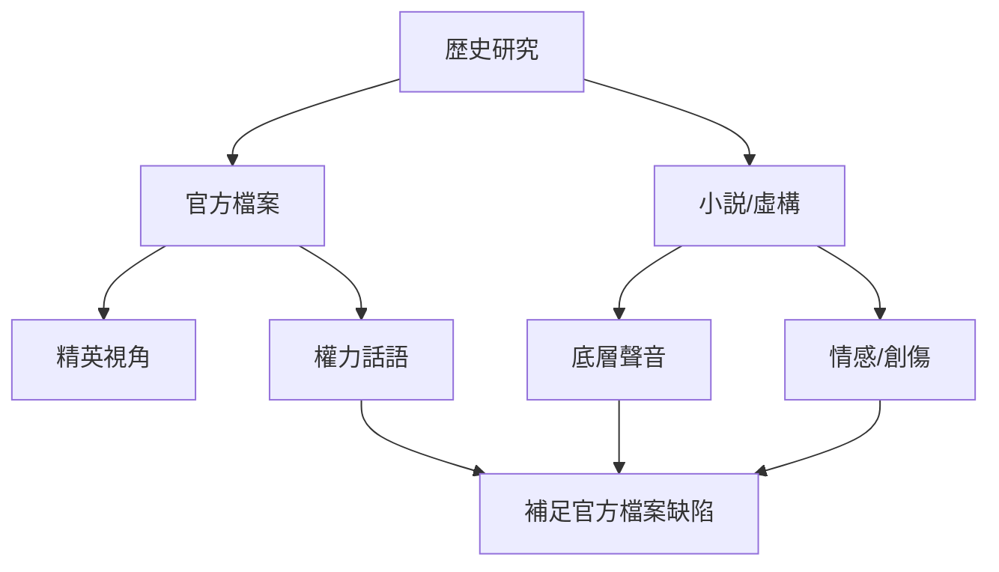
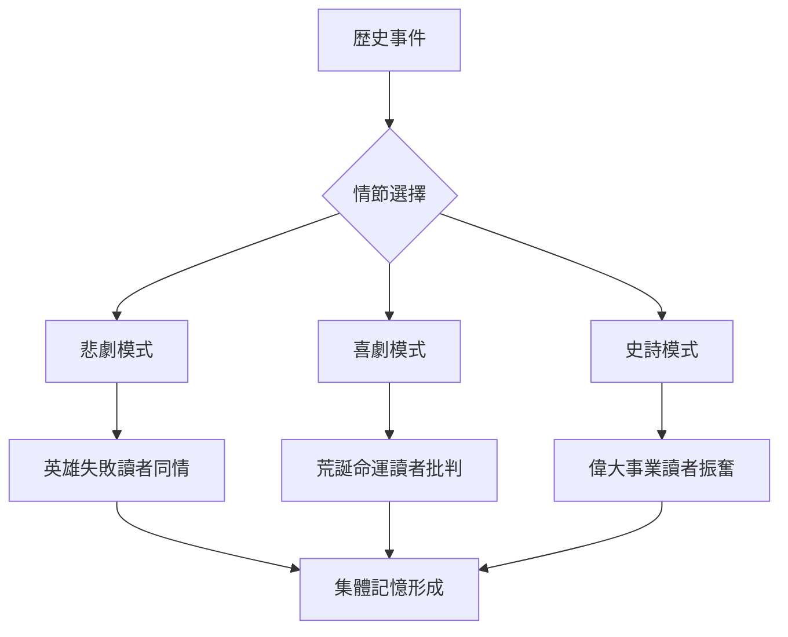
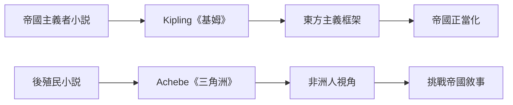
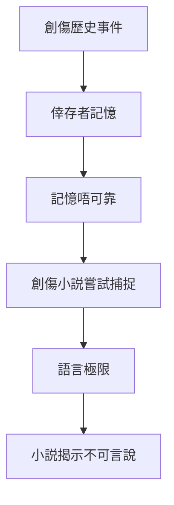
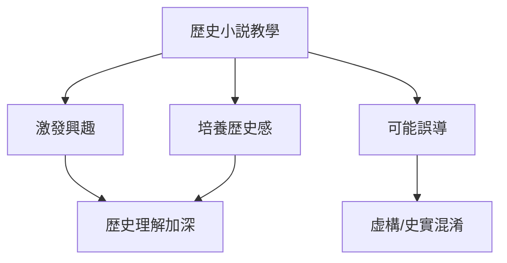
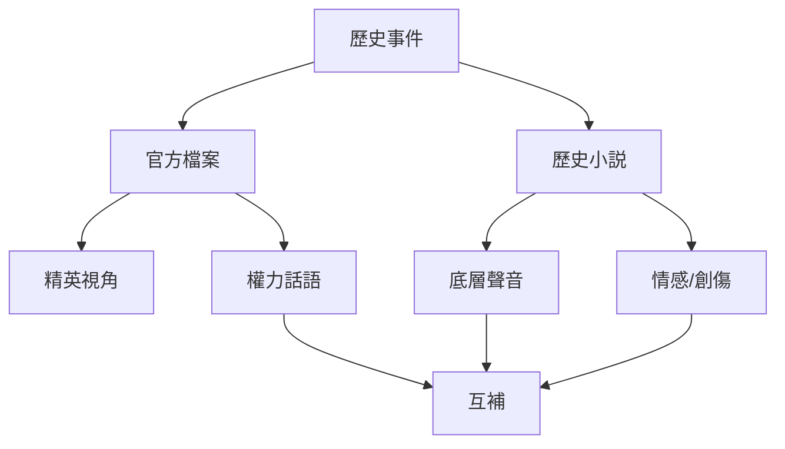

# HIST2220 小說與歷史 / History through Fiction (6 credits)

**Instructor**: Matthew Wong Foreman
**Department**: History, HKU
**Official source**: [HKU History Course Description 2024-25](https://history.hku.hk/wp-content/uploads/2024/07/HIST-2425.pdf)
**Style**: 袁騰飛式 — 犀利、聚焦小說點解揭示歷史無法接觸嘅維度——普通人情感、日常生活、底層聲音

---

## 問題 1：這個領域所有專家共享的 5 個核心心智模型

### 心智模型 1：小說作爲歷史證據
學者 **Ruth W. Gilian** 研究：小說揭示歷史無法接觸嘅維度——普通人情感、日常生活。官方檔案往往由精英書寫；小說可以補救呢個缺陷。

學者 **Denise N. R. McCos** 分析：底層視角——官方檔案缺乏嘅聲音。

- 《紅樓夢》揭示清代貴族日常生活
- 《阿Q正傳》批判中國國民性
- 殖民地文學揭示被殖民者視角
- Civil Rights時期美國小説揭示種族歧視日常

### 心智模型 2：歷史小説政治
學者 **Hayden White** (*Metahistory*, 1973) 研究：所有歷史敘事都係「小説」——選擇情節、人物、主題建構。

學者 **Patrick H. J. Gardiner** 分析：歷史解釋主觀性——歷史學家同小説家都係建構意義。

- 歷史小説如何選擇情節結構（悲劇/喜劇/史詩）
- 歷史小説如何塑造讀者道德判斷
- 歷史小説如何影響公眾對過去嘅理解

### 心智模型 3：後殖民主義與小説
學者 **Gayatri Spivak** 研究：底層可以發聲嗎？小説可以代表被殖民者嗎？

學者 **Edward Said** (*Culture and Imperialism*, 1993) 分析：帝國主義文學批評——小説如何服務帝國權力話語。

- Kipling《基姆》——帝國主義者如何看印度
- Orwell《1984》——極權主義批判
- Achebe《尼日爾河三角洲》——後殖民視角挑戰帝國敘事

### 心智模型 4：小說與歷史創傷
學者 **Cathy Caruth** 研究：創傷文學——歷史創傷點樣被敘述。創傷本質上抗拒語言，但小説嘗試捕捉創傷經驗。

學者 **Mona Baker** 分析：翻譯與後殖民小説——跨語言傳播如何改變意義。

- 大屠殺小説：Primo Levi, W.G. Sebald
- 文化大革命：《活着》、《蛙》——余華、莫言
- Civil Rights時期小説

### 心智模型 5：歷史小説教學
學者 **Peter Seixas** 研究：歷史小説點解教學歷史——歷史感 (historical sense) 培養。

學者 **Stearns** 分析：公共歷史與虛構——歴史教育中使用虛構材料爭議。

- 歷史小説如何塑造青少年歴史理解
- 歴史小説如何影響集體記憶
- 歴史小説如何服務當代政治話語

---

## 問題 2：3 個根本分歧

### 分歧 1：小說忠實度——虛構可以真實嗎？
- **A 方**：情感真實
  - 捕捉時代精神、普通人情感
  - 引用：歷史小説揭示官方檔案無記載嘅維度
- **B 方**：歷史失真
  - 細節錯誤誤導讀者
  - 引用：小説家往往犧牲歷史準確性服務情節

### 分歧 2：小說與政治——文學應該承擔政治責任？
- **A 方**：應該
  - 小説影響公眾認知
  - 歷史小説塑造歷史理解
- **B 方**：唔應該
  - 藝術自由
  - 小説唔係歷史教材

### 分歧 3：小說研究——文學方法定歷史方法？
- **A 方**：文學方法
  - 美學批評
  - 形式分析
- **B 方**：歷史方法
  - 史料批判
  - 歴史準確性

---

## 問題 3：10 個深度問題

1. 如果你去歷史小説世界，你最想做邊個角色？
2. 點解歷史小説往往比歷史書暢銷？呢個揭示咗乜嘢關於公眾歷史理解？
3. 如果你是作者，點樣平衡歷史準確同故事情節？呢個張力揭示咗乜嘢？
4. 《百年孤獨》點解揭示拉丁美洲歷史？魔幻現實主義捕捉歷史創傷。
5. 如果你去《1984》世界，你會點樣反抗？呢個小説點解預言當代監控問題？
6. 點解香港歷史小説少之又少？但係西西、也斯等小説家點解重要？
7. 如果你去文革時期做田野，小説可以揭示乜嘢？余華、莫言揭示官方檔案無法記載嘅創傷。
8. 小說研究點解對後殖民主義歷史重要？Achebe《尼日爾河三角洲》點解挑戰Kipling帝國視角？
9. 如果你是歷史學家，點樣批評虛構作品？文學方法定歷史方法？
10. 歷史小説——點解係理解歷史嘅重要工具？但係又有乜嘢危險？

---

## 核心心智模型深化（中英對照）

## 1. 小說作爲歷史證據

### 1.1 Bilingual 概念對照
| 英文概念 | 中英對照 | 歷史含義 | 案例 |
|---|---|---|---|
| Fiction as Evidence | 虛構作爲證據 | 小說揭示底層聲音 | 《紅樓夢》|
| Official Archives | 官方檔案 | 精英書寫的記録 | 政府檔案 |
| Subaltern Voice | 底層聲音 | 被忽視群體視角 | 殖民地小説 |
| Social History | 社會史 | 普通人日常生活 | 歴史小説 |
| Historical Sense | 歴史感 | 理解過去的能力 | 小説培養 |

### 1.2 史料與考據
- Natalie Davis: Fiction in the Archives (1987)
- Hayden White: Metahistory (1973)
- 《紅樓夢》(1791), 《阿Q正傳》(1921), Achebe: Things Fall Apart (1958)

### 1.3 袁騰飛式犀利觀察
歷史小説最大價值就係揭示官方檔案無法接觸嘅維度——《紅樓夢》揭示清代貴族日常生活；《阿Q正傳》揭示農民精神狀態；Civil Rights小説揭示種族歧視日常創傷。
呢啲維度永遠唔會出現喺政府檔案、官方歴史入面，因為記録者唔會關心呢啲嘢。

### 1.4 Deep test question
- 如果你去研究毛澤東時期歷史，小説同官方檔案，你信邊個？點解？

### 1.5 圖解


---

## 2. 歴史小説政治

### 1.1 Bilingual 概念對照
| 英文概念 | 中英對照 | 歴史含義 | 案例 |
|---|---|---|---|
| Narrative Structure | 敘事結構 | 悲劇/喜劇/史詩 | 影響道德判斷 |
| Hayden White | 元歴史 | 所有歷史都係建構 | 情節化結構 |
| Collective Memory | 集體記憶 | 歴史塑造 | 歴史小説影響 |
| Nationalist Narrative | 民族主義敘事 | 官方歴史建構 | 歴史小説參與 |
| Counter-memory | 反記憶 | 挑戰官方 | 底層小説 |

### 1.2 史料與考據
- Hayden White: Metahistory (1973)
- Pierre Nora: Realms of Memory

### 1.3 袁騰飛式犀利觀察
Hayden White最犀利嘅發現：歷史學家以為自己喺呈現客觀過去，但其實佢哋不自觉地選擇咗情節結構——悲劇英雄定喜劇小丑？呢個選擇影響讀者嘅道德判斷。
歴史小説都係一樣——你點解一個歴史事件，就決定咗讀者點解歷史。

### 1.4 Deep test question
- 如果你用「悲劇」結構寫香港歴史，會揭示邊個被忽視？

### 1.5 圖解


---

## 3. 後殖民主義與小説

### 1.1 Bilingual 概念對照
| 英文概念 | 中英對照 | 歴史含義 | 案例 |
|---|---|---|---|
| Orientalism | 東方主義 | 西方看東方的框架 | Kipling《基姆》|
| Counter-narrative | 反敘事 | 挑戰帝國話語 | Achebe《三角洲》|
| Subaltern | 底層 | 被忽視群體 | Spivak |
| Translation | 翻譯 | 跨語言傳播 | 後殖民小説翻譯 |
| Post-colonial Identity | 後殖民身份 | 殖民經驗塑造 | 殖民地小説 |

### 1.2 史料與考據
- Edward Said: Orientalism (1978), Culture and Imperialism (1993)
- Gayatri Spivak: Can the Subaltern Speak? (1988)
- Chinua Achebe: Things Fall Apart (1958)

### 1.3 袁騰飛式犀利觀察
Said最犀利嘅批評：西方文學塑造咗一套「東方」框架——落後、異國情調、需要被文明化。呢個框架服務帝國主義正當化。
Achebe《三角洲》就係對Kipling《基姆》嘅直接回應——非洲人視角挑戰帝國主義者視角。

### 1.4 Deep test question
- 如果你去比較《基姆》同《三角洲》，會發現邊個歷史真相？

### 1.5 圖解


---

## 4. 小説與歴史創傷

### 1.1 Bilingual 概念對照
| 英文概念 | 中英對照 | 歴史含義 | 案例 |
|---|---|---|---|
| Trauma Literature | 創傷文學 | 歴史創傷如何被捕捉 | W.G. Sebald |
| Unreliable Narration | 不可靠敘事 | 創傷記憶不可靠 | 創傷小説 |
| Survivor Narrative | 幸存者敘事 | 大屠殺記憶 | Primo Levi |
| Cultural Revolution Fiction | 文化大革命小説 | 創傷書寫 | 余華、莫言 |
| Silence and Speech | 沉默與發聲 | 創傷抗拒語言 | Caruth |

### 1.2 史料與考據
- Cathy Caruth: Unclaimed Experience (1996)
- W.G. Sebald: Austerlitz (2001)
- 余華：《活着》, 莫言：《蛙》

### 1.3 袁騰飛式犀利觀察
Caruth最犀利嘅發現：創傷本質上抗拒語言——創傷經驗太過震撼，無法被完整敘述。但係小説嘗試捕捉呢個不可言說。
呢個揭示歴史小説同歴史學另一個重要區別：歴史學處理可論述嘅過去，小説處理不可論述嘅創傷。

### 1.4 Deep test question
- 如果你去研究文革創傷，余華同莫言揭示邊個官方檔案無法記載嘅維度？

### 1.5 圖解


---

## 5. 歴史小説教學

### 1.1 Bilingual 概念對照
| 英文概念 | 中英對照 | 歴史含義 | 爭議 |
|---|---|---|---|
| Historical Sense | 歴史感 | 理解過去的能力 | 小説培養 |
| Historical Fiction in Education | 教育中的歴史小説 | 歴史教學爭議 | 虛構vs事實 |
| Collective Memory | 集體記憶 | 歴史塑造 | 歴史小説影響 |
| Public History | 公共歴史 | 向公眾傳播歴史 | 歴史小説作用 |
| Historical Accuracy | 歴史準確性 | 小説的責任 | 爭議核心 |

### 1.2 史料與考據
- Peter Seixas: Historical Thinking concepts
- History textbook debates

### 1.3 袁騰飛式犀利觀察
歴史教育中使用歴史小説有爭議：好嘅歴史小説可以培養歴史感，激發學生興趣；但係虚構情節可能誤導學生對歴史事件嘅理解。
關鍵係：教師必須清楚區分虛構同史實，不能讓學生混淆。

### 1.4 Deep test question
- 如果你去教中学生歴史，你會用歴史小説嗎？點解或者點解唔會？

### 1.5 圖解


---

## 深度自測問題詳解

### 詳解 1: 《百年孤獨》與拉丁美洲
馬奎斯小説揭示拉丁美洲殖民、獨裁、家族循環——魔幻現實主義捕捉歷史創傷，揭示官方檔案無法記載嘅底層生活經驗。

### 詳解 2: 《1984》與極權主義
Orwell小説預言當代監控問題——"Big Brother is watching you"。呢個揭示歴史小説不只係描述過去，而係預示未來。

### 詳解 3: 香港歴史小説
西西、也斯等香港小説家揭示被殖民者視角——英帝國統治下華人日常生活、城市空間變遷、身份認同複雜性。

### 詳解 4: 小説與歴史創傷
文革小説（余華《活着》、莫言《蛙》）揭示官方檔案無法記載嘅創傷經驗——權力對普通人日常生活的摧毁。

### 詳解 5: 比較《基姆》同《三角洲》
Kipling《基姆》從帝國主義者視角看印度；Achebe《三角洲》從非洲人視角看殖民。兩者揭示同一歴史事件有完全唔同嘅理解。

---

## 5 個 Mermaid 圖解

### 📊 Diagram 1: 小說與歷史關係


### 📊 Diagram 2: 後殖民主義小説
```mermaid
flowchart LR
    A[帝國主義小説] --> B[Kipling《基姆》]
    B --> C[服務帝國話語]
    A1[後殖民小説] --> E[Achebe《三角洲》]
    E --> F[挑戰帝國視角]
    C --> G[歴史理解扭曲}
    F --> H[歴史理解補充}
```

### 📊 Diagram 3: 歴史創傷小説
```mermaid
flowchart TD
    A[創傷歴史] --> B[官方沉默]
    B --> C[小説填補空白]
    C --> D[公眾理解加深]
    D --> E[歴史記憶改變}
```

### 📊 Diagram 4: 香港歴史小説
```mermaid
flowchart TD
    A[香港歴史] --> B[西西《我城》]
    A --> C[也斯《布拉格的緑洞》]
    B --> D[城市空間]
    C --> E[跨境文化]
    D --> F[香港身份建構}
    E --> F
```

### 📊 Diagram 5: 歴史小説教育爭議
```mermaid
flowchart TD
    A[歴史小説教學] --> B[優點：激發興趣]
    A --> C[優點：培養歴史感]
    A --> D[缺點：可能誤導]
    B --> E[有效教育工具}
    C --> E
    D --> F[需要教師引導}
```

---

## 總結

1. **小説揭示歴史無法接觸嘅維度——普通人情感、日常生活、底層聲音，呢啲維度永遠唔會出現喺政府檔案。**
2. **歴史小説政治敏感——你點解一個事件，就塑造咗讀者嘅道德判斷。呢個提醒我哋：歴史小説唔係單純「歴史教育工具」。**
3. **後殖民主義小説挑戰帝國話語——Achebe《三角洲》對Kipling《基姆》嘅回應，揭示歴史有多視角。**
4. **創傷文學填補官方沉默——文革小説揭示權力對普通人日常生活嘅摧毁，呢個係歴史學補救官方檔案缺陷嘅工具。**
5. **歴史教育中使用歴史小説需要谨慎——清楚區分虛構同史實，唔可以讓情節替代史實。**

**最後問題**: 如果你去小説世界，你最想改變邊個歴史事件？

---
**版權所有 © HKU History Self-Study**
