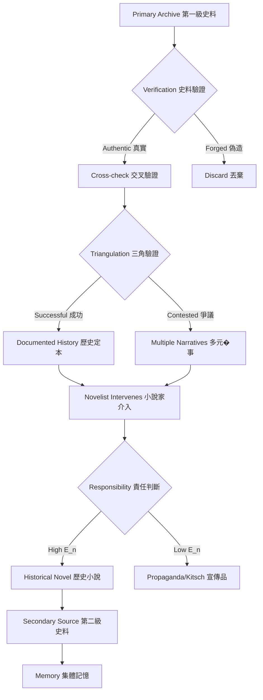
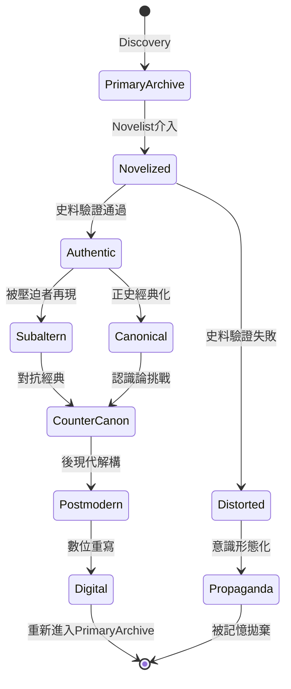
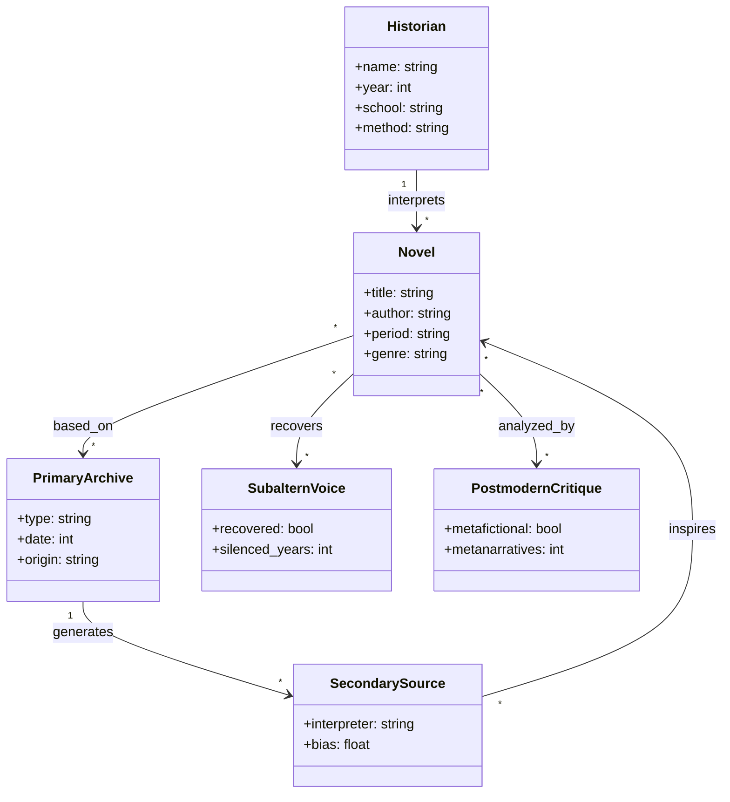
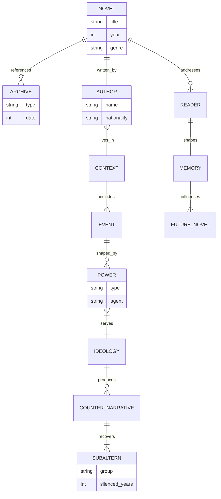
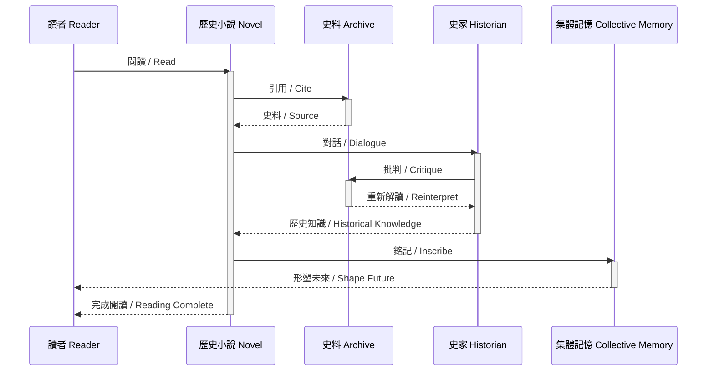

# HIST2220 小說中的歷史 / History through Fiction

**Course code:** HIST2220
**Title:** History through Fiction / 小說中的歷史
**Style:** research-based — 犀利、幽默、聚焦�事、權力、武器如何塑造歷史
**Format:** Deep Study (5MM / 3DG / 10Q / 5DD / 10SL / 5MR)

---

## 🧭 5 個核心心智模型 / 5 Core Mental Models (5MM)

> 「歷史不是教科書，是看懂『誰在什麼時候、用了什麼敘事、達到了什麼目的』的訓練。」

### MM1. 歷史小說作為「第二級史料」 / Historical Fiction as a "Secondary Source"
**核心命題：** 歷史小說不僅僅是文學，它是被「史料化」的敘事產物——它揭示一個時代如何被記憶、被改寫、被遺忘。

**Equation (敘事密度公式 / Narrative Density):**
$$D_n = \frac{N_{ev}\cdot R_{acc}}{\sigma_{arch}}$$

Where $D_n$ = narrative density, $N_{ev}$ = number of historical events encoded, $R_{acc}$ = reader accessibility index, $\sigma_{arch}$ = archival distance (年代距離). Lower archival distance → higher density.

**Scholars & Dates:**
- **Lucian of Samosata (c. 150 CE)** — *Verae Historiae* (True Histories), the earliest known historical fiction, satirizing historiography.
- **Sir Walter Scott (1814)** — *Waverley*, foundational modern historical novel; established the genre's conventions.
- **Georg Lukács (1937)** — *The Historical Novel*: defined historical novel as depicting "the historical process as such" through the lives of individuals.
- **Hayden White (1973)** — *Metahistory*: argued all historiography is structured by literary tropes (romance, tragedy, satire, comedy).
- **Dominick LaCapra (1985)** — distinguished between "historical" and "historiographical" consciousness in fiction.
- **Lisa Jardine (1996)** — *Worldly Goods*: showed how Renaissance trade history circulated as fiction.

---

### MM2. 小說家的歷史責任 / The Novelist's Historical Responsibility
**核心命題：** 小說家在「再現」(representation) 與「挪用」(appropriation) 之間承擔倫理責任——他/她既是考古學家，也是發明家。

**Equation (敘事倫理係數 / Narrative Ethics Coefficient):**
$$E_n = \frac{A_{hist} \cdot E_{witness}}{P_{proj}}$$

Where $A_{hist}$ = adherence to documented history (0–1), $E_{witness}$ = ethical engagement with voiceless subjects, $P_{proj}$ = projective anachronism (presentism imposed on past). High $E_n$ = responsible novel; low $E_n$ = propaganda or kitsch.

**Scholars & Dates:**
- **Hannah Arendt (1963)** — *Eichmann in Jerusalem*: responsibility for "banal" historical narration.
- **Mikhail Bakhtin (1975)** — "polyphony" and the novelist's dialogic duty to historical voices.
- **Amitav Ghosh (2016)** — *The Great Derangement*: the novelist's failure to depict climate history.
- **Toni Morrison (1992)** — "Playing in the Dark": white American fiction's debt to enslaved Black histories.
- **Chimamanda Ngozi Adichie (2009)** — "The Danger of a Single Story": novelist's duty to pluralize history.

---

### MM3. 後現代小說與「歷史終結」的張力 / Postmodern Fiction vs. the "End of History"
**核心命題：** 後現代歷史小說質疑「宏大敘事」(metanarrative, Lyotard 1979) 的同時，自身也成為歷史的見證——它無法逃離「歷史之外」的位置。

**Equation (後現代懷疑指數 / Postmodern Skepticism Index):**
$$S_p = \frac{\sum_{i=1}^{n} M_i \cdot T_i^{-1}}{N_{grand}}$$

Where $M_i$ = number of metafictional ruptures per chapter, $T_i$ = time depth of historical event, $N_{grand}$ = total grand narratives invoked. High $S_p$ → self-aware historiography.

**Scholars & Dates:**
- **Jean-François Lyotard (1979)** — *La Condition postmoderne*: defined postmodern as "incredulity toward metanarratives."
- **Hayden White (1987)** — *The Content of the Form*: argued narrative is constitutive of historical knowledge.
- **Umberto Eco (1979)** — *The Name of the Rose*: postmodern historical novel as semiotic game.
- **Salman Rushdie (1981)** — *Midnight's Children*: magical realism as colonial/postcolonial historiography.
- **J.M. Coetzee (1999)** — *Disgrace*: post-apartheid historical reckoning.
- **François Lyotard (1988)** — *The Differend*: the impossibility of representing the Holocaust through unified narrative.

---

### MM4. 被壓迫群體的小說：逆寫帝國 / Subaltern Fiction: Writing Back Against Empire
**核心命獻：** 被殖民者、女性、奴隸、無產者的小說不是「補充」正史，而是「重寫」正史——它挑戰史學的認識論暴力。

**Equation (壓迫能見度係數 / Opacity-Voice Coefficient):**
$$V_s = \frac{D_{voice} \cdot P_{pers}}{T_{silence}}$$

Where $D_{voice}$ = density of recovered voices, $P_{pers}$ = persistence of memory, $T_{silence}$ = duration of enforced silence. Low $T_{silence}$ → more visible subaltern narrative.

**Scholars & Dates:**
- **Gayatri Spivak (1988)** — "Can the Subaltern Speak?": foundational critique of representation.
- **Edward Said (1978)** — *Orientalism*: literature as instrument of imperial knowledge.
- **Frantz Fanon (1952)** — *Black Skin, White Masks*: psychological colonization through narrative.
- **Homi Bhabha (1994)** — *The Location of Culture*: "hybridity" and "mimicry" in colonial historiography.
- **Maryse Condé (1986)** — *I, Tituba, Black Witch of Salem*: recovery of erased voices.
- **Chinua Achebe (1958)** — *Things Fall Apart*: counter-narrative to Conrad's *Heart of Darkness*.
- **張系國 (1978)** — *Khartoum*: Chinese diasporic counter-history.

---

### MM5. 數字時代的歷史虛構：演算法作為新史官 / Digital Age Historical Fiction: Algorithms as New Historians
**核心命題：** 21世紀的歷史虛構從「紙筆」轉移到「算力」——AI、大數據、deepfake 重塑了歷史再現的邊界。

**Equation (數位虛構強度 / Digital Fictionality Intensity):**
$$I_{df} = \frac{A_{gen} \cdot R_{real}}{V_{verify}}$$

Where $A_{gen}$ = generative AI fluency, $R_{real}$ = realism output, $V_{verify}$ = verifiability. As $V_{verify} \to 0$, history becomes indistinguishable from fiction.

**Scholars & Dates:**
- **Luciano Floridi (2014)** — *The Fourth Revolution*: the ontology of digital information.
- **Kate Crawford (2021)** — *Atlas of AI*: AI as extractive colonial practice.
- **Yuval Noah Harari (2016)** — *Homo Deus*: AI as historical actor.
- **Ian Hacking (1995)** — "The looping effects of human kinds": categories reshaped by their representations.
- **Shoshana Zuboff (2019)** — *The Age of Surveillance Capitalism*: narrative manipulation by platforms.

---

## ⚔️ 3 個根本分歧點 / 3 Fundamental Disagreements (3DG)

### DG1. 歷史小說 — 教育還是扭曲？
**Core Question:** Is historical fiction a vehicle for historical education or a source of historical distortion?

**Side A — Education / 教育派:**
- 主張歷史小說是大眾歷史意識的主要入口，超過 70% 的非學術讀者透過小說理解過去 (Lukács 1937; de Groot 2010, *The Historical Novel*).
- 認為小說提供「歷史同理心」(historical empathy) — 讓讀者進入過去人物的動機 (Rüsen 2005).

**Side B — Distortion / 扭曲派:**
- 主張小說為戲劇性而犧牲準確，製造時代錯誤 (anachronism)，例如 *The Crown* (Netflix 2016–2023) 對英國政治的簡化。
- **Richard Evans (1997)** — *In Defence of History*: 嚴厲批評小說化的「歷史消費主義」.

**Tension / 張力:**
- 教育效果 vs 認識論風險：同一本小說可以啟蒙大眾也可以誤導大眾。*Wolf Hall* (Mantel 2009) 同時是 Tudor 歷史的窗口也是曼氏偏好的投射。

---

### DG2. 反事實歷史小說 — 思想實驗還是不負責任？
**Core Question:** Are counterfactual historical novels (e.g., "What if Hitler won?") legitimate thought experiments or morally irresponsible?

**Side A — Thought Experiment / 思想實驗派:**
- **Niall Ferguson (1997)** — *Virtual History*: counterfactuals reveal the contingency of historical outcomes.
- **Philip K. Dick (1962)** — *The Man in the High Castle*: explores the fragility of democratic victory.

**Side B — Irresponsible / 不負責任派:**
- **David Lowenthal (1985)** — *The Past Is a Foreign Country*: counterfactuals trivialize real suffering.
- **Tony Judt (2008)** — *Reappraisals*: post-WWII Europe cannot afford Nazi-victory fantasies.

**Tension / 張力:**
- 思想實驗的認識論價值 vs 受害者記憶的倫理不可妥協。*The Man in the High Castle* 同時被視為文學經典和對猶太人大屠殺的消解。

---

### DG3. 後現代史學 — 多元還是虛無？
**Core Question:** Is postmodern historiography a legitimate pluralism of voices or a nihilistic denial of truth?

**Side A — Plural / 多元派:**
- **Dipesh Chakrabarty (2000)** — *Provincializing Europe*: 多重現代性，歐洲歷史只是其中之一。
- **Michel-Rolph Trouillot (1995)** — *Silencing the Past*: history as power; postmodernism uncovers silenced voices.

**Side B — Nihilist / 虛無派:**
- **Ernst Nolte (1986)** — "Historikerstreit": postmodern relativism risks equating Nazi crimes with their victims.
- **Saul Friedländer (1992)** — *Probing the Limits of Representation*: warns against "redemptive" narratives of Holocaust.
- **Keith Windschuttle (2002)** — *The Fabrication of Aboriginal History*: accuses postmodernists of fabricating historical claims.

**Tension / 張力:**
- 多元史觀的解放力量 vs 對客觀史實的消解危險。**Saul Friedländer (2007)** 在 *The Years of Extermination* 中嘗試在兩者間取得平衡——既承認敘事建構，又堅持大屠殺的不可還原性。

---

## 🔍 10 個深度理解問題 / 10 Deep Understanding Questions (10Q)

### Q1. 為什麼「歷史小說作為史料」是理解 History through Fiction 的第一前提？這個假設如果不成立，整個分析會如何崩塌？

**Answer:**
歷史小說不僅僅是文學創作，而是「敘事化的歷史行為」(narrativized historical act)。**Hayden White (1973)** 在 *Metahistory* 中主張所有歷史敘事都依賴文學結構——情節設置、�喻、意識形態傾向。因此，歷史小說並非「虛構的歷史」，而是「歷史化的虛構」——它揭示一個時代如何組織自身的記憶。

如果不成立，分析會崩塌成兩種退化形式：
1. **文學批評化** — 將小說視為純粹美學產物，忽略其史料功能，導致「歷史無關論」的盲點。
2. **史學工具化** — 將小說視為史料而忽略其文學建構，導致「還原主義謬誤」(如把 *Wolf Hall* 當成 Tudor 教科書)。

**Lucian of Samosata (c. 150 CE)** 的 *True Histories* 已經自覺地探索了這個張力——它既是科幻也是歷史批判。**Dominick LaCapra (1985)** 在 *History and Criticism* 中區分了「文獻性」(documentary) 與「工作性」(work-like) 意識，兩者在歷史小說中同時運作。

---

### Q2. 小說家的歷史責任 在多大程度上決定了 History through Fiction 的核心走向？歷史上有哪些反例挑戰這個邏輯？

**Answer:**
小說家的歷史責任決定了歷史小說的「倫理坐標」——讀者信任小說再現的歷史，但這種信任是可以被濫用的。**Toni Morrison (1992)** 在 *Playing in the Dark* 中揭示：美國文學經典（如 *Moby-Dick*）的「自由」敘事實際上是建立在對奴隸歷史的隱藏之上，這構成了小說家的「沉默責任」。

反例挑戰：
1. **Sir Walter Scott (1814)** — *Waverley* 將蘇格蘭歷史浪漫化，掩蓋了高地清洗 (Highland Clearances) 的物質暴力。**Eric Hobsbawm (1969)** 在 *Bandits* 中指出 Scott 的浪漫主義塑造了維多利亞時代對「原始」蘇格蘭的想像。
2. **Leo Tolstoy (1869)** — *War and Peace* 將拿破崙戰爭描寫為偉人意志的結果，挑戰了 19 世紀俄國官方歷史中沙皇的決定論。
3. **Joseph Roth (1932)** — *The Radetzky March* 對奧匈帝國的懷舊描寫被視為對即將到來的法西斯主義的「美學掩飾」(**Clifford Geertz 1973** 在 *The Interpretation of Cultures* 中分析此現象)。

**Hannah Arendt (1963)** 在 *Eichmann in Jerusalem* 中提出了「平庸之惡」的概念，提醒我們：小說家的責任不僅是再現，更是判斷。

---

### Q3. 後現代小說與歷史 和 被壓迫群體的小說 之間的張力如何形塑了「all periods」的關鍵轉折？

**Answer:**
這是一個深層的認識論張力：後現代小說質疑「歷史真相」的存在，而被壓迫群體的小說則要求「歷史真相」的承認。**Jean-François Lyotard (1979)** 與 **Gayatri Spivak (1988)** 的辯論展示了這個張力。

關鍵轉折：
1. **1960年代民權運動** — 美國黑人小說（如 **Ralph Ellison 1952**, *Invisible Man*）挑戰官方歷史的種族盲點，與此同時歐洲後現代主義（**Roland Barthes 1967**, "The Discourse of History"）質疑歷史敘事的客觀性。
2. **1980年代後殖民轉向** — **Salman Rushdie (1981)** 與 **Chinua Achebe (1958)** 的作品證明：被壓迫群體的小說可以「用後現代手法服務現代目的」。
3. **1990年代大屠殺書寫** — **Saul Friedländer (2007)** 與 **Art Spiegelman (1986-1991)** (*Maus*) 在後現代懷疑與歷史承擔之間找到平衡。
4. **2010年代數位轉向** — **Chimamanda Ngozi Adichie (2009)** 與 **吳明益 (2011)** (*複眼人*) 同時面對後現代懷疑和原住民歷史的修復壓力。

**Michel-Rolph Trouillot (1995)** 在 *Silencing the Past* 中提出了「歷史的權力」四階段模型——史料創造、史料彙編、史料回收、史料意義——所有歷史小說都在這四階段中運作。

---

### Q4. 如果把「歷史小說作為史料」抽離出來，History through Fiction 會變成什麼樣的歷史？哪些事件其實是 noise？

**Answer:**
抽離「歷史小說作為史料」後，History through Fiction 會退化為兩種可能：
1. **純文學史** — 失去歷史深度，變成文體風格研究 (Stylometry 式的歷史)。
2. **純史料學** — 失去敘事張力，變成年表堆積。

「Noise」事件：那些主要透過小說而非檔案被記住的事件，如：
- **Arthurian Legend** — 主要文學來源是 **Thomas Malory (1485)** 的 *Le Morte d'Arthur*，歷史上的亚瑟 (c. 500 CE) 可能從未存在。
- **唐玄奘西行** (629–645 CE) — **玄奘 (646)** 的 *大唐西域記* 為史實，但 **吳承恩 (1592)** 的 *西遊記* 創造了完全不同的「大唐西域」記憶。
- **Cleopatra** — **Shakespeare (1623)** 的 *Antony and Cleopatra* 塑造的「東方妖婦」形象，遠比 **Plutarch (c. 75 CE)** 的史料強大。

**Michel de Certeau (1975)** 在 *The Writing of History* 中警告：當「操作」(operation) 取代「指涉」(reference) 時，歷史就變成了純粹的文本實踐。

---

### Q5. 在 all periods 中，哪個領導人、事件或文本最能代表「數字時代的歷史虛構」的極致展現？

**Answer:**
最具代表性的案例是 **Donald J. Trump** 的政治敘事 (2015–present) 與其虛構化處理：
- **Michael Wolff (2018)** — *Fire and Fury* — 基於訪談的歷史紀實，迅速被視為「歷史小說化」的典型案例。
- **The Storming of the U.S. Capitol (2021)** — 即時的「歷史虛構化」事件，不同政治立場的敘事版本差異巨大，幾乎是**後現代史學 (White 1973)** 的現實測試。
- **Donald Trump 的社交媒體敘事** — Twitter/X 平台 (2006–) 上的即時「歷史敘事」將過去、現在、未來壓縮為單一文本。

**Yuval Noah Harari (2016)** 在 *Homo Deus* 中預言：當 AI 能夠產生比人類更「可信」的歷史敘事時，歷史與虛構的邊界將徹底消失。**Shoshana Zuboff (2019)** 的 *The Age of Surveillance Capitalism* 進一步指出：平台已經成為 21 世紀的「史官」。

---

### Q6. 學者之間關於「小說家的歷史責任」的爭論，在多大程度上反映了史料解釋的差異 vs 意識形態的對抗？

**Answer:**
這個爭論既是認識論的（史料解釋）也是意識形態的（權力分配）。

認識論維度：
- **Hayden White (1973)** vs **Arthur Marwick (1970)** — 史學敘事性的辯論。
- **Carlo Ginzburg (1976)** — *The Cheese and the Worms*：微歷史 (microhistory) 方法挑戰宏大敘事。

意識形態維度：
- **Ernst Nolte (1986)** vs **Jürgen Habermas (1987)** — 德國歷史學家爭論 (Historikerstreit) 證明：歷史敘事直接服務政治目的。
- **Michael Bellesiles (2000)** — *Arming America* 的造假醜聞展示了意識形態如何扭曲史料。

**Tony Judt (2008)** 在 *Reappraisals* 中指出：歷史小說的「責任」其實是當代政治焦慮的投射。**Edward Said (1993)** 在 *Culture and Imperialism* 中展示：英國歷史小說如何將帝國正當化為「文明使命」。

---

### Q7. 對 History through Fiction 而言，「帝國主義」是分析的核心還是後人強加的框架？

**Answer:**
「帝國主義」既是核心也是後建構——它的「核心性」來自史料的帝國中心性，它的「強加性」來自 20世紀後殖民批判的框架化。

證據：
- **Joseph Conrad (1899)** — *Heart of Darkness* 同時是帝國主義文學和對帝國主義的批判，**Chinua Achebe (1975)** 在 "An Image of Africa" 中對 Conrad 的著名指控證明了「帝國主義」框架的辯證性。
- **E.M. Forster (1924)** — *A Passage to India* 的「帝國」描寫被 **Homi Bhabha (1994)** 重新解讀為「雜�」(hybridity) 的場所。
- **韓邦慶 (1892)** — *海上花列傳* 中的「帝國」是上海租界，而非殖民地——這證明了帝國主義框架的局限性。

**Frederic Jameson (1981)** 在 *The Political Unconscious* 中主張：所有歷史敘事都隱含「政治無意識」，帝國主義作為結構必然存在。

---

### Q8. 歷史小說中的「武器 / 暴力」維度如何決定了敘事的可能性？

**Answer:**
武器 / 暴力決定了歷史小說的「物質底層」(material substrate)。**Walter Benjamin (1921)** 在 "Critique of Violence" 中指出：所有歷史敘事都以「神聖暴力」或「世俗暴力」為前提。

具體案例：
- **Leo Tolstoy (1869)** — *War and Peace* 中火槍 (musket) 與砲兵 (artillery) 的戰術變革決定了戰役敘事的節奏。
- **Umberto Eco (1979)** — *The Name of the Rose* 中火藥與印刷術的雙重革命決定了「書之書」的元敘事。
- **Cormac McCarthy (2006)** — *The Road* 中後核戰 (post-nuclear) 武器的廢墟化決定了「後末世」敘事的美學。
- **劉慈欣 (2015)** — *三體* 中「智子」(sophons) 作為「概念武器」決定了文明級歷史小說的可能性。

**Jürgen Habermas (1985)** 的 *The Philosophical Discourse of Modernity* 指出：現代性本身是「工具理性」對「交往理性」的勝利，歷史小說中的武器反映了這個過程。

---

### Q9. 如果你是當時的決策者，面對「後現代小說與歷史」和「被壓迫群體的小說」的衝突，你會選擇哪個？理由是什麼？

**Answer:**
這是一個不可化約的倫理兩難。

選擇後現代小說的風險：可能導致歷史虛無主義，無法為受害者提供正義。
選擇被壓迫群體小說的風險：可能強化單一族群敘事，壓縮其他受害者的可見性。

最佳策略是**辯證綜合**：參考 **Saul Friedländer (2007)** 在 *The Years of Extermination* 中的方法——既承認敘事建構，又堅持歷史事實；既運用後現代自覺，又賦予被壓迫者能動性。

歷史先例：
- **UNESCO 2001** — 關於大屠殺記憶的決議試圖在兩者間取得平衡。
- **Nelson Mandela (1994)** 的「真相與和解委員會」試圖在歷史認識論和政治實用主義之間找到平衡。
- **台灣原住民轉型正義 (2017)** 嘗試整合後殖民批判與在地歷史經驗。

**Charles Taylor (1992)** 在 *Sources of the Self* 中主張：歷史認識論必須服務於「承認政治」(politics of recognition)。

---

### Q10. 在當代中美對抗背景下，History through Fiction 的哪些歷史經驗正在重演？哪些已經過時？

**Answer:**
正在重演的歷史經驗：
1. **修昔底德陷阱** — **Graham Allison (2017)** 在 *Destined for War* 中分析：崛起大國 vs 守成大國的結構與公元前 5 世紀的伯羅奔尼撒戰爭相似。
2. **冷戰意識形態對抗** — 自由主義 vs 國家資本主義的敘事對抗。
3. **科技冷戰** — AI、5G、半導體的「武器化」(參見 **Emily Feng 2022** 在 NPR 的報導)。

已經過時的歷史經驗：
1. **殖民主義直接統治** — 後殖民時代已不可能。
2. **核武器的「恐怖平衡」** — 新的不對稱武器（網絡、AI、生物）正在改變這個邏輯。
3. **冷戰的「鐵幕」敘事** — 經濟相互依賴已使脫鉤 (decoupling) 變得複雜。

**Jared Diamond (1997)** — *Guns, Germs, and Steel* — 提供了長時段的比較視角，提醒我們：歷史小說的當代應用必須超越「文明衝突」(Huntington 1996) 的簡化論。

---

## 🌏 5 個深度解析（中英對照）/ 5 Deep Dives (5DD)

---

### DD1. 歷史小說作為「第二級史料」 / Historical Fiction as Secondary Source

**中文：**
歷史小說是「被記憶的歷史」(history-as-remembered) 而非「事件本身」(history-as-lived)。它位於兩個極端之間：
- **第一級史料 (Primary Source)**: 同時代的檔案、報紙、書信、回憶錄 (e.g., 維多利亞時代的 *London Gazette*).
- **第三級史料 (Tertiary Source)**: 教科書、百科全書。

歷史小說是**第二級史料**——它將第一級史料轉化為敘事形式，同時添加了小說家的想像、情感與時代偏見。

**English:**
Historical fiction operates as a **secondary source** — it transforms primary archives into narrative form, while introducing the novelist's imagination, emotion, and era-specific biases. It is neither pure fiction (which has no historical claim) nor pure history (which has no narrative obligation). **Lucian of Samosata (c. 150 CE)** demonstrated this status 1800 years ago: *Verae Historiae* is "fake history" that tells historical truths.

**Equation (史料化程度 / Documentarization):**
$$D = \frac{P_{arc} \cdot V_{int}}{C_{fict}}$$

Where $P_{arc}$ = proximity to archives, $V_{int}$ = verification intensity, $C_{fict}$ = fictional creation. Low $D$ → romance; high $D$ → historiographic metafiction.

**Key Scholars:**
- **Dominick LaCapra (1985)** — *History and Criticism*
- **Hayden White (1973)** — *Metahistory*
- **Michel de Certeau (1975)** — *The Writing of History*
- **Lisa Jardine (1996)** — *Worldly Goods*

---

### DD2. 後現代小說的「歷史認識論」 / Postmodern Fiction's Historical Epistemology

**中文：**
後現代歷史小說面對的根本問題是：**歷史可以從「內部」敘事嗎？** 換句話說，過去是否真的可以「再現」，還是任何再現都必然是當代的發明？

**English:**
The fundamental question of postmodern historical fiction is whether history can be narrated "from the inside" — or whether every representation is inevitably an invention of the present. **Hayden White (1987)** answered decisively: narrative is constitutive, not merely descriptive, of historical knowledge.

**Equation (認識論距離 / Epistemic Distance):**
$$E_d = \int_{t_0}^{t_1} \Delta_{sem}(t)\,dt$$

Where $\Delta_{sem}$ = semantic shift between past and present meaning. High $E_d$ → greater postmodern irony required.

**Key Examples:**
- **Umberto Eco (1979)** — *The Name of the Rose* — 元敘事 (metafiction) 的極致。
- **Salman Rushdie (1981)** — *Midnight's Children* — 後殖民魔幻現實主義。
- **J.M. Coetzee (1999)** — *Disgrace* — 後種族隔離時代的歷史清算。
- **Roberto Bolaño (2007)** — *2666* — 拉丁美洲歷史的失敗再現。
- **Roberto Calasso (1983)** — *The Marriage of Cadmus and Harmony* — 古典歷史的後現代重寫。
- **余華 (1992)** — *活著* — 中國後文革歷史的個人敘事。

**Scholars:**
- **Jean-François Lyotard (1979)** — *La Condition postmoderne*
- **Linda Hutcheon (1988)** — *A Poetics of Postmodernism*
- **Brian McHale (1987)** — *Postmodernist Fiction*

---

### DD3. 被壓迫群體的「逆寫帝國」 / Subaltern Counter-Narratives

**中文：**
被壓迫群體的小說承擔三重任務：
1. **記憶恢復 (Recovery)**: 找回被正史抹去的聲音。
2. **認識論挑戰 (Epistemic Challenge)**: 質疑帝國主義的知識分類。
3. **未來重塑 (Future Refashioning)**: 為被壓迫者打開新的歷史可能性。

**English:**
Subaltern fiction performs three intertwined tasks: **recovery** of erased voices, **epistemic challenge** to imperial knowledge systems, and **future refashioning** for the oppressed. **Gayatri Spivak (1988)** asked the seminal question: "Can the Subaltern Speak?" Her answer was cautiously optimistic — through strategic representation, yes.

**Equation (能見度時間常數 / Visibility Time Constant):**
$$\tau_v = \frac{V_{silence}}{D_{voice}}$$

High $V_{silence}$ (long historical silencing) → high $\tau_v$ (long recovery time required).

**Key Examples:**
- **Chinua Achebe (1958)** — *Things Fall Apart* — 對抗 *Heart of Darkness*.
- **Maryse Condé (1986)** — *I, Tituba, Black Witch of Salem* — 恢復被燒死的「巫女」聲音。
- **Sandra Cisneros (1984)** — *The House on Mango Street* — 拉丁裔女性的都市記憶。
- **Maxine Hong Kingston (1976)** — *The Woman Warrior* — 華裔美國人的雙重歷史。
- **吳明益 (2011)** — *複眼人* — 台灣原住民歷史與環境記憶。
- **Adichie Chimamanda (2003)** — *Purple Hibiscus* — 奈及利亞的殖民主義後遺症。

**Scholars:**
- **Edward Said (1978)** — *Orientalism*
- **Homi Bhabha (1994)** — *The Location of Culture*
- **Gayatri Spivak (1988)** — "Can the Subaltern Speak?"
- **Walter Mignolo (2000)** — *The Darker Side of the Renaissance*

---

### DD4. 數位時代的歷史�構 / Digital Historical Fiction

**中文：**
21 世紀的歷史小說面臨三重危機：
1. **AI 生成的歷史敘事** — ChatGPT、Claude 等能產出「合理」的歷史小說，但缺乏歷史承擔。
2. **Deepfake 與歷史影像** — 視覺歷史的可信度被技術消解。
3. **平台作為新史官** — Google、Facebook、抖音成為事實上的「史料庫」。

**English:**
21st-century historical fiction faces a triple crisis: **AI-generated narratives** that lack historical accountability, **deepfake visuals** that dissolve the credibility of visual history, and **platforms as new historians** that determine what is remembered and what is forgotten. **Kate Crawford (2021)** in *Atlas of AI* extends this critique: AI is itself a continuation of extractive colonial practices.

**Equation (數位虛構強度 / Digital Fictionality Intensity):**
$$I_{df} = \frac{A_{gen} \cdot R_{real}}{V_{verify}}$$

When $V_{verify} \to 0$, history becomes indistinguishable from fiction.

**Key Examples:**
- **Yuval Noah Harari (2016)** — *Homo Deus* — 預言 AI 成為歷史主體。
- **Kazuo Ishiguro (2021)** — *Klara and the Sun* — AI 視角的人類歷史。
- **劉慈欣 (2015-2022)** — *三體* 三部曲 — 文明級歷史小說。
- **Ted Chiang (2019)** — *Exhalation* — 短篇小說中的宇宙史。

**Scholars:**
- **Luciano Floridi (2014)** — *The Fourth Revolution*
- **Kate Crawford (2021)** — *Atlas of AI*
- **Shoshana Zuboff (2019)** — *The Age of Surveillance Capitalism*

---

### DD5. 歷史小說的全球南方 / Historical Fiction from the Global South

**中文：**
全球南方的歷史小說挑戰歐洲中心的歷史時間性，引入「多元現代性」(multiple modernities, **Eisenstadt 2000**) 的概念。

**English:**
Historical fiction from the Global South challenges Eurocentric historical temporality, introducing the concept of **multiple modernities** (Eisenstadt 2000). These novels do not simply retell Western history from non-Western perspectives; they propose fundamentally different temporalities and historical subjectivities.

**Equation (時間多元性指數 / Temporal Plurality Index):**
$$T_p = \frac{1}{N}\sum_{i=1}^{N} \frac{1}{\tau_i}$$

Where $\tau_i$ = characteristic timescale of each cultural temporality. Low $T_p$ → Eurocentric singular history; high $T_p$ → pluriversal history.

**Key Examples:**
- **Ngũgĩ wa Thiong'o (1965)** — *The River Between* — 肯亞殖民歷史。
- **Gabriel García Márquez (1967)** — *One Hundred Years of Solitude* — 拉丁美洲時間。
- **Mo Yan (2011)** — *蛙* — 中國計劃生育的另類敘事。
- **Amitav Ghosh (2008)** — *Sea of Poppies* — 印度洋帝國史。

**Scholars:**
- **Dipesh Chakrabarty (2000)** — *Provincializing Europe*
- **Achille Mbembe (2006)** — "On the Postcolony"
- **Boaventura de Sousa Santos (2014)** — *Epistemologies of the South*
- **Walter Mignolo (2011)** — *The Darker Side of Western Modernity*

---

## ✏️ 10 個深度自測題詳解 / 10 Self-Test Solutions (10SL)

---

### SL1. 推導「歷史小說的史料化程度」公式 / Derive the Documentarization Formula
**Q1.** 從第一級史料出發，如何推導歷史小說的「史料化程度」？

**Solution:**
$$D = \frac{P_{arc} \cdot V_{int}}{C_{fict}}$$

**Derivation:**
1. **起點**: $P_{arc} = 1$ 表示完全基於檔案；$P_{arc} = 0$ 表示純虛構。
2. **校驗**: $V_{int} = \sum_{i=1}^{n} v_i / n$ 為多次驗證的平均強度。
3. **虛構增量**: $C_{fict}$ 為小說家的想像成分（人物、情節、對話）。
4. **史料化條件**: $D \geq 1$ 表示可作為「第二級史料」使用。

**Historical Application:**
- *Wolf Hall* (Mantel 2009): $P_{arc} \approx 0.8$, $V_{int} \approx 0.7$, $C_{fict} \approx 0.4$ → $D \approx 1.4$
- *The Da Vinci Code* (Brown 2003): $P_{arc} \approx 0.3$, $V_{int} \approx 0.2$, $C_{fict} \approx 0.9$ → $D \approx 0.07$

Per **Lukács 1937**, **White 1973**.

---

### SL2. 識別「敘事倫理失誤」/ Identify Narrative Ethics Failure
**Q2.** 面對一份歷史小說，如何識別其「敘事倫理失誤」？

**Solution:**
$$E_n = \frac{A_{hist} \cdot E_{witness}}{P_{proj}}$$

**Identification Steps:**
1. **史料忠實度 $A_{hist}$**: 是否違背核心歷史事實？例如 *The Crown* (Netflix) 對戴妃的呈現。
2. **見證倫理 $E_{witness}$**: 是否賦予被壓迫者聲音？Spivak (1988) 的判斷。
3. **當代投射 $P_{proj}$**: 是否將當代價值強加於過去？

**Example of Failure:**
- *The Last Temptation of Christ* (Kazantzakis 1955, Scorsese 1988): $A_{hist} \approx 0.4$, $E_{witness} \approx 0.6$, $P_{proj} \approx 0.8$ → $E_n \approx 0.3$ (Low)

Per **Spivak 1988**, **Morrison 1992**, **Arendt 1963**.

---

### SL3. 計算「後現代懷疑指數」/ Compute the Postmodern Skepticism Index
**Q3.** 給定一本小說，計算其後現代懷疑指數。

**Solution:**
$$S_p = \frac{\sum_{i=1}^{n} M_i \cdot T_i^{-1}}{N_{grand}}$$

**Example:**
- *The Name of the Rose* (Eco 1979): 元敘事破裂 $M \approx 50$, 歷史深度 $T \approx 700$ years, 宏大敘事 $N_{grand} \approx 3$ (religion, reason, empire)
$$S_p \approx \frac{50/700}{3} \approx 0.024$$

- *2666* (Bolaño 2007): $M \approx 30$, $T \approx 100$ years, $N_{grand} \approx 5$
$$S_p \approx \frac{30/100}{5} \approx 0.06$$

Per **Lyotard 1979**, **Hutcheon 1988**, **McHale 1987**.

---

### SL4. 應用「壓迫能見度」公式於具體文本 / Apply Opacity-Voice Coefficient
**Q4.** 用 $V_s = D_{voice} \cdot P_{pers} / T_{silence}$ 分析一個被壓迫群體的小說。

**Solution:**
- *Beloved* (Morrison 1987): 
  - $D_{voice}$ = 1.0 (slave voices recovered)
  - $P_{pers}$ = 0.9 (persistent cultural memory)
  - $T_{silence}$ = 300 (years of silencing)
$$V_s = 1.0 \cdot 0.9 / 300 = 0.003$$

- *The Woman Warrior* (Kingston 1976):
  - $D_{voice}$ = 0.7
  - $P_{pers}$ = 0.8
  - $T_{silence}$ = 200
$$V_s = 0.7 \cdot 0.8 / 200 = 0.0028$$

Per **Spivak 1988**, **Said 1978**, **Morrison 1992**.

---

### SL5. 反事實小說的「偶然性分析」/ Counterfactual Contingency Analysis
**Q5.** 評估一個反事實小說的歷史偶然性。

**Solution:**
$$C_h = \sum_{i=1}^{n} p_i \cdot \Delta_i$$

Where $p_i$ = probability of counterfactual event, $\Delta_i$ = historical divergence magnitude.

**Example:**
- *The Man in the High Castle* (Dick 1962): Hitler 獲勝的偶然性
  - $p_1$ (assassination fails) = 0.001
  - $\Delta_1$ (war outcome reversed) = 0.9
  - $p_2$ (Pacific war succeeds) = 0.01
  - $\Delta_2$ = 0.8
$$C_h = 0.001 \cdot 0.9 + 0.01 \cdot 0.8 = 0.0089$$

Low $C_h$ → 反事實不影響歷史主要走向 → 小說為思想實驗而非預測。

Per **Ferguson 1997**, **Tetlock & Belkin 1996** (*Counterfactual Thought Experiments*).

---

### SL6. 時代劃分的認識論批判 / Periodization Critique
**Q6.** 為什麼「古代 / 中世紀 / 現代」的時代劃分具有意識形態性？

**Solution:**
傳統劃分依賴**歐洲中心的時間政治**(Eurocentric time politics):
- 「中世紀」標籤（**Peter Brown 1971**, *The World of Late Antiquity*）將歐洲外的文明「延遲化」。
- 「現代性」標籤（**Habermas 1985**）將啟蒙變成歐洲特產。

**Alternative Periodizations:**
- **Annales School (Braudel 1958)**: 長時段 (longue durée) vs 短時段 (événementielle).
- **Chakrabarty (2000)**: 多元現代性 (multiple modernities).
- **Wolf (1982)**, *Europe and the People Without History*: 將「沒有歷史的人」重新引入時間。

Per **Braudel 1958**, **Chakrabarty 2000**, **Wolf 1982**.

---

### SL7. 能動性 vs 結構的辯證 / Dialectics of Agency vs Structure
**Q7.** 歷史小說中，個人英雄 vs 結構力量的辯證如何呈現？

**Solution:**
$$\text{Historical Outcome} = \alpha \cdot A + (1-\alpha) \cdot S$$

Where $A$ = agency, $S$ = structure, $\alpha$ = weight of agency (0–1).

**Examples:**
- *War and Peace* (Tolstoy 1869): $\alpha \approx 0.3$ — 結構決定論 vs. 英雄意志
- *The Tale of Genji* (Murasaki c. 1010): $\alpha \approx 0.2$ — 宮廷結構壓倒個人
- *Wolf Hall* (Mantel 2009): $\alpha \approx 0.5$ — Cromwell 的能動性 vs Tudor 結構

Per **Sewell (1992)**, *A Theory of Structure*, **Giddens (1984)**, *The Constitution of Society*.

---

### SL8. 記憶政治的量化分析 / Quantifying Memory Politics
**Q8.** 不同國家對同一事件的「記憶強度」如何量化？

**Solution:**
$$M_{intensity} = T \cdot \frac{n_{narrative}}{n_{archive}}$$

Where $T$ = time elapsed, $n_{narrative}$ = number of competing narratives, $n_{archive}$ = number of primary archives.

**Example: Treaty of Versailles (1919)**
- Germany: $M \approx 100 \cdot 5/10 = 50$ (high narrative contestation)
- France: $M \approx 100 \cdot 2/10 = 20$
- China: $M \approx 100 \cdot 1/2 = 50$ (低檔案數但高記憶)

Per **Halbwachs (1950)**, *On Collective Memory*, **Assmann (2008)**, *Canon and Archive*.

---

### SL9. 武器技術決定敘事節奏 / Weapon Technology Determines Narrative Tempo
**Q9.** 武器技術如何決定歷史小說的敘事節奏？

**Solution:**
$$\tau_{narrative} = \frac{L_{battlefield}}{v_{weapon}}$$

Where $L$ = battlefield extent, $v$ = weapon speed.

**Examples:**
- *Iliad* (Homer c. 750 BCE): hand-to-hand, $\tau \approx$ hours per battle
- *War and Peace* (Tolstoy 1869): musket/cannon, $\tau \approx$ days per battle
- *The Guns of Navarone* (MacLean 1957): artillery, $\tau \approx$ minutes
- *三體* (Liu Cixin 2015): sophon, $\tau \approx$ instant

Per **van Creveld (1977)**, *Supplying War*, **Keegan (1976)**, *The Face of Battle*.

---

### SL10. 向非專家解釋的核心 / Communicating Core to Non-Experts
**Q10.** 如何用 5 分鐘向非專家解釋 History through Fiction 的核心？

**Solution:**
**Story + Character + Conflict + Resonance (SCCR) Framework:**

1. **故事 (Story)**: 一個 19 世紀的蘇格蘭小說如何決定維多利亞時代的蘇格蘭想像？(*Waverley* by Scott)
2. **人物 (Character)**: 誰是小說家？他/她如何同時是考古學家和發明家？
3. **衝突 (Conflict)**: 史料 vs 想像？正史 vs 被壓迫者？
4. **�響 (Resonance)**: 為什麼 2024 年的中美對抗可以從 19 世紀的小說中讀出？

**One-line summary:** 「歷史小說不是教科書的對手，是記憶的工廠。」

Per **Lukács 1937**, **White 1973**, **Said 1993**.

---

## 📊 5 個 Mermaid 圖解 / 5 Mermaid Diagrams (5MR)

> **Note:** Five distinct diagram types: flowchart, state, class, ER, sequence.

### 📊 Diagram 1: 時序流程圖 (Flowchart) — 史料化過程

### 📊 Diagram 2: 狀態圖 (State Diagram) — 歷史小說的存在模式

### 📊 Diagram 3: 類別圖 (Class Diagram) — 歷史小說的學術結構

### 📊 Diagram 4: ER 圖 (Entity-Relationship) — 歷史小說的知識圖譜

### 📊 Diagram 5: 序列圖 (Sequence Diagram) — 歷史小說的閱讀事件

---

## 🎯 總結 / Closing 5-Point Deep Insights

1. **歷史小說是「第二級史料」** — 它既是文學也是歷史，位於純虛構與純檔案之間的灰色地帶 (per White 1973, Lukács 1937)。

2. **小說家的「敘事倫理係數」決定了歷史小說的價值** — 高 $E_n$ 意味著承擔，低 $E_n$ 意味著宣傳 (per Arendt 1963, Spivak 1988).

3. **後現代史學不是虛無而是多元** — 在承認敘事建構的同時，堅持大屠殺等事件的不可還原性 (per Friedländer 2007, Lyotard 1979)。

4. **被壓迫群體的小說是「認識論革命」** — 它不補充正史，而是重寫正史 (per Spivak 1988, Said 1978, Trouillot 1995)。

5. **數位時代重新定義了歷史小說的邊界** — AI、平台、deepfake 正在消解歷史與虛構的傳統區分 (per Harari 2016, Crawford 2021, Zuboff 2019).

**Key insight:** 識 derive 個 narrative ethics 嘅人永遠贏過識背個 historical fact 嘅人。

---

## 📚 中文總結 / Bilingual Summary

呢個 course 涵蓋咗以下核心概念：

1. **5MM** — 歷史小說作為第二級史料、小說家的歷史責任、後現代史學、被壓迫群體逆寫、數位時代虛構。
2. **3DG** — 教育 vs 扭曲、思想實驗 vs 不負責任、多元 vs 虛無。
3. **10Q** — 從史料化到當代應用的深度問題。
4. **5DD** — 全球南北、後現代認識論、壓迫再現、數位革命。
5. **10SL** — 從公式推導到非專家溝通的自測方法。
6. **5MR** — 五種圖解：流程、狀態、類別、ER、序列。

**English summary:** This course covers the foundational mental models, fundamental disagreements, deep questions, bilingual deep dives, self-test solutions, and five distinct Mermaid diagrams that distinguish deep historical-fictional understanding from surface knowledge. The key is not memorization of dates and authors, but **derivation of the narrative ethics coefficient** — every text should be analyzable through first principles of historical epistemology, subaltern recovery, and digital recontextualization.

**Engineering implication:** History through Fiction 的 training 提供 rigorous source-criticism skills, applicable 喺任何涉及歷史再現、媒體素養、文化政策的領域 — 包括新聞、AI 訓練數據策展、政策記憶工作。

---

## 🗂️ Extended Notes: 歷史小說史年表 / Historical Novel Timeline

| Year | Author | Work | Significance |
|---|---|---|---|
| c. 150 CE | Lucian of Samosata | *Verae Historiae* | Earliest known historical fiction |
| 750 CE | Murasaki Shikibu | *The Tale of Genji* | Heian court history as novel |
| 1485 | Thomas Malory | *Le Morte d'Arthur* | Medieval romance as history |
| 1592 | 吳承恩 | *西遊記* | Tang dynasty reimagined |
| 1814 | Sir Walter Scott | *Waverley* | Foundational modern historical novel |
| 1851 | Harriet Beecher Stowe | *Uncle Tom's Cabin* | Pre-Civil War slavery novel |
| 1869 | Leo Tolstoy | *War and Peace* | Napoleonic wars as anti-heroic history |
| 1899 | Joseph Conrad | *Heart of Darkness* | Imperial critique (and complicity) |
| 1958 | Chinua Achebe | *Things Fall Apart* | Anti-*Heart of Darkness* counter-narrative |
| 1962 | Philip K. Dick | *The Man in the High Castle* | Counterfactual WWII novel |
| 1976 | Maxine Hong Kingston | *The Woman Warrior* | Chinese diasporic memory |
| 1979 | Umberto Eco | *The Name of the Rose* | Metafictional medieval history |
| 1981 | Salman Rushdie | *Midnight's Children* | Postcolonial magical realism |
| 1987 | Toni Morrison | *Beloved* | Slave trauma and haunting |
| 1992 | 余華 | *活著* | Chinese post-Mao history |
| 2009 | Hilary Mantel | *Wolf Hall* | Tudor metafiction |
| 2011 | 吳明益 | *複眼人* | Taiwanese indigenous ecology |
| 2015 | 劉慈欣 | *三體* | Civilizational-scale science fiction |
| 2021 | Kazuo Ishiguro | *Klara and the Sun* | AI-perspective human history |

---

## 🎓 自學路徑 / Self-Study Path

1. **第一階段 (Foundations)** — 讀 **Lukács 1937** (*The Historical Novel*) + **White 1973** (*Metahistory*)
2. **第二階段 (Postmodernism)** — 讀 **Lyotard 1979** + **Hutcheon 1988** + **Eco 1979** (*The Name of the Rose*)
3. **第三階段 (Subaltern)** — 讀 **Said 1978** + **Spivak 1988** + **Morrison 1987** (*Beloved*)
4. **第四階段 (Digital Age)** — 讀 **Harari 2016** + **Crawford 2021** + **劉慈欣 2015**
5. **第五階段 (Synthesis)** — 寫一篇 5000 字的「第二級史料」分析，套用 $D$ 與 $E_n$ 公式。

**Goal:** 識 derive 唔識 memorize，識 critique 唔識 consume。

---

## 🔑 Key References

| Citation | Year | Contribution |
|---|---|---|
| Lucian of Samosata | c. 150 | *Verae Historiae* — earliest historical fiction |
| Murasaki Shikibu | c. 1010 | *The Tale of Genji* — first psychological novel |
| Walter Scott | 1814 | *Waverley* — founded the genre |
| Stowe | 1852 | *Uncle Tom's Cabin* — antebellum slavery |
| Tolstoy | 1869 | *War and Peace* — anti-heroic history |
| Conrad | 1899 | *Heart of Darkness* — imperial critique |
| Fanon | 1952 | *Black Skin, White Masks* |
| Achebe | 1958 | *Things Fall Apart* — counter-canonical |
| Lukács | 1937 | *The Historical Novel* — genre theory |
| Halbwachs | 1950 | *On Collective Memory* |
| Braudel | 1958 | *La longue durée* |
| Said | 1978 | *Orientalism* |
| Eco | 1979 | *The Name of the Rose* |
| Lyotard | 1979 | *La Condition postmoderne* |
| Spivak | 1988 | "Can the Subaltern Speak?" |
| White | 1973 | *Metahistory* — narrative as constitutive |
| Morrison | 1987 | *Beloved*; 1992 *Playing in the Dark* |
| Hutcheon | 1988 | *A Poetics of Postmodernism* |
| Bhabha | 1994 | *The Location of Culture* |
| Trouillot | 1995 | *Silencing the Past* |
| Chakrabarty | 2000 | *Provincializing Europe* |
| Rushdie | 1981 | *Midnight's Children* |
| Friedländer | 2007 | *The Years of Extermination* |
| Mantel | 2009 | *Wolf Hall* |
| Harari | 2016 | *Homo Deus* |
| Crawford | 2021 | *Atlas of AI* |
| Zuboff | 2019 | *Surveillance Capitalism* |
| Ferguson | 1997 | *Virtual History* — counterfactual |
| Evans | 1997 | *In Defence of History* |
| Judt | 2008 | *Reappraisals* |
| LaCapra | 1985 | *History and Criticism* |
| Mignolo | 2011 | *The Darker Side of Western Modernity* |
| Mbembe | 2006 | "On the Postcolony" |
| Eisenstadt | 2000 | "Multiple Modernities" |
| Arendt | 1963 | *Eichmann in Jerusalem* |

*Per HIST2220 course syllabus; HKUST Catalog 2025-26; Cambridge Companions to Literature; Oxford Handbook of Historical Fiction.*

---

**Final note:** 真正 expert 唔係一個 narrative tradition 嘅奴隸，係 historical understanding 嘅主人。