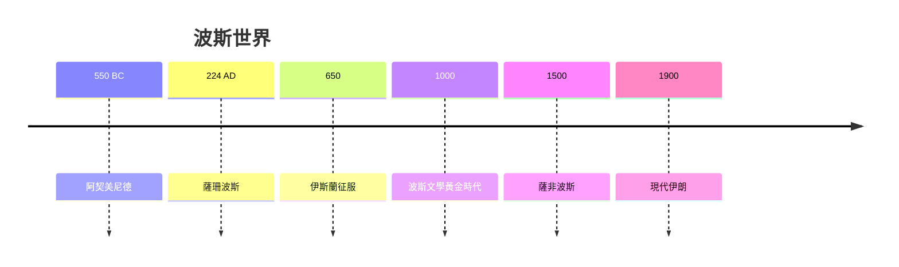
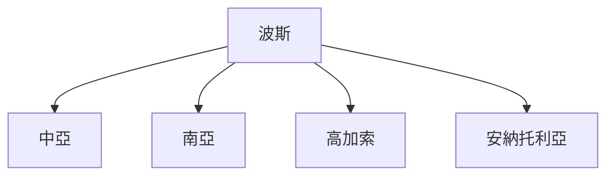
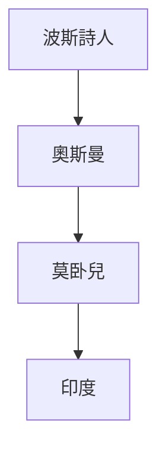

# HIST2222 波斯世界 / The Persianate World (6 credits)

**Instructor**: Devika Shankar
**Department**: History, HKU  
**Official source**: [HKU History Course Description 2024-25](https://history.hku.hk/wp-content/uploads/2024/07/HIST-2425.pdf)
**Style**: 袁騰飛式 — 犀利、聚焦波斯文化圈點解跨文明

---

## 問題 1：這個領域所有專家共享的 5 個核心心智模型

### 心智模型 1：波斯化 (Persianization) 過程
學者 **Dale Eickelman** 研究：波斯語作為文化交流媒介——從巴爾幹到孟加拉。

學者 **Shamsur Rahman Gupta** 分析：波斯語南亞地位。

- 莫卧兒帝國官方語言
- 奥斯曼帝國官僚波斯語
- 印度斯坦古典音樂波斯語根源

### 心智模型 2：波斯文學黃金時代
學者 **Julie Scott Meisami** 研究：波斯詩歌——魯米、哈菲茲、奥馬爾·海亞姆。

學者 **Leonard Lewisohn** 分析：波斯神秘主義文學。

### 心智模型 3：波斯帝國多元宗教
學者 **Maria Massade** 研究：波斯帝國宗教多元——祆教、佛教、伊斯蘭、基督教共存。

學者 **Richard Foltz** 分析：伊斯蘭前期波斯宗教地圖。

### 心智模型 4：現代波斯文化延續
學者 **Ebrahim G. Poor** 研究：現代伊朗波斯文化身份。

學者 **Homa Katouzian** 分析：伊朗革命與波斯文化。

### 心智模型 5：波斯化與帝國治理
學者 **Beatrice Manz** 研究：波斯帝國治理傳統——多元宗教、多語言帝國管理。

---

## 問題 2：3 個根本分歧

### 分歧 1：波斯化——文化傳播定政治霸權？
- **A 方**：文化傳播
  - 波斯文化吸引力
- **B 方**：政治霸權
  - 帝國強制推行

### 分歧 2：波斯語未來——持續衰落定復興？
- **A 方**：衰落
  - 英語全球化
- **B 方**：復興
  - 文化民族主義

### 分歧 3：伊朗伊斯蘭革命——波斯文化終結？
- **A 方**：持續
  - 波斯文化仍在
- **B 方**：断裂
  - 伊斯蘭化

---

## 問題 3：10 個深度問題

1. 如果你去 1200 年波斯世界，你最想見邊個詩人？
2. 點解波斯文化可以跨這麼多帝國？
3. 如果你是歷史學家，點樣研究一個「世界」而非國家？
4. 波斯詩歌點解影響全球文學？
5. 如果你去莫卧兒皇宮，你會發現乜嘢波斯影響？
6. 點解波斯化與伊斯蘭化唔同？
7. 如果你是伊朗人，你點睇波斯文化與伊斯蘭關係？
8. 波斯世界地圖——點解跨越咁多當代國家？
9. 如果你去 2050 年，波斯文化會點樣？
10. 波斯世界對理解今日中東有乜嘢意義？

---

## 核心心智模型深化

### 1. 波斯世界時間線



---

## 5 個 Mermaid 圖解

### 📊 Diagram 1: 波斯世界範圍



### 📊 Diagram 2: 波斯文學影響



### 📊 Diagram 3: 波斯帝國

```mermaid
flowchart TD
    A[波斯] --> B[薩珊王朝]
    B --> C[伊斯蘭哈里發國}
    C --> D[薩非波斯}
```

### 📊 Diagram 4: 波斯宗教多元

```mermaid
flowchart TD
    A[波斯帝國] --> B[祆教]
    B --> C[伊斯蘭}
    C --> D[猶太教}
```

### 📊 Diagram 5: 波斯文化遺產

```mermaid
flowchart TD
    A[波斯語] --> B[文學]
    B --> C[建築}
    C --> D[音樂}
```

---

## 總結

1. 波斯世界跨越文明帝國
2. 波斯文化影響深遠
3. 波斯文學黃金時代持續影響
4. 波斯化與伊斯蘭化複雜關係
5. 波斯世界對理解今日中東重要

**最後問題**: 波斯文化對當代世界有乜嘢 relevant 意義？

---
**版權所有 © HKU History Self-Study**
