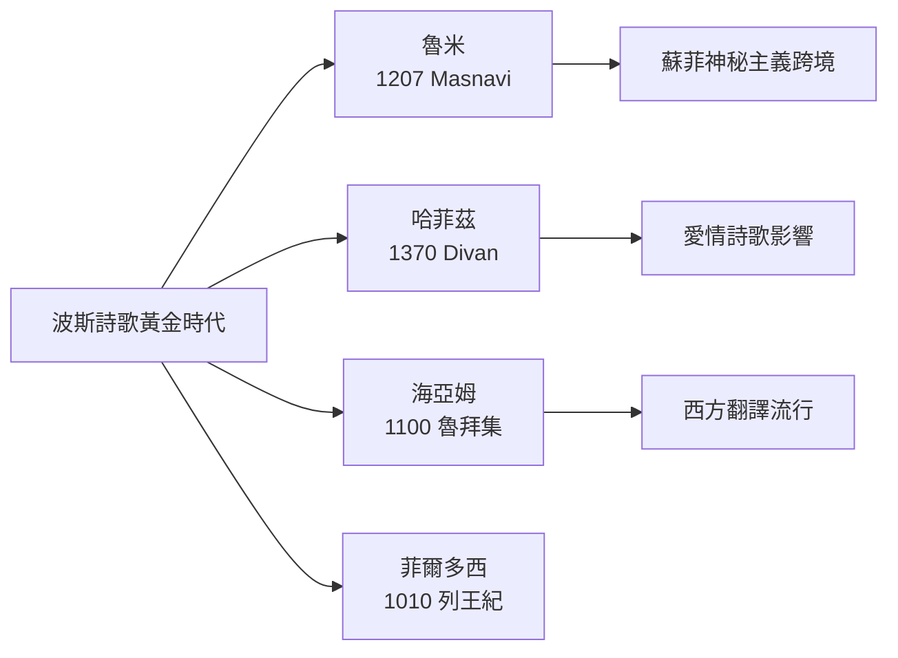
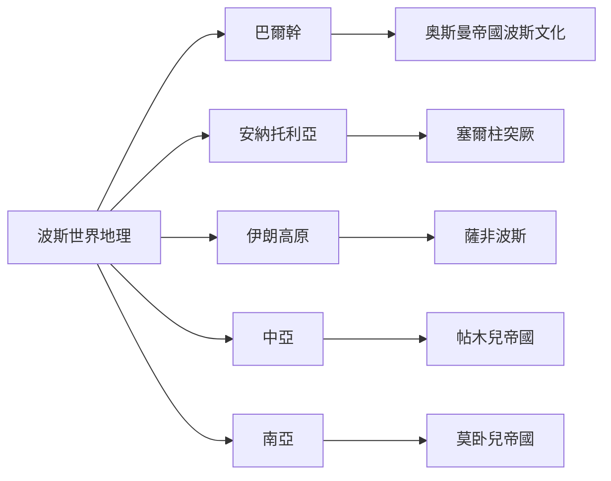
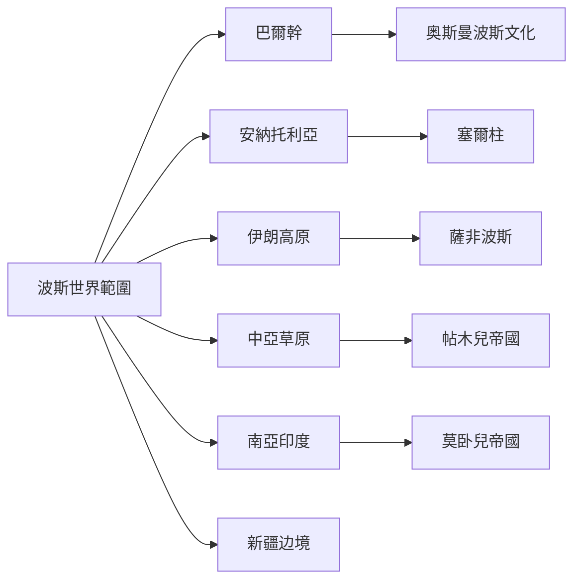
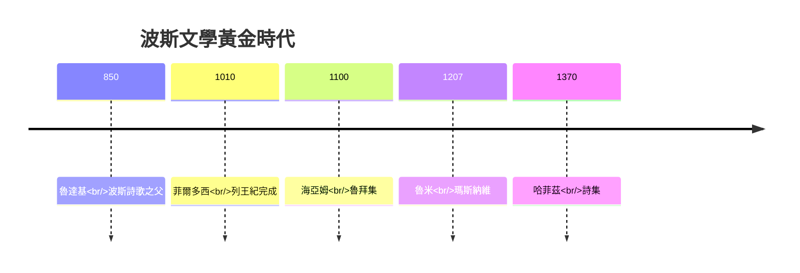

# HIST2222 波斯世界 / Persianate World (6 credits)

**Instructor**: Devika Shankar
**Department**: History, HKU
**Official source**: [HKU History Course Description 2024-25](https://history.hku.hk/wp-content/uploads/2024/07/HIST-2425.pdf)
**Style**: 袁騰飛式 — 犀利、聚焦波斯文化圈點解跨越文明——由巴爾幹到孟加拉，由塞爾維亞到新疆

---

## 問題 1：這個領域所有專家共享的 5 個核心心智模型

### 心智模型 1：「波斯化」(Persianization) 過程
學者 **Dale Eickelman** 研究：波斯語作為文化交流媒介——由巴爾幹到孟加拉、由新疆到塞爾維亞。波斯語係中世紀亞洲「通用語」(lingua franca)。

學者 **Shamsur Rahman Gupta** 分析：波斯語南亞地位——莫卧兒帝國官方語言。

- 波斯語係奥斯曼帝國、莫卧兒帝國、帖木兒帝國通用語
- 波斯詩歌傳入印度、中亞
- 印度斯坦古典音樂波斯語根源（拉格音階）
- 波斯帝國行政制度影響奥斯曼、莫卧兒

### 心智模型 2：波斯文學黃金時代
學者 **Julie Scott Meisami** 研究：波斯詩歌——魯米 (Rumi)、哈菲茲 (Hafez)、奥馬爾·海亞姆 (Omar Khayyam) 塑造全球文學。

學者 **Leonard Lewisohn** 分析：波斯神秘主義文學——蘇菲主義(Sufism) 跨境傳播。

- 1207年：魯米《瑪斯納維》——神秘主義詩歌高峰
- 1370年：哈菲茲《詩集》——波斯愛情詩歌
- 1100年：奥馬爾·海亞姆《魯拜集》——哲學詩歌
- 菲爾多西《列王紀》——波斯史詩

### 心智模型 3：波斯帝國多元宗教
學者 **Maria Massade** 研究：波斯帝國宗教多元——祆教 (Zoroastrianism)、佛教、伊斯蘭、基督教共存。

學者 **Richard Foltz** 分析：伊斯蘭前期波斯宗教地圖——宗教和諧共處模式。

- 651年：波斯薩珊王朝被阿拉伯征服——伊斯蘭化
- 1501年：薩非王朝建立——什葉派伊斯蘭為國教
- 祆教傳入印度——帕西人社區 (Parsees) 至今仍存
- 宗教多元與宗教迫害交織

### 心智模型 4：「非西方全球化模式」
學者 **Sanjay Subrahmanyam** 研究：「聯繫歷史」——波斯世界作為一個非西方嘅全球化模型，挑戰歐洲例外論。

學者 **Nile Green** (*Making Space in the Persianate World*, 2015) 分析：波斯文化跨境流動——詩人、商人、朝聖者、奴隸共同構成。

- 「巴爾幹到孟加拉」——地理範圍
- 詩人跨境：魯米出生於波斯，居住於科尼亞
- 商人跨境：波斯商人控制印度洋貿易
- 朝聖者跨境：伊斯蘭朝聖網絡

### 心智模型 5：現代波斯文化延續與斷裂
學者 **Ebrahim G. Poor** 研究：現代伊朗波斯文化身份——伊斯蘭革命後文化轉型。

學者 **Homa Katouzian** 分析：伊朗革命與波斯文化——伊斯蘭化 vs 波斯民族主義。

- 1979年：伊斯蘭革命——波斯文化與伊斯蘭身份衝突
- 當代伊朗：波斯語言、電影、文學與伊斯蘭法律張力
- 伊朗境外波斯語人口：阿富汗、塔吉克

---

## 問題 2：3 個根本分歧

### 分歧 1：波斯化——文化傳播定政治霸權？
- **A 方**：文化傳播
  - 波斯文化吸引力自然擴散
  - 波斯詩歌、藝術品質高
- **B 方**：政治霸權
  - 波斯化係帝國統治工具
  - 奥斯曼、莫卧兒强制推行

### 分歧 2：波斯語未來——持續衰落定復興？
- **A 方**：衰落
  - 英語全球化
  - 阿拉伯語、土耳其語競爭
- **B 方**：復興
  - 文化民族主義
  - 伊朗、阿富汗、塔吉克波斯語使用者增加

### 分歧 3：伊朗伊斯蘭革命——波斯文化終結？
- **A 方**：持續
  - 波斯文化仍在伊朗日常生活中
  - 電影《一次別離》展示文化張力
- **B 方**：断裂
  - 伊斯蘭化限制波斯文化表達
  - 政治鎮壓文化異見

---

## 問題 3：10 個深度問題

1. 如果你去1200年波斯世界，你最想見邊個詩人？魯米？哈菲茲？菲爾多西？
2. 點解波斯文化可以跨呢麼多帝國？巴爾幹到孟加拉——呢個地理範圍揭示咗乜嘢？
3. 如果你是歴史學家，點樣研究一個「世界」而非國家？呢個方法論挑戰咗邊個預設？
4. 波斯詩歌點解影響全球文學？魯米影響咗西方神秘主義——呢個揭示咗文化傳播乜嘢規律？
5. 如果你去莫卧兒皇宮，你會發現邊個波斯影響？建築、花園、宮廷文化？
6. 點解波斯化與伊斯蘭化唔同？波斯化可以脱離伊斯蘭存在，但係今日伊朗兩者交織。
7. 如果你是伊朗人，你點睇波斯文化與伊斯蘭關係？呢個問題在當代伊朗有幾尖銳？
8. 波斯世界地圖——點解跨越咁多當代國家？呢個「世界」而家仲存在嗎？
9. 如果你去2050年，波斯文化會點樣？伊朗軟實力與波斯語言復興。
10. 波斯世界對理解今日中東有乜嘢意義？但係呢個研究領域有乜嘢當代政治敏感性？

---

## 核心心智模型深化（中英對照）

## 1. 波斯化過程 (Persianization)

### 1.1 Bilingual 概念對照
| 英文概念 | 中英對照 | 歴史含義 | 案例 |
|---|---|---|---|
| Persianization | 波斯化 | 波斯文化/語言傳播 | 莫卧兒帝國 |
| Lingua Franca | 通用語 | 區域性交際語言 | 波斯語 |
| Administrative Culture | 行政文化 | 波斯帝國治理傳統 | 奥斯曼官僚 |
| Cultural Transmission | 文化傳播 | 跨境文化流動 | 波斯詩歌 |
| Literary Culture | 文學文化 | 波斯詩歌傳統 | 魯米/哈菲茲 |

### 1.2 史料與考據
- Dale Eickelman: Middle East and Central Asia (anthropology)
- Nile Green: Making Space in the Persianate World (2015)

### 1.3 袁騰飛式犀利觀察
波斯化最犀利嘅發現：中世紀亞洲全球化唔係歐洲專利——波斯語作為「通用語」横跨巴爾幹到孟加拉，呢個係非西方全球化模型。
當歐洲史學家以為全球化係歐洲發明之時，波斯化已經展示跨境文化傳播可以唔需要政治霸權。

### 1.4 Deep test question
- 如果你去莫卧兒皇宮研究波斯化，你會發現邊啲文化融合同衝突？

### 1.5 圖解
```mermaid
flowchart TD
    A[波斯語言文化] --> B[奥思曼帝國]
    A --> C[莫卧兒帝國]
    A --> D[帖木兒帝國]
    B --> E[行政官僚制度]
    C --> F[宫廷文化]
    D --> G[文學傳統}
    E --> H[波斯化跨境流動}
    F --> H
    G --> H
```

---

## 2. 波斯文學黃金時代

### 1.1 Bilingual 概念對照
| 英文概念 | 中英對照 | 歴史含義 | 案例 |
|---|---|---|---|
| Persian Poetry | 波斯詩歌 | 魯米/哈菲茲/海亞姆 | 全球影響 |
| Sufism | 蘇菲主義 | 伊斯蘭神秘主義 | 跨境傳播 |
| Epic Literature | 史詩文學 | 菲爾多西《列王紀》 | 波斯歴史 |
| Mystical Love | 神秘之愛 | 魯米與沙姆士 | 宗教與愛 |
| Rubaiyat | 魯拜集 | 海亞姆哲學詩歌 | 西方翻譯 |

### 1.2 史料與考據
- Rumi: Masnavi (1207)
- Hafez: Divan (1370)
- Ferdowsi: Shahnameh (1010)

### 1.3 袁騰飛式犀利觀察
波斯文學黃金時代最犀利嘅發現：魯米《瑪斯納維》居然影響咗西方神秘主義——包括歌德、惠特曼。呢個揭示文化傳播可以穿越宗教、文化、語言障礙。
但係當代伊朗：詩歌仍然流行，但係内容受伊斯蘭審查限制。

### 1.4 Deep test question
- 如果你去比較一下魯米同哈菲茲，會發現邊個對當代影響更大？

### 1.5 圖解


---

## 3. 多元宗教共存

### 1.1 Bilingual 概念對照
| 英文概念 | 中英對照 | 歴史含義 | 案例 |
|---|---|---|---|
| Zoroastrianism | 祆教 | 波斯古老宗教 | 《阿維斯陀》|
| Islamic Persia | 伊斯蘭波斯 | 651年後 | 宗教轉型 |
| Religious Coexistence | 宗教共存 | 多元宗教模式 | 波斯帝國 |
| Parsi Community | 帕西人社區 | 印度祆教社群 | 移民史 |
| Jewish Persia | 波斯猶太人 | 宗教跨境 | 歷史記載 |

### 1.2 史料與考據
- Richard Foltz: Religions of Iran (2013)
- 《阿維斯陀》(Zoroastrian scripture)

### 1.3 袁騰飛式犀利觀察
祆教（拜火教）最犀利嘅歷史諷刺：呢個曾經係波斯帝國國教，被阿拉伯伊斯蘭征服後被迫边缘化，但係帕西人社區今日仍然存在於印度——呢個揭示宗教喺政治征服後唔一定消失，只係變形。

### 1.4 Deep test question
- 如果你去研究帕西人社區，你會發現邊個關於宗教韌性令人震驚嘅故事？

### 1.5 圖解
```mermaid
flowchart TD
    A[651年阿拉伯征服] --> B[祆教邊缘化]
    B --> C[帕西人移民印度]
    C --> D[保持宗教傳統至今}
    D --> E[但係人數急劇減少}
    B --> F[伊斯蘭化主流]
    F --> G[宗教多元共處模式消失}
```

---

## 4. 非西方全球化模型

### 1.1 Bilingual 概念對照
| 英文概念 | 中英對照 | 歴史含義 | 挑戰 |
|---|---|---|---|
| Non-Western Globalization | 非西方全球化 | 波斯化作為模型 | 歐洲例外論 |
| Connected History | 聯繫歷史 | Sanjay Subrahmanyam | 跨境網絡 |
| Balkan to Bengal | 巴爾幹到孟加拉 | 波斯世界地理範圍 | 國家邊界局限 |
| Traders and Poets | 商人和詩人 | 跨境流動主體 | 精英vs普通人 |
| Alternative Modernity | 另類現代性 | 波斯現代化 | 歐洲路徑唯一性 |

### 1.2 史料與考據
- Sanjay Subrahmanyam: Connected Histories (1997)
- Nile Green: Making Space in the Persianate World (2015)

### 1.3 袁騰飛式犀利觀察
Sanjay Subrahmanyam最犀利嘅貢獻：「聯繫歷史」方法挑戰以國家為中心嘅歴史敘事——波斯世界跨境流動揭示歷史唔係單一國家嘅故事，而係詩人、商人、朝聖者、奴隸共同編織嘅網絡。

### 1.4 Deep test question
- 如果你去研究巴爾幹到孟加拉嘅波斯化，你會發現邊個令人震驚嘅跨境故事？

### 1.5 圖解


---

## 5. 現代波斯文化延續與斷裂

### 1.1 Bilingual 概念對照
| 英文概念 | 中英對照 | 歴史含義 | 當代案例 |
|---|---|---|---|
| Iranian Revolution | 伊朗革命 | 1979年文化斷裂 | 伊斯蘭化 |
| Persian Cinema | 波斯電影 | 阿巴斯·基亞羅斯塔米 | 文化張力 |
| Tajik Persian | 塔吉克波斯語 | 蘇聯後獨立 | 語言政治 |
| Afghan Persian | 阿富汗波斯語 | 普什圖化 | 語言政策 |
| Persian Identity | 波斯身份 | 跨越國家邊界 | 跨境民族主義 |

### 1.2 史料與考據
- Azar Nafisi: Reading Lolita in Tehran (2003)
- Abbas Kiarostami films

### 1.3 袁騰飛式犀利觀察
Azar Nafisi《在德黑蘭讀洛麗塔》最犀利嘅發現：伊朗女性喺伊斯蘭法律約束下仍然透過西方文學保存人性——呢個揭示文化嘅韌性，唔管政治鎮壓幾嚴厲。

### 1.4 Deep test question
- 如果你去研究伊朗電影，你會發現邊個關於波斯文化與伊斯蘭身份張力令人震驚嘅故事？

### 1.5 圖解
```mermaid
flowchart TD
    A[1979年伊朗革命] --> B[伊斯蘭化政策]
    B --> C[波斯文化受限]
    B --> D[電影審查]
    B --> E[語言政策]
    C --> F[文化抵抗：電影/文學}
    D --> G[阿巴斯·基亞羅斯塔米作品}
    E --> H[塔吉克/阿富汗波斯語政治}
```

---

## 深度自測問題詳解

### 詳解 1: 波斯化與伊斯蘭化差異
波斯化係語言文化傳播，唔需要宗教基礎——波斯化可以脱離伊斯蘭存在。奥斯曼帝國波斯化，但係唔需要皈依伊斯蘭。

### 詳解 2: 波斯文學全球影響
魯米影響咗歌德、惠特曼；菲爾多西《列王紀》影響咗波斯民族主義建構。呢個揭示文化影響可以穿越數百年。

### 詳解 3: 宗教多元共存
祆教被迫边缘化但係帕西人社區仍存——呢個揭示宗教唔係單靠政治力量可以消滅。

### 詳解 4: 聯繫歷史方法
波斯世界研究示範跨境歷史——商人、詩人、朝聖者、奴隸共同構成歷史主體，唔只係帝王將相。

### 詳解 5: 伊朗電影文化張力
阿巴斯·基亞羅斯塔米電影揭示波斯文化同伊斯蘭法律嘅深刻張力——表面上服從但係内心抵抗。

---

## 5 個 Mermaid 圖解

### 📊 Diagram 1: 波斯世界地理範圍


### 📊 Diagram 2: 波斯文學黃金時代


### 📊 Diagram 3: 宗教多元共存
```mermaid
flowchart TD
    A[前伊斯蘭波斯] --> B[祆教國教]
    B --> C[651年伊斯蘭征服]
    C --> D[祆教邊缘化]
    C --> E[伊斯蘭化主流]
    D --> F[帕西人移民印度}
    E --> G[多元宗教共存模式}
    F --> H[宗教韌性}
```

### 📊 Diagram 4: 波斯文化跨境流動
```mermaid
flowchart LR
    A[波斯詩人] --> B[魯米至科尼亞]
    A --> C[波斯商人至印度洋]
    A --> D[朝聖者至麥加]
    A --> E[奴隸至奥斯曼帝國]
    B --> F[文化跨境流動}
    C --> F
    D --> F
    E --> F
```

### 📊 Diagram 5: 伊朗文化政治張力
```mermaid
flowchart TD
    A[波斯文化遺產] --> B[伊斯蘭革命1979]
    B --> C[伊斯蘭化政策]
    B --> D[電影審查制度]
    B --> E[女性限制}
    C --> F[文化抵抗運動}
    D --> G[阿巴斯電影]
    E --> H[Nafisi《在德黑蘭讀洛麗塔》}
```

---

## 總結

1. **波斯化揭示非西方全球化模型——中世紀亞洲跨境文化傳播唔需要歐洲參與，呢個挑戰歐洲例外論。**
2. **波斯文學黃金時代影響全球——魯米、哈菲茲、海亞姆、菲爾多西塑造全球文學傳統。**
3. **宗教多元共存揭示歷史可能性——祆教边缘化但未消失，帕西人社區今日仍存，呢個揭示宗教韌性。**
4. **聯繫歷史方法挑戰以國家為中心——商人、詩人、朝聖者、奴隸共同編織波斯世界歷史。**
5. **伊朗伊斯蘭革命揭示文化政治張力——波斯文化與伊斯蘭身份衝突係未解决嘅歷史問題。**

**最後問題**: 如果你去研究波斯世界，你最想追蹤邊個跨境流動——詩人？商人？奴隸？

---
**版權所有 © HKU History Self-Study**
