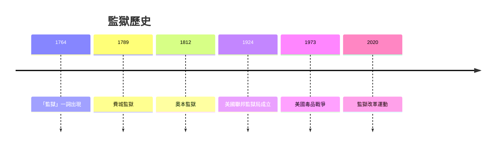
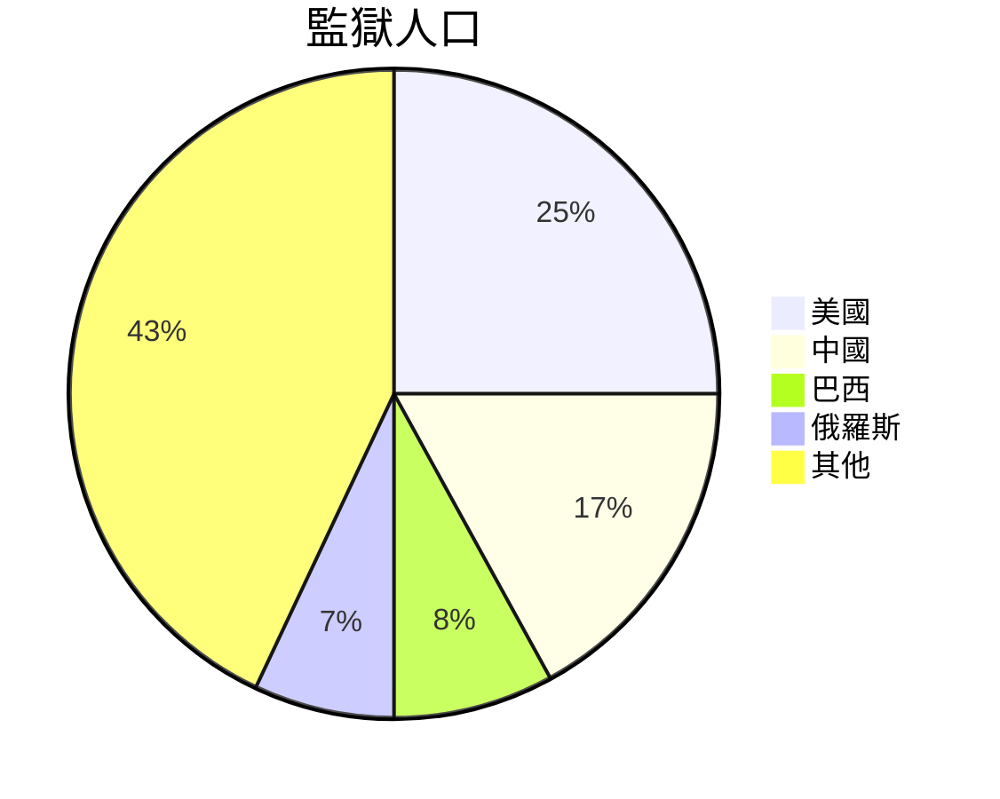

# HIST2225 監獄史 / A Global History of Prisons and Punishment (6 credits)

**Instructor**: Alastair McClure
**Department**: History, HKU  
**Official source**: [HKU History Course Description 2024-25](https://history.hku.hk/wp-content/uploads/2024/07/HIST-2425.pdf)
**Style**: 袁騰飛式 — 犀利、聚焦監獄點解被用作控制工具

---

## 問題 1：這個領域所有專家共享的 5 個核心心智模型

### 心智模型 1：監獄作爲現代發明
學者 **Michel Foucault** (*Discipline and Punish*, 1975) 經典研究：監獄唔係歷史必然，而係 19 世紀「規訓社會」嘅產物。

學者 **David Rothman** (*The Discovery of the Asylum*, 1990) 分析：美國監獄歷史。

- 1764 開始使用「監獄」呢個詞
- 1789 費城建立第一個現代監獄
- 19 世紀監獄制度全球擴張

### 心智模型 2：懲罰與權力
學者 **Michael Ignatieff** 研究：懲罰歷史揭示權力運作——邊個有權惩罚，邊個被懲罰。

學者 **Ruth Wilson Gilmore** (*Abolition Geography*, 2022) 分析：監獄工業複雜。

### 心智模型 3：奴隸監獄與強迫勞動
學者 **Angela Davis** (*Abolition Revolution*, 2003) 研究：監獄奴隸制作為美國歷史延續。

學者 **Alex Lichtenstein** 分析：租囚犯制度 (Convict Leasing)。

### 心智模型 4：全球監獄帝國主義
學者 **Rachel Hall** 研究：監獄作為帝國控制工具——殖民監獄。

學者 **Katherine Ball** 分析：軍事監獄與酷刑。

### 心智模型 5：監獄廢除運動
學者 **Ruth Wilson Gilmore** 研究：監獄廢除運動歷史。

學者 **Patrisse Cullors** 分析：Black Lives Matter 與監獄改革。

---

## 問題 2：3 個根本分歧

### 分歧 1：監獄功能——正義定控制？
- **A 方**：正義
  - 懲罰罪犯、保護社會
- **B 方**：控制
  - 控制邊緣群體

### 分歧 2：監獄改革——可以改革定需要廢除？
- **A 方**：可以改革
  - 改善條件
- **B 方**：需要廢除
  - 系統性問題

### 分歧 3：懲罰形式——监禁最佳？
- **A 方**：监禁
  - 隔離罪犯
- **B 方**：其他形式
  - 修復性司法

---

## 問題 3：10 個深度問題

1. 如果你去 1850 年做監獄田野，你會發現乜嘢？
2. 點解美國監獄人口全球最多？
3. 如果你是歷史學家，點樣研究被監禁者？
4. 監獄廢除運動——點解越來越流行？
5. 如果你去 2049 年，監獄會點樣？
6. 點解某些群體被監禁率更高？
7. 如果你是政策制定者，點樣設計監獄系統？
8. 監獄歷史揭示乜嘢關於社會對邊緣群體態度？
9. 如果你去監獄做訪談，點樣保護受訪者？
10. 監獄與奴隸制——歷史連續性？

---

## 核心心智模型深化

### 1. 監獄歷史時間線



---

## 5 個 Mermaid 圖解

### 📊 Diagram 1: 全球監獄人口



### 📊 Diagram 2: 監獄功能

```mermaid
flowchart TD
    A[懲罰] --> B[隔離]
    B --> C[改造？]
    C --> D[控制}
```

### 📊 Diagram 3: 監獄與權力

```mermaid
flowchart TD
    A[國家權力] --> B[監獄系統}
    B --> C[社會控制}
    C --> D[邊緣群體}
```

### 📊 Diagram 4: 監獄改革運動

```mermaid
flowchart TD
    A[監獄廢除] --> B[Abolition Geography}
    B --> C[Black Lives Matter}
    C --> D[政策改變}
```

### 📊 Diagram 5: 監獄歷史爭議

```mermaid
flowchart TD
    A[監獄] --> B[奴隸制連續性}
    B --> C[種族控制}
    C --> D[當代爭議}
```

---

## 總結

1. 監獄係現代發明非歷史必然
2. 監獄揭示權力運作
3. 監獄與奴隸制歷史連續性
4. 監獄廢除運動興起
5. 監獄改革需要根本反思

**最後問題**: 如果監獄可以廢除，社會點樣處理犯罪？

---
**版權所有 © HKU History Self-Study**
