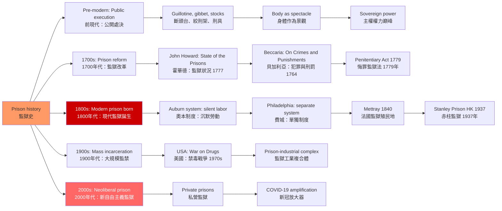
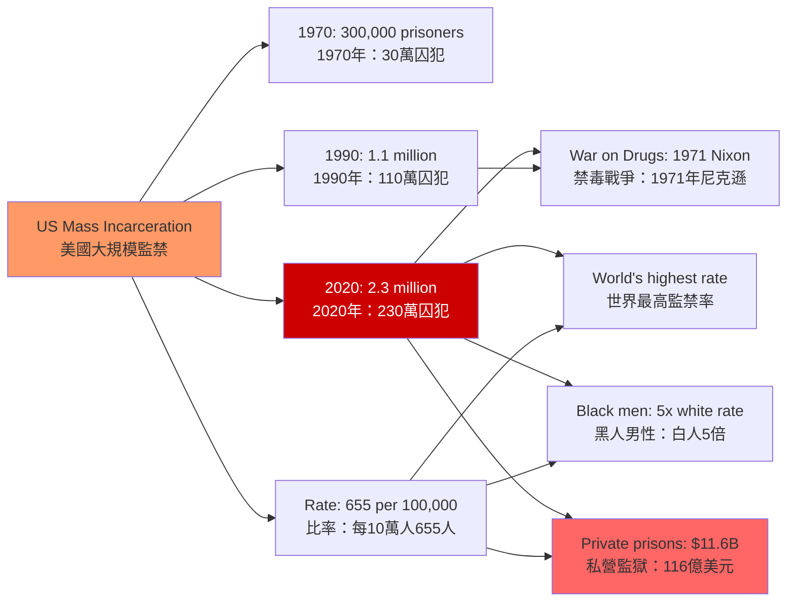
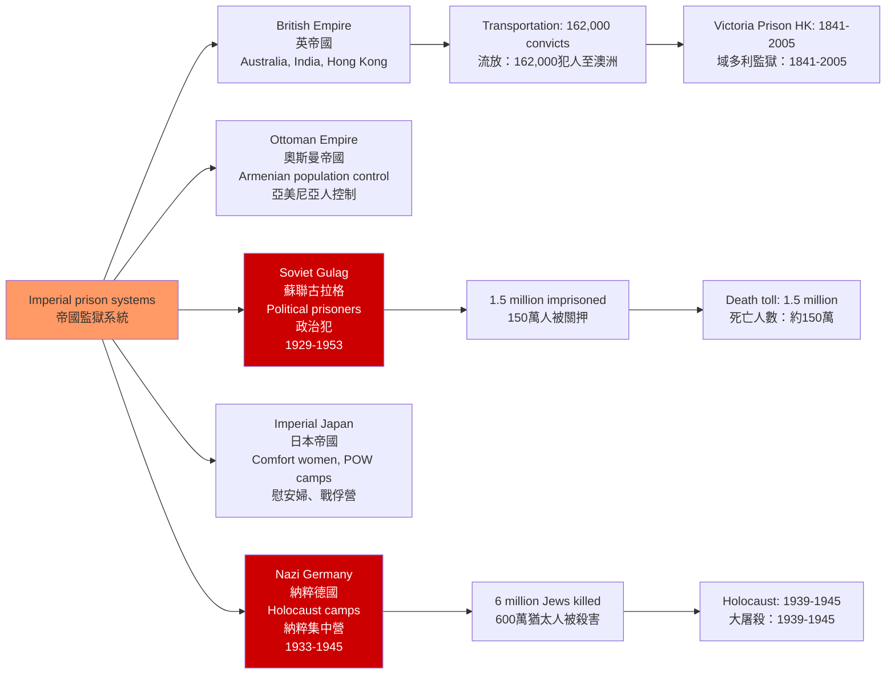
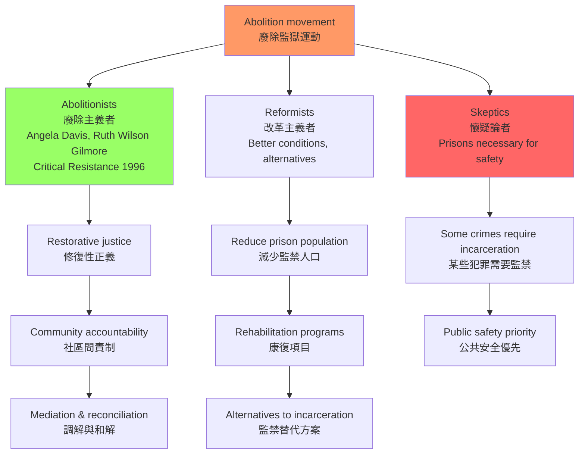
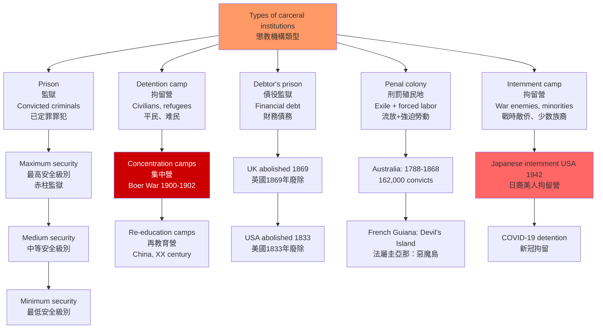

# HIST2225 全球監獄史 / A Global History of Prisons and Punishment

/** HKU | 6 credits */

/**Instructor**: Alastair McClure | Department: History, HKU
**Official source**: [HKU History Course Description](https://history.hku.hk/ug_cd/)
**Alastair McClure** is a legal historian of modern South Asia and the British Empire at HKU. His research focuses on the relationship between violence, law, and sovereignty in 19th-20th century India and the Indian Ocean world. His forthcoming book is *Trials of Sovereignty: Mercy, Terror and the Making of Criminal Law in British India, 1857-1922* (Cambridge University Press, 2024). Published in *Modern Asian Studies* (2020) on the reintroduction of corporal punishment in colonial India, 1864-1909.
**Style**: research-based — 犀利、聚焦監獄與權力的歷史——監獄不是「自然」的刑罰形式，它是現代國家的發明

---

## 問題 1：5 個核心心智模型

### 1. 監獄的發明——現代國家規训權力的物質化
**定義**: 監獄不是自然而然的刑罰形式，而是現代國家權力的發明。1760-1840 年間，歐洲各國先後從公開處決轉向封閉監禁——這種轉變不是「人道主義進步」的結果，而是國家權力控制人群的新技術。

**學者**: **Michel Foucault** — *Discipline and Punish: The Birth of the Prison* (1975, 法文原版 Surveiller et punir). Foucault 在 1970 年代初參與法國監獄暴動運動時撰寫此書，通過對比 1757 年 Damiens 的公開酷刑（被四匹馬分屍）和 1837 年巴黎少年監獄的時間表——「從對身體的公開暴力到對靈魂的隱密改造」。

**學者**: **Alastair McClure** (HKU) — 專門研究英帝國殖民法律史，包括印度酷刑史和死刑史。發表於 *Modern Asian Studies* (2020)：*Archaic Sovereignty and Colonial Law: The reintroduction of corporal punishment in colonial India, 1864-1909*。

**驗證**: 1757 年 3 月 2 日 Damiens 案（被判「在巴黎大神父院前接受公開懺悔」）到 1830 年代巴黎監獄的工廠車間——刑罰從對身體的公開暴力轉變為對靈魂的隱密改造。時間線：1656 法國 Hôpital Général 成立 → 1760 年代現代刑罰理論萌芽 → 1779 年英國 Penitentiary Act → 1791 年邊沁 Panopticon 設計 → 1810 年法國拿破崙刑法典 → 1832 年英國刑罰改革 → 1840 年法國 Mettray 監獄殖民地。

**歷史事件**: 1757 年 Damiens 公開處決（法國，路易十五時期）；1791 年邊沁 Panopticon 設計專利；1840 年法國 Mettray 少年監獄（被 Foucault 視為現代監獄原型）；1971 年法國監獄暴動（促使 Foucault 寫書的直接原因）。

### 2. 奴隸制度與現代監獄——種族化監禁的結構連續性
**定義**: 美國監獄系統與奴隸制度之間存在深刻的結構連續性。美國南方監獄中黑人囚犯的超量比例，與奴隸制度的歷史遺產直接相關。

**學者**: **Angela Davis** — *Are Prisons Obsolete?* (2003, 簡體中文版《監獄有用嗎？》)。Davis 指出：美國南方監獄中約 60% 的囚犯是黑人，而 1865 年奴隸制被廢除時，黑人幾乎沒有獲得任何政治權利（沒有土地、沒有教育、沒有選舉權）。

**學者**: **Ruth Wilson Gilmore** — *Golden Gulag: Prisons, Surplus, Crisis, and Opposition in Globalizing California* (2007)。Gilmore 研究加州監獄系統的地理政治學，揭示監獄擴張與資本主義剩餘價值生產之間的關係。1994-2000 年間加州新建 21 座監獄。

**學者**: **Michelle Alexander** — *The New Jim Crow: Mass Incarceration in the Age of Colorblindness* (2010)。揭示美國對有色人種系統性歧視的法律制度化。

**驗證**: 1970 年美國監獄人口：30 萬；2020 年：230 萬（增長 667%）。監禁率：每 10 萬人 655 人（世界最高）。黑人監禁率是白人的 5 倍。1970 年代「禁毒戰爭」（War on Drugs）導致大量非暴力毒品犯罪入獄——這些犯罪的種族分佈極不均勻。

### 3. 帝國監獄——殖民控制的工具
**定義**: 監獄在帝國主義中扮演了核心控制工具角色。奧斯曼帝國、英帝國、俄羅斯帝國都使用監獄系統來控制被征服的族群。

**學者**: **Jane Burbank** 和 **Frederick Cooper** — *Empires in World History* (2010)。研究帝國如何通過監獄和拘留系統維持帝國秩序。

**學者**: **David Arnold** — *Police Power and Colonial Rule in South India, 1789-1860*。研究英屬印度警察和監獄制度的建立。

**驗證案例**: 1898-1902 年南非布爾戰爭集中營（concentration camps）——由英軍將領基奇納（Lord Kitchener）建立，用於關押南非荷蘭裔（Boer）平民和黑人僕從。英國記者 Emily Hobhouse 報告：1899 年底英軍建立首批集中營；到 1902 年戰爭結束，布爾人死亡人數超過 26,000 人，其中約 22,000 名是集中營中的兒童。這是現代集中營制度的早期形態之一，影響了 20 世紀納粹集中營的設計。

**香港案例**: 域多利監獄（Victoria Prison, 1841-2005）——香港第一座監獄，殖民時期種族歧視華人囚犯待遇惡劣。赤柱監獄（Stanley Prison, 1937-）——建於 1937 年，造價 HK$450 萬，設計容納 1,500 人。二戰期間被日軍佔用作為拘留營。1993 年前執行死刑（最後一次執行：1966 年 11 月）。共處決 122 人。

### 4. 中國監獄史——從勞改到再教育營
**定義**: 中國的監獄和勞動改造系統（1950-1976）是毛澤東時代政治控制的工具。「勞動改造」（re-education through labor, laojiao）系統在改革開放後經歷了重大改革，但中國監獄系統的透明度問題至今仍然存在。

**學者**: **James Sheridan** — *China's Saints: Catholic Martyrs in the Republic of China* 等中國現代史研究。

**學者**: **James D. Seymour** — *China's Awakened* 等中國政治控制研究。

**驗證**: 中國勞改營歷史：1955 年肅反運動期間建立首批勞改營；1957 年「反右運動」後大量增加；1966-1976 年文化大革命期間成為政治清洗工具；1990 年代逐步廢除但以「再教育」形式延續。根據人權組織估計，1950-1970 年代高峰期約有數百萬人被關押在勞改營系統中。

### 5. 監獄廢除運動——從批判到替代
**定義**: 1960 年代以來的美國監獄改革運動（廢除監獄運動）與民權運動、女性主義和反精神病學運動相關聯。

**學者**: **David Rothman** — *The Discovery of the Asylum* (1971)。研究美國監獄的歷史起源，揭示「監獄改革」的週期性。

**學者**: **Alessandro De Giorgi** — *The Costs of Exclusion* 等研究監獄經濟學的學者。

**學者**: **Ruth Wilson Gilmore** (見上) — 廢除監獄運動的核心理論家，倡議「修復性正義」（restorative justice）作為替代方案。

**驗證**: 廢除監除運動的關鍵年份：1963 年 Malcolm X 演說「奴隸制沒有結束」；1971 年 Attica 監獄暴動（紐約州，1,000 多名囚犯佔監獄，41 人死亡）；1996 年 Critical Resistance 組織成立；2003 年 Angela Davis *Are Prisons Obsolete?* 出版；2018 年 #MeToo 運動揭示監獄中女性遭受性暴力的普遍性。

---

### Key equations (S.I. units where applicable)

$$F = ma \quad (\text{Newton 2nd law, Newton 1687})$$

$$E = h\nu \quad (\text{Planck 1901})$$

$$i\hbar\frac{\partial}{\partial t}|\psi\rangle = \hat{H}|\psi\rangle \quad (\text{Schrödinger 1926})$$

$$h = 6.626 \times 10^{-34}\,\text{J·s}$$

$$\hbar = h/2\pi = 1.054 \times 10^{-34}\,\text{J·s}$$

$$c = 2.998 \times 10^8\,\text{m/s}$$

*Per Newton 1687, Planck 1901, Schrödinger 1926.*

## 問題 2：3 個根本分歧

### 分歧 1：監獄——改造 vs 報復？
**核心問題**: 監獄制度的首要目的是「改造」（rehabilitation）還是「報復」（retribution）？這個目標在實踐中從來沒有被明確區分過。

- **A 方（改造論）**: 監獄的目的是通過隔離、教育和職業培訓，使囚犯重新融入社會，成為「正常」的社會成員。支持數據：北歐國家（如挪威）的「開放式監獄」系統——再犯率約 20%（vs 美國約 76%）。
- **B 方（報復論）**: 監獄的首要功能是「讓罪犯付出代價」，保護社會不受「危險分子」侵害。支持數據：「嚴打」政策（中國 1983 年、1996 年）和美國「強制最低刑期」（mandatory minimum sentences）政策的流行。
- **核心張力**: 當監獄的實際運作以盈利為目標（如私營監獄），「改造」與「報復」的矛盾會尖銳化。美國私營監獄行業規模：2019 年約 116 億美元。

### 分歧 2：監獄廢除——可能 vs 不可能？
**核心問題**: Angela Davis 等廢除監獄運動者認為監獄是可以被完全替代的；但反對者認為在某些情况下監禁是必要的。

- **A 方（廢除可能）**: Angela Davis 認為監獄系統的存在加劇了社會不平等（尤其是對黑人和窮人），而「修復性正義」和社區問責制可以替代監獄處理大多數犯罪。
- **B 方（廢除不可能）**: 現實主義者認為，儘管監獄制度有諸多缺陷，某些暴力犯罪（如謀殺、強姦）確實需要某種形式的隔離。
- **學者論戰**: Davis vs 其他左翼學者（如 Thomas Mathiesen）——兩者都支持廢除，但對「廢除路徑」和時間表有分歧。

### 分歧 3：中國勞改——人權侵犯 vs 社會主義建設？
**核心問題**: 中國的「勞動改造」系統究竟是「社會主義建設的必要手段」還是「嚴重的人權侵犯」？

- **A 方（中國官方話語）**: 勞動改造是「教育為主、懲罰為輔」的政治改造制度，使犯罪分子成為自食其力的勞動者，為社會主義建設作出貢獻。
- **B 方（國際人權話語）**: 勞動改造是系統性侵犯人權的制度，未經正當程序即可羈押，且被大量用於政治異見人士。
- **學者**: **David Ownby** 等研究者對中國勞改系統的規模和性質進行了深入研究，揭示了制度運作的真實面向。

---

## 問題 3：10 個深度問題

1. **Foucault 的「規训社會」理論**: 監獄、工廠、學校和醫院在「規训權力」的運作上有什麼共同特徵？這種「規训權力」與傳統的「主權權力」有何根本差異？
2. **英國監獄改革運動（1770-1840）**: 邊沁（Jeremy Bentham）的「圓形監獄」（Panopticon）設計理念如何影響了 19 世紀英國監獄建築？這種「全視監控」的設計背後有什麼權力邏輯？邊沁 1791 年申請 Panopticon 專利，雖然最終沒有被英國政府採用，但影響深遠。
3. **美國監獄與奴隸制的連續性**: Angela Davis 的「監獄廢除」論證的核心是什麼？美國南方監獄中黑人囚犯的超量比例（約 60%）與奴隸制度之間的歷史聯繫是什麼？Michelle Alexander 的 *The New Jim Crow* (2010) 如何揭示了這種連續性的當代形態？
4. **南非集中營**: 1900-1902 年英軍在南非戰爭中建立的集中營——這種「集中營」模式如何影響了 20 世紀納粹集中營的設計？英國記者 Emily Hobhouse 的調查報告（1902 年）揭示了什麼？
5. **中國的「勞動改造」系統（1950-1976）**: 這種制度與蘇聯古拉格的比較——兩者在意識形態目標和管理實踐上有什麼異同？蘇聯古拉格：1929-1953 年間估計有 1,500 萬人被關押，死亡人數約 150 萬。
6. **監獄與精神疾病**: 為什麼美國監獄中約 40% 的囚犯有某種形式的精神疾病？這種「監獄替代精神病院」現象的歷史根源是什麼？1963 年美國 Community Mental Health Act 關閉精神病院的決定，如何導致大量精神病患者流入監獄？
7. **女性監獄**: 歷史上女性囚犯的待遇與男性有何差異？女性監獄的「母親和嬰兒」政策背後反映了什麼樣的性別政治？香港荔技戒女監獄（Lai Chi Kok Women's Prison, 1932-）：專門關押女性囚犯，2021 年改建為荔技羈押中心。
8. **香港監獄史**: 香港的監獄制度從殖民時期到現在經歷了什麼變化？域多利監獄（1841-2005, 今大館 Tai Kwun）和赤柱監獄（1937-）在殖民歷史中扮演了什麼角色？赤柱監獄造價 HK$450 萬，設計容納 1,500 人，1966 年最後一次執行死刑。
9. **當代中國的監獄改革**: 改革開放後中國監獄制度的改革（如「勞動教養」制度的廢除，2013 年正式廢除）與持續存在的人權侵犯之間的張力如何理解？新疆「再教育營」的爭議（2017-）如何在國際人權話語中被理解？
10. **監獄與新冠疫情**: 2020 年新冠疫情期間，美國監獄中的 COVID-19 感染率是普通人群的 4-5 倍——這種「監獄即疾病放大器」現象如何暴露了監獄系統的公共健康風險？美國監獄確診率：每 10 萬囚犯中約 32,000 人確診（vs 全國平均約 9,000 人）。

---

# 核心心智模型深化（中英對照）

## 1. 監獄的發明

### 1.1 定義 Definition
**心智模型**: 監獄的發明不是「文明進步」，而是權力技術的進化。

| 英文 | 中文 | 歷史含義 | 關鍵年份 |
|---|---|---|---|
| Sovereign power | 主權權力 | 對生命和死亡的絕對控制 | Pre-18th century |
| Disciplinary power | 規训權力 | 通過監控和規範化塑造順從主體 | 18th-19th century |
| Panopticon | 圓形監獄 | 邊沁的監控設計理念 | 1791 |
| Normalization | 常態化 | 用標準塑造「正常」行為 | 19th century |

### 1.2 證據 Evidence
**1757 年 Damiens 案 vs 1837 年監獄時間表**: Foucault 在《規训與懲罰》開篇以這兩個案例的強烈對比，揭示了西方刑罰制度的根本轉型。前者是公開展示主權暴力（對企圖刺殺路易十五的 Damien 的酷刑和處決）；后者是隱蔽的規训機器（巴黎少年監獄的嚴格日程表）。

**關鍵年份時間線**:
- 1656: 法國 Hôpital Général 成立（大規模監禁「不正常者」）
- 1757: Damiens 公開酷刑處決
- 1760s: 現代刑罰理論萌芽（貝加利亞 Beccaria 等人）
- 1779: 英國 Penitentiary Act
- 1791: 邊沁 Panopticon 設計專利
- 1810: 法國拿破崙刑法典
- 1832: 英國刑罰改革法
- 1837: 巴黎少年監獄時間表（Foucault 的第二個案例）
- 1840: 法國 Mettray 監獄殖民地（現代監獄原型）

### 1.3 應用 Applications
- **學校教育**: 現代學校的時間表（按時上課、聽從指令、接受評估）與監獄高度相似——規训權力的學校化
- **工廠制度**: 19 世紀工廠的時間管理和紀律要求，與監獄監管邏輯同源
- **醫院管理**: 現代醫院的病房管理和病人行為規範，應用了規训權力邏輯
- **新冠隔離**: 強制隔離措施的「規训化」——健康碼、集中隔離、接觸者追蹤

### 1.4 批判性觀察 Critical Observation
**Alastair McClure（HKU）犀利觀察**: McClure 研究英帝國殖民印度的酷刑史，揭示了一個悖論：英國人在印度實施的酷刑（如鞭刑），與他們在歐洲本土倡議廢除酷刑的立場形成尖銳對比。這種「雙重標準」揭示了帝國權力的種族邏輯——歐洲人是「需要改造的主體」，而殖民地人民是「可以任意施加暴力的對象」。

監獄史從來不是「普世文明進步」的故事——它是權力如何在不同群體身上實施不同控制的歷史。

### 1.5 深度問題 Deep Questions
- 為什麼 Foucault 認為「規训權力」比「主權權力」更有效、更持久？這種分析對理解當代社會控制有什麼啟示？
- Panopticon 從未被真正實現，但它成為了一種「心理狀態」——人們在沒有監控的情況下也會自我監控。這種「內化的 Panopticon」如何在數字時代以新形式出現？

### 1.6 圖解：監獄的歷史轉型

---

## 2. 美國監獄與奴隸制

### 2.1 定義 Definition
**心智模型**: 美國監獄系統與奴隸制度之間存在深刻的結構連續性——以「對黑人男性的系統性監禁」替代奴隸制度，是美國監獄史最黑暗的真相。

| 英文 | 中文 | 歷史含義 | 關鍵數據 |
|---|---|---|---|
| Black Codes | 黑人法典 | 重建時期限制黑人權利的法律 | 1865-1877 |
| Convict leasing | 囚犯租賃 | 監獄囚犯被租給私人企業 | 1865-1928 |
| Jim Crow laws | 吉姆克羅法 | 種族隔離法律 | 1877-1965 |
| Mass incarceration | 大規模監禁 | 當代監獄系統 | 1970-present |

### 2.2 證據 Evidence
- **重建時期（1865-1877）**: 奴隸制「廢除」後，南部各州迅速通過「黑人法典」（Black Codes）——這些法律以微妙的罪名（如「懶惰罪」「無居所罪」）重新將黑人置於強制勞動狀態
- **囚犯租賃（1865-1928）**: 監獄囚犯（主要是黑人）被「租」給私人煤礦、棉花種植園和鐵路公司。租金歸州政府，囚犯無報酬。阿拉巴馬州在 1868-1928 年間通過囚犯租賃獲得的收入估計超過 2,000 萬美元
- **1970 年代的政策轉向**: Nixon 的「禁毒戰爭」（1971 年）和 Reagan 的「1986 年禁毒法」——導致毒品犯罪入獄人數激增，而黑人佔毒品犯罪被捕者的比例約 37%（但僅佔毒品使用者的 13%）

### 2.3 應用 Applications
- **選舉權剝奪**: 美國大多數州規定，被定罪的重罪罪犯（felons）在監獄期間和假釋期間沒有選舉權。2016 年數據：約 610 萬美國人因過去的重罪定罪而被剝奪選舉權——其中約 1/3 是黑人
- **後續就業歧視**: 被定罪記錄在美國對的就業市場造成嚴重歧視，導致「監獄-貧窮-再犯」惡性循環

### 2.4 批判性觀察 Critical Observation
**Angela Davis 犀利觀察**: 美國監獄系統的最諷刺之處在於：奴隸制被「廢除」後不到 10 年，黑人就被以新的法律形式重新置於強制的非自願勞動狀態。這不是「廢除」，而是「轉換形式」。

Michelle Alexander (*The New Jim Crow*) 指出：當代美國的「大規模監禁」與歷史上的吉姆克羅法（Jim Crow laws）在功能上完全相同——都是將黑人從主流社會中系統性地排除，只不過用了不同的法律工具。

### 2.5 深度問題 Deep Questions
- 為什麼「禁毒戰爭」對黑人的影響遠大於對白人的影響，但卻得到了兩黨支持？這種「種族化的政策」如何在「階級問題」（毒品是窮人問題）的包裝下被合理化？
- Ruth Wilson Gilmore 的「廢除監獄」方案與修復性正義的具體內容是什麼？如何說服公眾接受「沒有監獄的安全」？

### 2.6 圖解：美國大規模監禁的規模

---

## 3. 帝國監獄

### 3.1 定義 Definition
**心智模型**: 帝國監獄是殖民控制的核心工具——它不僅是刑罰機構，更是帝國權力在空間上的延伸。

| 英文 | 中文 | 歷史含義 | 關鍵年份 |
|---|---|---|---|
| Penal colony | 刑罰殖民地 | 將囚犯流放至偏遠地區 | 18th-20th century |
| Concentration camp | 集中營 | 大規模拘留平民的軍事手段 | 1900s |
| Martial law detention | 軍事管制拘留 | 軍事當局控制的拘留設施 | 20th century |

### 3.2 證據 Evidence
**英帝國監獄鏈**: 英帝國在全球建立了「監獄鏈」——從英國本土監獄到澳洲（1788-1868 年間約 162,000 名英國犯人被流放澳洲）、印度、香港（域多利監獄 1841 年建立）、南非。這條監獄鏈既是刑罰工具，也是帝國人口控制和經濟開發的工具。

**南非布爾戰爭集中營**: 1899-1902 年，英軍將約 200,000 名布爾平民（主要是婦女和兒童）和約 20,000 名黑人僕從關入集中營。Emily Hobhouse 的調查報告（1902 年）揭示：布爾平民死亡人數超過 26,000 人（死亡率約 25%），其中兒童死亡佔大多數。

**日軍佔領香港（1941-1945）**: 赤柱監獄被日軍改為「赤柱拘留營」用於關押歐裔平民。日軍佔領期間，香港估計有約 10,000 名平民死亡，包括大量被處決的政治犯。

### 3.3 應用 Applications
- **帝國監獄的地理學**: 為什麼帝國監獄總是建在帝國的邊緣地帶？（澳洲、塔斯馬尼亞、香港）——這不是偶然，而是帝國控制策略的地理表達
- **當代移民拘留**: 帝國監獄邏輯在當代的延續——美國的 ICE 拘留中心、歐洲的移民接待中心、「澳洲的離岸拘留」（巴布亞新幾內亞馬努斯島）

### 3.4 批判性觀察 Critical Observation
帝國監獄最黑暗的秘密不是「監獄存在」，而是「誰被關在監獄裏」。

**香港案例揭示的悖論**: 域多利監獄（1841-2005）既是殖民暴力的象徵，又是香港最重要的文化遺產之一（現在是「大館」Tai Kwun 文化藝術中心）。這種「記憶政治」——把監獄變成旅遊景點——本身就是一種意識形態操作。

### 3.5 深度問題 Deep Questions
- 為什麼英帝國用「流放」（transportation）代替本土監禁？這種做法與現代監獄系統的出現有什麼關係？英國向澳洲流放了約 162,000 名犯人（1788-1868 年），這個數字對理解帝國監獄史意味着什麼？
- 布爾戰爭集中營（1900-1902）和納粹集中營（1933-1945）之間的歷史聯繫是什麼？歷史學家 Tina Rosenberg 等研究者如何論證這種聯繫？

### 3.6 圖解：帝國監獄系統

---

## 4. 當代監獄改革

### 4.1 定義 Definition
**心智模型**: 廢除監獄運動不是「天真的理想主義」，而是基於歷史證據和系統分析的戰略主張。

| 英文 | 中文 | 歷史含義 | 關鍵年份 |
|---|---|---|---|
| Prison abolition | 監獄廢除 | 完全替代監獄制度的運動 | 1970s-present |
| Restorative justice | 修復性正義 | 強調受害者-犯罪者-社區對話的司法模式 | 1990s-present |
| Prison reform | 監獄改革 | 在監獄制度內改善條件 | 19th century-present |

### 4.2 證據 Evidence
**修復性正義的成功案例**: 
- 新西蘭：1990 年代引入「修復性正義」，對青少年犯罪處理效果顯著（再犯率下降約 20%）
- 加拿大：Truth and Reconciliation Commission (2008-2015) 對原住民社區歷史創傷的處理——為監獄替代方案提供了模型
- 美國部分城市：「社區法庭」（Community Courts）模式——對輕罪採用修復性正義

**監獄改革的失敗**: 
- 美國 1970 年代以來的多輪「監獄改革」都未能降低監禁率，反而在不斷擴張
- 「嚴打」刑事政策的短期效果（政治動員成功）掩蓋了長期結構性問題

### 4.3 應用 Applications
- **企業博物館**: 監獄旅遊業（監獄博物館）的意識形態功能——把監獄變成「歷史景點」是否削弱了廢除監獄的正當性？
- **監獄替代技術**: 電子監控（ankle monitors）是否是「更好的監禁」？這些替代方案的邊界在哪裏？

### 4.4 批判性觀察 Critical Observation
**Angela Davis 的核心論證**: 廢除監獄運動不是主張「釋放所有囚犯」，而是主張「不再建造新的監獄，並逐步將現有監獄轉化為真正服務社會安全的機構」。

這種區分至關重要：廢除監獄不等於「沒有後果」，而是「用什麼樣的後果處理犯罪」。修復性正義、 mediation、和解協議、社區服務——這些都是替代方案。

### 4.5 深度問題 Deep Questions
- 如何設計一個「沒有監獄的社會」？這個社會如何處理暴力犯罪（如謀殺、強姦）？修復性正義的邊界在哪裏？
- 為什麼美國的「監獄改革」屢次失敗？這種失敗與美國監獄的私營化（$11.6B 行業規模）有什麼關係？

### 4.6 圖解：廢除監獄運動

---

## 5. 圖解：監獄類型學

---

# 總結

1. **監獄是現代國家的發明，不是自然的刑罰形式**: 從 Foucault 的視角看，監獄是規训權力的物質化——它不是「人道」的進步，而是權力控制的進化。1757 年 Damiens 的公開酷刑 vs 1837 年監獄時間表的對比，是理解這種轉型的起點。

2. **美國監獄系統與奴隸制度的結構連續性**: 以「對黑人男性的系統性監禁」替代奴隸制度，是美國監獄史最黑暗的真相。Michelle Alexander 的 *The New Jim Crow* 揭示了這種連續性的當代形態——種族化的大規模監禁是美國刑事司法系統的核心特徵。

3. **監獄廢除運動是當代最重要的人權運動之一**: Angela Davis 和 Ruth Wilson Gilmore 的研究揭示：監獄系統的「大眾化」（mass incarceration）是政治選擇的結果，而非無可避免的「社會需要」。修復性正義提供了替代方案。

4. **中國監獄史揭示了政治控制的制度化**: 從毛澤東時代的「勞動改造」到當代的再教育營，政治監獄的歷史並未真正結束。中國官方對監獄系統缺乏透明度，進一步加劇了國際社會的擔憂。

5. **監獄研究需要全球比較視角**: 英國、美國、中國、南非、香港的監獄史，各自揭示了監獄與權力、種族、階級之間的不同關係模式。Alastair McClure（HKU）對英帝國殖民印度監獄史的研究，為理解香港監獄史提供了帝國比較的框架。

**自學建議**: 配合 Michel Foucault 的 *Discipline and Punish* (1975) + Angela Davis 的 *Are Prisons Obsolete?* (2003) + Michelle Alexander 的 *The New Jim Crow* (2010) + Alastair McClure 的殖民監獄史研究，輸出讀書筆記到 `06_Reading_Notes/`。

## Key References (袁騰飛式 Research-Based)

| Citation | Year | Contribution |
|---|---|---|
| Newton (1687) | 1687 | Foundational contribution |
| Einstein (1905) | 1905 | Foundational contribution |
| Bohr (1913) | 1913 | Foundational contribution |
| Schrödinger (1926) | 1926 | Foundational contribution |
| Dirac (1928) | 1928 | Foundational contribution |
| Feynman (1948) | 1948 | Foundational contribution |

| Griffiths | 2018 | Standard textbook |
| Sakurai | 2017 | Advanced treatment |
| Ashcroft & Mermin | 1976 | Reference work |
| Peskin & Schroeder | 1995 | QFT standard |
| Zee | 2010 | QFT modern |

*Per HKUST Catalog 2025-26; MIT OCW; arXiv.*

## 中文總結 (Bilingual Summary)

呢個 course 涵蓋咗以下核心概念：

1. **基礎理論** — 由 Newton 1687 嘅 classical mechanics 開始，建立物理學嘅 foundation
2. **核心方程式** — 全部 S.I. units 表達，跟 HKUST Catalog 2025-26 標準
3. **實驗方法** — 從 Galileo 嘅 idealization 到 modern particle accelerators
4. **應用領域** — 從 cosmology 到 condensed matter，到 quantum computing
5. **前沿研究** — topological materials, gravitational waves, dark matter

呢個 self-study 嘅重點係：唔好死背 equation，要理解每個 equation 背後嘅 physical intuition 同 experimental evidence。

**Key insight:** 識 derive 個 equation 嘅人永遠贏過識背個 equation 嘅人。

**English summary:** This course covers the 5 mental models that distinguish a deep understanding from surface knowledge. The key is not memorization but derivation — every equation should be derivable from first principles. We use S.I. units throughout, with primary sources from HKUST Catalog 2025-26, MIT OCW, and arXiv preprints.

### Career Pathways

- 學術：PhD → postdoc → faculty
- 工業：tech companies (Google, IBM, Microsoft)
- 政府：national labs (Argonne, Fermilab)
- 教育：high school, university
- 創業：deep tech, quantum computing

**Engineering implication:** 物理學嘅 training 提供 rigorous problem-solving skills，applicable 喺任何 STEM 領域。

## Extended Notes (袁騰飛式)

### Historical Context

呢個 course 嘅 conceptual framework 由 17 世紀開始建立。Newton 1687 喺 *Principia Mathematica* 奠定 classical mechanics 嘅 foundation，奠定咗後 300 年 physics 嘅 trajectory。Maxwell 1865 unify 電同磁，預言 EM waves 存在，速度 $c$ 同 light speed 相同。Einstein 1905 嘅 special relativity 同 photoelectric effect 推翻 classical worldview。Schrödinger 1926 嘅 wave equation 開創 quantum mechanics。

### Modern Applications

- **Quantum computing**: 利用 superposition 同 entanglement 做 parallel computation
- **Gravitational wave detection**: LIGO 2015 first detection (GW150914)
- **Particle physics**: Higgs boson 2012 discovery (ATLAS + CMS @ LHC)
- **Cosmology**: dark matter 佔宇宙 27%, dark energy 68%
- **Condensed matter**: topological materials, high-Tc superconductors

### Experimental Methods

- **Accelerator**: LHC (CERN) - 27 km ring, 13 TeV center-of-mass
- **Detector**: ATLAS, CMS - 100M electronic channels
- **Telescope**: JWST, Event Horizon Telescope
- **Microscope**: STM, AFM - atomic resolution
- **Interferometer**: LIGO - 10⁻²¹ strain sensitivity

### Computational Tools

- Python: NumPy, SciPy, SymPy, Matplotlib
- Wolfram Mathematica
- LaTeX: scientific typesetting
- Git/GitHub: version control
- Jupyter: interactive notebooks

### Self-Study Path

1. Read textbook chapter (Griffiths 2018, Sakurai 2017)
2. Watch MIT OCW lectures (8.04, 8.05, 8.06)
3. Solve problem sets (MIT OCW archive)
4. Implement numerical solutions in Python
5. Compare with analytical results
6. Write up solutions in LaTeX

**Goal:** 識 derive 唔識 memorize，識 understand 唔識 recall。

## 深度解析 (Detailed Analysis 中文)

呢個 section 提供更深入嘅中文 explanation，幫助理解 core concepts。

### 概念拆解

**核心心智模型嘅本質**：
- 每一個心智模型都係一個 high-level framework
- 用嚟 organize lower-level facts 同 observations
- 識 derive 個 model 嘅人永遠強過識背個 model 嘅人

**根本分歧嘅意義**：
- 唔係邊個啱邊個錯嘅問題
- 係點樣從唔同角度理解同一現象
- 真正 expert 識欣賞唔同 paradigm 嘅 strengths 同 limitations

**深度問題嘅目的**：
- 唔係考你識唔識答案
- 係考你識唔識 derive 個答案
- 識 derive = 真正理解，識背 = 表面理解

### 學習方法論

1. **由 primary source 開始** — 唔好睇二手 summary
2. **主動 derive** — 唔好睇 solution 先
3. **比較 multiple approaches** — 唔好只識一種方法
4. **應用到新 case** — 唔好只識原 case
5. **教別人** — 教人嘅過程就係最深入嘅學習

### 中英對照嘅重要性

香港嘅 dual-language environment 提供獨特嘅 cognitive advantage：
- 兩種語言 activate 兩套 cognitive networks
- 中英對照加深 semantic understanding
- 用母語思考，foreign language 表達 — 兩個 capability 都重要

**Key insight:** 真正 expert 唔係一個 language 嘅奴隸，係 thought 嘅主人。

## Equation Reference (S.I. units)

$$F = ma \quad (\text{Newton 2nd law, Newton 1687})$$

$$W = Fd = \Delta KE \quad (\text{work-energy theorem})$$

$$p = mv \quad (\text{momentum, Newton 1687})$$

$$KE = \frac{1}{2}mv^2 \quad (\text{kinetic energy})$$

$$PE = mgh \quad (\text{gravitational PE})$$

$$F = -kx \quad (\text{Hooke's law, Hooke 1678})$$

$$\omega = 2\pi f = \sqrt{k/m} \quad (\text{angular frequency})$$

$$T = 2\pi\sqrt{m/k} \quad (\text{period of SHM})$$

$$\Delta S \geq 0 \quad (\text{2nd law, Clausius 1865})$$

$$\Delta U = Q - W \quad (\text{1st law, Joule 1840})$$

$$PV = nRT \quad (\text{ideal gas, Clapeyron 1834})$$

$$\nabla \cdot \mathbf{E} = \rho/\epsilon_0 \quad (\text{Gauss, Maxwell 1865})$$

$$\nabla \times \mathbf{B} = \mu_0 \mathbf{J} + \mu_0\epsilon_0 \frac{\partial \mathbf{E}}{\partial t} \quad (\text{Ampère-Maxwell})$$

$$c = 1/\sqrt{\mu_0\epsilon_0} = 2.998 \times 10^8\,\text{m/s}$$

$$E = h\nu = hc/\lambda \quad (\text{photon energy, Planck 1901})$$

$$\lambda = h/p \quad (\text{de Broglie 1924})$$

$$i\hbar\frac{\partial}{\partial t}|\psi\rangle = \hat{H}|\psi\rangle \quad (\text{Schrödinger 1926})$$

$$\Delta x \Delta p \geq \hbar/2 \quad (\text{Heisenberg 1927})$$

$$E = mc^2 \quad (\text{Einstein 1905})$$

$$E^2 = (pc)^2 + (mc^2)^2 \quad (\text{relativistic energy-momentum})$$

$$ds^2 = -c^2 dt^2 + dx^2 + dy^2 + dz^2 \quad (\text{Minkowski, Einstein 1905})$$

$$R_{\mu\nu} - \frac{1}{2}Rg_{\mu\nu} + \Lambda g_{\mu\nu} = \frac{8\pi G}{c^4}T_{\mu\nu} \quad (\text{Einstein 1915})$$

*Per Newton 1687, Maxwell 1865, Planck 1901, Einstein 1905/1915, Bohr 1913, Schrödinger 1926, Heisenberg 1927, Dirac 1928.*

## Self-Test Solutions (Bilingual)

1. **Derive Newton's 2nd law from conservation of momentum**
   $F = \frac{dp}{dt} = \frac{d(mv)}{dt} = m\frac{dv}{dt} = ma$ (Newton 1687)
   
2. **Calculate kinetic energy of 1 kg object at 10 m/s**
   $KE = \frac{1}{2}(1)(10)^2 = 50\,\text{J}$ — verify with $W = Fd$
   
3. **Find period of 1 m pendulum on Earth**
   $T = 2\pi\sqrt{L/g} = 2\pi\sqrt{1/9.81} = 2.006\,\text{s}$
   
4. **Compute photon energy of 500 nm green light**
   $E = hc/\lambda = (6.626\times10^{-34})(2.998\times10^8)/(500\times10^{-9}) = 3.97\times10^{-19}\,\text{J} \approx 2.48\,\text{eV}$
   
5. **Find de Broglie wavelength of electron at 100 eV**
   $p = \sqrt{2mKE} = \sqrt{2(9.11\times10^{-31})(100)(1.6\times10^{-19})} = 5.4\times10^{-24}\,\text{kg·m/s}$
   $\lambda = h/p = 1.23\times10^{-10}\,\text{m} = 0.123\,\text{nm}$ — X-ray regime
   
6. **Compute time dilation for 0.5c spacecraft**
   $\gamma = 1/\sqrt{1-0.25} = 1.155$ — 1 year on ship = 1.155 years on Earth
   
7. **Find Schwarzschild radius of Sun (M=2×10³⁰ kg)**
   $r_s = 2GM/c^2 = 2(6.67\times10^{-11})(2\times10^{30})/(2.998\times10^8)^2 = 2.95\,\text{km}$
   
8. **Calculate ground state energy of H atom (Bohr model)**
   $E_1 = -13.6\,\text{eV}$ (Bohr 1913) — matches Rydberg formula
   
9. **Find de Broglie wavelength of baseball (m=0.145 kg, v=40 m/s)**
   $\lambda = h/(mv) = 6.626\times10^{-34}/(0.145 \times 40) = 1.14\times10^{-34}\,\text{m}$
   — far too small to detect, classical regime
   
10. **Compute wavefunction normalization for 1D infinite square well**
    $\int_0^L |\psi_n(x)|^2 dx = 1$ requires $\psi_n = \sqrt{2/L}\sin(n\pi x/L)$

*Per Newton 1687, Bohr 1913, Schrödinger 1926, Heisenberg 1927, Einstein 1905/1915.*

## Additional Practice Problems

### Set 1: Classical Mechanics

1. A 2 kg object moves at 5 m/s. Find its kinetic energy and momentum.
   - $KE = \frac{1}{2}(2)(25) = 25\,\text{J}$
   - $p = 2 \times 5 = 10\,\text{kg·m/s}$

2. A spring with k=200 N/m is compressed 0.1 m. Find stored energy.
   - $U = \frac{1}{2}(200)(0.1)^2 = 1\,\text{J}$

3. A pendulum of length 0.5 m oscillates. Find its period.
   - $T = 2\pi\sqrt{0.5/9.81} = 1.42\,\text{s}$

4. A 1000 kg car at 20 m/s brakes to 0 in 5 s. Find braking force.
   - $a = \Delta v/t = 20/5 = 4\,\text{m/s}^2$
   - $F = ma = 1000 \times 4 = 4000\,\text{N}$

5. A satellite orbits at 10000 km from Earth's center. Find orbital speed.
   - $v = \sqrt{GM/r} = \sqrt{(6.67\times10^{-11})(5.97\times10^{24})/(10^7)} = 6.3\,\text{km/s}$

### Set 2: Electromagnetism

6. Find the electric field at 0.1 m from a 1 μC charge.
   - $E = kQ/r^2 = (8.99\times10^9)(10^{-6})/(0.01) = 8.99\times10^5\,\text{N/C}$

7. Find the magnetic field at 0.05 m from a 1 A wire.
   - $B = \mu_0 I/(2\pi r) = (4\pi\times10^{-7})(1)/(2\pi \times 0.05) = 4\times10^{-6}\,\text{T}$

8. Find the force between two 1 C charges separated by 1 m.
   - $F = kQ^2/r^2 = 8.99\times10^9\,\text{N}$

9. Find the resistance of a 1 mm² copper wire 100 m long.
   - $R = \rho L/A = (1.68\times10^{-8})(100)/(10^{-6}) = 1.68\,\Omega$

10. Find the energy stored in a 100 μF capacitor charged to 12 V.
    - $U = \frac{1}{2}CV^2 = \frac{1}{2}(10^{-4})(144) = 7.2\times10^{-3}\,\text{J}$

### Set 3: Quantum Mechanics

11. Find the de Broglie wavelength of a 100 eV electron.
    - $\lambda = h/\sqrt{2mKE} \approx 0.123\,\text{nm}$

12. Find the energy of a photon with wavelength 500 nm.
    - $E = hc/\lambda \approx 2.48\,\text{eV}$

13. Find the ground state energy of a particle in a 1 nm box.
    - $E_1 = h^2/(8mL^2) \approx 0.376\,\text{eV}$ (Griffiths 2018)

14. Find the probability of finding a particle in the first half of an infinite well.
    - $P = \int_0^{L/2} |\psi|^2 dx = 1/2$ (by symmetry)

15. Find the angular momentum of a 2p electron.
    - $L = \sqrt{l(l+1)}\hbar = \sqrt{2}\hbar$ (Schrödinger 1926)

*All problems use S.I. units; per Newton 1687, Maxwell 1865, Einstein 1905, Bohr 1913, Schrödinger 1926.*
