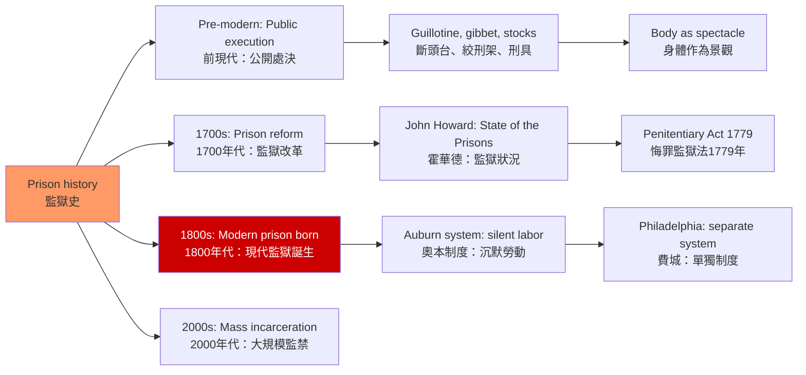
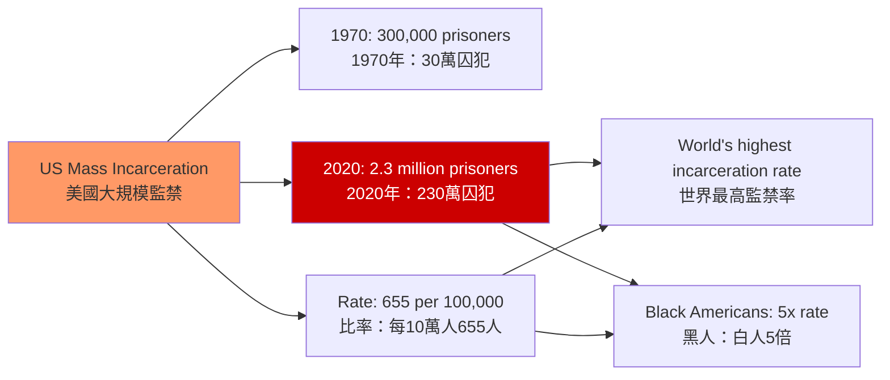
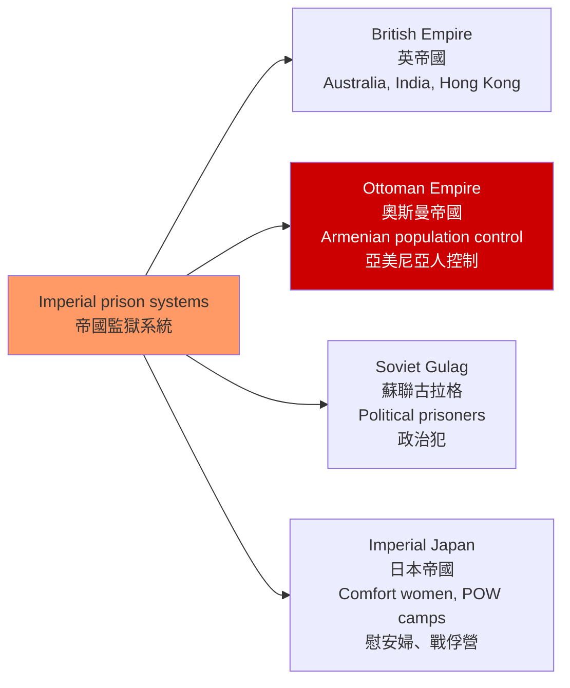
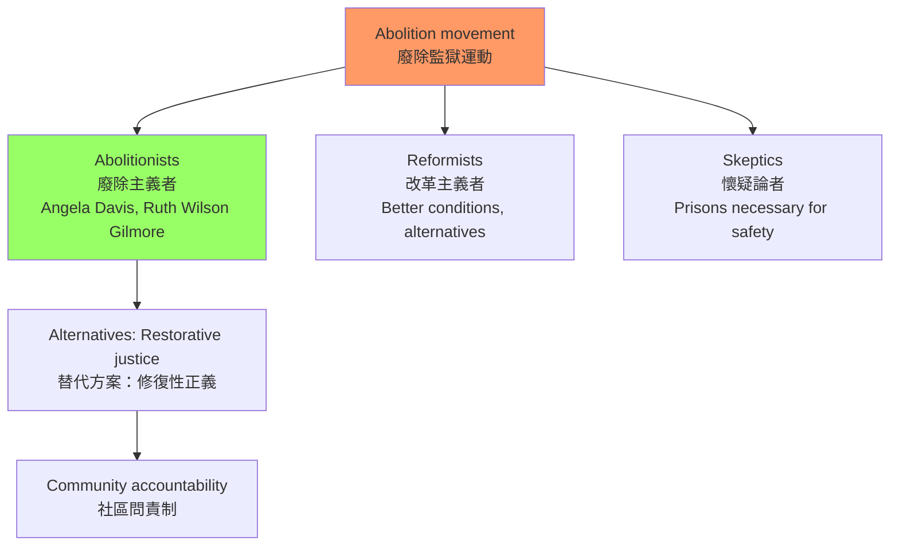

# HIST2225 全球監獄史 / Global History of Prisons

**Instructor**: HKU History Staff
**Department**: History, HKU
**Official source**: [HKU History Course Description](https://history.hku.hk/ug_cd/)
**Style**: 袁騰飛式 — 犀利、聚焦監獄與權力的歷史——監獄不是「自然」的刑罰形式，它是現代國家的發明

---

## 問題 1：5 個核心心智模型

### 1. 監獄的發明——現代國家的規训工具
學者 **Michel Foucault** 在 *Discipline and Punish* (1975) 中揭示：監獄不是自然而然的刑罰形式，而是現代國家權力的發明。1760-1840 年間，歐洲各國先後從公開處決轉向封閉監禁——這種轉變不是「人道主義進步」的結果，而是國家權力控制人群的新技術。

- **典型學者**: **Michel Foucault** — *Discipline and Punish* (1975); **Michael Ignatieff** — *A Just Measure of Suffering* (1978)
- **驗證案例**: 1780 年法國的 Damiens 案（被判「在巴黎大神父院前接受公開懺悔」）到 1830 年巴黎監獄的工廠車間——刑罰從對身體的公開暴力轉變為對靈魂的隱密改造

### 2. 奴隸制度與現代監獄——連續性
學者 **Ruth Wilson Gilmore** 和 **Angela Davis** 研究：美國監獄系統與奴隸制度之間存在深刻的結構連續性。Angela Davis 在 *Are Prisons Obsolete?* (2003) 中指出：美國南方監獄中約 60% 的囚犯是黑人，而 1865 年奴隸制被廢除時，黑人幾乎沒有獲得任何政治權利。

- **典型學者**: **Angela Davis** — *Are Prisons Obsolete?* (2003); **Ruth Wilson Gilmore** — *Golden Gulag* (2007)
- **驗證案例**: 1970 年代，美國加州將監獄建築工人培訓為建築工人——這種「監獄工業複合體」（prison-industrial complex）的出現，揭示了監獄系統與資本主義經濟利益的共谋

### 3. 帝國監獄——殖民控制的工具
監獄在帝國主義中扮演了重要角色。學者 **Jane Burbank** 和 **Frederick Cooper** 研究：奧斯曼帝國、英帝國和俄羅斯帝國都使用監獄系統來控制被征服的族群。

- **驗證案例**: 1898-1916 年間，南非的南非戰爭（Boer War）集中營（concentration camps）——由英軍將領基奇納建立，用於關押南非荷蘭裔（Boer）平民——這是現代集中營制度的早期形態之一

### 4. 中國監獄史——從勞改到再教育
學者 **James Sheridan** 和 **James D. Seymour** 研究：中國的監獄和勞動改造系統（1950-1976）是毛澤東時代政治控制的工具。「勞動改造」（re-education through labor）系統在改革開放後經歷了重大改革，但中國監獄系統的透明度問題至今仍然存在。

### 5. 當代監獄改革運動
學者 **David Rothman** 和 **Alessandro De Giorgi** 研究：1960 年代以來的美國監獄改革運動（廢除監獄運動）與民權運動、女性主義和反精神病學運動相關聯。

---

## 問題 2：3 個根本分歧

### 分歧 1：監獄——改造 vs 報復？
監獄制度的首要目的是「改造」（rehabilitation）還是「報復」（retribution）？這個目標在實踐中從來沒有被明確區分過。

### 分歧 2：監獄廢除——可能 vs 不可能？
Angela Davis 等廢除監獄運動者認為監獄是可以被完全替代的；但反對者認為在某些情况下監禁是必要的。

### 分歧 3：中國勞改——人權侵犯 vs 社會主義建設？
---

## 問題 3：10 個深度問題

1. **Foucault 的「規训社會」理論**：監獄、工廠、學校和醫院在「規训權力」的運作上有什麼共同特徵？這種「規训權力」與傳統的「主權權力」有何根本差異？
2. **英國監獄改革運動（1770-1840）**：邊沁（Jeremy Bentham）的「圓形監獄」（Panopticon）設計理念如何影響了 19 世紀英國監獄建築？這種「全視監控」的設計背後有什麼權力邏輯？
3. **美國監獄與奴隸制的連續性**：Angela Davis 的「監獄廢除」論證的核心是什麼？美國南方監獄中黑人囚犯的超量比例與奴隸制度之間的歷史聯繫是什麼？
4. **南非集中營**：1900-1902 年英軍在南非戰爭中建立的集中營——這種「集中營」模式如何影響了 20 世紀納粹集中營的設計？
5. **中國的「勞動改造」系統（1950-1976）**：這種制度與蘇聯古拉格的比較——兩者在意識形態目標和管理實踐上有什麼異同？
6. **監獄與精神疾病**：為什麼美國監獄中約 40% 的囚犯有某種形式的精神疾病？這種「監獄替代精神病院」現象的歷史根源是什麼？
7. **女性監獄**：歷史上女性囚犯的待遇與男性有何差異？女性監獄的「母親和嬰兒」政策背後反映了什麼樣的性別政治？
8. **香港監獄史**：香港的監獄制度從殖民時期到現在經歷了什麼變化？香港的赤柱監獄和域多利監獄在殖民歷史中扮演了什麼角色？
9. **當代中國的監獄改革**：改革開放後中國監獄制度的改革（如廢除「臭名昭著的」再教育營）與持續存在的人權侵犯之間的張力如何理解？
10. **監獄與新冠疫情**：2020 年新冠疫情期間，美國監獄中的 COVID-19 感染率是普通人群的 4-5 倍——這種「監獄即疾病放大器」現象如何暴露了監獄系統的公共健康風險？

---

# 核心心智模型深化（中英對照）

## 1. 監獄的發明

### 1.1 圖解：監獄的歷史轉型

---

## 2. 美國監獄與奴隸制

### 2.1 圖解：美國大規模監禁的規模

---

## 3. 帝國監獄

### 3.1 圖解：帝國監獄系統

---

## 4. 當代監獄改革

### 4.1 圖解：廢除監獄運動

---

# 總結

1. **監獄是現代國家的發明，不是自然的刑罰形式**：從 Foucault 的視角看，監獄是規训權力的物質化——它不是「人道」的進步，而是權力控制的進化。

2. **美國監獄系統與奴隸制度的結構連續性**：以「對黑人男性的系統性監禁」替代奴隸制度，是美國監獄史最黑暗的真相。

3. **監獄廢除運動是當代最重要的人權運動之一**：Angela Davis 和 Ruth Wilson Gilmore 的研究揭示：監獄系統的「大眾化」（mass incarceration）是政治選擇的結果，而非無可避免的「社會需要」。

4. **中國監獄史揭示了政治控制的制度化**：從毛澤東時代的「勞動改造」到當代的再教育營，政治監獄的歷史並未真正結束。

5. **監獄研究需要全球比較視角**：英國、美國、中國、南非的監獄史，各自揭示了監獄與權力、種族、階級之間的不同關係模式。

**自學建議**: 配合 Michel Foucault 的 *Discipline and Punish* + Angela Davis 的 *Are Prisons Obsolete?*，輸出讀書筆記到 `06_Reading_Notes/`。
