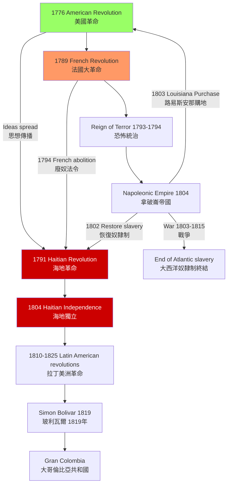
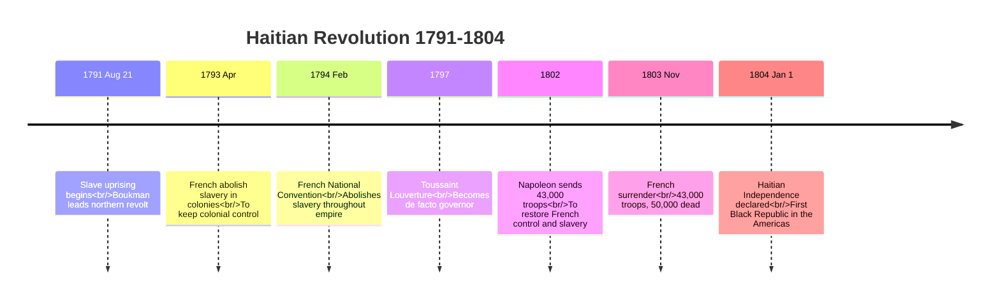
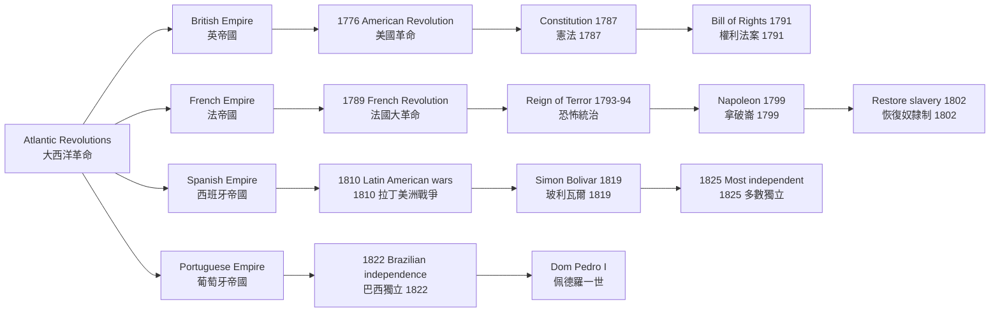
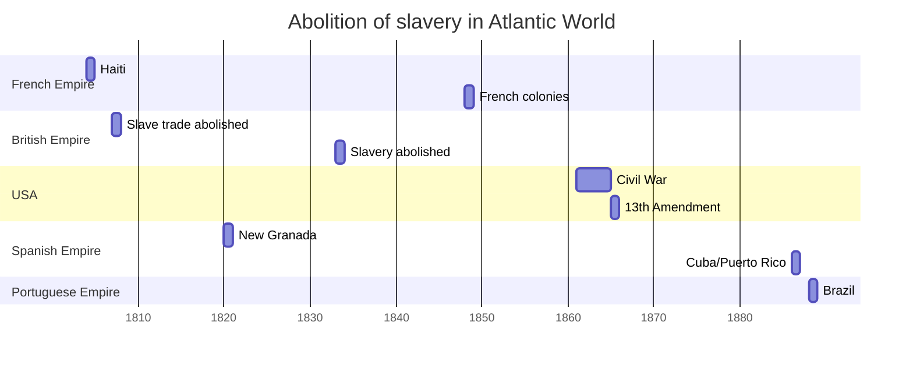
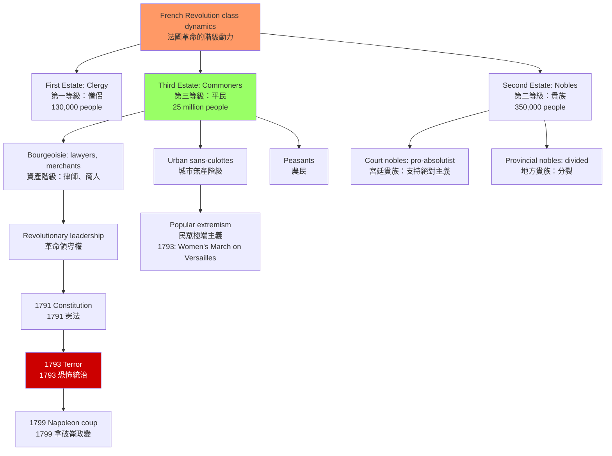
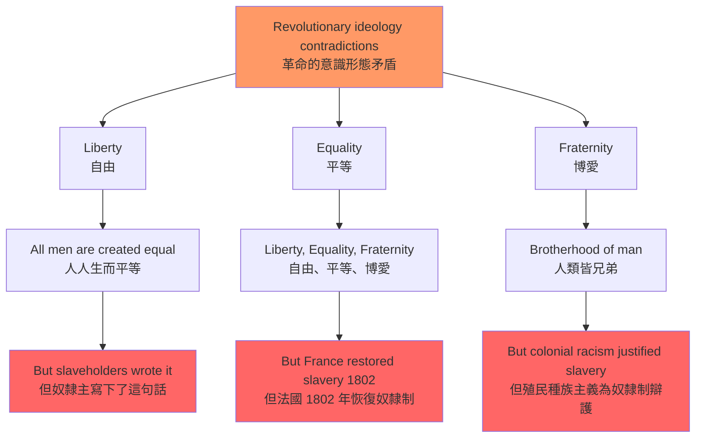

# HIST2229 大西洋革命 / Global Atlantic Revolutions, c. 1760-1830

/** HKU | 6 credits */

/**Instructor**: Otis Edwards | Department: History, HKU
**Official source**: [HKU History Course Description](https://history.hku.hk/ug_cd/), [HIST-2425.pdf](https://history.hku.hk/wp-content/uploads/2024/07/HIST-2425.pdf)
**Course Description**: This course considers the wave of revolutions which rocked France and the British, French and Spanish empires in the New World at the end of the 1700s and the beginning of the 1800s. These inter-connected revolutions transformed France and led to independence and revolutionary change in the United States, Haiti, and much of Spanish-speaking Latin America. This course considers these revolutions as discrete national phenomena, as interrelated Atlantic events, and as part of a global shift in imperial interest from the New World to Asia.
**Assessment**: 100% coursework.
**Style**: 袁騰飛式 — 犀利、聚焦革命如何改變世界——大西洋革命是一個連鎖反應網絡，不是孤立事件

---

## 問題 1：5 個核心心智模型

### 1. 大西洋革命連鎖反應——革命的「傳染病」
**定義**: 1760-1830 年間的大西洋革命不是孤立事件——它們是一個連鎖反應網絡。每一次革命的發生，都在為下一次革命提供思想武器、軍事經驗和政治想像。

**學者**: **Laurent Dubois** — Duke University 教授，專門研究加勒比歷史和大西洋世界。*Avengers of the New World: The Story of the Haitian Revolution* (2004, Harvard/Belknap) 獲得 2005 年 Frederick Douglass Prize。*A Colony of Citizens: Revolution and Slave Emancipation in the French Caribbean, 1787-1804* 獲獎。

**學者**: **Julius Scott** — *The Common Wind: Afro-American Currents in the Age of Revolution* (2018, Verso)。研究大西洋革命期間黑人群體之間的革命訊息傳播網絡——奴隸和水手如何跨帝國傳播革命消息。

**學者**: **David Geggus** — 佛羅里達大學歷史學家，專門研究法國大革命與海地革命的關係。*Haitian Revolutionary Studies* (2002)。

**驗證**: 革命的「連鎖反應」時間線：
- **1776 年**: 美國革命——第一部成文憲法、第一個共和國
- **1789 年**: 法國大革命——自由、平等、博愛的口號傳遍大西洋
- **1791 年 8 月 21 日**: 海地革命——奴隸起義，歷史上首個成功奴隸革命
- **1793 年**: 法國廢奴——革命浪潮影響海地
- **1794 年**: 法國國民公會廢除殖民地奴隸制
- **1795-1804**: 拉丁美洲革命起義（哥倫比亞、委內瑞拉等）
- **1804 年 1 月 1 日**: 海地獨立——美洲第一個黑人共和國

**歷史事件**: 1791 年 8 月，10,000 多名奴隸在海地北部起義，燒毀甘蔗種植園、殺死白人種植園主。Toussaint Louverture（杜桑·盧維杜爾）從奴隸變成革命將軍，控制海地大部分地區。1802-1803 年，拿破崙派 43,000 名士兵試圖重佔海地，最終失敗。

### 2. 革命作為「民主化浪潮」——歷史必然性
**定義**: 革命是民主化浪潮的表現，還是偶然事件的產物？這個問題困擾了歷史學家幾百年。

**學者**: **Samuel Huntington** — *The Third Wave: Democratization in the Late Twentieth Century* (1991)。雖然研究對像是 20 世紀民主化，但他的「浪潮」理論同樣適用於理解大西洋革命的連鎖效應。

**學者**: **John Dunn** — *Western Political Theory in the Face of the Future* (1979)。研究革命失敗的普遍模式。

**學者**: **John Dunn** — 分析為什麼某些革命能建立穩定民主（如美國），而其他革命走向獨裁（如法國）。

**驗證**: 美國革命（1776）建立了穩定的民主制度，但法國革命（1789）走向了雅各賓恐怖統治。這個比較揭示了什麼？學者 **Alex de Tocqueville** 在 *The Old Regime and the French Revolution* (1856) 中指出：法國革命的激進性部分來自於舊制度長期壓抑的政治能量突然釋放。

### 3. 革命與奴隸制廢除——革命的「意外」遺產
**定義**: 奴隸制廢除是大西洋革命的「意外」遺產——它是革命的副產品，不是革命的主要目標，但最終成為革命最重要的歷史遺產之一。

**學者**: **Robin Blackburn** — *The Overthrow of Colonial Slavery, 1776-1888* (1988, Verso)。研究大西洋世界奴隸制廢除的漫長歷史。

**學者**: **David Geggus** — 見上。

**學者**: **Cyril Palmer** — 研究英帝國廢奴運動（1807 年英國廢除奴隸貿易，1833 年廢除奴隸制）。

**驗證**: 奴隸制廢除的時間線：
- **1794 年**: 法國國民公會廢除殖民地奴隸制
- **1804 年**: 海地獨立後延續廢奴
- **1807 年**: 英國廢除奴隸貿易
- **1811 年**: 英國殖民地奴隸制廢除（牙買加等）
- **1818 年**: 美國廢除奴隸貿易
- **1833 年**: 英帝國廢除奴隸制（支付 £20,000,000 賠償金給奴隸主）
- **1848 年**: 法國廢除奴隸制
- **1863 年**: 荷蘭廢除奴隸制
- **1865 年**: 美國廢除奴隸制（憲法第十三修正案）

**數字**: 英國向奴隸主支付的 £20,000,000 賠償金——相當於 2018 年價值的約 £17,000,000,000。這筆錢由英國納稅人支付，直到 2015 年才最終還清。

### 4. 革命話語建構——人權的發明
**定義**: 大西洋革命創造了「人權」話語，但這個話語從一開始就充滿矛盾——倡議「自由」的法國革命者自己擁有奴隸。

**學者**: **Lynn Hunt** — *Inventing Human Rights: A History* (2007, W.W. Norton)。論證「人權」的發明是法國大革命的重要遺產。

**學者**: **Suzanne Desan** — 研究法國大革命中的性別政治和女性權利。

**學者**: **Carla Rubinsky** — 研究美國革命中的奴隸制矛盾。

**驗證**: 美國「開國元勳」與奴隸制的矛盾：
- Thomas Jefferson（湯瑪斯·傑佛遜）：撰寫《獨立宣言》（"all men are created equal"），但自己擁有約 600 名奴隸
- George Washington（喬治·華盛頓）：美國第一任總統，但自己擁有約 300 名奴隸，死後釋放了他的奴隸（部分）
- Benjamin Franklin：本來持有奴隸，後來轉變為廢奴主義者

海地革命者的《獨立宣言》（1804 年）：「我們恢復了聖多明哥的自由」——這是第一個由奴隸起義建立的國家，其建國話語直接挑戰了歐洲殖民帝國的意識形態。

### 5. 革命的階級動力——革命從來不是純意識形態
**定義**: 革命從來不是純意識形態運動——階級利益、經濟結構和政治權力才是革命的真正推動力。

**學者**: **Ellen Meiksins Wood** — *The Origin of Capitalism* (1999, Verso)。研究資本主義興起與革命政治的關係。

**學者**: **Albert Soboul** — *The French Revolution, 1789-1799* (1974)。馬克思主義法國大革命史學的代表。

**學者**: **Alan Knight** — 研究拉丁美洲革命的階級基礎。

**驗證**: 法國大革命的階級動力：
- 資產階級（第三等級）：反對貴族特權，要求政治代表權
- 城市無產階級（sans-culottes）：要求麵包價格控制、最高工資限額
- 農民：反對封建地租和稅收
- 貴族：內部分裂——一部分反對君主專制，一部分維護傳統特權

法國大革命後 1793-1794 年「恐怖統治」（Reign of Terror）期間，雅各賓派處決了約 17,000 人，其中約 40% 是貴族和資產階級——這揭示了革命的階級本質：「革命」從來不是純粹的意識形態運動。

---

## 問題 2：3 個根本分歧

### 分歧 1：革命——歷史必然性 vs 歷史偶然性
**核心問題**: 大西洋革命的連鎖反應是歷史必然，還是偶然事件？

- **A 方（結構主義）**: 革命是階級矛盾、經濟危機和帝國主義競爭的必然結果。沒有 1789 年法國大革命，也會有其他形式的大規模政治危機
- **B 方（偶然主義）**: 革命的爆發依賴於具體歷史條件的偶然匯聚——領導人決定、危機處理的失誤、天氣和經濟週期。沒有拿破崙，歐洲歷史會完全不同
- **學者**: **William Doyle** — *The Oxford History of the French Revolution* (1989) 等「偶然主義」學者 vs **Albert Soboul** 等「結構主義」馬克思主義學者

### 分歧 2：海地革命——被歷史忽視 vs 被當代話語利用
**核心問題**: 海地革命在大西洋革命史中的邊緣化地位，是白人中心史學的偏見，還是歷史本身的相對重要性問題？

- **A 方（被忽視）**: 海地革命是歷史上第一個成功的奴隸起義，建立了美洲第一個黑人共和國——但在大多數主流歷史敘事中被嚴重邊緣化
- **B 方（被利用）**: 當代政治話語（尤其是美國政治話語）有選擇性地引用海地革命——讚賞其反殖民精神，但迴避其在種族政治上的複雜性
- **學者**: **Laurent Dubois** 等研究者長期致力於將海地革命「恢復」到它在歷史中的應有地位

### 分歧 3：革命遺產——歷史進步 vs 歷史暴力
**核心問題**: 大西洋革命的遺產是「歷史進步」（廢奴、民主、人權），還是「歷史暴力」（恐怖統治、帝國主義侵略、革命後的獨裁）？

- **A 方（進步論）**: 革命廢除了奴隸制、建立了民主制度、創造了人權話語——這些都是不可逆的歷史進步
- **B 方（暴力論）**: 革命帶來了大規模暴力（法國恐怖統治：17,000 人被處決；海地革命：估計 100,000-200,000 人死亡）和後續的帝國主義擴張（拿破崙戰爭）
- **學者**: **Hannah Arendt** — *On Revolution* (1963) 的經典分析：法國革命走向恐怖，美國革命走向自由——區別在哪裏？

---

## 問題 3：10 個深度問題

1. **革命訊息的跨帝國傳播**: Julius Scott 的 *The Common Wind* (2018) 研究奴隸和水手如何在加勒比海和美洲之間傳播革命訊息。這種「跨帝國革命網絡」如何影響了革命的連鎖反應？這種訊息傳播與今天的社群媒體革命傳播有什麼相似之處？

2. **為什麼海地革命成功了，其他奴隸起義失敗了？**: Laurent Dubois 的研究揭示了海地革命成功的具體條件：法國大革命的內部衝突、聖多明哥的地理條件、Toussaint Louverture 的軍事天才、海地奴隸社群的獨特組織形態。這些條件中哪些是必要的，哪些是偶然的？

3. **美國革命的「保守性」**: 為什麼美國革命（1776）建立了穩定的民主制度，而法國革命（1789）走向了恐怖統治和獨裁？這種差異與兩國革命前的社會結構（美國沒有封建制度、法國有強大的封建貴族階級）有什麼關係？Alex de Tocqueville 在 1856 年的分析是否仍然有效？

4. **拿破崙與大西洋革命**: 拿破崙 1802 年恢復法國殖民地的奴隸制（1803 年廢除），派軍隊試圖重佔海地（1802-1803，43,000 名士兵）。拿破崙的大西洋戰略如何影響了革命的最終結局？如果沒有拿破崙戰爭，大西洋革命的格局會如何不同？

5. **拉丁美洲革命的被忽視**: 為什麼拉丁美洲革命（1810-1825）在英語學術界和公眾歷史中經常被忽視？ Simón Bolívar 和 José de San Martín 的革命與美國、法國革命的差異是什麼？拉丁美洲革命中的奴隸制和種族問題如何影響了革命的走向？

6. **革命中的女性**: 法國大革命中的女性政治參與（如 1793 年「女性共和派」起義）和海地革命中的女性奴隸（她們在起義中扮演了重要角色）如何被主流革命史學忽略？這些「被忽略的女性」如何改變了我們對革命的整體理解？

7. **革命的記憶政治**: 海地革命（1791-1804）的歷史記憶在當代海地政治中扮演什麼角色？為什麼海地革命的神話化和歷史記憶對海地的政治發展既有團結作用又有分裂作用？

8. **廢奴與革命的關係**: 為什麼奴隸制廢除成為了大西洋革命的「意外」遺產？這種「意外」揭示了革命話語與革命實踐之間的什麼矛盾？法國 1794 年廢奴 vs 1802 年恢復奴隸制 vs 1848 年最終廢奴——這個來回反覆的過程如何理解？

9. **革命的全球化視角**: 大西洋革命如何影響了歐洲以外的世界——尤其是對中國、印度和東南亞的帝國主義擴張？美國革命的「門羅主義」（1823）如何預示了美國在美洲的帝國主義干預？

10. **當代革命的比較**: 2010 年代以來的「阿拉伯之春」、「香港雨傘運動」、「伊朗婦女運動」等當代運動，如何與大西洋革命的歷史經驗進行比較？革命的「模式」在今天仍然適用嗎？

---

# 核心心智模型深化（中英對照）

## 1. 大西洋革命連鎖反應

### 1.1 定義 Definition
**心智模型**: 大西洋革命是一個「傳染病」式的連鎖反應——每次革命的發生，都在為下一次革命提供思想武器、軍事經驗和政治想像。

| 英文 | 中文 | 歷史含義 | 關鍵年份 |
|---|---|---|---|
| Atlantic revolutions | 大西洋革命 | 1760-1830 年間的跨帝國革命浪潮 | 1776-1804 |
| Revolutionary chain reaction | 革命連鎖反應 | 革命之間的思想、軍事和組織傳播 | 1776-1825 |
| Plantation economy | 種植園經濟 | 革命的核心經濟背景 | 16th-19th century |
| Slave emancipation | 奴隸解放 | 革命的意外遺產 | 1794-1888 |

### 1.2 證據 Evidence
**革命的「觸發-傳播」機制**:
- **美國革命（1776）** → 激發法國資產階級對君主專制的不滿 → 1789 年法國大革命
- **法國大革命（1789）** → 「自由、平等、博愛」口號傳遍大西洋 → 奴隸和水手接收革命訊息 → 1791 年海地革命
- **法國大革命（1789）** → 廢奴政策（1794）→ 西班牙美洲土生白人（creoles）要求類似權利 → 1810 年拉丁美洲起義

**數字**: 海地革命傷亡：
- 海地奴隸起義人數：1791 年 8 月估計 10,000-20,000 名奴隸參與
- 法國軍隊傷亡：1802-1803 年約 50,000 人死亡（戰爭、疾病）
- 海地傷亡：估計 100,000-200,000 人死亡（戰爭、飢荒、疾病）
- 海地總人口：革命前估計 520,000 人（奴隸佔 87%）

### 1.3 應用 Applications
- **革命的「模式識別」**: 為什麼某些革命會「傳染」，某些不會？這取決於：(1) 是否有現成的革命意識形態；(2) 是否有相似的經濟和階級結構；(3) 是否有帝國主義外部壓力
- **當代比較**: 阿拉伯之春的「連鎖反應」（突尼斯 → 埃及 → 利比亞 → 敘利亞）與大西洋革命有何相似之處？

### 1.4 批判性觀察 Critical Observation
**大西洋革命最諷刺的悖論**: 法國大革命以「自由、平等、博愛」為口號，但法國本身在 1791-1802 年間兩次在海地恢復奴隸制；美國革命以「不自由，毋寧死」為口號，但美國建國元勳湯瑪斯·傑佛遜自己擁有約 600 名奴隸。

這種「革命的雙重標準」揭示了意識形態與現實利益之間的尖銳矛盾——革命的「話語」從來不等於革命的「實踐」。

### 1.5 深度問題 Deep Questions
- 如果海地革命失敗（法國成功重佔海地），會如何影響大西洋世界的奴隸制廢除進程？法國 1794 年的廢奴令是否會最終確立，還是會像歷史上那樣被拿破崙恢復？
- 為什麼拉丁美洲革命（1810-1825）在大多數英語歷史敘事中被嚴重忽視？Simón Bolívar 的革命遺產在當代拉丁美洲政治中扮演什麼角色？

### 1.6 圖解：大西洋革命連鎖反應

---

## 2. 海地革命：歷史上最成功的奴隸起義

### 2.1 定義 Definition
**心智模型**: 海地革命（1791-1804）是歷史上第一個也是唯一一個成功的奴隸起義——它建立的美洲第一個黑人共和國，直接挑戰了「奴隸制是永恆的」這一帝國主義意識形態。

| 英文 | 中文 | 歷史含義 | 關鍵人物 |
|---|---|---|---|
| Haitian Revolution | 海地革命 | 奴隸起義 → 獨立建國 | Boukman, Louverture, Dessalines |
| Saint-Domingue | 聖多明哥 | 法屬加勒比殖民地世界最富裕 | Pre-1791 |
| Toussaint Louverture | 杜桑·盧維杜爾 | 奴隸 → 革命將軍 → 臨時總督 | 1743-1803 |
| Jean-Jacques Dessalines | 德薩林 | 奴隸 → 海地獨立宣言簽署人 → 第一任總統 | 1758-1806 |

### 2.2 證據 Evidence
**革命的爆發（1791 年 8 月）**:
- 1791 年 8 月 21 日：奴隸起義在海地北部爆發
- 領導人：Dutty Boukman（祭司，被稱為「革命牧師」）策劃了起義
- 起義軍：約 10,000-20,000 名奴隸
- 起義目標：燒毀甘蔗種植園、殺死白人種植園主、奪取自由
- 傳聞：革命消息從法國本土傳來——法國大革命的意識形態為起義提供了「合法性」話語

**Toussaint Louverture 的崛起**:
- 1743 年出生為奴隸
- 1791 年加入起義
- 1793 年與西班牙軍隊（反法）結盟
- 1794 年與法國結盟（因法國廢奴）
- 1797 年成為事實上的獨立統治者
- 1802 年被法國拿破崙俘虜，死於法國監獄
- 1803 年 11 月：法軍投降
- 1804 年 1 月 1 日：海地獨立宣言

**數字**: 
- 法國軍隊傷亡：1802-1803 年約 50,000 人死亡
- 海地傷亡：估計 100,000-200,000 人
- 起義奴隸：1791 年 8 月約 10,000-20,000 人
- 海地奴隸總人口：革命前約 450,000 人

### 2.3 應用 Applications
- **革命的「不可能」**: 為什麼在此之前的所有奴隸起義都失敗了？這個「例外」揭示了什麼歷史規律？
- **革命與國際法**: 海地獨立的國際承認問題——為什麼美國和歐洲列強長期不承認海地？如何影響了海地的經濟發展？

### 2.4 批判性觀察 Critical Observation
**Laurent Dubois 犀利觀察**: 海地革命的「被忽視」不是偶然——它是白人中心史學的系統性選擇。

主流歷史敘事傾向於將法國大革命和美國革命視為「大西洋革命的核心」，而將海地革命邊緣化為「附帶事件」。但從歷史邏輯上說，海地革命才是大西洋革命最重要的組成部分——它是歷史上唯一一個成功的奴隸起義，而奴隸制廢除是所有大西洋革命最重要的歷史遺產。

### 2.5 深度問題 Deep Questions
- 為什麼海地革命比美洲其他奴隸起義（如牙買加 1739 年 Maroon 起義、古巴 1812 年 Aponte 起義）更成功？這些失敗的起義揭示了什麼？
- 海地革命後的「政治失序」（1804-1820 年間經歷了多位獨裁者）與革命的「成功」之間有什麼張力？革命「成功」了，但建立了什麼樣的國家？

### 2.6 圖解：海地革命的關鍵時刻

---

## 3-5 個 Mermaid 圖解

### 📊 Diagram: 大西洋革命帝國比較

### 📊 Diagram: 奴隸制廢除時間線

### 📊 Diagram: 革命階級動力

### 📊 Diagram: 革命的意識形態矛盾

---

# 深度自測問題詳解

## Q1 詳解：革命訊息的跨帝國傳播
**Julius Scott 的核心發現**: 「革命的訊息」不是通過正規的政治渠道傳播的——而是通過奴隸和水手在港口城市之間的非正式網絡傳播。

**具體案例**: 
- 1789 年法國大革命的消息在幾個月內傳到了加勒比海的奴隸社群——法國本土的革命話語在什麼條件下會「翻譯」成奴隸起義的合法性話語？
- 水手（尤其是來自海地的奴隸船上水手）如何成為革命的「快遞員」？

**當代比較**: 這個「跨帝國革命網絡」與今天的社群媒體傳播有驚人的相似之處——非正式、去中心化、快速擴散。

## Q5 詳解：拉丁美洲革命的被忽視
**Simón Bolívar 的歷史地位**: 被譽為「美洲的解放者」（El Libertador），1819 年建立大哥倫比亞共和國（今天的哥倫比亞、委內瑞拉、厄瓜多爾、巴拿馬），1821-1828 年解放秘魯和玻利維亞。

**被忽視的原因**:
1. 拉丁美洲革命沒有形成一個統一的「歷史敘事」——各國歷史各自為政
2. 拉丁美洲革命的種族問題比美國和法國更複雜——涉及奴隸制、土著、民族混血等多重問題
3. 拉丁美洲革命與天主教會的複雜關係——革命領袖同時反對殖民剝削和教會特權
4. 拉丁美洲革命後的獨裁傾向——Bolívar 晚年試圖建立終身總統制——使革命遺產複雜化

---

# 總結

1. **大西洋革命是一個連鎖反應網絡，不是孤立事件**: 美國革命激發法國大革命，法國大革命廢奴（1794）激發海地革命，海地革命的成功鼓舞拉丁美洲革命——每次革命都為下一次革命提供思想武器、軍事經驗和政治想像。

2. **海地革命是歷史上最重要但被嚴重忽視的革命**: 1791-1804 年的海地革命是歷史上唯一一個成功的奴隸起義——它建立的美洲第一個黑人共和國，直接挑戰了「奴隸制是永恆的」這一帝國主義意識形態。Laurent Dubois 的研究終於讓這段歷史得到它應有的地位。

3. **革命的「話語」與「實踐」之間存在根本矛盾**: 「自由、平等、博愛」的法國大革命同時存在著奴隸制恢復；「人人生而平等」的美國革命由奴隸主撰寫——革命的意識形態承諾與革命者的實際行為之間的張力，是理解大西洋革命的最重要視角。

4. **奴隸制廢除是革命的「意外」遺產**: 奴隸制廢除不是革命的主要目標，而是革命的副產品——但這個「副產品」最終成為了大西洋革命最重要的歷史遺產。

5. **大西洋革命研究需要全球比較視角**: 大西洋革命不僅僅是美國、法國、海地和拉丁美洲革命的故事——它是帝國主義、奴隸制、階級矛盾和意識形態創新交織在一起的全球歷史事件。只有用全球史的視角，我們才能真正理解它的複雜性和深遠影響。

**最後問題**: 如果你去 1789 年巴黎，你會站在革命的哪一邊？革命真的代表「人民」的利益嗎？

---
**版權所有 © HKU History Self-Study**
