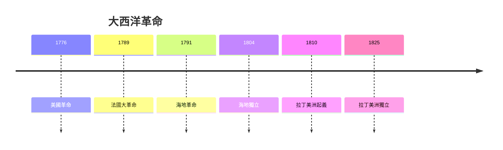

# HIST2229 大西洋革命 / Global Atlantic Revolutions (6 credits)

**Instructor**: Otis Edwards
**Department**: History, HKU  
**Official source**: [HKU History Course Description 2024-25](https://history.hku.hk/wp-content/uploads/2024/07/HIST-2425.pdf)
**Style**: 袁騰飛式 — 犀利、聚焦革命點解改變世界

---

## 問題 1：這個領域所有專家共享的 5 個核心心智模型

### 心智模型 1：大西洋革命連鎖反應
學者 **Laurent Dubois** (*Avengers of the New World*, 2004) 研究：海地革命 (1791-1804) 係歷史上首個成功奴隸起義——激發整個大西洋世界。

學者 **Julius Scott** (*The Common Wind*, 2018) 分析：大西洋革命訊息網絡。

- 1776 美國革命
- 1789 法國大革命
- 1791 海地革命
- 1810-1825 拉丁美洲革命

### 心智模型 2：革命作為「民主化」
學者 **Samuel Huntington** (*The Third Wave*, 1991) 研究：革命浪潮——民主化從大西洋擴散。

學者 **John Dunn** 分析：革命失敗模式。

### 心智模型 3：革命與奴隸制廢除
學者 **David Geggus** 研究：法國大革命與海地革命關係——法國廢奴政策觸發海地革命。

學者 **Robin Blackburn** (*The Overthrow of Colonial Slavery*, 1988) 分析：革命與廢奴連接。

### 心智模型 4：革命敘事建構
學者 **Lynn Hunt** (*Inventing Human Rights*, 2007) 研究：革命創造「人權」話語——但法國革命者多數擁有奴隸。

學者 **Suzanne Desan** 分析：法國大革命性別政治。

### 心智模型 5：革命保守主義
學者 **Ellen Meiksins Wood** (*The Origin of Capitalism*, 1999) 研究：革命從來唔係單純意識形態——階級利益推動。

學者 **Alan Knight** 分析：拉丁美洲革命階級基礎。

---

## 問題 2：3 個根本分歧

### 分歧 1：革命——歷史必然定偶然？
- **A 方**：結構因素
  - 階級矛盾、經濟危機
- **B 方**：偶然因素
  - 領導人決定、危機處理

### 分歧 2：海地革命——被忽視定被利用？
- **A 方**：被忽視
  - 白人中心史學忽視
- **B 方**：被利用
  - 當代政治話語借用

### 分歧 3：革命遺產——進步定暴力？
- **A 方**：進步
  - 民主、人權、廢奴
- **B 方**：暴力
  - 紅色恐怖、雅各賓專政

---

## 問題 3：10 個深度問題

1. 如果你去 1789 年巴士底，你最想做邊個角色？
2. 點解法國大革命成為所有後續革命參照？
3. 如果海地革命失敗，會點樣影響世界？
4. 如果你是海地奴隸，你點樣理解自由？
5. 點解拉丁美洲革命往往被忽視？
6. 如果你去 1793 年巴黎，你點解「恐怖統治」？
7. 革命話語——點解到今日仍然有影響力？
8. 如果你是歷史學家，點樣批評革命浪漫化？
9. 點解革命往往產生新形式的專制？
10. 如果你去 2050 年，會點評價呢啲革命？

---

## 核心心智模型深化

### 1. 大西洋革命時間線



---

## 5 個 Mermaid 圖解

### 📊 Diagram 1: 革命連鎖反應

```mermaid
flowchart TD
    A[美國革命] --> B[法國大革命]
    B --> C[海地革命]
    C --> D[拉丁美洲革命}
```

### 📊 Diagram 2: 海地革命

```mermaid
flowchart TD
    A[奴隸起義] --> B[廢奴}
    B --> C[獨立宣言}
    C --> D[1804 海地建國}
```

### 📊 Diagram 3: 革命影響

```mermaid
flowchart TD
    A[革命] --> B[廢奴}
    B --> C[民主}
    C --> D[人權話語}
```

### 📊 Diagram 4: 革命階級基礎

```mermaid
flowchart TD
    A[資產階級] --> B[革命}
    A --> C[土地貴族}
    B --> D[新秩序}
```

### 📊 Diagram 5: 革命保守主義

```mermaid
flowchart TD
    A[革命承諾] --> B[恐怖統治}
    B --> C[拿破崙主義}
    C --> D[新專制}
```

---

## 總結

1. 大西洋革命連鎖反應塑造現代世界
2. 海地革命被歷史忽視
3. 革命揭示階級利益
4. 革命遺產複雜
5. 革命研究需要批判視角

**最後問題**: 如果你去 1789 年，你會點評價革命？

---
**版權所有 © HKU History Self-Study**
