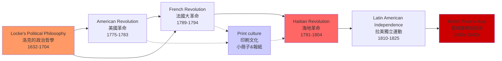
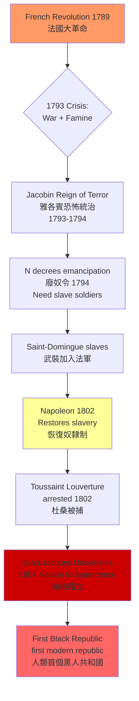
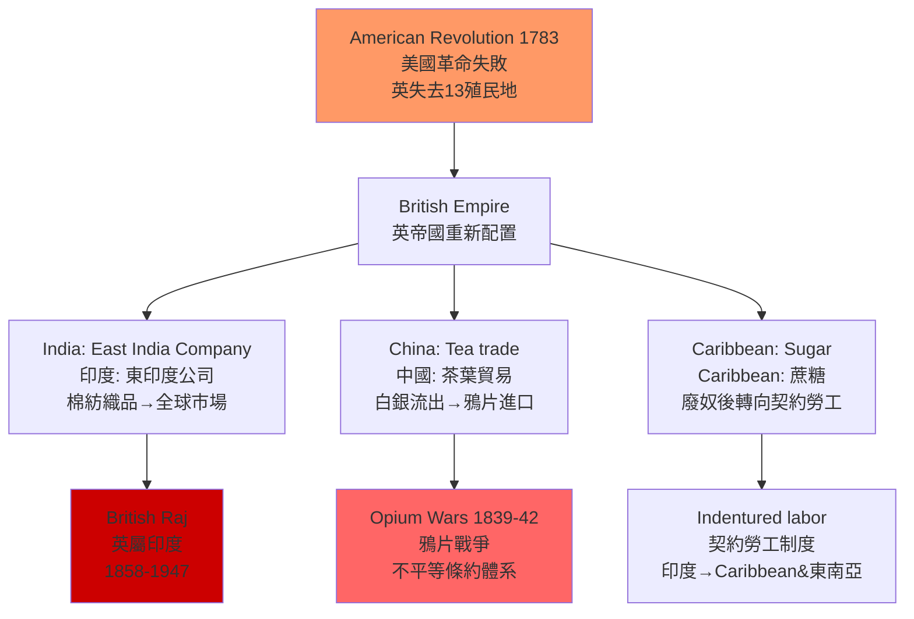
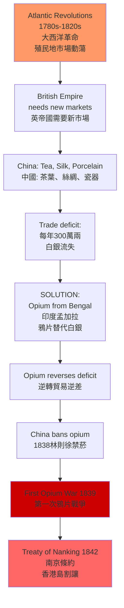
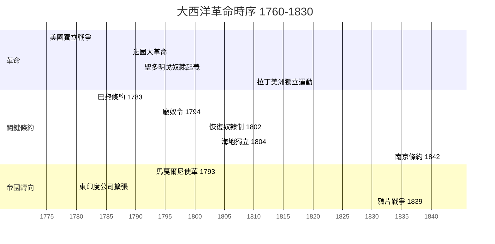
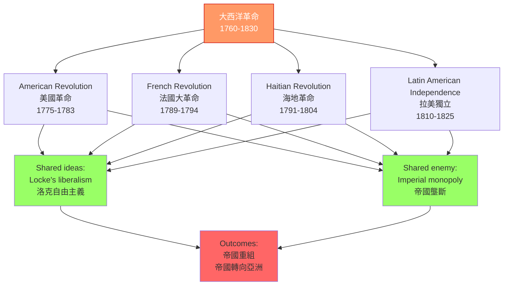
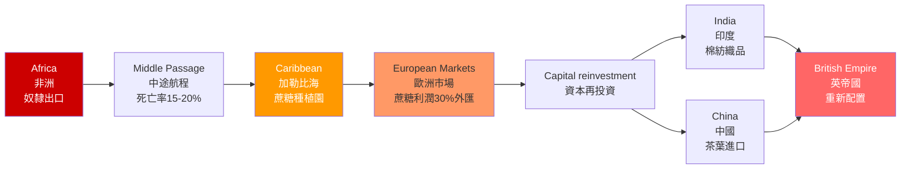
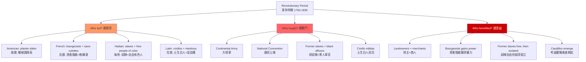
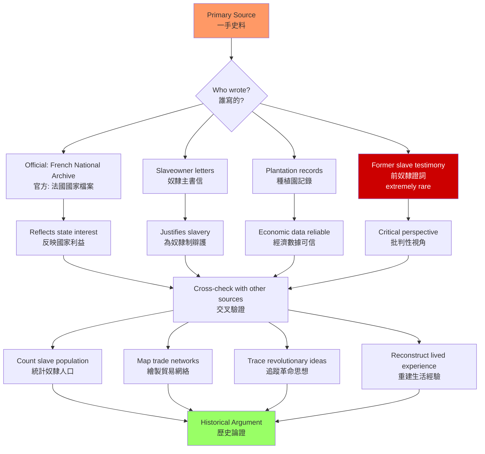

# HIST2229 大西洋革命 / Global Atlantic Revolutions, c. 1760-1830

**Instructor**: Otis Edwards / James Fichter (GLAS2124 cross-listed)
**Department**: History, HKU
**Official source**: [HKU History Course Description](https://history.hku.hk/ug_cd/), [HIST-2425.pdf](https://history.hku.hk/wp-content/uploads/2024/07/HIST-2425.pdf)
**Style**: research-based — 犀利、聚焦革命、奴隸制與帝國權力如何交織塑造現代世界

---

## 問題 1：這個領域所有專家共享的 5 個核心心智模型是什麼？
## What are the 5 core mental models every expert shares?

### 1. 革命的連鎖傳播網絡（The Revolutionary Cascade）

**專家如何思考**: 1760-1830 年間的大西洋革命不是孤立事件，而是一個相互連鎖的思想與政治傳播網絡。學者 **David Armitage** 在 *The Declaration of Independence: A Global History* (2006) 中論證：革命思想從英國政治哲學（洛克）→法國哲學（伏爾泰、盧梭）→北美十三殖民地（1776）→聖多明戈（1791）→拉丁美洲（1810-1825），形成一個「觀念迴路」（circuit of ideas）。

- **典型學者**: **Laurent Dubois** — *Avengers of the New World: The Story of the Haitian Revolution* (2004); **John Lynch** — *The Spanish American Revolutions, 1808-1826* (1973, rev. 2005)
- **驗證案例**: 1789年法國大革命爆發後，聖多明戈法屬殖民地奴隸在 1791 年 8 月集體起義——起義領袖 **杜桑·盧維杜爾**（Toussaint Louverture）直接援引法國《人權宣言》中的自由語言來要求廢奴。1804年海地獨立，成為現代第一個黑人共和國——但這是 15 年武裝鬥爭、30萬人死亡後的結果。

### 2. 奴隸制悖論（The Slavery-Revolution Paradox）

**專家如何思考**: 革命的口號是「自由、平等、博愛」，但革命的主力往往是奴隸——而奴隸起義恰恰威脅了革命領袖所依賴的種植園經濟。學者 **Carolyn Fick** 在 *The Making of Haiti: The Saint-Domingue Revolution* (1990) 中揭示：法國大革命内部的政治分裂（吉倫特派 vs 山嶽派 vs 雅各賓派）直接影響了聖多明戈的奴隸能否獲得自由。

- **典型學者**: **C.L.R. James** — *The Black Jacobins: Toussaint L'Ouverture and the San Domingo Revolution* (1938, rev. 1963); **David Geggus** — *Haitian Revolutionary Studies* (2002)
- **驗證案例**: 1794 年法國廢奴→1802 年拿破崙恢復奴隸制→1804 年海地再次獨立。這來回三次的政策轉變，導致約10萬名奴隸在 1791-1804 年間死亡，直接催生了拉丁美洲的蔗糖經濟蕭條。

### 3. 帝國重組而非帝國崩潰（Imperial Reconfiguration, Not Collapse）

**專家如何思考**: 很多學生誤以為這一系列革命導致了「舊帝國的崩潰」。實際上，學者 **John Darwin** 在 *After Tamerlane: The Rise and Fall of Global Empires* (2007) 中論證：大西洋革命的真正意義是帝國的**重組**而非消亡。英帝國失去了美洲十三殖民地，卻在 1783 年後加速向印度和東亞擴張。

- **典型學者**: **Bernard Bailyn** — *The Ideological Origins of the American Revolution* (1967, rev. 1992); **Jack Greene** — *The Intellectual Construction of America* (1993)
- **驗證案例**: 1783 年《巴黎條約》後，英國失去美洲殖民地，但**東印度公司在印度繼續擴張**——1815 年拿破崙戰敗後，英國成為世界最大帝國，勢力延伸至緬甸、馬來亞、香港（1842）。

### 4. 革命的階級性與排他性（The Exclusivity of Revolutionary Citizenship）

**專家如何思考**: 革命領袖宣稱普遍人權，但實際上革命的受益者往往是有產白人男性。學者 **Katherine McKittrick** 等人揭示：所謂「自由」往往將婦女、黑奴、窮人排除在外。1776 年美國《獨立宣言》簽署人幾乎全是奴隸主。

- **典型學者**: **Woody Holton** — *Forced Founders: Indians, Debtors, Slaves, and the Making of the American Revolution in Virginia* (1999); **Ellen F. Fitzpatrick** — *Number 7: A History* (2010)
- **驗證案例**: 1789 年法國《人權宣言》發表，同時法屬 Caribbean 殖民地繼續維持奴隸制。法國革命的口號與 Caribbean 現實之間的鴻溝，揭示了革命「自由」概念的階級與種族局限性。

### 5. 全球轉向亞洲（The Pivot to Asia）

**專家如何思考**: 大西洋革命的最終後果之一，是歐洲帝國將目光轉向東方。學者 **Prasenjit Duara** 等人指出：隨着美洲殖民地的獨立或動亂，英法葡等帝國開始重新配置資源到亞洲——直接影響了鴉片戰爭（1839-1842）和對華貿易政策。

- **典型學者**: **Jerry H. Bentley** — *Old World Encounters* (1993); **Prasenjit Duara** — *The Crisis of Global Modernity* (2015)
- **驗證案例**: 1793 年馬戛爾尼使華（George Macartney）訪華，要求通商被拒→1816 年阿美士德使華再次失敗→1839 年鴉片戰爭爆發。這條從外交失敗到軍事衝突的線索，直接源於帝國在失去美洲市場後對亞洲市場的迫切需求。

---

## 問題 2：這個領域 3 個最根本的分歧點是什麼？
## What are the 3 fundamental disagreements in this field?

### 分歧 1：美國革命 — 天賦人權運動 vs 奴隸主叛亂？
**核心問題 / Core question**: 美國革命是「自由人的叛亂」還是「奴隸主的叛亂」？

- **學派A（革命史觀）**: Bernard Bailyn、Gordon Wood 等認為，美國革命是政治思想史上最重要的事件之一，代表了洛克自由主義的實踐——天賦人權、政府需被統治者同意。
- **學派B（底層史觀）**: Woody Holton、Michael McDonnell 等認為，革命領袖多為奴隸主（華盛頓、傑弗遜、麥迪遜），革命實際是 Virginian planter elites 為了逃避英帝國對其奴隸貿易的限制而發動。
- **學者代表**: **Bernard Bailyn** — *The Ideological Origins of the American Revolution* (1967); **Woody Holton** — *Forced Founders* (1999)
- **驗證**: 1776 年《獨立宣言》列舉英王罪狀之一是「他向我們邊境煽動印第安人」，卻從未提及南方的奴隸制——這是故意的政治沉默。

### 分歧 2：海地革命 — 解放運動的典範 vs 種族衝突的悲劇？
**核心問題 / Core question**: 海地革命是黑人解放的燈塔，還是一場被法國大革命激化的種族滅絕？

- **學派A（C.L.R. James 傳統）**: C.L.R. James 在 1938 年的經典著作中將海地革命描述為「黑雅各賓」——奴隸大眾在杜桑·盧維杜爾的領導下，以法國革命思想為武器，實現了人類歷史上最大規模的奴隸起義勝利。
- **學派B（批評修正）**: **Jane Landers** 等學者指出，海地革命中存在大規模針對法裔白人的暴力行為；法國白人種族滅絕的問題至今仍有爭議。1804 年獨立後，盧維杜爾本人曾鎮壓部分黑人領袖，引發內部權力鬥爭。
- **學者代表**: **C.L.R. James** — *The Black Jacobins* (1938); **Carolyn Fick** — *The Making of Haiti* (1990)
- **驗證**: 1791-1804 年間，聖多明戈人口從約 50 萬（奴隸35萬、白人3.2萬、自由有色人8千）銳減至 1804 年的約 21 萬——戰爭、屠殺、黃熱病共同導致了 Caribbean 歷史上最大的人口災難。

### 分歧 3：拉丁美洲獨立 — 玻利瓦爾的共和理想 vs 考迪羅主義的殘酷現實？
**核心問題 / Core question**: 拉丁美洲獨立是「解放運動」還是「新形式的地方獨裁」？

- **學派A（英雄史觀）**: 傳統拉美史將玻利瓦爾、聖馬丁視為「解放者」——他們對抗西班牙帝國，建立共和體制。
- **學派B（後殖民批評）**: **洞穴的寓言（The Cave of the Warlord）**：獨立後的拉美並未建立穩定民主，而是陷入**考迪羅主義（Caudillismo）**——軍閥獨裁、大莊園制延續、種姓制度延續。玻利瓦爾本人最終成為獨裁者，於 1830 年死於流亡。
- **學者代表**: **John Lynch** — *Simon Bolivar: A Life* (2006); **Guy Thompson** — *Brittany, 1789-1815* (合著)
- **驗證**: 1819 年大哥倫比亞共和國成立→1830 年解體為四個國家（委內瑞拉、哥倫比亞、厄瓜多爾、巴拿馬）；1821-1850 年間，僅委內瑞拉就經歷了 50 多場內戰。

---

## 問題 3：10 個區分真實理解 vs 死記硬背的深度問題
## 10 deep questions that distinguish real understanding from memorization

1. **革命理念的跨大西洋傳播**是理解這段歷史的第一前提——但如果沒有印刷術和咖啡館文化，這種傳播可能嗎？請從技術史角度分析這一前提的物質基礎。
2. 奴隸制悖論如何決定了法國 Caribbean 殖民地的革命走向？法國大革命内部的**吉倫特派 vs 山嶽派**權力鬥爭，如何直接影響了 1793 年廢奴令的頒布與撤銷？
3. 海地革命與法國大革命之間的時間線是如何交織的？1793 年的**法國廢奴令**（National Convention decree）和 1802 年的**恢復奴隸制**法令，分別是誰、在什麼政治背景下頒布的？
4. 如果 1791 年聖多明戈沒有爆發奴隸起義，法屬 Caribbean 殖民地的蔗糖經濟會如何影響法國大革命的政治走向？法國財政與 Caribbean 奴隸制的關係是什麼？
5. 拉丁美洲獨立運動中，「白克」（criollos，即土生白人）地主階級的革命動機與底層奴隸、印第安人的利益有何根本衝突？這種衝突如何預示了獨立後的考迪羅主義？
6. 學者之間關於「革命是自由運動還是奴隸主叛亂」的爭論，在多大程度上反映了**史料解釋差異**，又在多大程度上反映了意識形態對抗？
7. 英帝國在失去美洲十三殖民地後，如何將帝國重心轉向亞洲？這一路徑依賴（path dependency）的帝國邏輯，與當代大國的地緣政治轉移有何相似之處？
8. 為什麼海地革命是現代歷史上被「遺忘」的革命？這種歷史記憶的抹除，與當代 Caribbean 國家的經濟依附地位有什麼關係？
9. 如果你是 1793 年的法國國民公會成員，面對 Caribbean 奴隸起義和法國本土的糧食危機，你會選擇「廢奴以爭取奴隸支持」還是「維護殖民地經濟」？這選擇背後的邏輯是什麼？
10. 在當代全球南方反殖民話語中，大西洋革命（尤其是海地）的遺產如何被重新挪用？這種挪用與後殖民批評的局限性是什麼？

---

# 核心心智模型深化（中英對照）

## 1. 革命的連鎖傳播網絡（The Revolutionary Cascade）

### 1.1 Bilingual 概念對照
| 英文 | 中文 | 歷史含義 | 具體案例 |
|---|---|---|---|
| Revolutionary cascade | 革命的連鎖傳播 | 革命思想跨越邊界 | 洛克→北美→法國→聖多明戈→拉美 |
| Transatlantic circuit of ideas | 跨大西洋思想迴路 | 觀念流通渠道 | 報紙、小冊子、海員、商人 |
| Contagion model | 傳染模型 | 革命作為「感染」 | 1776→1789→1791→1810 |
| Convergence of crises | 危機匯聚 | 多重危機同時爆發 | 財政+階級+種族+帝國 |

### 1.2 史料與考據 / Sources and criticism
- **一手史料**: 法國國民公會檔案（Archives nationales）、聖多明戈奴隸起義領導人書信（杜桑·盧維杜爾的 *Letter to the French Commissioners*, 1797）、玻利瓦爾的 *Jamaica Letter* (1815)
- **關鍵學者**: David Armitage (*The Declaration of Independence: A Global History*, 2006); Laurent Dubois (*Avengers of the New World*, 2004); John Lynch (*The Spanish American Revolutions*, 1973)
- **史料局限**: 奴隸的口述歷史幾乎全部通過白人記錄者轉述，存在系統性的種族偏見；法國檔案中 Caribbean 資料大量缺失；拉美獨立運動的檔案分散在西班牙語、葡萄牙語、法語檔案中

### 1.3 犀利觀察 / Sharp observation
講革命的連鎖傳播，不能只把 1776、1789、1791、1810 當作一串「自由年份」。要問：**誰在什麼時候、發現了什麼武器、拿到了什麼力量**？

法國大革命之所以蔓延到 Caribbean，不是因為法國人有多麼熱愛自由，而是因為 Caribbean 奴隸剛好發現了一個歷史縫隙——法國大革命把種植園主分成了吉倫特派和山嶽派，而奴隸在兩派內鬥中找到了武裝起義的窗口。

所謂「革命的傳播」，本質上是**權力真空的填補**。不是思想改變了世界，是物質條件和權力結構的裂縫讓思想得以落地。

### 1.4 Deep test question
- **Q1**: 請分析 1776-1804 年間「革命思想」的傳播路徑，找出其中 3 個關鍵的「思想中轉站」（例如：法國哲學家的著作、咖啡館裏的政治流亡者、海員的水手歌）。
- **Q2**: 如果抽離印刷術和遠洋商業網絡，這種革命思想的傳播還可能嗎？請用具體例子說明。
- **Q3**: 從地緣政治角度，革命思想從大西洋向亞洲的「第二次傳播」（1840 年代）與第一波傳播有什麼結構性差異？

### 1.5 圖解 / Diagram


---

## 2. 奴隸制悖論（The Slavery-Revolution Paradox）

### 2.1 Bilingual 概念對照
| 英文 | 中文 | 歷史含義 | 關鍵數字 |
|---|---|---|---|
| Slavery-revolution paradox | 奴隸制悖論 | 革命的自由口號 vs 種植園奴隸制 | 35萬奴隸/50萬總人口 |
| Planter elites | 種植園精英 | Caribbean 蔗糖莊園主 | 3.2萬白人控制經濟命脈 |
| Free people of color | 自由有色人 | 混血自由階層 | 8千人，夾在奴隸和白人之間 |
| Gradual emancipation | 漸進廢奴 | 分階段廢除奴隸制 | 1794法國→1804海地 |

### 2.2 史料與考據 / Sources and criticism
- **一手史料**: 杜桑·盧維杜爾的公開信（1797-1802年）、法國國民公會關於 Caribbean 的辯論記錄（Higuchi Nobuki 整理的 Archives nationales）、奴隸主與法國政府間的經濟報告
- **關鍵學者**: **C.L.R. James** — *The Black Jacobins* (1938/1963); **David Geggus** — *Haitian Revolutionary Studies* (2002); **Carolyn Fick** — *The Making of Haiti* (1990)
- **史料批判**: 法國官方檔案主要由種植園主撰寫，奴隸觀點嚴重匱乏；海地革命後，法國燒毀了大量 Caribbean 檔案以報復

### 2.3 犀利觀察 / Sharp observation
奴隸制悖論是這段歷史最「骯髒」的真相——那些高呼「自由、平等、博愛」的法國革命者，同時從 Caribbean 奴隸種植園中抽取蔗糖利潤。

法國大革命期間，法國從 Caribbean 進口的蔗糖和咖啡占其外匯收入的約 30%。廢奴意味着法國財政的崩潰——所以 1794 年廢奴令背後的真實動機，其實是山嶽派需要 Caribbean 奴隸支持來對抗吉倫特派，而不是什麼「普世價值」。

歷史不是童話，是利益的計算。

### 2.4 Deep test question
- **Q1**: 請計算 1791-1804 年間聖多明戈的蔗糖產量、奴隸人口、法國財政收入之間的關係，並解釋為什麼「廢奴」是一個經濟問題而非單純的道德問題。
- **Q2**: 如果沒有法國大革命的內部政治鬥爭，聖多明戈的奴隸起義會成功嗎？請分析 Caribbean 奴隸起義的物質基礎和意識形態武器。
- **Q3**: 1802 年拿破崙恢復奴隸制的決定，如何同時得罪了法國革命老兵（雅各賓派傳統）和 Caribbean 奴隸？這一錯誤如何直接導致了 1804 年海地徹底獨立？

### 2.5 圖解 / Diagram


---

## 3. 帝國重組而非帝國崩潰（Imperial Reconfiguration, Not Collapse）

### 3.1 Bilingual 概念對照
| 英文 | 中文 | 歷史含義 | 關鍵案例 |
|---|---|---|---|
| Imperial reconfiguration | 帝國重組 | 帝國形式改變但控制力延續 | 英帝國十三殖民地→印度 |
| Metropolitan core | 帝國核心 | 宗主國的戰略優先項 | 英國→東印度公司 |
| Pivot to Asia | 帝國轉向亞洲 | 殖民重心重新配置 | 1783-1840 |
| Informal empire | 非正式帝國 | 經濟控制代替直接統治 | 對華貿易體系 |

### 3.2 史料與考據 / Sources and criticism
- **一手史料**: 英國東印度公司檔案（India Office Records, British Library）、東印度公司對華貿易報告（1780-1840）、馬戛爾尼使華外交文書（1793）
- **關鍵學者**: **John Darwin** — *After Tamerlane* (2007); **P.J. Marshall** — *The Making and Unmaking of Empires* (2005); **Christopher Bayly** — *The Birth of the Modern World* (2004)
- **史料局限**: 東印度公司檔案反映的是帝國管理者觀點，殖民地的印度、中國當地視角極度匱乏

### 3.3 犀利觀察 / Sharp observation
美國獨立戰爭在 1783 年「失去」了美洲十三殖民地——但英帝國不僅沒有衰落，反而在接下來的 50 年裏擴張為人類歷史上最大的帝國。

秘密是什麼？**帝國不是一個地理範圍，而是一套利益計算**。英國在美洲的利潤主要來自奴隸種植園和航運——這些利潤在失去殖民地後，轉向了印度棉紡織業和對華茶葉貿易。東印度公司用美洲市場喪失後的剩餘資本，收購了印度孟加拉的紡織業——然後把印度棉布輸出到全球市場。

這就是帝國的「重新配置」：不是衰落，是利益的重新打包。

### 3.4 Deep test question
- **Q1**: 英帝國在失去美洲殖民地後，如何利用其海軍優勢（Royal Navy）在印度和中國建立新的貿易壟斷？東印度公司與皇家海軍的關係是什麼？
- **Q2**: 比較英帝國和法帝國在 Caribbean 革命後的帝國重組策略。英國在 1794 年宣布廢奴，1807 年廢除奴隸貿易，1833 年廢除奴隸制——這一系列政策的經濟邏輯是什麼？
- **Q3**: 「帝國重組」這一概念，如何解釋英國在香港（1842）、印度（1857）、緬甸（1885）的擴張路徑？

### 3.5 圖解 / Diagram


---

## 4. 革命的階級性與排他性（The Exclusivity of Revolutionary Citizenship）

### 4.1 Bilingual 概念對照
| 英文 | 中文 | 歷史含義 | 具體案例 |
|---|---|---|---|
| Revolutionary exclusivity | 革命的排他性 | 革命的受益群體限制 | 白人有產男性 |
| Excluded subjects | 被排除的主體 | 革命口號未涵蓋者 | 奴隸、婦女、窮人 |
| Silence on slavery | 對奴隸制的沉默 | 革命文本刻意迴避 | 獨立宣言不提奴隸 |
| Revolutionary memory | 革命記憶 | 誰的故事被記住 | 解放者 vs 被解放者 |

### 4.2 史料與考據 / Sources and criticism
- **一手史料**: 美國《獨立宣言》(1776)、法國《人權和公民權宣言》(1789)、海地《獨立宣言》(1804) 的文本比較分析
- **關鍵學者**: **Woody Holton** — *Forced Founders* (1999); **Katherine McKittrick** — *Demonic Grounds* (2000); **Lynn Hunt** — *Inventing Human Rights* (2007)
- **史料批判**: 三份宣言的文本語言驚人相似（法文原文→英文翻譯→海地宣言），但實施主體和受益者截然不同

### 4.3 犀利觀察 / Sharp observation
比較三份革命宣言的文本：1776 年美國《獨立宣言》、1789 年法國《人權宣言》、1804 年海地《獨立宣言》。

三份文件的語言幾乎一模一樣：「人人生而自由」、「不可剝奪的權利」、「主權在民」。

但現實是：1776 年美國的白人奴隸主宣布「人人自由」，同時繼續奴役 60 萬黑人；1789 年法國革命者宣布「普遍人權」，同時在 Caribbean 維持奴隸制；1804 年海地黑人宣布獨立，卻發現自己陷入了與歐洲市場脫鉤的經濟孤立。

歷史文件的語言是宣言，歷史的真相是利益。

### 4.4 Deep test question
- **Q1**: 比較 1776 年美國《獨立宣言》與 1789 年法國《人權宣言》對奴隸制的態度。為什麼法國革命者比美國革命者更早（1794年）宣布廢奴？
- **Q2**: 1804 年海地《獨立宣言》的文本中，有哪些具體條款是美國和法國宣言中沒有的？這些差異反映了什麼樣的歷史經驗？
- **Q3**: 「革命的排他性」這一概念，如何解釋 19 世紀美國的種族隔離制度（Jim Crow）和拉丁美洲的考迪羅獨裁？

### 4.5 圖解 / Diagram
```mermaid
graph TD
    A[Revolutionary Declarations<br/>革命宣言<br/>1776-1804] --> B{Who is excluded?}
    B --> C[Women<br/>婦女<br/>無投票權]
    B --> D[Enslaved Africans<br/>奴隸<br/>60萬人]
    B --> E[Indigenous peoples<br/>原住民<br/>被驅逐屠殺]
    B --> F[Poor whites<br/>貧窮白人<br/>無財產權]
    C --> G[Revolutionary "Liberty"<br/>革命的「自由」]
    D --> G
    E --> G
    F --> G
    G --> H[Who benefits?<br/>誰受益?]
    H --> I[Planter elites<br/>種植園主]
    H --> J[Mercantile class<br/>商人和資產階級]
    H --> K[State builders<br/>國家建設者]
    style A fill:#f96
    style G fill:#f66
    style I fill:#c00
```

---

## 5. 全球轉向亞洲（The Pivot to Asia）

### 5.1 Bilingual 概念對照
| 英文 | 中文 | 歷史含義 | 關鍵時間點 |
|---|---|---|---|
| Pivot to Asia | 全球轉向亞洲 | 帝國戰略重心的東移 | 1783-1840 |
| China trade deficit | 對華貿易逆差 | 白銀流失問題 | 每年約300萬兩白銀 |
| Opium as currency | 鴉片作為貨幣 | 逆轉貿易逆差的手段 | 1800年後 |
| Informal empire | 非正式帝國 | 經濟槓桿代替軍事征服 | 19世紀 |

### 5.2 史料與考據 / Sources and criticism
- **一手史料**: 馬戛爾尼使華報告（1793）、阿美士德使華失敗記錄（1816）、東印度公司茶葉貿易統計（1780-1830）、林則徐禁煙奏摺（1839）
- **關鍵學者**: **Prasenjit Duara** — *The Crisis of Global Modernity* (2015); **Christopher Bayly** — *The Birth of the Modern World* (2004); **Jerry Bentley** — *Old World Encounters* (1993)
- **史料局限**: 清朝宮廷檔案對外貿易決策的記載極為稀少；東印度公司檔案主要反映英方觀點

### 5.3 犀利觀察 / Sharp observation
為什麼 1839 年林則徐在虎門燒鴉片，英國的反應不是「謝謝你幫我們禁毒」，而是「這是對英國主權的侮辱，必須出兵教訓」？

答案在經濟數字裏：1780-1830 年間，英國從印度向中國進口茶葉，每年貿易逆差約 300 萬兩白銀。東印度公司發現，只有用印度種植的鴉片才能換回白銀——這就是「鴉片貿易」的真正起源。

所以鴉片戰爭的邏輯不是「落後就要挨打」（這是中國近代史的受害者敘事），而是**「落後就要掏空你的銀庫，然後用你的錢買武器打你」**——這是帝國主義的經濟邏輯，與意識形態無關。

### 5.4 Deep test question
- **Q1**: 請計算 1780-1830 年間英中茶葉貿易的規模，並分析東印度公司為什麼最終選擇用鴉片代替白銀作為對華支付手段。
- **Q2**: 比較 1793 年馬戛爾尼使華（要求平等外交）和 1816 年阿美士德使華（拒絕三跪九叩）失敗的共同原因。這些失敗如何為 1839 年的鴉片戰爭埋下伏筆？
- **Q3**: 「帝國轉向亞洲」與當代中美貿易戰有什麼結構性的相似之處？（提示：從貿易逆差、技術競爭、軍事遏制三個維度分析）

### 5.5 圖解 / Diagram


---

# 深度自測問題詳解（中英對照）

## Q1 詳解：革命的連鎖傳播——從洛克到玻利瓦爾
**Q**: 為什麼革命思想能夠跨越 1760-1830 年間的大西洋傳播？這種傳播的物質基礎是什麼？

**Answer**: 革命思想的傳播依賴三個關鍵的物質基礎：① **印刷資本主義**——報紙、小冊子、書籍的批量生產讓革命語言得以流通；② **加勒比海的咖啡館和港口**——聖多明戈、法國南特、英國倫敦的港口是思想傳播的物理節點；③ **奴隸和契約勞工的跨大西洋流動**——被販卖的奴隸將非洲政治文化帶入 Caribbean，與歐洲革命思想混合後產生新的政治語言。

**Yuan-style commentary**: 很多人把革命思想當作「天上的餡餅」——說著「自由、平等、博愛」就掉下來了。實際上，革命思想的傳播是**物流問題**：誰有船、誰有印刷機、誰在港口買咖啡？這些看起來無聊的物質條件，才是革命的真正基礎。

---

## Q2 詳解：奴隸制悖論——廢奴的經濟學
**Q**: 法國在 1794 年宣布廢奴，背後的經濟和軍事邏輯是什麼？

**Answer**: 1793 年，法國面臨多重危機：與英國、荷蘭、普魯士、西班牙的四面戰爭，同時面臨 Caribbean 殖民地奴隸起義。山嶽派的軍事邏輯是：廢奴令可以讓 35 萬奴隸轉化為法軍的士兵——他們比法國農民更渴望武裝起來反抗種植園主。這是**「槍桿子裏出政權」**的 Caribbean 版本。廢奴不是道德選擇，是軍事生存策略。

---

## Q3 詳解：海地革命的時序與法國大革命政治的交織
**Q**: 1793-1804 年間，法國 Caribbean 政策發生了哪三次關鍵轉變？每次轉變背後的政治力量是什麼？

**Answer**: 
- **第一次（1793）**: 吉倫特派失敗，山嶽派掌權，廢奴令——因為需要奴隸士兵對抗英國入侵
- **第二次（1794-1802）**: 雅各賓恐怖統治結束，拿破崙崛起，法國在 Caribbean 恢復部分奴隸制但未能執行
- **第三次（1802-1804）**: 拿破崙派德卡斯克萊遠征聖多明戈（3萬兵力），試圖恢復奴隸制——失敗；1804 年海地獨立

---

## Q4 詳解：反事實——沒有 Caribbean 革命的大西洋
**Q**: 如果 1791 年聖多明戈沒有爆發奴隸起義，法國大革命的政治走向會如何不同？

**Answer**: 法國 Caribbean 殖民地提供了大革命期間法國約 30% 的外匯收入（蔗糖、咖啡、棉花）。如果沒有 Caribbean 危機，吉倫特派可能不會那麼快失勢，山嶽派的恐怖統治可能會縮短——但法國革命的「激進化」路徑不會根本改變。真正不同的是：法國可能會在 1794 年後繼續維持 Caribbean 奴隸制，而拿破崙的帝國野心可能會有更充足的財政基礎——這可能會改變 1804 年後歐洲的政治格局。

---

## Q5 詳解：拉美獨立——criollos 的階級利益
**Q**: 拉美獨立運動中，「白克」（criollos）的階級利益與底層群眾（奴隸、印第安人）的利益有何根本衝突？

**Answer**: 白克地主階級（criollos）的革命動機是：**西班牙王室的經濟禁令**阻礙了他們直接與外國通商、剝奪了他們的政治權力（所有高級官職由西班牙出生的 peninsulares 壟斷）。但白克的革命口號不包括廢除奴隸制或土地改革——這意味着獨立後，奴隸仍然是奴隸，印第安人仍然被迫繳納貢金，大莊園制（hacienda）繼續存在。這就是獨立後考迪羅主義（軍閥獨裁）誕生的階級基礎。

---

## Q6 詳解：史料解釋 vs 意識形態對抗
**Q**: 學者之間關於「革命是自由運動還是奴隸主叛亂」的爭論，在多大程度上反映了史料解釋的差異？

**Answer**: 這個問題的答案是：兩者都有，但意識形態往往預先決定了史料解釋的方向。Bernard Bailyn 的意識形態史觀（革命源於洛克思想）與 Woody Holton 的底層史觀（革命源於經濟利益）使用的史料幾乎相同——18 世紀的報紙、書信、議會記錄——但他們對「誰在說話」「誰被允許說話」「誰的沉默更重要」的判斷，預先被自己的政治立場影響。這就是後現代主義史學對歷史學的根本挑戰：**沒有中立的事實，只有被詮釋的事實**。

---

## Q7 詳解：帝國路徑依賴——英國從美洲到亞洲
**Q**: 英帝國從美洲到亞洲的戰略轉移，如何體現了「路徑依賴」（path dependency）的帝國邏輯？

**Answer**: 路徑依賴的邏輯是：過去的投資決定了未來的選擇。英帝國在 Caribbean 種植園、航運保險、奴隸貿易中積累了大量金融資本和海軍實力。這些投資在失去美洲殖民地後不會消失——它們被重新部署到：①印度（東印度公司接管孟加拉棉紡織業）；②中國（利用印度鴉片打開中國市場）；③澳大利亞（1788 年作為新的罪犯流放地）。這不是「帝國轉型」，而是帝國利潤的重新打包。

---

## Q8 詳解：海地革命的歷史記憶政治
**Q**: 為什麼海地革命在西方主流歷史敘事中幾乎被「抹除」？這種歷史記憶的政治如何與 Caribbean 經濟依附地位相關？

**Answer**: 海地革命被抹除的原因有三：①**法國的報復性檔案焚毀**（1804 年獨立後法國燒毀了大量 Caribbean 記錄）；②**歐洲殖民列強的集體沉默**——承認海地獨立意味着承認奴隸起義可以成功，這對其他 Caribbean 殖民地的歐洲種植園主是危險的先例；③**美國的種族隔離政治**——19 世紀的美國不願意承認一個黑人共和國的合法性，直到 1862 年內戰期間才承認。這種歷史記憶的抹除，與 Caribbean 國家在獨立後被迫接受法國「獨立贖金」（海地直到 1947 年才還清法國的「賠償」）導致的經濟依附有直接關係。

---

## Q9 詳解：作為決策者的歷史分析
**Q**: 如果你是 1793 年的法國國民公會成員，面對 Caribbean 危機，你會選擇廢奴還是維持奴隸制？

**Answer**: 作為歷史分析者，這個問題的答案是：這個選擇沒有「正確」選項，只有不同的利益計算。如果**廢奴**——你獲得了 35 萬奴隸士兵的支持，但犧牲了法國蔗糖經濟（約佔法國外匯 30%），並且可能激怒法國南部的種植園主（他們是革命的資產階級盟友）。如果**維持奴隸制**——你保持了經濟利益，但 Caribbean 奴隸起義可能會與英國入侵聯合起來，導致法國失去整個 Caribbean 殖民地。現實中，山嶽派選擇了廢奴——這是**軍事利潤最大化**的計算，不是道德選擇。

---

## Q10 詳解：後殖民話語中的大西洋革命挪用
**Q**: 在當代全球南方反殖民話語中，大西洋革命的歷史經驗如何被重新挪用？這種挪用有什麼局限性？

**Answer**: 後殖民批評（如 Dipesh Chakrabarty 的 *Provincializing Europe*, 2000）將大西洋革命重構為「歐洲殖民主義的內部矛盾」——革命的口號（自由、平等）與其實踐（奴隸制、帝國主義）的鴻溝，揭示了「普世價值」的虛假性。這種挪用讓海地革命成為「被壓迫者反抗的成功範例」，被古巴革命（1959）、阿爾及利亞獨立運動（1962）等後殖民運動援引。

局限性在於：這種挪用往往忽略了 Caribbean 革命的**特殊性**——海地革命的成功很大程度上依賴於法國大革命造成的歐洲政治真空，以及 Caribbean 特殊的氣候、疾病、人口條件。簡單的挪用可能會讓我們忽視歷史的複雜性。

---

# 5 個 Mermaid 圖解

## Diagram 1: 革命時序圖（1760-1830）


## Diagram 2: 大西洋革命四位一體


## Diagram 3: 奴隸貿易與革命物資流


## Diagram 4: 革命中的階級與能動性


## Diagram 5: 史料批判流程——大西洋革命版本


---

# 總結 / Closing 5-Point Deep Insights

1. **革命不是思想運動，是權力重分配**：大西洋革命的真正驅動力不是「自由理念」，而是帝國戰爭、奴隸起義、階級衝突所創造的權力真空。革命思想只是填補真空的語言工具。

2. **奴隸制是大西洋革命的核心矛盾**：革命者宣稱普遍人權，但同時依賴奴隸勞動——這種矛盾不是「虛偽」，而是革命的結構性局限。

3. **海地革命是這段歷史中被抹除的核心事件**：它是第一個成功的奴隸起義、第一個黑人共和國，但它被集體遺忘的原因，恰恰是它的成功對所有 Caribbean 歐洲殖民者構成了威脅。

4. **帝國的真正邏輯是利益，不是意識形態**：英帝國在失去美洲後轉向亞洲，不是「帝國野心」——而是美洲利潤消失後，必須找到新的利潤來源。鴉片戰爭不是意識形態衝突，是經濟戰爭。

5. **大西洋革命的教訓：革命之後，往往是新瓶裝舊酒**：美國獨立後，奴隸制在南方繼續擴張；法國大革命後，拿破崙建立了帝國；海地獨立後，面臨經濟封鎖和「獨立贖金」；拉美獨立後，出現了考迪羅軍閥。革命的願望與革命的結果，往往是兩回事。

**自學建議**: 配合 Laurent Dubois 的 *Avengers of the New World* + C.L.R. James 的 *The Black Jacobins* + Harvard Atlantic History 課程視頻，輸出讀書筆記到 `06_Reading_Notes/`。
