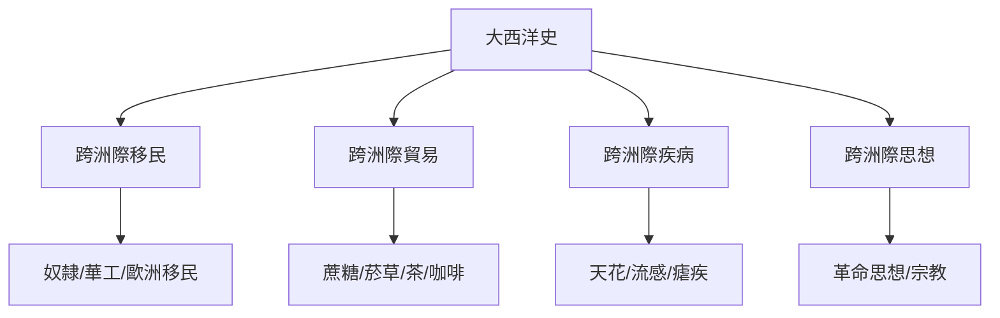
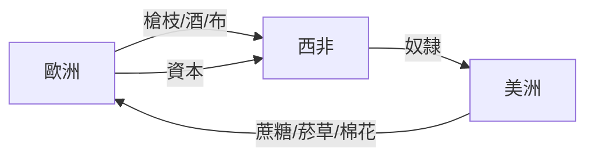
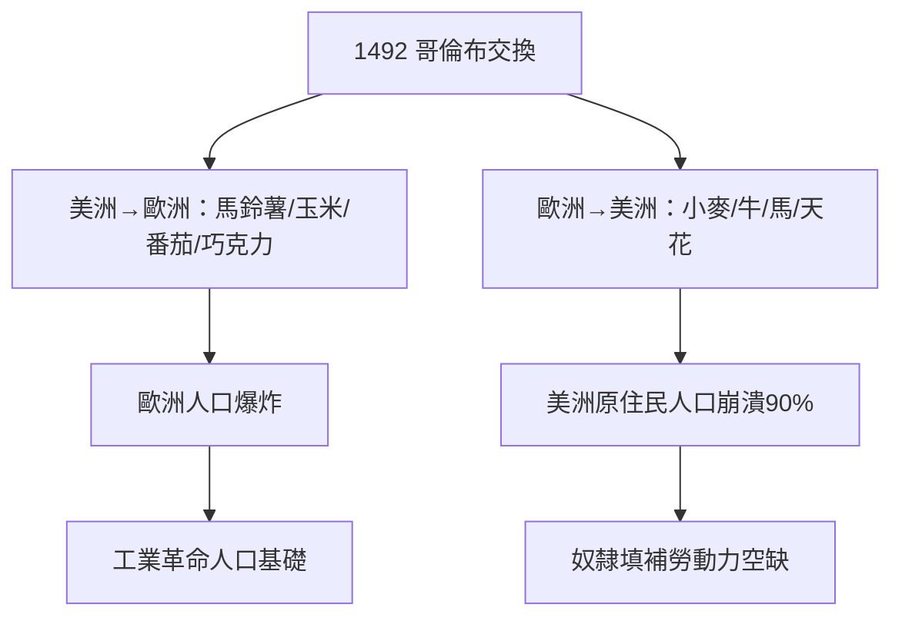
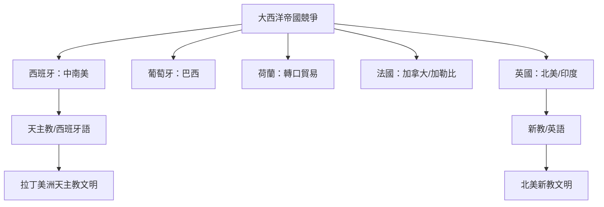
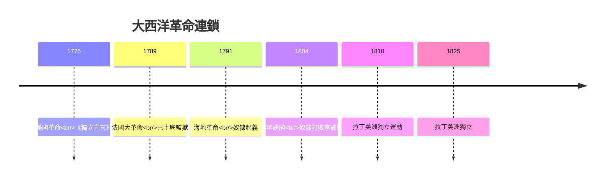
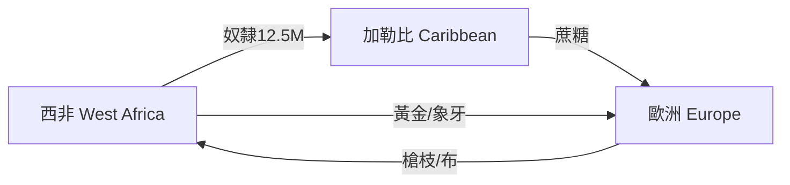
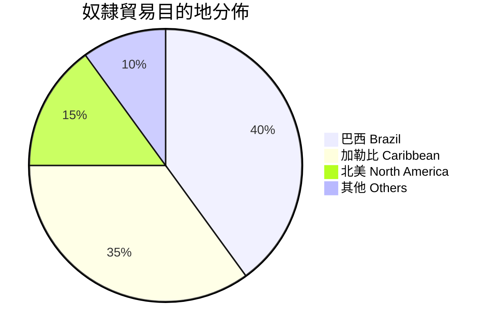
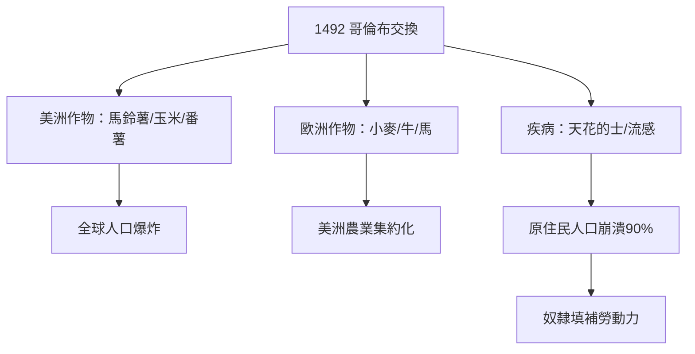
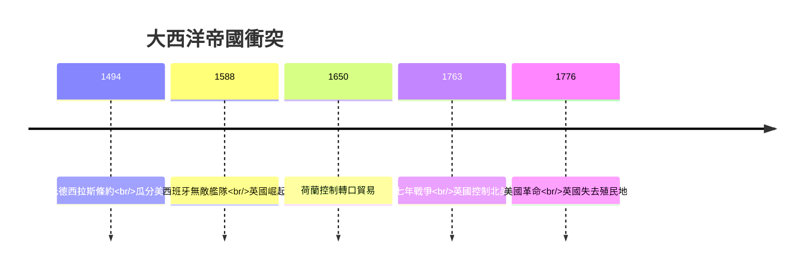
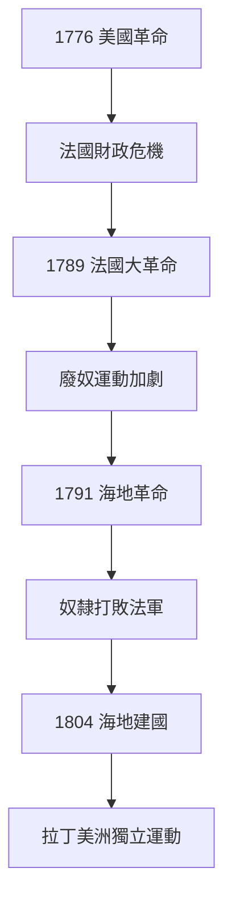

# HIST2230 前現代大西洋世界 / Early Modern Atlantic Worlds, c.1500-1800 (6 credits)

**Instructor**: Otis Edwards
**Department**: History, HKU
**Official source**: [HKU History Course Description 2024-25](https://history.hku.hk/wp-content/uploads/2024/07/HIST-2425.pdf)
**Style**: 袁騰飛式 — 犀利、聚焦大西洋點解塑造現代世界——由哥倫布到海地革命

---

## 問題 1：這個領域所有專家共享的 5 個核心心智模型

### 心智模型 1：大西洋史作方法論——跨洲際網絡
學者 **Bernard Bailyn** (*Atlantic History*, 2005) 研究：大西洋作為歷史分析單元——挑戰以國家為中心嘅歷史敘事。

學者 **David Armitage** 分析：「三個大西洋史概念」——跨洲際聯繫、比較歷史、總體化。

- 英國、法國、西班牙、荷蘭、葡萄牙帝國大西洋擴張
- 奴隸貿易、蔗糖貿易、煙草貿易
- 跨洲際移民：華人契約勞工（1840-1870年代）
- 跨洲際商業網絡

### 心智模型 2：奴隸貿易——人類史上最大規模強迫遷移
學者 **David Eltis** (*The Rise of African Slavery*, 2000) 研究：12.5百萬奴隸跨大西洋——呢個數字揭示人類史上最大規模嘅有組織暴力。

學者 **Marcus Rediker** (*The Slave Ship*, 2007) 分析：「地獄船」——奴隸船作為鎮壓機器。

- 1441年：第一批奴隸由葡萄牙運往歐洲
- 1518年：首次跨大西洋奴隸貿易
- 1700-1807年：奴隸貿易高峰期（每年10萬+）
- 1807年：英國廢奴 (Slave Trade Act)
- 1865年：美國廢奴 (第13修正案)

### 心智模型 3：哥倫布交換 (Columbian Exchange)
學者 **Alfred Crosby** (*Columbian Exchange*, 1972) 研究：1492年後新舊世界全面生物交換——馬鈴薯、番薯、玉米改變全球人口結構；天花、流感摧毁原住民90%人口。

學者 **Charles Mann** (*1493*, 2011) 分析：「全球化起點」——哥倫布交換塑造今日世界。

- 正向交換：馬鈴薯（歐洲）、玉米（亞洲）、番茄（意大利）
- 負向交換：天花的士（美洲原住民人口崩潰90%）
- 蔗糖、菸草（美洲）→ 歐洲消費革命
- 奴隸（非洲）→ 美洲種植園

### 心智模型 4：早期現代帝國主義與大西洋
學者 **John Elliott** (*The Old World and the New*, 1970) 研究：帝國衝突塑造大西洋歷史——西班牙、葡萄牙、荷蘭、英國、法國逐鹿大西洋。

學者 **Geoffrey Seed** 分析：英帝國與大西洋——英國點樣由邊緣變成主導。

- 1494年：《托德西拉斯條約》——瓜分美洲
- 1588年：西班牙無敵艦隊失敗——英國崛起
- 1650年：荷蘭控制大西洋轉口貿易
- 1763年：七年戰爭——英國控制北美大部分

### 心智模型 5：大西洋革命連鎖反應
學者 **Laurent Dubois** (*Avengers of the New World*, 2004) 研究：海地革命 (1791-1804) ——歷史上首個成功奴隸起義建國。

學者 **Julius Scott** (*The Common Wind*, 2018) 分析：大西洋革命訊息網絡——奴隸、水手、商人跨洲傳播革命思想。

- 1776年：美國革命
- 1789年：法國大革命
- 1791年：海地革命
- 1810-1825年：拉丁美洲獨立運動

---

## 問題 2：3 個根本分歧

### 分歧 1：奴隸貿易原因——經濟必然定種族歧視？
- **A 方**：經濟必然
  - 蔗糖種植園需要廉價勞動力
  - 利潤動機推動
  - 引用：David Eltis: 奴隸貿易因經濟效益而存在
- **B 方**：種族歧視先行
  - 白人優越論允許奴隸制
  - 種族分類先於奴隸貿易
  - 引用：Winthrop Jordan: 白人優越觀念先於奴隸制

### 分歧 2：哥倫布交換——正面為主定負面為主？
- **A 方**：負面為主
  - 天花導致美洲原住民人口崩潰90%
  - 奴隸貿易破壞非洲社會
  - 種植園農業摧毁環境
- **B 方**：複雜評估
  - 馬鈴薯、玉米養活數十億人
  - 全球人口增長因農業革命
  - 道德同實用主義評估必須分開

### 分歧 3：廢奴原因——道德進步定經濟利益？
- **A 方**：道德進步
  - 廢奴運動良心覺醒
  - 宗教團體引領道德改革
  - 引用：Thomas Clarkson, William Wilberforce
- **B 方**：經濟利益
  - 奴隸制經濟效益下降
  - 機械化減少對奴隸需求
  - 引用：Robert William Fogel: 奴隸制因為無效率所以消失

---

## 問題 3：10 個深度問題

1. 如果你去1492年哥倫布船上，點解佢哋决定横跨大西洋？佢哋知道美洲存在嗎？
2. 點解12.5百萬奴隸跨大西洋？呢個數字背後揭示咗乜嘢關於人性？
3. 如果你去1763年巴黎和會，點解英法兩國為北美地盤大打出手？邊個係赢家？
4. 點解天花可以摧毁整個文明？哥倫布交換點解係「有去冇回」？
5. 如果你去海地革命，你會點解奴隸起義成功建立國家？呢個係人類史上乜嘢時刻？
6. 點解大西洋史研究咁重要？佢點解挑戰咗以歐洲為中心嘅歷史敘事？
7. 如果你去研究大西洋奴隸船，你會發現乜嘢令人震驚嘅細節？Marcus Rediker《奴隸船》揭示咗乜嘢？
8. 點解蔗糖成為第一個「全球化商品」？呢個揭示咗早期現代資本主義乜嘢運作方式？
9. 如果你去研究華人契約勞工（大華）跨太平洋歷史，會發現乜嘢關於大西洋史學嘅盲點？
10. 如果你去2050年，會點解今日嘅大西洋史研究？呢個研究領域揭示咗當代乜嘢問題？

---

## 核心心智模型深化（中英對照）

## 1. 大西洋史方法論 (Atlantic History Methodology)

### 1.1 Bilingual 概念對照
| 英文概念 | 中英對照 | 歷史含義 | 爭議 |
|---|---|---|---|
| Atlantic History | 大西洋史 | 跨洲際分析單元 | vs 國家史 |
| Connected Histories | 聯繫歷史 | 追蹤跨文化聯繫 | Sanjay Subrahmanyam |
| Comparative History | 比較歷史 | 同時性分析 | 歐洲vs美洲 |
| Transnational History | 跨國史 | 突破國家邊界 | 方法論創新 |
| Imperial Atlantic | 帝國大西洋 | 殖民帝國研究 | 帝國衝突 |

### 1.2 史料與考據
- David Armitage: "Three Concepts of Atlantic History" (2002)
- Bernard Bailyn: Atlantic History (2005)
- Herman Bennett: African Kings and Black Slaves (2009)

### 1.3 袁騰飛式犀利觀察
Bernard Bailyn指出：大西洋作為歷史分析單元，挑戰咗以歐洲國家為中心嘅歷史敘事——我哋要問：「大西洋點樣連接而非分隔各洲？」

### 1.4 Deep test question
- 如果你要研究香港歷史，大西洋史方法論有乜嘢啟示？

### 1.5 圖解

---

## 2. 奴隸貿易規模 (Transatlantic Slave Trade)

### 1.1 Bilingual 概念對照
| 英文概念 | 中英對照 | 歷史含義 | 數字 |
|---|---|---|---|
| Middle Passage | 中間航道 | 奴隸船跨大西洋 | 死亡率高達15-20% |
| Triangular Trade | 三角貿易 | 歐洲→非洲→美洲→歐洲 | 利潤達100-500% |
| Atlantic Slave Trade | 大西洋奴隸貿易 | 人類史上最大規模強制遷移 | 12,500,000人 |
| Plantation Economy | 種植園經濟 | 蔗糖/菸草/棉花 | 利潤驚人 |
| Abolition Movement | 廢奴運動 | 道德vs經濟 | 1807年英國廢奴 |

### 1.2 史料與考據
- David Eltis: The Rise of African Slavery (2000)
- Marcus Rediker: The Slave Ship (2007)
- Hugh Thomas: The Slave Trade (1997)

### 1.3 袁騰飛式犀利觀察
Marcus Rediker《奴隸船》最犀利嘅發現：「地獄船」唔只係交通工具，而係鎮壓機器——奴隸被鐵鏈、棍棒、死亡威脅維持秩序。
呢個揭示咗奴隸制唔係「落後野蠻」，而係高度系統化嘅暴力資本主義。

### 1.4 Deep test question
- 如果你去研究奴隸船嘅内部結構，你會發現乜嘢令人震驚嘅細節？

### 1.5 圖解

---

## 3. 哥倫布交換 (Columbian Exchange)

### 1.1 Bilingual 概念對照
| 英文概念 | 中英對照 | 歷史含義 | 影響 |
|---|---|---|---|
| Columbian Exchange | 哥倫布交換 | 1492年後新舊世界生物交換 | 全球人口結構改變 |
| Smallpox | 天花 | 摧毁美洲原住民90%人口 | 文明崩潰 |
| Potato | 馬鈴薯 | 養活歐洲/亞洲數十億人 | 人口爆炸 |
| Sugar | 蔗糖 | 種植園奴隸勞動 | 奴隸貿易驅動 |
| Silver | 白銀 | 西班牙美洲礦脈 | 全球經濟一體化 |

### 1.2 史料與考據
- Alfred Crosby: Columbian Exchange (1972)
- Charles Mann: 1493 (2011)
- 新舊世界作物/疾病交換研究

### 1.3 袁騰飛式犀利觀察
Crosby最犀利嘅發現：馬鈴薯由美洲傳到歐洲，養活咗數十億人——但係生產馬鈴薯需要奴隸種植園。
呢個諷刺揭示：道德同實用主義往往衝突。奴隸制嘅「經濟效益」係建立在人類苦難之上。

### 1.4 Deep test question
- 如果你去研究天花點解摧毁美洲原住民，會發現乜嘢關於疾病同帝國主義嘅關係？

### 1.5 圖解

---

## 4. 大西洋帝國主義 (Atlantic Imperialism)

### 1.1 Bilingual 概念對照
| 英文概念 | 中英對照 | 歷史含義 | 關鍵事件 |
|---|---|---|---|
| Treaty of Tordesillas | 托德西拉斯條約 | 1494年瓜分美洲 | 教皇仲裁 |
| Atlantic Empire | 大西洋帝國 | 多帝國競爭 | 英/法/西/葡/荷 |
| Seven Years War | 七年戰爭 | 1763年 | 英國控制北美 |
| Creole Society | 克里奧爾社會 | 歐非美混血文化 | 身份認同複雜 |
| Atlantic Creoles | 大西洋克里奧爾人 | 跨文化混血 | Jane Landers研究 |

### 1.2 史料與考據
- John Elliott: The Old World and the New (1970)
- Jane Landers: Atlantic Creoles in the Age of Revolutions (2010)

### 1.3 袁騰飛式犀利觀察
John Elliott指出：大西洋帝國衝突塑造咗現代世界——西班牙、葡萄牙、荷蘭、法國、英國逐鹿大西洋，呢個鬥爭決定咗邊個文化、語言、宗教主導今日美洲。

### 1.4 Deep test question
- 如果你去1763年巴黎和會，會發現大西洋帝國點樣重新瓜分世界？

### 1.5 圖解

---

## 5. 大西洋革命連鎖反應 (Atlantic Revolutions Chain Reaction)

### 1.1 Bilingual 概念對照
| 英文概念 | 中英對照 | 歷史含義 | 重要性 |
|---|---|---|---|
| Haitian Revolution | 海地革命 | 1791-1804首個成功奴隸起義 | 奴隸可以打敗帝國 |
| American Revolution | 美國革命 | 1776年建國 | 自由話語誕生 |
| French Revolution | 法國大革命 | 1789年 | 歐洲政治地震 |
| Latin American Independence | 拉丁美洲獨立 | 1810-1825 | 殖民體系瓦解 |
| Atlantic Revolutions | 大西洋革命 | 連鎖反應 | 民主化浪潮 |

### 1.2 史料與考據
- Laurent Dubois: Avengers of the New World (2004)
- Julius Scott: The Common Wind (2018)

### 1.3 袁騰飛式犀利觀察
Julius Scott《共同風》最犀利嘅發現：大西洋唔只係奴隸貿易嘅通道，而係革命思想傳播嘅網絡——奴隸、水手、奴隸主、黑人士兵，跨洲際傳播革命思想。
呢個揭示：大西洋係一張「思想網絡」，唔只係商品交易所。

### 1.4 Deep test question
- 如果海地革命失敗，會點樣影響後續拉丁美洲獨立運動？

### 1.5 圖解

---

## 深度自測問題詳解

### 詳解 1: 點解大西洋史重要？
大西洋史挑戰以歐洲為中心嘅敘事——揭示奴隸貿易、種植園經濟、跨洲際疾病交換如何塑造今日世界不平等。

### 詳解 2: Marcus Rediker《奴隸船》揭示咗乜嘢？
奴隸船係一個鎮壓機器——設計用嚟以最少資源控制最多奴隸。死亡率高達15-20%——呢個唔係意外，而係系統嘅一部分。

### 詳解 3: 哥倫布交換點解係「全球化起點」？
因為佢第一次將新舊世界全面連接——生物、農業、人口、疾病、資本主義第一次全球一體化。

### 詳解 4: 天花點解摧毁美洲原住民？
因為原住民從未接觸過天花，無任何免疫能力。90%人口死亡導致社會崩潰、知識失傳。

### 詳解 5: 海地革命點解咁重要？
因為佢係人類史上第一個成功奴隸起義建立嘅國家——呢個破除咗「奴隸天生服從」嘅神話。

### 詳解 6: 點解蔗糖成為第一個全球化商品？
因為佢需要大量廉價勞動力（奴隸），同時全球需求穩定。蔗糖貿易利潤100-500%——呢個驅動咗大西洋奴隸貿易。

### 詳解 7: 如果你要研究大西洋華人歷史？
1840年代-1870年代，大批華人契約勞工（大華）跨太平洋嚟到加勒比、南美——呢個揭示大西洋史嘅種族層次唔只涉及黑人。

### 詳解 8: 如果你去研究海地革命，會發現乜嘢令人震驚？
海地奴隸用緊法國大革命嘅革命話語——但係對解放奴隸嚟講！呢個揭示革命思想跨洲際傳播幾快。

### 詳解 9: 點解廢奴運動咁難實現？
因為奴隸制涉及巨大經濟利益——蔗糖、菸草、棉花種植園利潤驚人。道德vs利益，呢個係永遠嘅張力。

### 詳解 10: 如果你去研究當代非洲—加勒比—南美聯繫？
歷史奴隸貿易造成嘅文化、人口、商業聯繫仍然存在——呢個係「大西洋離散」(Atlantic Diaspora)。

---

## 5 個 Mermaid 圖解

### 📊 Diagram 1: 大西洋世界1500-1800

### 📊 Diagram 2: 奴隸貿易目的地分佈

### 📊 Diagram 3: 哥倫布交換影響

### 📊 Diagram 4: 大西洋帝國衝突時間線

### 📊 Diagram 5: 大西洋革命連鎖反應

---

## 總結

1. **大西洋史挑戰以國家為中心嘅歷史敘事**——揭示奴隸貿易、種植園經濟、跨洲際疾病交換如何塑造今日世界不平等。
2. **奴隸貿易係人類史上最大規模有組織暴力**——12.5百萬人被強迫跨大西洋，呢個唔係歷史偶然，而係系統性鎮壓。
3. **哥倫布交換係「全球化起點」**——但係全球一體化係建立在奴隸制、天花、人口滅絕之上。
4. **大西洋革命連鎖反應塑造現代世界**——美國、法國、海地革命互相影響，形成民主化浪潮。
5. **海地革命破除「奴隸天生服從」神話**——奴隸可以打敗拿破崙，建立國家。

**最後問題**: 如果你去研究大西洋歷史，點解呢個研究領域對理解當代種族問題仍然至關重要？

---
**版權所有 © HKU History Self-Study**
