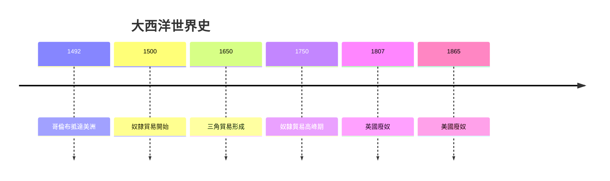
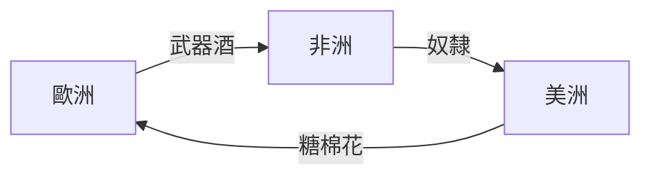
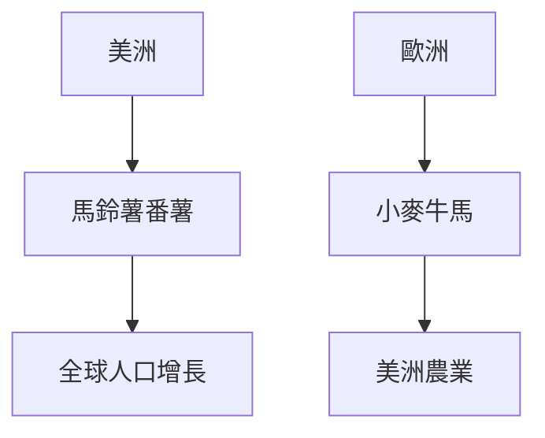
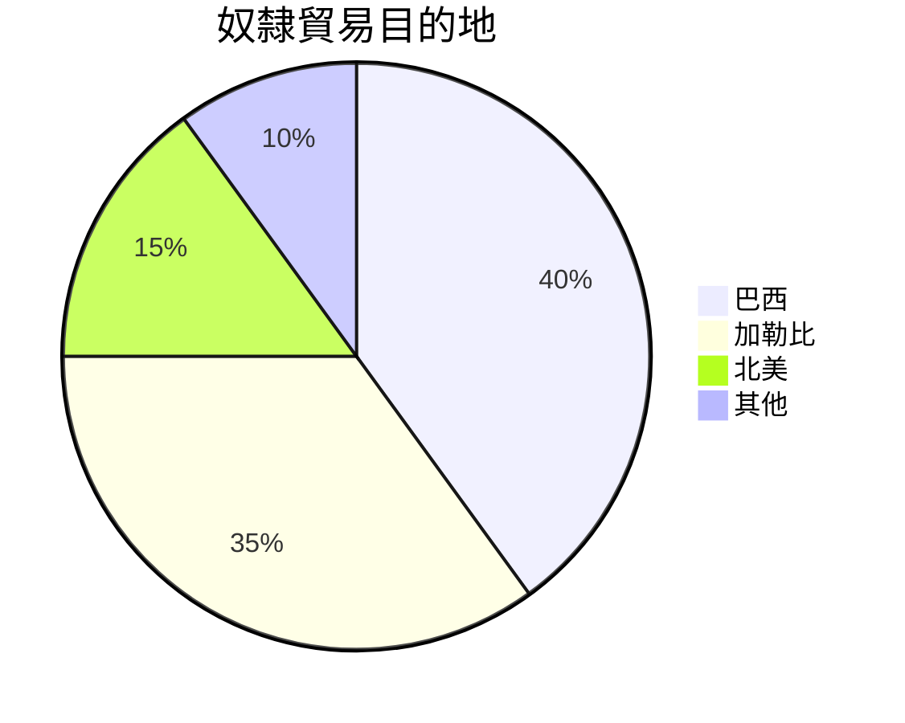

# HIST2230 前現代大西洋世界 / Early Modern Atlantic Worlds (6 credits)

**Instructor**: Otis Edwards
**Department**: History, HKU  
**Official source**: [HKU History Course Description 2024-25](https://history.hku.hk/wp-content/uploads/2024/07/HIST-2425.pdf)
**Style**: 袁騰飛式 — 犀利、聚焦大西洋點解塑造現代世界

---

## 問題 1：這個領域所有專家共享的 5 個核心心智模型

### 心智模型 1：大西洋世界史方法
學者 **Bernard Bailyn** (*Atlantic History*, 2005) 研究：大西洋作為歷史分析單元——跨洲際移民、貿易、疾病。

學者 **Jack Greene** 分析：大西洋世界史挑戰國家中心敘事。

- 1500-1800 大西洋互動
- 三角貿易
- 移民、奴隸、商人

### 心智模型 2：奴隸貿易規模
學者 **David Eltis** (*The Rise of African Slavery*, 2000) 研究：12.5 百萬奴隸跨大西洋——人類史上最大規模強迫遷移。

學者 **Marcus Rediker** (*The Slave Ship*, 2007) 分析：奴隸船作為「地獄」。

### 心智模型 3：哥倫布交換 (Columbian Exchange)
學者 **Alfred Crosby** (*Columbian Exchange*, 1972) 研究：1492 年後新舊世界生物、農業、人口全面交換。

學者 **Charles C. Mann** (*1493*, 2011) 分析：全球化起點。

### 心智模型 4：大西洋商業網絡
學者 **Carla Phillips** 研究：大西洋商人網絡——跨文化貿易。

學者 **Kenneth Morgan** 分析：奴隸、糖、菸草貿易。

### 心智模型 5：帝國主義與大西洋
學者 **John Elliott** (*The Old World and the New*, 1970) 研究：帝國主義衝突塑造大西洋歷史。

學者 **Geoffrey Seed** 分析：英帝國與大西洋。

---

## 問題 2：3 個根本分歧

### 分歧 1：奴隸貿易原因——經濟必然定種族歧視？
- **A 方**：經濟必然
  - 利潤動機
- **B 方**：種族歧視
  - 白人優越論

### 分歧 2：哥倫布交換——正面為主？
- **A 方**：負面
  - 原住民人口崩潰
- **B 方**：複雜
  - 新作物增加全球人口

### 分歧 3：廢奴原因——道德進步定經濟利益？
- **A 方**：道德進步
  - 廢奴運動
- **B 方**：經濟利益
  - 奴隸制度效率下降

---

## 問題 3：10 個深度問題

1. 如果你去 1550 年做大西洋商人，你會發現乜嘢？
2. 點解奴隸貿易持續 400 年？
3. 如果你是奴隸船水手，你點解參與？
4. 哥倫布交換——新舊世界邊個損失更大？
5. 如果你去 1800 年，你會點估計廢奴？
6. 點解大西洋史挑戰國家中心敘事？
7. 如果你是歷史學家，點樣研究跨洲際歷史？
8. 奴隸貿易數字——點解仍然有爭議？
9. 大西洋史點解對理解當代種族問題重要？
10. 如果你去 2050 年，大西洋史會點樣被研究？

---

## 核心心智模型深化

### 1. 大西洋世界時間線



---

## 5 個 Mermaid 圖解

### 📊 Diagram 1: 三角貿易



### 📊 Diagram 2: 哥倫布交換



### 📊 Diagram 3: 奴隸貿易規模



### 📊 Diagram 4: 大西洋帝國

```mermaid
flowchart TD
    A[西班牙] --> B[中南美]
    A --> C[葡萄牙]
    C --> D[巴西}
```

### 📊 Diagram 5: 大西洋史研究

```mermaid
flowchart TD
    A[跨洲際網絡] --> B[移民}
    B --> C[奴隸貿易}
    C --> D[商業}
    D --> E[疾病}
```

---

## 總結

1. 大西洋世界史挑戰國家中心敘事
2. 奴隸貿易係人類最大規模強迫遷移
3. 哥倫布交換改變全球
4. 大西洋史對理解當代種族問題重要
5. 跨學科方法至關重要

**最後問題**: 如果你去 1600 年，你會點理解大西洋世界？

---
**版權所有 © HKU History Self-Study**
