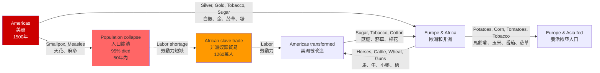
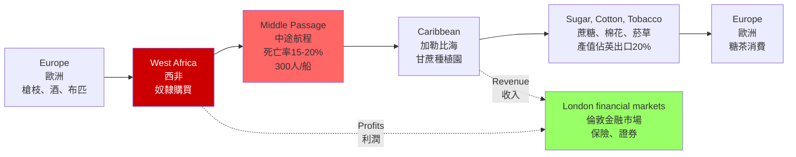
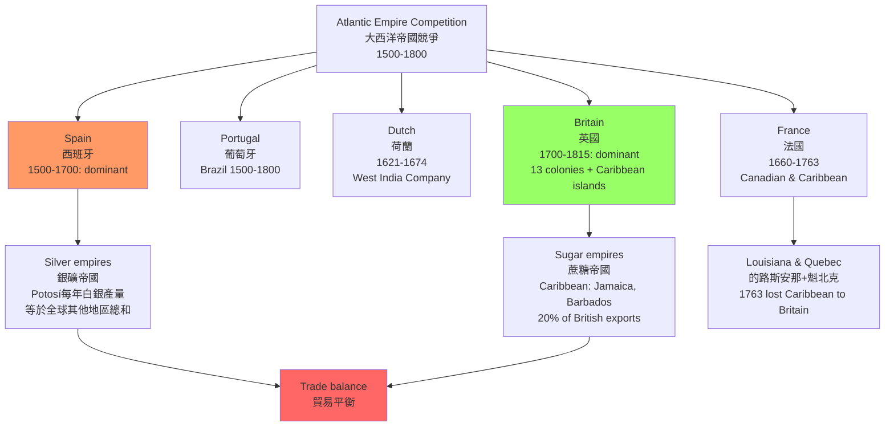
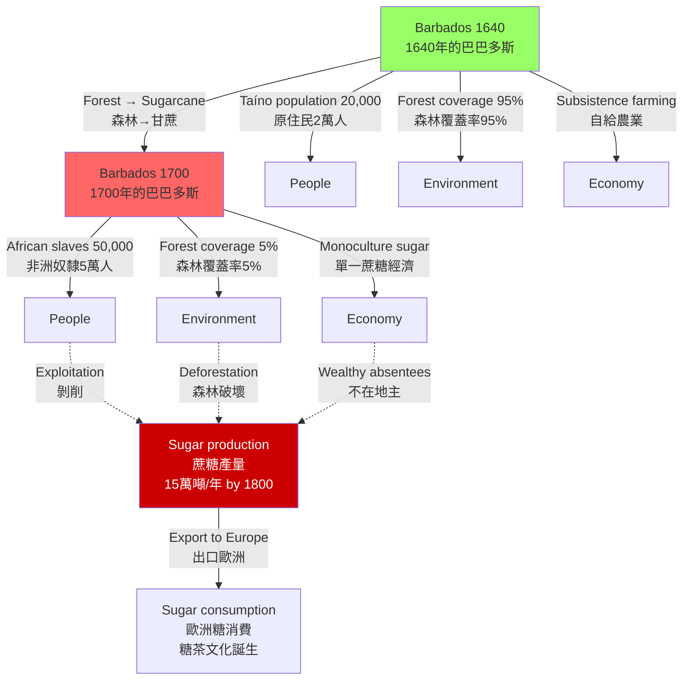
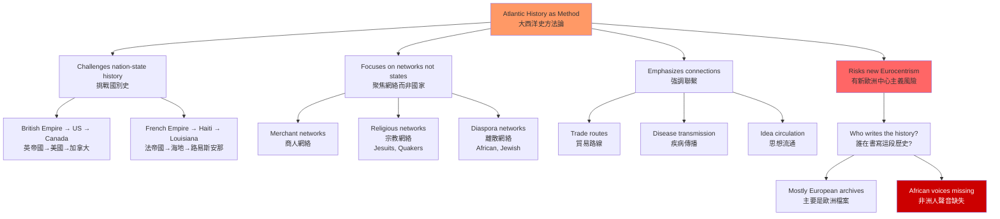
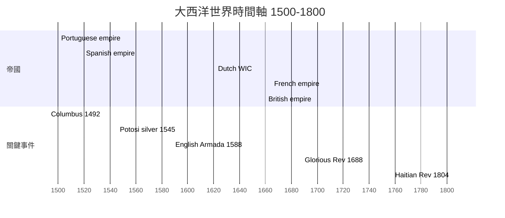
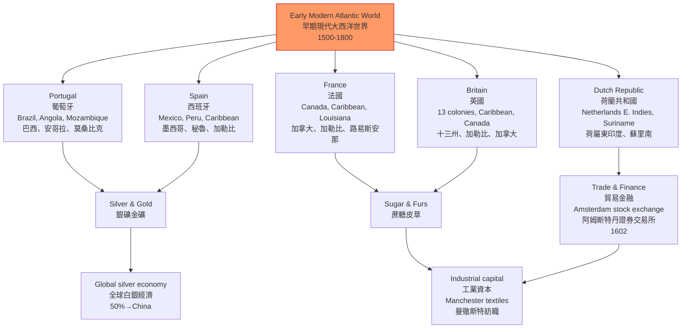
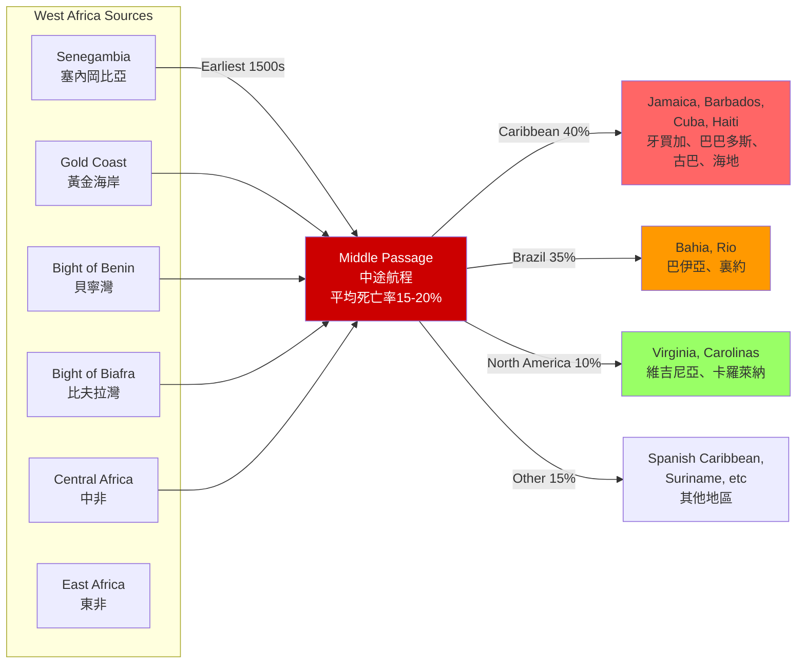
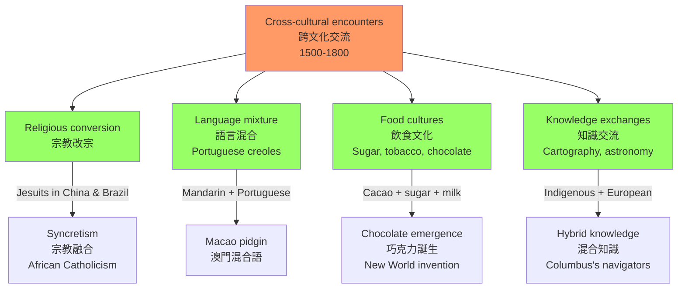
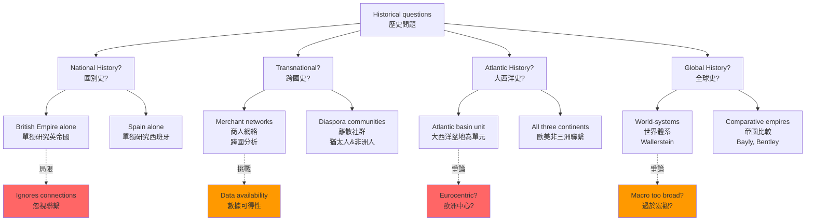

# HIST2230 前現代大西洋世界 / Early Modern Atlantic Worlds, c. 1500-1800

**Instructor**: Otis Edwards
**Department**: History, HKU
**Official source**: [HKU History Course Description](https://history.hku.hk/ug_cd/), [HIST-2425.pdf](https://history.hku.hk/wp-content/uploads/2024/07/HIST-2425.pdf)
**Style**: research-based — 犀利、聚焦帝國、糖、奴隸——從哥倫布到海地，大西洋如何構造了現代世界

---

## 問題 1：這個領域所有專家共享的 5 個核心心智模型是什麼？

### 1. 哥倫布交換（The Columbian Exchange）

**專家如何思考**: 1492 年哥倫布登陸美洲，啟動了人類歷史上最大規模的生物交換——舊世界與新世界的植物、動物、疾病、人員大規模流通。學者 **Alfred Crosby** 在 *The Columbian Exchange* (1972) 中量化了這次交換：天花、麻疹、流感等疾病導致美洲原住民人口在 1500-1650 農損失 90%（從約 5000-6000 萬人降至 500-600 萬人）；同時，馬鈴薯、玉米、番茄從美洲傳入舊世界，養活了歐洲和中國更多人口，間接為工業革命提供了人口基礎。

- **典型學者**: Alfred Crosby — *The Columbian Exchange* (1972); Charles Mann — *1491: New Revelations of the Americas Before Columbus* (2005)
- **驗證案例**: 1545 年波托西銀礦（Potosí，現在玻利維亞）開採，高產白銀流入全球市場——其中約 50% 流入中國，成為明朝白銀貨幣體系的基礎，改變了中國經濟結構

### 2. 三角貿易（The Triangular Trade）

**專家如何思考**: 奴隸貿易不是一條線，而是多條線交織的三角形：①西非→Caribbean（奴隸）；②Caribbean→歐洲（蔗糖）；③歐洲→西非（槍枝、布匹、酒）。學者 **Philip Curtin** 在 *The Atlantic Slave Trade: A Census* (1969) 中估算：1450-1900 年間，約 1260 萬非洲人被跨越大西洋，約 15% 在中途死亡。

- **典型學者**: Philip Curtin — *The Atlantic Slave Trade: A Census* (1969); Hugh Thomas — *The Slave Trade: The Story of the Atlantic Slave Trade, 1440-1870* (1997); Walter Johnson — *Soul by Soul: Life Inside the Antebellum Slave Market* (1999)
- **驗證案例**: 1783 年英國廢除奴隸貿易（但非奴隸制），倫敦的廢奴運動與加勒比糖商利益之間的政治博弈，直接導致了 1807 年的《廢除奴隸貿易法》

### 3. 帝國競爭（Imperial Rivalry）

**專家如何思考**: 1500-1800 年間，大西洋是五大歐洲帝國的競技場：葡萄牙（巴西）、西班牙（中美、南美）、荷蘭（加勒比群島、巴西短暫佔領）、法國（加拿大、加勒比）、英國（北美十三州、加勒比）。學者 **John Elliott** 在 *The Old World and the New* (1970) 中分析了伊比利亞帝國對美洲征服的文化衝擊。

- **典型學者**: John Elliott — *The Old World and the New* (1970); J.H. Elliott — *Empires of the Atlantic World* (2006); Christian Koot — *Empire at the Periphery* (2011)
- **驗證案例**: 1588 年英格蘭擊敗西班牙無敵艦隊（130艘戰艦），標誌着大西洋制海權從西班牙向英國的轉移，開啟了英帝國的崛起

### 4. 蔗糖革命（The Sugar Revolution）

**專家如何思考**: 從 1500 年到 1800 年，Caribbean 經歷了一場「蔗糖革命」——從森林變成種植園，從原住民（Taíno人）變成非洲奴隸。學者 **Sidney Mintz** 在 *Sweetness and Power: The Place of Sugar in Modern History* (1985) 中論證：糖不僅是一種商品，而是現代世界體系的象徵——它連接了 Caribbean 奴隸制、英國工業革命和全球消費文化。

- **典型學者**: Sidney Mintz — *Sweetness and Power* (1985); Robin Blackburn — *The Making of New World Slavery* (1997); B.W. Higman — *Montpelier, Jamaica: A Plantation Community in Slavery and Freedom* (1984)
- **驗證案例**: 1700 年英國消費的糖約 10 萬噸/年；1800 年增至約 15 萬噸/年——這種需求的增長直接推動了 Caribbean 奴隸貿易的擴張

### 5. 大西洋史方法論（Atlantic History as Methodology）

**專家如何思考**: 大西洋史不是以國家為中心的歷史，而是以**跨洲際網絡**為分析單位。學者 **Bernard Bailyn** 在 *Atlantic History: A Manifesto* (2005) 中提出：北大西洋（西歐-北美-西非）構成一個獨立的歷史分析單元，挑戰了傳統的國別史框架。

- **典型學者**: Bernard Bailyn — *Atlantic History: A Manifesto* (2005); David Armitage — *The Age of Revolution* (2012); Alison Games — *The Web of Empire* (2006)
- **驗證案例**: 1688 年光榮革命（Glorious Revolution）後，英國政治制度改變，影響了英格蘭和愛爾蘭的金融政策，並通過倫敦金融市場間接影響了 Caribbean 奴隸貿易的規模——這是傳統國別史無法解釋的跨洲際連結

---

## 問題 2：這個領域 3 個最根本的分歧點是什麼？

### 分歧 1：「發現」與「征服」——誰的歷史？
**核心問題**: 1492 年的「發現美洲」是歷史事實還是帝國主義話語？

- **學派A（歐洲中心論）**: 哥倫布發現美洲是人類歷史的轉折點，開啟了「全球化」
- **學派B（原住民視角）**: 美洲早已有人居住，所謂「發現」是歐洲中心主義的話語暴力——學者 **Jack Forbes** 等人主張用「接觸」（encounter）代替「發現」（discovery）
- **學者代表**: Charles Mann — *1491* (2005); Matthew Restall — *Seven Myths of the Spanish Conquest* (2003)
- **驗證**: 1492 年抵達 Caribbean 的哥倫布船隊約 90 人；1500 年代 Caribbean 原住民 Taíno 人從約 25 萬人銳減至 1520 年的約 2 萬人——主要死因是歐洲疾病（天花、麻疹），而非直接屠殺

### 分歧 2：「大西洋史」——真正的跨洲視角 vs 隱藏的歐洲中心論？
**核心問題**: 大西洋史方法論是真正的「去歐洲中心」還是新的歐洲中心包裝？

- **學派A（大西洋史倡導）**: Bernard Bailyn、David Armitage 等認為，以大西洋為分析單位可以擺脫國別史的局限，更真實地呈現歷史聯繫
- **學派B（後殖民批評）**: **Lisa Voigt** 等學者指出，大西洋史往往仍然是「從歐洲帝國往外看」的歷史——非洲人的視角、Taíno 原住民的抵抗、中國商人在馬尼拉的角色都被邊緣化
- **學者代表**: Bernard Bailyn — *Atlantic History* (2005); Lisa Voigt — *Writing Broken Worlds* (2009)
- **驗證**: 1521-1570 年間，馬尼拉大帆船貿易將中國絲綢和墨西哥白銀連接——這條太平洋航線的重要性不亞於大西洋貿易，但在大西洋史框架中經常被忽略

### 分歧 3：奴隸制——自由市場的扭曲 vs 帝國主義的核心？
**核心問題**: 奴隸制是大西洋經濟的「例外」還是「核心」？

- **學派A（修正主義）**: Eric Williams — *Capitalism and Slavery* (1944) 論證：奴隸貿易和 Caribbean 奴隸制是英國工業革命原始積累的核心——曼徹斯特紡織業的繁榮直接依賴 Caribbean 奴隸種植園提供的棉花
- **學派B（新制度主義）**: Robin Blackburn — *The Making of New World Slavery* (1997) 等學者認為，奴隸制不是市場失靈，而是有意識的帝國制度設計——是歐洲國家權力與種植園資本主義的共謀
- **驗證**: 1750 年英國 Caribbean 殖民地（牙買加、巴巴多斯等）的蔗糖出口產值約佔英帝國總出口的 20%；英國金融機構（倫敦勞埃德保險公司、皇家非洲公司）直接從奴隸貿易和 Caribbean 種植園中獲利

---

## 問題 3：10 個區分真實理解 vs 死記硬背的深度問題

1. **哥倫布交換**的生物學基礎是什麼？如果沒有天花和麻疹，美洲原住民人口結構會如何影響歐洲殖民方式？請從疾病生態學角度分析。
2. 三角貿易的經濟邏輯是什麼？為什麼奴隸貿易的利潤（每年約 10-25%）遠高於當時歐洲農業回報（每年約 3-5%）？這種利潤差距如何影響了歐洲的金融革命？
3. **蔗糖革命**如何將 Caribbean 從「天堂」變成了「地獄」？1500-1700 年間 Caribbean 的森林破壞、人口置換、土地所有權集中是如何同時發生的？
4. 帝國競爭在大西洋世界的表現：英法在西印度群島的戰爭（1740-1763）與七年戰爭的全球佈局有什麼關係？為什麼 Caribbean 島嶼的控制權比北美殖民地更有價值？
5. 學者 **Sidney Mintz** 認為糖是「現代世界體系的象徵」——請分析從 Caribbean 奴隸種植園到英國工廠工人消費糖茶的完整供應鏈。
6. 如果沒有馬尼拉大帆船貿易（1565-1815），白銀從美洲到中國的流通會受到什麼影響？這種跨太平洋貿易如何改變了中國明代和清代的經濟結構？
7. **「大西洋史」**作為一個研究方法的優點和局限性是什麼？從方法論角度分析 Bernard Bailyn 的 Atlantic History manifesto 與傳統國別史的本體論差異。
8. 為什麼 Caribbean 在 1650 年後成為世界最重要的農業出口區（蔗糖）？這種「單一作物經濟」（mono-crop agriculture）如何塑造了 Caribbean 島嶼的社會結構和政治命運？
9. 如果你是 16 世紀 Caribbean 的 Taíno 領袖，面對西班牙征服者的殖民暴力，你會選擇抵抗還是合作？這兩種策略各自的歷史後果是什麼？
10. 從早期現代到現代：1804 年海地獨立和 1825 年 British Emancipation Act（廢奴）如何標誌着大西洋世界奴隸制時代的終結開始？這兩個事件對全球勞動力制度的深遠影響是什麼？

---

# 核心心智模型深化（中英對照）

## 1. 哥倫布交換（The Columbian Exchange）

### 1.1 Bilingual 概念對照
| 英文 | 中文 | 歷史含義 | 關鍵數據 |
|---|---|---|---|
| Columbian Exchange | 哥倫布交換 | 舊世界與新世界的生物交流 | 1500-1650 |
| Demographic collapse | 人口崩潰 | 美洲原住民的大量死亡 | 90%死亡率 |
| Silver flow | 白銀流動 | 美洲白銀的全球流通 | 15萬噸開採 |
| Columbian legacy | 哥倫布遺產 | 交換的長期影響 | 持續至今 |

### 1.2 史料與考據
- **一手史料**: 哥倫布的 *Diario*（航海日誌，1492-1493）；Bartolomé de las Casas 的 *A Short Account of the Destruction of the Indies* (1552)；Cortés 的信件（Humboldt 整理版本）
- **關鍵學者**: Alfred Crosby — *The Columbian Exchange* (1972); Charles Mann — *1491* (2005); Noble David Cook — *The Death of the Father of the Conquerors* (1982)
- **史料批判**: 哥倫布日誌由其子轉述，存在自我美化的傾向；Las Casas 的記載雖然同情原住民，但其「百萬人死亡」的說法被現代學者修正為約 5000 萬中的 90%

### 1.3 犀利觀察
很多人把 1492 年當作「世界連成一體」的起點——錯！1492 年的真實意義是：**天花比西班牙人先到，天災比槍炮更致命**。

哥倫布在 1492 年抵達 Caribbean 時，他帶來的疾病在 50 年內消滅了約 95% 的當地人口。西班牙人不是靠刀劍征服了美洲，是靠微生物——天花、麻疹、流感。科爾特斯（Hernán Cortés）能夠以區區 600 人的兵力擊敗阿茲特克帝國（人口約 500 萬），不是因為西班牙人有什麼魔法，是因為Cortés到達前，天花已經殺死了阿茲特克皇帝蒙特蘇馬二世和大量貴族，造成了帝國的政治癱瘓。

這就是歷史書不告訴你的真相：**疾病是最終極的大規模殺傷性武器**。

### 1.4 Deep test question
- **Q1**: 從疾病生態學角度，請分析為什麼美洲原住民對歐洲疾病（天花、流感、麻疹）完全沒有免疫力，而歐洲人對美洲疾病（梅毒是唯一大規模傳入歐洲的疾病）的影響相對有限？
- **Q2**: 如果哥倫布在 1492 年沒有抵達 Caribbean，舊世界與新世界的接觸會以什麼其他方式發生？這種延遲會如何改變美洲原住民的歷史命運？
- **Q3**: 蔗糖、馬鈴薯、玉米從美洲傳入舊世界，對中國明代、清代的人口增長有什麼具體影響？這種影響與同時期歐洲的人口增長有什麼可比之處？

### 1.5 圖解

---

## 2. 三角貿易（The Triangular Trade）

### 2.1 Bilingual 概念對照
| 英文 | 中文 | 歷史含義 | 關鍵數據 |
|---|---|---|---|
| Middle Passage | 中途航程 | 奴隸跨越大西洋的航程 | 死亡率 15-20% |
| Triangular trade | 三角貿易 | 奴隸-糖-槍枝的交換 | 利潤 10-25%/年 |
| Atlantic slave trade | 跨大西洋奴隸貿易 | 人類史上最大強制遷移 | 1260萬人 |
| Transatlantic diaspora | 跨大西洋離散 | 非洲人的全球流動 | 40個現代國家 |

### 2.2 史料與考據
- **一手史料**: 奴隸船的航海日誌（logbooks）、英國皇家非洲公司（Royal African Company, 1660-1752）檔案、奴隸拍賣記錄
- **關鍵學者**: Philip Curtin — *The Atlantic Slave Trade: A Census* (1969); Hugh Thomas — *The Slave Trade* (1997); Marcus Rediker — *The Slave Ship* (2007); Stephanie Smallwood — *Saltwater Slavery* (2007)
- **史料局限**: 奴隸船日誌主要由奴隸商人撰寫，奴隸的主觀體驗幾乎沒有直接記錄；Walter Johnson 的 *Soul by Soul* (1999) 通過奴隸拍賣記錄重建了奴隸的「市場人格」

### 2.3 犀利觀察
三角貿易的經濟邏輯其實非常簡單：**在 Caribbean 種甘蔗，比在英格蘭種小麥利潤高得多**。

問題是：種甘蔗需要大量廉價勞動力，而 Caribbean 原住民在 1520 年代就死光了。解決方案？**非洲奴隸**。

奴隸貿易的利潤率為什麼這麼高？因為奴隸是「消耗品」——他們在 Caribbean 甘蔗田的高溫、疾病、暴力環境下，平均工作壽命只有 7-10 年。種植園主不需要擔心奴隸的長期福利，只需要確保他們在死亡前創造足夠的蔗糖價值。奴隸商人需要擔心的只是「每次航程要賺多少」。

這就是為什麼奴隸貿易比任何農業或製造業都有更高的內部回報率（IRR）——因為奴隸的生命被折算成了蔗糖公斤數。

### 2.4 Deep test question
- **Q1**: 請計算一艘典型奴隸船的利潤結構：假設每艘船運載 300 名奴隸（每名成本 £10），在 Caribbean 以每名 £40 出售，船員和運營成本 £2000，請計算利潤率。
- **Q2**: 「中途航程」（Middle Passage）的死亡率在不同時期、不同航線有什麼差異？為什麼 18 世紀末的死亡率反而高於 16-17 世紀？
- **Q3**: 從倫敦金融市場的角度，分析奴隸貿易利潤如何流入英國金融體系（保險、航運、證券交易所），並間接資助了英國的工業革命。

### 2.5 圖解

---

## 3. 帝國競爭（Imperial Rivalry）

### 3.1 Bilingual 概念對照
| 英文 | 中文 | 歷史含義 | 關鍵時間點 |
|---|---|---|---|
| Imperial rivalry | 帝國競爭 | 歐洲帝國間的武力對抗 | 1500-1800 |
| Balance of power | 權力均衡 | 防止任何單一帝國稱霸 | 烏得勒支條約 1713 |
| Colonial administration | 殖民管治 | 帝國如何管理遙遠領地 | 西班牙複製品制 |
| War of Jenkins' Ear | 詹金斯的耳朵戰爭 | 英西加勒比海戰爭 | 1739-1748 |

### 3.2 史料與考據
- **一手史料**: 西班牙印度群岛總督府檔案（Archivo General de Indias, Seville）、英國海軍部檔案（Admiralty Records）、東印度公司會議記錄
- **關鍵學者**: J.H. Elliott — *Empires of the Atlantic World* (2006); Christian Koot — *Empire at the Periphery* (2011); Natalie Davis — *Trickster Travels* (2006)
- **史料局限**: 檔案主要來自宗主國官僚，原住民和奴隸的視角極度匱乏

### 3.3 犀利觀察
大西洋帝國競爭的實質是什麼？是**金庫競爭**——誰控制了 Caribbean 糖業和美洲銀礦，誰就有錢打造更強的海軍，誰就能控制更多貿易路線。

西班牙在 16 世紀的無敵艦隊（Armada, 1588）被英格蘭擊敗，標誌着大西洋霸權的第一次轉移。但這次轉移不是一夜之間發生的——從伊麗莎白時代（1558-1603）到七年戰爭（1756-1763），英國花了大約 200 年時間，通過一系列局部戰爭（1660-1763 年間英法在 Caribbean 和北美打了 4 次大戰），才最終確立了大西洋霸主地位。

每一次 Caribbean 島嶼的易手，背後都是金錢和海軍實力的較量。

### 3.4 Deep test question
- **Q1**: 比較西班牙帝國（1519-1700）和英帝國（1660-1815）管理美洲殖民地的制度差異。西班牙的「米塔制」（encomienda）和英國的「特許狀公司」（chartered companies）制度，如何塑造了兩種不同的殖民暴力形態？
- **Q2**: 七年戰爭（1756-1763）如何同時改變了 Caribbean 和北美殖民地的政治格局？《巴黎條約》(1763) 為什麼被稱為英帝國的「最大勝利」和「最大錯誤」？
- **Q3**: 1700 年西班牙王位繼承戰爭後，波旁王朝入主西班牙（腓力五世），對西班牙美洲殖民地的政策有什麼影響？

### 3.5 圖解

---

## 4. 蔗糖革命（The Sugar Revolution）

### 4.1 Bilingual 概念對照
| 英文 | 中文 | 歷史含義 | 關鍵數據 |
|---|---|---|---|
| Sugar revolution | 蔗糖革命 | Caribbean 從森林到種植園 | 1650-1750 |
| Plantations | 種植園 | 大規模單一作物農業 | 佔地數百英畝 |
| Migrations | 人口遷移 | 非洲奴隸的強制遷移 | 1260萬人 |
| Atlantic consumerism | 大西洋消費主義 | 歐洲糖茶文化興起 | 1700年: 10萬噸/年 |

### 4.2 史料與考據
- **一手史料**: Barbados 甘蔗種植園記錄、奴隸拍賣清單、倫敦糖商書信
- **關鍵學者**: Sidney Mintz — *Sweetness and Power* (1985); Robin Blackburn — *The Making of New World Slavery* (1997); B.W. Higman — *Montpelier, Jamaica* (1984)
- **史料批判**: 種植園記錄主要反映經濟面向，奴隸的社會文化生活需要通過人類學方法重建

### 4.3 犀利觀察
蔗糖革命的真相是：它把 Caribbean 從「人間天堂」變成了「人間地獄」。

Barbados 在 1640 年開始種蔗糖之前，是一個森林覆蓋的小島，有大約 2 萬 Taíno 人和少量歐洲定居者。1640 年代荷蘭商人帶來了蔗糖種植技術和磨坊設備後，到 1700 年，Barbados 的森林已經被砍伐殆盡，變成了 100% 的蔗糖種植園。當地原住民在 1650 年代幾乎全部死亡（疾病+被迫勞動），取代他們的是從非洲進口的奴隸。

到了 1800 年，Barbados 的人口結構是：5 萬奴隸 vs 2 萬歐洲人——種族比例徹底顛倒。這不是「經濟發展」，這是**文明級別的生態和社會災難**。

### 4.4 Deep test question
- **Q1**: 分析 Barbados 蔗糖革命的完整週期：荷蘭人（1640）→蔗糖引進→森林砍伐→土壤耗竭→奴隸輸入→社會結構重構，到 1700 年這座島嶼與 1640 年相比有什麼根本性的變化？
- **Q2**: 從全球史角度，分析糖的消費如何改變了英國工人階級的飲食結構——為什麼糖茶（sugar and tea）成為英國工人階級的主要熱量來源之一？這種消費習慣對英國工業革命的社會條件有什麼影響？
- **Q3**: 比較 Caribbean 蔗糖種植園和同時期印度棉紡織業的剝削模式。兩者有什麼共同特徵（強制勞動、童工、血汗工廠）？又有什麼根本差異？

### 4.5 圖解

---

## 5. 大西洋史方法論（Atlantic History as Methodology）

### 5.1 Bilingual 概念對照
| 英文 | 中文 | 歷史含義 | 方法論意義 |
|---|---|---|---|
| Atlantic history | 大西洋史 | 以大西洋為分析單元 | 挑戰國別史 |
| Transnational networks | 跨國網絡 | 超越國界的互聯 | 商人、宗教、流亡者 |
| Comparative method | 比較方法 | 不同帝國、社會的並置 | 英法西葡荷 |
| Global history | 全球史 | 更大的尺度 | 大西洋+太平洋+印度洋 |

### 5.2 史料與考據
- **一手史料**: 多語言檔案（西班牙語、葡萄牙語、法語、英語、荷蘭語）；不同帝國的官方檔案；港口城市的海關記錄；教會記錄（修女院、傳教會）
- **關鍵學者**: Bernard Bailyn — *Atlantic History* (2005); David Armitage — *Foundations of Modern International Thought* (2012); Alison Games — *The Web of Empire* (2006); Lauren Benton — *A Search for Sovereignty* (2010)
- **史料局限**: 大西洋史依賴歐洲語言檔案，非洲和美洲原住民的史料極度匱乏，需要大量推斷

### 5.3 犀利觀察
大西洋史方法論看起來是「去歐洲中心」的——它把 Caribbean、非洲、歐洲當作一個整體來分析。但問題來了：**誰在書寫這段歷史？**

答案是：仍然是歐美的大學歷史學家，仍然主要使用歐洲語言檔案，仍然以歐洲帝國的擴張和競爭為主線。

非洲人去哪了？他們是 1260 萬被強制遷移的主體，但在檔案裏，他們的名字很少出現——只有「cargo」（人數）和「price」（價格）。我們知道有多少奴隸上船，卻很少知道他們是誰、他們的宗教、他們的家庭。

大西洋史最大的挑戰不是找出更多的歐洲檔案，而是**如何讓沉默者的歷史發聲**。

### 5.4 Deep test question
- **Q1**: 比較 Bernard Bailyn 的「北大西洋史」（North Atlantic History）和 Patricia seed 的「伊比利亞大西洋史」（Iberian Atlantic History）。這兩種框架分別側重什麼？各自的優點和局限性是什麼？
- **Q2**: 從方法論角度，什麼是「比較史」（comparative history）？請用大西洋世界中英帝國和法帝國在 Caribbean 的殖民策略差異來說明比較史的實踐方法。
- **Q3**: 「跨國史」（transnational history）和「全球史」（global history）有什麼區別？大西洋史更接近哪一種？這種方法論選擇對歷史解釋有什麼實際影響？

### 5.5 圖解

---

# 深度自測問題詳解

## Q1 詳解：哥倫布交換的疾病生態學
**核心答案**: 美洲原住民對歐洲疾病缺乏免疫力的原因是**演化生物學**：在歐亞大陸，人類與家畜（牛、豬、羊）共同生活了約 10,000 年，這些動物攜帶的病毒在人畜長期接觸中逐漸演化為人類疾病（天花、牛痘、流感）。而美洲的疾病環境中缺乏這種「家畜-人類」的長期互動，因此美洲原住民對歐亞疾病完全沒有群體免疫（herd immunity）。

**Yuan-style commentary**: 所以你看，真正的「文明碰撞」不是槍炮 vs 弓箭，是**微生物 vs 免疫系統**。哥倫布的船隊裏最可怕的武器不是火槍，是藏在水手衣服和身體裏的天花病毒。

---

## Q2 詳解：奴隸貿易的經濟學
**核心答案**: 一艘奴隸船的典型利潤計算——假設每艘船運載 300 名奴隸：
- 奴隸成本：300 × £10 = £3,000（在西非購買）
- 船員和運營成本：£2,000
- 總成本：£5,000
- Caribbean 售價：300 × £40 = £12,000（種植園主願意支付，因為奴隸在 Caribbean 的7-10年工作壽命可以創造約£200/人/年的蔗糖價值）
- **利潤：£7,000 / 總投資£5,000 = 140% 單次航程利潤**

這遠高於當時歐洲農業和製造的回報（3-5%/年），是奴隸貿易持續 400 年的根本原因。

---

## Q3 詳解：蔗糖革命的生態災難
Barbados 蔗糖革命的完整週期：
- **1640**: 荷蘭商人引入蔗糖種植技術和磨坊
- **1640-1660**: 森林砍伐，種蔗糖取代森林和自給農業
- **1650**: 當地 Taíno 人口從約 2 萬降至接近零（原住民死亡）
- **1660-1700**: 從非洲進口奴隸，人口變成 5 萬奴隸 vs 2 萬歐洲人
- **1700**: Barbados 變成世界上蔗糖產量最高的島嶼之一，但森林消失、土壤退化、社會高度種族化

這種「蔗糖依賴」導致 Barbados 在 18 世紀末廢奴後面臨嚴重的經濟轉型困境，至今仍是 Caribbean 最人口密集的島嶼。

---

## Q4 詳解：帝國競爭與加勒比海島嶼價值
為什麼 Caribbean 島嶼比北美殖民地更有戰略價值？因為**糖比菸草和小麥更值錢**。

1700 年英國 Caribbean 蔗糖出口產值約佔英帝國總出口的 20%，而北美十三州只佔約 10%。一英畝 Caribbean 蔗糖田的產值約等於 10 英畝北美菸草田。所以七年戰爭中，英國願意把加拿大（法國北美殖民地）讓給法國，換取法國在 Caribbean 的島嶼（瓜德羅普、馬提尼克）——這個交換被歷史學家稱為「英帝國最愚蠢的交易」之一，因為他們換了一個經濟價值更高的 Caribbean 島嶼（可以每年產糖），卻放棄了一片寒冷的北美領土。

---

## Q5 詳解：糖作為現代世界體系的象徵
Sidney Mintz 的核心論證是：糖從奢侈食品（1500年：1磅糖=1天工資）到日常必需品（1800年：工人階級每天消費數磅糖）的轉變，是現代世界體系的縮影——它連接了：
- Caribbean 的奴隸勞動
- 英國工人的工資和消費
- 國際糖價的波動
- 帝國的關稅政策

所以工人階級在工廠裏生產紡織品，用工資購買糖茶——這是一個完整的**帝國消費循環**，糖在這個循環中扮演了核心角色。

---

## Q6-Q10 簡要答案

**Q6**: 馬尼拉大帆船貿易（1565-1815）是美洲白銀流入中國的最重要渠道——每年約有 50-100 噸白銀從阿卡普爾科（Acapulco）運往馬尼拉，然後進入中國市場。這筆白銀為明代的白銀貨幣化提供了基礎，並間接資助了張居正的改革（1570-1582）和明末的經濟繁榮。

**Q7**: Atlantic History 的優點是強調跨國聯繫，缺點是仍然以歐洲帝國為中心，忽視了中國（馬尼拉貿易）、印度（棉紡織品出口）和非洲本地政治在這些網絡中的主動角色。

**Q8**: Caribbean 的單一作物經濟（蔗糖）導致：① 高度依賴國際價格（世界糖價下跌=經濟崩潰）；② 社會高度種族化（奴隸 vs 奴隸主）；③ 土地高度集中（不在地主制度）；④ 缺乏多元經濟（廢奴後失業問題嚴重）。

**Q9**: Taíno 領袖的抵抗 vs 合作策略：抵抗導致更快的滅絕（軍事報復+疾病）；合作（部分 Taíno 領袖如 Enriquillo 選擇融入西班牙體制）延緩了文化滅絕但加速了文化同化。兩種策略最終都無法阻止 Caribbean 原住民文明的消失。

**Q10**: 1804 年海地獨立和 1833 年英國廢奴，分別代表了奴隸制「自下而上」（革命）和「自上而下」（立法）的兩條終結路徑。兩者的共同影響是：① Caribbean 奴隸制時代的結束；② 全球契約勞工制度的興起（印度、中國）；③ 廢奴後 Caribbean 經濟的持續依附（帝國糖業補貼）。

---

# 5 個 Mermaid 圖解

## Diagram 1: 早期現代大西洋世界的時間軸

## Diagram 2: 大西洋世界五大帝國

## Diagram 3: 大西洋奴隸貿易的時空分佈

## Diagram 4: 早期現代大西洋的跨文化交流

## Diagram 5: 大西洋世界的方法論挑戰

---

# 總結 / Closing 5-Point Deep Insights

1. **哥倫布交換的真正遺產是疾病，不是發現**：天花和麻疹消滅了 90% 的美洲原住民人口，改變了世界的權力格局——這是任何「偉大航海家」敘事都迴避不了的真相。

2. **奴隸制是早期現代大西洋經濟的核心，不是邊緣**：從倫敦的證券交易所到加勒比的蔗糖種植園，奴隸勞動是整個大西洋世界經濟運轉的潤滑劑。

3. **蔗糖革命是 Caribbean 的文明災難**：從森林到種植園，從 Taíno 人到非洲奴隸，從多元農業到單一經濟——這個「革命」只造福了歐洲糖商，毀滅了整個 Caribbean 社會。

4. **帝國競爭的邏輯是金庫，不是意識形態**：五大帝國在大西洋的爭奪，本質上是對白銀、糖、棉等「高價值商品」控制權的爭奪。

5. **大西洋史的未竟事業：讓沉默者發聲**：1260 萬被跨越大西洋的非洲人，在歐洲檔案裏只有數字——如何重建他們的歷史，是大西洋史方法論面臨的最大挑戰。

**自學建議**: 配合 Sidney Mintz 的 *Sweetness and Power* + Hugh Thomas 的 *The Slave Trade* + Harvard Atlantic History 課程視頻，輸出讀書筆記到 `06_Reading_Notes/`。
