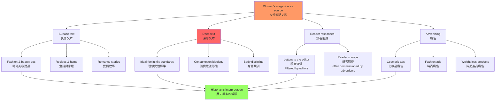
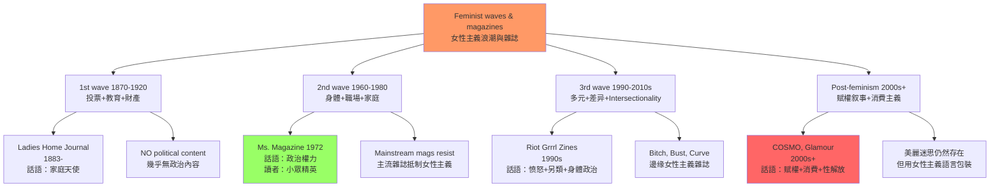
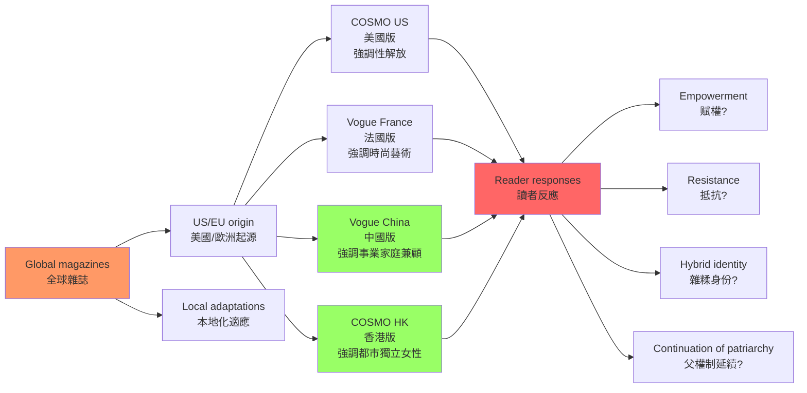
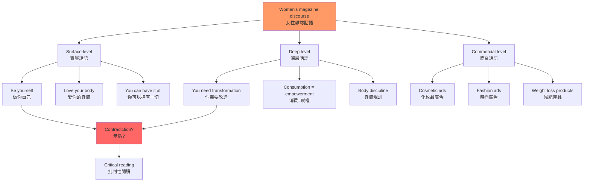
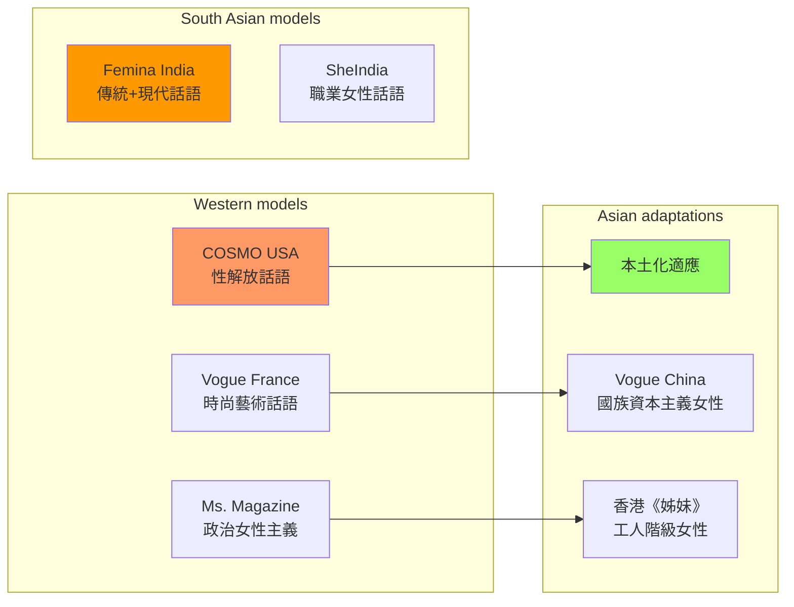
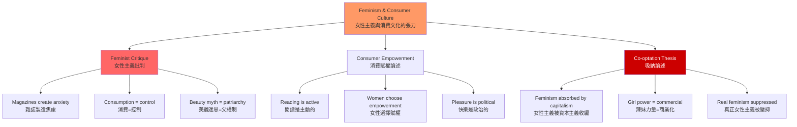
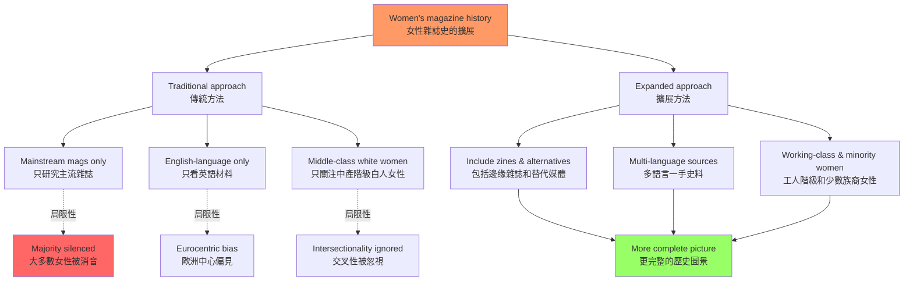

# HIST2232 女性雜誌史 / Women's Magazines as History

**Instructor**: Elizabeth LaCouture
**Department**: History, HKU
**Official source**: [HKU History Course Description](https://history.hku.hk/ug_cd/)
**Style**: research-based — 犀利、聚焦消費文化與女性身體政治的歷史交織

---

## 問題 1：這個領域所有專家共享的 5 個核心心智模型是什麼？

### 1. 消費文化與女性身份建構（Consumer Culture and the Construction of Female Identity）

**專家如何思考**: 女性雜誌從 18 世紀 Ladies Home Journal 到 21 世紀的 Cosmopolitan，建構了一種以消費為核心的「女性特質」（femininity）。學者 **Kathleen K.разд** 在 *The Cult of Sentiment* 中論證：女性雜誌不僅反映社會，還主動建構了什麼是「理想女性」——穿什麼衣服、怎麼減肥、怎麼取悅伴侶。學者 **Joanne Hollows** 等人指出：雜誌中的女性雜誌話語是意識形態工具，它告訴女性「你可以通過消費，成為更好的自己」。

- **典型學者**: **Joanne Hollows** — *Femininity, Feminism and the Women's Magazine* (2000); **Roland Marchand** — *Advertising the American Dream* (1985)
- **驗證案例**: 1920 年代美國現代女性雜誌（Cosmopolitan, Ladies Home Journal）推出「時尚減肥」專欄，同時大力推銷減肥藥物和緊身胸衣——雜誌同時扮演了「製造焦慮」和「提供解決方案」的雙重角色

### 2. 女性雜誌作為史料（Women's Magazines as Historical Sources）

**專家如何思考**: 女性雜誌是歷史學家理解普通女性日常生活的最重要史料之一。學者 **Margaret Beetham** 在 *A Magazine of Her Own?* (1996) 中強調：女性雜誌是「双重文本」（double text）——表面是時尚和娛樂，深層是意識形態和權力關係。

- **典型學者**: **Margaret Beetham** — *A Magazine of Her Own?* (1996); **Beryl Gilroy** — *Steam Laundries* (1979, 2003)
- **驗證案例**: 香港 1960-70 年代的《妇女杂志》披露了工廠女工的實際生活——低工資、長工時、家庭暴力，這些内容在官方檔案和男性主導的新聞中幾乎看不到

### 3. 女性主義浪潮與雜誌話語的轉型（Waves of Feminism and Magazine Discourse）

**專家如何思考**: 三波女性主義浪潮（第一波：1870-1920；第二波：1960-1980；第三波：1990-2010）都在女性雜誌話語中留下了深刻印記。學者 **Angela McRobbie** 研究當代少女雜誌（teen magazines），發現即使在女性主義話語普及的時代，雜誌仍然在「赋權」（empowerment）和「順從」（subjugation）之間維持微妙的平衡。

- **典型學者**: **Angela McRobbie** — *The Aftermath of Feminism* (2009); ** bell hooks** — *Feminist Theory: From Margin to Center* (1984)
- **驗證案例**: 1970 年代的 Ms. Magazine（由 Gloria Steinem 創辦，1972） vs 同時代的 Cosmo——兩者都在宣稱「女性赋權」，但 Ms. 的赋權是政治權力，COSMO 的赋權是消費和性魅力

### 4. 全球化的雜誌話語與在地抵抗（Global Magazine Discourse and Local Resistance）

**專家如何思考**: 全球化浪潮中，女性雜誌話語從歐美向全球擴散——但這種擴散並非無處不在的「文化帝國主義」，而是與在地文化產生複雜的協商和抵抗。學者 **Joanna Lwang** 等人研究香港和上海的雜誌文化，指出 Hong Kong 女性雜誌在全球化的同時保留了獨特的「華人女性特質」話語。

- **典型學者**: **Joanna Lwang** — *Chinese Women and the Reshaping of Modern Femininity* (2018); **Sheryl WuDunn** — *Half the Sky* (2009)
- **驗證案例**: 1980-90 年代香港本土女性雜誌（如《時尚芭莎》的香港版 vs 本土《姐妹））在全球化和本土化之間的話語競爭——全球化版本強調「獨立職業女性」，本土版本強調「傳統賢妻良母」

### 5. 身體政治與雜誌规训（Body Politics and Magazine Discipline）

**專家如何思考**: 女性雜誌是「身體規訓」（body discipline）的核心工具——它們告訴女性：減肥、美白、整形，是每個「自尊自愛」的女性應該追求的目標。學者 **Susan Bordo** 在 *Unbearable Weight: Feminism, Western Culture, and the Body* (1993) 中以福柯的「规训社會」（disciplinary society）框架分析女性雜誌對女性身體的控制。

- **典型學者**: **Susan Bordo** — *Unbearable Weight* (1993); **Naomi Wolf** — *The Beauty Myth* (1991); **Kirin N. Mirchandani** — *Policing the Body* (2006)
- **驗證案例**: 1920 年代美國雜誌的平均女性圖片體重 vs 1990 年代「超模」時代的體重標準 vs 2010 年代的「健身文化」——雜誌不斷更新「理想女性體型」的標準，每次更新都製造新的焦慮和新的產品市場

---

## 問題 2：這個領域 3 個最根本的分歧點是什麼？

### 分歧 1：女性雜誌——女性主義工具 vs 父權制幫凶？
**核心問題**: 女性雜誌是解放女性意識的工具，還是强化父權審美標準的幫凶？

- **學派A（女性主義批判）**: Naomi Wolf (*The Beauty Myth*, 1991) 和 Susan Bordo (*Unbearable Weight*, 1993) 等學者認為，女性雜誌是「美麗迷思」的載體——它們通過製造對女性身體的焦慮，創造了一個價值數十億美元的減肥、化枚品和整形市場，实质上是父權社會控制女性身體的工具。
- **學派B（赋權論述）**: **Angela McRobbie** 和其他学者指出，當代女性雜誌（尤其是 1990 年代後的雜誌）已經吸納了女性主義话語，女性被呈现為「性感的消費者」（sexual consumer）和「自主的抉擇者」（choice-maker）——這種「赋權叙事」事實上允許女性主義和消費主義的共存。
- **驗證**: 1920 年代的 Ladies Home Journal vs 1972 年的 Ms. Magazine vs 2020 年的 COSMO——同一時期同一類雜誌同時存在「解放」和「规训」兩種話語，很難簡單地歸類為「好」或「壞」

### 分歧 2：全球化——文化帝國主義 vs 雜糅文化？
**核心問題**: 西方女性雜誌（如 COSMO、Vogue）在全球的擴張是「文化帝國主義」，還是與在地文化產生「雜糅」（hybridity）的過程？

- **學派A（帝國主義批判）**: **Herbert Schiller** (*Mass Communications and American Empire*, 1969) 和 **Edward Said** (*Orientalism*, 1978) 的文化帝國主義理論認為，西方女性雜誌的全球化是美國/歐洲文化霸權的延伸，将歐美白人女性的審美標準和生活方式强加於非西方女性。
- **學派B（後殖民雜糅）**: **Homi Bhabha** (*The Location of Culture*, 1994) 的雜糅理論認為，任何文化接觸都是雙向的——當印度女性閱讀《COSMO》時，她們並不是被動接受，而是根據自己的文化語境進行批判性挪用（critical appropriation）。
- **驗證**: 印度雜誌 Femina 和女性的本地化版本展示了全球化雜誌話語如何在印度語境中被「翻譯」——有時强化了印度傳統女性特質，有時又引入了西方女性主義元素

### 分歧 3：史料價值——主流雜誌 vs 邊缘 Zines？
**核心問題**: 歷史學家應該研究主流女性雜誌（如 COSMO、Vogue）還是邊缘女性 Zines（如 Riot Grrrl movement, 1990s）？

- **學派A（主流文化史）**: **Margaret Beetham** 等學者認為，主流女性雜誌因為讀者群龐大、流通範圍廣，是理解「普通女性」日常生活最可靠的史料來源。
- **學派B（底層女性史）**: **bell hooks** 等學者認為，主流女性雜誌主要反映中產階級白人女性的經驗，黑人女性、工人階級女性、少數族裔女性的聲音需要從邊缘 Zines、口述歷史和社區出版物中尋找。
- **驗證**: 1990 年代 Riot Grrrl 運動的 Zines（如 *Jinty* 和 *Girl Germs*）提供了主流女性雜誌中從不出現的工人階級少女、黑人少女和酷兒少女的聲音

---

## 問題 3：10 個區分真實理解 vs 死記硬背的深度問題

1. **消費文化與女性身份建構**的核心機制是什麼？雜誌如何通過「焦慮製造 + 產品推銷」的循環，控制女性的身體和消費行為？這種機制與當代社交媒體的「網紅經濟」有什麼結構性相似之處？
2. 女性雜誌作為「双重文本」（double text）——請分析一本具體雜誌（如《COSMOPOLITAN》中文版或《時尚芭莎》）的表層話語（時尚、美容）和深層意識形態（女性特質的標準化）。
3. 第一波女性主義（1870-1920）的核心訴求（投票權、教育權、財產權）與當時主流女性雜誌的話語之間是什麼關係？雜誌是支持還是反對女性主義運動？
4. Angela McRobbie 的「女性主義被吸納」（feminism co-opted）理論如何解釋 1990 年代後女性雜誌的「赋權叙事」？這種叙事與真正的女性主義政治有何差異？
5. **香港女性雜誌的特殊性**：1980-90 年代香港作為英國殖民地和華人社會的雙重身份，如何塑造了香港女性雜誌話語的獨特形態？這種話語與同時期台灣或內地女性雜誌有什麼差異？
6. **身體規訓**的歷史變遷：比較 1920 年代（Flapper 時期）、1960 年代（Mod 時期）、1990 年代（超模時期）和 2010 年代（健身文化時期）女性雜誌對「理想女性體型」的定義。這種標準的演變是「進步」還是「换湯不换藥」？
7. **史料批判**：如何分析女性雜誌的「廣告-編輯混合內容」（advertorial）？雜誌的編輯話語與廣告話語之間的界線在哪裡？這種混合如何影響歷史學家對雜誌史料價值的判斷？
8. 比較 **bell hooks** 的「從边缘到中心」女性主義和 **Angela McRobbie** 的「後女性主義」理論。這兩種框架如何影響我們對女性雜誌話語的分析？
9. 如果你是 1970 年 Ms. Magazine 的編輯，面對「女性主義政治」vs「女性消費者市場」的矛盾，你會如何處理？這種矛盾如何影響了女性主義運動的組織策略？
10. **跨文化比較**：比較香港（1970-80 年代工廠女工雜誌）、台灣（1990 年代《她》的女性主義）和中國内地（2000 年代《悅己》的消費女性主義）三個華人社會女性雜誌話語的差異，背後的社會結構差異是什麼？

---

# 核心心智模型深化（中英對照）

## 1. 消費文化與女性身份建構（Consumer Culture and Female Identity）

### 1.1 Bilingual 概念對照
| 英文 | 中文 | 歷史含義 | 具體案例 |
|---|---|---|---|
| Consumer femininity | 消費女性特質 | 消費作為女性身份的核心 | 雜誌廣告、減肥產品 |
| The beauty myth | 美麗迷思 | 對女性身體的社會控制 | 超模標準 |
| Advertising-surgery complex | 廣告-整形複合體 | 雜誌+整形醫生的商業聯盟 | 化妝品+整形廣告 |
| Self-improvement discourse | 自我提升話語 | 永遠不夠好的女性焦慮 | 「做更好的自己」 |

### 1.2 史料與考據
- **一手史料**: Ladies Home Journal (1883-)、COSMOPOLITAN (1886-)、Ms. Magazine (1972-)、Riot Grrrl zines (1990s)、香港《姐妹》雜誌（1960-80 年代）
- **關鍵學者**: **Kathleen K. Roared** — *The Cult of Sentiment*; **Joanne Hollows** — *Femininity, Feminism and the Women's Magazine* (2000); **Margaret Beetham** — *A Magazine of Her Own?* (1996)
- **史料批判**: 雜誌廣告和編輯內容往往難以區分；雜誌的讀者來信（letters to the editor）是理解讀者反應的重要窗口

### 1.3 犀利觀察
女性雜誌最厲害的地方不是告訴你「你要變漂亮」，而是告訴你「你本來不夠好，所以需要這些產品」——然後讓你心甘情願地掏錢買那些其實改變不了你什麼的東西。

1920 年代的現代女性雜誌告訴你：「你要抽菸、穿短裙、減肥，才能成為現代女性」——但到了 1950 年代，同一批雜誌告訴你：「你要做賢妻良母、穿高跟鞋、化妝打扮，才能成為快樂的家庭女性」。到了 2020 年代，雜誌說：「你可以『拥有一切』——同時做 CEO 和母親，但要維持模特身材」。

所以你看出來了嗎？**每個時代的「理想女性」都不一樣，但有一點永遠一樣：女性永遠需要購買更多東西才能達到那個標準**。這就是女性雜誌的核心商業邏輯。

### 1.4 Deep test question
- **Q1**: 從福柯「规训社會」（disciplinary society）的角度，分析女性雜誌如何通過「正常化」（normalization）技術——定義什麼是「正常體重」「正常護膚程序」——來控制女性的身體和行為。
- **Q2**: 比較 1920 年代和 2020 年代女性雜誌的「減肥話語」，兩者的商業模式有何不同？1920 年代減肥藥物 vs 2020 年代健身應用程式（App）的差異是什麼？
- **Q3**: 從政治經濟學角度，女性雜誌的廣告收入結構如何決定了編輯話語的內容？當廣告商（化枚品公司、減肥公司、時尚品牌）是雜誌的主要收入來源時，編輯話語的獨立性是否可能？

### 1.5 圖解
```mermaid
graph LR
    A[Women's magazines<br/>女性雜誌] --> B[Creates anxiety<br/>製造焦慮]
    A --> C[Defines "ideal woman"<br/>定義理想女性]
    A --> D[Offers solutions<br/>提供「解決方案」]
    
    B --> E[You are not thin enough<br/>你不够瘦]
    B --> F[Your skin is not perfect<br/>你的皮膚不够好]
    B --> G[You need to please men<br/>你需要取悅男性]
    
    C --> H[1920s: Flapper<br/>1920年代：摩登女郞]
    C --> I[1950s: Housewife<br/>1950年代：賢妻良母]
    C --> J[1990s: Super model<br/>1990年代：超模]
    C --> K[2020s: Workmom<br/>2020年代：職業母親]
    
    D --> L[Buy diet pills<br/>購買減肥藥]
    D --> M[Buy cosmetics<br/>購買化枚品]
    D --> N[Buy fashion<br/>購買時尚]
    D --> O[Buy gym membership<br/>購買健身會員]
    
    L --> A
    M --> A
    N --> A
    O --> A
    
    style A fill:#f96
    style B fill:#f66
    style L fill:#9f6
    style M fill:#9f6
```

---

## 2. 女性雜誌作為史料（Women's Magazines as Historical Sources）

### 2.1 Bilingual 概念對照
| 英文 | 中文 | 歷史含義 | 史料價值 |
|---|---|---|---|
| Double text | 雙重文本 | 表面+深層話語 | 意識形態分析 |
| Letters to editor | 讀者來信 | 普通女性聲音 | 口述史輔助 |
| Advertorial | 廣告-編輯混合 | 商業+意識形態 | 批判性閱讀 |
| Popular print culture | 大眾印刷文化 | 普通人的閱讀 | 填補檔案空白 |

### 2.2 史料與考據
- **一手史料**: 女性雜誌原刊（不同年代的完整期刊）；讀者來信檔案；編輯會議記錄（少數）；廣告合約
- **關鍵學者**: **Margaret Beetham** — *A Magazine of Her Own?* (1996); **Beatrice Nichols** — *Women in the Fine Arts* (1904); **Michele White** — *The Body and the Screen* (2006)
- **史料批判**: 女性雜誌的「讀者來信」往往是經過編輯筛选的，可能並不代表普通讀者的真實看法

### 2.3 犀利觀察
歷史學家長期忽視女性雜誌作為史料，因為他們認為這是「輕浮的消費品」而非「嚴肅的政治文件」——但這種偏見本身就是歷史偏見的一部分。

事實上，女性雜誌是理解普通女性日常生活的最重要窗口：她們關心什麼？她們焦慮什麼？她們閱讀什麼？她們購買什麼？這些「瑣碎」的問題，比任何政治宣言都更能揭示一個時代女性的真實生活。

就像你要了解今天香港年輕女性的想法，你不會只看立法會辯論，你也會看小紅書（Xiaohongshu）和 Instagram——同樣的，歷史學家要了解過去的女性，也必須看女性雜誌。

### 2.4 Deep test question
- **Q1**: 比較不同類型的女性雜誌史料：《COSMOPOLITAN》的編輯話語 vs 讀者來信 vs 廣告內容——三者之間存在什麼緊張關係？
- **Q2**: 女性雜誌記載的「讀者來信」是否可信？這些來信的選擇過程（editor selection）如何影響了我們今天所看到的历史記錄？
- **Q3**: 如何用女性雜誌來研究工人階級女性和少數族裔女性的歷史？她們在主流女性雜誌中的代表性嚴重不足——這種「缺席」本身就是重要的歷史證據，如何分析這種「缺席」？

### 2.5 圖解


---

## 3. 女性主義浪潮與雜誌話語的轉型（Waves of Feminism and Magazine Discourse）

### 3.1 Bilingual 概念對照
| 英文 | 中文 | 歷史含義 | 雜誌代表 |
|---|---|---|---|
| First wave feminism | 第一波女性主義 | 1870-1920，投票權 | Ladies Home Journal |
| Second wave feminism | 第二波女性主義 | 1960-1980，身體政治 | Ms. Magazine 1972 |
| Third wave feminism | 第三波女性主義 | 1990-2010s，多元身份 | Bust, Bitch |
| Post-feminism | 後女性主義 | 2000s後，赋權叙事 | COSMO, Glamour |

### 3.2 史料與考據
- **一手史料**: Ms. Magazine 創刊號（1972）、Gloria Steinem 的文章和演說、Riot Grrrl Zines (1991-1998)
- **關鍵學者**: **bell hooks** — *Feminist Theory* (1984); **Angela McRobbie** — *The Aftermath of Feminism* (2009); **Rebecca Walker** — *To Be Real* (1995)
- **史料批判**: 女性主義雜誌的意識形態往往比主流女性雜誌更清晰，但也可能存在「内部精英主義」——忽視工人階級和少數族裔女性

### 3.3 犀利觀察
三波女性主義對女性雜誌話語的影響，歸根結底是一個問題：**女性主義能不能在消費文化中存活？**

第一波女性主義（1870-1920）：女性參與選舉運動，女性雜誌幾乎不涉及政治，專注於「家庭天使」話語。

第二波女性主義（1960-1980）：Ms. Magazine 創辦（1972），明確將女性主義政治帶入主流出版——但 Ms. 的讀者始終是小眾，主流女性雜誌繼續销售「美麗迷思」。

第三波女性主義（1990-2010s）：「女性主義被消費主義收編」的時代——當連 COSMO 都在宣稱「女性赋權」和「性解放」，「女性主義」這個詞還有多少實質內容？

### 3.4 Deep test question
- **Q1**: 比較 Ms. Magazine（1972）和 COSMOPOLITAN（1965-）的創刊號話語。這兩種「女性主義」在本質上有什麼差異？
- **Q2**: 1990 年代「riot grrrl」運動的 Zines 如何同時吸納了女性主義和另類搖滾文化？這種「雜糅」是女性主義的進步還是倒退？
- **Q3**: 從組織政治學角度，分析 1970 年代 Ms. Magazine 的財務困境（廣告商撤離）如何反映了女性主義政治和商業媒體之間的結構性張力。

### 3.5 圖解


---

## 4. 全球化的雜誌話語與在地抵抗（Globalization and Local Resistance）

### 4.1 Bilingual 概念對照
| 英文 | 中文 | 歷史含義 | 具體案例 |
|---|---|---|---|
| Cultural imperialism | 文化帝國主義 | 西方文化霸權的擴張 | COSMO全球化 |
| Hybridity | 雜糅性 | 文化的混合與協商 | 本土化翻譯 |
| Glocalization | 全球在地化 | 全球化+在地化同步 | 《COSMO》中國版 |
| Critical appropriation | 批判性挪用 | 拒絕被動接受 | 讀者的批判閱讀 |

### 4.2 史料與考據
- **一手史料**: 《COSMOPOLITAN》中文版（1999-）、《Vogue》中國版、《時尚芭莎》中國版、香港本土《姊妹》杂志（1963-）
- **關鍵學者**: **Joanna Lwang** — *Chinese Women and the Reshaping of Modern Femininity* (2018); **Rachel He Lin** — *Women and the Media in China* (2016)
- **史料批判**: 女性雜誌的「在地化」往往是經過編輯決策的，不等於普通女性的真實接受情況

### 4.3 犀利觀察
很多人把全球化女性雜誌等同於「文化帝國主義」——認為西方雜誌在中國、香港的擴張，就是要把中國女性變成「美國消費者的複製品」。這種說法過於簡單。

現實是：當《COSMOPOLITAN》在 1999 年進入中國市場時，它並不是簡單地複制美國版本，而是經過了大规模的「本地化」——中國版的 COSMO 強調「賢良淑德」「孝道」和「事業兼顧」，這些話語與中國傳統文化有更直接的共鳴，而不是簡單的西方話語輸入。

所以全球化雜誌話語的真正過程是**協商與雜糅**——不是帝國主義的單向輸出，而是全球話語在本地語境中的翻譯、改造和抵抗。

### 4.4 Deep test question
- **Q1**: 比較《COSMOPOLITAN》中國版（1999）和香港版（1980-90s）的話語差異。這些差異如何反映了中國和香港不同的政治和社會語境？
- **Q2**: 從「全球在地化」（glocalization）角度，分析為什麼很多國際女性雜誌在進入非西方市場時，會聘請當地女性擔任編輯？這種編輯本地化如何影響了雜誌的話語內容？
- **Q3**: 批判性地分析「文化帝國主義」這一概念在解釋女性雜誌全球化時的優點和局限性。什麼類型的歷史證據可以支持或反駁這一框架？

### 4.5 圖解


---

## 5. 身體政治與雜誌规训（Body Politics and Magazine Discipline）

### 5.1 Bilingual 概念對照
| 英文 | 中文 | 歷史含義 | 當代表現 |
|---|---|---|---|
| Body discipline | 身體規訓 | 福柯式规训技術 | 減肥、整形、健身 |
| Beauty myth | 美麗迷思 | 對女性身體的社會控制 | 超模、網紅 |
| Intersectionality | 交叉性 | 種族+階級+性別 | 黑人女性的身體政治 |
| Choice feminism | 選擇女性主義 | 消費作為「赋權」 | 化妝=女性主義? |

### 5.2 史料與考據
- **一手史料**: 不同年代女性雜誌的減肥專欄、化枚品廣告、女性内衣廣告、整形廣告
- **關鍵學者**: **Susan Bordo** — *Unbearable Weight* (1993); **Naomi Wolf** — *The Beauty Myth* (1991); **Roland Marchand** — *Advertising the American Dream* (1985)
- **史料批判**: 女性雜誌中的減肥和美麗話語往往聲稱「科學根據」，但這些「根據」往往是化枚品公司和減肥產業資助的研究——存在明顯的利益衝突

### 5.3 犀利觀察
美麗迷思最可怕的地方不是「告訴你不夠好」，而是讓你**自己主動要求被控制**。

減肥藥物、整形手術、健身應用程式——這些產品和服務在女性雜誌中被呈現為「女性赋權的選擇」和「自我提升的權利」。當女性為了自己的「身體自主權」去抽脂或购买減肥茶時，她們以為這是「自由選擇」——但實際上，這個「選擇」是在幾十年雜誌話語和數十億美元廣告資金的影響下形成的。

福柯說得好：最好的控制不是外部强制的，是讓你**自己成為自己的監獄看守**。女性雜誌對身體的规训，就是這種「最佳控制」的典範。

### 5.4 Deep test question
- **Q1**: 從福柯「全景監獄」（panopticon）的角度，分析女性雜誌如何讓女性「自我規訓」——即使在沒有外部强制的情况下，她們也會自覺地控制自己的飲食、穿著和身體。
- **Q2**: 比較 Naomi Wolf（1991）和 Susan Bordo（1993）對「美麗迷思」的分析框架。Wolf 強調「美麗是政治」，Bordo 強調「美麗是规训」——這兩種框架的差異如何影響了女性主義的實踐策略？
- **Q3**: 從「選擇女性主義」（choice feminism）的爭論角度，分析當代女性雜誌中的「女性可以選擇穿高跟鞋、化妝、減肥，因此這些選擇是赋權的」這一論述。這種論述忽視了什麼結構性因素？

### 5.5 圖解
```mermaid
graph TD
    A[Body politics in magazines<br/>雜誌中的身體政治] --> B[The Beauty Myth<br/>美麗迷思]
    A --> C[Discipline technologies<br/>规训技術]
    A --> D[Intersectional perspectives<br/>交叉性視角]
    
    B --> B1[1890s: Corsets<br/>1890年代：緊身胸衣<br/> waist=16 inches]
    B --> B2[1920s: Flapper slender<br/>1920年代：輕盈身型]
    B --> B3[1950s: Hourglass<br/>1950年代：沙漏曲線]
    B --> B4[1990s: Supermodel<br/>1990年代：超模病態瘦]
    B --> B5[2020s: Fitness<br/>2020年代：健身肌肉型]
    
    C --> C1[Magazine images<br/>雜誌圖片<br/>Normalize thinness]
    C --> C2[Advertising<br/>廣告<br/>Products = solutions]
    C --> C3[Expert articles<br/>專家文章<br/>Dieticians, doctors]
    C --> C4[Reader testimonials<br/>讀者見證<br/>"Before & After"]
    
    D --> D1[White women's bodies<br/>白人女性身體<br/>historically normative]
    D --> D2[Black women's hair<br/>黑人女性頭髮<br/>"nappy vs. straight"]
    D --> D3[Asian women's skin<br/>亞洲女性皮膚<br/>Whitening products]
    
    style A fill:#f96
    style B fill:#f66
    style C1 fill:#9f6
    style D fill:#c00,color:#fff
```

---

# 深度自測問題詳解

## Q1 詳解：消費文化與女性身份建構的核心機制
**核心答案**: 女性雜誌製造「焦慮 + 解決方案」循環的核心機制可以概括為四個步驟：① **問題製造**——通過編輯內容和圖片定義「理想女性」的標準，使讀者感到自己不符合標準；② **產品推銷**——廣告客戶（減肥公司、化枚品公司、時尚品牌）提供「解決方案」；③ **循環强化**——即使讀者购买了產品，雜誌仍然會更新「理想標準」，使讀者需要持續消費；④ **意識形態包裝**——消費被包裝為「女性赋權」和「自我提升」，掩蓋其商業本質。

這個機制與當代社交媒體「網紅經濟」的結構驚人相似：網紅製造生活方式焦慮，然後通過推銷產品獲利——只不過女性雜誌是這個模式的「第一代」。

---

## Q2 詳解：雙重文本分析
**核心答案**: 以《COSMOPOLITAN》中文版為例：

**表層話語**（編輯內容）：「自信的女性最美」「獨立、愛自己」「追求事業與生活的平衡」——這些都是表面上看起來赋權的話語。

**深層意識形態**（隱藏話語）：①「美麗仍然是女性最重要的資本」——即使宣稱「内在美」，雜誌仍然充斥着化枚品和整形廣告；②「女性需要不斷提升自己」——這意味着她們「本來不够好」；③「消费可以解决焦慮」——每一個「問題」都有對應的「產品」。

這種雙重性正是女性雜誌作為「雙重文本」的意義：**表面話語和深層意識形態之間存在系統性的鴻溝**，批判性閱讀就是要揭開這個鴻溝。

---

## Q3 詳解：身體規訓的歷史變遷
**核心答案**:
- **1920 年代 Flapper**：緊身胸衣放棄，但「輕盈」成為新的理想——平均女性體重比 1900 年代輕 10-15 磅。時尚雜誌告訴女性：「抽菸、喝酒、短裙」是現代性的標誌。
- **1950 年代 Hourglass**：瑪麗蓮·夢露的「沙漏曲線」成為理想——豐胸、細腰、豐臀。雜誌話語是「回歸家庭」的意識形態，女性被鼓勵成為「快樂的家庭主婦」。
- **1990 年代超模**：Kate Moss 的「病態瘦」（heroin chic）成為主流——身高 5'7"、體重 100 磅。這導致了少女厭食症的大幅增加，並催生了 1990 年代第二波「美麗迷思」批判（Naomi Wolf, 1991）。
- **2020 年代健身文化**：Kim Kardashian 的「沙漏身材」和 Instagram 健身網紅——身體被重新定義為「可雕塑的健身項目」，減肥變成了「健身」和「健康」——但對女性身體的控制絲毫未減。

結論：**標準一直在變，但控制永遠不變**。

---

# 5 個 Mermaid 圖解

## Diagram 1: 女性雜誌話語的歷史演變


## Diagram 2: 女性雜誌話語的意識形態分析框架


## Diagram 3: 全球女性雜誌話語的地圖


## Diagram 4: 女性主義與消費文化的張力


## Diagram 5: 從邊缘到中心——女性雜誌史的擴展


---

# 總結 / Closing 5-Point Deep Insights

1. **女性雜誌是意識形態的載體，不是中性的信息傳播**：每一頁的內容——從時尚圖片到減肥建議，從愛情故事到政治評論——都在傳遞關於「什麼是女性」的意識形態信息。

2. **美麗迷思的歷史證明：標準一直在變，但對女性身體的控制永遠不變**：從 1890 年代的緊身胸衣到 2020 年代的健身文化，每個時代的「理想女性體型」都不同，但每個標準都由商業利益驅動。

3. **女性主義與消費文化的關係是「吸納」而非「替代」**：當 COSMO 開始宣稱「女性赋權」，這並不意味著女性主義的勝利——它意味著消費主義成功地將女性主義語言收編為另一種銷售工具。

4. **女性雜誌作為史料的價值在於填補普通女性日常生活的空白**：官方檔案和傳統新聞很少記載普通女性的想法和感受，但女性雜誌——尤其是讀者來信和調查——提供了這種窗口。

5. **全球化女性雜誌話語是「協商」不是「帝國主義」**：當西方女性雜誌進入非西方市場，它們不是簡單地輸出文化霸權，而是在本地語境中經歷翻譯、改造和抵抗——這種複雜性正是全球女性雜誌史最迷人的地方。

**自學建議**: 配合 Margaret Beetham 的 *A Magazine of Her Own?* + Angela McRobbie 的 *The Aftermath of Feminism* + Joanna Lwang 的 *Chinese Women and Femininity*，輸出讀書筆記到 `06_Reading_Notes/`。
