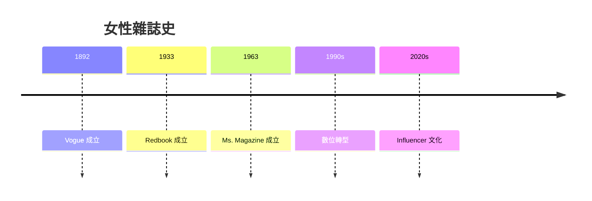
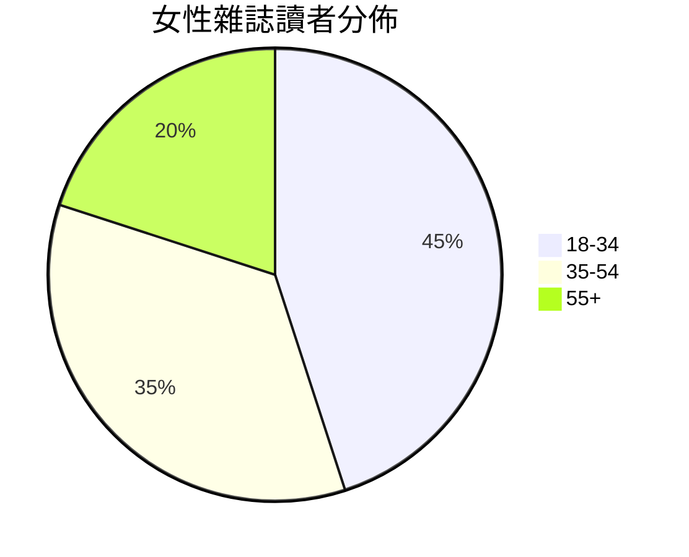

# HIST2232 女性雜誌史 / Women's Magazines as History (6 credits)

**Instructor**: Elizabeth LaCouture
**Department**: History, HKU  
**Official source**: [HKU History Course Description 2024-25](https://history.hku.hk/wp-content/uploads/2024/07/HIST-2425.pdf)
**Style**: 袁騰飛式 — 犀利、聚焦女性雜誌點解塑造女性身份

---

## 問題 1：這個領域所有專家共享的 5 個核心心智模型

### 心智模型 1：女性雜誌作爲社會史文本
學者 **Martha Olcott** 研究：女性雜誌揭示時代女性角色期待、消費者文化。

學者 **Duncan McClar** 分析：女性雜誌與消費主義興起。

- Ladies' Home Journal (1883)
- Vogue (1892)
- Redbook (1933)

### 心智模型 2：女性話語與商業利益
學者 **Jennifer Scanlon** (*Bad and Dangerous*, 2020) 研究：女性雜誌往往與商業利益綑綁——女性 empowerment 商品化。

學者 **Angela McRobbie** 分析：女性雜誌塑造「理想女性」。

### 心智模型 3：女性雜誌與政治
學者 **Patricia Sullivan** 研究：女性雜誌政治功能——女性參政動員。

學者 **Anne M. Fox** 分析：女性雜誌與婦女運動。

### 心智模型 4：全球女性雜誌比較
學者 **Barbara J. Winter** 研究：女性雜誌全球差異——文化特殊性。

學者 **Joey Liao** 分析：中國女性雜誌歷史。

### 心智模型 5：數位時代女性媒體
學者 **Sarah Banet-Weiser** (*AuthenticTM*, 2018) 研究：Influencer 文化與女性媒體轉型。

學者 **Crystal Abidin** 分析：微網紅與女性觀眾。

---

## 問題 2：3 個根本分歧

### 分歧 1：女性雜誌——賦權定剝削？
- **A 方**：賦權
  - 女性聲音、資訊
- **B 方**：剝削
  - 消費主義、身體焦慮

### 分歧 2：女性雜誌——反映定塑造女性？
- **A 方**：反映
  - 時代女性願望
- **B 方**：塑造
  - 創造願望

### 分歧 3：女性雜誌——全球統一定文化差異？
- **A 方**：全球統一
  - 全球化女性標準
- **B 方**：文化差異
  - 本土適應

---

## 問題 3：10 個深度問題

1. 如果你去 1920 年做女性雜誌編輯，你最想放邊個內容？
2. 點解女性雜誌往往被學術界忽視？
3. 如果你是歷史學家，點樣研究女性雜誌？
4. 點解女性雜誌身體意象批評持續？
5. 如果你去 2050 年，女性媒體會點樣？
6. 點解女性雜誌與消費主義如此捆綁？
7. 女性雜誌點解塑造女性政治參與？
8. 如果你是女性主義者，你會點樣批評女性雜誌？
9. 點解中國女性雜誌發展落後西方？
10. 女性雜誌史——點解對理解當下女性身份重要？

---

## 核心心智模型深化

### 1. 女性雜誌歷史



---

## 5 個 Mermaid 圖解

### 📊 Diagram 1: 女性雜誌內容

```mermaid
flowchart TD
    A[女性雜誌] --> B[時尚]
    B --> C[美容}
    A --> D[家庭}
    D --> E[育兒}
    A --> F[政治}
```

### 📊 Diagram 2: 女性雜誌讀者



### 📊 Diagram 3: 女性雜誌與商業

```mermaid
flowchart TD
    A[女性雜誌] --> B[廣告]
    B --> C[商業利益}
    C --> D[女性消費者}
```

### 📊 Diagram 4: 女性雜誌與身體政治

```mermaid
flowchart TD
    A[女性雜誌] --> B[身體標準}
    B --> C[女性焦慮}
    C --> D[消費產品}
```

### 📊 Diagram 5: 數位轉型

```mermaid
flowchart TD
    A[紙質雜誌] --> B[線上平台}
    B --> C[社交媒體}
    C --> D[Influencer}
```

---

## 總結

1. 女性雜誌揭示時代女性期待
2. 女性雜誌商業化批評
3. 女性雜誌政治功能
4. 全球差異與統一張力
5. 數位轉型改變女性媒體

**最後問題**: 如果你去女性雜誌史研究，你最想發現乜嘢？

---
**版權所有 © HKU History Self-Study**
