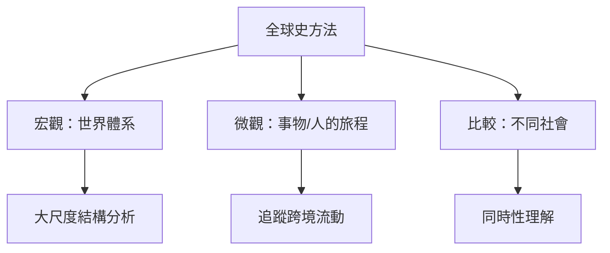
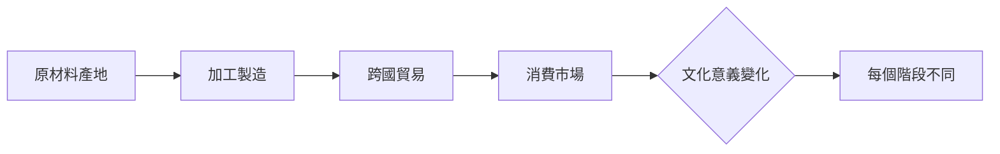
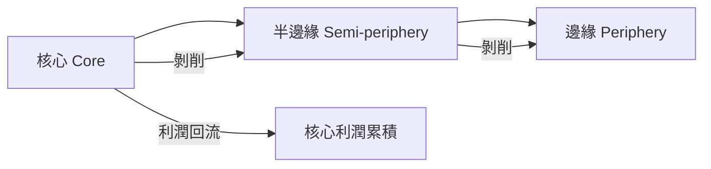
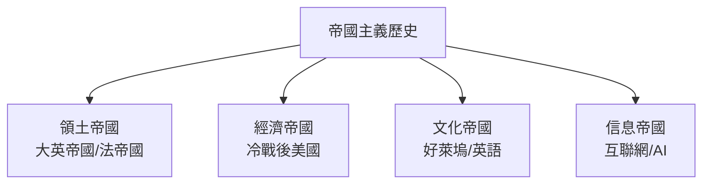
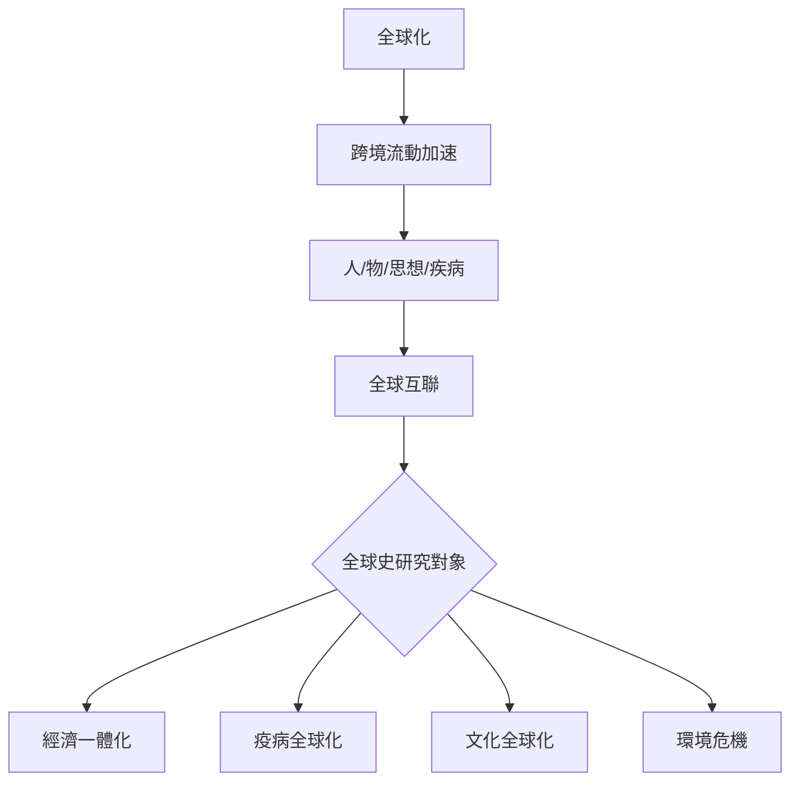
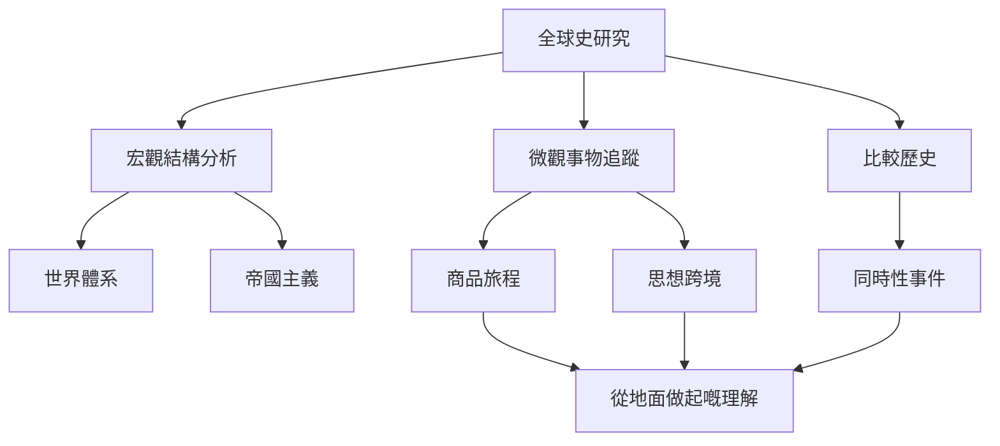
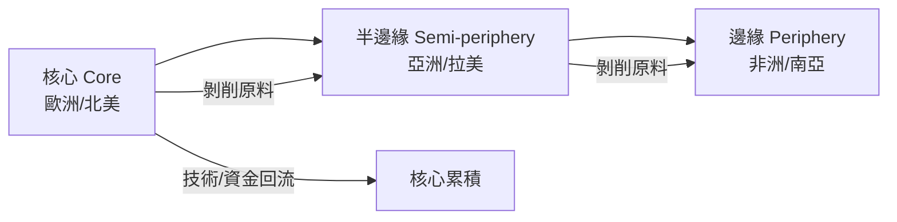
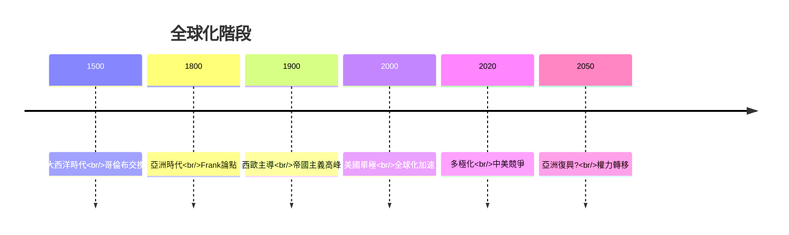
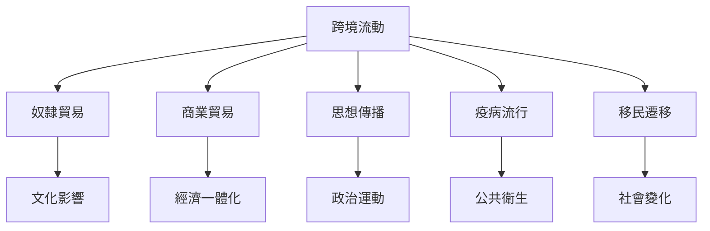
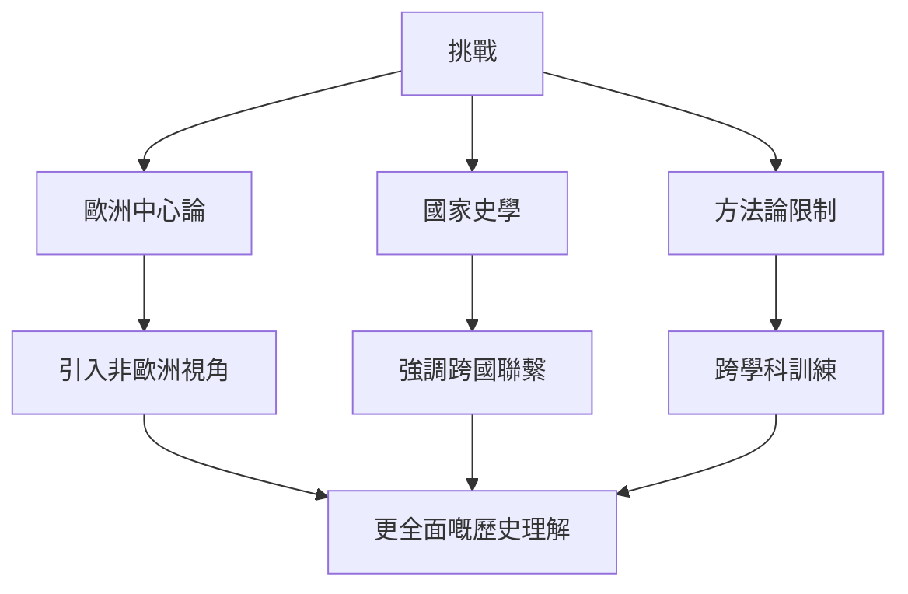

# HIST2233 全球史 / Globalizing History (6 credits)

**Instructor**: Jason Petrulis
**Department**: History, HKU
**Official source**: [HKU History Course Description 2024-25](https://history.hku.hk/wp-content/uploads/2024/07/HIST-2425.pdf)
**Style**: 袁騰飛式 — 犀利、聚焦Bruce Lee、1840年代日本女傭、1920年代天津地氈、17世紀班卓琴——呢啲風馬牛不相及嘅嘢點解都可以係歷史研究對象

---

## 問題 1：這個領域所有專家共享的 5 個核心心智模型

### 心智模型 1：全球史方法——跨邊界追蹤
學者 **Jason Petrulis** (本課程導師) 研究：全球歷史學家追蹤人、事物、資本、觀念、天氣、疾病點樣跨過邊境、海洋、高山。

學者 **Bruce Mazlish** 分析：全球史挑戰國家中心敘事——關注跨國聯繫、比較、總體化。

- Bruce Lee (香港出生→美國發跡) 作為全球史研究對象
- 1920年代天津地氈點解可以出現在波士頓？
- 17世紀班卓琴 (banjo) 點解係非洲樂器？

### 心智模型 2：「聯繫歷史」(Connected Histories)
學者 **Sanjay Subrahmanyam** 研究：聯繫歷史——追蹤跨文化、跨地區嘅歷史聯繫，揭示被國家敘事忽視嘅跨境現象。

學者 **C.A. Bayly** 分析：全球史前驅——早期全球化。

- 奴隸貿易網絡——非洲→美洲→歐洲→非洲
- 香腸貿易——點解意大利香腸擴散到全球？
- 疫病全球化——1918流感、COVID-19

### 心智模型 3：「世界體系分析」vs「亞洲時代」
學者 **Immanuel Wallerstein** 研究：世界體系分析——核心、半邊緣、邊緣結構，呢個框架解釋全球不平等。

學者 **Andre Gunder Frank** 分析：「亞洲時代」——1800年前亞洲經濟總量超過歐洲，挑戰「歐洲例外論」。

- 1500-1800年：亞洲主導全球經濟
- 1800年至今：歐洲/北美主導
- 2050年預測：亞洲再次成為全球經濟重心

### 心智模型 4：「世界史」vs「全球史」差異
學者 **Jerry Bentley** 分析：世界史挑戰歐洲中心論，關注全球總體。

學者 **Stuart Macintyre** 研究：全球史關注跨國聯繫；世界史關注全球總體。

- 宏觀全球史：大尺度時間、空間分析
- 微觀全球史：特定人物、事物的全球旅程

### 心智模型 5：「帝國史」(Imperial History)
學者 **John Darwin** 研究：帝國主義全球擴張塑造現代世界。

學者 **A.G. Hopkins** 分析：帝國史重新發現——帝國從來未消失，只係變形。

- 大英帝國、法帝國、俄羅斯帝國——跨洲帝國
- 美帝國、蘇聯——20世紀帝國主義
- 帝國主義「隱形遺產」——當代國際機構、經濟秩序

---

## 問題 2：3 個根本分歧

### 分歧 1：全球史——新領域定現有領域重包裝？
- **A 方**：新領域創新
  - 方法論創新
  - 跨學科訓練必要
  - 挑戰國家史學傳統
- **B 方**：舊領域重包裝
  - 帝國主義史改名
  - 世界體系理論非新嘢
  - 學術時尚

### 分歧 2：全球史——學術價值定政治正確？
- **A 方**：學術創新
  - 新視角、新方法
  - 揭示被忽視嘅聯繫
- **B 方**：政治正確
  - 忽視國家史複雜性
  - 太過意識形態化

### 分歧 3：全球史——微觀定宏觀？
- **A 方**：微觀
  - 特定商品/人/思想嘅全球旅程
  - 從地面做起
- **B 方**：宏觀
  - 大尺度結構分析
  - 揭示總體模式

---

## 問題 3：10 個深度問題

1. Bruce Lee點解可以成為全球史研究對象？一個香港武打演員點解可以影響全球流行文化？
2. 點解17世紀班卓琴追蹤到非洲起源？一件樂器點解揭示大西洋奴隸貿易史？
3. 如果你去研究1920年代天津地氈點解出現在波士頓，你會發現乜嘢關於全球貿易網絡？
4. 點解世界體系分析仍然有爭議？Wallerstein framework被批評邊啲方面？
5. 如果你去研究COVID-19全球傳播，會發現乜嘢關於疫病史研究嘅重要性？
6. 點解全球史教學咁難？但係又咁重要？
7. 如果你去研究1840年代日本女傭，你會點解全球勞動力流動？
8. 全球史點解挑戰咗以歐洲為中心嘅歷史敘事？但係呢個挑戰係咪成功？
9. 如果你去研究「香腸」嘅全球歷史，你會發現乜嘢令人震驚嘅文化傳播模式？
10. 如果你去2050年，會點解今日全球史研究？呢個領域最大貢獻係乜嘢？

---

## 核心心智模型深化（中英對照）

## 1. 全球史方法論 (Global History Methodology)

### 1.1 Bilingual 概念對照
| 英文概念 | 中英對照 | 歷史含義 | 應用 |
|---|---|---|---|
| Transnational History | 跨國史 | 突破國家邊界 | 跨境網絡分析 |
| Microhistory | 微觀史 | 特定人物/事物的全球旅程 | 從地面做起 |
| Macrohistory | 宏觀史 | 大尺度結構分析 | 帝國主義/世界體系 |
| Connected Histories | 聯繫歷史 | 追蹤跨文化聯繫 | Subrahmanyam |
| World History | 世界史 | 全球總體視角 | Bentley |

### 1.2 史料與考據
- Sanjay Subrahmanyam: Connected Histories (1997)
- C.A. Bayly: The Birth of the Modern World (2004)
- Jason Petrulis: HIST2233 course design

### 1.3 袁騰飛式犀利觀察
全球史最犀利嘅問題：你研究緊嘅係邊個嘅歷史？Bruce Lee——華人？美人？全球人？呢個問題揭示咗身份認同喺全球史入面嘅複雜性。
全球史挑戰「純粹」民族史學——因為歷史上所有嘢都係跨境流動。

### 1.4 Deep test question
- 如果你去研究「香港人」身份嘅全球史，會發現乜嘢跨境聯繫？

### 1.5 圖解

---

## 2. 聯繫歷史 (Connected Histories)

### 1.1 Bilingual 概念對照
| 英文概念 | 中英對照 | 歷史含義 | 案例 |
|---|---|---|---|
| Connected Histories | 聯繫歷史 | 跨文化聯繫 | Subrahmanyam |
| Silk Roads | 絲路 | 古代跨洲貿易 | 張騫/香料 |
| Atlantic Trade | 大西洋貿易 | 三角貿易 | 蔗糖/奴隸 |
| Information Networks | 資訊網絡 | 思想跨境傳播 | 革命思想 |
| Material Culture | 物質文化 | 物件跨境流動 | 天津地氈 |

### 1.2 史料與考據
- Sanjay Subrahmanyam: "Connected Histories" (1997)
- Philip Curtin: Cross-Cultural Trade in World History

### 1.3 袁騰飛式犀利觀察
Sanjay Subrahmanyam最犀利嘅發現：歷史唔應該被國家邊界限制——追蹤一件天津地氈從原料到設計到最終抵達波士頓，可以揭示整個全球貿易網絡。
呢個方法揭示：歷史從來唔係單一國家嘅故事，而係跨境、跨文化、跨階級嘅交織。

### 1.4 Deep test question
- 如果你去追蹤一件日常物品（例如咖啡）嘅全球歷史，會發現乜嘢令人震驚嘅真相？

### 1.5 圖解

---

## 3. 世界體系分析 (World-Systems Analysis)

### 1.1 Bilingual 概念對照
| 英文概念 | 中英對照 | 歷史含義 | 爭議 |
|---|---|---|---|
| Core | 核心 | 發達工業國家 | 西歐/北美 |
| Semi-periphery | 半邊緣 | 快速發展國家 | 亞洲四小龍 |
| Periphery | 邊緣 | 原料出口國 | 非洲/拉美 |
| World-systems | 世界體系 | 全球經濟分工 | Wallerstein |
| Asia's Age | 亞洲時代 | Frank挑戰歐洲例外論 | 1800年前 |

### 1.2 史料與考據
- Immanuel Wallerstein: World-Systems Analysis (1974)
- Andre Gunder Frank: "The Development of Underdevelopment" (1966)
- Critique of world-systems theory

### 1.3 袁騰飛式犀利觀察
Wallerstein最犀利嘅發現：全球經濟唔係平等交換，而係一個剝削結構——核心剝削邊緣。但係 Andre Gunder Frank挑戰：呢個結構並非永恆——1800年前亞洲就係核心。

### 1.4 Deep test question
- 如果你去2050年，全球經濟體系會點樣重構？

### 1.5 圖解

---

## 4. 帝國主義歷史 (Imperial History)

### 1.1 Bilingual 概念對照
| 英文概念 | 中英對照 | 歷史含義 | 爭議 |
|---|---|---|---|
| Imperialism | 帝國主義 | 跨國控制 | 仍然存在？ |
| Empire | 帝國 | 政治實體 | 從未消失 |
| Colonialism | 殖民主義 | 領土佔領 | 冷戰後仍然存在 |
| Neo-imperialism | 新帝國主義 | 經濟控制 | 當代形式 |
| Imperial Legacy | 帝國遺產 | 當代制度根源 | 仍然運作 |

### 1.2 史料與考據
- John Darwin: After Tamerlane (2007)
- A.G. Hopkins: Imperial History and Empire Studies

### 1.3 袁騰飛式犀利觀察
A.G. Hopkins指出：帝國從未真正消失——只係變形：由領土帝國變成經濟帝國、文化帝國、信息帝國。
911事件、伊拉克戰爭、金融危機——呢啲都可以用帝國主義遺產嚟解讀。

### 1.4 Deep test question
- 美國係咪一個帝國？點解或者點解唔係？

### 1.5 圖解

---

## 5. 當代全球史研究

### 1.1 Bilingual 概念對照
| 英文概念 | 中英對照 | 歷史含義 | 當代案例 |
|---|---|---|---|
| COVID-19 | 新冠疫情 | 全球疫病 | 2020年全球大流行 |
| Climate Change | 氣候變化 | 全球環境危機 | 碳排放/冰川融化 |
| Migration | 遷移 | 跨境人口流動 | 歐洲移民危機 |
| Digital Age | 數位時代 | 全球互聯網 | 資訊跨境流動 |
| Inequality | 不平等 | 全球貧富差距 | 1% vs 99% |

### 1.2 史料與考據
- COVID-19全球史研究
- Climate history research
- Digital globalization

### 1.3 袁騰飛式犀利觀察
COVID-19揭示咗全球史研究嘅當代重要性——疫病從來唔係單一國家嘅問題，而係跨境、跨階級、跨政府嘅全球現象。
歷史研究唔只係研究過去，而係理解當下問題嘅必要工具。

### 1.4 Deep test question
- 如果你去研究COVID-19全球傳播史，會發現邊個國家/群體最脆弱？

### 1.5 圖解

---

## 深度自測問題詳解

### 詳解 1: Bruce Lee全球史點解咁有趣？
Bruce Lee出生於香港，在美國發跡——佢嘅武術融合咗詠春、拳擊、空手道、香港街頭搏擊。佢嘅電影影響咗全球流行文化——從好萊塢到尼日利亞。呢個揭示：一個人嘅生命可以承載全球文化交匯。

### 詳解 2: 天津地氈嘅全球旅程揭示咗乜嘢？
天津地氈嘅原材料、染料、圖案、編織技術可能來自中亞、波斯、中國唔同地區——追蹤一件地氈可以揭示整個19世紀全球貿易網絡。

### 詳解 3: 17世紀班卓琴揭示大西洋奴隸貿易？
班卓琴起源於西非——跟住奴隸帶到美洲——演變成美國黑人音樂核心樂器。一件樂器嘅歷史揭示文化跨境傳播同奴隸制嘅文化遺產。

### 詳解 4: 世界體系分析點解仍然重要？
因為佢提供咗一個解釋全球不平等嘅框架——核心剝削邊緣。但係被批評太結構主義，忽略咗能動性。

### 詳解 5: 全球史教學點解咁難？
因為需要跨學科訓練（歷史、地理、人類學、經濟學）、多語言能力（至少英文），仲要有全球意識。

### 詳解 6: 如果你去研究香腸全球化？
意式香腸 (sausage) 扩散到全球——但係每一個地方都改變咗佢——德國香腸、中國臘腸、墨西哥chorizo。呢個揭示文化傳播唔係簡單複製，而係持續創新。

### 詳解 7: 全球史同世界史差異？
世界史關注全球總體（大尺度）；全球史關注跨境聯繫（網絡視角）。兩者互補，唔係競爭。

### 詳解 8: 點解帝國主義研究回歸？
因為冷戰結束後，美國單極時刻結束，新興大國崛起——帝國主義研究提供歷史框架理解當代大國競爭。

### 詳解 9: 全球史點解對理解COVID-19重要？
因為疫病從來唔係單一國家問題——SARS-CoV-2起源、傳播、全球應對，全部都係跨境現象，需要全球史視角。

### 詳解 10: 如果你去2050年，會點解今日全球史研究？
全球史最大貢獻就係揭示歷史唔係單一國家嘅故事——所有歷史都係跨境、跨文化、跨階級嘅交織。

---

## 5 個 Mermaid 圖解

### 📊 Diagram 1: 全球史研究方法

### 📊 Diagram 2: 世界體系結構

### 📊 Diagram 3: 全球化時間尺度

### 📊 Diagram 4: 跨境歷史現象

### 📊 Diagram 5: 全球史挑戰與回應

---

## 總結

1. **全球史挑戰以國家為中心嘅歷史敘事**：Bruce Lee、天津地氈、班卓琴——呢啲看似風馬牛不相及嘅研究對象，揭示跨境歷史聯繫。
2. **世界體系分析提供全球不平等框架**：Wallerstein framework解釋點解有些國家富裕，有些國家貧窮——但係被批評太結構主義。
3. **帝國主義從未消失，只係變形**：由領土帝國變成經濟、文化、信息帝國——呢個理解對當代大國競爭至關重要。
4. **全球史係理解當代問題嘅必要工具**：COVID-19、氣候變化、移民危機——呢啲都係跨境問題，需要跨境視角。
5. **全球史教學需要跨學科訓練**：歷史、地理、人類學、經濟學、語言——呢個係21世紀歷史學家嘅基本裝備。

**最後問題**: 如果你去研究一件你最常用嘅日常物品（例如手機），你會發現邊個令人震驚嘅全球歷史？

---
**版權所有 © HKU History Self-Study**
