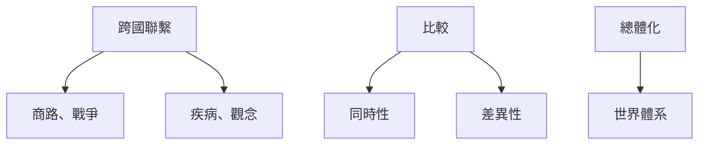
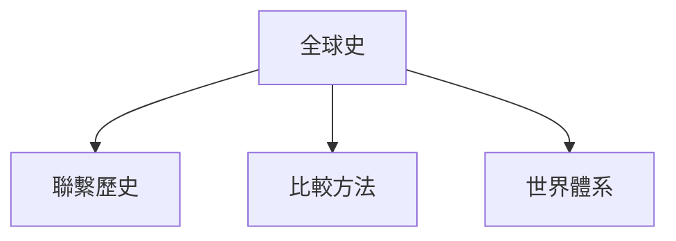
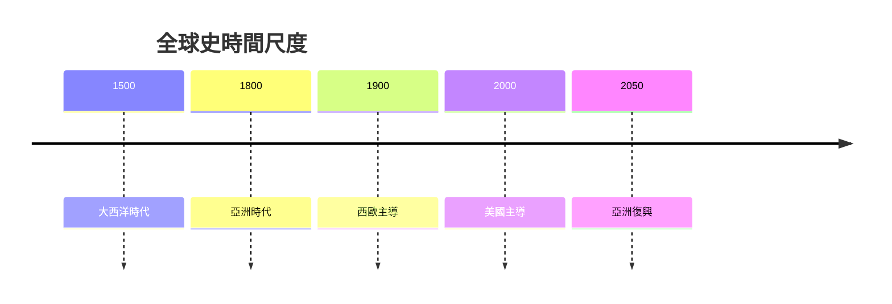
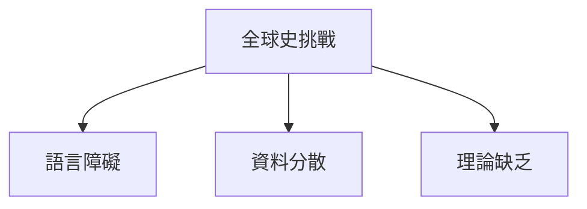

# HIST2233 全球史 / Globalizing History (6 credits)

**Instructor**: Jason Petrulis
**Department**: History, HKU  
**Official source**: [HKU History Course Description 2024-25](https://history.hku.hk/wp-content/uploads/2024/07/HIST-2425.pdf)
**Style**: 袁騰飛式 — 犀利、聚焦全球史點解挑戰西方中心

---

## 問題 1：這個領域所有專家共享的 5 個核心心智模型

### 心智模型 1：全球史作方法論
學者 **Bruce Mazlish** 研究：全球史挑戰國家中心敘事——關注跨國聯繫、比較。

學者 **Bruce Mazlish & Ralph Buultjens** 分析：全球史三大方法：跨國聯繫、比較、總體化。

### 心智模型 2：「聯繫歷史」(Connected Histories)
學者 **Sanjay Subrahmanyam** 研究：聯繫歷史——追蹤跨文化、跨地區嘅歷史聯繫。

學者 **C.A. Bayly** 分析：全球史前驅。

### 心智模型 3：「世界體系分析」
學者 **Immanuel Wallerstein** 研究：世界體系分析——核心、半邊緣、邊緣結構。

學者 **Andre Gunder Frank** 分析：「亞洲時代」——1800 年前亞洲經濟總量超過歐洲。

### 心智模型 4：「全球史」vs「世界史」
學者 **Stuart Macintyre** 研究：全球史關注跨國聯繫；世界史關注全球總體。

學者 **Jerry Bentley** 分析：世界史挑戰歐洲中心論。

### 心智模型 5：「帝國史」(Imperial History)
學者 **John Darwin** 研究：帝國主義全球擴張塑造現代世界。

學者 **A.G. Hopkins** 分析：帝國史重新發現。

---

## 問題 2：3 個根本分歧

### 分歧 1：全球史——新領域定現有領域重包裝？
- **A 方**：新領域——方法創新
- **B 方**：舊領域重包裝——帝國主義史改名

### 分歧 2：全球史——學術價值定政治正確？
- **A 方**：學術價值——新視角
- **B 方**：政治正確——忽視國家史

### 分歧 3：全球史——方法創新定理論創新？
- **A 方**：方法創新——跨學科
- **B 方**：理論創新——範式轉變

---

## 問題 3：10 個深度問題

1. 全球史點解挑戰國家史？
2. 如果你去 1800 年做全球史研究，你會點樣？
3. 全球史點解幫助理解氣候危機？
4. 如果你是歷史學家，點樣做全球史研究？
5. 全球史——點解西方史學家主導？
6. 如果你去 2050 年，全球史會點樣？
7. 全球史教學——點解咁難？
8. 點解全球史同世界史有時被混淆？
9. 如果你是學生，點樣學全球史？
10. 全球史——點解係 21 世紀最重要嘅歷史方法？

---

## 核心心智模型深化

### 1. 全球史方法



---

## 深度自測問題

### 詳解 1: 全球史點解挑戰國家史？
全球史關注跨國、跨文化聯繫，唔再以國家為分析單位。呢個挑戰歷史學以國家為中心嘅傳統。

---

## 5 個 Mermaid 圖解

### 📊 Diagram 1: 全球史方法



### 📊 Diagram 2: 世界體系結構


### 📊 Diagram 3: 全球史時間尺度



### 📊 Diagram 4: 全球史關注主題

```mermaid
flowchart TD
    A[全球史] --> B[帝國主義]
    A --> C[貿易網絡]
    A --> D[人口遷移]
    A --> E[疾病}
```

### 📊 Diagram 5: 全球史挑戰



---

## 總結

1. 全球史挑戰國家中心敘事
2. 方法創新需要跨學科訓練
3. 世界體系分析有爭議
4. 全球史對理解當下問題重要
5. 全球史係 21 世紀重要歷史方向

**最後問題**: 全球史會取代國家史嗎？

---
**版權所有 © HKU History Self-Study**
