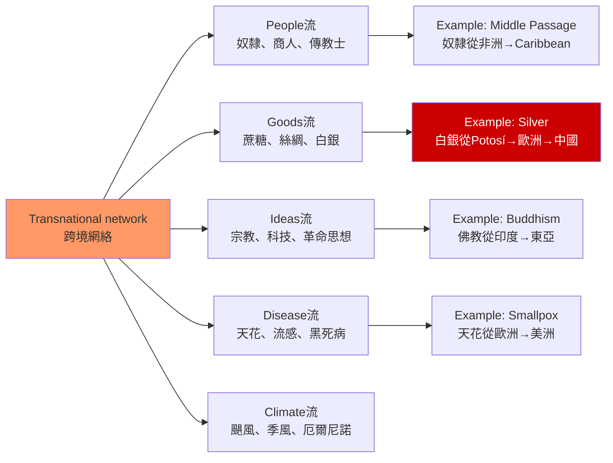
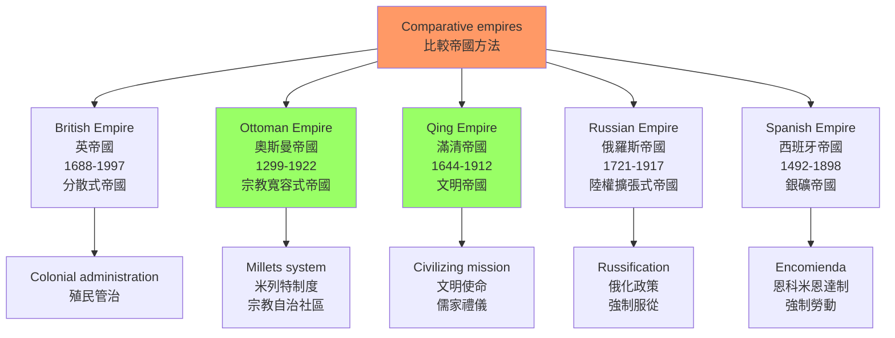
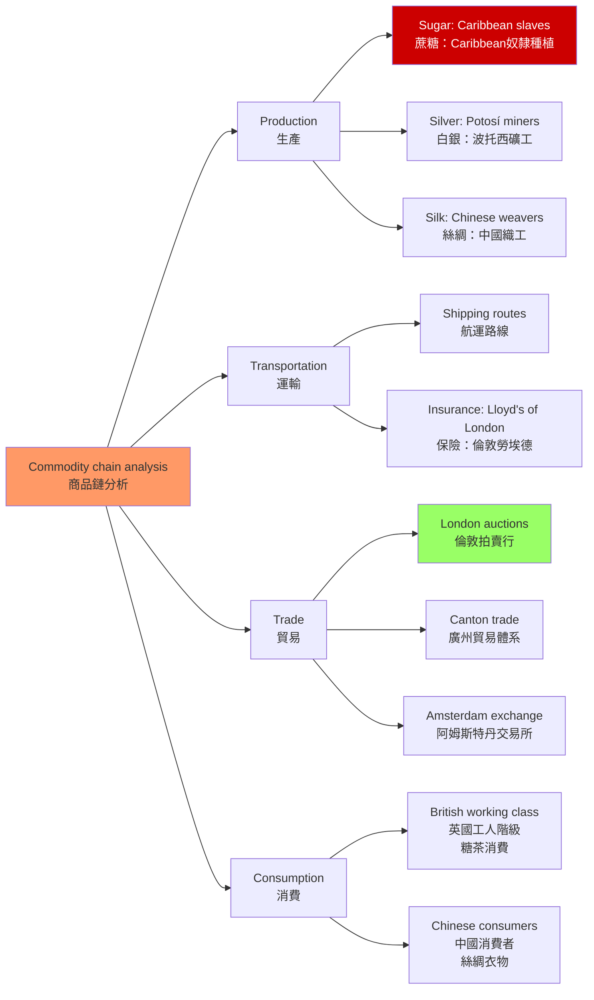
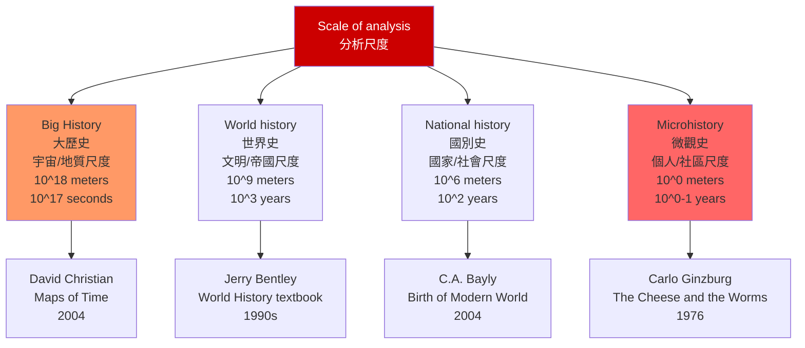

# HIST2233 全球史 / Globalizing History

**Instructor**: Jason Petrulis
**Department**: History, HKU
**Official source**: [HKU History Course Description](https://history.hku.hk/ug_cd/)
**Style**: research-based — 犀利、聚焦大歷史與微觀史的張力——如何用「跨越邊界」的視角重寫世界史

---

## 問題 1：這個領域所有專家共享的 5 個核心心智模型是什麼？

### 1. 跨境網絡（Transnational Networks）

**專家如何思考**: 全球史的核心理念是「跨境網絡」——研究人、物品、思想、疾病、氣候如何跨越政治邊界移動。學者 **Charles Bright** 和 **Michael Geyer** 在 *Global History* 中指出：全球史不是「更大的國別史」，而是對邊界本身作為歷史建構物的質疑。

- **典型學者**: **Bruce Mazlish** — *The New Global History* (2006); **Jerry Bentley** — *Shapes of World History in Nineteenth-Century Maps* (1993); **Dipesh Chakrabarty** — *Provincializing Europe* (2000)
- **驗證案例**: 17 世紀非洲奴隸、歐洲商人、中國絲綢、拉丁美洲白銀同時在 Caribbean 島嶼交匯——這種「四個世界」的跨境相遇是任何國別史框架都無法捕捉的

### 2. 比較帝國（Comparative Empires）

**專家如何思考**: 全球史的重要方法之一是比較不同帝國的運作邏輯。學者 **Jane Burbank** 和 **Frederick Cooper** 在 *Empires in World History* (2010) 中論證：帝國不是走向民族國家的「不成熟階段」，而是歷史上最持久的政治組織形式——很多帝國（如奧斯曼、俄羅斯、中國）到 20 世紀仍然存在。

- **典型學者**: **Jane Burbank & Frederick Cooper** — *Empires in World History* (2010); **C.A. Bayly** — *The Birth of the Modern World* (2004); **John Darwin** — *After Tamerlane* (2007)
- **驗證案例**: 1700-1900 年間，奧斯曼帝國、英帝國、俄羅斯帝國、滿清帝國同時運作——比較它們的徵稅制度、族群政策和宗教寬容度，揭示了「帝國」作為政治組織的多樣性

### 3. 物質流與商品鏈（Material Flows and Commodity Chains）

**專家如何思考**: 物品（commodities）和物種（species）的跨境流動，往往比人的流動更能揭示歷史。學者 **Siddharth Chandra** 和 **Eva-Marie Dubuisson** 研究：馬鈴薯從美洲傳入歐洲後，改變了愛爾蘭和德國的人口結構（18 世紀愛爾蘭人口從 200 萬增至 800 萬）；玉米傳入中國後，成為清代人口爆炸的關鍵因素之一。

- **典型學者**: **Alfred Crosby** — *Ecological Imperialism* (1986); **Siddharth Chandra** — research on commodity chains
- **驗證案例**: 1800 年倫敦工人階級每日熱量攝取的 20% 來自加勒比蔗糖——這條從 Caribbean 種植園到倫敦工廠的糖鏈，連接了帝國、奴隸制和工業革命

### 4. 大歷史 vs 微觀史（Big History vs Microhistory）

**專家如何思考**: 全球史面臨一個根本張力：是研究「大歷史」（大尺度、長時段、宏觀結構）還是「微觀史」（個人、局部、細節）？學者 **David Christian** 在 *Maps of Time* (2004) 中提出「大歷史」框架——從大爆炸到今天；而 **Carlo Ginzburg** 等微觀史學家則強調從一個個人或小鎮的歷史中發現普遍真理。

- **典型學者**: **David Christian** — *Maps of Time* (2004); **Carlo Ginzburg** — *The Cheese and the Worms* (1976); **Siddharth Chandra** — research on micro-level analysis
- **驗證案例**: 1840 年代日本藝伎（Maid servants）與美國水手的相遇——一個具體的人物和一段具體的歷史，揭示了 19 世紀全球勞動力流動和跨文化性別政治

### 5. 全球視角重構（Reframing from a Global Perspective）

**專家如何思考**: 全球史的另一個核心工作是「重構」——從全球視角重新理解已經被國別史框架「固化」的歷史。學者 **Prasenjit Duara** 等人論證：東亞的現代化不是「西方衝擊-亞洲回應」的簡單過程，而是多重文明同時互動的結果。

- **典型學者**: **Prasenjit Duara** — *The Crisis of Global Modernity* (2015); **V.G. Kiernan** — *The Lords of Human Kind* (1969)
- **驗證案例**: 1920 年代天津的地毯出口到全球市場——這條跨國商品鏈連接了中國內陸的鄉村經濟、天津的外國租界、倫敦的拍賣行和歐洲的消費者

---

## 問題 2：這個領域 3 個最根本的分歧點是什麼？

### 分歧 1：全球史——真正的去歐洲中心 vs 新的帝國主義？
**核心問題**: 全球史是「去歐洲中心」的真正努力，還是換了一種語言的帝國主義？

- **學派A（全球史倡導）**: 全球史試圖超越國別史框架，關注不同文明之間的横向聯繫——這是一種認識論上的解放
- **學派B（後殖民批評）**: **Dipesh Chakrabarty** (*Provincializing Europe*, 2000) 等學者指出，很多全球史研究仍然以歐洲為參照點（"Europe as the norm, others as deviation"）——真正的去歐洲中心需要把歐洲本身「地方化」
- **驗證**: 全球史中關於中國和印度的討論，往往仍然以「中國何時追上歐洲」或「印度為何落後」為問題框架——這種提問方式本身就是歐洲中心主義的體現

### 分歧 2：大歷史——過於宏觀 vs 微觀史——過於局限？
**核心問題**: 全球史應該研究大尺度的結構（大歷史），還是聚焦於個人和微觀社區（微觀史）？

- **學派A（大歷史）**: David Christian、C.J. Goldstone 等學者認為，只有大尺度的歷史分析才能揭示真正重要的歷史規律——從宇宙大爆炸到人類世的時間框架是必要的
- **學派B（微觀史）**: Carlo Ginzburg、Natalie Davis 等學者認為，最深刻的历史洞见往往來自對一個具體人物的深入研究——如 *The Cheese and the Worms* 中 16 世紀磨坊主的世界觀
- **驗證**: 「為什麼工業革命在英格蘭而非中國發生？」——這個問題用大歷史（大尺度、經濟學框架）可以得到一種答案，用微觀史（明代蘇州絲織業的具體分析）可以得到完全不同的答案

### 分歧 3：全球治理——歷史延續 vs 1914年断裂？
**核心問題**: 我們今天所經歷的全球化是冷戰後的新現象，還是 19 世紀全球化的歷史延續？

- **學派A（新全球化論）**: Thomas Friedman (*The World is Flat*, 2005) 等學者認為，冷戰結束後的全球化是全新的——網路技術和供應鏈整合將世界「扁平化」
- **學派B（歷史延續論）**: **Kevin O'Rourke** 和 **Jeffrey Williamson** 在 *Globalization and History* (1999) 中論證：19 世紀全球化（1870-1914）與當代全球化在貿易模式、要素價格均等化方面驚人相似——1914-1945 年的戰爭和保護主義是「例外」而非「常態」

---

## 問題 3：10 個深度問題

1. 全球史的「方法論民族主義」（methodological nationalism）批判是什麼？為什麼以國家為分析單位的歷史研究框架會「遮蔽」跨境聯繫？請用一個具體例子說明。
2. Bruce Lee 與 1840 年代日本婢女的「全球史」敘事——這兩個看似完全無關的人物，如何在 Jason Petrulis 教授的全球史框架中同時出現？這種研究策略的方法論意義是什麼？
3. 比較帝國研究的方法論：Jane Burbank 和 Frederick Cooper 的「帝國」框架 vs Immanuel Wallerstein 的「世界體系」框架——兩者對「帝國」和「邊界」的理解有何根本差異？
4. 17 世紀非洲奴隸、中國絲綢、拉丁美洲白銀在 Caribbean 同時交匯——這種「四個世界」的跨境相遇，如何挑戰了我們以「洲」或「國家」為分析單位的歷史想像？
5. 全球史如何處理「缺失的史料」問題——當我們研究非洲奴隸或底層人物的歷史時，歐洲語言檔案的局限性如何影響歷史重建的可能性？
6. **商品鏈分析**：1920 年代天津地毯的全球流通——從中國鄉村到天津外國租界，到倫敦拍賣行，再到歐洲消費者——這條商品鏈的每個節點分別由誰控制？利潤如何分配？
7. 「大歷史」（Big History）框架的認識論假設是什麼？David Christian 從宇宙大爆炸開始講歷史，是否真的能幫助我們理解當代的全球化問題？
8. 全球史如何處理「時間性」（temporality）的問題——當我們同時研究 17 世紀 Caribbean 和 20 世紀香港的歷史時，如何避免簡單的「進步敘事」或「西方衝擊論」？
9. 比較 **Carlo Ginzburg** 的微觀史方法和 **David Christian** 的大歷史框架。這兩種方法論在認識論上有什麼根本差異？兩者能否在同一个研究项目中結合？
10. 從全球史角度重新審視香港的歷史——從 1842 年《南京條約》到 1997 年回歸，香港在全球貿易網絡中的位置發生了什麼根本變化？

---

# 核心心智模型深化（中英對照）

## 1. 跨境網絡（Transnational Networks）

### 1.1 Bilingual 概念對照
| 英文 | 中文 | 歷史含義 | 具體案例 |
|---|---|---|---|
| Transnational networks | 跨境網絡 | 跨越政治邊界的互聯 | 奴隸貿易網絡 |
| Methodological nationalism | 方法論民族主義 | 以國家為分析框架 | 國別史的局限 |
| Border-crossing | 跨境流動 | 人員、物種、商品的跨境移動 | 馬鈴薯從美洲到歐洲 |
| Circulation | 循環 | 物品和思想的來回流通 | 白銀在歐亞之間的流通 |

### 1.2 史料與考據
- **一手史料**: 港口海關記錄、跨國公司檔案（東印度公司）、傳教會記錄、奴隸船航海日誌
- **關鍵學者**: **Bruce Mazlish** — *The New Global History* (2006); **Alison Games** — *The Web of Empire* (2006); **Lauren Benton** — *A Search for Sovereignty* (2010)
- **史料批判**: 跨境史料分散在不同語言和國家的檔案系統中，必須使用多種語言才能重建完整的歷史圖景

### 1.3 袁騰飛式犀利觀察
全球史最挑戰你認知的地方是：它讓你看見「國家」這個框架有多麼人為。

歷史上的很多人——奴隸、流亡者、商人、傳教士——他們的生活根本不受「國界」限制。你能想象一個 Caribbean 奴隸的生活被「英國歷史」和「非洲歷史」和「法國歷史」切割嗎？他的生命同時屬於這三個歷史敘事，但任何一個歷史敘事都不能完整捕捉他的人生。

全球史的價值就是強迫我們承認：**歷史的邊界是人為的，而真實的歷史是無邊界的**。

### 1.4 Deep test question
- **Q1**: 設計一個研究項目，研究 16-18 世紀 Caribbean 的中國絲綢消費——你需要哪些檔案和史料？如何克服語言障礙（西班牙語、法語、英語、中文、荷蘭語）？
- **Q2**: 「方法論民族主義」的批判如何影響了我們對 19 世紀香港歷史的理解？試舉一個具體例子，說明以「英帝國史」或「中國史」為框架分析香港歷史的局限性。

### 1.5 圖解


---

## 2. 比較帝國（Comparative Empires）

### 2.1 Bilingual 概念對照
| 英文 | 中文 | 歷史含義 | 關鍵學者 |
|---|---|---|---|
| Comparative empires | 比較帝國 | 並置分析不同帝國 | Burbank & Cooper |
| World-systems | 世界體系 | 全球經濟分層 | Wallerstein |
| Imperial logic | 帝國邏輯 | 帝國如何運作 | C.A. Bayly |
| Sovereignty | 主權的地理 | 主權的空間分布 | Lauren Benton |

### 2.2 袁騰飛式犀利觀察
比較帝國研究最顛覆認知的一點：**帝國不是通往民族國家的「中轉站」，而是歷史上最持久、最成功的政治組織形式**。

我們從小被教育「帝國主義是邪惡的、民族解放是正義的」——但歷史現實是：奧斯曼帝國（1299-1922）、俄羅斯帝國（1721-1917）、中國（帝制延續 2000 年以上）都比大多數民族國家更長壽。

問題不是「帝國為什麼崩潰」，而是「帝國為什麼能够維持這麼長時間」——這才是真正值得問的歷史問題。

### 2.3 圖解


---

## 3. 物質流與商品鏈（Material Flows and Commodity Chains）

### 3.1 Bilingual 概念對照
| 英文 | 中文 | 歷史含義 | 具體案例 |
|---|---|---|---|
| Commodity chain | 商品鏈 | 從生產到消費的完整路徑 | 糖：Caribbean→倫敦→工人階級 |
| Ecological imperialism | 生態帝國主義 | 物種入侵的帝國邏輯 | 兔子引入澳洲 |
| Columbian exchange | 哥倫布交換 | 舊世界與新世界的生物交流 | 馬鈴薯、玉米、糖 |
| Silver flow | 白銀流動 | 全球白銀的流通 | Potosí銀礦→中國 |

### 3.2 圖解


---

## 4. 大歷史 vs 微觀史（Big History vs Microhistory）

### 4.1 Bilingual 概念對照
| 英文 | 中文 | 歷史含義 | 學者 |
|---|---|---|---|
| Big History | 大歷史 | 從宇宙大爆炸到今天的宏觀框架 | David Christian |
| Microhistory | 微觀史 | 聚焦一個個人或社區 | Carlo Ginzburg |
| Scale jumping | 尺度跳躍 | 從微觀到宏觀的切換 | Global historians |
| Thick description | 厚描 | 深度情境化描述 | Clifford Geertz |

### 4.2 圖解


---

## 5. 全球視角重構（Reframing from a Global Perspective）

### 5.1 Bilingual 概念對照
| 英文 | 中文 | 歷史含義 | 學者 |
|---|---|---|---|
| Provincializing Europe | 歐洲地方化 | 挑戰歐洲中心主義 | Dipesh Chakrabarty |
| Multiple modernities | 多元現代性 | 現代化不是單一路徑 | Shmuel Eisenstadt |
| Decolonizing knowledge | 去殖民化知識 | 挑戰西方認識論 | Walter Mignolo |
| Connected histories | 聯繫史 | 跨越邊界的歷史聯繫 | Sanjay Subrahmanyam |

### 5.2 圖解
```mermaid
graph TD
    A[Reframing global history<br/>全球史重構] --> B[Eurocentrism<br/>歐洲中心主義<br/>Europe as the norm<br/>歐洲=標準]
    A --> C[Provincializing Europe<br/>歐洲地方化<br/>Europe as one among many<br/>歐洲是多元之一]
    A --> D[Alternative modernities<br/>另類現代性<br/>China, Japan, India, Ottoman<br/>各有其現代化路徑]
    A --> E[Connected histories<br/>聯繫史<br/>No single center<br/>沒有單一中心]
    
    B -.->|Problem| F[Questions like<br/>"Why did China lag behind?"<br/>"中國為何落後?"]
    C -.->|Solution| G[Questions like<br/>"How did multiple modernities emerge?"<br/>"多元現代性如何產生?"]
    
    style A fill:#f96
    style C fill:#9f6
    style E fill:#9f6
    style G fill:#c00,color:#fff
```

---

# 深度自測問題詳解

## Q1 詳解：方法論民族主義批判
**核心答案**: 「方法論民族主義」是指歷史學家不自覺地以「民族國家」作為歷史分析的基本單位——彷彿歷史的邊界天然等於政治邊界。這種框架會「遮蔽」大量跨境現象：奴隸貿易跨越了英國、法國、西班牙、葡萄牙的殖民地邊界；白銀流通跨越了西班牙帝國、荷蘭共和國、中國大清的邊界；傳教士網絡跨越了歐洲多個國家。

**具體例子**: 研究 1842 年《南京條約》時，如果你只用「英帝國史」或「中國近代史」的框架，你就無法理解這份條約實際上是英國東印度公司破產後、英國政府被迫接管對華政策的結果——條約的簽署涉及英國內部政治（東印度公司 vs 英國議會）和中國內部政治（清廷 vs 地方官員），而「中英關係」的框架往往忽略了這些內部政治因素。

## Q3 詳解：比較帝國 vs 世界體系
Burbank & Cooper 的「比較帝國」框架與 Wallerstein 的「世界體系」框架的根本差異：

**Wallerstein 世界體系**：世界分為「核心」（西歐、北美）、「半邊緣」（東歐、拉丁美洲）、「邊緣」（非洲、南亞）——核心國家剝削邊緣國家，這是全球不平等的根源。這個框架是經濟決定論的，強調階級和經濟。

**Burbank & Cooper 帝國框架**：帝國不是走向民族國家的「前現代」階段，而是歷史上最靈活的政治組織形式——帝國通過「差異化管理」（differential governance）同時容納不同的族群、宗教和法律制度。這個框架強調政治多元性和帝國的適應能力。

兩者的根本差異：**Wallerstein 問的是「誰剥削誰」，Burbank & Cooper 問的是「帝國如何管理差異」**。

## Q5 詳解：全球史的史料缺失問題
全球史面臨嚴重的「史料階級」問題：歐洲帝國的檔案最完整，非洲和美洲原住民的史料極度匱乏。這意味着如果只用歐洲語言檔案，全球史將仍然是「歐洲人眼中的世界史」，而不是真正去歐洲中心的世界史。

**解決策略**：① **口述歷史和民族誌**——彌補文字檔案的不足；② **物質文化證據**——器物、建築、DNA 分析；③ **比較檔案**——同時使用多種語言檔案進行交叉驗證；④ **推斷性重建**——在史料不足的情況下，進行有根據的歷史想像

## Q7 詳解：大歷史的認識論假設
David Christian 的大歷史框架（從宇宙大爆炸到人類世）的認識論假設：**歷史存在一個可以用科學和敘事整合的「宏觀尺度」**。這個假設的問題是：當我們從宇宙尺度談論「歷史」，時間單位往往變得如此巨大，以至於人類能動性（agency）几乎完全消失。大歷史描述的是結構和進程，而不是人類的選擇和行動——這與歷史學作為人文學科的核心理念存在張力。

---

# 總結 / Closing 5-Point Deep Insights

1. **全球史的起點是承認「邊界是人為的」**：研究歷史的人為邊界（國家、民族、洲）往往遮蔽了真實的歷史聯繫——奴隸不是「英國歷史」的一部分，絲綢不是「中國歷史」的附屬品，它們是跨越這些邊界的全球現象。

2. **比較帝國重構了我們對「帝國」的理解**：帝國不是落後的、不稳定的政治組織——它是歷史上最成功的多族群政治形式，能夠同時容納不同的宗教、法律和語言制度。

3. **商品鏈揭示了帝國與消費的隱藏連結**：當你在倫敦喝茶加糖時，你其實在參與一個從 Caribbean 奴隸種植園到英國工廠工人的完整帝國商品循環——消費從來不是「中性的」。

4. **大歷史和微觀史不是對立的，而是互补的**：Bruce Lee 和 1840 年代日本婢女的「並置」——這不是巧合，而是全球史方法論的精髓：用微觀細節揭示宏觀結構。

5. **去歐洲中心不是口号，而是方法論革命**：如果我們真的想把歐洲「地方化」，就必須承認：我們用來研究歷史的概念框架（民族國家、工業革命、現代性）本身就是在歐洲經驗中形成的——這種承認是全球史最困難、也最必要的起點。

**自學建議**: 配合 Dipesh Chakrabarty 的 *Provincializing Europe* + David Christian 的 *Maps of Time* + C.A. Bayly 的 *The Birth of the Modern World*，輸出讀書筆記到 `06_Reading_Notes/`。
