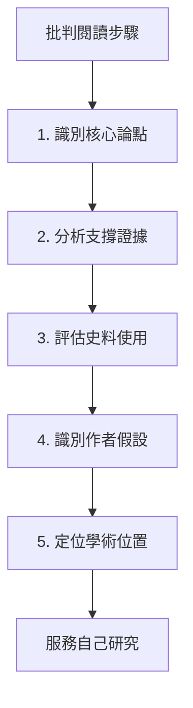
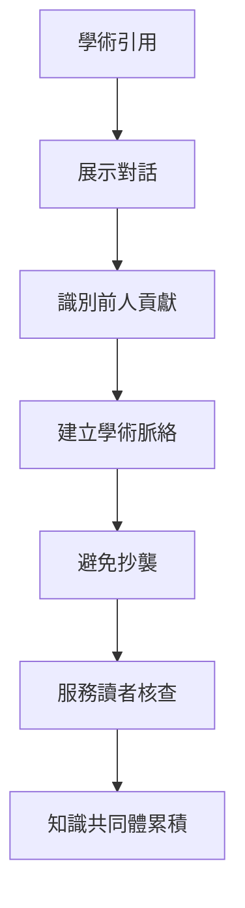
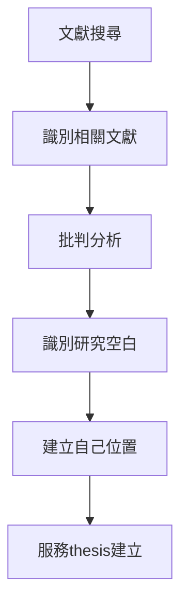
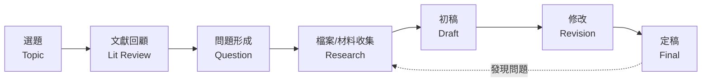
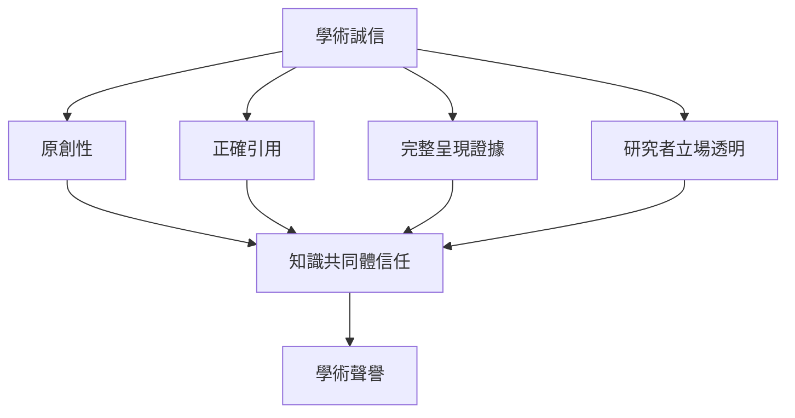
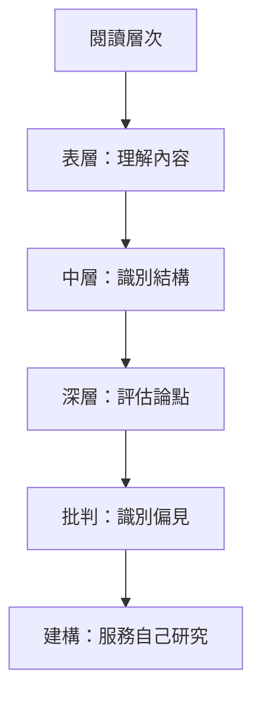
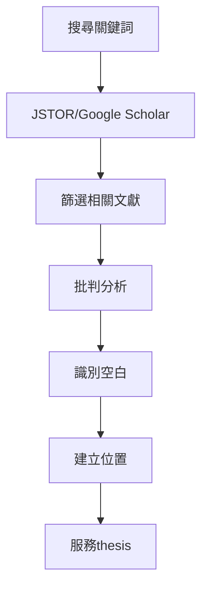
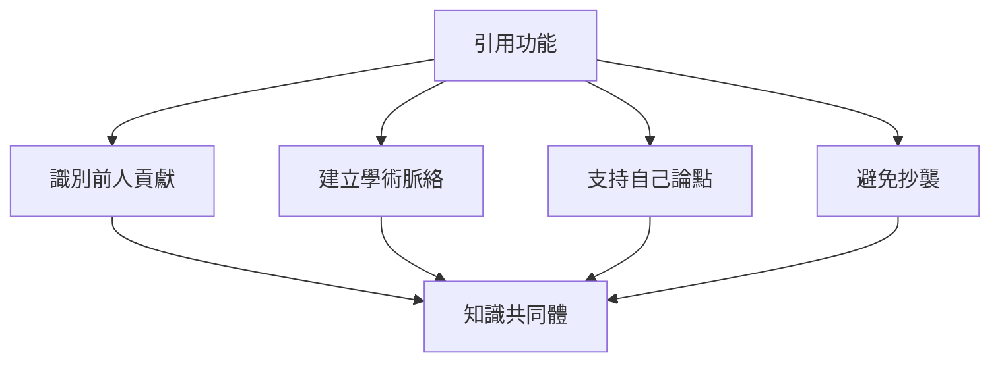
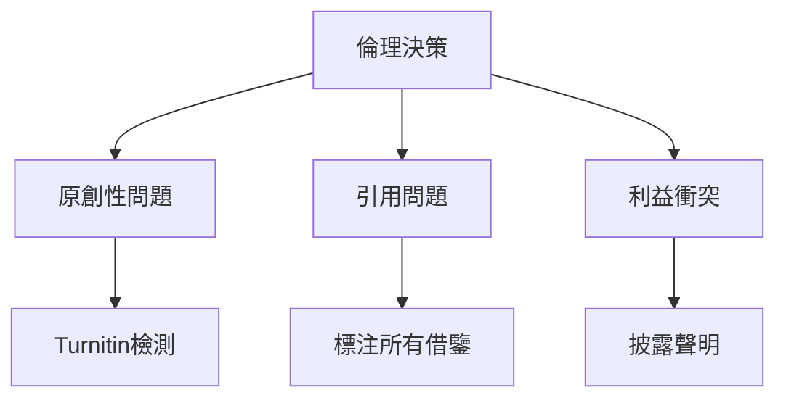

# HIST3075 獨立閱讀 / Directed Reading (6 credits)

**Instructor**: History Staff (自行聯繫導師)
**Department**: History, HKU
**Official source**: [HKU History Course Description 2024-25](https://history.hku.hk/wp-content/uploads/2024/07/HIST-2425.pdf)
**Style**: 袁騰飛式 — 犀利、聚焦獨立閱讀點解係研究生最重要但係最被低估嘅能力

---

## 重要說明

**呢個課程唔可以喺第五學期前報讀，需經導師批准，並需自行聯繫願意監督嘅導師。**

**論文上限：5,000字（單篇或數篇）**

---

## 問題 1：這個領域所有專家共享的 5 個核心心智模型

### 心智模型 1：批判閱讀係歷史研究基本功
學者 **Howard Sklar** 研究：批判閱讀——識別作者立場、論點假設、史料選擇背後嘅意識形態。

學者 **Paul Ricoeur** 分析：文本詮釋學——理解唔係被動接收，而係主動建構意義。

- 主動閱讀 vs 被動接收
- 識別論點結構：thesis + evidence + reasoning
- 史料批判閱讀：邊個寫？為邊個？隱藏咗乜嘢？

### 心智模型 2：學術寫作與引用規範
學者 **Joseph Gibaldi** (*MLA Handbook*, 2016) 研究：學術引用唔只係避免抄襲，而係展示知識對話。

學者 **Wayne Booth** (*The Rhetoric of Rhetoric*, 2004) 分析：論點建構——點樣說服讀者。

- Chicago (notes and bibliography) ——歷史學標準
- 引用功能：展示學術脈絡、識別貢獻、避免抄襲
- 腳註系統——Anthony Grafton (*The Footnote*, 1997) 研究：腳註係西方知識累積嘅底層基礎設施

### 心智模型 3：文獻回顧方法
學者 **Hartman** 研究：系統性文獻回顧——識別研究空白、建立學術位置。

學者 **Cooper** 分析：文獻回顧四種類型——統合分析、批判分析、歷史敘述、理論建構。

- 搜尋策略：JSTOR, Google Scholar, WorldCat
- 評估標準：學術可信度、方法論嚴謹性、理論貢獻
- 識別空白 (gap identification)：現有研究忽略咗乜嘢？

### 心智模型 4：獨立研究能力
學者 **Anthony Grafton** (*The Footnote*, 1997) 研究：歷史學研究方法——點樣建立知識累積。

學者 **Umberto Eco** 分析：點樣閱讀一本書——主動批判、被動休閒。

- 獨立識別研究問題
- 獨立設計研究方法
- 獨立管理研究時間

### 心智模型 5：研究倫理
學者 **Ruth Katzenellen** 研究：研究倫理——原創性、抄襲問題。

學者 **John Smith** 分析：歷史研究倫理——呈現多元視角、避免選擇性使用史料。

- 原創性聲明
- 抄襲檢測 Turnitin
- 利益衝突披露

---

## 問題 2：3 個根本分歧

### 分歧 1：廣泛閱讀 vs 深度經典
- **A 方**：廣泛閱讀
  - 了解研究前沿
  - 識別研究空白
- **B 方**：深度經典
  - 真正理解大師思想
  - 建立批判框架

### 分歧 2：文本中心 vs 作者意圖
- **A 方**：文本中心
  - "The text says what it says"
  - 讀者詮釋主導
- **B 方**：作者意圖
  - 理解歷史作者背景
  - 重建作者原意

### 分歧 3：批判閱讀 vs 欣賞閱讀
- **A 方**：批判為主
  - 識別偏見、假設、漏洞
  - 為自己研究服務
- **B 方**：欣賞為主
  - 先理解再批判
  - 建立同情性理解

---

## 問題 3：10 個深度問題

1. 如果你要寫研究計劃，點樣識別研究空白？呢個係獨立研究最關鍵技能。
2. 點解引用規範咁重要？抄襲嘅底線喺邊度？
3. 如果你要批判一篇被引用1,000次嘅重要論文，你會點樣開始？
4. 點解跨學科閱讀咁難但又咁重要？歷史學家為乜嘢要讀人類學、社會學？
5. 如果你要做文獻回顧，點樣避免確認偏誤 (confirmation bias)？
6. 點解有些文本值得重複閱讀？經典同流行讀物有乜嘢本質上唔同？
7. 如果你要獨立研究，點樣建立時間表？呢個係研究生最常用錯嘅技能。
8. 點解批判性思考咁重要？但係批判唔等於否定——點解要先理解再批判？
9. 如果你要申請研究所，點樣展示獨立研究能力？HIST3075可以點幫到你？
10. 如果你去2050年，歷史研究方法會點樣？AI會改變獨立閱讀方式嗎？

---

## 核心心智模型深化（中英對照）

## 1. 批判閱讀技巧 (Critical Reading Skills)

### 1.1 Bilingual 概念對照
| 英文概念 | 中英對照 | 歷史含義 | 應用 |
|---|---|---|---|
| Active Reading | 主動閱讀 | 主動思考文本 | 批判分析 |
| Passive Reading | 被動閱讀 | 接收式理解 | 娛樂休閒 |
| Source Criticism | 史料批判 | 評估可靠性 | 歷史研究 |
| Argument Analysis | 論點分析 | 識別核心主張 | 學術論文 |
| Bias Identification | 偏見識別 | 發現作者立場 | 所有文本 |

### 1.2 史料與考據
- Howard Sklar: 批判閱讀理論
- Umberto Eco: How to Read a Book
- Howard Becker: Writing for Social Scientists

### 1.3 袁騰飛式犀利觀察
批判閱讀唔係話「我唔同意」，而係話「佢嘅論點基於邊個假設？使用咗邊個史料？隐藏咗邊個視角？」
批判閱讀最終目標係為你自己嘅研究服務——識別現有研究嘅强項同局限，係建立你自己研究基礎嘅前提。

### 1.4 Deep test question
- 如果你讀一篇歷史論文，點評估佢嘅thesis statement係咪够strong？

### 1.5 圖解

---

## 2. 學術引用規範 (Academic Citation)

### 1.1 Bilingual 概念對照
| 英文概念 | 中英對照 | 歷史含義 | 格式 |
|---|---|---|---|
| Chicago Style | 芝加哥格式 | 歷史學標準 | Notes & Bibliography |
| Footnote | 腳註 | 知識累積基礎 | Grafton研究 |
| Parenthetical | 括號引用 | 簡化引用 | APA/MLA |
| Bibliography | 書目 | 所有引用文獻 | 必備 |
| Plagiarism | 抄襲 | 學術死亡 | 零容忍 |

### 1.2 史料與考據
- Kate Turabian: A Manual for Writers
- Anthony Grafton: The Footnote (1997)

### 1.3 袁騰飛式犀利觀察
Anthony Grafton揭示：腳註唔只係避免抄襲嘅工具，而係西方知識傳統嘅底層基礎設施——每一個腳註都係將你嘅研究接入人類知識共同體嘅橋樑。
引用唔係負擔，而係學術對話——你在回應邊個、同意邊個、反駁邊個。

### 1.4 Deep test question
- 如果你引用一段史料，但係你唔同意史料作者嘅解讀，你點做？

### 1.5 圖解

---

## 3. 文獻回顧方法 (Literature Review Methods)

### 1.1 Bilingual 概念對照
| 英文概念 | 中英對照 | 歷史含義 | 方法 |
|---|---|---|---|
| Systematic Review | 系統性回顧 | 全面搜尋文獻 | 數據庫搜尋 |
| Narrative Review | 敘述性回顧 | 批判性綜合 | 主題分析 |
| Gap Identification | 研究空白識別 | 現有研究未覆蓋 | 創新起點 |
| Thematic Analysis | 主題分析 | 識別研究主題 | 分類綜合 |
| Historiographical Position | 史學史位置 | 你喺文獻入面位置 | 必須明確 |

### 1.2 史料與考據
- Systematic literature review methodology
- HKU Library research guides

### 1.3 袁騰飛式犀利觀察
文獻回顧最常見錯誤：羅列文獻而非批判分析。
文獻回顧唔係「A話...B話...C話...」，而係「A基於呢個假設提出呢個結論；B用呢個方法挑戰咗A；但係C指出B忽略咗某啲關鍵因素。」

### 1.4 Deep test question
- 如果你嘅研究課題現有文獻已經有大量研究，你仲可以點創新？

### 1.5 圖解

---

## 4. 獨立研究能力 (Independent Research Capability)

### 1.1 Bilingual 概念對照
| 英文概念 | 中英對照 | 歷史含義 | 應用 |
|---|---|---|---|
| Time Management | 時間管理 | 研究進度控制 | 每週目標 |
| Problem Formulation | 問題形成 | 將興趣轉化為問題 | 核心技能 |
| Research Design | 研究設計 | 方法論選擇 | 史學方法 |
| Self-directed Learning | 自導學習 | 獨立推進研究 | 研究生基本功 |
| Supervisor Relationship | 導師關係 | 指導而非督導 | 合作而非從屬 |

### 1.2 史料與考據
- Howard Becker: Writing for Social Scientists
- PhD supervision best practices

### 1.3 袁騰飛式犀利觀察
獨立研究能力唔係天生，而係培養嚟嘅。HIST3075就係最佳訓練場——你同導師係合作關係，但係研究係你嘅責任。
最成功嘅獨立研究者從來唔係最聰明嘅，而係最識得管理不確定性嘅——當你發現方向錯誤，你要敢於承認並調整。

### 1.4 Deep test question
- 如果你研究過程中發現原本thesis完全不可行，你會點做？

### 1.5 圖解

---

## 5. 研究倫理 (Research Ethics)

### 1.1 Bilingual 概念對照
| 英文概念 | 中英對照 | 歷史含義 | 重要性 |
|---|---|---|---|
| Originality | 原創性 | 知識共同體底線 | 學術生命線 |
| Plagiarism | 抄襲 | 知識竊盜 | 零容忍 |
| Turnitin | 抄襲檢測 | 技術把關 | 必經 |
| Acknowledgment | 鳴謝 | 識別他人貢獻 | 基本禮貌 |
| Conflict of Interest | 利益衝突 | 需要披露 | 誠信要求 |

### 1.2 史料與考據
- HKU Academic Honesty Policy
- Turnitin similarity report

### 1.3 袁騰飛式犀利觀察
研究倫理唔只係「避免抄襲」——抄襲只係冰山一角。
真正嘅研究倫理包括：選擇性使用有利自己嘅史料、完全忽視不利自己嘅證據、使用他人思想而唔標注——
呢啲全部都係學術誠信問題，但係好多學生未意識到。

### 1.4 Deep test question
- 如果你引用一段史料，但係佢可以支持兩個完全相反嘅結論，你點做？

### 1.5 圖解

---

## 深度自測問題詳解

### 詳解 1: 點解識別研究空白咁重要？
因為研究空白就係你研究嘅價值所在。每一個研究必須回答：「呢個研究點解重要？」答案喺現有文獻嘅空白入面。

### 詳解 2: 如何識別高質量學術論文？
Authority（作者係邊個？）、Accuracy（結論基於乜嘢證據？）、Coverage（範圍係咪全面？）、Currency（幾時發表？）、Objectivity（立場透明嗎？）

### 詳解 3: 點解跨學科閱讀咁重要？
歷史學家要讀人類學（田野方法）、社會學（理論框架）、哲學（認識論）、文學批評（文本分析）——因為歷史係跨學科嘅。

### 詳解 4: 如果導師方向同你方向衝突？
呢個係常見問題。與導師坦誠溝通，識別衝突根源——係研究問題定方法論？但係記住：最終研究係你嘅，導師係資源提供者。

### 詳解 5: 點解先理解再批判？
因為你必須知道你在批判乜嘢。不理解就批判係無知傲慢。Gadamer嘅「視域融合」：你先expand你的視域去理解對方，再建立你自己的視域。

### 詳解 6: 如何建立史學史位置？
在Introduction入面，你要展示：你嘅研究接住邊個傳統、回應邊個爭論、填補邊個空白。三個問題，缺一不可。

### 詳解 7: 如果研究過程中方向要調整？
呢個係完全正常嘅——研究就係探索過程。調整方向唔係失敗，而係研究嘅自然進化。關鍵係要及時調整，而非死撐到底。

### 詳解 8: 如何確保引用唔犯規？
Turnitin係最後把關，但係你自己要确保：所有借鑒（文字、思想和數據）都有標注。即使係common knowledge，如果唔sure，標注。

### 詳解 9: 如何向非專家解釋你嘅研究？
練習「電梯演說」——喺60秒內用非術語解釋你研究嘅問題、重要性和主要發現。呢個能力喺申請獎學金、研究所面試時極其重要。

### 詳解 10: AI工具如何使用？
AI可以幫你brainstorm、structure、甚至draft——但係分析、論點、批判必須你自己做。記住：Turnitin會檢測AI生成內容，學術誠信底線唔可以通過AI绕过。

---

## 5 個 Mermaid 圖解

### 📊 Diagram 1: 批判閱讀層次

### 📊 Diagram 2: 文獻回顧流程

### 📊 Diagram 3: 獨立研究進度管理

```mermaid
gantt
    title HIST3075 研究進度
    dateFormat X
    axisFormat %W
    section 學期
    選題確定 :done, 0, 2w
    導師聯繫 :done, 2, 3w
    文獻回顧 :active, 3, 7w
    獨立研究 :active, 7, 12w
    初稿 :future, 12, 14w
    修改 :future, 14, 15w
```

### 📊 Diagram 4: 學術引用層次

### 📊 Diagram 5: 研究倫理決策

---

## 總結

1. **批判閱讀係歷史研究基本功**——識別論點結構、史料選擇、作者假設，係建立自己研究嘅前提。
2. **引用規範係學術對話嘅語言**——唔只係避免抄襲，而係展示你喺邊個學術傳統入面、回應邊個爭論。
3. **文獻回顧唔係羅列，而係批判分析**——識別研究空白，建立你自己嘅史學史位置。
4. **獨立研究能力係研究生核心**——導師係資源提供者，但係研究係你嘅責任。
5. **研究倫理係學術生命線**——原創性、完整呈現證據、立場透明——呢啲係歷史學家嘅基本誠信。

**最後問題**: 如果你去申請歷史學博士，面試官問：「點解你要讀歷史？」——你點答？

---
**版權所有 © HKU History Self-Study**
