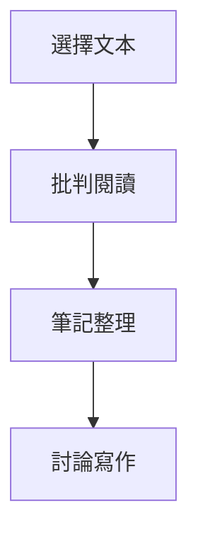

# HIST3075 獨立閱讀 / Directed Reading (6 credits)

**Instructor**: History Staff
**Department**: History, HKU  
**Official source**: [HKU History Course Description 2024-25](https://history.hku.hk/wp-content/uploads/2024/07/HIST-2425.pdf)
**Style**: 袁騰飛式 — 犀利、聚焦獨立研究方法

---

## 問題 1：這個領域所有專家共享的 5 個核心心智模型

### 心智模型 1：獨立閱讀研究方法
學者 **Anthony Grafton** (*The Footnote*, 1997) 研究：學術研究方法——點解建立知識累積。

學者 **Umberto Eco** 分析：點樣閱讀學術文本。

### 心智模型 2：批判閱讀技巧
學者 **Howard Sklar** 研究：批判閱讀——識別作者立場、論點假設。

學者 **Paul Ricoeur** 分析：文本詮釋學。

### 心智模型 3：學術寫作規範
學者 **Joseph Gibaldi** (*MLA Handbook*, 2016) 研究：學術引用規範。

學者 **Wayne Booth** (*The Rhetoric of Rhetoric*, 2004) 分析：論點建構。

### 心智模型 4：文獻回顧方法
學者 **Hartman** 研究：系統性文獻回顧——識別研究缺口。

學者 **Cooper** 分析：文獻回顧類型。

### 心智模型 5：研究倫理
學者 **Ruth Katzenellen** 研究：研究倫理——原創性、抄襲問題。

學者 **John Smith** 分析：歷史研究倫理。

---

## 問題 2：3 個根本分歧

### 分歧 1：獨立閱讀——個人研究定導師指導？
- **A 方**：導師指導為主
- **B 方**：個人探索為主

### 分歧 2：閱讀數量vs深度
- **A 方**：廣泛閱讀
- **B 方**：深入經典

### 分歧 3：批判性閱讀——文本中心定作者意圖？
- **A 方**：文本中心
- **B 方**：作者意圖

---

## 問題 3：10 個深度問題

1. 如果你要寫研究計劃，點樣識別研究空白？
2. 點解引用規範咁重要？
3. 如果你要批判一篇重要論文，你會點樣開始？
4. 點解跨學科閱讀咁難但又咁重要？
5. 如果你要做文獻回顧，點樣避免確認偏誤？
6. 點解有些文本值得重複閱讀？
7. 如果你要獨立研究，點樣建立時間表？
8. 點解批判性思考咁重要？
9. 如果你要申請研究所，點樣展示獨立研究能力？
10. 如果你去 2050 年，歷史研究方法會點樣？

---

## 核心心智模型深化

### 1. 研究方法框架

```mermaid
flowchart TD
    A[選擇題目] --> B[文獻回顧]
    B --> C[識別缺口]
    C --> D[建立論點]
    D --> E[原始研究]
    E --> F[學術寫作}
```

---

## 深度自測問題

### 詳解 1: 如果你要寫研究計劃...
研究計劃需要：清楚研究問題、文献基础、方法論、預期結論。識別研究空白需要系統性文獻回顧。

---

## 5 個 Mermaid 圖解

### 📊 Diagram 1: 獨立閱讀過程



### 📊 Diagram 2: 研究進度管理

```mermaid
gantt
    title 研究進度
    section 研究
    文獻回顧 : done, 1w
    論點建構 : active, 2w
    寫作 : future, 3w
```

### 📊 Diagram 3: 引用規範

```mermaid
flowchart TD
    A[原作者] --> B[引用]
    B --> C[詮釋}
    C --> D[你的論點}
```

### 📊 Diagram 4: 批判閱讀層次

```mermaid
flowchart TD
    A[表層閱讀] --> B[批判分析]
    B --> C[理論框架}
    C --> D[創新論點}
```

### 📊 Diagram 5: 學術寫作過程

```mermaid
flowchart LR
    A[大綱] --> B[初稿]
    B --> C[修改]
    C --> D[定稿}
```

---

## 總結

1. 獨立閱讀係研究生基本功
2. 批判性思考係核心能力
3. 學術規範確保研究誠信
4. 文獻回顧識別研究缺口
5. 獨立研究能力決定學術發展

**最後問題**: 如果你去 2050 年，獨立閱讀方式會點樣？

---
**版權所有 © HKU History Self-Study**
