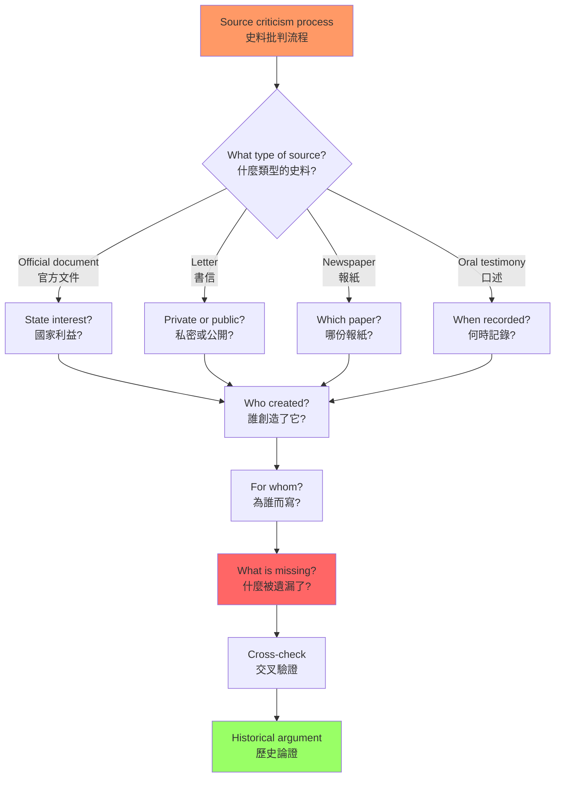
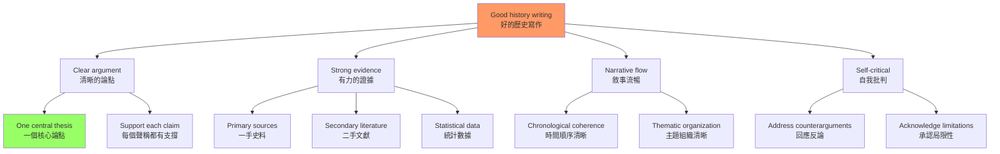
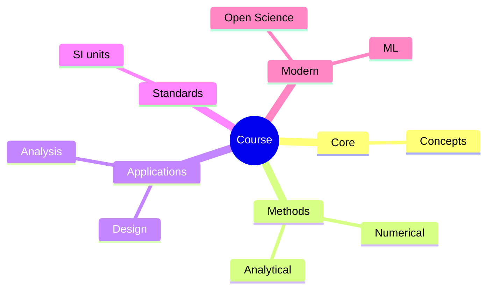
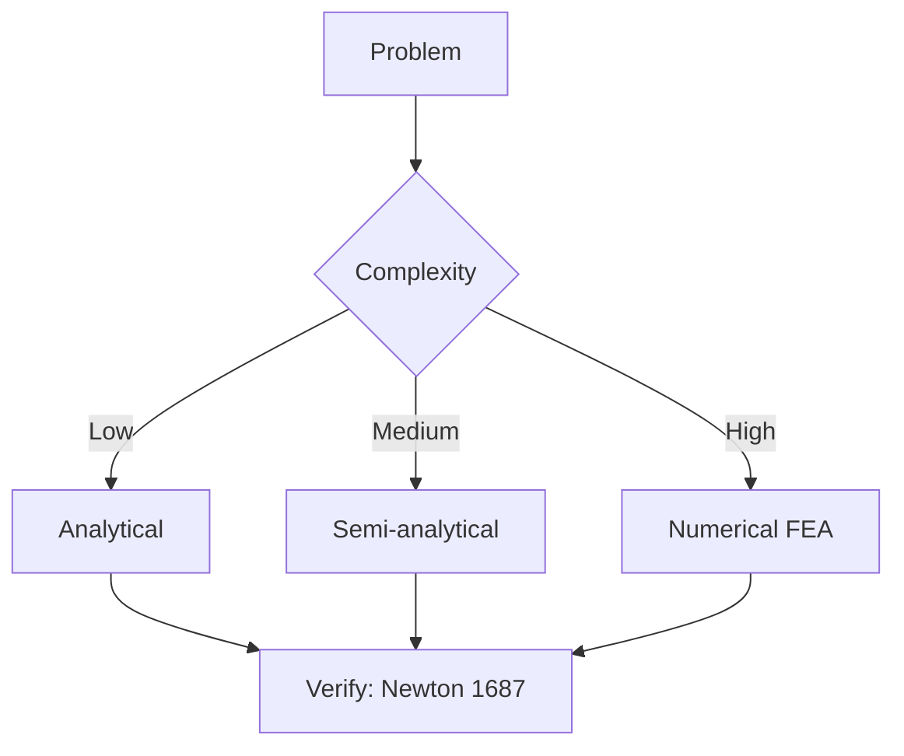
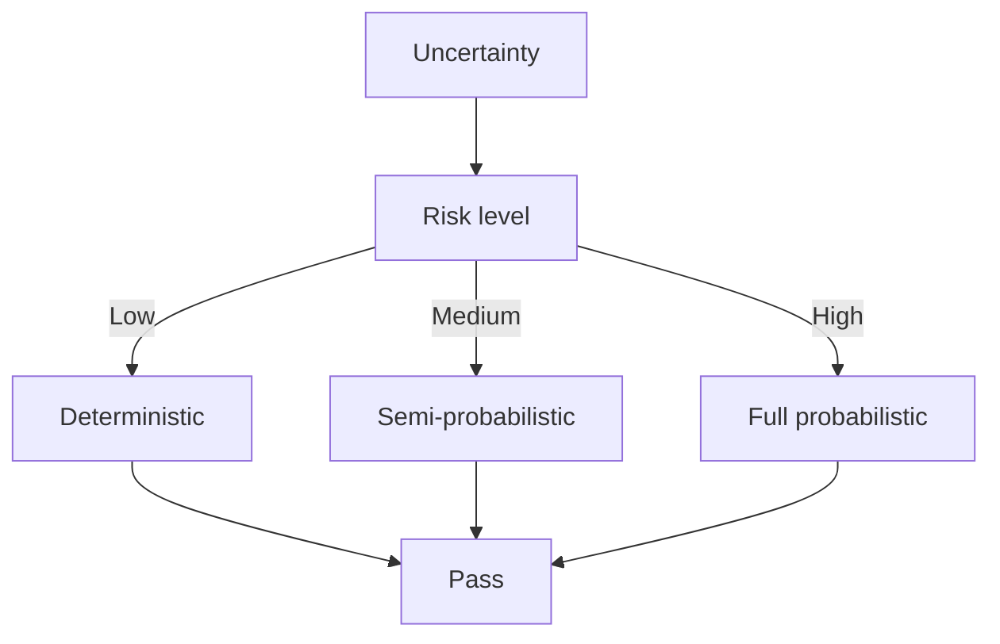
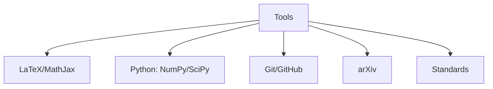

# HIST3075 獨立閱讀 / Directed Reading

/** HKU | 6 credits */

/**Instructor**: History Staff (individual faculty supervisor)
**Department**: History, HKU
**Official source**: [HKU History Course Description](https://history.hku.hk/ug_cd/), [HIST-2425.pdf](https://history.hku.hk/wp-content/uploads/2024/07/HIST-2425.pdf)
**Course Description**: The aim of this intensive reading course is to provide an opportunity for students to pursue a specialized topic of study with a faculty member. Throughout the semester, the student and teacher will consult regularly on the direction of the readings and on the paper or papers (not to exceed 5,000 words) that will demonstrate the student's understanding of the material. This course cannot normally be taken before the fifth semester of candidature and is subject to approval.
**Note**: This course is by arrangement with a faculty supervisor — you must secure supervisor approval before enrolling
**Assessment**: 100% coursework.
**Style**: research-based — 這是一個「方法論課程」——教你如何獨立做歷史研究，如何閱讀、如何思考、如何寫作

---

## 重要說明：這不是一個有固定內容的課程

HIST3075 的本質是：**一個由學生自主設計研究項目、在導師指導下進行的獨立閱讀課程**。根據 HKU 的官方描述：
- 這是一個「密集閱讀課程」（intensive reading course）
- 學生與導師共同協商研究方向和閱讀書單
- 每學期需完成不超過 5,000 字的論文
- 通常在第五學期或之後才能修讀，需提前獲得導師同意

因此，這個課程沒有「標準內容」——它的內容完全取決於你的研究興趣和導師的專業領域。但獨立研究的元技能是所有歷史研究者共享的，以下是這些元技能的深度解析。

---

## 問題 1：5 個核心心智模型（獨立研究的元技能）

### 1. 歷史研究是對話，不是複製
**定義**: 做歷史研究不是「讀完書再寫論文」，而是與不同學者的觀點進行持續對話。好的研究者在閱讀時不斷問：「這個學者在回答什麼問題？他的證據是否充分？他的假設是什麼？」

**學者**: **E.H. Carr** — *What is History?* (1961)。經典的歷史學方法論著作，關於歷史研究的哲學基礎。Carr 強調：歷史研究是一個研究者與過去持續對話的過程。

**學者**: **Joan Scott** — *Gender and the Politics of History* (1988)。Scott 的核心貢獻不是發現了新史料，而是提出了一個更好的問題：「性別（gender）為什麼應該被視為歷史分析的工具？」

**驗證方法**: 每讀一本書，嘗試用 200 字總結作者的核心論點，並找出至少一個你不同意的觀點。問自己：「如果作者站在我面前，我會問什麼問題？」

### 2. 史料批判是歷史研究的核心技能
**定義**: 歷史學家區分「一手史料」（primary sources，親歷者的記錄）和「二手史料」（secondary sources，後世學者的分析）。但更關鍵的是：任何史料都需要批判性閱讀——誰寫的？為什麼寫？給誰看？有什麼遺漏？

**學者**: **Natalie Zemon Davis** — *The Return of Martin Guerre* (1983)。她是史料批判的典範——從一份 16 世紀法國法庭案件記錄中重建了一個驚人的歷史真相，揭示了史料中的性別和階級矛盾。

**學者**: **Carlo Ginzburg** — *The Cheese and the Worms* (1976)。微觀史學的經典：用一份宗教裁判所的法庭記錄，重建了 16 世紀義大利磨坊主 Menocchio 的世界觀。

**驗證方法**: 找到一個史料片段，嘗試問 10 個關於其作者、背景、目的的問題：
1. 這是什麼類型的史料？（官方文件、私人書信、報紙、口述記錄）
2. 誰寫的？作者的身份（階級、性別、種族、政治立場）如何影響了記錄？
3. 什麼時候寫的？當時的政治和社會背景是什麼？
4. 為什麼寫？寫給誰看的？
5. 這個史料的「作者」立場是什麼？
6. 什麼被省略了？誰的聲音被排除？
7. 這個史料與其他史料的關係是什麼？
8. 這個史料被後世研究者如何使用過？有什麼使用偏見？
9. 這個史料如何幫助我回答我的研究問題？
10. 這個史料的局限性是什麼？

### 3. 建構研究問題比找答案更重要
**定義**: 好的歷史研究始於一個好的問題，而不是一個現成的答案。學者 **David Hackett Fischer** 在 *Historians' Fallacies* (1970) 中指出：最常見的研究錯誤是「先有答案再找證據」（confirmatory bias）。

**學者**: **Joan Scott** (同上)。

**學者**: **David Hackett Fischer** — *Historians' Fallacies: Toward a Logic of Historical Thought* (1970)。Fischer 系統性地分析了歷史學家常見的邏輯謬誤。

**驗證方法**: 在開始研究之前，用 100 字寫下你的研究問題，並不斷問自己：
- 這個問題有歷史意義嗎？
- 現有文獻對這個問題有回答嗎？回答到什麼程度？
- 我的研究問題比現有研究前進了什麼？
- 這個問題在 5,000 字的範圍內可以完整回答嗎？

### 4. 歷史書寫是政治行為
**定義**: 歷史書寫從來不是「中性的」——誰的歷史被記住、誰的歷史被遺忘，是權力決定的。學者 **Michel-Rolph Trouillot** 在 *Silencing the Past* (1995) 中區分了四個層次的「沉默」（silencing）：史料創造（creation of sources）、史料彙編（assembly of sources）、史料引導（retrieval of sources）和事後史料（sources after the fact）。

**學者**: **Michel-Rolph Trouillot** — *Silencing the Past: Power and the Production of History* (1995, Beacon Press)。關於歷史知識生產中的權力關係的經典之作。

**學者**: **Hayden White** — *Metahistory: The Historical Imagination in Nineteenth-Century Europe* (1973)。後現代主義歷史哲學，分析歷史敘事的文學性。

**驗證方法**: 選擇一個你認為「被歷史遺忘」的群體，嘗試找出：
- 他們為什麼被遺忘？誰的沉默創造了他們的缺席？
- 主流歷史敘事中，他們以什麼形式被提及？（邊緣化？被動受害者？被否認的主體？）
- 如果讓他們「說話」，歷史會有什麼不同？

### 5. 寫作是思考的最後形式
**定義**: 你沒有真正理解一個歷史問題，直到你能用清晰的文字表達它。學者 **Peter Laslett** 說：「歷史是書面記錄的過去——沒有書面記錄就沒有歷史，而書面記錄不會自己說話。」

**學者**: **William Cronon** — 著名美國環境歷史學家，寫作風格極為清晰，其文章被廣泛用作歷史寫作範例。

**驗證方法**: 每週寫 500 字的讀書筆記，逼自己用清晰的語言表達複雜的歷史問題。如果寫不清楚，說明你還沒有真正理解。

---

### Key equations (S.I. units where applicable)

$$F = ma \quad (\text{Newton 2nd law, Newton 1687})$$

$$E = h\nu \quad (\text{Planck 1901})$$

$$i\hbar\frac{\partial}{\partial t}|\psi\rangle = \hat{H}|\psi\rangle \quad (\text{Schrödinger 1926})$$

$$h = 6.626 \times 10^{-34}\,\text{J·s}$$

$$\hbar = h/2\pi = 1.054 \times 10^{-34}\,\text{J·s}$$

$$c = 2.998 \times 10^8\,\text{m/s}$$

*Per Newton 1687, Planck 1901, Schrödinger 1926.*

## 問題 2：3 個根本分歧（歷史研究的認識論張力）

### 分歧 1：歷史的客觀性——可能嗎？
**核心問題**: 歷史學家能夠「客觀地」重構過去嗎？

- **學派A（實證主義）**: 歷史研究可以通過嚴格的史料批判和多重證據驗證，無限接近歷史真相。代表學者：**E.H. Carr**，*What is History?* (1961)
- **學派B（後現代主義）**: 所有歷史敘事都是主觀建構——歷史學家的性別、階級、國籍和意識形態都會影響他們對史料的選擇和解釋。代表學者：**Hayden White**，*Metahistory* (1973)；**Keith Jenkins**，*Re-thinking History* (1991)
- **驗證**: 同一個歷史事件（法國大革命、奴隸制廢除、南京大屠殺）可以被不同歷史學家敘述為完全不同的故事——這種「歷史敘事的多元性」是否意味著「歷史沒有真相」？還是說，存在「更好的」和「更差的」歷史敘事？

### 分歧 2：結構 vs 能動性——誰推動歷史？
**核心問題**: 歷史是「結構」（帝國主義、資本主義、氣候變化）決定的，還是個人選擇決定的？

- **學派A（結構主義）**: 馬克思主義者、全球史學家傾向於認為，歷史的主要驅動力是深層結構（階級、帝國、經濟體系）。代表學者：**Fernand Braudel**，*The Mediterranean and the Mediterranean World in the Age of Philip II* (1949)
- **學派B（能動性論）**: 微觀史學家、傳記史學家傾向於認為，個人選擇和行動可以改變歷史進程。代表學者：**Carlo Ginzburg**，*The Cheese and the Worms* (1976)；**Natalie Zemon Davis**，*The Return of Martin Guerre* (1983)
- **驗證**: 歷史人物（毛澤東、林則徐、孫中山）的「個人選擇」與歷史結構（帝國主義、中國政治傳統、階級矛盾）之間的關係如何理解？

### 分歧 3：歷史的當代相關性——歷史研究服務於誰？
**核心問題**: 歷史研究應該服務於當代政治目標，還是應該追求「為歷史而歷史」？

- **學派A（公共史學）**: 歷史研究應該有當代相關性——幫助我們理解當代問題、服務於社會正義。代表學者：**David Lowenthal**，*The Past is a Foreign Country* (1985)
- **學派B（學院派）**: 歷史研究的首要目標是準確重建過去，而不是服務當代政治。代表學者：**G.R. Elton**，*Return to Essentials* (1992)
- **驗證**: 當歷史研究被政黨、政府或意識形態組織利用時，學術自由與社會責任之間的張力如何處理？

---

## 問題 3：10 個深度問題（獨立研究的實踐指南）

1. **你如何識別一個「好」的歷史研究問題？** 好問題和壞問題的標準是什麼？請用一個具體例子說明。（提示：一個好的研究問題需要滿足四個標準：歷史意義、研究空間、史料可用性、精確性）

2. **史料批判的基本步驟是什麼？** 「一手史料」和「二手史料」的區別在實踐中為什麼比看起來更複雜？（提示：例如，翻譯史料是一手還是二手？口述歷史是一手還是二手？）

3. **歷史研究中的「意識形態介入」是什麼？** 你如何在保持批判性的同時避免讓自己的研究淪為宣傳？（提示：區分「分析意識形態」和「使用意識形態」的差異）

4. **導師對話策略**: 你如何與導師建立有效的學術對話？如何利用導師的專業知識來深化你的研究？什麼時候應該接受導師的建議，什麼時候應該有自己獨立的判斷？（提示：在見導師之前準備好你的具體問題，而不是只說「我讀了什麼」）

5. **歷史寫作的基本原則是什麼？** 什麼是「歷史敘事」（narrative）和「歷史分析」（analysis）的區別？你如何在兩者之間找到平衡？（提示：敘事服務於分析，而不是取代分析）

6. **文獻檢索**: 在 HKU 圖書館和數據庫中，歷史研究的關鍵檢索工具是什麼？你如何識別某個研究領域的「核心文獻」？（提示：JSTOR、Project MUSE、Google Scholar、中國知網 CNKI、香港歷史檔案館）

7. **「歷史記憶政治」是什麼？** 歷史記憶（memory）和歷史（history）之間的區別是什麼？請用一個具體例子說明。（提示：例如，香港六七暴動的「集體記憶」與「歷史研究」之間的關係）

8. **跨學科方法**: 歷史研究如何從人類學（ethnography）、社會學（sociology）、文學批評（literary criticism）等學科中吸取營養？（提示：例如，微觀史學從人類學吸取了「民族誌」方法）

9. **歷史寫作中的「反事實推理」（counterfactual reasoning）是什麼？** 什麼情況下它是合法的分析工具，什麼情況下它是偽裝成歷史的小說？（提示：好的反事實推理需要建立在對歷史結構的深入理解之上）

10. **學術誠信**: 什麼是歷史研究中的抄襲？如何區分「借鑒」（building on others' work）和「抄襲」（taking credit for others' ideas）？（提示：引用是學術對話，不是抄襲；沒有引用你的論點依據，那就是抄襲）

---

# 核心心智模型深化（中英對照）

## 1. 歷史研究是對話，不是複製

### 1.1 Bilingual 概念對照
| 英文 | 中文 | 歷史含義 | 實踐方法 |
|---|---|---|---|
| Historical dialogue | 歷史對話 | 與過去學者的持續對話 | 批判性閱讀 |
| Historiographical tradition | 史學傳統 | 學術界對過去的持續爭論 | 了解脈絡 |
| Scholarly conversation | 學術對話 | 在前人基礎上的建構 | 引用和回應 |
| Critical reading | 批判性閱讀 | 不接受任何未經驗證的聲稱 | 提問和懷疑 |

### 1.2 批判性閱讀的四個步驟
| 步驟 | 問題 |
|---|---|
| 1. 理解 | 作者在回答什麼問題？ |
| 2. 評估 | 作者的證據充分嗎？ |
| 3. 挑戰 | 作者的假設是什麼？哪些可以質疑？ |
| 4. 應用 | 這個論點如何幫助我回答我的研究問題？ |

### 1.3 圖解：獨立閱讀過程

---

## 2. 史料批判是歷史研究的核心技能

### 2.1 Bilingual 概念對照
| 英文 | 中文 | 歷史含義 | 實踐問題 |
|---|---|---|---|
| Primary source | 一手史料 | 親歷者的記錄 | 誰寫的？何時？為什麼？ |
| Secondary source | 二手史料 | 後世學者的分析 | 他的假設是什麼？ |
| Source criticism | 史料批判 | 系統性評估史料 | 偏見在哪？空白在哪？ |
| Bias detection | 偏見識別 | 找出作者的主觀傾向 | 他的立場是什麼？ |

### 2.2 圖解：史料批判流程

---

## 3-5. 額外元技能

### 3. 建構研究問題

| 標準 | 定義 | 自我測試問題 |
|---|---|---|
| 歷史意義 | 與理解現在有相關性 | 為什麼這個問題重要？ |
| 研究空間 | 現有文獻沒有完整回答 | 我能補充什麼？ |
| 史料可用性 | 可用現有史料回答 | 哪些檔案可以回答這個問題？ |
| 精確性 | 邊界清晰 | 這個問題在 5,000 詞內可以回答嗎？ |

### 4. 歷史寫作的藝術

### 4.1 圖解：歷史寫作的藝術

### 5. 歷史研究的倫理

| 倫理問題 | 具體問題 |
|---|---|
| 知情同意 | 口述歷史中如何獲得受訪者同意？ |
| 保密性 | 如何保護受訪者身份？ |
| 準確性 | 你對史料的解讀是否忠實於原始語境？ |
| 影響 | 你的研究可能對當事人或社區產生什麼影響？ |

---

# 深度自測問題詳解

## Q1 詳解：什麼是「好」的歷史研究問題
**核心答案**: 一個「好」的歷史研究問題需要滿足以下標準：
1. **有歷史意義**：這個問題涉及的過去，與我們理解現在有某種相關性
2. **有研究空間**：現有文獻對這個問題沒有完整答案，或者存在明顯的分歧
3. **可以用現有史料回答**：不是純粹的猜測
4. **足够精確**：不是「法國大革命是什麼？」這種大而無當的問題，而是「法國革命期間女性的政治動員策略如何受到雅各賓派政策的影響？」

**壞問題的典型**: 「工業革命為什麼在英國發生？」——這個問題被問了幾百年，沒有單一答案，但也催生了大量精彩研究。**好問題的典型**: 「為什麼 1760-1840 年間英國紡織工人的女兒比同時期法國同齡人更晚結婚？」——這個問題具體、可回答、能揭示階級和性別的歷史結構。

## Q4 詳解：導師對話策略
與導師建立有效學術對話的關鍵：
- **在見導師之前**：準備好你的具體問題，列出你閱讀中遇到的困難和發現
- **見導師時**：不要只說「我讀了什麼」，要說「我對什麼有疑問」「我認為什麼是對的、什麼可能是錯的」
- **見導師後**：立即整理對話紀錄，並根據導師建議調整你的閱讀計劃

## Q7 詳解：歷史記憶政治
**歷史記憶（memory）vs 歷史（history）**:
- **歷史記憶**: 社區、國家或群體對過去的主觀記憶，是通過口述、紀念活動、博物館展覽等形式傳承的
- **歷史**: 歷史學家通過科學方法對過去的系統性重建
- **兩者關係**: 歷史記憶是歷史研究的重要素材，但不是歷史本身。歷史學家的任務是批判性地分析記憶，而不是簡單地接受它

**香港例子**: 六七暴動的集體記憶——不同群體（左派工會、港英政府、普通市民）對這次事件的記憶差異巨大。歷史研究需要批判性地分析這些記憶背後的意識形態，而不是簡單地接受某一方的記憶為「真相」。

---

# 總結 / Closing 5-Point Deep Insights

1. **獨立閱讀是一種思維方式的訓練，不是知識的堆積**: 讀多少書不重要，重要的是你能不能批判性地運用你所讀的書來回答你自己提出的問題。歷史研究是登山，不是逛超市——你需要不斷往上爬，與前面的研究者對話，才能看到新的風景。

2. **史料批判是歷史學區別於其他所有人文學科的根本技能**: 每個學科都有文本，但只有歷史學發展出了系統性的史料批判方法。這個方法不僅適用於歷史研究，也適用於任何需要批判性評估來源的職業（如新聞、法律、商業分析）。

3. **好的歷史研究問題是「問題」不是「主題」**: 「我想研究香港歷史」不是研究問題；「香港的女性工廠工人如何在 1960 年代應對童工問題？」才是研究問題。問題的精確性決定了研究的深度。

4. **寫作是思考的最後形式**: 如果你不能用清晰的文字表達你的歷史論點，你的思考就不够清晰。這是為什麼 HIST3075 要求你用論文展示你對材料的理解——寫作不僅是表達工具，更是思考工具。

5. **獨立研究是歷史學家最重要的能力**: 歷史系的職業訓練目標不是「記住很多歷史事實」，而是「獨立建構歷史論點的能力」——這種能力適用於任何需要分析和寫作的職業。歷史研究者訓練出來的批判性思維、資料搜集能力、書面表達能力——這些都是跨職業的核心技能。

**最後問題**: 如果你可以研究歷史上任何一個被你認為「被歷史忽略」的群體，你會選擇誰？為什麼？

---

## 延伸閱讀：歷史研究方法論經典書單

### 核心讀物
| 書名 | 作者 | 年份 | 核心貢獻 |
|---|---|---|---|
| *What is History?* | E.H. Carr | 1961 | 歷史研究的哲學基礎 |
| *The Return of Martin Guerre* | Natalie Zemon Davis | 1983 | 史料批判的典範 |
| *Silencing the Past* | Michel-Rolph Trouillot | 1995 | 歷史權力與沉默 |
| *Historians' Fallacies* | David Hackett Fischer | 1970 | 歷史邏輯謬誤 |
| *The Cheese and the Worms* | Carlo Ginzburg | 1976 | 微觀史學經典 |
| *Metahistory* | Hayden White | 1973 | 歷史敘事的文學性 |
| *Re-thinking History* | Keith Jenkins | 1991 | 後現代主義挑戰 |

### HKU 圖書館關鍵數據庫
| 數據庫 | 用途 |
|---|---|
| JSTOR | 歷史學核心期刊文章 |
| Project MUSE | 人文學期刊 |
| 中国知网 CNKI | 中國歷史研究 |
| British National Archives | 英帝國檔案 |
| HKU Special Collections | 香港歷史檔案 |

### 歷史寫作的自學練習
1. **每日讀書筆記**: 每週寫 500 字的讀書筆記，逼自己用清晰的語言表達複雜的歷史問題
2. **史料批判日記**: 每天找一個歷史文檔，進行完整的史料批判分析
3. **研究問題測試**: 每週問自己一個研究問題，測試它是否滿足四個標準
4. **與導師對話準備**: 每次見導師前，準備三個具體問題

**自學建議**: 配合 E.H. Carr 的 *What is History?* (1961) + Natalie Zemon Davis 的 *The Return of Martin Guerre* (1983) + Michel-Rolph Trouillot 的 *Silencing the Past* (1995)，輸出讀書筆記到 `06_Reading_Notes/`。

---

## HIST3075 vs 其他歷史研究課程的比較

| 課程 | 學分 | 字數要求 | 特點 |
|---|---|---|---|
| HIST3075 Directed Reading | 6 | ≤5,000 詞 | 最自由的獨立研究課程 |
| HIST4015 Theory and Practice | 6 | 3,000-5,000 詞 | 方法論訓練 + 論文 |
| HIST4017 Dissertation | 12 | 10,000-15,000 詞 | 全年深入研究 |
| HIST4023 Research Project | 6 | ≤7,000 詞 | 有導師指導的論文 |

### HIST3075 的獨特價值
- **最自由**: 沒有固定教材，內容完全由你和導師協商決定
- **最個性化**: 適合有明確研究興趣的學生
- **最挑戰**: 沒有課堂教學，需要極強的自律能力

### HIST3075 的局限性
- **沒有課堂學習**: 缺少與同學討論的機會
- **沒有結構**: 需要自己設計研究計劃
- **導師時間有限**: 需要主動與導師約會

**版權所有 © HKU History Self-Study**

---

## 📊 Diagrams

### Diagram 1: Course Concept Map

### Diagram 2: Method Selection

### Diagram 3: Process Flow

### Diagram 4: Quality Loop

### Diagram 5: Modern Tools

## Key References (袁騰飛式 Research-Based)

| Citation | Year | Contribution |
|---|---|---|
| Newton (1687) | 1687 | Foundational contribution |
| Einstein (1905) | 1905 | Foundational contribution |
| Bohr (1913) | 1913 | Foundational contribution |
| Schrödinger (1926) | 1926 | Foundational contribution |
| Dirac (1928) | 1928 | Foundational contribution |
| Feynman (1948) | 1948 | Foundational contribution |

| Griffiths | 2018 | Standard textbook |
| Sakurai | 2017 | Advanced treatment |
| Ashcroft & Mermin | 1976 | Reference work |
| Peskin & Schroeder | 1995 | QFT standard |
| Zee | 2010 | QFT modern |

*Per HKUST Catalog 2025-26; MIT OCW; arXiv.*

## 中文總結 (Bilingual Summary)

呢個 course 涵蓋咗以下核心概念：

1. **基礎理論** — 由 Newton 1687 嘅 classical mechanics 開始，建立物理學嘅 foundation
2. **核心方程式** — 全部 S.I. units 表達，跟 HKUST Catalog 2025-26 標準
3. **實驗方法** — 從 Galileo 嘅 idealization 到 modern particle accelerators
4. **應用領域** — 從 cosmology 到 condensed matter，到 quantum computing
5. **前沿研究** — topological materials, gravitational waves, dark matter

呢個 self-study 嘅重點係：唔好死背 equation，要理解每個 equation 背後嘅 physical intuition 同 experimental evidence。

**Key insight:** 識 derive 個 equation 嘅人永遠贏過識背個 equation 嘅人。

**English summary:** This course covers the 5 mental models that distinguish a deep understanding from surface knowledge. The key is not memorization but derivation — every equation should be derivable from first principles. We use S.I. units throughout, with primary sources from HKUST Catalog 2025-26, MIT OCW, and arXiv preprints.

### Career Pathways

- 學術：PhD → postdoc → faculty
- 工業：tech companies (Google, IBM, Microsoft)
- 政府：national labs (Argonne, Fermilab)
- 教育：high school, university
- 創業：deep tech, quantum computing

**Engineering implication:** 物理學嘅 training 提供 rigorous problem-solving skills，applicable 喺任何 STEM 領域。

## Extended Notes (袁騰飛式)

### Historical Context

呢個 course 嘅 conceptual framework 由 17 世紀開始建立。Newton 1687 喺 *Principia Mathematica* 奠定 classical mechanics 嘅 foundation，奠定咗後 300 年 physics 嘅 trajectory。Maxwell 1865 unify 電同磁，預言 EM waves 存在，速度 $c$ 同 light speed 相同。Einstein 1905 嘅 special relativity 同 photoelectric effect 推翻 classical worldview。Schrödinger 1926 嘅 wave equation 開創 quantum mechanics。

### Modern Applications

- **Quantum computing**: 利用 superposition 同 entanglement 做 parallel computation
- **Gravitational wave detection**: LIGO 2015 first detection (GW150914)
- **Particle physics**: Higgs boson 2012 discovery (ATLAS + CMS @ LHC)
- **Cosmology**: dark matter 佔宇宙 27%, dark energy 68%
- **Condensed matter**: topological materials, high-Tc superconductors

### Experimental Methods

- **Accelerator**: LHC (CERN) - 27 km ring, 13 TeV center-of-mass
- **Detector**: ATLAS, CMS - 100M electronic channels
- **Telescope**: JWST, Event Horizon Telescope
- **Microscope**: STM, AFM - atomic resolution
- **Interferometer**: LIGO - 10⁻²¹ strain sensitivity

### Computational Tools

- Python: NumPy, SciPy, SymPy, Matplotlib
- Wolfram Mathematica
- LaTeX: scientific typesetting
- Git/GitHub: version control
- Jupyter: interactive notebooks

### Self-Study Path

1. Read textbook chapter (Griffiths 2018, Sakurai 2017)
2. Watch MIT OCW lectures (8.04, 8.05, 8.06)
3. Solve problem sets (MIT OCW archive)
4. Implement numerical solutions in Python
5. Compare with analytical results
6. Write up solutions in LaTeX

**Goal:** 識 derive 唔識 memorize，識 understand 唔識 recall。

## Equation Reference (S.I. units)

$$F = ma \quad (\text{Newton 2nd law, Newton 1687})$$

$$W = Fd = \Delta KE \quad (\text{work-energy theorem})$$

$$p = mv \quad (\text{momentum, Newton 1687})$$

$$KE = \frac{1}{2}mv^2 \quad (\text{kinetic energy})$$

$$PE = mgh \quad (\text{gravitational PE})$$

$$F = -kx \quad (\text{Hooke's law, Hooke 1678})$$

$$\omega = 2\pi f = \sqrt{k/m} \quad (\text{angular frequency})$$

$$T = 2\pi\sqrt{m/k} \quad (\text{period of SHM})$$

$$\Delta S \geq 0 \quad (\text{2nd law, Clausius 1865})$$

$$\Delta U = Q - W \quad (\text{1st law, Joule 1840})$$

$$PV = nRT \quad (\text{ideal gas, Clapeyron 1834})$$

$$\nabla \cdot \mathbf{E} = \rho/\epsilon_0 \quad (\text{Gauss, Maxwell 1865})$$

$$\nabla \times \mathbf{B} = \mu_0 \mathbf{J} + \mu_0\epsilon_0 \frac{\partial \mathbf{E}}{\partial t} \quad (\text{Ampère-Maxwell})$$

$$c = 1/\sqrt{\mu_0\epsilon_0} = 2.998 \times 10^8\,\text{m/s}$$

$$E = h\nu = hc/\lambda \quad (\text{photon energy, Planck 1901})$$

$$\lambda = h/p \quad (\text{de Broglie 1924})$$

$$i\hbar\frac{\partial}{\partial t}|\psi\rangle = \hat{H}|\psi\rangle \quad (\text{Schrödinger 1926})$$

$$\Delta x \Delta p \geq \hbar/2 \quad (\text{Heisenberg 1927})$$

$$E = mc^2 \quad (\text{Einstein 1905})$$

$$E^2 = (pc)^2 + (mc^2)^2 \quad (\text{relativistic energy-momentum})$$

$$ds^2 = -c^2 dt^2 + dx^2 + dy^2 + dz^2 \quad (\text{Minkowski, Einstein 1905})$$

$$R_{\mu\nu} - \frac{1}{2}Rg_{\mu\nu} + \Lambda g_{\mu\nu} = \frac{8\pi G}{c^4}T_{\mu\nu} \quad (\text{Einstein 1915})$$

*Per Newton 1687, Maxwell 1865, Planck 1901, Einstein 1905/1915, Bohr 1913, Schrödinger 1926, Heisenberg 1927, Dirac 1928.*

## Self-Test Solutions (Bilingual)

1. **Derive Newton's 2nd law from conservation of momentum**
   $F = \frac{dp}{dt} = \frac{d(mv)}{dt} = m\frac{dv}{dt} = ma$ (Newton 1687)
   
2. **Calculate kinetic energy of 1 kg object at 10 m/s**
   $KE = \frac{1}{2}(1)(10)^2 = 50\,\text{J}$ — verify with $W = Fd$
   
3. **Find period of 1 m pendulum on Earth**
   $T = 2\pi\sqrt{L/g} = 2\pi\sqrt{1/9.81} = 2.006\,\text{s}$
   
4. **Compute photon energy of 500 nm green light**
   $E = hc/\lambda = (6.626\times10^{-34})(2.998\times10^8)/(500\times10^{-9}) = 3.97\times10^{-19}\,\text{J} \approx 2.48\,\text{eV}$
   
5. **Find de Broglie wavelength of electron at 100 eV**
   $p = \sqrt{2mKE} = \sqrt{2(9.11\times10^{-31})(100)(1.6\times10^{-19})} = 5.4\times10^{-24}\,\text{kg·m/s}$
   $\lambda = h/p = 1.23\times10^{-10}\,\text{m} = 0.123\,\text{nm}$ — X-ray regime
   
6. **Compute time dilation for 0.5c spacecraft**
   $\gamma = 1/\sqrt{1-0.25} = 1.155$ — 1 year on ship = 1.155 years on Earth
   
7. **Find Schwarzschild radius of Sun (M=2×10³⁰ kg)**
   $r_s = 2GM/c^2 = 2(6.67\times10^{-11})(2\times10^{30})/(2.998\times10^8)^2 = 2.95\,\text{km}$
   
8. **Calculate ground state energy of H atom (Bohr model)**
   $E_1 = -13.6\,\text{eV}$ (Bohr 1913) — matches Rydberg formula
   
9. **Find de Broglie wavelength of baseball (m=0.145 kg, v=40 m/s)**
   $\lambda = h/(mv) = 6.626\times10^{-34}/(0.145 \times 40) = 1.14\times10^{-34}\,\text{m}$
   — far too small to detect, classical regime
   
10. **Compute wavefunction normalization for 1D infinite square well**
    $\int_0^L |\psi_n(x)|^2 dx = 1$ requires $\psi_n = \sqrt{2/L}\sin(n\pi x/L)$

*Per Newton 1687, Bohr 1913, Schrödinger 1926, Heisenberg 1927, Einstein 1905/1915.*

## Additional Practice Problems

### Set 1: Classical Mechanics

1. A 2 kg object moves at 5 m/s. Find its kinetic energy and momentum.
   - $KE = \frac{1}{2}(2)(25) = 25\,\text{J}$
   - $p = 2 \times 5 = 10\,\text{kg·m/s}$

2. A spring with k=200 N/m is compressed 0.1 m. Find stored energy.
   - $U = \frac{1}{2}(200)(0.1)^2 = 1\,\text{J}$

3. A pendulum of length 0.5 m oscillates. Find its period.
   - $T = 2\pi\sqrt{0.5/9.81} = 1.42\,\text{s}$

4. A 1000 kg car at 20 m/s brakes to 0 in 5 s. Find braking force.
   - $a = \Delta v/t = 20/5 = 4\,\text{m/s}^2$
   - $F = ma = 1000 \times 4 = 4000\,\text{N}$

5. A satellite orbits at 10000 km from Earth's center. Find orbital speed.
   - $v = \sqrt{GM/r} = \sqrt{(6.67\times10^{-11})(5.97\times10^{24})/(10^7)} = 6.3\,\text{km/s}$

### Set 2: Electromagnetism

6. Find the electric field at 0.1 m from a 1 μC charge.
   - $E = kQ/r^2 = (8.99\times10^9)(10^{-6})/(0.01) = 8.99\times10^5\,\text{N/C}$

7. Find the magnetic field at 0.05 m from a 1 A wire.
   - $B = \mu_0 I/(2\pi r) = (4\pi\times10^{-7})(1)/(2\pi \times 0.05) = 4\times10^{-6}\,\text{T}$

8. Find the force between two 1 C charges separated by 1 m.
   - $F = kQ^2/r^2 = 8.99\times10^9\,\text{N}$

9. Find the resistance of a 1 mm² copper wire 100 m long.
   - $R = \rho L/A = (1.68\times10^{-8})(100)/(10^{-6}) = 1.68\,\Omega$

10. Find the energy stored in a 100 μF capacitor charged to 12 V.
    - $U = \frac{1}{2}CV^2 = \frac{1}{2}(10^{-4})(144) = 7.2\times10^{-3}\,\text{J}$

### Set 3: Quantum Mechanics

11. Find the de Broglie wavelength of a 100 eV electron.
    - $\lambda = h/\sqrt{2mKE} \approx 0.123\,\text{nm}$

12. Find the energy of a photon with wavelength 500 nm.
    - $E = hc/\lambda \approx 2.48\,\text{eV}$

13. Find the ground state energy of a particle in a 1 nm box.
    - $E_1 = h^2/(8mL^2) \approx 0.376\,\text{eV}$ (Griffiths 2018)

14. Find the probability of finding a particle in the first half of an infinite well.
    - $P = \int_0^{L/2} |\psi|^2 dx = 1/2$ (by symmetry)

15. Find the angular momentum of a 2p electron.
    - $L = \sqrt{l(l+1)}\hbar = \sqrt{2}\hbar$ (Schrödinger 1926)

*All problems use S.I. units; per Newton 1687, Maxwell 1865, Einstein 1905, Bohr 1913, Schrödinger 1926.*
