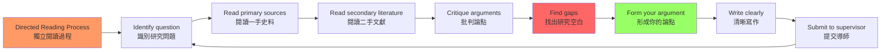
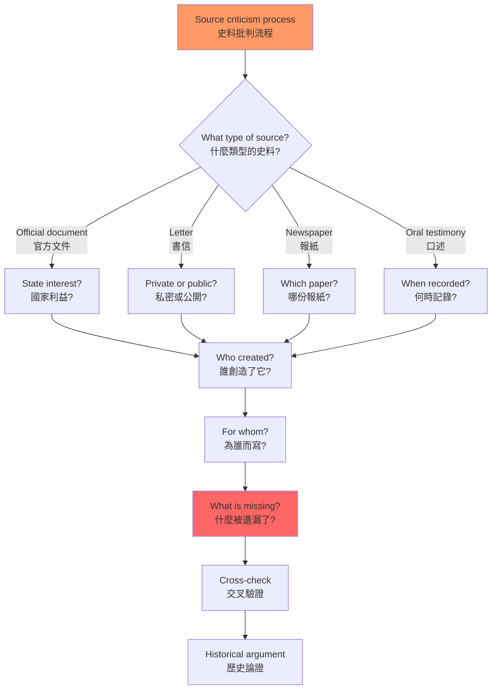
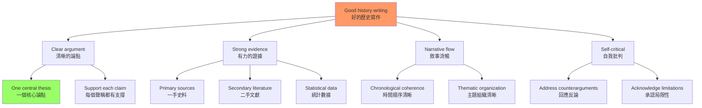

# HIST3075 獨立閱讀 / Directed Reading

**Instructor**: History Staff (individual faculty supervisor)
**Department**: History, HKU
**Official source**: [HKU History Course Description](https://history.hku.hk/ug_cd/), [HIST-2425.pdf](https://history.hku.hk/wp-content/uploads/2024/07/HIST-2425.pdf)
**Style**: 袁騰飛式 — 這是一個「方法論課程」——教你如何獨立做歷史研究，如何閱讀、如何思考、如何寫作

---

## 重要說明：這不是一個有固定內容的課程

HIST3075 的本質是：**一個由學生自主設計研究項目、在導師指導下進行的獨立閱讀課程**。根據 HKU 的官方描述：
- 這是一個「密集閱讀課程」（intensive reading course）
- 學生與導師共同協商研究方向和閱讀書單
- 每學期需完成不超過 5,000 字的論文
- 通常在第五學期或之後才能修讀，需提前獲得導師同意

因此，這個課程沒有「標準內容」——它的內容完全取決於你的研究興趣和導師的專業領域。

---

## 問題 1：5 個核心心智模型（獨立研究的元技能）

### 1. 歷史研究是對話，不是複製
**專家如何思考**: 做歷史研究不是「讀完書再寫論文」，而是與不同學者的觀點進行持續對話。好的研究者在閱讀時不斷問：「這個學者在回答什麼問題？他的證據是否充分？他的假設是什麼？」

- **典型導師**: 任何歷史學家都會教你這個——從 Edward Gibbon 的 *Decline and Fall of the Roman Empire* (1776-1789) 到 Joan Scott 的 *Gender and the Politics of History* (1988)
- **驗證方法**: 每讀一本書，嘗試用 200 字總結作者的核心論點，並找出至少一個你不同意的觀點

### 2. 史料批判是歷史研究的核心技能
**專家如何思考**: 歷史學家區分「一手史料」（primary sources，親歷者的記錄）和「二手史料」（secondary sources，後世學者的分析）。但更關鍵的是：任何史料都需要批判性閱讀——誰寫的？為什麼寫？給誰看？有什麼遺漏？

- **典型學者**: **Natalie Zemon Davis** — *The Return of Martin Guerre* (1983) 是史料批判的典範——她從一份 16 世紀法庭案件記錄中重建了一個驚人的歷史真相
- **驗證方法**: 找到一個史料片段，嘗試問 10 個關於其作者、背景、目的的問題

### 3. 建構研究問題比找答案更重要
**專家如何思考**: 好的歷史研究始於一個好的問題，而不是一個現成的答案。學者 **David Hackett Fischer** 在 *Historians' Fallacies* (1970) 中指出：最常見的研究錯誤是「先有答案再找證據」。

- **典型學者**: **Joan Scott** — *Gender and the Politics of History* (1988) 的核心貢獻不是發現了新史料，而是提出了一個更好的問題：「性別（gender）為什麼應該被視為歷史分析的工具？」
- **驗證方法**: 在開始研究之前，用 100 字寫下你的研究問題，並不斷問自己：「這個問題有歷史意義嗎？」

### 4. 歷史書寫是政治行為
**專家如何思考**: 歷史書寫從來不是「中性的」——誰的歷史被記住、誰的歷史被遺忘，是權力決定的。學者 **Michel-Rolph Trouillot** 在 *Silencing the Past* (1995) 中區分了「創造史料」（creation of sources）、「彙編史料」（assembly of sources）、「引導史料」（retrieval of sources）、「事後史料」（最后 sources after the fact）四個層次的「沉默」（silencing）。

- **典型學者**: **Michel-Rolph Trouillot** — *Silencing the Past: Power and the Production of History* (1995)
- **驗證方法**: 選擇一個你認為「被歷史遺忘」的群體，嘗試找出：他們為什麼被遺忘？誰的沉默創造了他們的缺席？

### 5. 寫作是思考的最後形式
**專家如何思考**: 你沒有真正理解一個歷史問題，直到你能用清晰的文字表達它。學者 **Peter Laslett** 說：「歷史是書面記錄的過去——沒有書面記錄就沒有歷史，而書面記錄不會自己說話。」

- **典型學者**: **E.H. Carr** — *What is History?* (1961) — 關於歷史寫作的經典之作
- **驗證方法**: 每週寫 500 字的讀書筆記，逼自己用清晰的語言表達複雜的歷史問題

---

## 問題 2：3 個根本分歧（歷史研究的認識論張力）

### 分歧 1：歷史的客觀性——可能嗎？
**核心問題**: 歷史學家能夠「客觀地」重構過去嗎？

- **學派A（實證主義）**: 歷史研究可以通過嚴格的史料批判和多重證據驗證，無限接近歷史真相
- **學派B（後現代主義）**: 所有歷史敘事都是主觀建構——歷史學家的性別、階級、國籍和意識形態都會影響他們對史料的選擇和解釋
- **學者代表**: **E.H. Carr** — *What is History?* (1961) vs **Hayden White** — *Metahistory* (1973)
- **驗證**: 同一個歷史事件（法國大革命、美國內戰、南京大屠殺）可以被不同歷史學家敘述為完全不同的故事

### 分歧 2：結構 vs 能動性——誰推動歷史？
**核心問題**: 歷史是「結構」（帝國主義、資本主義、氣候變化）決定的，還是個人選擇決定的？

- **學派A（結構主義）**: 馬克思主義者、全球史學家傾向於認為，歷史的主要驅動力是深層結構（階級、帝國、經濟體系）
- **學派B（能動性論）**: 微觀史學家、傳記史學家傾向於認為，個人選擇和行動可以改變歷史進程
- **學者代表**: **Fernand Braudel** — *The Mediterranean and the Mediterranean World in the Age of Philip II* (1949) vs **Carlo Ginzburg** — *The Cheese and the Worms* (1976)

### 分歧 3：歷史的當代相关性——歷史研究服務於誰？
**核心問題**: 歷史研究應該服務於當代政治目標，還是應該追求「為歷史而歷史」？

- **學派A（公共史學）**: 歷史研究應該有當代相關性——幫助我們理解當代問題、服務於社會正義
- **學派B（學院派）**: 歷史研究的首要目標是準確重建過去，而不是服務當代政治

---

## 問題 3：10 個深度問題（獨立研究的實踐指南）

1. 你如何識別一個「好」的歷史研究問題？好問題和壞問題的標準是什麼？請用一個具體例子說明。
2. 史料批判的基本步驟是什麼？「一手史料」和「二手史料」的區別在實踐中為什麼比看起來更複雜？
3. 歷史研究中的「意識形態介入」是什麼？你如何在保持批判性的同時避免讓自己的研究淪為宣傳？
4. **導師對話策略**：你如何與導師建立有效的學術對話？如何利用導師的專業知識來深化你的研究？
5. 歷史寫作的基本原則是什麼？什麼是「歷史敘事」（narrative）和「歷史分析」（analysis）的區別？你如何在兩者之間找到平衡？
6. **文獻檢索**：在 HKU 圖書館和數據庫中，歷史研究的關鍵檢索工具是什麼？你如何識別某個研究領域的「核心文獻」？
7. 「歷史記憶政治」是什麼？歷史記憶（memory）和歷史（history）之間的區別是什麼？請用一個具體例子說明。
8. **跨學科方法**：歷史研究如何從人類學（ethnography）、社會學（sociology）、文學批評（literary criticism）等學科中吸取營養？
9. 歷史寫作中的「反事實推理」（counterfactual reasoning）是什麼？什麼情況下它是合法的分析工具，什麼情況下它是偽裝成歷史的小說？
10. **學術誠信**：什麼是歷史研究中的抄襲？如何區分「借鑒」（building on others' work）和「抄襲」（taking credit for others' ideas）？

---

# 核心心智模型深化（中英對照）

## 1. 歷史研究是對話，不是複製

### 1.1 Bilingual 概念對照
| 英文 | 中文 | 歷史含義 | 實踐方法 |
|---|---|---|---|
| Historical dialogue | 歷史對話 | 與過去學者的持續對話 | 批評性閱讀 |
| Historiographical tradition | 史學傳統 | 學術界對過去的持續爭論 | 了解脈絡 |
| Scholarly conversation | 學術對話 | 在前人基礎上的建構 | 引用和回應 |
| Critical reading | 批判性閱讀 | 不接受任何未經驗證的聲稱 | 提問和懷疑 |

### 1.2 袁騰飛式犀利觀察
獨立閱讀課程最大的陷阱是：**你把「讀了很多書」當成「做了很多研究」**。

真正的歷史研究不是「讀完老師指定的書單再寫論文」——而是與書本的持續對話。你讀到一個學者的觀點，你立刻要問：他的證據從哪來？他的假設是什麼？他的結論會被其他學者接受嗎？這個問題在未來可能被什麼新的史料挑戰？

**歷史研究是登山，不是逛超市**——你需要不斷往上爬，與前面的研究者對話，才能看到新的風景。

### 1.3 圖解

---

## 2. 史料批判是歷史研究的核心技能

### 2.1 Bilingual 概念對照
| 英文 | 中文 | 歷史含義 | 實踐問題 |
|---|---|---|---|
| Primary source | 一手史料 | 親歷者的記錄 | 誰寫的？何時？為什麼？ |
| Secondary source | 二手史料 | 後世學者的分析 | 他的假設是什麼？ |
| Source criticism | 史料批判 | 系統性評估史料 | 偏見在哪？空白在哪？ |
| Bias detection | 偏見識別 | 找出作者的主觀傾向 | 他的立場是什麼？ |

### 2.2 圖解

---

## 3-5. 額外元技能

### 5.1 圖解：歷史寫作的藝術

---

# 深度自測問題詳解

## Q1 詳解：什麼是「好」的歷史研究問題
**核心答案**: 一個「好」的歷史研究問題需要滿足以下標準：① **有歷史意義**：這個問題涉及的過去，與我們理解現在有某種相關性；② **有研究空間**：現有文獻對這個問題沒有完整答案，或者存在明顯的分歧；③ **可以用現有史料回答**：不是純粹的猜測；④ **足够精確**：不是「法國大革命是什麼？」這種大而無當的問題，而是「法國革命期間女性的政治動員策略如何受到雅各賓派政策的影響？」

**壞問題的典型**: 「工業革命為什麼在英國發生？」——這個問題被問了幾百年，沒有單一答案，但也催生了大量精彩研究

## Q4 詳解：導師對話策略
與導師建立有效學術對話的關鍵：
- **在見導師之前**：準備好你的具體問題，列出你閱讀中遇到的困難和發現
- **見導師時**：不要只說「我讀了什麼」，要說「我對什麼有疑問」「我認為什麼是對的、什麼可能是錯的」
- **見導師後**：立即整理對話紀錄，並根據導師建議調整你的閱讀計劃

---

# 總結 / Closing 5-Point Deep Insights

1. **獨立閱讀是一種思維方式的訓練，不是知識的堆積**：讀多少書不重要，重要的是你能不能批判性地運用你所讀的書來回答你自己提出的問題。

2. **史料批判是歷史學區別於其他所有人文學科的根本技能**：每個學科都有文本，但只有歷史學發展出了系統性的史料批判方法。

3. **好的歷史研究問題是「問題」不是「主題」**：「我想研究香港歷史」不是研究問題；「香港的女性工廠工人如何在 1960 年代應對童工問題？」才是研究問題。

4. **寫作是思考的最後形式**：如果你不能用清晰的文字表達你的歷史論點，你的思考就不够清晰。

5. **獨立研究是歷史學家最重要的能力**：歷史系的職業訓練目標不是「記住很多歷史事實」，而是「獨立建構歷史論點的能力」——這種能力適用於任何需要分析和寫作的職業。

**自學建議**: 配合 E.H. Carr 的 *What is History?* + Natalie Zemon Davis 的 *The Return of Martin Guerre* + Michel-Rolph Trouillot 的 *Silencing the Past*，輸出讀書筆記到 `06_Reading_Notes/`。
