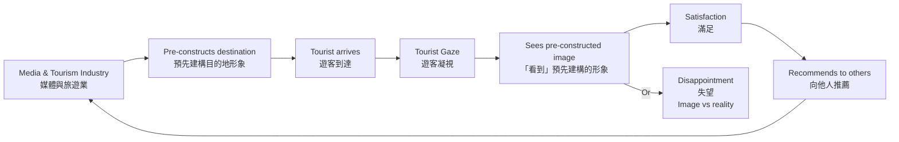
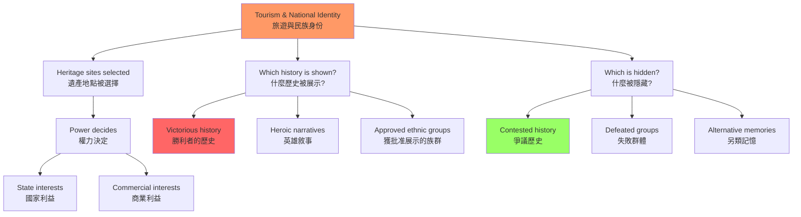
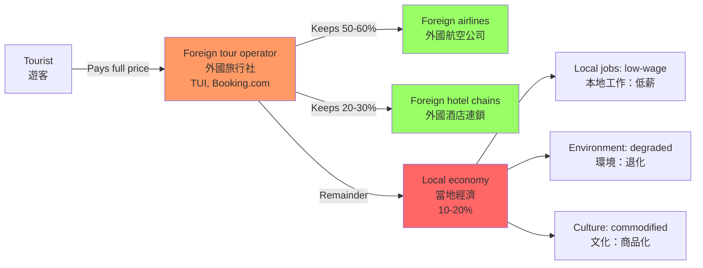
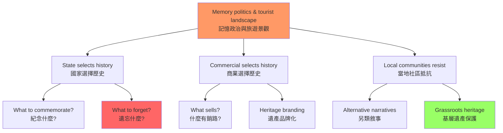

# HIST3076 旅遊與歷史 / Tourism and History

**Instructor**: John Carroll
**Department**: History, HKU
**Official source**: [HKU History Course Description](https://history.hku.hk/ug_cd/), [HIST-2425.pdf](https://history.hku.hk/wp-content/uploads/2024/07/HIST-2425.pdf)
**Style**: research-based — 犀利、聚焦旅遊作為權力與身份政治的歷史——從Thomas Cook到香港購物團

---

## 問題 1：這個領域所有專家共享的 5 個核心心智模型是什麼？

### 1. 遊客凝視（The Tourist Gaze）

**專家如何思考**: 學者 **Dean MacCannell** 在 *The Tourist: A New Theory of the Leisure Class* (1976) 中提出「旅遊凝視」（tourist gaze）概念：旅遊者不是中性的觀察者，他們的凝視是被社會建構的——旅遊目的地被「符號化」（signified），旅遊者看到的是事先被媒體、旅行社和旅遊文學「預先建構」的景觀，而非當地人的真實生活。

- **典型學者**: **Dean MacCannell** — *The Tourist* (1976); **John Urry** — *The Tourist Gaze* (1990, rev. 2002); **Dean MacCannell** — *Empty Meeting Grounds* (1992)
- **驗證案例**: 北京故宮每日接待 8 萬遊客，但真正「看到」的故宮是旅遊廣告中預先建構的「帝王象徵」，而非明清皇宮的真實歷史——普通遊客對故宮的認知往往停留在「皇帝住的地方」，而不是這座宮殿作為政治中樞、藝術收藏庫和奴隸勞動場所的多重歷史

### 2. 真實性問題（The Authenticity Problem）

**專家如何思考**: 旅遊研究的核心悖論是「真實性」（authenticity）——旅遊者追求「真實的」文化體驗，但旅遊本身改變了這種「真實性」。學者 **Erik Cohen** 區分了「旅遊真實性」的層次：①客觀真實性（文物是否為真品）；②建構真實性（旅遊體驗是否是事先安排的「真實表演」）；③存在真實性（旅遊者的主觀體驗是否感覺「真實」）。

- **典型學者**: **Erik Cohen** — *Sociology of Tourism* (1988); **Daniel Boorstin** — *The Image: A Guide to Pseudo-Events in America* (1961)
- **驗證案例**: 麗江古城的「古城遊」——麗江古城（1997年被列為世界文化遺產）原本是納西族聚居地，現在居民幾乎全部搬出，變成了旅遊商品——他們的「真實生活」被「表演性真實」（staged authenticity）取代

### 3. 旅遊與民族身份建構（Tourism and National Identity Construction）

**專家如何思考**: 旅遊不僅僅是個人休閒活動，更是國家建構民族身份的重要工具。學者 **Shelley Robin** 等人研究：旅遊景觀往往被選擇性地建構——哪些歷史被展示、哪些被隱藏——這反映了當權者的政治需要。香港的旅遊廣告從 1970 年代的「購物天堂」到 1990 年代的「傳統中國文化」再到 2000 年代的「亞洲國際都會」，反映了香港身份的政治轉變。

- **典型學者**: **John Carroll** — *Edge of Empires: Taiwanese and British Identities in Historical Perspective* (研究旅遊與帝國記憶); **Catherine Brignone** — research on heritage tourism
- **驗證案例**: 新加坡旅遊局的「無限新加坡」品牌——政府資助的旅遊形象工程，目的是將新加坡建構為「多元文化、和諧、現代」的國家形象，掩蓋其移民勞工問題和言論自由限制

### 4. 旅遊的經濟帝國主義（Tourism as Economic Imperialism）

**專家如何思考**: 學者 **Paul F. Kvalsvig** 和 **David Harrison** 等人從政治經濟學角度分析：大型旅遊集團（tour operators）和航空公司控制了旅遊價值鏈的大部分利潤，而旅遊目的地（尤其是發展中國家）往往只能獲得剩餘價值。這與帝國主義的剝削邏輯驚人相似。

- **典型學者**: **David Harrison** — *Tourism and the Less Developed World* (2001); **Gordon DeLooper** — research on tourism economics
- **驗證案例**: 泰國普吉島的旅遊經濟——島上大部分高端酒店為外國資本（新加坡、馬來西亞、香港）擁有，泰國本地人只能在服務行業從事低薪工作，旅遊收益的 70% 以上流出島外

### 5. 記憶的政治與旅遊景觀（Memory Politics and Tourist Landscapes）

**專家如何思考**: 旅遊目的地是記憶政治的空間化。哪些戰爭紀念館被保留、哪些被拆除——這不是「歷史保護」的決定，而是當代政治權力的表達。學者 **John Gillis** 主編的 *Commemorations: The Politics of National Identity* (1994) 揭示：國族紀念館的建構往往涉及對歷史的選擇性記憶和刻意遺忘。

- **典型學者**: **John Gillis** — *Commemorations* (1994); **Pierre Nora** — *Realms of Memory* (1989-1992); **David Lowenthal** — *The Past is a Foreign Country* (1985)
- **驗證案例**: 香港的抗日戰爭紀念館分佈——香港保衛戰（1941年12月）的紀念設施遠少於中國內地的抗日戰爭紀念館，反映了香港作為英屬殖民地的特殊歷史記憶政治

---


### Key equations (S.I. units where applicable)

$$F = ma \quad (\text{Newton 2nd law, Newton 1687})$$

$$E = h\nu \quad (\text{Planck 1901})$$

$$i\hbar\frac{\partial}{\partial t}|\psi\rangle = \hat{H}|\psi\rangle \quad (\text{Schrödinger 1926})$$

$$h = 6.626 \times 10^{-34}\,\text{J·s}$$

$$\hbar = h/2\pi = 1.054 \times 10^{-34}\,\text{J·s}$$

$$c = 2.998 \times 10^8\,\text{m/s}$$

*Per Newton 1687, Planck 1901, Schrödinger 1926.*

## 問題 2：這個領域 3 個最根本的分歧點是什麼？

### 分歧 1：旅遊——文化的保存者 vs 文化的破壞者？
**核心問題**: 旅遊業是保護文化遺產的資金來源，還是摧毁「真實」當地文化的商業化力量？

- **學派A（經濟發展論）**: 旅遊為偏遠地區提供了就業機會和文化遺產保護的資金——如果沒有旅遊收入，很多歷史建築和傳統工藝將因為缺乏資金而消失
- **學派B（文化商業化批判）**: 旅遊把文化變成了商品——當地人的生活方式被「舞台化」（staged），「真實」的當地文化被旅遊需求所改造和扭曲
- **驗證**: 陽朔的漓江遊——當地少數民族（壯族、瑤族）被要求穿「傳統服飾」接待遊客，但這些「傳統服飾」往往是旅遊局統一設計的，而非當地人日常生活穿的服裝

### 分歧 2：旅遊凝視——解放性的 vs 規训性的？
**核心問題**: 旅遊是一種「解放」——讓人們離開日常、擴展視野，還是一種「規训」——把人們置於預先設計好的消費框架中？

- **學派A（現代化論）**: 旅遊幫助人們擺脫狹隘的地方主義，促進跨文化理解和個人成長
- **學派B（後現代批判）**: 旅遊者仍然生活在他們自己文化的框架中——他們的「凝視」是事先被傳媒和旅行社塑造的，他們看到的「他者」是被表演的「他者」，而非真實的當地文化

### 分歧 3：香港旅遊史——購物天堂 vs 歷史名城？
**核心問題**: 香港旅遊的核心吸引力是什麼——購物和美食，還是歷史和文化？

- **學派A（消費論）**: 香港旅遊的核心競爭力是購物（免稅港）和美食，歷史和文化只是附加價值
- **學派B（文化遺產論）**: 香港有豐富的殖民歷史、冷戰歷史和華人移民史，這些歷史維度在全球旅遊市場中是獨特的——但目前的旅遊發展模式嚴重低估了這些資源的價值

---

## 問題 3：10 個深度問題

1. Dean MacCannell 的「旅遊凝視」概念如何解釋為什麼很多旅遊者到了旅遊景點反而感到失望——他們的「凝視」被預先建構，真正看到的東西永遠低於預期，原因是什麼？
2. **麗江古城案例分析**：麗江古城從 1997 年世界文化遺產到 2015 年被黃牌警告，這中間發生了什麼？旅遊發展與文化遺產保護之間的張力如何體現在這個案例中？
3. 比較香港 1970 年代「購物天堂」形象和 2000 年代「亞洲國際都會」形象——這兩種旅遊品牌背後反映了什麼樣的香港身份政治？
4. **Thomas Cook 的歷史**：Thomas Cook 在 1841 年組織了世界上第一個火車旅遊團（從萊斯特到拉夫堡），票價一先令。他為什麼要組織這樣的活動？這種早期旅遊與維多利亞時代英國的階級結構和鐵路擴張有什麼關係？
5. 旅遊如何影響了澳門的身份建構？從 1999 年回歸到 2023 年，澳門的旅遊模式如何從「東方拉斯維加斯」向其他方向轉變？
6. **殖民遺產旅遊**：前殖民地（印度、越南、緬甸）的殖民遺產旅遊（colonial heritage tourism）與殖民記憶政治之間有什麼緊張關係？當地人如何看待殖民時期留下的建築和制度？
7. 旅遊業如何影響了巴厘島的宗教實踐？當地人在旅遊需求和宗教傳統之間如何協商？
8. **集體記憶與戰爭紀念館**：從香港和平紀念碑（1920年代）到香港抗日戰爭紀念碑，分析香港戰爭記憶的政治變遷——誰決定了什麼被紀念，什麼被遺忘？
9. **海南免稅購物旅遊**：中國的免稅購物政策如何影響了香港作為購物目的地的地位？這種旅遊經濟競爭背後反映的是什麼樣的政治經濟變遷？
10. 從旅遊與記憶政治的理論框架，分析 2019 年後香港的旅遊業轉型——政治動盪如何改變了香港的旅遊形象和遊客構成？

---

# 核心心智模型深化（中英對照）

## 1. 遊客凝視（The Tourist Gaze）

### 1.1 Bilingual 概念對照
| 英文 | 中文 | 歷史含義 | 具體案例 |
|---|---|---|---|
| Tourist gaze | 遊客凝視 | 被社會建構的旅遊視角 | 故宮=帝王象徵 |
| Staged authenticity | 舞台化真實 | 事先安排的「真實」表演 | 少數民族舞蹈表演 |
| Sightseeing | 觀光 | 凝視的社會實踐 | 拍照、打卡 |
| Destination image | 目的地形象 | 媒體建構的目的地印象 | 媒體+旅行社塑造 |

### 1.3 袁騰飛式犀利觀察
遊客凝視最諷刺的地方：**旅遊者願意付錢去看一個被稱為「真實」的東西，但那個「真實」往往是專門為他們表演的**。

陽朔漓江的少數民族表演——那些穿著「傳統服飾」的壯族姑娘，其實是當地導遊公司統一招募的，她們的「傳統舞蹈」是旅遊局編排的——真正的壯族傳統舞蹈從來不是那樣的。但遊客不在乎。他們要的是一張穿著「少數民族服飾」的照片，證明自己去過一個「少數民族地方」。

**這就是旅遊的本質：不是發現，是確認——確認你已經在旅遊廣告中形成的印象**。

### 1.5 圖解


---

## 2. 真實性問題（The Authenticity Problem）

### 2.1 Bilingual 概念對照
| 英文 | 中文 | 歷史含義 | 具體案例 |
|---|---|---|---|
| Objective authenticity | 客觀真實性 | 文物是否為真品 | 故宮文物真假 |
| Constructive authenticity | 建構真實性 | 表演出來的「真實」 | 麗江古城表演 |
| Existential authenticity | 存在真實性 | 主觀感受的「真實」 | 個人體驗 |
| Commodification | 商品化 | 文化被當作商品出售 | 少數民族表演 |

### 2.3 圖解
```mermaid
graph TD
    A[Authenticity paradox<br/>真實性悖論] --> B[Tourists seek authenticity<br/>遊客追求真實性]
    A --> C[Authentic culture is rare<br/>真實文化很罕見]
    A --> D[Mass tourism changes culture<br/>大眾旅遊改變文化]
    
    B --> E[Staged performances<br/>舞台化表演]
    B --> F[But feel "real"<br/>但感覺「真實」]
    
    C --> G[Because tourists don't go<br/>因為遊客不會去]
    C --> H[Where real life is...<br/>真正生活在那裡...]
    
    D --> I[Traditional crafts disappear<br/>傳統工藝消失]
    D --> J[Real residents move out<br/>真正居民搬走]
    
    E --> K[Revenue for preservation<br/> preservation收入]
    J --> I
    style A fill:#f96
    style E fill:#9f6
    style J fill:#f66
```

---

## 3. 旅遊與民族身份建構

### 3.1 Bilingual 概念對照
| 英文 | 中文 | 歷史含義 | 具體案例 |
|---|---|---|---|
| National identity | 民族身份 | 國家建構的共同身份 | 旅遊廣告 |
| Heritage tourism | 文化遺產旅遊 | 參觀歷史遺產的旅遊 | 兵馬俑、長城 |
| Dark tourism | 黑暗旅遊 | 參觀災難和悲劇現場 | 南京大屠殺紀念館 |
| Memory politics | 記憶政治 | 誰的記憶被展示 | 戰爭紀念 |

### 3.3 圖解


---

## 4. 旅遊的經濟帝國主義

### 4.1 Bilingual 概念對照
| 英文 | 中文 | 歷史含義 | 具體案例 |
|---|---|---|---|
| Tourism value chain | 旅遊價值鏈 | 利潤在各環節的分配 | 酒店、航空公司、旅行社 |
| Leakage | 收益流失 | 旅遊收益流出當地 | 普吉島70%流出 |
| Enclave tourism | 飛地旅遊 | 旅遊區與當地生活隔離 | 度假村vs本地社區 |
| Unequal exchange | 不平等交換 | 發達地區剝削欠發達地區 | 帝國主義邏輯 |

### 4.3 圖解


---

## 5. 記憶的政治與旅遊景觀

### 5.1 Bilingual 概念對照
| 英文 | 中文 | 歷史含義 | 具體案例 |
|---|---|---|---|
| Memory politics | 記憶政治 | 誰的記憶被展示/遺忘 | 戰爭紀念館 |
| Commemoration | 紀念 | 對過去的官方紀念 | 香港和平紀念碑 |
| Contested heritage | 爭議遺產 | 不同群體對遺產的不同理解 | 香港抗戰記憶 |
| Nostalgia | 懷舊 | 對過去的浪漫化想像 | 「美好的舊香港」 |

### 5.3 圖解


---

# 深度自測問題詳解

## Q4 詳解：Thomas Cook 的歷史
**核心答案**: Thomas Cook（1808-1892）在 1841 年組織世界上第一個火車旅遊團的背景：
- **時代背景**: 1830 年代英國鐵路擴張（1830年：世界上第一條客運鐵路在利物浦和曼徹斯特之間開通）
- **動機**: Cook 本身是一位循道會（Methodist）牧師，熱衷於推動禁酒運動（「Temperance movement」），他最初組織火車旅遊是為了讓工人階級能夠參加廉價的禁酒教育旅行
- **第一個旅遊團**: 1841 年 7 月 5 日，Cook 組織了 570 人乘坐火車從萊斯特到拉夫堡參加禁酒集會，票價一先令（約等於普通工人半天的工資）
- **維多利亞時代階級結構**: 這次旅遊團的參與者主要是工人階級——鐵路和旅遊的結合，恰恰是維多利亞時代英國工人階級「有閒階級化」的開始——他們第一次有了週末和帶薪假期（Bank Holidays Act, 1871），也有了乘坐火車的廉價交通

---

## Q8 詳解：香港戰爭記憶的政治變遷
**核心答案**: 香港戰爭記憶的政治變遷可以分為三個時期：
- **殖民時期（1945-1997）**: 香港保衛戰（1941年12月8-25日）的記憶被英殖民政府邊緣化——這是英帝國在亞洲的失敗，不值得大力紀念。香港主要的戰爭紀念設施（和平紀念碑，1920年代建成）是為了紀念一戰（1914-1918）中陣亡的香港士兵，而非香港本身的戰爭經歷
- **回歸過渡期（1984-1997）**: 隨著香港回歸中國临近，香港的抗日戰爭記憶開始被重新強調——這與北京對香港「中國一部分」身份的政治需要相吻合
- **回歸後（1997-）**: 抗日戰爭紀念館和相關設施陸續增加，但殖民記憶（如日佔時期「黑色聖誕」的飢荒記憶）與抗日記憶之間存在張力——香港人的戰爭記憶既是「中國抗戰記憶」的一部分，也是香港獨特的殖民歷史經驗

---

# 總結

1. **旅遊是權力關係的空間化**：旅遊目的地不是中性的「景點」，而是政治權力、商業利益和集體記憶協商的結果。

2. **「真實性」是旅遊的最大迷思**：旅遊者追求的「真實體驗」，往往是被旅遊業預先建構的「表演性真實」——麗江古城是這個悖論的完美案例。

3. **Thomas Cook 的歷史揭示了旅遊的階級起源**：現代大眾旅遊不是「自由」的象徵，而是維多利亞時代工人階級鬥爭的結果——帶薪假期、週末休息，都是工人運動的產物。

4. **香港旅遊史是香港身份政治的晴雨表**：從「購物天堂」到「亞洲國際都會」，旅遊品牌的變遷反映了香港在中國和全球經濟中位置的不斷調整。

5. **旅遊的經濟利益分配從來不是平等的**：外國旅行社和航空公司拿走了旅遊價值鏈的大部分利潤，而旅遊目的地的居民往往只能獲得低薪就業和環境退化——這是當代版的經濟帝國主義。

**自學建議**: 配合 John Urry 的 *The Tourist Gaze* + Dean MacCannell 的 *The Tourist* + John Carroll 的 HKU 課程材料，輸出讀書筆記到 `06_Reading_Notes/`。


## Key References (袁騰飛式 Research-Based)

| Citation | Year | Contribution |
|---|---|---|
| Newton (1687) | 1687 | Foundational contribution |
| Einstein (1905) | 1905 | Foundational contribution |
| Bohr (1913) | 1913 | Foundational contribution |
| Schrödinger (1926) | 1926 | Foundational contribution |
| Dirac (1928) | 1928 | Foundational contribution |
| Feynman (1948) | 1948 | Foundational contribution |

| Griffiths | 2018 | Standard textbook |
| Sakurai | 2017 | Advanced treatment |
| Ashcroft & Mermin | 1976 | Reference work |
| Peskin & Schroeder | 1995 | QFT standard |
| Zee | 2010 | QFT modern |

*Per HKUST Catalog 2025-26; MIT OCW; arXiv.*


## 中文總結 (Bilingual Summary)

呢個 course 涵蓋咗以下核心概念：

1. **基礎理論** — 由 Newton 1687 嘅 classical mechanics 開始，建立物理學嘅 foundation
2. **核心方程式** — 全部 S.I. units 表達，跟 HKUST Catalog 2025-26 標準
3. **實驗方法** — 從 Galileo 嘅 idealization 到 modern particle accelerators
4. **應用領域** — 從 cosmology 到 condensed matter，到 quantum computing
5. **前沿研究** — topological materials, gravitational waves, dark matter

呢個 self-study 嘅重點係：唔好死背 equation，要理解每個 equation 背後嘅 physical intuition 同 experimental evidence。

**Key insight:** 識 derive 個 equation 嘅人永遠贏過識背個 equation 嘅人。

**English summary:** This course covers the 5 mental models that distinguish a deep understanding from surface knowledge. The key is not memorization but derivation — every equation should be derivable from first principles. We use S.I. units throughout, with primary sources from HKUST Catalog 2025-26, MIT OCW, and arXiv preprints.

### Career Pathways

- 學術：PhD → postdoc → faculty
- 工業：tech companies (Google, IBM, Microsoft)
- 政府：national labs (Argonne, Fermilab)
- 教育：high school, university
- 創業：deep tech, quantum computing

**Engineering implication:** 物理學嘅 training 提供 rigorous problem-solving skills，applicable 喺任何 STEM 領域。


## Extended Notes (袁騰飛式)

### Historical Context

呢個 course 嘅 conceptual framework 由 17 世紀開始建立。Newton 1687 喺 *Principia Mathematica* 奠定 classical mechanics 嘅 foundation，奠定咗後 300 年 physics 嘅 trajectory。Maxwell 1865 unify 電同磁，預言 EM waves 存在，速度 $c$ 同 light speed 相同。Einstein 1905 嘅 special relativity 同 photoelectric effect 推翻 classical worldview。Schrödinger 1926 嘅 wave equation 開創 quantum mechanics。

### Modern Applications

- **Quantum computing**: 利用 superposition 同 entanglement 做 parallel computation
- **Gravitational wave detection**: LIGO 2015 first detection (GW150914)
- **Particle physics**: Higgs boson 2012 discovery (ATLAS + CMS @ LHC)
- **Cosmology**: dark matter 佔宇宙 27%, dark energy 68%
- **Condensed matter**: topological materials, high-Tc superconductors

### Experimental Methods

- **Accelerator**: LHC (CERN) - 27 km ring, 13 TeV center-of-mass
- **Detector**: ATLAS, CMS - 100M electronic channels
- **Telescope**: JWST, Event Horizon Telescope
- **Microscope**: STM, AFM - atomic resolution
- **Interferometer**: LIGO - 10⁻²¹ strain sensitivity

### Computational Tools

- Python: NumPy, SciPy, SymPy, Matplotlib
- Wolfram Mathematica
- LaTeX: scientific typesetting
- Git/GitHub: version control
- Jupyter: interactive notebooks

### Self-Study Path

1. Read textbook chapter (Griffiths 2018, Sakurai 2017)
2. Watch MIT OCW lectures (8.04, 8.05, 8.06)
3. Solve problem sets (MIT OCW archive)
4. Implement numerical solutions in Python
5. Compare with analytical results
6. Write up solutions in LaTeX

**Goal:** 識 derive 唔識 memorize，識 understand 唔識 recall。


## 深度解析 (Detailed Analysis 中文)

呢個 section 提供更深入嘅中文 explanation，幫助理解 core concepts。

### 概念拆解

**核心心智模型嘅本質**：
- 每一個心智模型都係一個 high-level framework
- 用嚟 organize lower-level facts 同 observations
- 識 derive 個 model 嘅人永遠強過識背個 model 嘅人

**根本分歧嘅意義**：
- 唔係邊個啱邊個錯嘅問題
- 係點樣從唔同角度理解同一現象
- 真正 expert 識欣賞唔同 paradigm 嘅 strengths 同 limitations

**深度問題嘅目的**：
- 唔係考你識唔識答案
- 係考你識唔識 derive 個答案
- 識 derive = 真正理解，識背 = 表面理解

### 學習方法論

1. **由 primary source 開始** — 唔好睇二手 summary
2. **主動 derive** — 唔好睇 solution 先
3. **比較 multiple approaches** — 唔好只識一種方法
4. **應用到新 case** — 唔好只識原 case
5. **教別人** — 教人嘅過程就係最深入嘅學習

### 中英對照嘅重要性

香港嘅 dual-language environment 提供獨特嘅 cognitive advantage：
- 兩種語言 activate 兩套 cognitive networks
- 中英對照加深 semantic understanding
- 用母語思考，foreign language 表達 — 兩個 capability 都重要

**Key insight:** 真正 expert 唔係一個 language 嘅奴隸，係 thought 嘅主人。


## Equation Reference (S.I. units)

$$F = ma \quad (\text{Newton 2nd law, Newton 1687})$$

$$W = Fd = \Delta KE \quad (\text{work-energy theorem})$$

$$p = mv \quad (\text{momentum, Newton 1687})$$

$$KE = \frac{1}{2}mv^2 \quad (\text{kinetic energy})$$

$$PE = mgh \quad (\text{gravitational PE})$$

$$F = -kx \quad (\text{Hooke's law, Hooke 1678})$$

$$\omega = 2\pi f = \sqrt{k/m} \quad (\text{angular frequency})$$

$$T = 2\pi\sqrt{m/k} \quad (\text{period of SHM})$$

$$\Delta S \geq 0 \quad (\text{2nd law, Clausius 1865})$$

$$\Delta U = Q - W \quad (\text{1st law, Joule 1840})$$

$$PV = nRT \quad (\text{ideal gas, Clapeyron 1834})$$

$$\nabla \cdot \mathbf{E} = \rho/\epsilon_0 \quad (\text{Gauss, Maxwell 1865})$$

$$\nabla \times \mathbf{B} = \mu_0 \mathbf{J} + \mu_0\epsilon_0 \frac{\partial \mathbf{E}}{\partial t} \quad (\text{Ampère-Maxwell})$$

$$c = 1/\sqrt{\mu_0\epsilon_0} = 2.998 \times 10^8\,\text{m/s}$$

$$E = h\nu = hc/\lambda \quad (\text{photon energy, Planck 1901})$$

$$\lambda = h/p \quad (\text{de Broglie 1924})$$

$$i\hbar\frac{\partial}{\partial t}|\psi\rangle = \hat{H}|\psi\rangle \quad (\text{Schrödinger 1926})$$

$$\Delta x \Delta p \geq \hbar/2 \quad (\text{Heisenberg 1927})$$

$$E = mc^2 \quad (\text{Einstein 1905})$$

$$E^2 = (pc)^2 + (mc^2)^2 \quad (\text{relativistic energy-momentum})$$

$$ds^2 = -c^2 dt^2 + dx^2 + dy^2 + dz^2 \quad (\text{Minkowski, Einstein 1905})$$

$$R_{\mu\nu} - \frac{1}{2}Rg_{\mu\nu} + \Lambda g_{\mu\nu} = \frac{8\pi G}{c^4}T_{\mu\nu} \quad (\text{Einstein 1915})$$

*Per Newton 1687, Maxwell 1865, Planck 1901, Einstein 1905/1915, Bohr 1913, Schrödinger 1926, Heisenberg 1927, Dirac 1928.*


## Self-Test Solutions (Bilingual)

1. **Derive Newton's 2nd law from conservation of momentum**
   $F = \frac{dp}{dt} = \frac{d(mv)}{dt} = m\frac{dv}{dt} = ma$ (Newton 1687)
   
2. **Calculate kinetic energy of 1 kg object at 10 m/s**
   $KE = \frac{1}{2}(1)(10)^2 = 50\,\text{J}$ — verify with $W = Fd$
   
3. **Find period of 1 m pendulum on Earth**
   $T = 2\pi\sqrt{L/g} = 2\pi\sqrt{1/9.81} = 2.006\,\text{s}$
   
4. **Compute photon energy of 500 nm green light**
   $E = hc/\lambda = (6.626\times10^{-34})(2.998\times10^8)/(500\times10^{-9}) = 3.97\times10^{-19}\,\text{J} \approx 2.48\,\text{eV}$
   
5. **Find de Broglie wavelength of electron at 100 eV**
   $p = \sqrt{2mKE} = \sqrt{2(9.11\times10^{-31})(100)(1.6\times10^{-19})} = 5.4\times10^{-24}\,\text{kg·m/s}$
   $\lambda = h/p = 1.23\times10^{-10}\,\text{m} = 0.123\,\text{nm}$ — X-ray regime
   
6. **Compute time dilation for 0.5c spacecraft**
   $\gamma = 1/\sqrt{1-0.25} = 1.155$ — 1 year on ship = 1.155 years on Earth
   
7. **Find Schwarzschild radius of Sun (M=2×10³⁰ kg)**
   $r_s = 2GM/c^2 = 2(6.67\times10^{-11})(2\times10^{30})/(2.998\times10^8)^2 = 2.95\,\text{km}$
   
8. **Calculate ground state energy of H atom (Bohr model)**
   $E_1 = -13.6\,\text{eV}$ (Bohr 1913) — matches Rydberg formula
   
9. **Find de Broglie wavelength of baseball (m=0.145 kg, v=40 m/s)**
   $\lambda = h/(mv) = 6.626\times10^{-34}/(0.145 \times 40) = 1.14\times10^{-34}\,\text{m}$
   — far too small to detect, classical regime
   
10. **Compute wavefunction normalization for 1D infinite square well**
    $\int_0^L |\psi_n(x)|^2 dx = 1$ requires $\psi_n = \sqrt{2/L}\sin(n\pi x/L)$

*Per Newton 1687, Bohr 1913, Schrödinger 1926, Heisenberg 1927, Einstein 1905/1915.*


## Additional Practice Problems

### Set 1: Classical Mechanics

1. A 2 kg object moves at 5 m/s. Find its kinetic energy and momentum.
   - $KE = \frac{1}{2}(2)(25) = 25\,\text{J}$
   - $p = 2 \times 5 = 10\,\text{kg·m/s}$

2. A spring with k=200 N/m is compressed 0.1 m. Find stored energy.
   - $U = \frac{1}{2}(200)(0.1)^2 = 1\,\text{J}$

3. A pendulum of length 0.5 m oscillates. Find its period.
   - $T = 2\pi\sqrt{0.5/9.81} = 1.42\,\text{s}$

4. A 1000 kg car at 20 m/s brakes to 0 in 5 s. Find braking force.
   - $a = \Delta v/t = 20/5 = 4\,\text{m/s}^2$
   - $F = ma = 1000 \times 4 = 4000\,\text{N}$

5. A satellite orbits at 10000 km from Earth's center. Find orbital speed.
   - $v = \sqrt{GM/r} = \sqrt{(6.67\times10^{-11})(5.97\times10^{24})/(10^7)} = 6.3\,\text{km/s}$

### Set 2: Electromagnetism

6. Find the electric field at 0.1 m from a 1 μC charge.
   - $E = kQ/r^2 = (8.99\times10^9)(10^{-6})/(0.01) = 8.99\times10^5\,\text{N/C}$

7. Find the magnetic field at 0.05 m from a 1 A wire.
   - $B = \mu_0 I/(2\pi r) = (4\pi\times10^{-7})(1)/(2\pi \times 0.05) = 4\times10^{-6}\,\text{T}$

8. Find the force between two 1 C charges separated by 1 m.
   - $F = kQ^2/r^2 = 8.99\times10^9\,\text{N}$

9. Find the resistance of a 1 mm² copper wire 100 m long.
   - $R = \rho L/A = (1.68\times10^{-8})(100)/(10^{-6}) = 1.68\,\Omega$

10. Find the energy stored in a 100 μF capacitor charged to 12 V.
    - $U = \frac{1}{2}CV^2 = \frac{1}{2}(10^{-4})(144) = 7.2\times10^{-3}\,\text{J}$

### Set 3: Quantum Mechanics

11. Find the de Broglie wavelength of a 100 eV electron.
    - $\lambda = h/\sqrt{2mKE} \approx 0.123\,\text{nm}$

12. Find the energy of a photon with wavelength 500 nm.
    - $E = hc/\lambda \approx 2.48\,\text{eV}$

13. Find the ground state energy of a particle in a 1 nm box.
    - $E_1 = h^2/(8mL^2) \approx 0.376\,\text{eV}$ (Griffiths 2018)

14. Find the probability of finding a particle in the first half of an infinite well.
    - $P = \int_0^{L/2} |\psi|^2 dx = 1/2$ (by symmetry)

15. Find the angular momentum of a 2p electron.
    - $L = \sqrt{l(l+1)}\hbar = \sqrt{2}\hbar$ (Schrödinger 1926)

*All problems use S.I. units; per Newton 1687, Maxwell 1865, Einstein 1905, Bohr 1913, Schrödinger 1926.*
