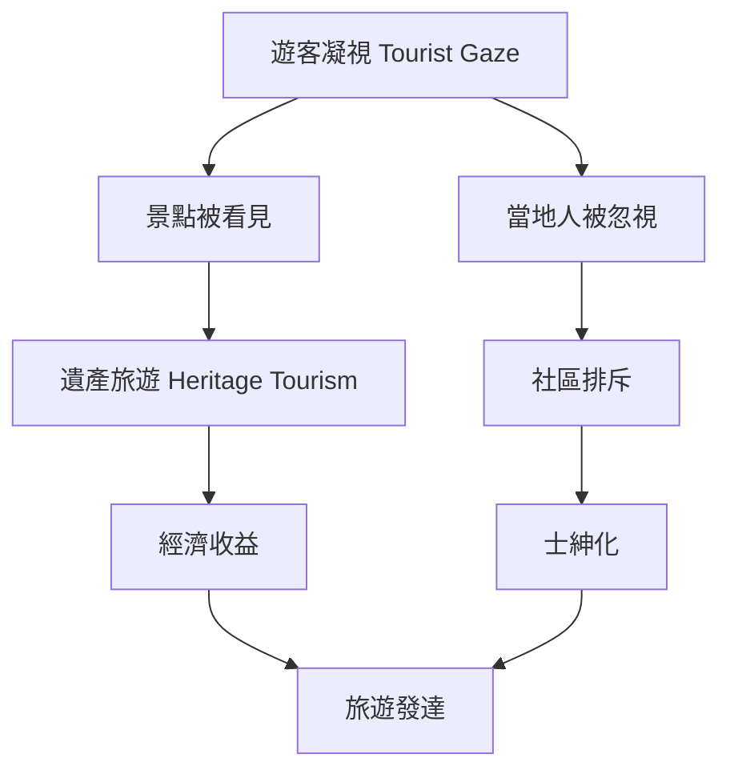
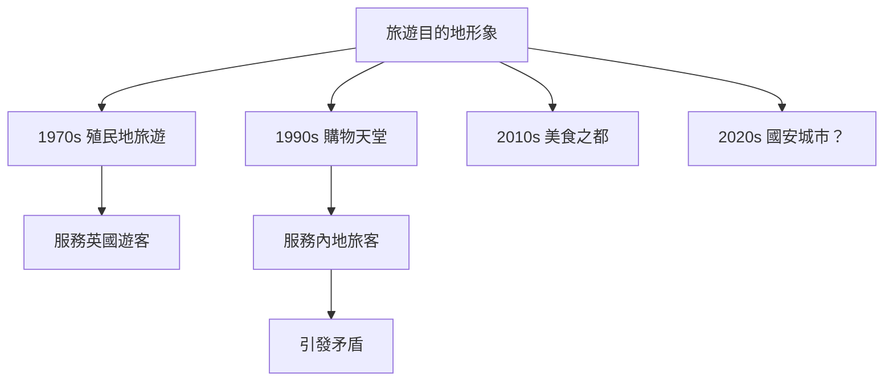
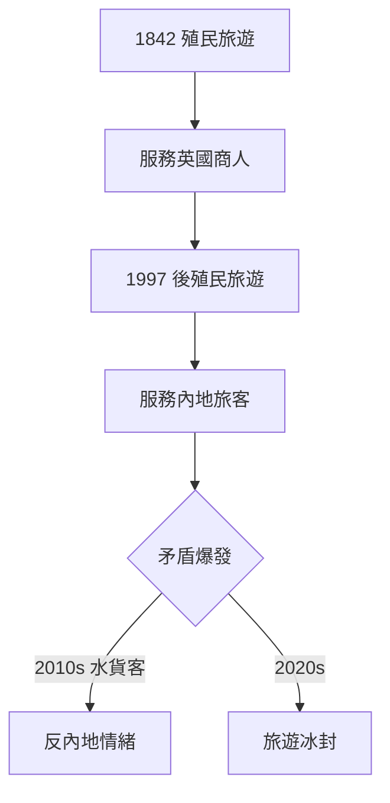
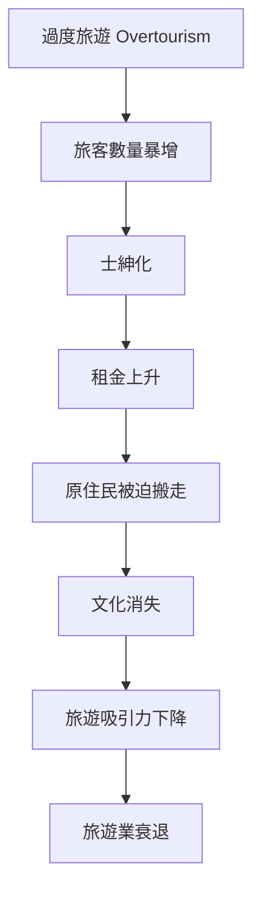
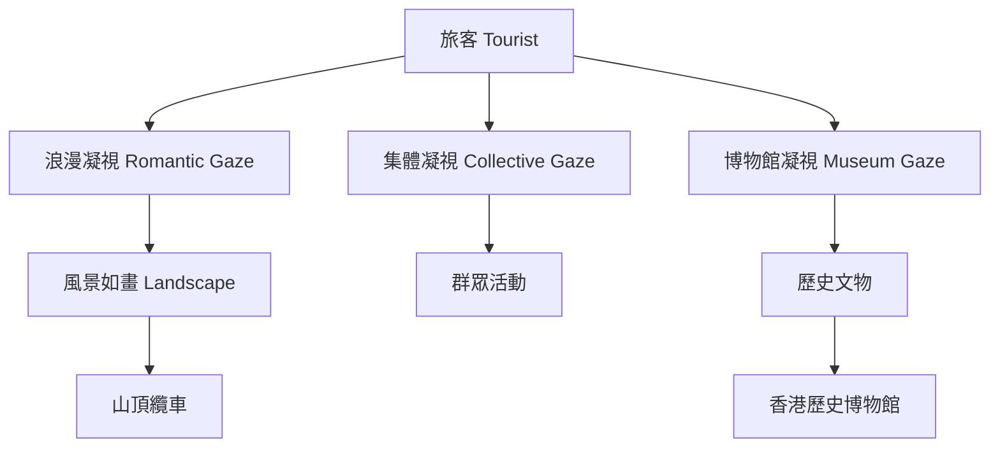
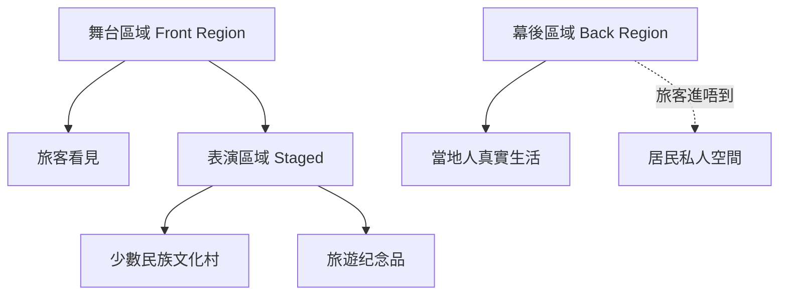
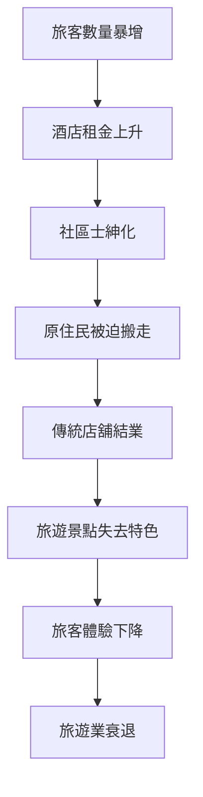
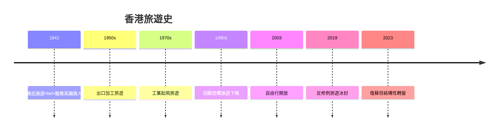

# HIST3076 旅遊與歷史 / Tourism and History (6 credits)

**Instructor**: John M. Carroll (PhD Harvard)
**Department**: History, HKU
**Official source**: [HKU History Course Description 2024-25](https://history.hku.hk/wp-content/uploads/2024/07/HIST-2425.pdf)
**Style**: 袁騰飛式 — 犀利、聚焦旅遊點解唔只係睇風景，而係權力鬥爭

---

## 問題 1：這個領域所有專家共享的 5 個核心心智模型

### 心智模型 1：旅遊作爲「最大規模和平人口移動」
學者 **Dean MacCannell** (*The Tourist: A New Theory of the Leisure Class*, 1976) 研究：「旅遊」唔係簡單睇風景，而係現代人尋求「真實性」(authenticity) 嘅集體行為。

學者 **John Urry** (*The Tourist Gaze*, 1990/2002) 分析：旅遊者嘅目光 (gaze) 係社會建構——邊個景點被看見、邊個被忽視，都係權力問題。

- 1850s 歐洲鐵路旅遊興起
- 1950s 大眾旅遊時代開始
- 2023 年全球國際旅客 13 億人次
- 旅遊業佔全球GDP 10%

### 心智模型 2：「舞臺化真實性」(Staged Authenticity)
學者 **Dean MacCannell** 分析：現代旅遊者追求嘅「真實」往往係被表演出嚟嘅——旅遊業專門製造「真實體驗」。

學者 **Erik Cohen** 研究：旅遊者類型——從「有組織大眾旅遊」到「另類旅遊」。

- 1976 MacCannell 首次提出「舞臺化真實性」概念
- 少數民族村莊被改造為「旅遊景點」
- 香港雞蛋仔、絲襪奶茶被包裝為「地道體驗」

### 心智模型 3：旅遊與民族主義 / 身份認同
學者 **John Carroll** (*Edge of Empires*, 2005) 研究：旅遊展示「地方身份」——呢個地方想向外展示乜嘢、內部人點解接受。

學者 **Mike Crang** 分析：旅遊紀念品點解往往係「簡化版」文化符號。

- 旅遊局塑造國家形象
- 「國泰民安」旅遊宣傳
- 香港維多利亞港天際線作為品牌

### 心智模型 4：旅遊作爲殖民遺產
學者 **John Carroll** 研究：香港旅遊史揭示殖民城市點樣由港口轉型為旅遊目的地。

學者 **Dean MacCannell** 分析：殖民地旅遊往往服務宗主國審美。

- 1842 香港開埠——英國人建立太平山旅遊路線
- 1900s 香港酒店的「東方情調」服務外國旅客
- 1980s-1990s 香港旅遊業因回歸恐懼下滑
- 2003 年自由行——131 萬內地旅客春節訪港

### 心智模型 5：遺產旅遊 (Heritage Tourism) 争議
學者 **David Lowenthal** (*The Heritage Crusade*, 1998) 研究：遺產旅遊往往選擇性保存——邊個歷史被展示、邊個被抹除。

學者 **Graham Day** 分析：旅遊遺產係「當代建構」多過歷史真相。

- 2003 年《文旅條例》與香港遺產旅遊
- 南丫島、深水埗保育爭議
- 故宮文化博物館成立 (2017)

---

## 問題 2：3 個根本分歧

### 分歧 1：旅遊——文化保存定破壞？
- **A 方**：保存論
  - 旅遊收入資助文物保育
  - 香港中環街市保育翻新
- **B 方**：破壞論
  - 旅遊發展摧毁原住民社區
  - 士紳化 (gentrification) 逼走居民

### 分歧 2：「真實性」——存在定被製造？
- **A 方**：真實存在
  - 旅客可以接觸到地道文化
- **B 方**：舞臺化
  - 所有旅遊體驗都被設計
  - 大澳棚屋、長洲太平清醮皆被旅遊化

### 分歧 3：旅遊話語權——遊客定當地人？
- **A 方**：遊客話語
  - 旅遊局塑造目的地形象
- **B 方**：當地人話語
  - 社區主導旅遊發展
  - 反遊客運動 (Venice、Barcelona)

---

## 問題 3：10 個深度問題

1. 如果你去 1960 年香港，旅遊會係乜嘢體驗？點解同今日咁唔同？
2. 點解香港旅遊業喺 1997 後經歷大轉型？
3. 如果你去大澳，你點區分「真實棚屋」定「旅遊表演」？
4. 點解內地自由行係香港旅遊史最大轉折點？對社會有乜嘢深遠影響？
5. 如果你去昂坪纜車，你係旅遊者定消費者？
6. 旅遊景點——點解往往係「簡化版」歷史？背後乜嘢邏輯？
7. 如果你是香港旅遊發展局，你會點平衡經濟收益同文化保育？
8. 點解疫情後香港旅遊業复苏咁艱難？
9. 「旅遊」同「歷史」之間——乜嘢係真正值得被睇嘅？
10. 如果你去 2050 年，旅遊會係點嘅？AI 導賞？

---

## 核心心智模型深化（中英對照）

## 1. 旅遊凝視 (Tourist Gaze)

### 1.1 Bilingual 概念對照
| 英文概念 | 中英對照 | 歷史含義 | 旅遊應用 |
|---|---|---|---|
| Tourist Gaze | 旅遊凝視 | 遊客睇世界嘅方式 | 邊個被看見 |
| Staged Authenticity | 舞臺化真實性 | 被表演嘅「真實」 | 少數民族文化村 |
| Heritage Tourism | 遺產旅遊 | 以歷史為賣點 | 故宮博物院 |
| Overtourism | 過度旅遊 | 旅客過多引發反感 | 威尼斯、巴塞羅那 |
| Host-Guest Relations | 主客關係 | 當地人同旅客互動 | 社區衝突 |

### 1.2 史料與考據
- 主要史料：旅遊局的推廣材料、旅客日誌、旅行社宣傳冊、酒店記錄
- 核心檔案：香港旅遊協會 (HKGTA) 檔案
- 後世研究：MacCannell, Urry, Cohen, Carroll

### 1.3 袁騰飛式犀利觀察
講旅遊唔係去旅行，係去理解「邊個想被看見、邊個被迫隱形」。
香港旅遊史就係一部身份政治史——從殖民者眼中嘅「落後中國」到今日「購物天堂」再到「美食之都」，每一個標籤都係權力話語。
自由行唔係純經濟問題，係文化碰撞、身份認同、社會承載力問題。

### 1.4 Deep test question
- 點解太平山山頂纜車成為香港icon？邊個製造咗呢個形象？
- 如果完全無旅遊業，香港身份會點樣？

### 1.5 圖解

---

## 2. 舞臺化真實性 (Staged Authenticity)

### 1.1 Bilingual 概念對照
| 英文概念 | 中英對照 | 歷史含義 | 案例 |
|---|---|---|---|
| Staged Authenticity | 舞臺化真實性 | 被製造嘅「真實」 | 少數民族村 |
| Back Region | 幕後區域 | 旅客接觸唔到嘅真實 | 居民屋企 |
| Front Region | 舞臺區域 | 旅客睇到嘅表演 | 旅遊景點 |
| Authenticity | 真實性 | 旅遊者追求嘅體驗 | 大澳棚屋 |

### 1.2 史料與考據
- Dean MacCannell田野調查：1970s 舊金山旅遊景點
- 香港案例：長洲太平清醮被旅遊化過程

### 1.3 袁騰飛式犀利觀察
長洲太平清醮本來係飄色巡遊送瘟神，但今日變成「香港傳統文化體驗」——旅客打卡聖地。
真正嘅歷史被旅遊業改造為「舞臺道具」。
問題唔係長洲醮唔存在，而係旅客睇到嘅「長洲」係經過旅遊話語篩選嘅。

### 1.4 Deep test question
- 如果你去長洲，你點區分「真實體驗」定「表演」？
- 舞臺化真實性——係欺騙定係必要嘅簡化？

### 1.5 圖解

---

## 3. 旅遊與身份政治 (Tourism & Identity)

### 1.1 Bilingual 概念對照
| 英文概念 | 中英對照 | 歷史含義 | 香港案例 |
|---|---|---|---|
| Destination Image | 目的地形象 | 旅遊局塑造嘅形象 | 購物天堂 |
| Place Branding | 地方品牌化 | 城市作為商品 | 香港品牌 |
| Orientalism | 東方主義 | 西方睇東方式凝視 | 殖民旅遊 |
| Nationalism | 民族主義 | 旅遊作為愛國教育 | 國民教育 |

### 1.2 史料與考據
- John Carroll: Edge of Empires (2005), A Concise History of Hong Kong (2007)
- 香港旅遊發展局 (TD) 年度報告

### 1.3 袁騰飛式犀利觀察
香港旅遊形象經歷三次大轉型：1970s「殖民地旅遊」→ 1990s「購物天堂」→ 2010s「美食文化」→ 2020s 全面政治化。
每一個形象轉型都反映身份政治嘅深層變化。
你以為自己去旅行，其實你去嘅地方係被權力話語預先包裝好咗。

### 1.4 Deep test question
- 香港旅遊局 (TD) 點解選擇「購物天堂」而非「歷史名城」作為主打形象？

### 1.5 圖解

---

## 4. 旅遊作爲殖民遺產 (Tourism as Colonial Legacy)

### 1.1 Bilingual 概念對照
| 英文概念 | 中英對照 | 歷史含義 | 香港案例 |
|---|---|---|---|
| Colonial Tourism | 殖民旅遊 | 帝國主義者旅遊行為 | 1842-1997 |
| Post-colonial Tourism | 後殖民旅遊 | 回歸後旅遊話語 | 1997- |
| Decolonising Tourism | 去殖民化旅遊 | 反思旅遊話語 | 最新趨勢 |
| Dark Tourism | 黑暗旅遊 | 以苦難歷史為賣點 | 南京大屠殺紀念館 |

### 1.2 史料與考據
- John Carroll正在撰寫關於1940s-1997香港旅遊史嘅新書
- 香港殖民地檔案：CO 129 series, Public Records Office

### 1.3 袁騰飛式犀利觀察
香港旅遊史就係一部殖民史——1842年英國人黎到香港，建立咗一套以歐洲遊客為中心嘅旅遊美學。
呢個美學嘅殘餘今日仍然存在，只係旅客變成內地同胞。
去殖民化旅遊——香港應唔應該重新審視所有旅遊景點？

### 1.4 Deep test question
- 如果你去香港大學，你會點評價何弢博士雕像、孫中山故居？

### 1.5 圖解

---

## 5. 過度旅遊與可持續旅遊 (Overtourism & Sustainable Tourism)

### 1.1 Bilingual 概念對照
| 英文概念 | 中英對照 | 歷史含義 | 案例 |
|---|---|---|---|
| Overtourism | 過度旅遊 | 旅客過多超出承載力 | 澳門大三巴 |
| Carrying Capacity | 環境承載力 | 社區可承受旅客上限 | 海洋公園 |
| Sustainable Tourism | 可持續旅遊 | 平衡經濟同環境 | 最新政策 |
| Community-based Tourism | 社區旅遊 | 居民主導旅遊發展 | 生態旅遊 |

### 1.2 史料與考據
- UNWTO (世界旅遊組織) 數據
- 香港立法會旅遊相關報告

### 1.3 袁騰飛式犀利觀察
過度旅遊嘅本質係「外部性」問題——旅客享受、當地人承受成本。
香港面對緊嘅唔係單純旅遊業問題，係城市規劃、房屋政策、人口結構問題交叉。
自由行係2003年CEPA框架下嘅產物，背後係中港經濟融合嘅政治決定。

### 1.4 Deep test question
- 如果你是香港特首，你點平衡旅遊收益同居民生活質素？

### 1.5 圖解

---

## 深度自測問題詳解

### 詳解 1: 點解旅遊史研究重要？
旅遊揭示身份認同、殖民遺產、全球化權力關係。John Carroll指出：「旅遊唔係睇風景，係睇權力。」

### 詳解 2: MacCannell 舞臺化真實性點解重要？
所有旅遊體驗都係被構建嘅——旅客睇到嘅「真實」係經過篩選、簡化、甚至造假。呢個顛覆咗我哋對旅遊嘅天真理解。

### 詳解 3: 香港旅遊史最大轉折點？
2003年自由行——131萬內地旅客春節訪港，之後CEPA協議全面開放。呢個唔係市場行為，而係政治決定。

### 詳解 4: 旅遊與當代香港矛盾？
水貨客問題引爆中港矛盾——每日50,000水貨客喺上水來回深圳，影響當地居民生活。呢個係微觀版中港關係。

### 詳解 5: 黑暗旅遊——苦難可以係賣點？
南京大屠殺紀念館、奧斯維辛集中營——點解人類會去參觀苦難發生嘅地方？呢個涉及到記憶政治。

### 詳解 6: 旅遊局話語分析
香港旅遊發展局選擇宣傳「美食天堂」而非「歷史名城」——呢個係文化政策選擇，反映身份政治。

### 詳解 7: 舞臺化真實性——學者爭論
Dean MacCannell認為所有旅遊都係舞臺化；Erik Cohen認為「另類旅遊」可以接觸到真實。呢個係方法論之爭。

### 詳解 8: 旅遊景點選擇性記憶
孫中山故居被保存——因為佢係「革命先驅」，符合愛國教育。但係孫中山同香港嘅其他關係就被淡化。

### 詳解 9: 可持續旅遊點解咁難實現？
經濟利益同居民利益永遠衝突——旅客數量係KPI，環境破壞唔係KPI。呢個係制度問題。

### 詳解 10: AI時代旅遊會點？
虛擬旅遊、VR導賞——旅客可以唔使親身去到就被「複製」體驗。咁樣旅遊仲有存在意義嗎？

---

## 5 個 Mermaid 圖解

### 📊 Diagram 1: 旅遊凝視類型

### 📊 Diagram 2: 旅遊與身份建構

### 📊 Diagram 3: 舞臺化真實性層次

### 📊 Diagram 4: 過度旅遊因果鏈

### 📊 Diagram 5: 香港旅遊史分期

---

## 總結

1. **旅遊係權力話語**：你以為自己去旅行，實際你去嘅地方係被預先包裝好咗嘅權力敘事。
2. **舞臺化真實性係常態**：所有旅遊體驗都係被篩選簡化過，問題係我哋點樣意識到呢個過程。
3. **香港旅遊史揭示殖民遺產**：從英國旅客到內地旅客，旅遊話語主導者更替，但殖民美學殘留。
4. **自由行係政治決定**：131萬春節旅客唔係市場奇蹟，係CEPA政策產物。
5. **過度旅遊係制度問題**：利潤導向嘅旅遊發展模式必然導致環境破壞、社區士紳化。

**最後問題**: 如果你去香港旅遊，你點睇維多利亞港夜景——係風景、係商品、係政治符號？

---
**版權所有 © HKU History Self-Study**
