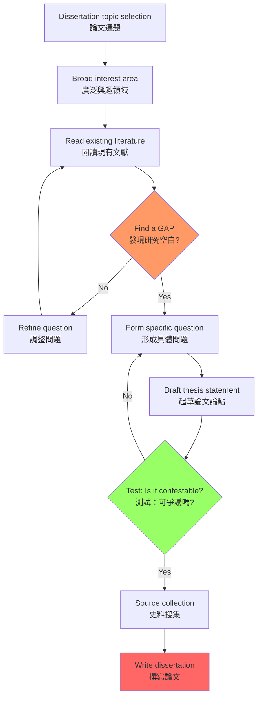
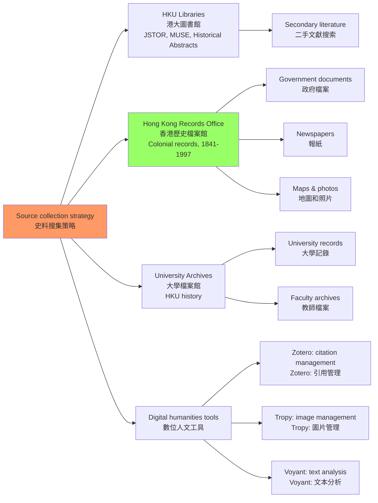
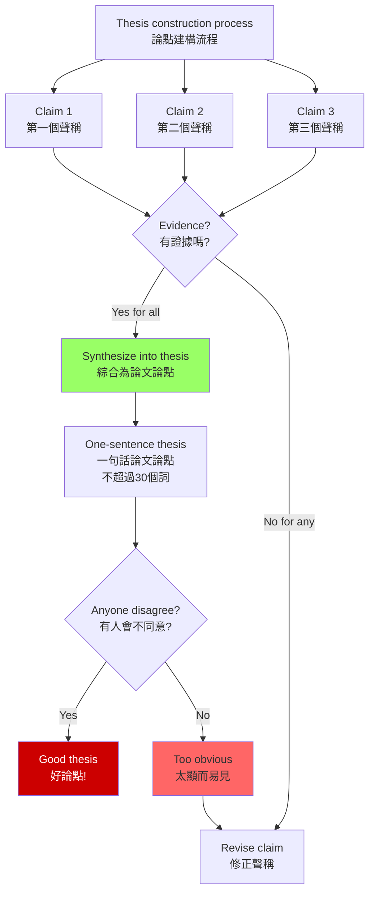
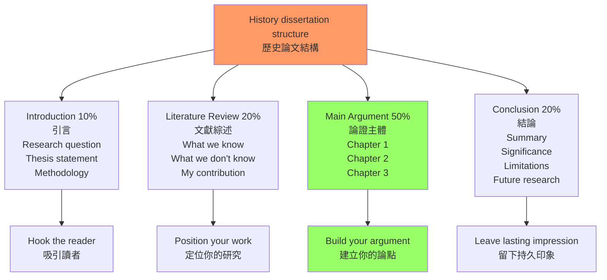
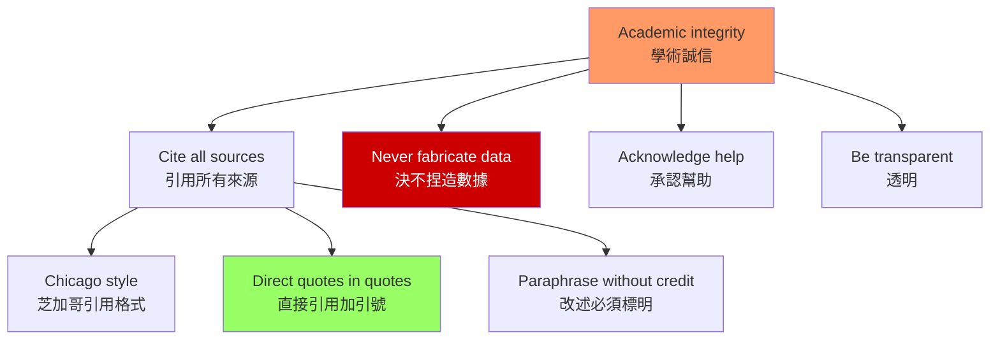

# HIST4017 論文選修 / Dissertation Elective (Capstone)

**Instructor**: History Staff (individual supervisor)
**Department**: History, HKU
**Official source**: [HKU History Course Description](https://history.hku.hk/ug_cd/), [HIST-2425.pdf](https://history.hku.hk/wp-content/uploads/2024/07/HIST-2425.pdf)
**Note**: HIST4017 必須與 HIST4015「歷史的理論與實踐」共同修讀
**Style**: research-based — 這不是一門「課」——這是你整個歷史系學習的終極檢驗

---

## 重要說明：這是歷史系的最高榮譽

HIST4017 是 HKU 歷史系的 cap stone（頂石）課程，12個學分，全年課程，專為 final year students 而設。根據 HKU 官方描述：
- **本質**: 提交一篇擴展的獨立研究論文（dissertation）
- **必備條件**: 必須同時修讀 HIST4015「歷史的理論與實踐」
- **字數限制**: 通常 10,000-15,000 詞（具體以導師要求為準）
- **全年課程**: 第一、二學期持續進行
- **申請程序**: 必須提前聯繫導師並獲得導師同意

---

## 問題 1：5 個核心心智模型（獨立歷史研究的元技能）

### 1. 選題與研究問題建構（Topic Selection and Research Question Construction）

**專家如何思考**: 選題是歷史研究最重要的決定——一個好的研究問題比一個好的答案更有價值。學者 **David Hackett Fischer** 在 *Historians' Fallacies* (1970) 中指出：最常見的研究失敗是選了一個**沒有研究空間**的題目（已經被研究透了）或者選了一個**無法用史料回答**的題目。

- **典型導師期望**: 導師最希望看到的不是學生「讀了很多書」，而是學生能夠**發現一個現有文獻沒有回答的問題**
- **驗證方法**: 在提交研究計劃之前，用 200 字寫下你的研究問題，並問自己：「這個問題的答案，會讓我對過去有新的理解嗎？」

### 2. 史料搜尋與管理（Source Finding and Management）

**專家如何思考**: 歷史研究的物質基礎是史料。沒有史料，任何歷史論點都是空中樓閣。歷史系的學生必須學會在 HKU 圖書館系統（JSTOR, Project MUSE, Historical Abstracts）、香港各大檔案館（香港歷史檔案館 British Records, University of Hong Kong Archives）和國際數據庫中搜尋史料。

- **典型工具**: Zotero（文獻管理）、Tropy（圖片史料管理）、Excel（結構化數據分析）
- **驗證方法**: 找到至少 3 個不同類型的原始檔案來源，並證明它們與你的研究問題直接相關

### 3. 歷史論點建構（Historical Argument Construction）

**專家如何思考**: 歷史論文不是敘事，不是書評，而是有**論點**（thesis）的學術作品。學者 **Mary Beard** 在 *SPQR: Ancient Rome and Its People* (2015) 中強調：歷史寫作的核心技能是「有爭議的論點」——如果你提出的論點所有人都同意，它就不是論點，是描述。

- **典型導師期望**: 導師希望看到學生提出一個**可以被爭論**的歷史論點，並用充分的史料支持它
- **驗證方法**: 用一句話（不超過 30 個英文單詞）寫下你的論文論點，並測試：這個論點有人會不同意嗎？

### 4. 學術寫作的結構與風格（Academic Writing Structure and Style）

**專家如何思考**: 歷史學術論文有其標準結構：引言（研究問題+論文論點）、文獻綜述（現有研究+研究空白）、方法論說明、論證主體、結論。學者 **E.H. Carr** 的 *What is History?* (1961) 和 **David Cesarani** 的歷史寫作指南是 HKU 歷史系的必讀文獻。

- **典型結構**: Introduction (10%) → Literature Review (20%) → Main Argument (50%) → Conclusion (20%)
- **驗證方法**: 每寫 500 字，就問自己：「這一段在推進我的核心論點嗎？」

### 5. 同行評審與學術誠信（Peer Review and Academic Integrity）

**專家如何思考**: 歷史研究是公共知識生產——你的研究成果必須能夠經受同行的審查。學術誠信（academic integrity）是歷史研究的最基本底線：抄襲、捏造數據、刻意忽略不支持論點的史料，都是不可接受的學術犯罪。

- **典型標準**: Chicago Citation Style；所有引用必須標明；二手文獻必須區分於自己的論點
- **驗證方法**: 用 HKU 的 Turnitin 系統檢查初稿，並請同學互相評審

---

## 問題 2：3 個根本分歧（歷史論文寫作的核心張力）

### 分歧 1：敘事 vs 分析——歷史論文應該「讲故事」嗎？
**核心問題**: 歷史論文應該以敘事（narrative）為主還是分析（analysis）為主？

- **學派A（敘事論）**: E.H. Carr 等學者認為，最好的歷史寫作是「有故事的歷史」——敘事讓歷史變得生動，讓讀者能够「看到」過去
- **學派B（分析論）**: 很多歷史學家認為，歷史論文的首要任務是分析——解釋為什麼事情發生，而不是描述發生了什麼

### 分歧 2：寬 vs 深——論文應該廣泛覆蓋還是深入分析？
**核心問題**: 一篇 10,000-15,000 詞的歷史論文，應該覆蓋一個寬泛的主題（但每部分都很淺），還是深入分析一個狹窄的主題（但有足夠的史料深度）？

- **學派A（寬泛覆蓋）**: 某些導師認為學生應該展示廣泛的閱讀能力，論文應該覆蓋一個較大的主題
- **學派B（深度分析）**: 大多數導師認為，10,000 詞的論文最好聚焦於一個具體的研究問題，深入挖掘檔案史料

### 分歧 3：理論 vs 史料——哪個先？
**核心問題**: 歷史研究應該從理論框架開始（演繹法）還是從史料出發（歸納法）？

- **學派A（理論優先）**: 一些導師認為，學生應該先有一個理論框架，然後用史料來檢驗這個框架
- **學派B（史料優先）**: 另一些導師認為，學生應該從具體的史料出發，讓史料引導理論的形成

---

## 問題 3：10 個深度問題（論文寫作的實踐指南）

1. 如何在研究計劃中論證你的研究問題的「歷史意義」？這個問題與當代人有什麼相關性？
2. **史料搜尋策略**：在 HKU 圖書館的 JSTOR 和 Project MUSE 系統中，設計一個有效的搜索策略，找出你的研究領域的「核心文獻」——你需要哪些關鍵詞？
3. 什麼是「研究空白」（research gap）？如何在文獻綜述中發現並論證研究空白的存在？
4. 歷史論點的「可爭議性」（contestability）是什麼？如何測試你的論點是否真的具有學術價值？
5. **檔案研究技巧**：香港歷史檔案館（Hong Kong Records Office）和 HKU 大學檔案館（University Archives）的館藏結構是什麼？你如何有效地利用它們？
6. 歷史寫作中的「過度引用」和「引用不足」各有什麼問題？如何找到適當的引用平衡點？
7. **文獻管理工具**：Zotero 和 EndNote 在歷史研究中的功能差異是什麼？你為什麼需要一個文獻管理工具？
8. 如何處理「史料與論點不符」的情況——當你的史料不支持你預先設想的論點時，你應該怎麼辦？
9. 歷史論文寫作的「語氣」（tone）是什麼？如何在學術嚴謹性和可讀性之間找到平衡？
10. **時間管理**：一篇 12,000 詞的歷史論文，在一個學年（兩學期）的時間框架内，應該如何分配時間——選題、搜檔案、寫作、修訂各佔多少比例？

---

# 核心心智模型深化（中英對照）

## 1. 選題與研究問題建構

### 1.1 Bilingual 概念對照
| 英文 | 中文 | 歷史含義 | 實踐標準 |
|---|---|---|---|
| Research question | 研究問題 | 論文要回答的核心問題 | 可回答+有歷史意義 |
| Research gap | 研究空白 | 現有文獻未回答的問題 | 具體說明 |
| Historiographical contribution | 史學貢獻 | 論文對現有研究的增值 | 明確定位 |
| Thesis statement | 論文論點 | 核心學術主張 | 可爭議+有證據 |

### 1.3 犀利觀察
獨立研究論文最大的陷阱是：**你選了一個「感興趣」的題目，讀了很多書，然後發現自己寫不出有學術價值的論點**。

興趣是最好的起點，但不是研究的全部。你必須問自己：「這個題目有研究空間嗎？現有文獻對這個問題的回答已經足够好了嗎？我的論文論點，會讓歷史學術界對這個問題有新的理解嗎？」

很多學生花費整個暑假讀書，然後在開學時發現：自己讀的書已經被其他學者總結得很好了，根本不需要自己再寫一篇書評。

**歷史研究不是讀書報告，是知識生產——你需要生產新東西，而不是重述舊東西。**

### 1.5 圖解

---

## 2. 史料搜尋與管理

### 2.1 Bilingual 概念對照
| 英文 | 中文 | 歷史含義 | HKU資源 |
|---|---|---|---|
| Primary sources | 一手史料 | 親歷者記錄 | HKU Libraries, HK Records Office |
| Secondary sources | 二手史料 | 學者分析 | JSTOR, Project MUSE, Historical Abstracts |
| Archives | 檔案館 | 原始文件收藏 | HK Records Office, University Archives |
| Digital humanities | 數位人文 | 數字化史料分析 | Tropy, Palladio, Voyant Tools |

### 2.3 圖解

---

## 3. 歷史論點建構

### 3.1 Bilingual 概念對照
| 英文 | 中文 | 歷史含義 | 錯誤示範 |
|---|---|---|---|
| Contestable thesis | 可爭議論點 | 有人會不同意的論點 | 「歷史是複雜的」 |
| Evidence-based | 證據驅動 | 論點由史料支持 | 預先有結論再找證據 |
| Historiographical contribution | 學術貢獻 | 對現有研究的增值 | 重述已知事實 |
| Argument structure | 論點結構 | 邏輯嚴密的論證 | 沒有層次的敘述 |

### 3.3 圖解

---

## 4. 學術寫作的結構與風格

### 4.1 Bilingual 概念對照
| 英文 | 中文 | 歷史含義 | 標準比例 |
|---|---|---|---|
| Introduction | 引言 | 研究問題+論點 | 10% |
| Literature review | 文獻綜述 | 現有研究+空白 | 20% |
| Main body | 論證主體 | 史料+分析 | 50% |
| Conclusion | 結論 | 總結+貢獻+局限 | 20% |

### 4.3 圖解

---

## 5. 同行評審與學術誠信

### 5.1 Bilingual 概念對照
| 英文 | 中文 | 歷史含義 | 標準 |
|---|---|---|---|
| Academic integrity | 學術誠信 | 研究的最基本底線 | HKU regulations |
| Plagiarism | 抄襲 | 未經允許使用他人文字 | Zero tolerance |
| Citation | 引用 | 標明思想來源 | Chicago Style |
| Peer review | 同行評審 | 同學互相審查 | Draft workshops |

### 5.3 圖解

---

# 深度自測問題詳解

## Q1 詳解：如何論證研究問題的「歷史意義」
**核心答案**: 歷史意義的論證需要回答三個問題：① **這個問題在過去為什麼重要？**（歷史語境）② **現有研究對這個問題的回答有什麼不足？**（研究空白）③ **回答這個問題會讓我們對過去有什麼新的理解？**（學術貢獻）

## Q3 詳解：如何發現研究空白
**核心答案**: 研究空白的發現需要系統性的文獻綜述：① 找出研究領域的 3-5 篇核心文獻；② 追踪這些文獻的引用和被引用情況；③ 找出這些文獻共同承認的「未來研究方向」；④ 评估這些「未來研究方向」是否真的已经被填补

## Q10 詳解：時間管理
**核心答案**: 12,000 詞論文的全年時間分配建議：
- **第一學期（第 1-13 周）**：60% 選題+文獻綜述，30% 史料搜集，10% 初稿
- **寒假（第 14-18 周）**：30% 繼續史料搜集，50% 第一章初稿
- **第二學期（第 19-33 周）**：50% 寫作，30% 修改，20% 結論和引用
- **最後兩周**：修訂、校對、提交

---

# 總結

1. **論文選題是研究成敗的 50%**：選擇一個有研究空間、有史料支持、有歷史意義的題目，比寫作本身更重要。

2. **史料是歷史研究的物質基礎**：沒有史料就沒有歷史——學會在 HKU 圖書館和各大檔案館中高效搜尋史料，是歷史系學生的核心技能。

3. **歷史論文的核心是「可爭議的論點」**：如果你不能找到至少一個學者會反對你的論點，你的論文就只是一篇描述，不是研究。

4. **學術誠信是歷史研究的最後底線**：任何抄襲、捏造或刻意忽略不支持論點的史料，都是不可接受的——歷史學的聲譽建立在誠信之上。

5. **HIST4017 是你在 HKU 歷史系的巔峰時刻**：這是你用四年所學，獨立完成的一個真正的歷史研究項目——它是你的歷史學家訓練的最終檢驗，也是你留給這個學術領域的一個微小但真實的貢獻。

**自學建議**: 配合 E.H. Carr 的 *What is History?* + David Hackett Fischer 的 *Historians' Fallacies* + HKU Library 的 Academic Integrity 教程，輸出研究計劃到 `06_Reading_Notes/`。
