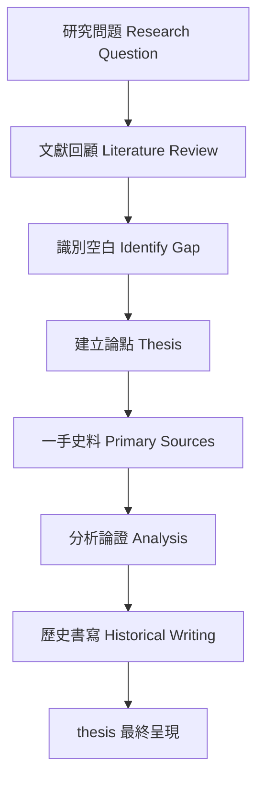
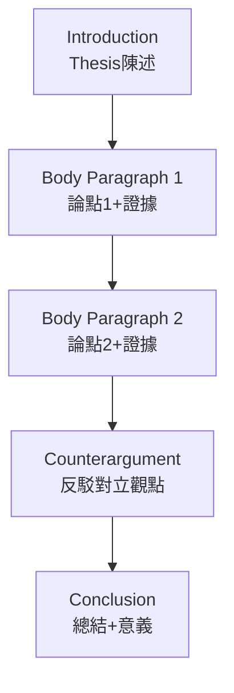
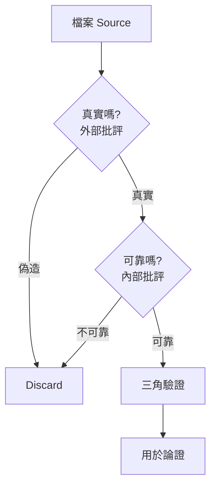
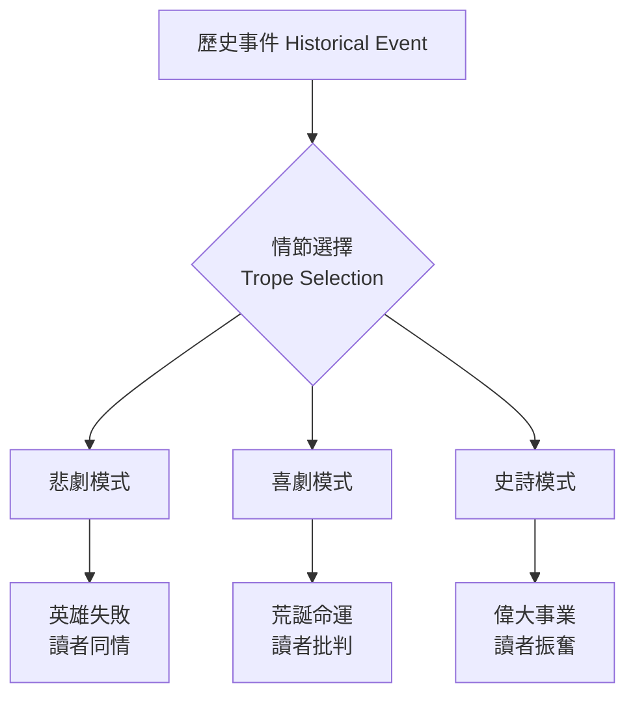
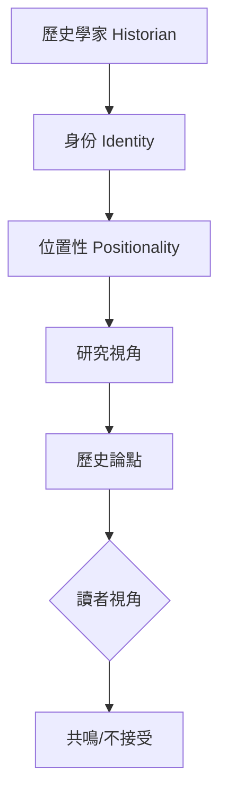
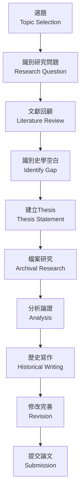
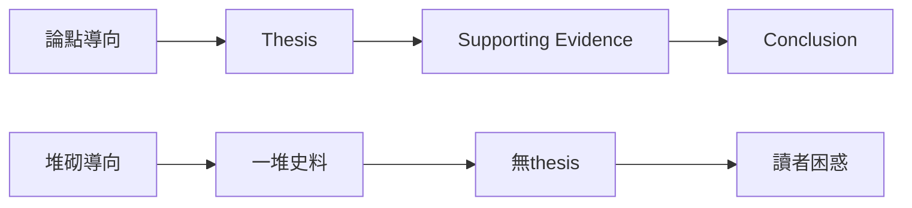
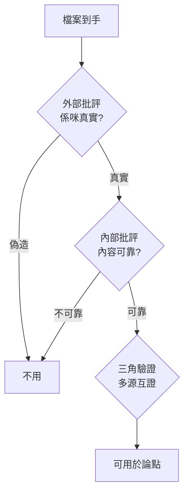
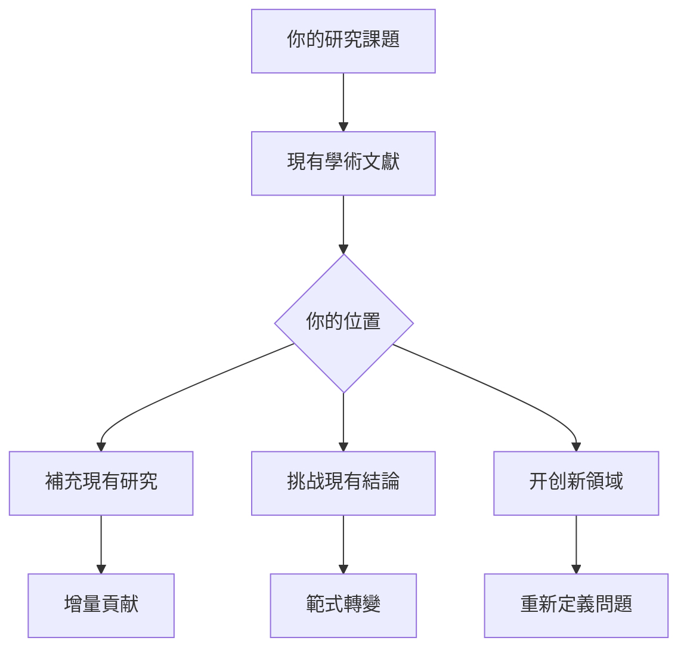
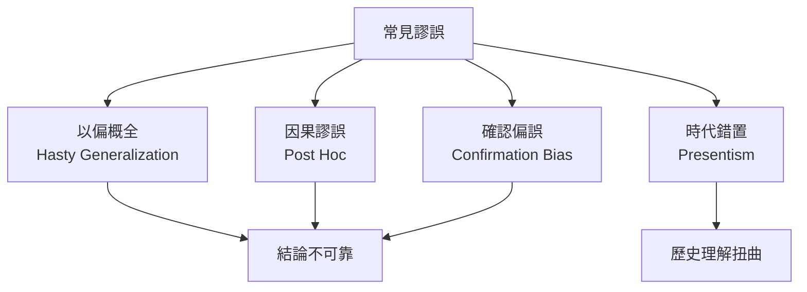

# HIST4017 論文選修 / Dissertation Elective (12 credits)

**Instructor**: History Staff (需自行聯繫導師)
**Department**: History, HKU
**Official source**: [HKU History Course Description 2024-25](https://history.hku.hk/wp-content/uploads/2024/07/HIST-2425.pdf)
**Style**: 袁騰飛式 — 犀利、聚焦論文寫作點解係歷史學家嘅成年禮

---

## 問題 1：這個領域所有專家共享的 5 個核心心智模型

### 心智模型 1：歷史研究係「問題導向」
學者 **E.H. Carr** (*What is History?*, 1961) 研究：歷史研究從問題開始，唔係從材料開始——「歷史學家從來都係帶住問題去睇材料」。

學者 **Leopold von Ranke** 分析：史料批判係歷史研究嘅根本。

- 選題：識別研究空白 (research gap)
- 問題化：將廣義興趣轉化為具體研究問題
- 史料導向 vs 問題導向之爭

### 心智模型 2：歷史論文係論證 (Argument)
學者 **David Hackett Fischer** (*Historians' Fallacies*, 1970) 研究：歷史寫作常見謬誤——以偏概全、因果謬誤、時代錯置。

學者 **Gary Gutting** 分析：歷史解釋模型——覆蓋律模型、敘事模型。

- 論文核心：thesis statement 清晰
- 論證結構：提出→證明→反駁→結論
- 史學史 (historiography) 位置

### 心智模型 3：史料批判方法論
學者 **Anthony Grafton** (*The Footnote*, 1997) 研究：腳註系統點解重要——知識累積嘅基礎設施。

學者 **Joyce Appleby** 分析：新史料主義——檔案多元化。

- 一手史料 vs 二手史料
- 內部批評 vs 外部批評
- 三角驗證法

### 心智模型 4：歷史書寫政治
學者 **Hayden White** (*Metahistory*, 1973) 研究：所有歷史敘事都包含情節化結構——悲劇、喜劇、史詩、鬧劇。

學者 **Patrick Joyce** 分析：後現代挑戰——歷史客觀性係神話？

- 歷史寫作與文學界線模糊
- 「事實」與「詮釋」之爭
- 敘事史 vs 科學史之爭

### 心智模型 5：歷史倫理
學者 **Peter Novick** (*That Noble Dream*, 1988) 研究：「客觀性」喺美國歷史學界嘅興衰。

學者 **Richard Evans** 分析：後現代主義對歷史學威脅——事實仍然重要。

- 抄襲問題與學術誠信
- 歷史學家嘅社會責任
- 當代政治與歷史書寫

---

## 問題 2：3 個根本分歧

### 分歧 1：歷史——科學定藝術？
- **A 方**：科學派
  - 歷史學追求客觀真相
  - 史料批判係核心方法
- **B 方**：藝術派
  - 歷史寫作係敘事藝術
  - 情節化結構無可避免

### 分歧 2：歷史客觀性——可能定不可能？
- **A 方**：可能
  - 史料批判確保可靠性
  - 多角度驗證
- **B 方**：不可能
  - 所有歷史都帶時代偏見
  - 後現代批評

### 分歧 3：歷史研究——問題導向定材料導向？
- **A 方**：問題導向
  - 從研究問題出發
  - 史料服務論證
- **B 方**：材料導向
  - 從檔案材料出發
  - 問題喺材料中浮現

---

## 問題 3：10 個深度問題

1. 如果你要寫歷史論文，第一步係乜嘢？點解好多學生搞錯咗？
2. 點解歷史論文要有thesis statement？一個好thesis具備乜嘢條件？
3. 如果你去檔案館，點樣由海量化史料中識別相關材料？
4. 點解歷史學家對同一事件往往有完全唔同嘅解讀？
5. 如果你要批評一篇權威歷史論文，你會點樣開始？
6. 點解歷史學界對「客觀性」嘅理解經歷咁大變化？
7. 如果你嘅研究發現同你預期完全相反，你會點做？
8. 歷史寫作——點解你嘅文字風格會影響讀者對「真相」嘅感知？
9. 如果你要申請歷史學博士，你嘅論文要展示邊啲能力？
10. 歷史研究倫理——點解抄襲係咁大件事？

---

## 核心心智模型深化（中英對照）

## 1. 問題導向研究 (Problem-driven Research)

### 1.1 Bilingual 概念對照
| 英文概念 | 中英對照 | 歷史含義 | 論文應用 |
|---|---|---|---|
| Research Question | 研究問題 | 歷史研究嘅起點 | 具體、可答、有意義 |
| Historiographical Gap | 史學空白 | 文獻未覆蓋嘅領域 | 創新貢獻所在 |
| Thesis Statement | 論點陳述 | 論文核心主張 | 一句話概括全文 |
| Primary Sources | 一手史料 | 歷史事件親歷者留下 | 檔案、日記、信件 |
| Secondary Sources | 二手史料 | 歷史學家嘅分析 | 學術論文、專著 |

### 1.2 史料與考據
- E.H. Carr: What is History? (1961)
- Anthony Grafton: The Footnote (1997)
- David Hackett Fischer: Historians' Fallacies (1970)

### 1.3 袁騰飛式犀利觀察
好多學生以為歷史論文係「堆砌史料」，其實係「論證」。如果你唔知你想證明乜嘢，堆幾多史料都係無灵魂嘅搬運工。
歷史論文嘅本質唔係「你知道幾多」，而係「你點樣說服别人相信你嘅論點」。

### 1.4 Deep test question
- 如果你嘅thesis被人用一個史料完全推翻，你會點做？

### 1.5 圖解

---

## 2. 論證結構 (Argument Structure)

### 1.1 Bilingual 概念對照
| 英文概念 | 中英對照 | 歷史含義 | 論文應用 |
|---|---|---|---|
| Argument | 論證 | 有證據支持嘅主張 | 論文核心 |
| Evidence | 證據 | 支持論點嘅史料 | 具體、可靠、充足 |
| Counterargument | 反駁論點 | 對立觀點 | 展示深度 |
| Historiography | 史學史 | 學術爭論脈絡 | 定位你嘅位置 |

### 1.2 史料與考據
- Gary Gutting: Talking God (歷史解釋哲學)
- Alun Munslow: Deconstructing History (歷史書寫理論)

### 1.3 袁騰飛式犀利觀察
歷史論文唔係「我發現咗呢件事」——而係「我點解相信呢件事，點解你應該相信」。

### 1.4 Deep test question
- 你嘅論文點回應現有史學文獻？你嘅創新之處係邊度？

### 1.5 圖解

---

## 3. 史料批判方法 (Source Criticism)

### 1.1 Bilingual 概念對照
| 英文概念 | 中英對照 | 歷史含義 | 方法 |
|---|---|---|---|
| Internal Criticism | 內部批評 | 史料內容可信度 | 是否自相矛盾 |
| External Criticism | 外部批評 | 史料真實性 | 是否偽造 |
| Triangulation | 三角驗證 | 多源互證 | 交叉核對 |
| Provenance | 來源考證 | 史料出處 | 點解存在 |

### 1.2 史料與考據
- Ranke: 史料批判原則
- 檔案學基礎：CO 129, HKRS, CB

### 1.3 袁騰飛式犀利觀察
檔案唔會話你知真相——佢只會話你知有人想留低乜嘢記録。
點解某啲史料保存低咗、某啲消失咗？呢個本身就係歷史問題。

### 1.4 Deep test question
- 如果你發現一份重要檔案被部分刪除，你點解？

### 1.5 圖解

---

## 4. 歷史書寫與敘事 (Historical Writing & Narrative)

### 1.1 Bilingual 概念對照
| 英文概念 | 中英對照 | 歷史含義 | 爭議 |
|---|---|---|---|
| Narrative History | 敘事史 | 讲故事嘅歷史 | vs 科學史 |
| Metahistory | 元歷史 | 歷史意識形態批評 | Hayden White |
| Tropes | 情節結構 | 悲劇/喜劇/史詩 | 影響解讀 |
| Periodization | 時代劃分 | 歷史點樣被分段 | 歐洲中心問題 |

### 1.2 史料與考據
- Hayden White: Metahistory (1973)
- Richard Evans: In Defense of History (1997)

### 1.3 袁騰飛式犀利觀察
Hayden White最犀利嘅觀點：歷史學家以為自己喺客觀呈現過去，但其實佢哋不自觉地選擇咗情節結構——悲劇英雄定喜劇小丑？呢個選擇影響讀者點解歷史事件。
歴史唔係發現，係建構。

### 1.4 Deep test question
- 如果你用「悲劇」情節結構寫香港歷史，會變成點？

### 1.5 圖解

---

## 5. 歷史研究倫理 (Ethics of Historical Research)

### 1.1 Bilingual 概念對照
| 英文概念 | 中英對照 | 歷史含義 | 重要性 |
|---|---|---|---|
| Academic Integrity | 學術誠信 | 抄襲、造假嘅禁止 | 根本原則 |
| Positionality | 位置性 | 研究者嘅身份影響研究 | 後殖民批評 |
| Representational Ethics | 呈現倫理 | 點樣描述邊緣群體 | 涉及權力 |
| Collective Memory | 集體記憶 | 邊個有權代表歷史 | 爭議核心 |

### 1.2 史料與考據
- Peter Novick: That Noble Dream (1988)
- Richard Evans: In Defense of History (1997)

### 1.3 袁騰飛式犀利觀察
歷史學家從來唔係透明嘅——佢嘅身份（階級、性別、國籍、時代）影響佢點睇過去。呢個唔係話歷史無意義，而係話我哋要保持清醒。
歴史真相仍然存在，但到達真相嘅過程永遠帶有視角。

### 1.4 Deep test question
- 如果你研究一個被政治敏感嘅歷史事件，你點保持學術誠信？

### 1.5 圖解

---

## 深度自測問題詳解

### 詳解 1: 點解thesis statement咁重要？
Thesis係你論文嘅「脊椎」——無thesis，你嘅論文就係一堆無連貫性嘅史料。Thesis必須具體、可爭論、範圍適中。

### 詳解 2: 點解史料批判係歷史學家基本功？
檔案唔會話你知真相——佢只係有人選擇保存嘅記録。批判史料係識別「記録者」立場、利益、限制。

### 詳解 3: 如果研究發現同預期相反？
呢個係最好嘅研究結果！真正嘅歷史發現往往係意料之外。呢個時候你要重新調整thesis，而非忽視證據。

### 詳解 4: 點解史學史咁重要？
史學史讓你知道自己喺邊個學術傳統入面、你嘅創新之處係邊度。評估員會問：「你嘅研究點解重要？」——答案喺史學史位置。

### 詳解 5: 後現代主義挑戰——歷史仲可信嗎？
Richard Evans有力回應：後現代主義理論犀利，但唔可以否認具體事實。日軍南京大屠殺唔係「話語建構」，係確實發生嘅戰爭罪行。

### 詳解 6: 歷史寫作風格影響讀者？
Absolutely！Hayden White證明：同一事件用悲劇模式定喜劇模式寫，讀者嘅情感同道德判斷完全不同。呢個係歷史作為敘事藝術嘅證據。

### 詳解 7: 申請博士——論文展示乜嘢？
研究能力（識別問題、收集材料、分析論證）+ 寫作能力（清晰、有說服力）+ 史學史理解（知道你自己喺邊個傳統）。

### 詳解 8: 當代政治影響歷史寫作？
無可避免，但需要警惕。研究1930年代香港歷史，無法人脱今日香港政治環境。問題唔係避免，而係識別同反思。

### 詳解 9: 邊緣群體歷史——點解咁難研究？
史料往往由精英留下——工人、農民、女性、殖民地人民嘅聲音極少。Oral history、檔案另類解讀係補救方法。

### 詳解 10: 如果你要寫10,000字論文？
結構：導論（500字）→文獻回顧（2000字）→分析（5000字）→結論（500字）。每段有一個主要論點，用史料支持。

---

## 5 個 Mermaid 圖解

### 📊 Diagram 1: 歷史研究流程

### 📊 Diagram 2: 論證vs堆砌

### 📊 Diagram 3: 史料批判流程

### 📊 Diagram 4: 史學史定位

### 📊 Diagram 5: 歷史寫作常見謬誤

---

## 總結

1. **歷史論文係論證**：thesis-driven，唔係材料堆砌，唔係事實列表。
2. **史料批判係基本功**：檔案唔會話你知真相，要你自己批判分析。
3. **史學史定位係創新嘅前提**：知道你自己喺邊個傳統入面，先可以知道創新喺邊度。
4. **歷史客觀性係目標但永遠唔完全**：歷史學家帶住視角，但通過方法論約束可以無限接近真相。
5. **歷史倫理係每一個研究决定嘅底層邏輯**：從選題到寫作到發表，都涉及倫理考量。

**最後問題**: 如果你嘅論文發現威脅到當權者，你仲會發表嗎？

---
**版權所有 © HKU History Self-Study**
