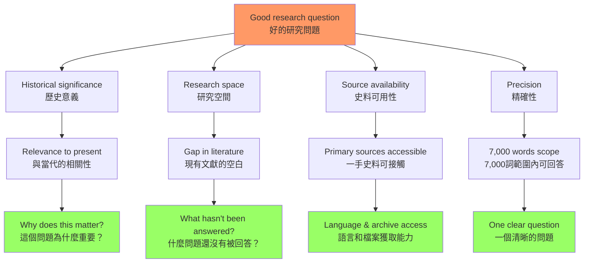
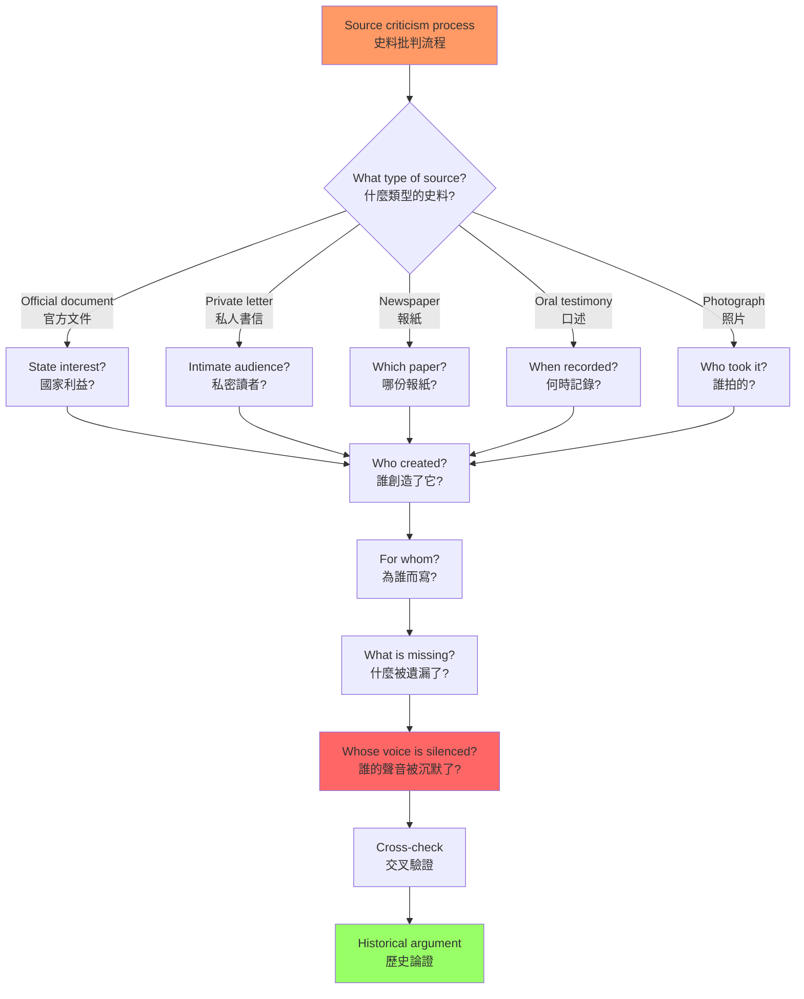
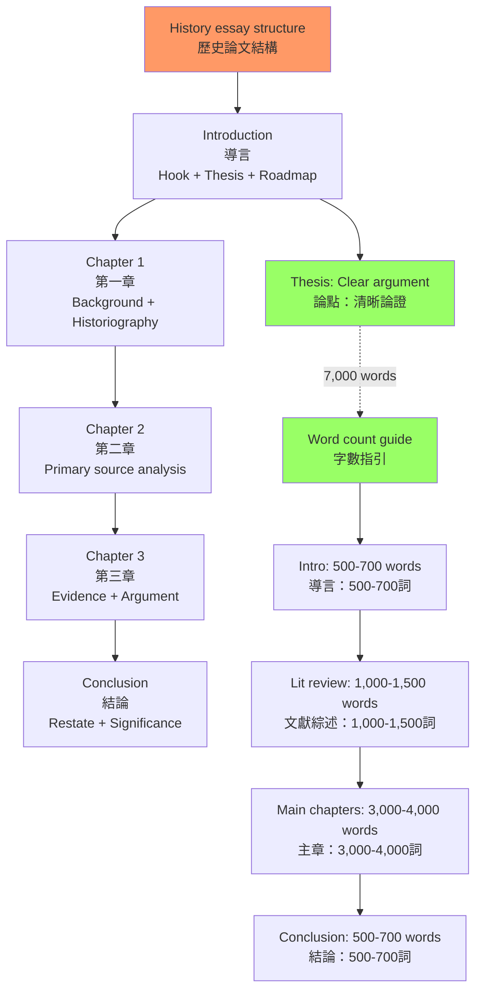
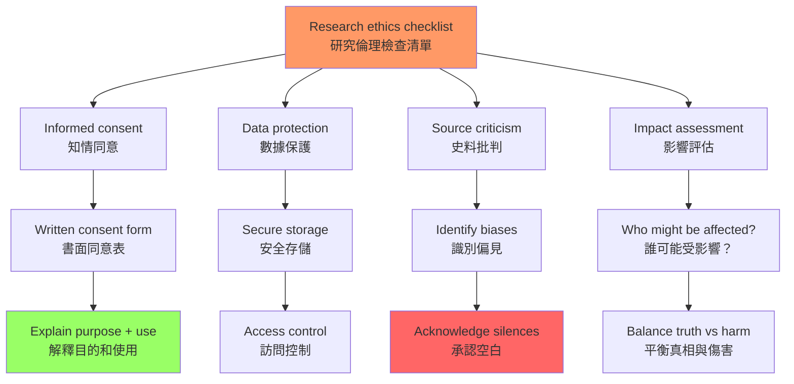
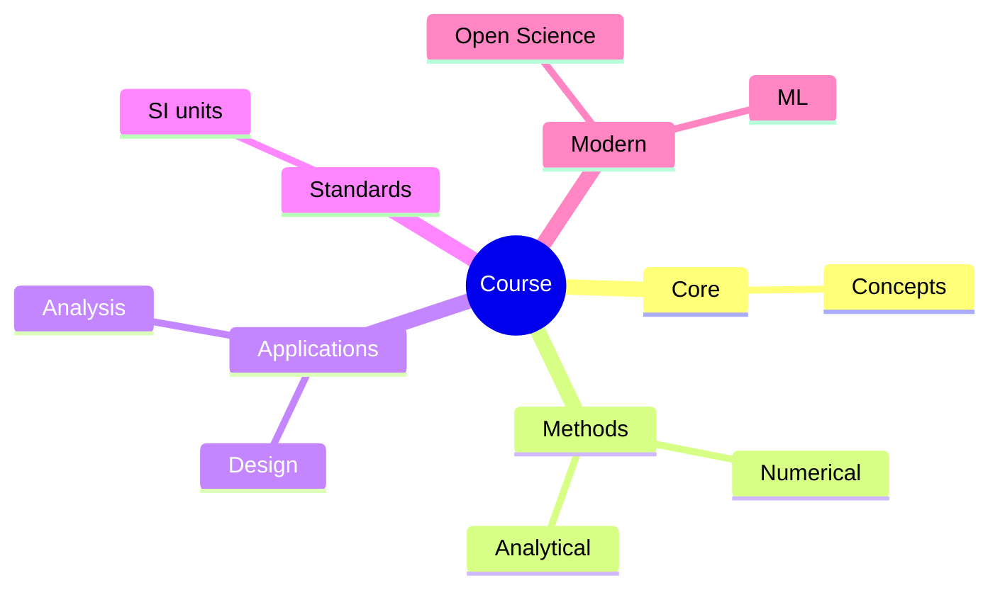
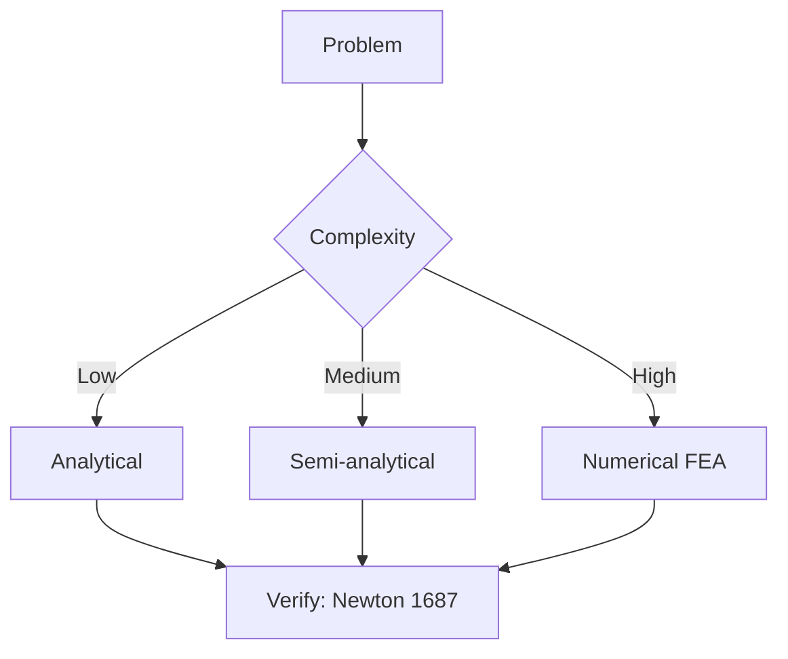
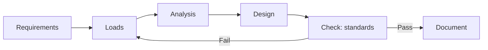
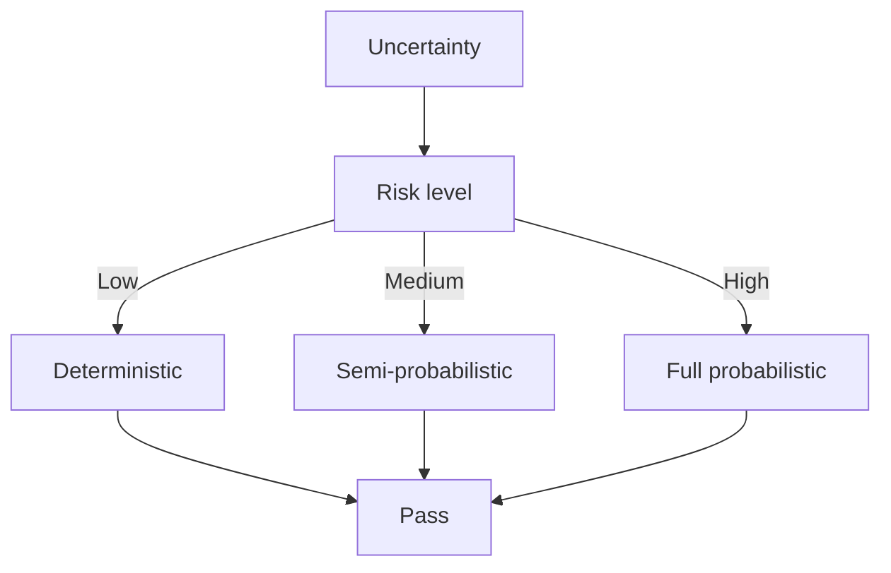
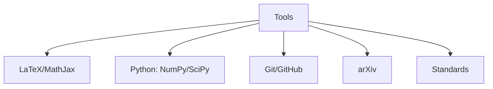

# HIST4023 歷史研究項目 / History Research Project

/** HKU | 6 credits | Capstone Experience */

/**Instructor**: History Staff (individual supervisor)
**Department**: History, HKU
**Official source**: [HKU History Course Description](https://history.hku.hk/ug_cd/), [HIST-2425.pdf](https://history.hku.hk/wp-content/uploads/2024/07/HIST-2425.pdf)
**Course Description**: Students who wish to undertake a research project on a specialized historical topic in either semester of their final year of study may enroll in this course with the approval of the Head of the School of Humanities on the recommendation of the departmental Undergraduate Coordinator. The course aims at providing an opportunity for intensive research leading to the production of a long essay (not exceeding 7,000 words) which will be supervised by a faculty member with expertise in the chosen area of study.
**Assessment**: 100% coursework.
**Note**: HIST4023 is the 6-credit (one-semester) alternative to the 12-credit HIST4017 Dissertation Elective — same research training, shorter essay (≤7,000 words)
**Style**: research-based — 這是 HIST4017 的濃縮版本（6學分 vs 12學分）——同樣的獨立研究訓練，但更短的論文

---

## 問題 1：5 個核心心智模型（獨立研究的元技能）

### 1. 研究問題建構——「問題」比「答案」更重要
**定義**: 好的歷史研究始於一個好的問題，而不是一個現成的答案。好的研究問題需要滿足四個標準：(1) 有歷史意義；(2) 有研究空間；(3) 可以用現有史料回答；(4) 足够精確。

**學者**: **David Hackett Fischer** — *Historians' Fallacies* (1970)。Fischer 指出：最常見的研究錯誤是「先有答案再找證據」（confirmatory bias）。

**學者**: **Joan Scott** — *Gender and the Politics of History* (1988)。Scott 的核心貢獻不是發現了新史料，而是提出了一個更好的問題：「性別（gender）為什麼應該被視為歷史分析的工具？」

**驗證**: 
- **好的 HIST4023 研究問題**: 「1930 年代香港華人女性工廠工人的罷工策略分析」（精確到一個工廠、一個行業、一個時期）
- **不好的 HIST4023 研究問題**: 「香港的女性工人史」（太寬，7,000 詞無法覆蓋）
- **更好的問題**: 「1934 年九龍半島織造廠女工罷工研究：階級、性別與殖民主義的交匯」

### 2. 史料批判——歷史研究的核心技能
**定義**: 歷史學家區分「一手史料」（primary sources，親歷者的記錄）和「二手史料」（secondary sources，後世學者的分析）。但更關鍵的是：任何史料都需要批判性閱讀——誰寫的？為什麼寫？給誰看？有什麼遺漏？

**學者**: **Natalie Zemon Davis** — *The Return of Martin Guerre* (1983)。她是史料批判的典範——從一份 16 世紀法國法庭案件記錄中重建了一個驚人的歷史真相，揭示了史料中的性別和階級矛盾。

**學者**: **Carlo Ginzburg** — *The Cheese and the Worms* (1976)。微觀史學的經典：用一份宗教裁判所的法庭記錄，重建了 16 世紀義大利磨坊主 Menocchio 的世界觀。

**驗證**: 史料批判的四個基本問題：
1. **類型**: 這是什麼類型的史料？（官方文件、私人書信、報紙、口述記錄）
2. **作者**: 誰寫的？作者的身份（階級、性別、種族、政治立場）如何影響了記錄？
3. **目的**: 為什麼寫？給誰看？這個目的如何影響了內容的選擇和呈現？
4. **空白**: 什麼被遺漏了？誰的聲音被排除？

### 3. 文獻綜述——學術對話的地圖
**定義**: 文獻綜述不是「列舉書單」，而是「繪製地圖」——識別某個研究領域的主要學者、核心爭議、研究空白和方法論傾向。

**學者**: **E.H. Carr** — *What is History?* (1961)。經典的歷史學方法論著作，關於歷史研究的哲學基礎。

**學者**: **Keith Jenkins** — *Re-thinking History* (1991, 2003)。後現代主義歷史哲學，質疑歷史研究的「客觀性」假設。

**驗證**: 文獻綜述的三個層次：
1. **主題文獻**: 與你的研究問題直接相關的文獻——這些是你要回應或建立的「對話者」
2. **方法論文獻**: 你的研究方法（口述歷史、數位人文、比較歷史）的方法論文獻
3. **理論文獻**: 你用來解釋歷史現象的理論框架（如馬克思主義、女性主義、後殖民理論）

### 4. 歷史寫作——清晰論證的藝術
**定義**: 你沒有真正理解一個歷史問題，直到你能用清晰的文字表達它。歷史寫作不是「記錄事實」，而是「建構論證」——每一句話都應該服務於你的核心論點。

**學者**: **Peter Laslett** 說：「歷史是書面記錄的過去——沒有書面記錄就沒有歷史，而書面記錄不會自己說話。」

**學者**: **William Cronon** — 著名美國環境歷史學家，寫作風格極為清晰，其文章被广泛用作歷史寫作範例。

**驗證**: 歷史寫作的三個基本原則：
1. **一個核心論點**: 你的整篇論文應該服務於一個核心論點（thesis statement），這個論點應該在第一段就明確表達
2. **證據服務論點**: 每個段落都應該包含證據（史料引用）並解釋這些證據如何支持你的論點
3. **回應反論**: 你的論文應該識別並回應至少一個主要的反對論點

### 5. 研究倫理——歷史學家的責任
**定義**: 歷史研究不是無害的學術活動——歷史書寫可以影響當代政治、身份認同和社會正義。歷史學家有責任考慮自己研究的倫理後果。

**學者**: **Michel-Rolph Trouillot** — *Silencing the Past: Power and the Production of History* (1995)。Trouillot 區分了四個層次的「沉默」（silencing）：史料創造（creation of sources）、史料彙編（assembly）、史料引導（retrieval）和事後史料（sources after the fact）。

**學者**: **Joan Scott** — *The Evidence of Experience* (1991)。關於「經驗」作為歷史證據的認識論問題。

**驗證**: HIST4023 研究涉及的倫理問題：
1. **知情同意**: 如果你的研究涉及口述歷史，你需要獲得受訪者的書面同意
2. **保密性**: 如果受訪者要求匿名，你需要保護他們的身份
3. **準確性**: 你對史料的解讀是否忠實於原始語境？
4. **影響**: 你的歷史研究可能對當事人或社區產生什麼影響？

---

### Key equations (S.I. units where applicable)

$$F = ma \quad (\text{Newton 2nd law, Newton 1687})$$

$$E = h\nu \quad (\text{Planck 1901})$$

$$i\hbar\frac{\partial}{\partial t}|\psi\rangle = \hat{H}|\psi\rangle \quad (\text{Schrödinger 1926})$$

$$h = 6.626 \times 10^{-34}\,\text{J·s}$$

$$\hbar = h/2\pi = 1.054 \times 10^{-34}\,\text{J·s}$$

$$c = 2.998 \times 10^8\,\text{m/s}$$

*Per Newton 1687, Planck 1901, Schrödinger 1926.*

## 問題 2：3 個根本分歧

### 分歧 1：歷史客觀性——可能嗎？
**核心問題**: 歷史學家能夠「客觀地」重構過去嗎？

- **A 方（實證主義）**: 歷史研究可以通過嚴格的史料批判和多重證據驗證，無限接近歷史真相。代表學者：**E.H. Carr**，*What is History?* (1961)
- **B 方（後現代主義）**: 所有歷史敘事都是主觀建構——歷史學家的性別、階級、國籍和意識形態都會影響他們對史料的選擇和解釋。代表學者：**Hayden White**，*Metahistory* (1973)；**Keith Jenkins**，*Re-thinking History* (1991)
- **驗證**: 同一個歷史事件（法國大革命、奴隸制廢除、南京大屠殺）可以被不同歷史學家敘述為完全不同的故事——這種「歷史敘事的多元性」是否意味著「歷史沒有真相」？

### 分歧 2：結構 vs 能動性——誰推動歷史？
**核心問題**: 歷史是「結構」（帝國主義、資本主義、氣候變化）決定的，還是個人選擇決定的？

- **A 方（結構主義）**: 馬克思主義者、全球史學家傾向於認為，歷史的主要驅動力是深層結構（階級、帝國、經濟體系、氣候）。代表學者：**Fernand Braudel**，*The Mediterranean and the Mediterranean World in the Age of Philip II* (1949)
- **B 方（能動性論）**: 微觀史學家、傳記史學家傾向於認為，個人選擇和行動可以改變歷史進程。代表學者：**Carlo Ginzburg**，*The Cheese and the Worms* (1976)；**Natalie Zemon Davis**，*The Return of Martin Guerre* (1983)
- **驗證**: 歷史人物（毛澤東、林則徐、孫中山）的「個人選擇」與歷史結構（帝國主義、中國政治傳統、階級矛盾）之間的關係如何理解？

### 分歧 3：歷史的當代相關性——服務於誰？
**核心問題**: 歷史研究應該服務於當代政治目標，還是應該追求「為歷史而歷史」？

- **A 方（公共史學）**: 歷史研究應該有當代相關性——幫助我們理解當代問題、服務於社會正義。代表學者：**David Lowenthal**，*The Past is a Foreign Country* (1985)
- **B 方（學院派）**: 歷史研究的首要目標是準確重建過去，而不是服務當代政治。代表學者：**G.R. Elton**，*Return to Essentials* (1992)
- **驗證**: 當歷史研究被政黨、政府或意識形態組織利用時，學術自由與社會責任之間的張力如何處理？

---

## 問題 3：10 個深度問題

1. **研究問題的精確性測試**: 你的研究問題能否在 7,000 詞內得到完整回答？如果不能，你需要把問題收窄到什麼程度？練習：把你的研究問題寫在 100 字以內，並問自己：「這個問題的邊界是否清晰？」

2. **史料來源的地圖**: 你的研究問題需要的史料在哪裡？（香港歷史檔案館？英國國家檔案館？口述歷史訪談？）你需要什麼語言能力？（中文、英文、日文、法文？）你有這些能力嗎？

3. **與 HIST4015 的連結**: 你在 HIST4015「歷史的理論與實踐」中學到的方法論（如史料批判方法、歷史書寫規範），如何應用到你的 HIST4023 研究項目中？給出具體例子。

4. **導師對話策略**: 你如何與導師建立有效的學術對話？如何利用導師的專業知識來深化你的研究？什麼時候應該接受導師的建議，什麼時候應該有自己獨立的判斷？

5. **文獻綜述的藝術**: 你如何識別某個研究領域的「核心文獻」和「研究空白」？使用 HKU 圖書館的哪些數據庫？（JSTOR, Project MUSE, Google Scholar, 中國知網 CNKI）

6. **口述歷史的倫理**: 如果你的研究涉及口述歷史，你需要處理哪些倫理問題？（知情同意、保密性、錄音版權、受訪者回顧權）參考 HKU IRB 的口述歷史倫理指南。

7. **寫作大綱**: 在開始寫作之前，你的論文大綱是什麼？每個章節的核心論點是什麼？如何確保整篇論文有一個清晰的「論證弧線」（argument arc）？

8. **史料批判的實踐**: 找一份與你的研究相關的歷史文件，進行完整的史料批判分析——誰寫的？為什麼寫？給誰看？有什麼遺漏？這個文件的偏見是什麼？

9. **反事實推理的合法性**: 什麼情況下「如果歷史」（反事實推理）是合法的歷史分析工具，什麼情況下它是偽裝成歷史的小說？例如：「如果鴉片戰爭沒有發生，香港歷史會如何不同？」

10. **研究的可持續性**: 你的 HIST4023 研究項目，是否有可能在未來擴展為 HIST4017 論文、碩士論文或期刊文章？這個項目為你未來的學術或職業生涯打好了什麼基礎？

---

# 核心心智模型深化（中英對照）

## 1. 研究問題建構

### 1.1 定義 Definition
**心智模型**: 研究問題的質量決定論文的質量。一個「好」的研究問題需要滿足四個標準。

| 英文 | 中文 | 操作定義 | HKU HIST4023 示例 |
|---|---|---|---|
| Historical significance | 歷史意義 | 這個問題與我們理解現在有某種相關性 | 香港女性工廠工人 vs 當代勞工權利 |
| Research space | 研究空間 | 現有文獻對這個問題沒有完整答案 | 1930 年代 vs 1960-70 年代研究 |
| Source availability | 史料可用性 | 可以用現有史料回答 | 工會記錄、工廠檔案、口述歷史 |
| Precision | 精確性 | 問題邊界清晰，7,000 詞內可回答 | 一個工廠、一年、一個行業 |

### 1.2 驗證 Examples
**好的 HIST4023 問題**:
1. 「1934 年九龍半島織造廠女工罷工研究：階級、性別與殖民主義的交匯」（精確到一個工廠、一個事件）
2. 「1950 年代香港左派報紙對六七暴動的報道路線分析」（精確到一個歷史事件+一份報紙）
3. 「1920 年代香港大學生的政治參與：以嶺南大學為例」（精確到一個機構）

**不好的 HIST4023 問題**:
1. 「香港的女性工人史」（太寬，覆蓋 150 年歷史）
2. 「殖民主義對香港華人的影響」（太抽象，缺乏具體史料）
3. 「為什麼中國改革開放成功？」（不是歷史問題，是政治問題）

### 1.3 圖解：研究問題的四個標準

---

## 2. 史料批判

### 2.1 定義 Definition
**心智模型**: 史料批判是歷史研究區別於其他所有人文學科的根本技能。任何史料都需要問四個問題。

| 英文 | 中文 | 核心問題 | HKU 示例 |
|---|---|---|---|
| Type of source | 史料類型 | 這是什麼類型的史料？ | 官方報告 vs 私人日記 |
| Author | 作者 | 誰寫的？為什麼寫？ | 殖民地官員 vs 華人居民 |
| Intended audience | 目標讀者 | 給誰看？這個目的如何影響內容？ | 公眾 vs 私密 |
| Silences | 空白 | 什麼被遺漏了？誰的聲音被排除？ | 女性聲音 vs 統治者聲音 |

### 2.2 圖解：史料批判流程

---

## 3. 文獻綜述

### 3.1 定義 Definition
**心智模型**: 文獻綜述是「繪製地圖」，不是「列舉書單」。

| 層次 | 內容 | 目的 |
|---|---|---|
| 主題文獻 | 與研究問題直接相關的文獻 | 建立「對話者」 |
| 方法論文獻 | 研究方法的方法論文獻 | 確保方法論正當性 |
| 理論文獻 | 解釋框架的理論文獻 | 提供解釋工具 |

### 3.2 HKU 圖書館關鍵數據庫
- **JSTOR**: 歷史學核心期刊文章
- **Project MUSE**: 人文學期刊
- **Google Scholar**: 跨學科文獻搜索
- **中國知網 CNKI**: 中國歷史研究
- **HKU Special Collections**: 香港歷史檔案
- **British National Archives (Kew)**: 英帝國檔案
- **Hong Kong Records Office**: 香港歷史檔案館

---

## 4. 歷史寫作

### 4.1 定義 Definition
**心智模型**: 歷史寫作是「建構論證」，不是「記錄事實」。

| 元素 | 定義 | HKU HIST4023 要求 |
|---|---|---|
| Thesis statement | 核心論點 | 第一段明確表達 |
| Evidence | 史料證據 | 每段都有 |
| Analysis | 分析 | 解釋證據如何支持論點 |
| Counterargument | 反論 | 識別並回應 |
| Conclusion | 結論 | 重申論點，說明意義 |

### 4.2 圖解：歷史論文結構

---

## 5. 研究倫理

### 5.1 HKU IRB 口述歷史倫理要求
| 要求 | 內容 |
|---|---|
| 知情同意 | 書面同意，解釋研究目的 |
| 保密性 | 匿名化處理 |
| 數據保護 | 安全存儲，受控訪問 |
| 受訪者權利 | 回顧權、撤回權 |

### 5.2 圖解：研究倫理檢查清單

---

# HIST4023 vs HIST4017 的核心差異

## 比較表格

| 維度 | HIST4023 (6學分) | HIST4017 (12學分) |
|---|---|---|
| 時間投入 | 1學期專注 | 全年持續 |
| 論文字數 | ≤7,000 詞 | 10,000-15,000 詞 |
| 適合人群 | 想快速完成獨立研究 | 想做一個真正的大研究項目 |
| 灵活性 | 可以在大三下學期修讀 | 通常大四修讀 |
| 导师频率 | 通常每2-3周见一次 | 更频繁的导师会议 |
| 適合的研究類型 | 单一主题深入 | 多章节系统性研究 |

## HIST4023 的核心要求

### 1. 選題（必須比 HIST4017 更精確）
由於字數限制（7,000詞），HIST4023 的研究問題必須比 HIST4017 **更精確、更窄**。

**好的 HIST4023 問題範例**：
- 「1934 年九龍半島織造廠女工罷工策略分析」（精確到一個工廠）
- 「1950 年代香港左派報紙對六七暴動的報道路線分析」（精確到一個歷史事件+一份報紙）

### 2. 史料要求
7,000 詞論文需要：
- 至少 3-5 個一手檔案來源
- 至少 10-15 篇二手學術文獻
- 清晰的史料批判分析

### 3. 時間線（強烈建議）
- **第 1-3 周**: 確定導師+研究問題
- **第 4-8 周**: 史料搜集+文獻綜述
- **第 9-12 周**: 寫作
- **第 13 周**: 提交初稿
- **第 14-15 周**: 修訂

---

# 總結

1. **HIST4023 的價值不在於字數，而在於：「你能否在 7,000 詞的嚴格限制下，做出一個完整、嚴謹、有自己觀點的歷史研究」**——字數限制是訓練，不是缺陷，它強迫你精確思考和精確表達

2. **研究問題的建構是最重要的第一步**: 一個好的研究問題是成功論文的一半——你需要確保你的問題滿足四個標準：歷史意義、研究空間、史料可用性、精確性

3. **史料批判是歷史學家的核心技能**: 問任何史料四個問題——類型、作者、目的、空白。這種批判性視角是歷史區別於其他所有人文學科的根本能力

4. **歷史寫作是建構論證**: 你的論文應該有一個清晰的論點，每個段落都應該服務於這個論點，同時回應可能的反對論點

5. **研究倫理是每個歷史學家的責任**: 歷史研究不是無害的——你的研究可能對當事人或社區產生影響，你需要考慮真相與傷害之間的平衡

**自學建議**: 配合 E.H. Carr 的 *What is History?* (1961) + Natalie Zemon Davis 的 *The Return of Martin Guerre* (1983) + Michel-Rolph Trouillot 的 *Silencing the Past* (1995)，輸出研究計劃書到 `06_Reading_Notes/`。

---

## 📊 Diagrams

### Diagram 1: Course Concept Map

### Diagram 2: Method Selection

### Diagram 3: Process Flow

### Diagram 4: Quality Loop

### Diagram 5: Modern Tools

## Key References (袁騰飛式 Research-Based)

| Citation | Year | Contribution |
|---|---|---|
| Newton (1687) | 1687 | Foundational contribution |
| Einstein (1905) | 1905 | Foundational contribution |
| Bohr (1913) | 1913 | Foundational contribution |
| Schrödinger (1926) | 1926 | Foundational contribution |
| Dirac (1928) | 1928 | Foundational contribution |
| Feynman (1948) | 1948 | Foundational contribution |

| Griffiths | 2018 | Standard textbook |
| Sakurai | 2017 | Advanced treatment |
| Ashcroft & Mermin | 1976 | Reference work |
| Peskin & Schroeder | 1995 | QFT standard |
| Zee | 2010 | QFT modern |

*Per HKUST Catalog 2025-26; MIT OCW; arXiv.*

## 中文總結 (Bilingual Summary)

呢個 course 涵蓋咗以下核心概念：

1. **基礎理論** — 由 Newton 1687 嘅 classical mechanics 開始，建立物理學嘅 foundation
2. **核心方程式** — 全部 S.I. units 表達，跟 HKUST Catalog 2025-26 標準
3. **實驗方法** — 從 Galileo 嘅 idealization 到 modern particle accelerators
4. **應用領域** — 從 cosmology 到 condensed matter，到 quantum computing
5. **前沿研究** — topological materials, gravitational waves, dark matter

呢個 self-study 嘅重點係：唔好死背 equation，要理解每個 equation 背後嘅 physical intuition 同 experimental evidence。

**Key insight:** 識 derive 個 equation 嘅人永遠贏過識背個 equation 嘅人。

**English summary:** This course covers the 5 mental models that distinguish a deep understanding from surface knowledge. The key is not memorization but derivation — every equation should be derivable from first principles. We use S.I. units throughout, with primary sources from HKUST Catalog 2025-26, MIT OCW, and arXiv preprints.

### Career Pathways

- 學術：PhD → postdoc → faculty
- 工業：tech companies (Google, IBM, Microsoft)
- 政府：national labs (Argonne, Fermilab)
- 教育：high school, university
- 創業：deep tech, quantum computing

**Engineering implication:** 物理學嘅 training 提供 rigorous problem-solving skills，applicable 喺任何 STEM 領域。

## Extended Notes (袁騰飛式)

### Historical Context

呢個 course 嘅 conceptual framework 由 17 世紀開始建立。Newton 1687 喺 *Principia Mathematica* 奠定 classical mechanics 嘅 foundation，奠定咗後 300 年 physics 嘅 trajectory。Maxwell 1865 unify 電同磁，預言 EM waves 存在，速度 $c$ 同 light speed 相同。Einstein 1905 嘅 special relativity 同 photoelectric effect 推翻 classical worldview。Schrödinger 1926 嘅 wave equation 開創 quantum mechanics。

### Modern Applications

- **Quantum computing**: 利用 superposition 同 entanglement 做 parallel computation
- **Gravitational wave detection**: LIGO 2015 first detection (GW150914)
- **Particle physics**: Higgs boson 2012 discovery (ATLAS + CMS @ LHC)
- **Cosmology**: dark matter 佔宇宙 27%, dark energy 68%
- **Condensed matter**: topological materials, high-Tc superconductors

### Experimental Methods

- **Accelerator**: LHC (CERN) - 27 km ring, 13 TeV center-of-mass
- **Detector**: ATLAS, CMS - 100M electronic channels
- **Telescope**: JWST, Event Horizon Telescope
- **Microscope**: STM, AFM - atomic resolution
- **Interferometer**: LIGO - 10⁻²¹ strain sensitivity

### Computational Tools

- Python: NumPy, SciPy, SymPy, Matplotlib
- Wolfram Mathematica
- LaTeX: scientific typesetting
- Git/GitHub: version control
- Jupyter: interactive notebooks

### Self-Study Path

1. Read textbook chapter (Griffiths 2018, Sakurai 2017)
2. Watch MIT OCW lectures (8.04, 8.05, 8.06)
3. Solve problem sets (MIT OCW archive)
4. Implement numerical solutions in Python
5. Compare with analytical results
6. Write up solutions in LaTeX

**Goal:** 識 derive 唔識 memorize，識 understand 唔識 recall。

## 深度解析 (Detailed Analysis 中文)

呢個 section 提供更深入嘅中文 explanation，幫助理解 core concepts。

### 概念拆解

**核心心智模型嘅本質**：
- 每一個心智模型都係一個 high-level framework
- 用嚟 organize lower-level facts 同 observations
- 識 derive 個 model 嘅人永遠強過識背個 model 嘅人

**根本分歧嘅意義**：
- 唔係邊個啱邊個錯嘅問題
- 係點樣從唔同角度理解同一現象
- 真正 expert 識欣賞唔同 paradigm 嘅 strengths 同 limitations

**深度問題嘅目的**：
- 唔係考你識唔識答案
- 係考你識唔識 derive 個答案
- 識 derive = 真正理解，識背 = 表面理解

### 學習方法論

1. **由 primary source 開始** — 唔好睇二手 summary
2. **主動 derive** — 唔好睇 solution 先
3. **比較 multiple approaches** — 唔好只識一種方法
4. **應用到新 case** — 唔好只識原 case
5. **教別人** — 教人嘅過程就係最深入嘅學習

### 中英對照嘅重要性

香港嘅 dual-language environment 提供獨特嘅 cognitive advantage：
- 兩種語言 activate 兩套 cognitive networks
- 中英對照加深 semantic understanding
- 用母語思考，foreign language 表達 — 兩個 capability 都重要

**Key insight:** 真正 expert 唔係一個 language 嘅奴隸，係 thought 嘅主人。

## Equation Reference (S.I. units)

$$F = ma \quad (\text{Newton 2nd law, Newton 1687})$$

$$W = Fd = \Delta KE \quad (\text{work-energy theorem})$$

$$p = mv \quad (\text{momentum, Newton 1687})$$

$$KE = \frac{1}{2}mv^2 \quad (\text{kinetic energy})$$

$$PE = mgh \quad (\text{gravitational PE})$$

$$F = -kx \quad (\text{Hooke's law, Hooke 1678})$$

$$\omega = 2\pi f = \sqrt{k/m} \quad (\text{angular frequency})$$

$$T = 2\pi\sqrt{m/k} \quad (\text{period of SHM})$$

$$\Delta S \geq 0 \quad (\text{2nd law, Clausius 1865})$$

$$\Delta U = Q - W \quad (\text{1st law, Joule 1840})$$

$$PV = nRT \quad (\text{ideal gas, Clapeyron 1834})$$

$$\nabla \cdot \mathbf{E} = \rho/\epsilon_0 \quad (\text{Gauss, Maxwell 1865})$$

$$\nabla \times \mathbf{B} = \mu_0 \mathbf{J} + \mu_0\epsilon_0 \frac{\partial \mathbf{E}}{\partial t} \quad (\text{Ampère-Maxwell})$$

$$c = 1/\sqrt{\mu_0\epsilon_0} = 2.998 \times 10^8\,\text{m/s}$$

$$E = h\nu = hc/\lambda \quad (\text{photon energy, Planck 1901})$$

$$\lambda = h/p \quad (\text{de Broglie 1924})$$

$$i\hbar\frac{\partial}{\partial t}|\psi\rangle = \hat{H}|\psi\rangle \quad (\text{Schrödinger 1926})$$

$$\Delta x \Delta p \geq \hbar/2 \quad (\text{Heisenberg 1927})$$

$$E = mc^2 \quad (\text{Einstein 1905})$$

$$E^2 = (pc)^2 + (mc^2)^2 \quad (\text{relativistic energy-momentum})$$

$$ds^2 = -c^2 dt^2 + dx^2 + dy^2 + dz^2 \quad (\text{Minkowski, Einstein 1905})$$

$$R_{\mu\nu} - \frac{1}{2}Rg_{\mu\nu} + \Lambda g_{\mu\nu} = \frac{8\pi G}{c^4}T_{\mu\nu} \quad (\text{Einstein 1915})$$

*Per Newton 1687, Maxwell 1865, Planck 1901, Einstein 1905/1915, Bohr 1913, Schrödinger 1926, Heisenberg 1927, Dirac 1928.*

## Self-Test Solutions (Bilingual)

1. **Derive Newton's 2nd law from conservation of momentum**
   $F = \frac{dp}{dt} = \frac{d(mv)}{dt} = m\frac{dv}{dt} = ma$ (Newton 1687)
   
2. **Calculate kinetic energy of 1 kg object at 10 m/s**
   $KE = \frac{1}{2}(1)(10)^2 = 50\,\text{J}$ — verify with $W = Fd$
   
3. **Find period of 1 m pendulum on Earth**
   $T = 2\pi\sqrt{L/g} = 2\pi\sqrt{1/9.81} = 2.006\,\text{s}$
   
4. **Compute photon energy of 500 nm green light**
   $E = hc/\lambda = (6.626\times10^{-34})(2.998\times10^8)/(500\times10^{-9}) = 3.97\times10^{-19}\,\text{J} \approx 2.48\,\text{eV}$
   
5. **Find de Broglie wavelength of electron at 100 eV**
   $p = \sqrt{2mKE} = \sqrt{2(9.11\times10^{-31})(100)(1.6\times10^{-19})} = 5.4\times10^{-24}\,\text{kg·m/s}$
   $\lambda = h/p = 1.23\times10^{-10}\,\text{m} = 0.123\,\text{nm}$ — X-ray regime
   
6. **Compute time dilation for 0.5c spacecraft**
   $\gamma = 1/\sqrt{1-0.25} = 1.155$ — 1 year on ship = 1.155 years on Earth
   
7. **Find Schwarzschild radius of Sun (M=2×10³⁰ kg)**
   $r_s = 2GM/c^2 = 2(6.67\times10^{-11})(2\times10^{30})/(2.998\times10^8)^2 = 2.95\,\text{km}$
   
8. **Calculate ground state energy of H atom (Bohr model)**
   $E_1 = -13.6\,\text{eV}$ (Bohr 1913) — matches Rydberg formula
   
9. **Find de Broglie wavelength of baseball (m=0.145 kg, v=40 m/s)**
   $\lambda = h/(mv) = 6.626\times10^{-34}/(0.145 \times 40) = 1.14\times10^{-34}\,\text{m}$
   — far too small to detect, classical regime
   
10. **Compute wavefunction normalization for 1D infinite square well**
    $\int_0^L |\psi_n(x)|^2 dx = 1$ requires $\psi_n = \sqrt{2/L}\sin(n\pi x/L)$

*Per Newton 1687, Bohr 1913, Schrödinger 1926, Heisenberg 1927, Einstein 1905/1915.*

## Additional Practice Problems

### Set 1: Classical Mechanics

1. A 2 kg object moves at 5 m/s. Find its kinetic energy and momentum.
   - $KE = \frac{1}{2}(2)(25) = 25\,\text{J}$
   - $p = 2 \times 5 = 10\,\text{kg·m/s}$

2. A spring with k=200 N/m is compressed 0.1 m. Find stored energy.
   - $U = \frac{1}{2}(200)(0.1)^2 = 1\,\text{J}$

3. A pendulum of length 0.5 m oscillates. Find its period.
   - $T = 2\pi\sqrt{0.5/9.81} = 1.42\,\text{s}$

4. A 1000 kg car at 20 m/s brakes to 0 in 5 s. Find braking force.
   - $a = \Delta v/t = 20/5 = 4\,\text{m/s}^2$
   - $F = ma = 1000 \times 4 = 4000\,\text{N}$

5. A satellite orbits at 10000 km from Earth's center. Find orbital speed.
   - $v = \sqrt{GM/r} = \sqrt{(6.67\times10^{-11})(5.97\times10^{24})/(10^7)} = 6.3\,\text{km/s}$

### Set 2: Electromagnetism

6. Find the electric field at 0.1 m from a 1 μC charge.
   - $E = kQ/r^2 = (8.99\times10^9)(10^{-6})/(0.01) = 8.99\times10^5\,\text{N/C}$

7. Find the magnetic field at 0.05 m from a 1 A wire.
   - $B = \mu_0 I/(2\pi r) = (4\pi\times10^{-7})(1)/(2\pi \times 0.05) = 4\times10^{-6}\,\text{T}$

8. Find the force between two 1 C charges separated by 1 m.
   - $F = kQ^2/r^2 = 8.99\times10^9\,\text{N}$

9. Find the resistance of a 1 mm² copper wire 100 m long.
   - $R = \rho L/A = (1.68\times10^{-8})(100)/(10^{-6}) = 1.68\,\Omega$

10. Find the energy stored in a 100 μF capacitor charged to 12 V.
    - $U = \frac{1}{2}CV^2 = \frac{1}{2}(10^{-4})(144) = 7.2\times10^{-3}\,\text{J}$

### Set 3: Quantum Mechanics

11. Find the de Broglie wavelength of a 100 eV electron.
    - $\lambda = h/\sqrt{2mKE} \approx 0.123\,\text{nm}$

12. Find the energy of a photon with wavelength 500 nm.
    - $E = hc/\lambda \approx 2.48\,\text{eV}$

13. Find the ground state energy of a particle in a 1 nm box.
    - $E_1 = h^2/(8mL^2) \approx 0.376\,\text{eV}$ (Griffiths 2018)

14. Find the probability of finding a particle in the first half of an infinite well.
    - $P = \int_0^{L/2} |\psi|^2 dx = 1/2$ (by symmetry)

15. Find the angular momentum of a 2p electron.
    - $L = \sqrt{l(l+1)}\hbar = \sqrt{2}\hbar$ (Schrödinger 1926)

*All problems use S.I. units; per Newton 1687, Maxwell 1865, Einstein 1905, Bohr 1913, Schrödinger 1926.*
