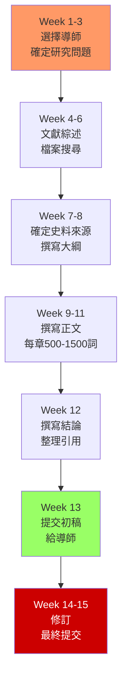

# HIST4023 歷史研究項目 / History Research Project

**Instructor**: History Staff (individual supervisor)
**Department**: History, HKU
**Official source**: [HKU History Course Description](https://history.hku.hk/ug_cd/), [HIST-2425.pdf](https://history.hku.hk/wp-content/uploads/2024/07/HIST-2425.pdf)
**Style**: 袁騰飛式 — 這是 HIST4017 的濃縮版本（6學分 vs 12學分）——同樣的獨立研究訓練，但更短的論文

---

## 重要說明

HIST4023 與 HIST4017 的本質相同：**學生在導師指導下進行獨立歷史研究項目**。核心差異：
- **學分**: HIST4023 是 6 學分（一學期），HIST4017 是 12 學分（全年）
- **論文字數**: HIST4023 通常不超過 7,000 詞，HIST4017 通常 10,000-15,000 詞
- **灵活性**: HIST4023 可以在一學期的任何一個學期修讀（第一或第二學期）
- **申請程序**: 同樣需要提前聯繫導師並獲得導師同意

因此，HIST4023 的所有內容框架與 HIST4017 相同，以下內容請參考 HIST4017 的心智模型、分歧和問題。

---

## HIST4023 vs HIST4017 的核心差異

### 什麼情況下選擇 HIST4023 而不是 HIST4017？

| 維度 | HIST4023 (6學分) | HIST4017 (12學分) |
|---|---|---|
| 時間投入 | 1學期專注 | 全年持續 |
| 論文深度 | 7,000詞，適中深度 | 10,000-15,000詞，深入分析 |
| 適合人群 | 想快速完成獨立研究 | 想做一個真正的大研究項目 |
| 靈活性 | 可以在大三下學期修讀 | 通常大四修讀 |

---

## HIST4023 的核心要求

### 1. 選題（必須比 HIST4017 更精確）
由於字數限制（7,000詞），HIST4023 的研究問題必須比 HIST4017 **更精確、更窄**。

**好的 HIST4023 問題範例**：
- 「1930 年代香港華人女性工廠工人的罷工策略分析：某工廠的個案研究」（精確到一個工廠）
- 「1950 年代香港左派報紙對六七暴動的報道路線分析」（精確到一個歷史事件+一份報紙）

**不好的 HIST4023 問題**：
- 「香港的女性工人史」（太寬，一篇 7,000 詞的論文無法覆蓋）

### 2. 史料要求
7,000 詞論文需要：
- 至少 3-5 個一手檔案來源
- 至少 10-15 篇二手學術文獻
- 清晰的史料批判分析

### 3. 時間線（強烈建議）
- **第 1-3 周**: 確定導師+研究問題
- **第 4-8 周**: 史料搜集+文獻綜述
- **第 9-12 周**: 寫作
- **第 13 周**: 提交初稿
- **第 14-15 周**: 修訂

---

## 深度自測問題（HIST4023 專用）

1. **精確性測試**: 你的研究問題能否在 7,000 詞內得到完整回答？如果不能，你需要把問題收窄到什麼程度？
2. **史料充足性**: 你確定的導師專業領域，與你的研究問題是否匹配？導師的研究專長能否為你的史料搜集提供實質性指導？
3. **與 HIST4015 的連結**: 你在 HIST4015「歷史的理論與實踐」中學到的方法論，如何應用到你的 HIST4023 研究項目中？
4. **可持續性**: 你的 HIST4023 研究項目，是否有可能在未來擴展為 HIST4017 論文或其他研究項目？

---

## 圖解：HIST4023 寫作流程

---

## 總結

HIST4023 的價值不在於字數，而在於：**你能否在 7,000 詞的嚴格限制下，做出一個完整、嚴謹、有自己觀點的歷史研究**。

字數限制是訓練，不是缺陷——它強迫你**精確思考**和**精確表達**，這是所有歷史學家的必備能力。

**自學建議**: 配合 HIST4017 的全部建議 + HIST4015「歷史的理論與實踐」的方法論訓練，專注於「精確」和「深度」的平衡。
