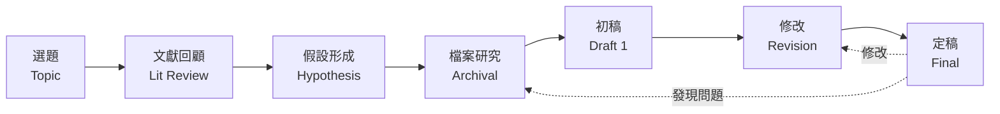
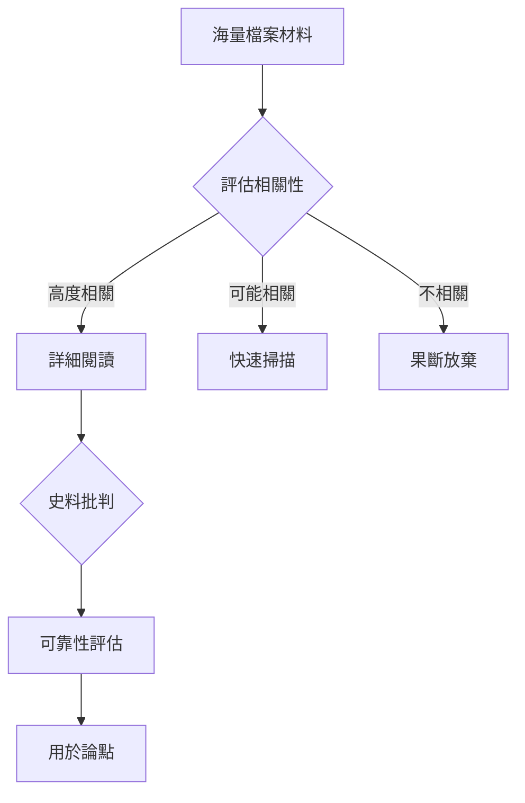
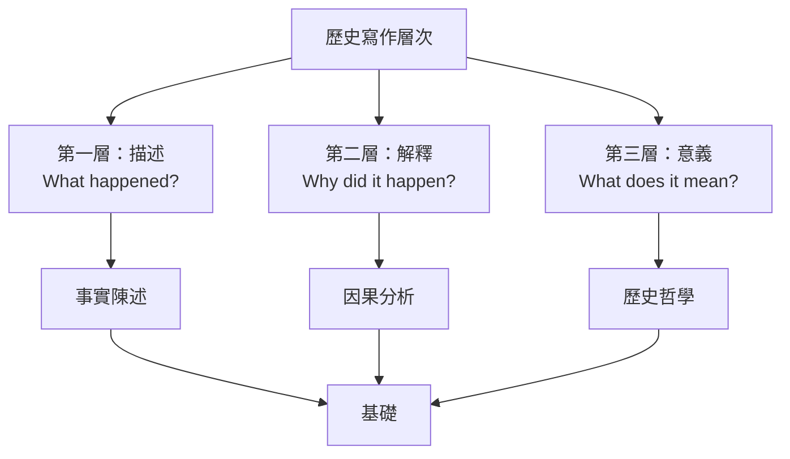
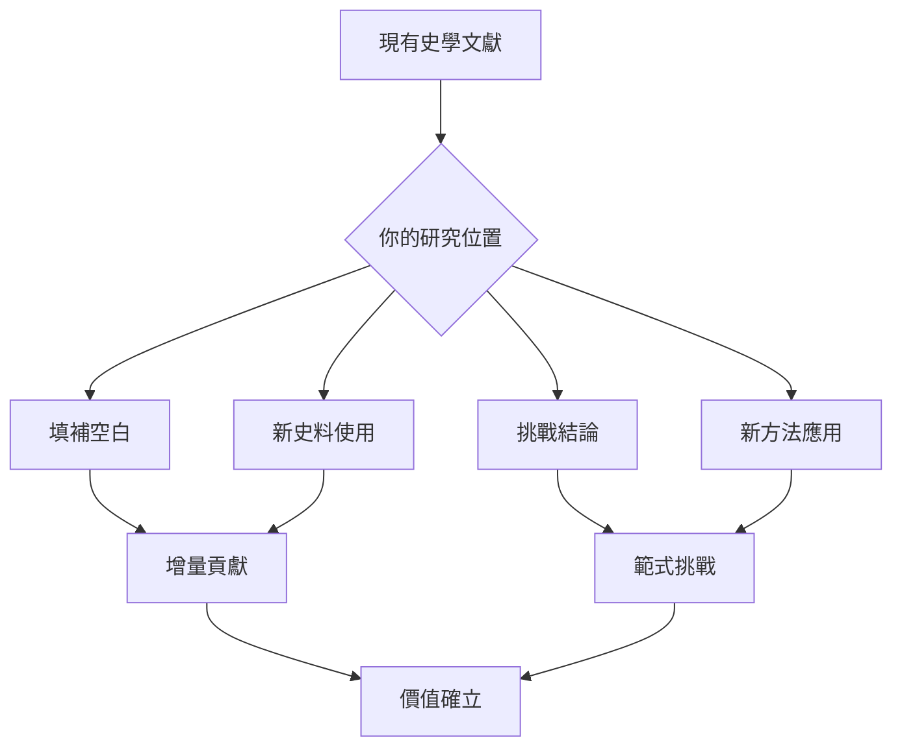
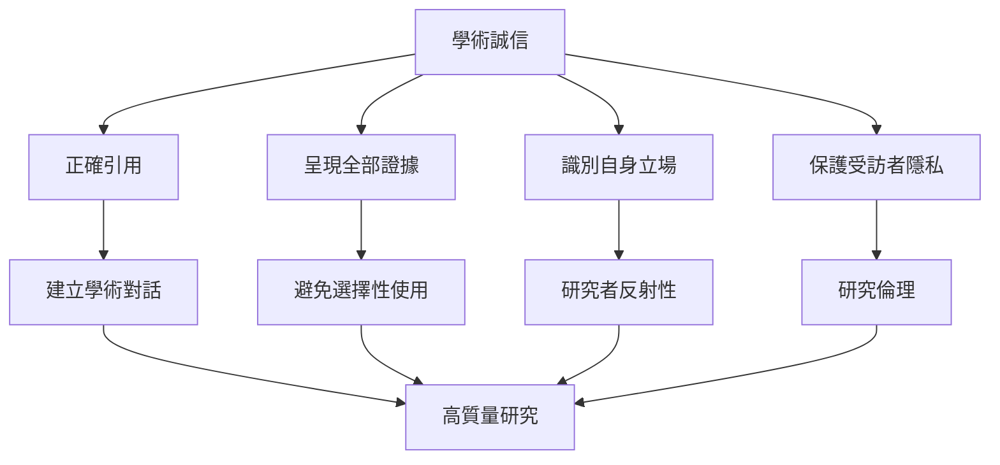
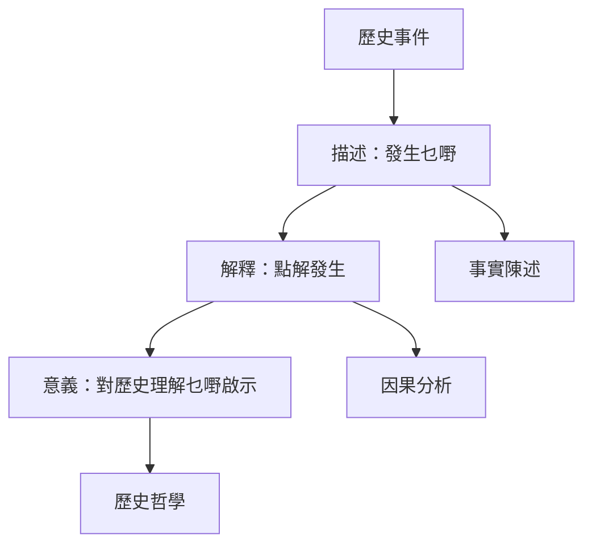
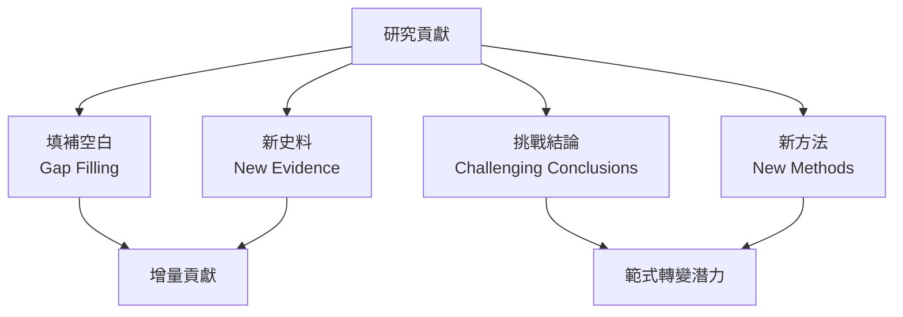
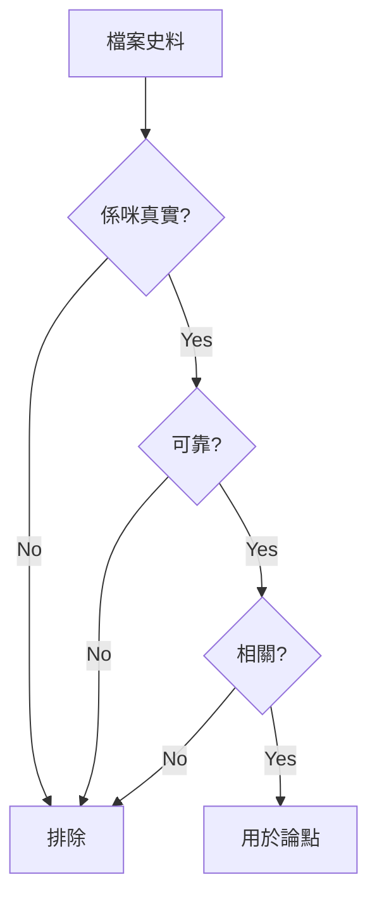
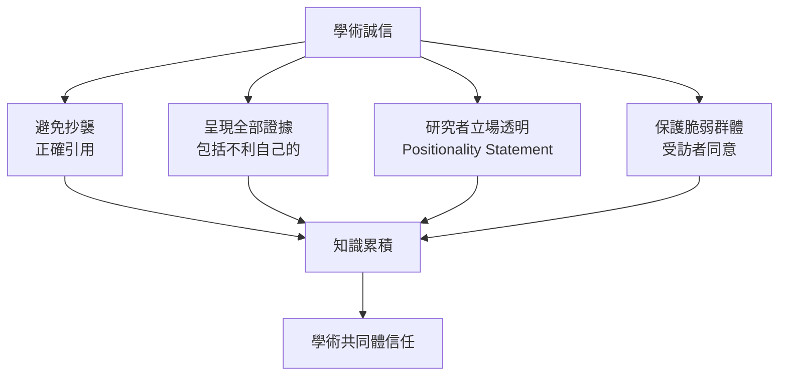

# HIST4023 歷史研究項目 / History Research Project (6 credits)

**Instructor**: History Staff
**Department**: History, HKU
**Official source**: [HKU History Course Description 2024-25](https://history.hku.hk/wp-content/uploads/2024/07/HIST-2425.pdf)
**Style**: 袁騰飛式 — 犀利、聚焦獨立研究項目點解係歷史能力終極測試

---

## 問題 1：這個領域所有專家共享的 5 個核心心智模型

### 心智模型 1：歷史研究係系統工程
學者 **Anthony Grafton** (*The Footnote*, 1997) 研究：歷史研究係從問題→文獻→檔案→分析→寫作嘅系統過程。

學者 **Peter Burke** 分析：歷史學家必須具備「史料識別能力」——喺海量材料中快速判斷相關性。

- HIST4017係12學分論文（全年）；HIST4023係6學分項目（學期制）
- 核心：獨立完成一個研究項目
- 目標：展示完整研究能力

### 心智模型 2：研究項目管理
學者 **Howard Becker** (*Writing for Social Scientists*, 2009) 研究：研究係迭代過程——初稿永遠係垃圾，但係垃圾都係必要嘅。

學者 **Umberto Eco** 分析：點樣讀一本書——主動批判閱讀。

- 選題：興趣+可行性+原創性
- 進度管理：每週目標
- 寫作階段：初稿→修改→定稿

### 心智模型 3：歷史研究寫作規範
學者 **Kate Turabian** (*A Manual for Writers*, 2018) 研究：芝加哥引用格式系历史学标准。

學者 **Joseph Gibaldi** 分析：MLA/APA差異與適用範圍。

- 引用規範：避免抄襲、展示學術對話
- 歷史學常用：Chicago (notes and bibliography)
- 學術誠信：所有借鑒必須標注

### 心智模型 4：研究項目嘅史學貢獻
學者 **Jacques Barzun** (*Clio and the Doctors*, 1975) 研究：歷史寫作有三個讀者——同儕、後輩、公眾。

學者 **David Hackett Fischer** 分析：歷史學家必須回答「乜嘢」和「點解」兩個層次。

- 研究項目要回答具體歷史問題
- 必須喺現有文獻上有定位
- 展示研究對史學嘅貢獻

### 心智模型 5：研究倫理與呈現
學者 **Richard Evans** (*In Defense of History*, 1997) 研究：歷史學家嘅社會責任——唔可以選擇性使用證據。

學者 **Peter Novick** 分析：歷史客觀性嘅可能與限制。

- 呈現完整證據（包括不利自己論點的）
- 避免時代錯置 (presentism)
- 識別研究者自身嘅預設與偏見

---

## 問題 2：3 個根本分歧

### 分歧 1：研究項目——原創性要求有幾高？
- **A 方**：高度原創
  - 必須提出新史料或新解讀
  - 顛覆現有結論
- **B 方**：適度原創
  - 展示獨立研究能力即可
  - 應用現有方法論到新主題

### 分歧 2：寫作風格——學術嚴謹定可讀性？
- **A 方**：學術嚴謹優先
  - 引用規範、語言精確
  - 讀者係同儕學者
- **B 方**：可讀性優先
  - 清晰表達、避免術語
  - 為更廣讀者群寫作

### 分歧 3：研究過程——獨立定導師指導？
- **A 方**：獨立為主
  - 展示自主研究能力
  - 導師只提供方向性建議
- **B 方**：導師指導
  - 定期會議、持續反饋
  - 研究質量更有保障

---

## 問題 3：10 個深度問題

1. 如果你要喺一個學期內完成研究項目，點樣分配時間？邊個階段最危險？
2. 點解好多歷史學生喺檔案研究階段放棄？呢個階段有乜嘢常見陷阱？
3. 如果你嘅研究發現同你原本假設完全相反，你會點做？
4. 點解引用規範咁重要？唔引用有乜嘢後果？
5. 如果你要向非學術觀眾解釋你嘅研究，你會點樣開始？
6. 研究項目點解係歷史學位最重要嘅評估？佢測試咗邊啲能力？
7. 如果你嘅研究涉及敏感歷史事件，你點保持學術中立？
8. 點解「讀歷史書」同「做歷史研究」完全唔同？研究項目揭示咗乜嘢？
9. 如果你完成研究項目後發現另一學者已發表相似研究，你會點做？
10. 歷史研究項目——點解係申請研究所時最有力嘅證明？

---

## 核心心智模型深化（中英對照）

## 1. 獨立研究流程 (Independent Research Process)

### 1.1 Bilingual 概念對照
| 英文概念 | 中英對照 | 歷史含義 | 應用 |
|---|---|---|---|
| Independent Research | 獨立研究 | 自主完成研究項目 | HIST4023核心 |
| Project Management | 項目管理 | 時間與資源分配 | 每週目標設定 |
| Iterative Process | 迭代過程 | 初稿→修改→完善 | 寫作方法 |
| Peer Review | 同儕評審 | 學術品質把控 | 最終審查 |

### 1.2 史料與考據
- Howard Becker: Writing for Social Scientists
- Turabian: A Manual for Writers
- HKU歷史學論文格式要求

### 1.3 袁騰飛式犀利觀察
好多學生以為研究係線性過程：睇書→揾料→寫作。其實係迭代過程——初稿永遠好垃圾，但係無初稿就無垃圾，無垃圾就無好嘢。
研究項目最危險階段係「檔案階段」——好多學生迷失喺海量材料入面，忘記咗自己嘅研究問題。

### 1.4 Deep test question
- 如果你被困喺檔案研究入面，點樣重新聚焦？

### 1.5 圖解

---

## 2. 史料識別與批判 (Source Identification & Criticism)

### 1.1 Bilingual 概念對照
| 英文概念 | 中英對照 | 歷史含義 | 方法 |
|---|---|---|---|
| Source Identification | 史料識別 | 喺海量材料中揾相關 | 關鍵詞/時期/人物 |
| Source Criticism | 史料批判 | 評估史料可靠性 | 內外批評 |
| Archival Research | 檔案研究 | 一手史料收集 | HK PRO / 英國NA |
| Digital Humanities | 數位人文 | 新技術辅助研究 | GIS / NLP |

### 1.2 史料與考據
- HK Public Records Office: 港英政府檔案
- National Archives UK: CO series
- HKU Special Collections

### 1.3 袁騰飛式犀利觀察
檔案就係大海——你可以喺入面航行幾年都揾唔到岸。研究問題就係你嘅指南針，無佢你就會迷失。
而且，檔案有階級性——邊個留下記録、邊個被忽視？呢個本身就係歷史問題。

### 1.4 Deep test question
- 如果你研究嘅歷史群體幾乎無留下記録，你點做？

### 1.5 圖解

---

## 3. 歷史寫作與論證 (Historical Writing & Argumentation)

### 1.1 Bilingual 概念對照
| 英文概念 | 中英對照 | 歷史含義 | 標準 |
|---|---|---|---|
| Clear Thesis | 清晰論點 | 一句話概括研究 | 具體、可爭議 |
| Evidence-based | 證據導向 | 所有論斷有史料支撐 | 可靠性 |
| Counterargument | 反駁論點 | 承認並回應異見 | 學術誠信 |
| Historiographical Position | 史學位置 | 你喺文獻入面嘅位置 | 創新性 |

### 1.2 史料與考據
- Hayden White: Metahistory (1973)
- David Hackett Fischer: Historians' Fallacies

### 1.3 袁騰飛式犀利觀察
歷史寫作有三個層次：
第一層「描述」：發生咗乜嘢？
第二層「解釋」：點解發生？
第三層「意義」：呢個事件對我哋理解歷史有乜嘢啟示？
大部分學生停留在第一層。HIST4023要求至少第二層，最好涉及第三層。

### 1.4 Deep test question
- 你嘅研究項目涉及邊個層次？點解？

### 1.5 圖解

---

## 4. 史學貢獻與創新 (Historiographical Contribution)

### 1.1 Bilingual 概念對照
| 英文概念 | 中英對照 | 歷史含義 | 展示方式 |
|---|---|---|---|
| Gap in Literature | 文獻空白 | 現有研究未覆蓋 | Introduction |
| New Evidence | 新史料 | 未被使用過嘅材料 | Source section |
| New Interpretation | 新解讀 | 挑戰現有結論 | Analysis |
| Methodological Innovation | 方法創新 | 新研究方法 | Methodology |

### 1.2 史料與考據
- HKU歷史學研究評估標準
- Historiographical essay format

### 1.3 袁騰飛式犀利觀察
每一個研究項目都必須回答：「你嘅研究點解重要？」如果答案係「因為之前無人做過」，呢個唔係足夠嘅理由。
你必須展示：你填補咗邊個空白、挑戰咗邊個結論、揭示咗邊個新視角？

### 1.4 Deep test question
- 如果你嘅研究只係「確認」現有結論，咁佢仲有存在價值嗎？

### 1.5 圖解

---

## 5. 研究倫理與學術誠信 (Research Ethics & Academic Integrity)

### 1.1 Bilingual 概念對照
| 英文概念 | 中英對照 | 歷史含義 | 重要性 |
|---|---|---|---|
| Plagiarism | 抄襲 | 未經標注使用他人文字/思想 | 零容忍 |
| Fabrication | 造假 | 伪造史料或數據 | 學術死亡 |
| Citation | 引用 | 標注他人貢獻 | 學術對話 |
| Positionality | 位置性 | 研究者身份影響研究 | 需說明 |

### 1.2 史料與考據
- HKU Academic Honesty Policy
- Turnitin 抄襲檢測軟件

### 1.3 袁騰飛式犀利觀察
學術誠信唔係「避開抄襲」咁簡單，而係「展示你喺邊個學術傳統入面、點解你嘅研究重要」。
引用唔係負擔，而係將你嘅研究接入人類知識共同體嘅橋樑。

### 1.4 Deep test question
- 點解同一段史料，唔同歷史學家會有唔同解讀？

### 1.5 圖解

---

## 深度自測問題詳解

### 詳解 1: 點解研究項目管理咁重要？
6學分，一個學期——時間極其有限。好多學生高估自己能力，低估所需時間。建議：文獻回顧2週、檔案研究4週、寫作4週、修改2週。

### 詳解 2: 點解研究問題係最重要嘅决定？
問題決定一切——問題太寬你就會迷失；問題太窄你就無料可寫。一個好嘅研究問題係：具體（可以回答）、可爭議（有多角度）、有意義（對史學有貢獻）。

### 詳解 3: 如果研究發現同預期相反？
呢個係研究嘅最好結果！預期之外嘅發現先係真正嘅歷史發現。調整thesis，唔好改變證據去遷就你嘅預期。

### 詳解 4: 點解史學史位置咁關鍵？
評估員要問：「你知唔知你喺邊個傳統入面？」如果你唔知道，就表示你嘅研究係喺真空入面做嘅，無學術價值。

### 詳解 5: 如果你要提交研究計劃？
Research proposal要包含：研究問題、為乜嘢重要、文獻回顧嘅初步方向、方法論、預期結論、時間表。

### 詳解 6: 歷史研究可讀性？
好多人以為學術寫作就係枯燥——其實唔係。學術寫作可以清晰、有說服力、甚至優美。關鍵係：每句話服務論點，每段有一個中心思想。

### 詳解 7: 申請研究所——研究項目點用？
研究項目係你最有力嘅sample of work。佢展示：你識做研究、你識寫歷史、你對史學有貢獻嘅能力。

### 詳解 8: 數位工具點用？
GIS mapping, database research, digital archives——新技術可以幫你發現以前無可能發現嘅pattern。但係工具永遠服務問題，唔係問題服務工具。

### 詳解 9: 研究涉及敏感歷史？
如果涉及政治敏感課題，保持學術中立、展示多元視角、避免情緒化語言。記住：歷史學家的責任係呈現複雜性，唔係簡化。

### 詳解 10: 如果你卡住咗？
去傾偈——同導師、同學、甚至非歷史學朋友傾。你解釋嘅過程往往係諗清楚嘅過程。

---

## 5 個 Mermaid 圖解

### 📊 Diagram 1: 研究項目時間線

```mermaid
gantt
    title HIST4023 研究進度
    dateFormat X
    axisFormat %W

    section 學期
    選題確定 :done, 0, 2w
    文獻回顧 :active, 2, 4w
    檔案研究 :active, 4, 8w
    初稿寫作 :future, 8, 12w
    修改完善 :future, 12, 14w
    定稿提交 :future, 14, 15w
```

### 📊 Diagram 2: 歷史寫作層次

### 📊 Diagram 3: 史學貢獻類型

### 📊 Diagram 4: 史料批判決策樹

### 📊 Diagram 5: 學術誠信層次

---

## 總結

1. **研究項目係歷史能力終極測試**：從問題提出到最終寫作，缺一不可。
2. **研究問題係項目成敗關鍵**：太寬太窄都會失敗，必須具體可爭議有意義。
3. **史學史定位係學術對話前提**：知道你喺邊個傳統入面，先可以知道創新喺邊度。
4. **學術誠信係根本**：抄襲零容忍，選擇性使用證據係最大謬誤。
5. **研究係迭代過程**：初稿唔可能完美，但係必須開始。

**最後問題**: 如果你完成研究項目後，有人話「呢個話題已經有人做過」，你點回應？

---
**版權所有 © HKU History Self-Study**
