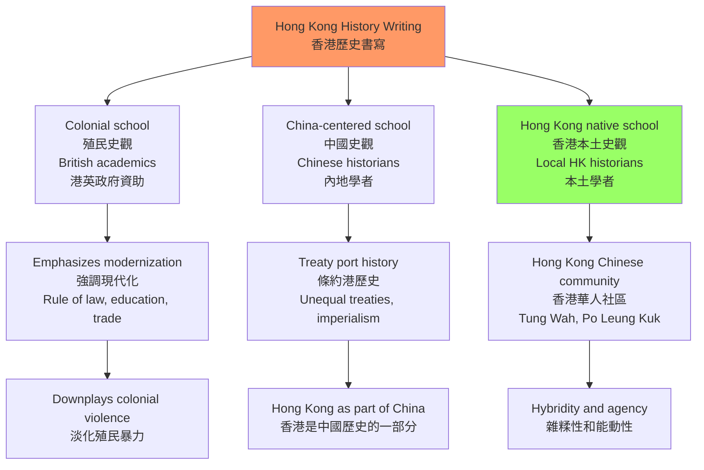
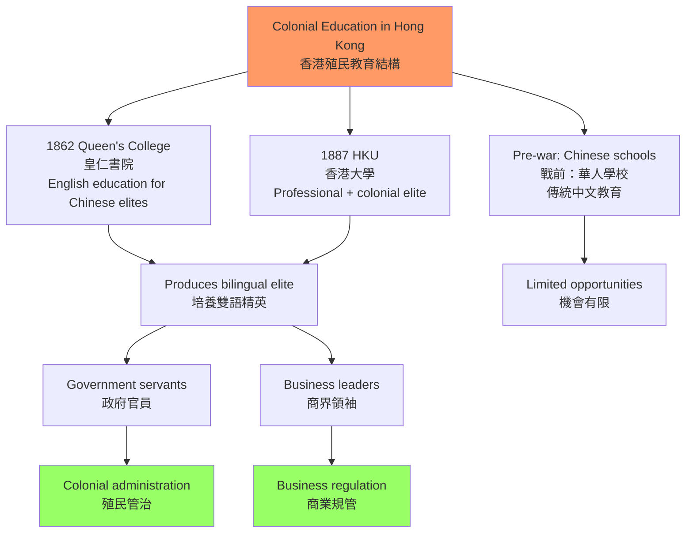
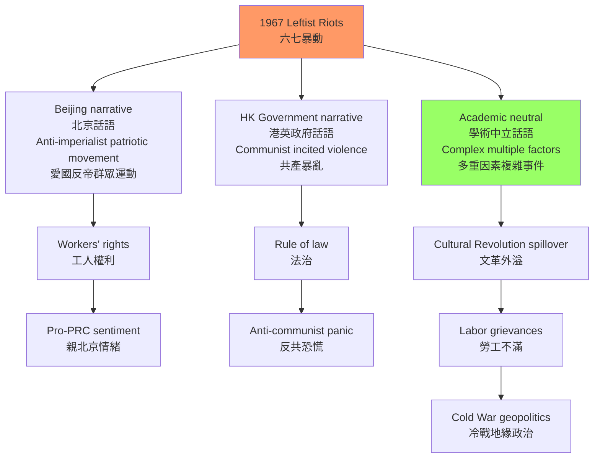
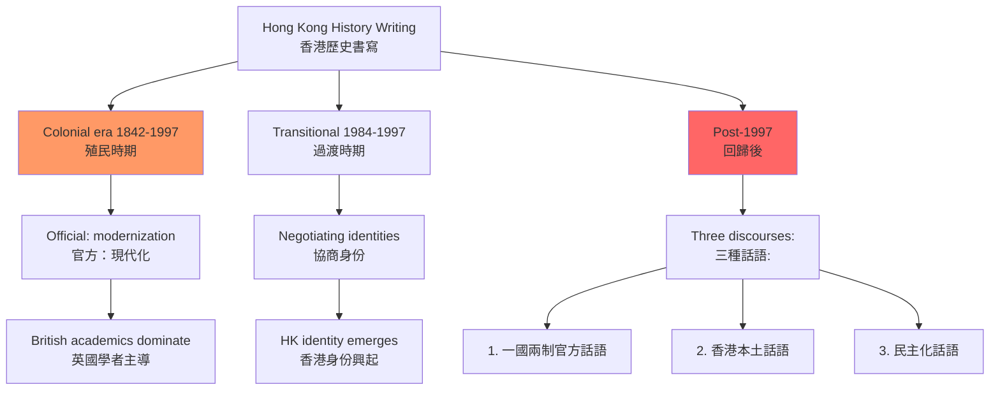
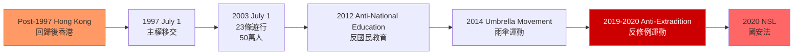

# HIST4024 書寫香港歷史 / Writing Hong Kong History (Capstone)

**Instructor**: Tim Yung / John Carroll (historical)
**Department**: History, HKU
**Official source**: [HKU History Course Description](https://history.hku.hk/ug_cd/), [HIST-2425.pdf](https://history.hku.hk/wp-content/uploads/2024/07/HIST-2425.pdf)
**Style**: 袁騰飛式 — 犀利、聚焦香港歷史書寫的政治性——從史景遷到本土史觀，香港歷史是誰寫的？

---

## 問題 1：這個領域所有專家共享的 5 個核心心智模型是什麼？

### 1. 香港的「歷史特殊性」——殖民性 vs 中國性

**專家如何思考**: 香港的歷史定位長期存在根本爭議：它是「中國歷史的一部分」還是「英帝國史的一部分」？學者 **Steve Tsang** 在 *A Modern History of Hong Kong* (2004) 中論證：香港的殖民歷史和華人社會的「中國性」之間存在持續的張力，這種張力塑造了香港的獨特身份。

- **典型學者**: **Steve Tsang** — *A Modern History of Hong Kong* (2004); **John Carroll** — *Edge of Empires: Chinese Elites and British Colonials in Hong Kong* (2007); **Elizabeth Sinn** — *Power and Charity: The Early History of Tung Wah Hospital* (1989)
- **驗證案例**: 1842 年《南京條約》後，香港島被正式割讓給英國——但當時香港島上的約 5,000 名居民中，99% 是華人，他們的日常生活同時受到英國殖民法和中國傳統習俗的影響

### 2. 殖民教育與知識生產（Colonial Education and Knowledge Production）

**專家如何思考**: 殖民時期的香港教育體系（1862 年創立的皇仁書院、1887 年的香港西醫書院）不僅傳授知識，更是殖民權力運作的一部分。學者 **Peter Cunich** 研究香港教育史，揭示殖民教育如何系統性地培養了華人精英對英帝國的忠誠，同时贬低了華人傳統文化。

- **典型學者**: **Peter Cunich** — research on colonial education in Hong Kong; **John Carroll** — *A Concise History of Hong Kong* (2020)
- **驗證案例**: 1911 年香港大學成立時，主要招生對象是華人精英家庭子弟，但教學語言是英語，課程内容是英國模式——這種教育培養了大量親英的華人精英（港大幫），他們在戰後香港的政商界扮演了核心角色

### 3. 六七暴動的歷史記憶政治（1967 leftist riots）

**專家如何思考**: 1967 年 5 月至 12 月的左派暴動是香港歷史上最重要的政治事件之一。學者 **David Palmer** 和 **Steve Tsang** 等人從不同角度分析了這次暴動：左派認為這是「反帝國主義的愛國運動」；港英政府認為這是「共產黨煽動的暴亂」；普通香港人则夹在兩者之間。

- **典型學者**: **David Palmer** — research on 1967 riots; **Steve Tsang** — *A Modern History of Hong Kong* (2004)
- **驗證案例**: 1967 年 5-8 月：香港左派工會在中國文化大革命影響下，組織了大規模罷工和炸彈襲擊（至少發現 1,100 個土製炸彈）；8-12 月：港英政府實施高壓鎮壓，拘捕了約 1,800 人，驅逐了部分左派人士回內地

### 4. 歷史書寫的政治性（The Politics of Hong Kong History Writing）

**專家如何思考**: 香港歷史書寫從來不是純學術活動——它與政治權力密切相關。學者 **John Carroll** 研究了殖民時期香港歷史書寫的「官方版本」，指出 HKU 和港英政府資助的歷史研究，往往淡化殖民暴力，强调殖民「現代化」成就。

- **典型學者**: **John Carroll** — *Edge of Empires* (2007); **Elizabeth Sinn** — research on Hong Kong's Chinese community; **余光弘** — *Hong Kong: A Documentary History*
- **驗證案例**: 1997 年前，港英政府支持的香港歷史展覽幾乎不提及鴉片戰爭的歷史背景——對他們來說，香港的殖民歷史是「文明使命」的成就，而非帝國主義侵略的結果

### 5. 後回歸香港史的書寫（Post-1997 Hong Kong History）

**專家如何思考**: 1997 年回歸後，香港歷史書寫經歷了重大轉向。學者 **Sing Ming** 等人研究：後回歸時期的香港歷史書寫出現了三種主要話語——「一國兩制」的官方話語、「香港本土認同」的離心話語、「民主化訴求」的公民話語。

- **典型學者**: **Sing Ming** — research on Hong Kong politics post-1997; **Francis Lee** — research on Hong Kong identity
- **驗證案例**: 2003 年 7 月 1 日，約 50 萬香港人上街遊行反對《基本法》第 23 條（國安立法）——這次遊行是香港後回歸最大規模的公民不服從運動，標誌着「香港本土政治主體」的興起

---

## 問題 2：3 個根本分歧

### 分歧 1：香港歷史——殖民史 vs 中國史？
**核心問題**: 香港歷史應該放在英帝國史、中國近代史，還是作為一個獨立的歷史研究對象？

- **學派A（殖民史觀）**: Steve Tsang 等學者強調香港作為英帝國殖民地的特殊性，其歷史主要與英帝國史和帝國主義話語相關
- **學派B（中國史觀）**: 中國學者傾向將香港歷史視為中國近代史的組成部分——條約港歷史、不平等條約體系
- **學派C（香港史觀）**: 越來越多學者（包括 HKU 的 Elizabeth Sinn、John Carroll）主張香港有其獨特的歷史主體性，不能簡單歸入任何一方

### 分歧 2：六七暴動——愛國運動 vs 共產暴亂？
**核心問題**: 1967 年左派暴動是「反帝國主義的愛國群眾運動」還是「共產黨煽動的暴亂」？

- **學派A（左派話語）**: 這是香港工人階級和愛國群眾反對港英殖民壓迫的正義鬥爭
- **學派B（港英官方話語）**: 這是北京支持的共產主義顛覆勢力對香港法治的暴力攻擊
- **學派C（學術中立）**: 這是多重因素共同作用的複雜事件——文革影響+工人階級的不滿+中英冷戰博弈

### 分歧 3：1997 年回歸——解放 vs 殖民延續？
**核心問題**: 1997 年的回歸對香港歷史意味着什麼？

- **學派A（解放論）**: 回歸是香港結束 150 年殖民歷史、回歸祖國的歷史時刻
- **學派B（延續論）**: 「一國兩制」框架下的香港，殖民遺產（普通法、土地契約制度、新聞自由）繼續運作，殖民性以新形式延續
- **學派C（香港主體論）**: 回歸是香港歷史的新階段，但不是「解放」也不是「延續」，而是香港人在新的政治框架中繼續書寫自己歷史的起點

---

## 問題 3：10 個深度問題

1. 比較 **Steve Tsang** 的 *A Modern History of Hong Kong* (2004) 和 **John Carroll** 的 *Edge of Empires* (2007) 對香港殖民歷史的不同處理方式。這兩位學者的政治立場如何影響了他們的歷史敘事？
2. **香港華人精英的「雙重忠誠」**：1842-1941 年間，香港的華人精英（如 李兆增、何東、伍廷芳）如何在英帝國殖民體制和華人文化傳統之間進行策略性協商？這種「雙重忠誠」的歷史先例，對理解 1997 年後香港商界精英的政治立場有什麼啟示？
3. **日佔時期（1941-1945）的香港歷史**：香港重慶之戰（1941年12月8-25日）和三年零八個月的日本佔領，如何同時改變了香港華人和英帝國的政治意識？這個時期香港人口從約 160 萬死亡/逃離至約 60 萬——這種人口劇變的社會後果是什麼？
4. **六七暴動的微觀研究**：以某一個具體社區（如 北角/西環）或工廠為例，分析六七暴動期間普通香港華人的日常生活如何被政治暴力影響？普通人的主觀經歷與官方歷史敘事之間存在什麼差距？
5. **香港與新加坡的比較**：香港和新加坡都是英帝國在東亞的重要殖民地，1945-1960 年代兩地的政治發展軌跡却截然不同——新加坡走向了人民行動黨的威權民主，香港維持了港英的間接管治。這個比較如何幫助我們理解香港殖民歷史的特殊性？
6. **「香港本土認同」的歷史根源**：香港本土意識的形成（1980-1990 年代）與《中英聯合聲明》（1984）和回歸的準備期有什麼關係？這種本土認同與中國民族主義之間的張力，在香港歷史書寫中如何體現？
7. **普通法與香港法制遺產**：香港實行的普通法制度（Common Law）是英國殖民統治最重要的制度遺產之一。這種制度遺產對香港的法治、新聞自由和司法獨立有什麼具體影響？這種影響在 2020 年《國安法》實施後有什麼變化？
8. **香港歷史的史料問題**：香港歷史研究面臨哪些特殊的史料挑戰？英國殖民檔案（存於英國國家檔案館 Kew Gardens）和香港本地檔案（香港歷史檔案館）各自的优势和局限是什麼？
9. **歷史教育與身份建構**：香港中小學的歷史科和通識科（已取消）在香港青少年身份建構中扮演了什麼角色？香港和內地歷史教育的內容差異如何影響了兩地青少年的歷史認知？
10. **後回歸香港史寫作的倫理**：1997 年後，香港歷史學家如何在「服務國家認同」和「保持學術獨立」之間取得平衡？這種倫理困境如何影響了香港歷史書寫的内容和方向？

---

# 核心心智模型深化（中英對照）

## 1. 香港的「歷史特殊性」

### 1.1 Bilingual 概念對照
| 英文 | 中文 | 歷史含義 | 學者 |
|---|---|---|---|
| Colonial Sonderweg | 殖民特殊路徑 | 香港不同於其他中國城市 | Steve Tsang |
| Chinese identity | 中國性 | 華人社會的中國文化根源 | Elizabeth Sinn |
| Hybrid identity | 雜糅身份 | 殖民+中國+本土 | John Carroll |
| Treaty port | 條約港 | 不平等條約的歷史產物 | John K. Fairbank |

### 1.3 袁騰飛式犀利觀察
香港歷史書寫最諷刺的一點：**殖民者不讓香港人書寫自己的歷史，卻抱怨香港人對自己歷史一無所知**。

港英時期，香港歷史研究主要由英國學者和 HKU 的英國教授主導，華人學者的研究空間極為有限。他們培養出來的華人精英，習慣用英文思考、用英語寫論文，對香港華人社會的底層生活一無所知。

這種「知識生產的殖民化」，是香港歷史書寫長期以來面臨的最大問題——**我們用英國人的眼睛看香港歷史，看了一百五十年，突然要轉換視角，談何容易？**

### 1.5 圖解

---

## 2. 殖民教育與知識生產

### 2.1 圖解：香港教育的殖民結構

---

## 3. 六七暴動的歷史記憶政治

### 3.1 圖解：六七暴動的多重話語

---

## 4. 歷史書寫的政治性

### 4.1 圖解：香港歷史書寫的三個時代

---

## 5. 後回歸香港史

### 5.1 圖解：後回歸香港政治里程碑

---

# 總結

1. **香港歷史書寫從來不是純學術**：每一種香港歷史敘事，背後都站着政治權力的影子——殖民史觀、中國史觀、本土史觀，各自服務於不同的政治身份建構。

2. **六七暴動是香港歷史的轉折點**：它結束了香港華人對政治的冷漠，開啟了香港政治的群眾動員時代。

3. **殖民教育系統性地塑造了香港精英的意識形態**：港英時期的英語教育，不僅傳授知識，更傳授了一種看待香港歷史的特定視角——這種視角的影響至今仍然存在。

4. **回歸後的香港歷史書寫面臨根本的身份政治張力**：在「中國歷史的一部分」「英帝國史的一部分」和「香港本土史」三種框架之間，香港歷史學家的選擇，不僅是學術選擇，更是政治立場的表達。

5. **香港歷史研究的最大挑戰是史料**：英國殖民檔案主要保存在倫敦，香港本地檔案有限，華人社會的底層歷史（如工廠女工、少數族裔）極度缺乏文字記錄——如何填補這些空白，是香港歷史學家的最大任務。

**自學建議**: 配合 Steve Tsang 的 *A Modern History of Hong Kong* + John Carroll 的 *Edge of Empires* + Elizabeth Sinn 的 Tung Wah Hospital 研究，輸出讀書筆記到 `06_Reading_Notes/`。
