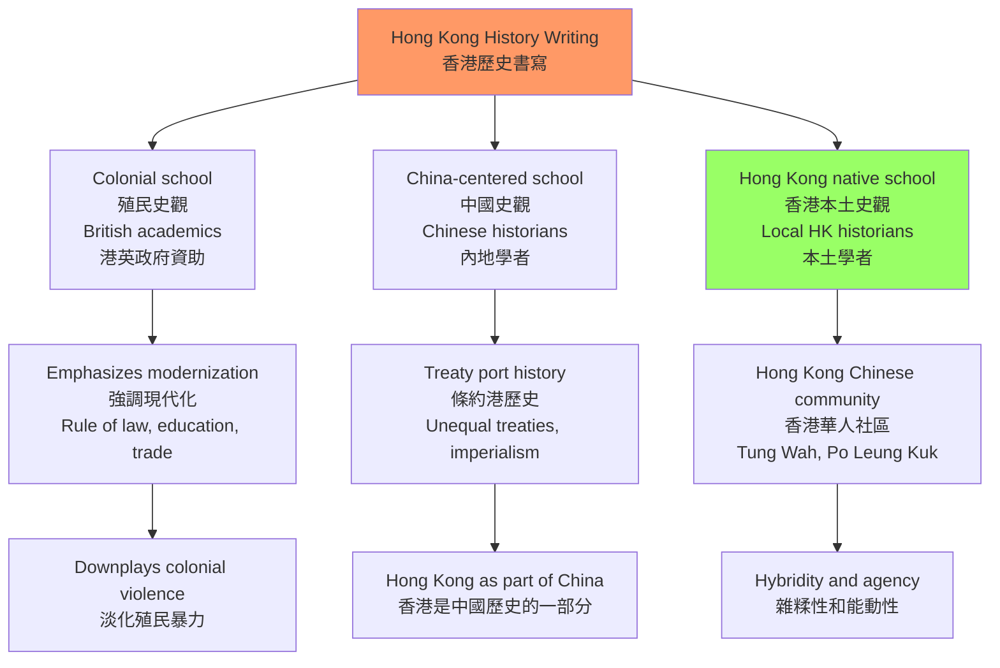
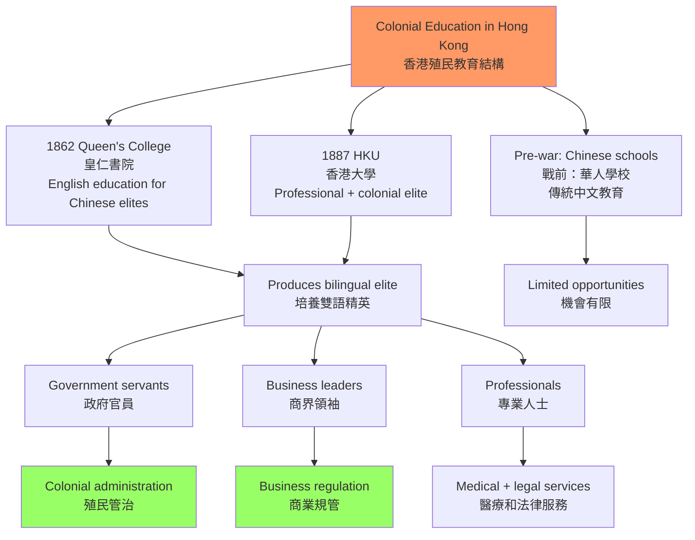
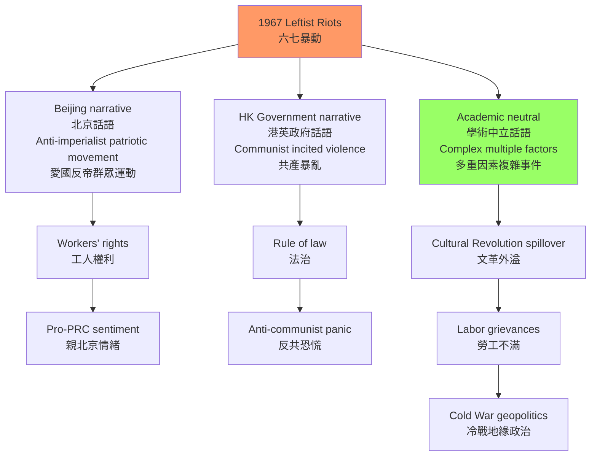
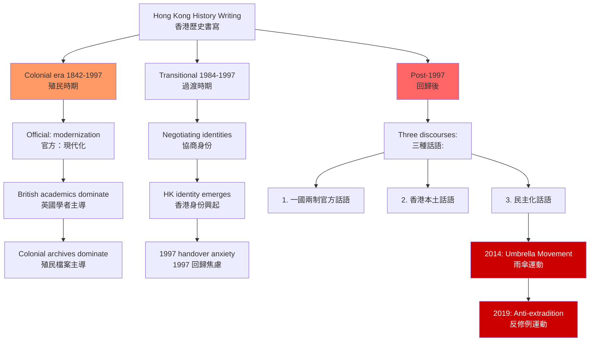
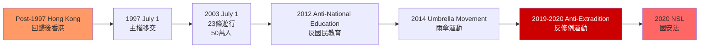

# HIST4024 書寫香港歷史 / Writing Hong Kong History

/** HKU | 6 credits | Capstone Experience */

/**Instructor**: Tim Yung | Department: History, HKU
**Tim Yung** is Lecturer and MA in Hong Kong History Programme Coordinator at HKU. BA Cantab (Cambridge); PhD HKU. Historian of Hong Kong, modern China, and world Christianity. Research: religious encounter between foreign missionaries and modern China, especially the formation of Chinese Christianity in the 19th and 20th centuries. Publications: *Keeping up with the Chinese: Constituting and Reconstituting the Anglican Church in South China, 1897-1951* (Studies in Church History, 2020); *Visions and Realities in Hong Kong Anglican Mission Schools, 1849-1941* (Studies in Church History, 2021). Contact: timyungk@hku.hk
**Official source**: [HKU History Course Description](https://history.hku.hk/ug_cd/), [HIST-2425.pdf](https://history.hku.hk/wp-content/uploads/2024/07/HIST-2425.pdf)
**Course Description**: This course looks at various themes, problems, and issues in Hong Kong's history since the 1800s. Rather than focusing on historical events, we will look at the ways in which certain themes have been studied. Thus we will be less concerned with dates and facts than with analysis and interpretation. Topics include: general approaches to Hong Kong history, the Opium War and the British occupation of Hong Kong, colonial education, regulation of prostitution and the mui tsai system, colonial medicine, colonialism and nationalism, WWII and the Japanese occupation, industrialization and economic development, history and identity, legacies and artifices of colonial rule, and history and memory.
**Assessment**: 100% coursework.
**Style**: 袁騰飛式 — 犀利、聚焦香港歷史書寫的政治性——從史景遷到本土史觀，香港歷史是誰寫的？

---

## 問題 1：這個領域所有專家共享的 5 個核心心智模型

### 1. 香港的「歷史特殊性」——殖民性與中國性的持續張力
**定義**: 香港的歷史定位長期存在根本爭議：它是「中國歷史的一部分」還是「英帝國史的一部分」？還是具有獨立的歷史主體性？這個問題不僅是學術問題，更是政治身份問題。

**學者**: **Steve Tsang** — *A Modern History of Hong Kong* (2004, I.B. Tauris)。Steve Tsang 強調香港殖民歷史的特殊性，認為香港不同於其他中國城市，有其獨特的殖民現代化路徑。

**學者**: **John Carroll** — *Edge of Empires: Chinese Elites and British Colonials in Hong Kong* (2007, Harvard University Press); *A Concise History of Hong Kong* (2020)。Carroll 研究香港華人精英與英國殖民者之間的互動，揭示香港的「雜糅性」（hybridity）。

**學者**: **Elizabeth Sinn** — *Power and Charity: The Early History of Tung Wah Hospital* (1989, Oxford University Press)。研究香港華人慈善機構，揭示華人社區的能動性。

**驗證**: 1842 年《南京條約》後，香港島被正式割讓給英國——但當時香港島上的約 5,000 名居民中，99% 是華人，他們的日常生活同時受到英國殖民法和中國傳統習俗的影響。

### 2. 殖民教育與知識生產——誰書寫香港歷史
**定義**: 殖民時期的香港教育體系（1862 年創立的皇仁書院、1887 年的香港西醫書院）不僅傳授知識，更是殖民權力運作的一部分。殖民教育如何系統性地培養了華人精英對英帝國的忠誠，同時贬低了華人傳統文化？

**學者**: **Peter Cunich** — 研究香港教育史，揭示殖民教育與知識生產的關係。

**學者**: **Tim Yung** (HKU) — 研究香港聖公會教會學校（1849-1941），揭示殖民教育如何塑造華人基督徒的身份認同。

**學者**: **John Carroll** (同上)。

**驗證**: 1911 年香港大學成立時，主要招生對象是華人精英家庭子弟，但教學語言是英語，課程內容是英國模式——這種教育培養了大量親英的華人精英（港大幫），他們在戰後香港的政商界扮演了核心角色。

### 3. 六七暴動的歷史記憶政治——香港政治的轉折點
**定義**: 1967 年 5 月至 12 月的左派暴動是香港歷史上最重要的政治事件之一。學者從不同角度分析了這次暴動：左派認為這是「反帝國主義的愛國運動」；港英政府認為這是「共產黨煽動的暴亂」；普通香港人則夾在兩者之間。

**學者**: **David Palmer** — 研究六七暴動的歷史學家。

**學者**: **Steve Tsang** (同上)。

**驗證**: 
- **1967 年 5-8 月**: 香港左派工會在中國文化大革命影響下，組織了大規模罷工和炸彈襲擊——至少發現 1,100 個土製炸彈
- **1967 年 8-12 月**: 港英政府實施高壓鎮壓，拘捕了約 1,800 人，驅逐了部分左派人士回內地
- **暴動後果**: 港英政府開始推行「麥理浩時代」的社會改革（1970 年代公共房屋、廉政公署等），结束了對政治的冷漠時代

### 4. 歷史書寫的政治性——誰的故事被記住
**定義**: 香港歷史書寫從來不是純學術活動——它與政治權力密切相關。John Carroll 研究了殖民時期香港歷史書寫的「官方版本」，指出 HKU 和港英政府資助的歷史研究，往往淡化殖民暴力，強調殖民「現代化」成就。

**學者**: **John Carroll** — *Edge of Empires* (2007); *A Concise History of Hong Kong* (2020)。

**學者**: **余光弘** — *Hong Kong: A Documentary History*。

**學者**: **Michel-Rolph Trouillot** — *Silencing the Past* (1995)。Trouillot 的「沉默」（silencing）理論適用於理解香港歷史書寫中的邊緣化群體。

**驗證**: 1997 年前，港英政府支持的香港歷史展覽幾乎不提及鴉片戰爭的歷史背景——對他們來說，香港的殖民歷史是「文明使命」的成就，而非帝國主義侵略的結果。

### 5. 後回歸香港史的書寫——身份政治的持續演變
**定義**: 1997 年回歸後，香港歷史書寫經歷了重大轉向。學者識別了後回歸時期香港歷史書寫的三種主要話語：「一國兩制」的官方話語、「香港本土認同」的離心話語、「民主化訴求」的公民話語。

**學者**: **Sing Ming** — 研究後回歸香港政治；**Francis Lee** — 研究香港身份認同。

**學者**: **Helen Siu** 和 **Agnes Ku** — 編輯 *Hong Kong: Society, Culture and Politics in Post-colonial Hong Kong* (2008, HKU Press)。

**驗證**: 
- **2003 年 7 月 1 日**: 約 50 萬香港人上街遊行反對《基本法》第 23 條（國安立法）——這次遊行是香港後回歸最大規模的公民不服從運動，標誌著「香港本土政治主體」的興起
- **雨傘運動（2014）** 和 **反修例運動（2019）**：這些政治運動如何影響了香港歷史書寫的話語？

---

## 問題 2：3 個根本分歧

### 分歧 1：香港歷史——殖民史 vs 中國史？
**核心問題**: 香港歷史應該放在英帝國史、中國近代史，還是作為一個獨立的歷史研究對象？

- **學派A（殖民史觀）**: Steve Tsang 等學者強調香港作為英帝國殖民地的特殊性，其歷史主要與英帝國史和帝國主義話語相關
- **學派B（中國史觀）**: 中國學者傾向將香港歷史視為中國近代史的組成部分——條約港歷史、不平等條約體系
- **學派C（香港史觀）**: 越來越多學者（包括 HKU 的 Elizabeth Sinn、John Carroll、Tim Yung）主張香港有其獨特的歷史主體性，不能簡單歸入任何一方

### 分歧 2：六七暴動——愛國運動 vs 共產暴亂？
**核心問題**: 1967 年左派暴動是「反帝國主義的愛國群眾運動」還是「共產黨煽動的暴亂」？

- **學派A（左派話語）**: 這是香港工人階級和愛國群眾反對港英殖民壓迫的正義鬥爭
- **學派B（港英官方話語）**: 這是北京支持的共產主義顛覆勢力對香港法治的暴力攻擊
- **學派C（學術中立）**: 這是多重因素共同作用的複雜事件——文革影響+工人階級的不滿+中英冷戰博弈

### 分歧 3：1997 年回歸——解放 vs 殖民延續？
**核心問題**: 1997 年的回歸對香港歷史意味着什麼？

- **學派A（解放論）**: 回歸是香港結束 150 年殖民歷史、回歸祖國的歷史時刻
- **學派B（延續論）**: 「一國兩制」框架下的香港，殖民遺產（普通法、土地契約制度、新聞自由）繼續運作，殖民性以新形式延續
- **學派C（香港主體論）**: 回歸是香港歷史的新階段，但不是「解放」也不是「延續」，而是香港人在新的政治框架中繼續書寫自己歷史的起點

---

## 問題 3：10 個深度問題

1. **比較 Steve Tsang 的 *A Modern History of Hong Kong* (2004) 和 John Carroll 的 *Edge of Empires* (2007)** 對香港殖民歷史的不同處理方式。這兩位學者的政治立場如何影響了他們的歷史敘事？他們對「殖民現代化」的評估有什麼根本差異？

2. **香港華人精英的「雙重忠誠」**: 1842-1941 年間，香港的華人精英（如何東爵士、伍廷芳、羅文錦）如何在英帝國殖民體制和華人文化傳統之間進行策略性協商？這種「雙重忠誠」的歷史先例，對理解 1997 年後香港商界精英的政治立場有什麼啟示？

3. **日佔時期（1941-1945）的香港歷史**: 香港重慶之戰（1941 年 12 月 8-25 日）和三年零八個月的日本佔領，如何同時改變了香港華人和英帝國的政治意識？這個時期香港人口從約 160 萬死亡/逃離至約 60 萬——這種人口劇變的社會後果是什麼？

4. **六七暴動的微觀研究**: 以某一個具體社區（如北角或西環）或工廠為例，分析六七暴動期間普通香港華人的日常生活如何被政治暴力影響？普通人的主觀經歷與官方歷史敘事之間存在什麼差距？

5. **香港與新加坡的比較**: 香港和新加坡都是英帝國在東亞的重要殖民地，1945-1960 年代兩地的政治發展軌跡卻截然不同——新加坡走向了人民行動黨的威權民主，香港維持了港英的間接管治。這個比較如何幫助我們理解香港殖民歷史的特殊性？

6. **「香港本土認同」的歷史根源**: 香港本土意識的形成（1980-1990 年代）與《中英聯合聲明》（1984）和回歸的準備期有什麼關係？這種本土認同與中國民族主義之間的張力，在香港歷史書寫中如何體現？

7. **普通法與香港法制遺產**: 香港實行的普通法制度（Common Law）是英國殖民統治最重要的制度遺產之一。這種制度遺產對香港的法治、新聞自由和司法獨立有什麼具體影響？這種影響在 2020 年《國安法》實施後有什麼變化？

8. **香港歷史的史料問題**: 香港歷史研究面臨哪些特殊的史料挑戰？英國殖民檔案（存於英國國家檔案館 Kew Gardens）和香港本地檔案（香港歷史檔案館）各自的優勢和局限是什麼？如何填補華人社會底層歷史的檔案空白？

9. **Tim Yung 的研究路徑**: 以 Tim Yung 對香港聖公會學校（1849-1941）的研究為例，分析「宗教史」視角如何揭示被主流政治史忽略的香港歷史面向？Tim Yung 的 BA Cambridge、PhD HKU 學術路徑，如何塑造了他研究香港歷史的獨特視角？

10. **歷史教育與身份建構**: 香港中小學的歷史科和通識科（在 2024 年已被重組）在香港青少年身份建構中扮演了什麼角色？香港和內地歷史教育的內容差異如何影響了兩地青少年的歷史認知？

---

# 核心心智模型深化（中英對照）

## 1. 香港的「歷史特殊性」

### 1.1 Bilingual 概念對照
| 英文 | 中文 | 歷史含義 | 學者 |
|---|---|---|---|
| Colonial Sonderweg | 殖民特殊路徑 | 香港不同於其他中國城市 | Steve Tsang |
| Chinese identity | 中國性 | 華人社會的中國文化根源 | Elizabeth Sinn |
| Hybrid identity | 雜糅身份 | 殖民+中國+本土 | John Carroll |
| Treaty port | 條約港 | 不平等條約的歷史產物 | John K. Fairbank |

### 1.3 袁騰飛式犀利觀察
香港歷史書寫最諷刺的一點：**殖民者不讓香港人書寫自己的歷史，卻抱怨香港人對自己歷史一無所知**。

港英時期，香港歷史研究主要由英國學者和 HKU 的英國教授主導，華人學者的研究空間極為有限。他們培養出來的華人精英，習慣用英文思考、用英語寫論文，對香港華人社會的底層生活一無所知。

這種「知識生產的殖民化」，是香港歷史書寫長期以來面臨的最大問題——**我們用英國人的眼睛看香港歷史，看了一百五十年，突然要轉換視角，談何容易？**

### 1.5 圖解：香港歷史書寫的三個流派

---

## 2. 殖民教育與知識生產

### 2.1 香港教育機構的殖民結構
| 機構 | 成立年份 | 教學語言 | 主要招生對象 | 歷史影響 |
|---|---|---|---|---|
| 皇仁書院 | 1862 | 英語 | 華人精英 | 培養親英精英 |
| 香港西醫書院 | 1887 | 英語 | 華人精英 | 專業人才輸出 |
| 香港大學 | 1911 | 英語 | 華人精英 | 港大幫的形成 |
| 華仁書院 | 1919 | 英語 | 華人精英 | 天主教會網絡 |

### 2.2 圖解：香港教育的殖民結構

---

## 3. 六七暴動的歷史記憶政治

### 3.1 六七暴動關鍵事件時間線
| 日期 | 事件 |
|---|---|
| 1967 年 5 月 | 左派工會在文革影響下開始罷工 |
| 1967 年 5-6 月 | 炸彈襲擊高峰，至少發現 1,100 個土製炸彈 |
| 1967 年 7-8 月 | 港英政府高壓鎮壓，拘捕約 1,800 人 |
| 1967 年 12 月 | 暴動平息 |
| 1970 年代 | 港英政府推行大規模社會改革（房屋、廉政等） |

### 3.2 圖解：六七暴動的多重話語

---

## 4. 歷史書寫的政治性

### 4.1 圖解：香港歷史書寫的三個時代

---

## 5. 後回歸香港史

### 5.1 圖解：後回歸香港政治里程碑

---

## Tim Yung 的研究方向

### 研究專長
| 方向 | 具體內容 |
|---|---|
| 宗教史 | 基督教在中國和香港的傳播 |
| 教育史 | 香港聖公會學校 1849-1941 |
| 身份建構 | 華人基督徒的雙重認同 |
| 帝國與去殖民 | 傳教士網絡與帝國主義 |

### 關鍵出版
1. *Keeping up with the Chinese: Constituting and Reconstituting the Anglican Church in South China, 1897-1951* (Studies in Church History, 2020)
2. *Visions and Realities in Hong Kong Anglican Mission Schools, 1849-1941* (Studies in Church History, 2021)

### 對 HIST4024 的啟示
Tim Yung 的研究揭示了一個被主流政治史忽略的香港歷史面向：**華人基督徒如何同時經歷「基督教化」和「中國化」？他們的「雙重身份」如何影響了他們對殖民統治和中國民族主義的態度？**

這種「宗教史」視角告訴我們：香港歷史不僅是政治權力的歷史，更是普通人日常生活、信仰實踐和社區建構的歷史。

---

# 總結

1. **香港歷史書寫從來不是純學術**: 每一種香港歷史敘事，背後都站着政治權力的影子——殖民史觀、中國史觀、本土史觀，各自服務於不同的政治身份建構。殖民時期的「官方歷史」淡化殖民暴力，強調「文明使命」；回歸後的「本土史觀」則試圖恢復被忽略的聲音。

2. **六七暴動是香港歷史的轉折點**: 它结束了香港華人對政治的冷漠，開啟了香港政治的群眾動員時代。這次暴動的「歷史記憶政治」至今仍在——不同政治立場的人對這次事件有完全不同的理解。

3. **殖民教育系統性地塑造了香港精英的意識形態**: 港英時期的英語教育，不僅傳授知識，更傳授了一種看待香港歷史的特定視角——這種視角的影響至今仍然存在於香港的精英階層中。

4. **回歸後的香港歷史書寫面臨根本的身份政治張力**: 在「中國歷史的一部分」「英帝國史的一部分」和「香港本土史」三種框架之間，香港歷史學家的選擇，不僅是學術選擇，更是政治立場的表達。

5. **香港歷史研究的最大挑戰是史料**: 英國殖民檔案主要保存在倫敦，香港本地檔案有限，華人社會的底層歷史（如工廠女工、少數族裔）極度缺乏文字記錄——如何填補這些空白，是香港歷史學家的最大任務。Tim Yung 的宗教史研究提供了一個有價值的視角——華人社區的宗教生活，可能是理解被忽略群體的關鍵。

**最後問題**: 如果你是 Tim Yung，你會選擇研究香港歷史中的哪個「被忽略的群體」？

---

## 延伸閱讀：香港歷史研究核心書單

### 殖民時期
| 書名 | 作者 | 年份 | 核心貢獻 |
|---|---|---|---|
| *Edge of Empires* | John Carroll | 2007 | 華人精英與英殖民者的互動 |
| *A Concise History of Hong Kong* | John Carroll | 2020 | 綜合性香港歷史概述 |
| *Power and Charity* | Elizabeth Sinn | 1989 | 東華醫院與華人社區 |
| *A Modern History of Hong Kong* | Steve Tsang | 2004 | 殖民視角的香港歷史 |

### 戰後時期
| 書名 | 作者 | 年份 | 核心貢獻 |
|---|---|---|---|
| *Brushed by the Great Wave* | 蔡思行 | 2019 | 香港華人家族史 |
| *Hong Kong: Becoming Chinese* | Helen Siu | 1989 | 認同政治 |
| *Hong Kong: Society, Culture and Politics* | Siu & Ku (eds.) | 2008 | 後殖民香港研究 |

### 宗教與教育史
| 書名 | 作者 | 年份 | 核心貢獻 |
|---|---|---|---|
| HKU Anglican Mission Schools | Tim Yung | 2021 | 教會學校研究 |
| *Colonialism and the Call* | 蔡思行 | 2015 | 香港教育史 |

### 香港歷史數據庫
| 資源 | URL | 內容 |
|---|---|---|
| HK Memory | hkmemory.hk | 香港歷史多媒體 |
| HK Record Office | grs.hk | 政府檔案 |
| HK Oral History Archives | sunzi.lib.hku.hk/hkoh | 口述歷史檔案 |
| British National Archives | nationalarchives.gov.uk | 殖民檔案 |
| Gwulo | gwulo.com | 舊香港歷史 | 

**自學建議**: 配合 Steve Tsang 的 *A Modern History of Hong Kong* (2004) + John Carroll 的 *Edge of Empires* (2007) + Elizabeth Sinn 的 Tung Wah Hospital 研究 + Tim Yung 的香港聖公會學校研究，輸出讀書筆記到 `06_Reading_Notes/`。
