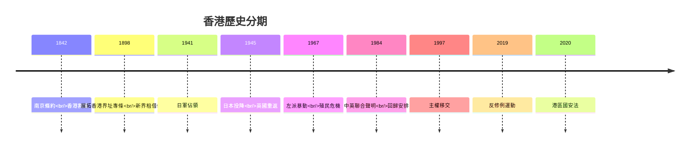
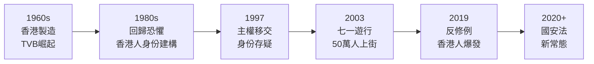
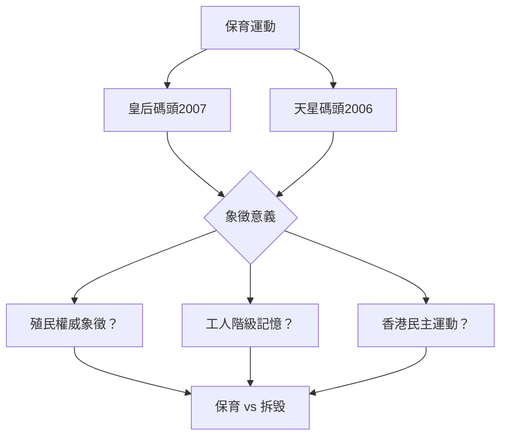
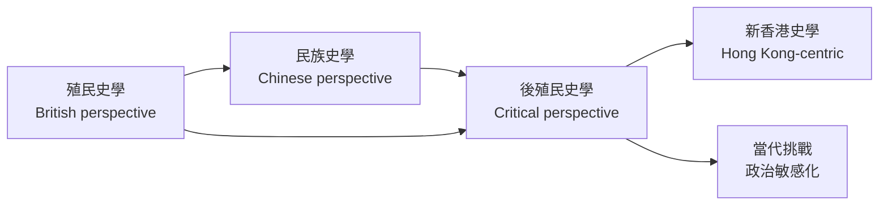
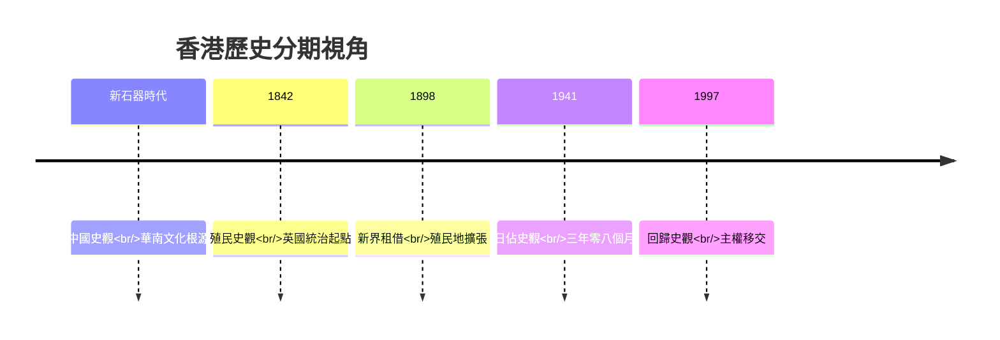
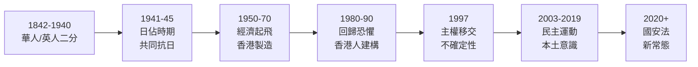
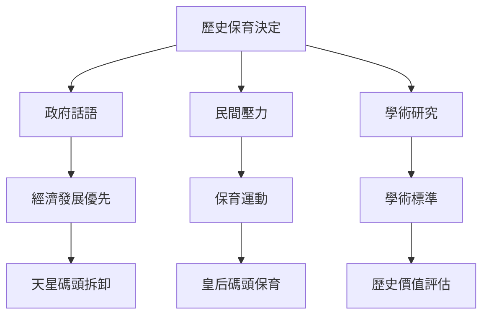
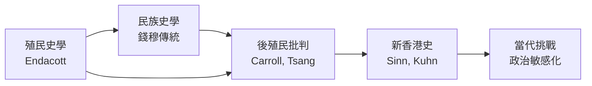

# HIST4024 書寫香港歷史 / Writing Hong Kong History (6 credits)

**Instructor**: John M. Carroll (PhD Harvard)
**Department**: History, HKU
**Official source**: [HKU History Course Description 2024-25](https://history.hku.hk/wp-content/uploads/2024/07/HIST-2425.pdf)
**Style**: research-based — 犀利、聚焦香港歷史點解被書寫、點解被忽視、點解被政治化

---

## 問題 1：這個領域所有專家共享的 5 個核心心智模型

### 心智模型 1：香港歷史分期問題
學者 **Steve Tsang** (*A Modern History of Hong Kong*, 2004) 研究：香港歷史分期——殖民史視角 vs 中國史視角，邊個優先？

學者 **John Carroll** (*A Concise History of Hong Kong*, 2007) 分析：香港獨特性——唔係中國歷史嘅附屬，而係獨特嘅殖民現代性。

- 1842 年《南京條約》——香港割讓
- 1898 年《展拓香港界址專條》——新界租借
- 1941-1945 年日佔時期
- 1984 年《中英聯合聲明》——回歸安排
- 1997 年7月1日——主權移交

### 心智模型 2：殖民統治合法性爭論
學者 **John Carroll** (*Edge of Empires*, 2005) 研究：香港華人精英與英國殖民者嘅複雜關係——合作、抵抗、協商。

學者 **Mark Hampton** 分析：殖民遺產批判——點解香港身份認同咁獨特？

- 1900-1930 年代華人精英階層形成
- 1967 年左派暴動——殖民合法性危機
- 1980-90 年代「民主回歸」運動
- 2019-2020 年反修例運動——殖民遺產再審視

### 心智模型 3：香港經濟奇蹟與社會不平等
學者 **G.B. Endacott** 研究：香港經濟起飛——1960-80 年代製造業騰飛。

學者 **David Faure** 分析：香港华人商业史。

- 1950 年代轉口貿易起飛
- 1967 年暴動後社會改革
- 1970 年代工業化
- 1980 年代製造業北移、服務業轉型
- 1997 前移民潮

### 心智模型 4：身份認同政治
學者 **Regina Ip** 分析：香港民族主義 vs 中華民族主義——邊個係「正當」？

學者 **Laurence Leung** 研究：後97香港身份認同——「香港人」身份點解咁強烈？

- 1970 年代香港電視文化形成（TVB）
- 1997 年「主權移交」話語建構
- 2003 年七一遊行——50萬人上街
- 2019 年「香港人」身份爆發

### 心智模型 5：記憶政治——邊個歷史被記住？
學者 **John Carroll** 研究：香港歷史博物館——邊個故事被展示？邊個被忽視？

學者 **Christine Loh** 分析：香港歷史教育問題——殖民時期教育 vs 回歸後國民教育。

- 天星碼頭拆遷保育爭議（2006-07）
- 皇后碼頭保育運動（2007）
- 故宮文化博物館爭議（2015-17）
- 「明日大嶼」與歷史保育矛盾

---

## 問題 2：3 個根本分歧

### 分歧 1：香港歷史主體——英國定中國？
- **A 方**：英國殖民史優先
  - 香港係殖民城市，英國塑造咗佢
  - 法治、言論自由制度遺產
- **B 方**：中國歷史脈絡優先
  - 香港自古係中國領土
  - 文化、語言、認同根源喺中國

### 分歧 2：殖民遺產——正面定負面？
- **A 方**：正面遺產
  - 法治制度、經濟自由、廉政
  - 「借嚟嘅時間」——李柱銘
- **B 方**：負面遺產
  - 種族歧視、文化壓抑
  - 民主發展被拖延

### 分歧 3：香港身份——歷史建構定天然存在？
- **A 方**：歷史建構
  - 「香港人」身份係1980-90年代建構出嚟嘅
  - 應對回歸恐懼嘅話語策略
- **B 方**：文化實在
  - 粵語、飲食、流行文化有深厚歷史根源
  - 唔可以被簡化為「話語」

---

## 問題 3：10 個深度問題

1. 如果你去1842年香港，會發現乜嘢？點解呢個地方突然變得重要？
2. 點解英國人可以統治香港150年，但係從未建立有效民主制度？
3. 如果英國人從來無嚟過，香港會點樣？呢個係有意義嘅反事實問題嗎？
4. 1967年暴動——共產黨煽動定民怨爆發？點解歷史學家有完全唔同嘅解讀？
5. 如果你去1984年，點解《中英聯合聲明》係香港歷史最大轉折點？
6. 點解香港身份認同喺1997後反而變得更強？呢個係點解嘅？
7. 如果你去皇后碼頭，你會發現邊個歷史被忽視？邊個有權決定保存乜嘢？
8. 「借嚟嘅時間」——呢句說話點解咁有爭議？邊個有權定義香港歷史？
9. 如果你去2020年，點解《港區國安法》改變咗香港歷史研究嘅條件？
10. 香港歷史研究——學者點解越嚟越難客觀研究？

---

## 核心心智模型深化（中英對照）

## 1. 香港歷史分期 (Periodization of Hong Kong History)

### 1.1 Bilingual 概念對照
| 英文概念 | 中英對照 | 歷史含義 | 爭議 |
|---|---|---|---|
| Colonial Period | 殖民時期 | 英國統治 | 合法性爭論 |
| Japanese Occupation | 日佔時期 | 1941-1945 | 歸屬問題 |
| Post-war Boom | 戰後騰飛 | 1950-1980 | 發展模式 |
| Retrocession | 回歸 | 1997 | 主權話語 |
| Post-1997 | 97後 | 主權移交後 | 制度變遷 |

### 1.2 史料與考據
- Steve Tsang: A Modern History of Hong Kong (2004)
- John Carroll: A Concise History of Hong Kong (2007)
- G.B. Endacott: Government and People in Hong Kong (1964)
- 關鍵檔案：CO 129 series, Hong Kong Blue Books

### 1.3 犀利觀察
香港歷史分期本身就係政治問題——你用1842年做起點，強調殖民創傷；你用新石器時代做起點，強調華南文化根源。歷史分期從來唔係客觀事實，而係當代政治嘅投影。

### 1.4 Deep test question
- 如果你用1997年做香港歷史分期嘅中心，會揭示邊個被忽視嘅歷史？

### 1.5 圖解


---

## 2. 殖民統治與合法性 (Colonial Rule & Legitimacy)

### 1.1 Bilingual 概念對照
| 英文概念 | 中英對照 | 歷史含義 | 爭議 |
|---|---|---|---|
| Colonial Legitimacy | 殖民合法性 | 英國統治嘅正當性 | 從未建立民主 |
| Indirect Rule | 間接統治 | 利用華人精英管治 | 種族階層 |
| Mui Tsai System | 妹仔制度 | 契約僕役制度 | 人權問題 |
| Prostitution Regulation | 色情管制 | 殖民者管理性工作者 | 女性身體政治 |

### 1.2 史料與考據
- John Carroll: Edge of Empires (2005)
- Helen M. Lai: Mui Tsai in Hong Kong
- Papers on file at the Public Records Office

### 1.3 犀利觀察
英國人統治香港150年，但係從未俾香港人真正嘅民主。呢個唔係偶然，而係結構性選擇——殖民者永遠唔會主動放棄權力。
歷史學家 Carol C. F. 指出：香港殖民史就係一部「無民主嘅現代化」歷史，呢個矛盾到今日仍然存在。

### 1.4 Deep test question
- 如果你去1900年香港，你會點評價英國殖民統治？

### 1.5 圖解
```mermaid
flowchart TD
    A[英國殖民統治] --> B[間接統治]
    B --> C[華人精英合作]
    C --> D[妹仔制度延續]
    C --> E[妓女管制合法化]
    D --> F[女性權利被剝奪]
    E --> F
    A --> G[從未建立民主]
    G --> H[1997移交|
```

---

## 3. 身份認同政治 (Identity Politics)

### 1.1 Bilingual 概念對照
| 英文概念 | 中英對照 | 歷史含義 | 當代迴響 |
|---|---|---|---|
| Hong Kong Identity | 香港身份 | 後殖民主體性 | 2019運動 |
| Chinese Identity | 中華身份 | 民族認同 | 國民教育 |
| Hybrid Identity | 混合身份 | 中英文化混合 | 獨特香港性 |
| "借用時間" | Borrowed Time | 李柱銘語 | 主權話語 |
| Localism | 本土主義 | 香港優先 | 政治分歧 |

### 1.2 史料與考據
- Laurence Leung: Discrepant Shenzhen (HK identity research)
- Anthony D. Smith: Ethno-symbolism

### 1.3 犀利觀察
「香港人」身份唔係天然存在，係1980年代回歸恐懼中建構出嚟嘅——但係建構唔代表唔真實。
身份認同係當代政治鬥爭嘅核心——「你係邊個」呢個問題從來唔係純學術問題，而係權力問題。

### 1.4 Deep test question
- 「香港人」身份係歷史建構，但係點解2019年爆發到咁激烈？

### 1.5 圖解


---

## 4. 記憶政治與歷史保育 (Memory Politics & Heritage Conservation)

### 1.1 Bilingual 概念對照
| 英文概念 | 中英對照 | 歷史含義 | 爭議案例 |
|---|---|---|---|
| Heritage Conservation | 遺產保育 | 邊個有權定義乜嘢值得保存 | 天星/皇后碼頭 |
| Memory Politics | 記憶政治 | 歷史被記住/忽視嘅選擇 | 歷史博物館 |
| Colonial Legacy | 殖民遺產 | 殖民時期建築/制度 | 終審法院/立法會 |
| "消失的聲音" | Silenced Voices | 被忽視嘅歷史 | 低下層/女性 |

### 1.2 史料與考據
- 天星碼頭保育運動 (2006-2007) 檔案
- 皇后碼頭保育運動 (2007) 檔案
- 香港歷史博物館展覽分析

### 1.3 犀利觀察
皇后碼頭保育運動揭示咗香港歷史記憶嘅核心矛盾：皇后碼頭代表英國殖民權威，但係又係香港唯一保留嘅「水上人」上岸地方——階級、帝國、工人階級歷史交織。
保育從來唔係客觀決定，而係權力選擇。天星碼頭被迫拆——就係權力話語勝利嘅證據。

### 1.4 Deep test question
- 如果皇后碼頭被保育，佢代表邊個歷史？點解保育運動有咁大爭議？

### 1.5 圖解


---

## 5. 香港史學史 (Historiography of Hong Kong)

### 1.1 Bilingual 概念對照
| 英文概念 | 中英對照 | 歷史含義 | 學者 |
|---|---|---|---|
| Colonial Historiography | 殖民史學 | 英國人角度 | Endacott |
| Chinese Nationalist Historiography | 民族史學 | 中國史觀 | 錢穆 |
| Post-colonial Historiography | 後殖民史學 | 批判殖民遺產 | Carroll |
| New Hong Kong History | 新香港史 | 香港主體性 | Sinn, Kuhn |
| Political History | 政治史 | 權力鬥爭 | Tsang |

### 1.2 史料與考據
- Elizabeth Sinn: Growing Up with Hong Kong (1992)
- Philip A. Kuhn: Chinese Among Others (2008)
- John Carroll: Edge of Empires (2005)

### 1.3 犀利觀察
香港史學史就係一部話語權之爭：英國人話「我哋帶嚟文明」，中國民族主義者話「香港自古係中國」，後殖民學者話「兩者都有問題」。
香港史學面對緊特殊挑戰：研究對象變化太快，1997年前、2019年前、2020年後——歷史研究本身已經成為政治敏感領域。

### 1.4 Deep test question
- 如果你要寫「客觀嘅香港歷史」，你遇到邊啲不可能克服嘅困難？

### 1.5 圖解


---

## 深度自測問題詳解

### 詳解 1: 點解香港歷史分期咁有爭議？
1842年（割讓）、新石器時代（文化根源）、1898年（新界租借）——每一個起點都反映唔同政治立場。呢個提醒我哋：歷史分期從來唔係純學術問題。

### 詳解 2: Steve Tsang vs John Carroll——點解解讀咁唔同？
Tsang強調政治史、制度史；Carroll強調社會史、華人精英視角。方法論差異導致結論差異——呢個係歷史學家常態。

### 詳解 3: 1967年暴動——共產党煽動定民怨爆發？
兩者都啱——共產党有組織，但係未有社會不滿就無基礎。歷史解讀必須同時考慮結構因素（同政府腐敗、妹仔問題、通貨膨脹）同偶然因素（文革影響）。

### 詳解 4: 「香港人」身份建構論——點解咁多人批評？
批評者認為呢個框架否認咗香港嘅中國文化根源。但係建構論唔否認文化連續性，只係話身份認同係喺特定歷史條件下被動員、被政治化嘅。

### 詳解 5: 天星皇后碼頭保育——點解咁大争议？
保育運動揭示「香港历史」究竟係邊個嘅歷史——殖民者、工人階級、女性、少數族裔？邊個有權決定保存乜嘢？

### 詳解 6: 如果英國人從來無嚟過？
呢個係有意義嘅反事實分析——可以幫我哋理解殖民嘅「偶然性」，但係唔可以當作替代現實。香港之所以係香港，正因為殖民經歷。

### 詳解 7: 點解香港史學咁難？
研究對象快速變化；檔案限制；政治敏感化；學者人身安全問題。呢啲都係真實困難，唔係假設。

### 詳解 8: 香港經濟奇蹟——點解咁多人忽視工人階級？
因為經濟史往往聚焦宏觀數據（GDP、貿易量），而唔係微觀生活經驗（工廠女工、農村民工）。呢個係整個歷史學界嘅問題，唔係香港獨有。

### 詳解 9: 點解回歸後民主發展停滯？
《基本法》設計咗功能組別、提名委員會——呢啲制度約束就係答案。但係點解咁設計？呢個涉及更大嘅中英談判政治。

### 詳解 10: 如果你要寫香港歷史，你會用邊個視角？
呢個係方法論問題。最好嘅歷史寫作會呈現多元視角——殖民者同被殖民者、精英同工人階級、男性同女性、英國人同華人。

---

## 5 個 Mermaid 圖解

### 📊 Diagram 1: 香港歷史分期爭議


### 📊 Diagram 2: 殖民合法性問題
```mermaid
flowchart TD
    A[英國殖民統治] --> B[間接統治制度]
    B --> C[華人精英合作]
    B --> D[從未建立民主]
    D --> E[1997移交|
    C --> F[妹仔制度問題]
    C --> G[工人階級被剝削]
    F --> H[1967暴動]
    G --> H
```

### 📊 Diagram 3: 香港身份認同演變


### 📊 Diagram 4: 記憶政治與保育


### 📊 Diagram 5: 香港史學流派


---

## 總結

1. **香港歷史分期從來唔係客觀問題**：邊個年份做起點、邊個事件做中心，都係當代政治嘅投影。
2. **殖民合法性問題仍未解决**：英國人從未建立民主，回歸後民主發展停滯——呢個矛盾喺2019年爆發。
3. **香港身份認同係歷史建構但真實存在**：1980年代為應對回歸恐懼而建構，但係基於深厚嘅文化、語言、生活方式基礎。
4. **記憶政治決定邊個歷史被看見**：皇后碼頭、天星碼頭保育運動揭示保育嘅權力邏輯。
5. **香港史學正面對前所未有嘅挑戰**：政治環境快速變化，學術自由受到限制，研究對象本身已經成為敏感領域。

**最後問題**: 如果你要寫香港歷史，你會點回答「香港係邊個嘅香港」呢個問題？

---
**版權所有 © HKU History Self-Study**
