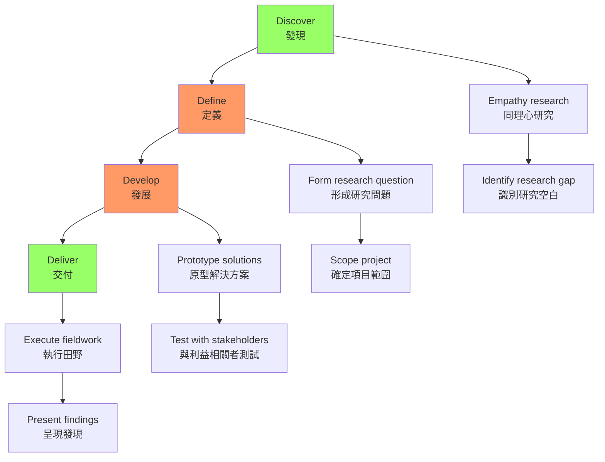
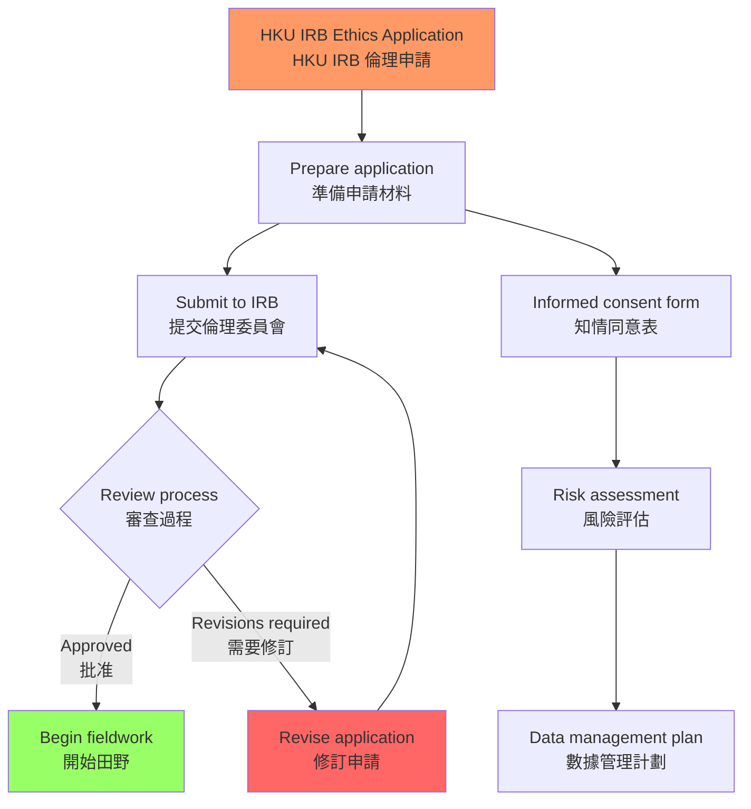
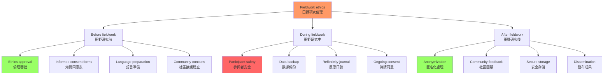
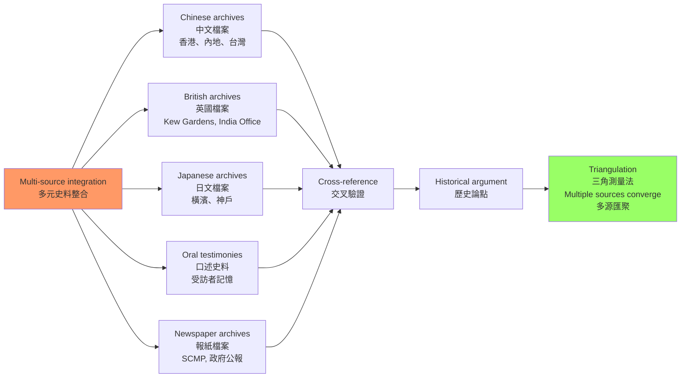
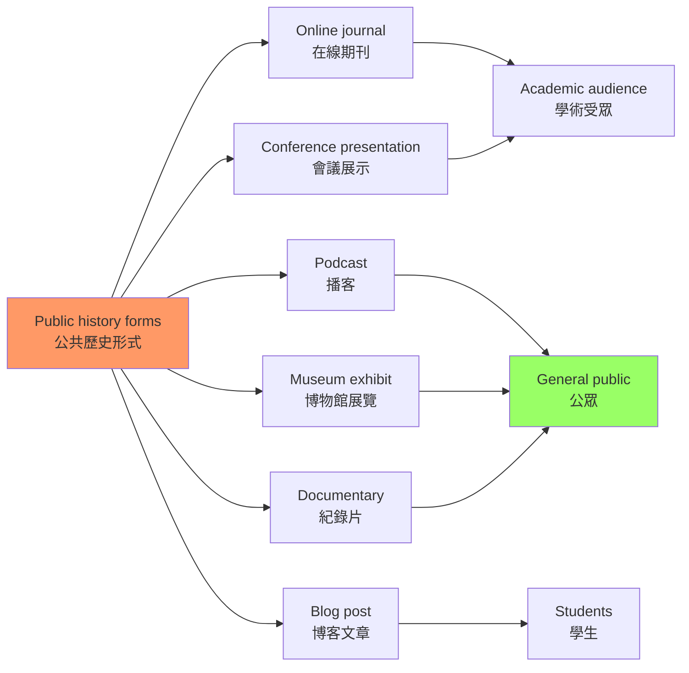
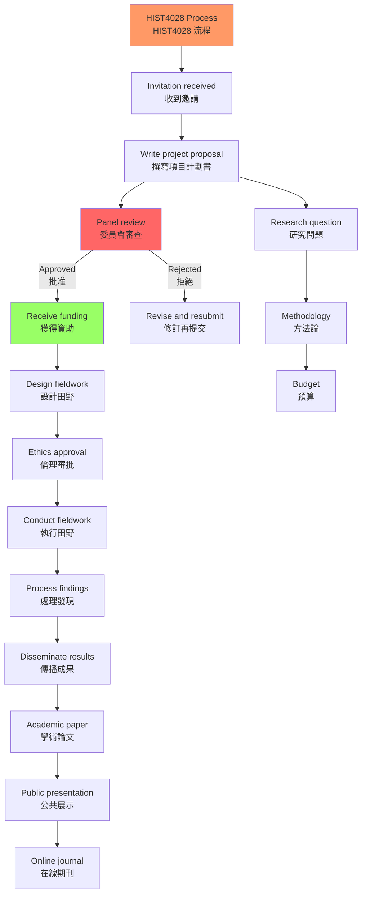

# HIST4028 無疆界歷史 / History Without Borders: Special Field Project

/** HKU | 6 credits | Capstone Experience | BY INVITATION ONLY */

/**Instructor**: David Pomfret | Department: History, HKU
**David Pomfret** is Professor of History and former Chair of the Department of History at HKU. Research specialisations: British and French history, histories of Childhood and Youth, and the transnational and comparative history of modern Europe and its empires. Currently working on a RGC GRF project examining trans-colonial cultures of youth in Asia from the late 19th to the mid 20th century.
**Official source**: [HKU History Course Description](https://history.hku.hk/ug_cd/), [HIST4028 Course Website](https://history.hku.hk/hist4028/)
**Course Description**: Enrolment in this special course is extended to students majoring in History by invitation, and on a performance-related basis. For those students invited to apply for enrolment this exclusive capstone course will provide an opportunity to design their own field project in a subject related to the History discipline. It will also provide funding to support field work undertaken across geographical, political and cultural borders, in Hong Kong and/or overseas. The course thus provides History majors with a unique, funded opportunity to design, plan and make their own creative contribution to historical knowledge. A range of innovative activities may be designed by students, including travel overseas to conduct field research, editing and publication of a special online journal, attendance or organisation of a conference, workshop, or specialist history summer course.
**Assessment**: 100% coursework.
**Note**: HIST4028 is **by invitation only** — the most exclusive capstone course in HKU History
**Style**: 袁騰飛式 — 這不是一門普通的課——這是給最優秀歷史系學生的禮物，讓你設計自己的田野研究項目，獲得資助跨越邊界去發現歷史

---

## 問題 1：這個項目成功的 5 個核心心智模型

### 1. 項目設計思維（Project Design Thinking）
**定義**: HIST4028 的核心是讓學生自己設計研究項目——這需要「設計思維」（design thinking）的訓練：識別問題→提出方案→設計原型→測試→迭代。

**專家如何思考**: 設計思維是一種以人為本的創新方法，它的核心是「同理心」（empathy）——理解研究參與者的需求和處境，然後設計能滿足這些需求的解決方案。對於歷史田野研究，這意味着理解受訪者的記憶、情感和身份政治。

**David Pomfret** 的跨境歷史研究：他的專長是英帝國和法帝國的青年文化史，研究視角是跨國比較——英帝國和法帝國的青少年如何在不同殖民環境中經歷「帝國化」？

**驗證**: 一個成功的 HIST4028 項目計劃書必須包括：
1. **研究問題**：一個清晰的、可以用田野研究回答的問題
2. **田野設計**：在哪裡做田野？（香港？內地？海外？）
3. **方法論**：如何收集數據？（口述歷史？參與觀察？檔案研究？）
4. **倫理考量**：如何保護研究參與者？
5. **預算**：如何使用資助？（機票、住宿、設備）

### 2. 跨境田野研究倫理（Cross-border Fieldwork Ethics）
**定義**: 跨境田野研究涉及嚴重的倫理問題：研究者的身份（研究者 vs 旁觀者）、知情同意（informed consent）、研究發現的使用。

**學者**: **James Clifford** — *The Predicament of Culture* (1988)。研究人類學田野研究的「危機」——研究者與被研究者之間的權力關係。

**學者**: **Michel-Rolph Trouillot** — *Silencing the Past* (1995)。研究歷史知識生產中的權力關係——誰的故事被記住、誰的故事被遺忘。

**驗證**: 跨境田野研究的倫理挑戰：
- **在內地進行歷史田野研究時**：研究者的政治身份（香港/外國研究者）可能影響受訪者的回應——受訪者可能因為顧慮而不說真話
- **在東南亞或南亞進行田野研究時**：語言障礙、文化差異、研究者身份的敏感性
- **敏感歷史主題**：涉及政治爭議（如六四事件、1967 暴動、國共內戰）的田野研究——受訪者的安全和尊嚴需要保護

### 3. 研究資金管理（Research Grant Management）
**定義**: HIST4028 提供資助，學生需要學習如何管理研究預算——機票、住宿、檔案使用費、設備購買。

**驗證**: HKU 歷史系為 HIST4028 學生提供的典型資助規模和用途：
- **機票**：香港-目的地來回機票（經濟艙）
- **住宿**：研究期間酒店/宿舍費用
- **檔案使用費**：某些檔案（如英國國家檔案館）收取複印費用
- **設備**：錄音設備、攝影器材
- **學生反饋**：一位 HIST4028 學生利用資助訪問了泰國和英國的六個檔案館，包括泰國國家檔案館（National Archives of Thailand）和英國國家檔案館

### 4. 多元史料整合（Multi-source Integration）
**定義**: 跨境研究意味着學生需要整合來自不同國家、不同語言、不同檔案系統的史料——這需要極強的語言能力和史料批判能力。

**典型挑戰**: 
- 中文、英文、日文檔案的整合
- 殖民檔案（英語）和本地檔案（當地語言）的交叉驗證
- 口述歷史與官方檔案的比對

**驗證**: 香港歷史研究的典型多元史料來源：
- **英國國家檔案館（Kew Gardens）**：英帝國殖民檔案
- **香港歷史檔案館（Hong Kong Records Office）**：殖民政府文件
- **台灣國史館**：民國時期檔案
- **口述歷史訪談**：社區長者的記憶
- **報紙檔案**：South China Morning Post (1903-1941)、香港政府公報

### 5. 公共歷史呈現（Public History Presentation）
**定義**: HIST4028 的成果可以是論文、在線期刊發表、會議展示——學生需要學會如何向不同的受眾呈現歷史研究。

**典型形式**: Podcast、紀錄片、博物館展覽、在線期刊、博客文章、會議論文

**驗證**: HIST4028 的創意成果形式：
- **在線期刊**：編輯和出版一期歷史主題的在線期刊
- **會議組織**：組織一次學生歷史研討會
- **田野報告發布**：將研究發現以播客或短片形式發布
- **參與國際會議**：参加並展示研究成果

---

## 問題 2：3 個根本分歧

### 分歧 1：田野研究——參與者 vs 旁觀者？
**核心問題**: 田野研究者應該是「參與者」還是「旁觀者」？參與觀察（participant observation）的倫理邊界在哪裡？

- **A 方（深度參與）**: 最好的田野研究需要研究者深度參與被研究社區的生活——研究者應該成為社區的一部分，才能真正理解其文化和歷史。代表學者：**Clifford Geertz**，*The Interpretation of Cultures* (1973)
- **B 方（保持距離）**: 研究者過度參與會損害研究的客觀性——研究者應該保持一定距離，才能更清晰地觀察和分析。代表學者：**James Clifford**
- **核心張力**: 「倫理參與」與「學術距離」之間的平衡是田野研究永恆的難題

### 分歧 2：跨境研究——研究者身份的政治性
**核心問題**: 在進行跨境研究時，學生的國籍和政治身份會如何影響受訪者的信任度和回應？

- **A 方（研究者身份無關緊要）**: 好的研究者應該能夠超越身份政治的局限，通過專業能力和倫理操守獲得信任
- **B 方（研究者身份至關重要）**: 研究者的身份（國籍、性別、階級、語言能力）永遠會影響田野關係——這種影響是不可消除的，只能承認和管理
- **學者**: **Dorothy Hodgson** — *The Imagined, the Real, and the Virtual*

### 分歧 3：研究成果——學術嚴謹性 vs 公共可及性？
**核心問題**: 田野研究的成果，應該優先服務於學術受眾（同行評審的論文），還是優先服務於公眾（公共歷史項目）？

- **A 方（學術優先）**: 歷史研究的價值在於學術嚴謹性——只有經得起同行評審的研究才能真正貢獻歷史知識
- **B 方（公共歷史優先）**: 納稅人資助了大學研究，大學研究應該服務於公眾——公共歷史項目比學術論文更有社會價值

---

## 問題 3：10 個深度問題

1. **你的 HIST4028 研究項目，如何處理「邊界」這個核心概念？** 邊界是政治的（國境線）、文化的（語言差異）、階級的（貧富差距）、還是心理的（身份認同）？邊界是「阻礙」還是「通道」？

2. **知情同意（informed consent）在歷史田野研究中的具體操作是什麼？** 口述歷史的錄音和文字記錄，需要獲得什麼樣的許可？標準的知情同意書應該包含哪些內容？如何確保受訪者真正理解他們的權利？

3. **你的研究項目涉及哪些語言障礙？** 你如何在語言能力有限的情況下，進行有效的田野研究？翻譯在田野研究中扮演什麼角色？如何處理翻譯過程中的信息丟失？

4. **跨國比較**：你的研究主題，在不同的政治和文化語境中，會呈現出什麼不同的面向？如何處理這種「差異」而不陷入簡單的比較——如何捕捉每個語境內部的多樣性？

5. **你的研究項目如何與 HKU 歷史系的現有研究強項互補？** David Pomfret 的跨境歷史研究專長，如何為你的項目提供具體指導？你的研究是否可以納入 Pomfret 的 RGC 研究項目框架？

6. **數位工具**：數位人文（digital humanities）工具在你的田野研究中可以扮演什麼角色？Tropy（檔案管理）、Palladio（數據視覺化）、Omeka（數位展覽）——這些工具如何幫助你組織和呈現研究發現？

7. **安全考量**：跨境田野研究涉及哪些安全風險？（政治風險、人身安全、數據安全）如何管理這些風險？你是否需要購買旅行保險？如何備份田野數據？

8. **敏感性處理**：你的研究發現，如何處理「敏感性」問題？有些歷史發現可能對當事人或社區造成困擾——你如何平衡「歷史真相」和「倫理責任」？

9. **成果形式**：你的 HIST4028 項目最適合什麼形式的成果？學術論文、播客、博物館展覽、在線期刊文章，還是參與國際學術會議？不同的成果形式對你的時間安排有什麼影響？

10. **長期影響**：你的 HIST4028 項目，如何與你未來的職業規劃相連接？這個項目培養的哪些技能（田野研究、跨文化溝通、預算管理、公共呈現）對你未來的事業最有價值？

---

# 核心心智模型深化（中英對照）

## 1. 項目設計思維

### 1.1 Bilingual 概念對照
| 英文 | 中文 | 歷史含義 | 實踐工具 |
|---|---|---|---|
| Design thinking | 設計思維 | 用設計方法設計研究項目 | Double diamond model |
| Project proposal | 項目計劃書 | 研究項目的完整設計 | HKU standard format |
| Timeline | 時間線 | 研究進度規劃 | Gantt chart |
| Budget | 預算 | 研究經費管理 | Spreadsheet |

### 1.2 Double Diamond 設計思維模型

### 1.3 HIST4028 項目計劃書框架
| 項目 | 內容要求 |
|---|---|
| 研究問題 | 清晰、可田野回答、符合歷史學科規範 |
| 田野地點 | 具體的地點、接觸人選、進入方式 |
| 方法論 | 口述歷史？參與觀察？檔案研究？ |
| 倫理考量 | 知情同意、風險評估、數據保護 |
| 預算 | 具體項目、合理、符合資助範圍 |
| 預期成果 | 論文？播客？展覽？會議？ |

---

## 2. 跨境田野研究倫理

### 2.1 Bilingual 概念對照
| 英文 | 中文 | 歷史含義 | HKU倫理要求 |
|---|---|---|---|
| Informed consent | 知情同意 | 參與者知道研究目的 | Oral history consent form |
| Confidentiality | 保密性 | 保護受訪者身份 | Anonymization |
| Researcher positionality | 研究者立場性 | 研究者的身份如何影響研究 | Reflexivity |
| Do no harm | 不造成傷害 | 研究的倫理底線 | HKU IRB |

### 2.2 HKU IRB 倫理審批流程

### 2.3 圖解：田野研究倫理框架

---

## 3. 多元史料整合

### 3.1 香港歷史研究的典型多元史料來源
| 來源 | 語言 | 視角 | 挑戰 |
|---|---|---|---|
| 英國國家檔案館（Kew） | 英語 | 帝國/殖民者 | 需要理解殖民行政語言 |
| 香港歷史檔案館 | 中英 | 殖民政府 | 部分文件有使用限制 |
| 台灣國史館 | 中文 | 民國/國民黨 | 政治敏感性 |
| 內地檔案館 | 中文 | 共產黨/國家 | 獲取困難 |
| 口述歷史訪談 | 多語 | 社區/個人 | 記憶主觀性 |
| 報紙檔案 | 中英 | 媒體/公眾 | 意識形態偏見 |

### 3.2 圖解：多元史料整合流程

---

## 4. 公共歷史呈現

### 4.1 成果形式與受眾
| 形式 | 受眾 | 技能要求 | 適用研究類型 |
|---|---|---|---|
| 學術論文 | 同行學者 | 學術寫作、引用規範 | 檔案研究 |
| 播客 | 公眾 | 聲音表達、剪輯 | 口述歷史、社區研究 |
| 博物館展覽 | 公眾、遊客 | 視覺設計、敘事 | 物質文化研究 |
| 會議論文 | 學術社群 | 口頭表達 | 任何研究 |
| 博客文章 | 公眾、學生 | 淺顯語言、視覺元素 | 任何研究 |

### 4.2 圖解：公共歷史形式

---

## 5. 圖解：HIST4028 流程總覽

---

# 總結

1. **HIST4028 是 HKU 歷史系給最有能力學生的禮物**: 它不是一門「課」，而是一個「資助你去發現」的機會——讓你能夠設計自己的研究項目，跨越地理、政治和文化的邊界去尋找歷史真相

2. **跨境田野研究是香港歷史研究的未來**: 香港的歷史研究，從來不能只靠香港本地的檔案——跨境研究（東南亞、中國內地、英國檔案）是理解香港歷史的必要方法

3. **項目設計思維是歷史系學生的核心技能**: 這種將創意、方法和倫理整合的訓練，不僅對學術研究有用，對任何需要項目管理能力的職業都有價值

4. **倫理責任是田野研究的底線**: 沒有任何研究發現，值得以犧牲參與者的安全和尊嚴為代價——知情同意、保密性和不造成傷害，是每個研究者必須遵守的底線

5. **研究成果的公共化是歷史學家的社會責任**: 歷史知識不應該只存在於大學圖書館和大學宿舍，它應該以公眾可以接觸的形式存在——播客、博物館展覽、在線期刊都是好選擇

**最後問題**: 如果你有一筆資助可以去世界上任何地方做歷史田野研究，你會去哪裡？你想研究什麼？

**自學建議**: 配合 James Clifford 的 *The Predicament of Culture* (1988) + David Pomfret 的跨境歷史研究 + Clifford Geertz 的 *The Interpretation of Cultures* (1973)，輸出項目計劃書到 `06_Reading_Notes/`。
