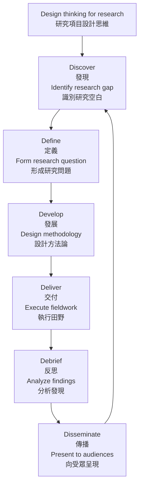
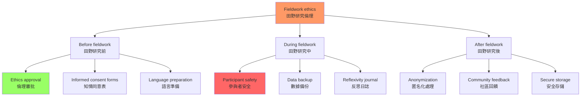
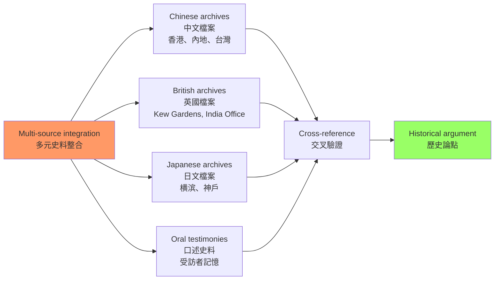
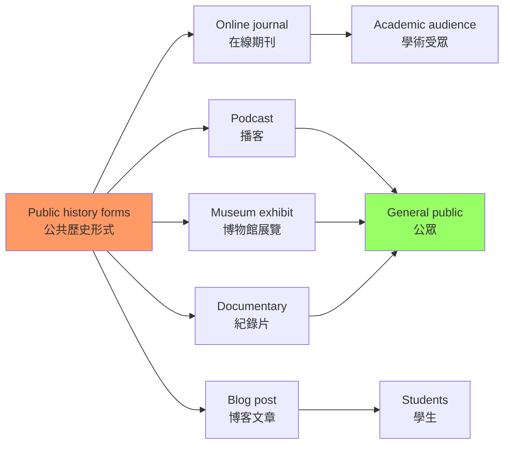

# HIST4028 無疆界歷史：特殊田野項目 / History Without Borders: Special Field Project

**Instructor**: David Pomfret
**Department**: History, HKU
**Official source**: [HKU History Course Description](https://history.hku.hk/ug_cd/), [HIST-2425.pdf](https://history.hku.hk/wp-content/uploads/2024/07/HIST-2425.pdf)
**Note**: HIST4028 是 **by invitation only** 的特殊 cap stone 課程——學生需要獲得系裏邀請才能修讀
**Style**: 袁騰飛式 — 這不是一門普通的課——這是給最優秀歷史系學生的資助，讓你設計自己的田野研究項目

---

## 重要說明：這是 HKU 歷史系最特殊的 cap stone 課程

HIST4028「歷史無疆界」的與眾不同之處：
- **僅限邀請**: 只有在歷史系表現優异的學生才能申請
- **資助野外研究**: 學生自己設計研究項目，系裏提供經費支持跨境田野研究
- **創意導向**: 學生可以設計包括旅行研究、在線期刊編輯、會議組織等多種形式
- **導師指導**: 每位學生配有相關專業導師
- **跨國研究**: 這個課程的核心價值是「跨越地理、政治和文化邊界」

---

## 問題 1：這個項目成功的 5 個核心心智模型

### 1. 項目設計思維（Project Design Thinking）

**專家如何思考**: HIST4028 的核心是讓學生自己設計研究項目——這需要「設計思維」（design thinking）的訓練：識別問題→提出方案→設計原型→測試→迭代。

- **典型導師**: David Pomfret（跨境歷史研究專家）
- **驗證方法**: 在申請時提交一份完整的項目計劃書

### 2. 跨境田野研究倫理（Cross-border Fieldwork Ethics）

**專家如何思考**: 跨境田野研究涉及嚴重的倫理問題：研究者的身份（研究者vs旁觀者）、知情同意（informed consent）、研究發現的使用。

- **典型學者**: **James Clifford** — *The Predicament of Culture* (1988); **Michel-Rolph Trouillot** — *Silencing the Past* (1995)
- **驗證案例**: 在內地進行歷史田野研究時，研究者的政治身份可能影響受訪者的回應

### 3. 研究資金管理（Research Grant Management）

**專家如何思考**: HIST4028 提供資助，學生需要學習如何管理研究預算——機票、住宿、檔案使用費、設備購買。

- **典型技能**: 預算編制、收據保存、資助報告撰寫

### 4. 多元史料整合（Multi-source Integration）

**專家如何思考**: 跨境研究意味着學生需要整合來自不同國家、不同語言、不同檔案系統的史料——這需要極强的語言能力和史料批判能力。

- **典型挑戰**: 中文、英文、日文檔案的整合

### 5. 公共歷史呈現（Public History Presentation）

**專家如何思考**: HIST4028 的成果可以是論文、在線期刊發表、會議展示——學生需要學會如何向不同的受眾呈現歷史研究。

- **典型形式**: Podcast、紀錄片、博物館展覽、在線期刊

---

## 問題 2：3 個根本分歧

### 分歧 1：田野研究——參與者 vs 旁觀者？
**核心問題**: 田野研究者應該是「參與者」還是「旁觀者」？參與觀察（participant observation）的倫理邊界在哪裡？

### 分歧 2：跨境研究——研究者身份的政治性
**核心問題**: 在進行跨境研究時，學生的國籍和政治身份會如何影響受訪者的信任度和回應？

### 分歧 3：研究成果——學術嚴謹性 vs 公共可及性？
**核心問題**: 田野研究的成果，應該優先服務於學術受眾（同行評審的論文），還是優先服務於公眾（公共歷史項目）？

---

## 問題 3：10 個深度問題

1. 你的 HIST4028 研究項目，如何處理「邊界」這個核心概念？邊界是政治的、文化的、語言的，還是心理的？
2. **知情同意**（informed consent）在歷史田野研究中的具體操作是什麼？口述歷史的錄音和文字記錄，需要獲得什麼樣的許可？
3. 你的研究項目涉及哪些語言障礙？你如何在語言能力有限的情況下，進行有效的田野研究？
4. **跨國比較**：你的研究主題，在不同的政治和文化語境中，會呈現出什麼不同的面向？如何處理這種「差異」而不陷入簡單的比較？
5. 你的研究項目如何與 HKU 歷史系的現有研究強項互補？David Pomfret 的跨境歷史研究專長，如何為你的項目提供具體指導？
6. **數位工具**：數位人文（digital humanities）工具（如 Tropy, Palladio, Omeka）在你的田野研究中可以扮演什麼角色？
7. **安全考量**：跨境田野研究涉及哪些安全風險？如何管理這些風險？
8. 你的研究發現，如何處理「敏感性」問題？有些歷史發現可能對當事人或社區造成困擾——你如何平衡「歷史真相」和「倫理責任」？
9. **成果形式**：你的 HIST4028 項目最適合什麼形式的成果？學術論文、播客、博物館展覽，還是在線期刊文章？
10. **長期影響**：你的 HIST4028 項目，如何與你未來的職業規劃相連接？這個項目培養的哪些技能，對你未來的事業最有價值？

---

# 核心心智模型深化（中英對照）

## 1. 項目設計思維

### 1.1 Bilingual 概念對照
| 英文 | 中文 | 歷史含義 | 實踐工具 |
|---|---|---|---|
| Design thinking | 設計思維 | 用設計方法設計研究項目 | Double diamond model |
| Project proposal | 項目計劃書 | 研究項目的完整設計 | HKU standard format |
| Timeline | 時間線 | 研究進度規劃 | Gantt chart |
| Budget | 預算 | 研究經費管理 | Spreadsheet |

### 1.3 圖解：設計思維流程

---

## 2. 跨境田野研究倫理

### 2.1 Bilingual 概念對照
| 英文 | 中文 | 歷史含義 | HKU倫理要求 |
|---|---|---|---|
| Informed consent | 知情同意 | 參與者知道研究目的 | Oral history consent form |
| Confidentiality | 保密性 | 保護受訪者身份 | Anonymization |
| Researcher positionality | 研究者立場性 | 研究者的身份如何影響研究 | Reflexivity |
| Do no harm | 不造成傷害 | 研究的倫理底線 | HKU IRB |

### 2.3 圖解：田野研究倫理框架

---

## 3-5. 其他心智模型

### 3. 圖解：多元史料整合

---

## 4. 圖解：公共歷史呈現形式

---

# 總結

1. **HIST4028 是 HKU 歷史系給最有能力學生的禮物**：它不是一門「課」，而是一個「資助你去發現」的機會。

2. **跨境田野研究是香港歷史研究的未來**：香港的歷史研究，從來不能只靠香港本地的檔案——跨境研究是理解香港歷史的必要方法。

3. **項目設計思維是歷史系學生的核心技能**：這種將創意、方法和倫理整合的訓練，對任何職業都有價值。

4. **倫理責任是田野研究的底線**：沒有任何研究發現，值得以犧牲參與者的安全和尊嚴為代價。

5. **研究成果的公共化是歷史學家的社會責任**：歷史知識不應該只存在於大學圖書館，它應該以公眾可以接觸的形式存在。

**自學建議**: 配合 James Clifford 的 *The Predicament of Culture* + David Pomfret 的跨境歷史研究，輸出項目計劃書到 `06_Reading_Notes/`。
