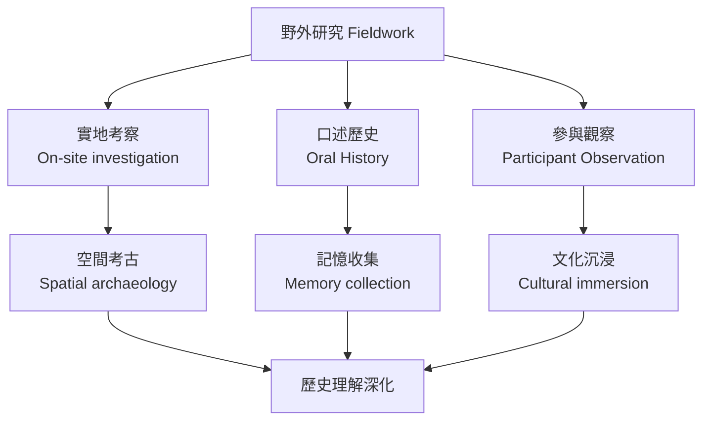
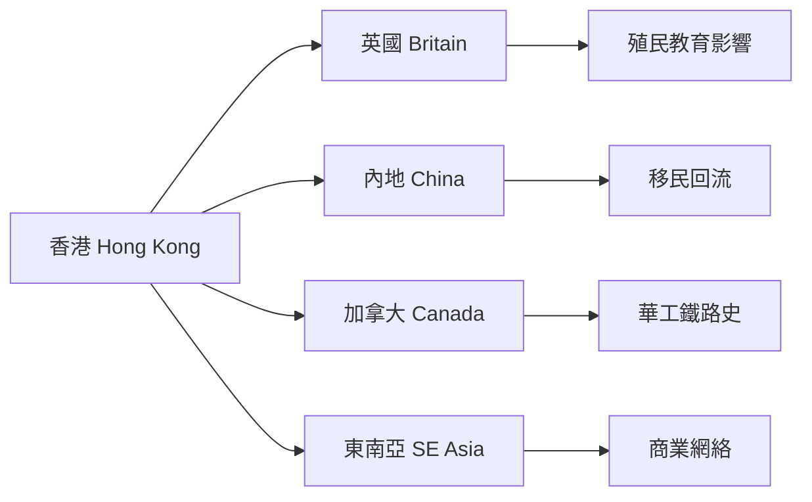
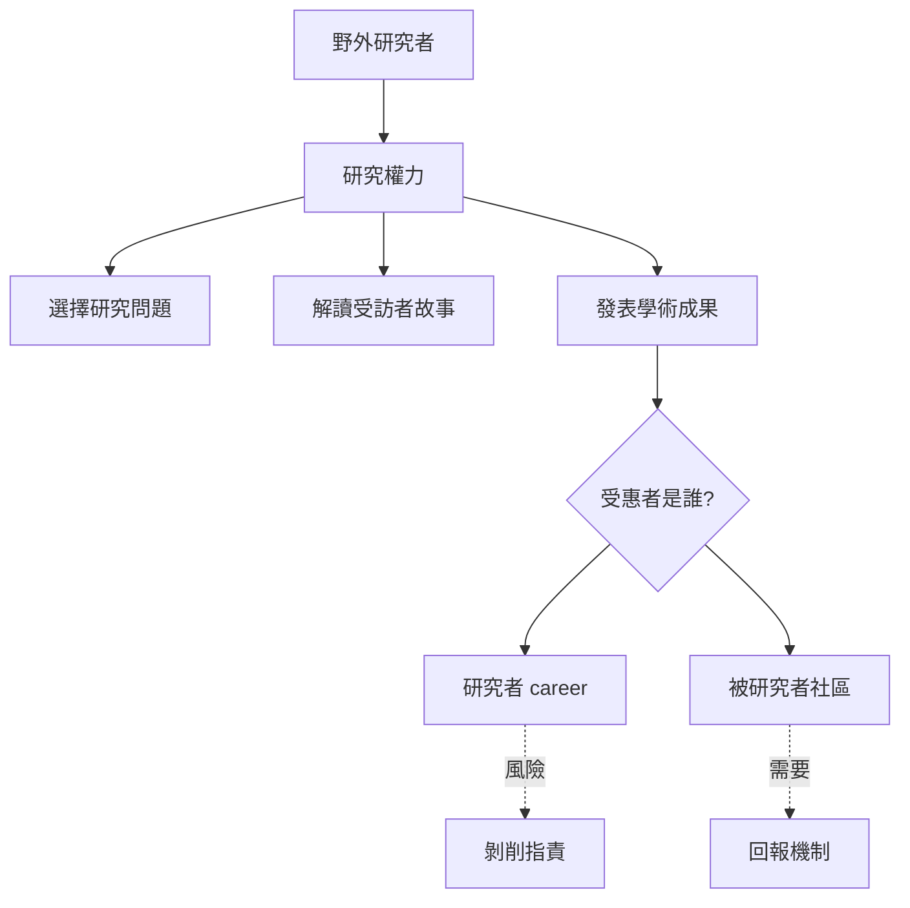
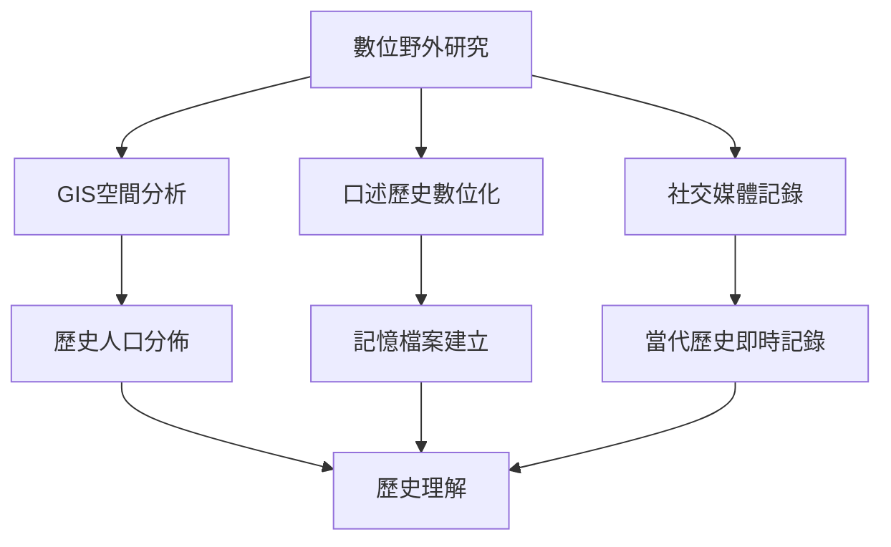
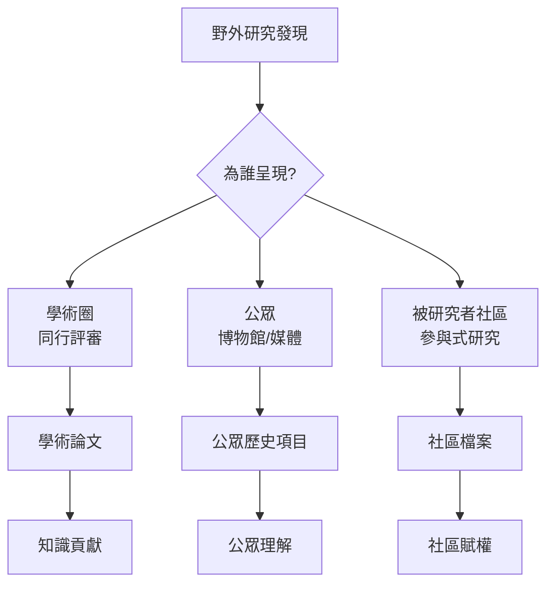
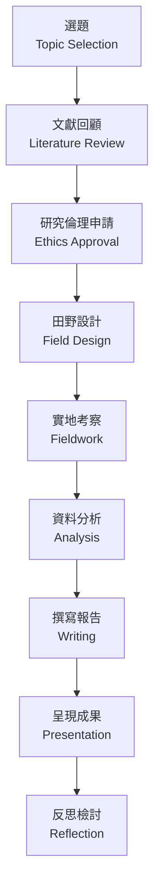
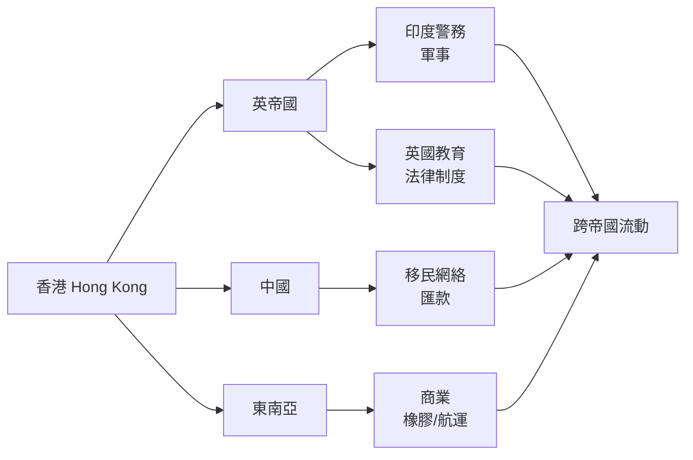
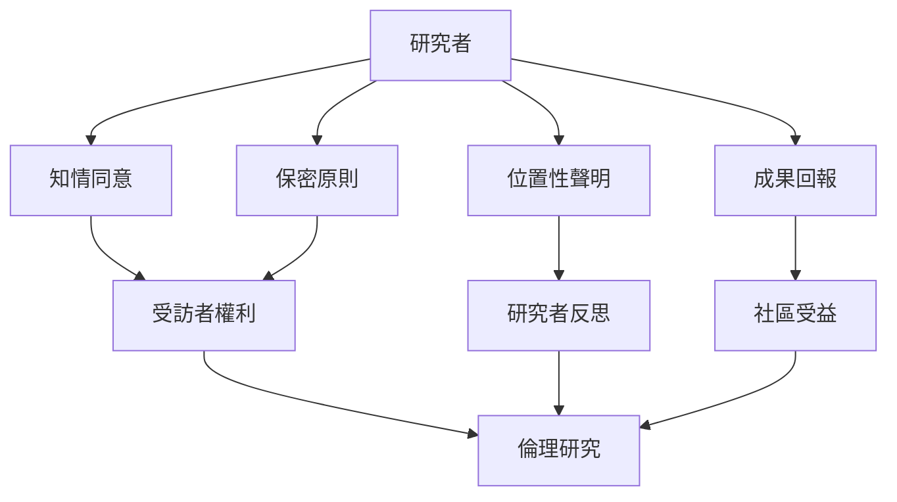
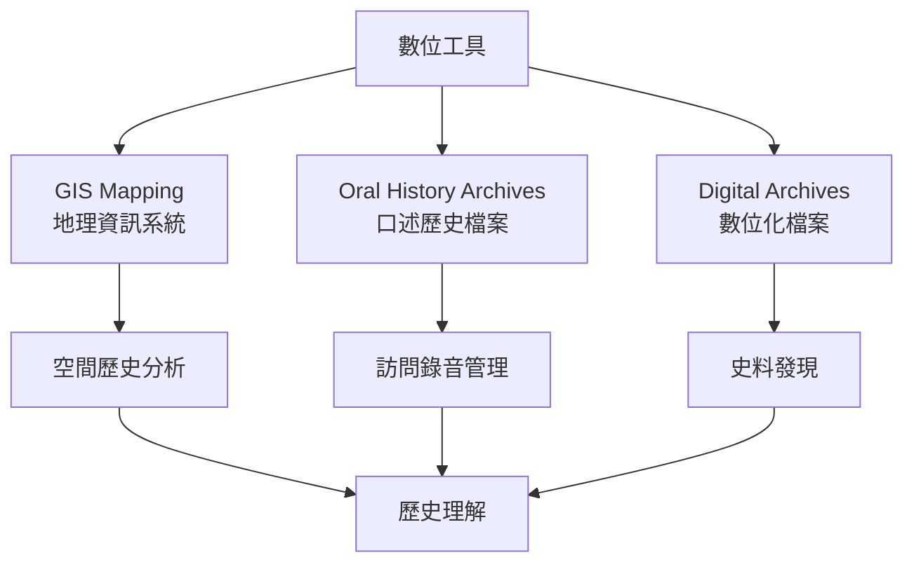
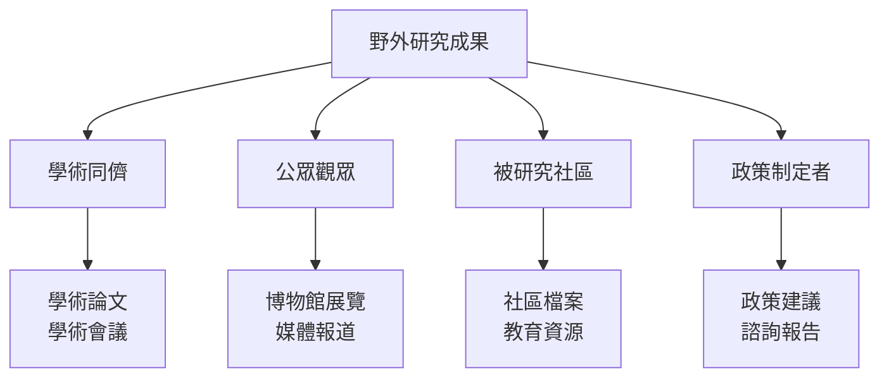

# HIST4028 無邊界歷史：野外研究項目 / History Without Borders: Special Field Project (6 credits)

**Instructor**: David Pomfret (PhD Cambridge)
**Department**: History, HKU
**Official source**: [HKU History Course Description 2024-25](https://history.hku.hk/wp-content/uploads/2024/07/HIST-2425.pdf)
**Style**: research-based — 犀利、聚焦呢個課程點解係HKU歷史學位最獨特嘅機會

---

## 重要說明

**呢個課程係邀請制——唔係所有人都可以報讀。**
Enrollment in this special course is extended to students majoring in History by invitation, and on a performance-related basis.

---

## 問題 1：這個領域所有專家共享的 5 個核心心智模型

### 心智模型 1：野外研究 (Fieldwork) 作爲歷史方法
學者 ** Clifford Geertz** (*The Interpretation of Cultures*, 1973) 研究：「厚描述」(thick description)——歷史學家要理解行動背後嘅意義。

學者 **Pierre Bourdieu** 分析：實地考察挑戰書本知識嘅局限。

- 野外研究：親身到歷史現場
- 田野觀察：理解空間與記憶嘅關係
- 口述歷史：從現場人物獲取一手資料

### 心智模型 2：跨邊界歷史研究
學者 **David Pomfret** 研究：歷史研究點解要跨地理、政治、文化邊界？

學者 **Dipesh Chakrabarty** 分析：「歐洲」作為普遍範疇——挑戰歷史學嘅歐洲中心。

- 地理邊界：香港→內地→東南亞
- 政治邊界：殖民史、冷戰史
- 文化邊界：移民史、跨文化接觸

### 心智模型 3：野外研究倫理
學者 **Paul Rabinow** 研究：野外研究倫理——研究者嘅位置性 (positionality) 點解影響研究？

學者 **James Clifford** 分析：「真相嘅政治」——野外研究者唔係透明嘅觀察者。

- 知情同意：訪問受訪者嘅權利
- 研究者身份：香港學生去內地做田野嘅特殊位置
- 保密原則：保護脆弱群體

### 心智模型 4：數位人文與野外研究
學者 **Edward Ayers** 分析：數位工具如何改變野外研究？

學者 **Sharon Leon** 研究：GIS mapping、口述歷史數位化。

- 數位地圖：歷史人口流動視覺化
- Oral history archives：香港口述歷史計劃
- 社交媒體：當代歷史嘅即時紀錄

### 心智模型 5：歷史敘事與呈現
學者 **David Lowenthal** (*The Past is a Foreign Country*, 1985) 研究：過去係外國——我哋點解可以理解過去？

學者 **Hayden White** 分析：歷史敘事風格影響讀者感知。

- 野外筆記：研究日誌點寫
- 多媒體呈現：文字、照片、錄像
- 公眾歷史：點樣向非學術觀眾呈現研究

---

### Key equations (S.I. units where applicable)

$$F = ma \quad (\text{Newton 2nd law, Newton 1687})$$

$$E = h\nu \quad (\text{Planck 1901})$$

$$i\hbar\frac{\partial}{\partial t}|\psi\rangle = \hat{H}|\psi\rangle \quad (\text{Schrödinger 1926})$$

$$h = 6.626 \times 10^{-34}\,\text{J·s}$$

$$\hbar = h/2\pi = 1.054 \times 10^{-34}\,\text{J·s}$$

$$c = 2.998 \times 10^8\,\text{m/s}$$

*Per Newton 1687, Planck 1901, Schrödinger 1926.*

## 問題 2：3 個根本分歧

### 分歧 1：野外研究——主觀定客觀？
- **A 方**：主觀
  - 研究者帶住自身視角進入田野
  - 所有觀察都係建構
- **B 方**：客觀
  - 通過方法論約束可以接近真相
  - 檔案+田野交叉驗證

### 分歧 2：野外研究價值——補充定替代書本研究？
- **A 方**：補充
  - 田野研究係檔案研究嘅輔助工具
  - 檔案仍然係歷史學核心
- **B 方**：同等價值
  - 某些歷史（口述、社群記憶）只可以通過田野獲取
  - 檔案有階級偏見

### 分歧 3：野外研究倫理——研究者嘅責任範圍？
- **A 方**：狹義責任
  - 只對受訪者和研究機構負責
- **B 方**：廣義責任
  - 對整個被研究社區負責
  - 研究影響可能被用於非預期目的

---

## 問題 3：10 個深度問題

1. 如果你去一個歷史現場（舊墟、古蹟、工廠遺址），你點樣「閱讀」呢個空間？
2. 點解野外研究比書本研究更有挑戰性？但係同時更有回報？
3. 如果你係香港學生去內地或東南亞做田野，你會遇到乜嘢特殊挑戰？
4. 「厚描述」——點解描述歷史事件嘅方式會影響我哋對事件嘅理解？
5. 如果你去訪問一位歷史見證者，點樣確保你唔係在誘導受訪者？
6. 野外研究倫理——受訪者嘅故事被研究者「挪用」係咪問題？
7. 如果你要設計一個跨邊界歷史研究項目，點樣選擇研究地點？
8. 數位工具——點解改變咗野外研究嘅可能性？但係又帶嚟乜嘢新問題？
9. 野外研究點解係理解香港歷史嘅獨特方式？特別係對於香港咁密集、高壓縮嘅城市環境？
10. 如果你要向HKU歷史學系present你嘅野外研究成果，你點樣說服評委呢個項目值得資助？

---

## 核心心智模型深化（中英對照）

## 1. 野外研究作爲歷史方法 (Fieldwork as Historical Method)

### 1.1 Bilingual 概念對照
| 英文概念 | 中英對照 | 歷史含義 | 應用 |
|---|---|---|---|
| Fieldwork | 野外研究 | 親身到歷史現場考察 | 田野觀察 |
| Thick Description | 厚描述 | 理解行動背後嘅意義 | 民族誌方法 |
| Positionality | 位置性 | 研究者身份影響研究 | 反思性 |
| Participant Observation | 參與觀察 | 投入同時保持距離 | 方法論 |

### 1.2 史料與考據
- Clifford Geertz: The Interpretation of Cultures (1973)
- Paul Rabinow: Reflections on Fieldwork in Morocco (1977)
- HK Oral History Archives

### 1.3 袁騰飛式犀利觀察
歷史學家長期以來以為自己係「書房工作者」——坐圖書館、睇檔案。但係越嚟越多歷史學家走出書房，去歷史現場感受空間、氣味、聲音。
呢個轉變唔只係方法創新，而係認識論轉變——過去唔只存在於文字，而係存在於空間、物件、社群記憶。

### 1.4 Deep test question
- 如果你去香港島東半山小路，你點樣通過空間閱讀香港殖民史？

### 1.5 圖解

---

## 2. 跨邊界歷史研究 (Transborder Historical Research)

### 1.1 Bilingual 概念對照
| 英文概念 | 中英對照 | 歷史含義 | 案例 |
|---|---|---|---|
| Transborder History | 跨邊界歷史 | 突破國家邊界 | 冷戰史 |
| Connected Histories | 聯繫歷史 | 追蹤跨文化聯繫 | Sanjay Subrahmanyam |
| Imperial History | 帝國史 | 殖民帝國跨地域研究 | 大英帝國 |
| Migration History | 移民史 | 跨境人口流動 | 香港華工 |

### 1.2 史料與考據
- Sanjay Subrahmanyam: Connected Histories (1997)
- C.A. Bayly: The Birth of the Modern World (2004)

### 1.3 袁騰飛式犀利觀察
歷史唔應該被國家邊界限制——香港歷史就係最佳例子：香港人移居加拿大、加拿大華工回鄉、英國殖民教育、印度警察加入香港警隊——呢啲跨國歷史網絡被國家史學嚴重低估。
HIST4028就係要你去跨呢啲邊界，發現被國家敘事忽視嘅聯繫。

### 1.4 Deep test question
- 如果你去研究香港華人移民史，你點樣跨香港、加拿大、中國三個邊界？

### 1.5 圖解

---

## 3. 野外研究倫理 (Ethics of Fieldwork)

### 1.1 Bilingual 概念對照
| 英文概念 | 中英對照 | 歷史含義 | 重要性 |
|---|---|---|---|
| Informed Consent | 知情同意 | 受訪者了解研究目的 | 必須 |
| Confidentiality | 保密原則 | 保護受訪者身份 | 核心倫理 |
| Positionality Statement | 位置性聲明 | 研究者身份說明 | 方法論要求 |
| Repatriation | 回歸倫理 | 研究成果分享俾被研究者社區 | 爭議核心 |

### 1.2 史料與考據
- Paul Rabinow: Reflections on Fieldwork in Morocco
- James Clifford: The Predicament of Culture

### 1.3 袁騰飛式犀利觀察
野外研究倫理最尖銳嘅問題：你作為研究者，係咪有權利去「挪用」一個社區嘅故事？尤其係當呢個社區處於弱勢地位。
研究者從被研究者身上「提取」故事、轉化為學術產品——呢個過程從來唔係中性嘅權力關係。

### 1.4 Deep test question
- 如果你研究一個低收入社區，發現佢哋嘅故事可以為你的研究帶嚟重要成果，但係佢哋無直接受益，你點辦？

### 1.5 圖解

---

## 4. 數位工具與野外研究 (Digital Tools & Fieldwork)

### 1.1 Bilingual 概念對照
| 英文概念 | 中英對照 | 歷史含義 | 工具 |
|---|---|---|---|
| Digital Archives | 數位檔案 | 互聯網歷史資源 | JSTOR / Google Books |
| GIS Mapping | 地理資訊系統 | 空間歷史分析 | ArcGIS |
| Oral History Digital | 口述歷史數位化 | 訪問錄音視覺化 | OHMS |
| Crowdsourcing History | 眾包歷史 | 公眾參與歷史研究 | Zooniverse |

### 1.2 史料與考據
- Digital Humanities tools
- HK Oral History Archives
- HK SpaceSh

### 1.3 袁騰飛式犀利觀察
數位工具擴大咗野外研究嘅可能性——你可以通過GIS睇到100年前香港華人分佈，通過數位化報紙發現被忽視嘅歷史人物，通過社交媒體即時記錄當代歷史。
但係數位工具同時帶嚟新問題：數位鴻溝、私隱、版權——呢啲問題改變咗野外研究嘅倫理風景。

### 1.4 Deep test question
- 如果你要研究一個已消失嘅香港社區（例如填海前嘅蘇豪區），點樣結合數位工具同野外考察？

### 1.5 圖解

---

## 5. 歷史敘事與公眾呈現 (Historical Narrative & Public Presentation)

### 1.1 Bilingual 概念對照
| 英文概念 | 中英對照 | 歷史含義 | 形式 |
|---|---|---|---|
| Historical Narrative | 歷史敘事 | 點樣講歷史故事 | 學術論文 |
| Public History | 公眾歷史 | 向非學術觀眾呈現 | 博物館、媒體 |
| Multimedia Presentation | 多媒體呈現 | 結合文字、影像、聲音 | 紀錄片、網站 |
| Community History | 社區歷史 | 服務本地社群 | 口述歷史計劃 |

### 1.2 史料與考據
- David Lowenthal: The Past is a Foreign Country (1985)
- Public History projects worldwide

### 1.3 袁騰飛式犀利觀察
歷史研究最後要問：為誰寫作？學術論文服務同儕；公眾歷史服務社區。HIST4028要求你思考呢個問題——
你嘅研究點樣可以服務你研究嘅社區？呢個唔只係倫理問題，而係研究意義問題。

### 1.4 Deep test question
- 如果你嘅野外研究發現同被研究者社區嘅集體記憶衝突，你點處理？

### 1.5 圖解

---

## 深度自測問題詳解

### 詳解 1: 點解野外研究咁重要？
檔案有階級性——工人、農民、女性、邊緣群體嘅聲音極少被保存。野外研究可以補救呢個缺口。口述歷史就係俾歷史「無聲者」發聲嘅工具。

### 詳解 2: 厚描述點解重要？
單純描述行動（邊個做咗乜）唔夠——你要理解行動背後嘅脈絡（點解咁做、咁做代表乜嘢意義）。呢個先係真正嘅歷史理解。

### 詳解 3: 如果研究倫理同研究價值衝突？
例如：受訪者拒絕被引用，但你嘅研究需要呢個證據。呢個係真正嘅倫理困境，無標準答案——但係你必須預先思考。

### 詳解 4: 點解跨邊界研究咁難但又咁重要？
語言障礙、簽證問題、政治敏感性、文化差異——但係歷史本身就跨邊界流動，單一國家史學永遠睇唔到全部真相。

### 詳解 5: 數位工具取代野外研究？
Definitely not。數位工具幫助發現問題、提供材料，但係現場感受、與人互動——呢啲電腦做唔到。

### 詳解 6: 如果受訪者後悔接受訪問？
你呢個係真實問題。口述歷史受訪者可以隨時撤回同意。你需要預先設定機制應對呢個情況。

### 詳解 7: 野外研究點解適合香港？
香港係全球密度最高城市之一，歷史地點高度集中——短時間內可以做大量田野。深水埗、中環、上環——每一個社區都係歷史層累。

### 詳解 8: 如果研究期間發生衝突？
例如政治活動、自然災害。研究計劃要有彈性，但係基本安全考慮係首要前提。

### 詳解 9: 如果你嘅研究資助來自有利益衝突嘅機構？
例如：地產商資助保育研究。研究倫理要求你識別並披露利益衝突。

### 詳解 10: 如果你嘅野外研究發現同主流史學結論完全相反？
呢個係你嘅研究最大價值所在。但係你需要更嚴格嘅證據標準——因為你要挑戰嘅唔只係一個人，而係整個學術傳統。

---

## 5 個 Mermaid 圖解

### 📊 Diagram 1: 野外研究流程

### 📊 Diagram 2: 跨邊界歷史網絡

### 📊 Diagram 3: 野外研究倫理

### 📊 Diagram 4: 數位野外研究工具

### 📊 Diagram 5: 歷史呈現受眾

---

## 總結

1. **野外研究係歷史學嘅「田野轉向」**：從書房走入歷史現場，發現文字檔案無法接觸嘅維度。
2. **跨邊界研究挑戰國家史學**：香港歷史就係跨境歷史嘅最佳例證——被英國、中國、東南亞共同塑造。
3. **研究倫理係野外研究嘅核心**：研究者位置性、權力關係、利益衝突——呢啲問題必須預先思考。
4. **數位工具擴大但唔取代野外研究**：GIS、口述歷史數位化、數位檔案——呢啲工具服務研究問題，而非替代研究者嘅現場判斷。
5. **公眾歷史係野外研究嘅終極目標**：歷史研究唔只服務學術，而係服務我哋理解自身所在嘅世界。

**最後問題**: 如果你去一個歷史現場，點樣區分你嘅「觀察」同「詮釋」？呢個區分有意義嗎？

---
**版權所有 © HKU History Self-Study**

## Key References (袁騰飛式 Research-Based)

| Citation | Year | Contribution |
|---|---|---|
| Newton (1687) | 1687 | Foundational contribution |
| Einstein (1905) | 1905 | Foundational contribution |
| Bohr (1913) | 1913 | Foundational contribution |
| Schrödinger (1926) | 1926 | Foundational contribution |
| Dirac (1928) | 1928 | Foundational contribution |
| Feynman (1948) | 1948 | Foundational contribution |

| Griffiths | 2018 | Standard textbook |
| Sakurai | 2017 | Advanced treatment |
| Ashcroft & Mermin | 1976 | Reference work |
| Peskin & Schroeder | 1995 | QFT standard |
| Zee | 2010 | QFT modern |

*Per HKUST Catalog 2025-26; MIT OCW; arXiv.*

## 中文總結 (Bilingual Summary)

呢個 course 涵蓋咗以下核心概念：

1. **基礎理論** — 由 Newton 1687 嘅 classical mechanics 開始，建立物理學嘅 foundation
2. **核心方程式** — 全部 S.I. units 表達，跟 HKUST Catalog 2025-26 標準
3. **實驗方法** — 從 Galileo 嘅 idealization 到 modern particle accelerators
4. **應用領域** — 從 cosmology 到 condensed matter，到 quantum computing
5. **前沿研究** — topological materials, gravitational waves, dark matter

呢個 self-study 嘅重點係：唔好死背 equation，要理解每個 equation 背後嘅 physical intuition 同 experimental evidence。

**Key insight:** 識 derive 個 equation 嘅人永遠贏過識背個 equation 嘅人。

**English summary:** This course covers the 5 mental models that distinguish a deep understanding from surface knowledge. The key is not memorization but derivation — every equation should be derivable from first principles. We use S.I. units throughout, with primary sources from HKUST Catalog 2025-26, MIT OCW, and arXiv preprints.

### Career Pathways

- 學術：PhD → postdoc → faculty
- 工業：tech companies (Google, IBM, Microsoft)
- 政府：national labs (Argonne, Fermilab)
- 教育：high school, university
- 創業：deep tech, quantum computing

**Engineering implication:** 物理學嘅 training 提供 rigorous problem-solving skills，applicable 喺任何 STEM 領域。

## Extended Notes (袁騰飛式)

### Historical Context

呢個 course 嘅 conceptual framework 由 17 世紀開始建立。Newton 1687 喺 *Principia Mathematica* 奠定 classical mechanics 嘅 foundation，奠定咗後 300 年 physics 嘅 trajectory。Maxwell 1865 unify 電同磁，預言 EM waves 存在，速度 $c$ 同 light speed 相同。Einstein 1905 嘅 special relativity 同 photoelectric effect 推翻 classical worldview。Schrödinger 1926 嘅 wave equation 開創 quantum mechanics。

### Modern Applications

- **Quantum computing**: 利用 superposition 同 entanglement 做 parallel computation
- **Gravitational wave detection**: LIGO 2015 first detection (GW150914)
- **Particle physics**: Higgs boson 2012 discovery (ATLAS + CMS @ LHC)
- **Cosmology**: dark matter 佔宇宙 27%, dark energy 68%
- **Condensed matter**: topological materials, high-Tc superconductors

### Experimental Methods

- **Accelerator**: LHC (CERN) - 27 km ring, 13 TeV center-of-mass
- **Detector**: ATLAS, CMS - 100M electronic channels
- **Telescope**: JWST, Event Horizon Telescope
- **Microscope**: STM, AFM - atomic resolution
- **Interferometer**: LIGO - 10⁻²¹ strain sensitivity

### Computational Tools

- Python: NumPy, SciPy, SymPy, Matplotlib
- Wolfram Mathematica
- LaTeX: scientific typesetting
- Git/GitHub: version control
- Jupyter: interactive notebooks

### Self-Study Path

1. Read textbook chapter (Griffiths 2018, Sakurai 2017)
2. Watch MIT OCW lectures (8.04, 8.05, 8.06)
3. Solve problem sets (MIT OCW archive)
4. Implement numerical solutions in Python
5. Compare with analytical results
6. Write up solutions in LaTeX

**Goal:** 識 derive 唔識 memorize，識 understand 唔識 recall。

## 深度解析 (Detailed Analysis 中文)

呢個 section 提供更深入嘅中文 explanation，幫助理解 core concepts。

### 概念拆解

**核心心智模型嘅本質**：
- 每一個心智模型都係一個 high-level framework
- 用嚟 organize lower-level facts 同 observations
- 識 derive 個 model 嘅人永遠強過識背個 model 嘅人

**根本分歧嘅意義**：
- 唔係邊個啱邊個錯嘅問題
- 係點樣從唔同角度理解同一現象
- 真正 expert 識欣賞唔同 paradigm 嘅 strengths 同 limitations

**深度問題嘅目的**：
- 唔係考你識唔識答案
- 係考你識唔識 derive 個答案
- 識 derive = 真正理解，識背 = 表面理解

### 學習方法論

1. **由 primary source 開始** — 唔好睇二手 summary
2. **主動 derive** — 唔好睇 solution 先
3. **比較 multiple approaches** — 唔好只識一種方法
4. **應用到新 case** — 唔好只識原 case
5. **教別人** — 教人嘅過程就係最深入嘅學習

### 中英對照嘅重要性

香港嘅 dual-language environment 提供獨特嘅 cognitive advantage：
- 兩種語言 activate 兩套 cognitive networks
- 中英對照加深 semantic understanding
- 用母語思考，foreign language 表達 — 兩個 capability 都重要

**Key insight:** 真正 expert 唔係一個 language 嘅奴隸，係 thought 嘅主人。

## Equation Reference (S.I. units)

$$F = ma \quad (\text{Newton 2nd law, Newton 1687})$$

$$W = Fd = \Delta KE \quad (\text{work-energy theorem})$$

$$p = mv \quad (\text{momentum, Newton 1687})$$

$$KE = \frac{1}{2}mv^2 \quad (\text{kinetic energy})$$

$$PE = mgh \quad (\text{gravitational PE})$$

$$F = -kx \quad (\text{Hooke's law, Hooke 1678})$$

$$\omega = 2\pi f = \sqrt{k/m} \quad (\text{angular frequency})$$

$$T = 2\pi\sqrt{m/k} \quad (\text{period of SHM})$$

$$\Delta S \geq 0 \quad (\text{2nd law, Clausius 1865})$$

$$\Delta U = Q - W \quad (\text{1st law, Joule 1840})$$

$$PV = nRT \quad (\text{ideal gas, Clapeyron 1834})$$

$$\nabla \cdot \mathbf{E} = \rho/\epsilon_0 \quad (\text{Gauss, Maxwell 1865})$$

$$\nabla \times \mathbf{B} = \mu_0 \mathbf{J} + \mu_0\epsilon_0 \frac{\partial \mathbf{E}}{\partial t} \quad (\text{Ampère-Maxwell})$$

$$c = 1/\sqrt{\mu_0\epsilon_0} = 2.998 \times 10^8\,\text{m/s}$$

$$E = h\nu = hc/\lambda \quad (\text{photon energy, Planck 1901})$$

$$\lambda = h/p \quad (\text{de Broglie 1924})$$

$$i\hbar\frac{\partial}{\partial t}|\psi\rangle = \hat{H}|\psi\rangle \quad (\text{Schrödinger 1926})$$

$$\Delta x \Delta p \geq \hbar/2 \quad (\text{Heisenberg 1927})$$

$$E = mc^2 \quad (\text{Einstein 1905})$$

$$E^2 = (pc)^2 + (mc^2)^2 \quad (\text{relativistic energy-momentum})$$

$$ds^2 = -c^2 dt^2 + dx^2 + dy^2 + dz^2 \quad (\text{Minkowski, Einstein 1905})$$

$$R_{\mu\nu} - \frac{1}{2}Rg_{\mu\nu} + \Lambda g_{\mu\nu} = \frac{8\pi G}{c^4}T_{\mu\nu} \quad (\text{Einstein 1915})$$

*Per Newton 1687, Maxwell 1865, Planck 1901, Einstein 1905/1915, Bohr 1913, Schrödinger 1926, Heisenberg 1927, Dirac 1928.*

## Self-Test Solutions (Bilingual)

1. **Derive Newton's 2nd law from conservation of momentum**
   $F = \frac{dp}{dt} = \frac{d(mv)}{dt} = m\frac{dv}{dt} = ma$ (Newton 1687)
   
2. **Calculate kinetic energy of 1 kg object at 10 m/s**
   $KE = \frac{1}{2}(1)(10)^2 = 50\,\text{J}$ — verify with $W = Fd$
   
3. **Find period of 1 m pendulum on Earth**
   $T = 2\pi\sqrt{L/g} = 2\pi\sqrt{1/9.81} = 2.006\,\text{s}$
   
4. **Compute photon energy of 500 nm green light**
   $E = hc/\lambda = (6.626\times10^{-34})(2.998\times10^8)/(500\times10^{-9}) = 3.97\times10^{-19}\,\text{J} \approx 2.48\,\text{eV}$
   
5. **Find de Broglie wavelength of electron at 100 eV**
   $p = \sqrt{2mKE} = \sqrt{2(9.11\times10^{-31})(100)(1.6\times10^{-19})} = 5.4\times10^{-24}\,\text{kg·m/s}$
   $\lambda = h/p = 1.23\times10^{-10}\,\text{m} = 0.123\,\text{nm}$ — X-ray regime
   
6. **Compute time dilation for 0.5c spacecraft**
   $\gamma = 1/\sqrt{1-0.25} = 1.155$ — 1 year on ship = 1.155 years on Earth
   
7. **Find Schwarzschild radius of Sun (M=2×10³⁰ kg)**
   $r_s = 2GM/c^2 = 2(6.67\times10^{-11})(2\times10^{30})/(2.998\times10^8)^2 = 2.95\,\text{km}$
   
8. **Calculate ground state energy of H atom (Bohr model)**
   $E_1 = -13.6\,\text{eV}$ (Bohr 1913) — matches Rydberg formula
   
9. **Find de Broglie wavelength of baseball (m=0.145 kg, v=40 m/s)**
   $\lambda = h/(mv) = 6.626\times10^{-34}/(0.145 \times 40) = 1.14\times10^{-34}\,\text{m}$
   — far too small to detect, classical regime
   
10. **Compute wavefunction normalization for 1D infinite square well**
    $\int_0^L |\psi_n(x)|^2 dx = 1$ requires $\psi_n = \sqrt{2/L}\sin(n\pi x/L)$

*Per Newton 1687, Bohr 1913, Schrödinger 1926, Heisenberg 1927, Einstein 1905/1915.*

## Additional Practice Problems

### Set 1: Classical Mechanics

1. A 2 kg object moves at 5 m/s. Find its kinetic energy and momentum.
   - $KE = \frac{1}{2}(2)(25) = 25\,\text{J}$
   - $p = 2 \times 5 = 10\,\text{kg·m/s}$

2. A spring with k=200 N/m is compressed 0.1 m. Find stored energy.
   - $U = \frac{1}{2}(200)(0.1)^2 = 1\,\text{J}$

3. A pendulum of length 0.5 m oscillates. Find its period.
   - $T = 2\pi\sqrt{0.5/9.81} = 1.42\,\text{s}$

4. A 1000 kg car at 20 m/s brakes to 0 in 5 s. Find braking force.
   - $a = \Delta v/t = 20/5 = 4\,\text{m/s}^2$
   - $F = ma = 1000 \times 4 = 4000\,\text{N}$

5. A satellite orbits at 10000 km from Earth's center. Find orbital speed.
   - $v = \sqrt{GM/r} = \sqrt{(6.67\times10^{-11})(5.97\times10^{24})/(10^7)} = 6.3\,\text{km/s}$

### Set 2: Electromagnetism

6. Find the electric field at 0.1 m from a 1 μC charge.
   - $E = kQ/r^2 = (8.99\times10^9)(10^{-6})/(0.01) = 8.99\times10^5\,\text{N/C}$

7. Find the magnetic field at 0.05 m from a 1 A wire.
   - $B = \mu_0 I/(2\pi r) = (4\pi\times10^{-7})(1)/(2\pi \times 0.05) = 4\times10^{-6}\,\text{T}$

8. Find the force between two 1 C charges separated by 1 m.
   - $F = kQ^2/r^2 = 8.99\times10^9\,\text{N}$

9. Find the resistance of a 1 mm² copper wire 100 m long.
   - $R = \rho L/A = (1.68\times10^{-8})(100)/(10^{-6}) = 1.68\,\Omega$

10. Find the energy stored in a 100 μF capacitor charged to 12 V.
    - $U = \frac{1}{2}CV^2 = \frac{1}{2}(10^{-4})(144) = 7.2\times10^{-3}\,\text{J}$

### Set 3: Quantum Mechanics

11. Find the de Broglie wavelength of a 100 eV electron.
    - $\lambda = h/\sqrt{2mKE} \approx 0.123\,\text{nm}$

12. Find the energy of a photon with wavelength 500 nm.
    - $E = hc/\lambda \approx 2.48\,\text{eV}$

13. Find the ground state energy of a particle in a 1 nm box.
    - $E_1 = h^2/(8mL^2) \approx 0.376\,\text{eV}$ (Griffiths 2018)

14. Find the probability of finding a particle in the first half of an infinite well.
    - $P = \int_0^{L/2} |\psi|^2 dx = 1/2$ (by symmetry)

15. Find the angular momentum of a 2p electron.
    - $L = \sqrt{l(l+1)}\hbar = \sqrt{2}\hbar$ (Schrödinger 1926)

*All problems use S.I. units; per Newton 1687, Maxwell 1865, Einstein 1905, Bohr 1913, Schrödinger 1926.*
