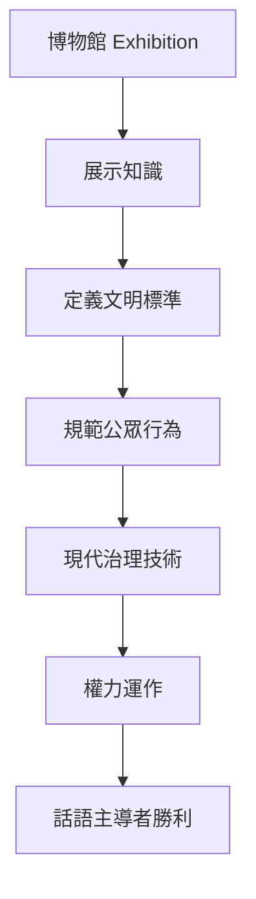
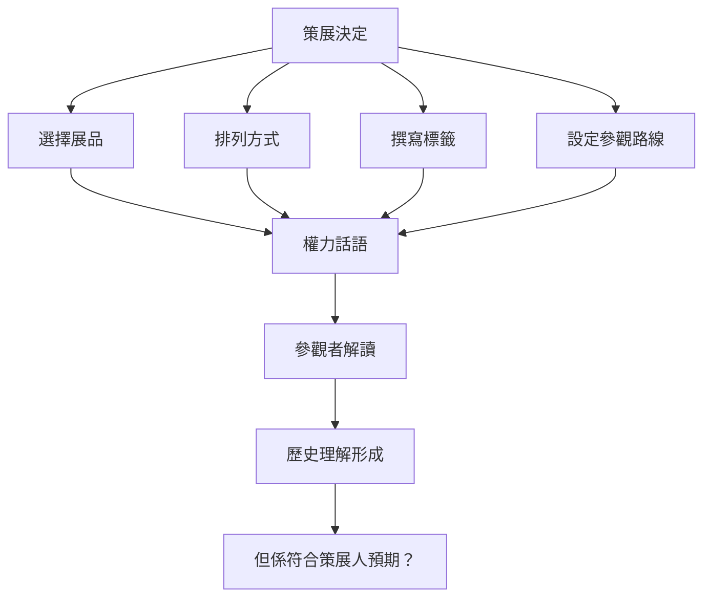
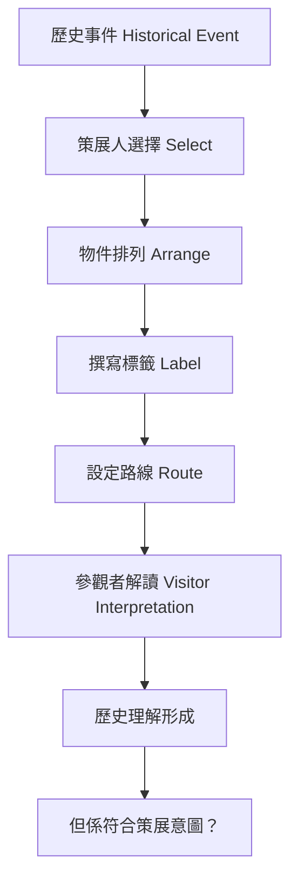
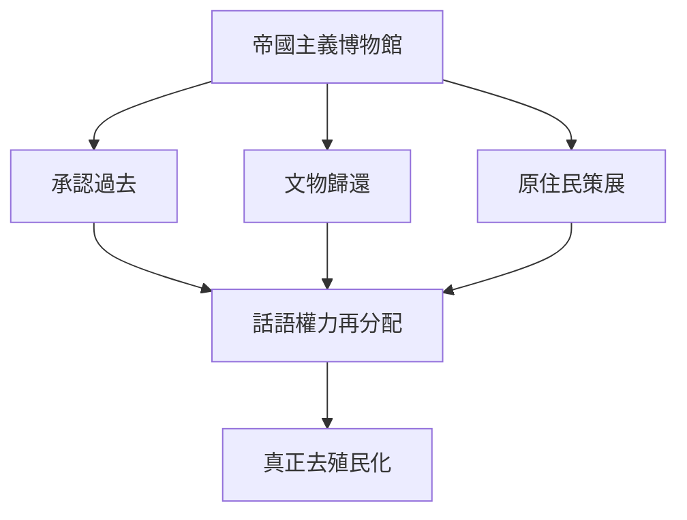
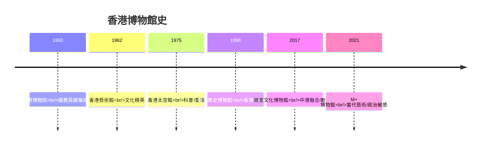
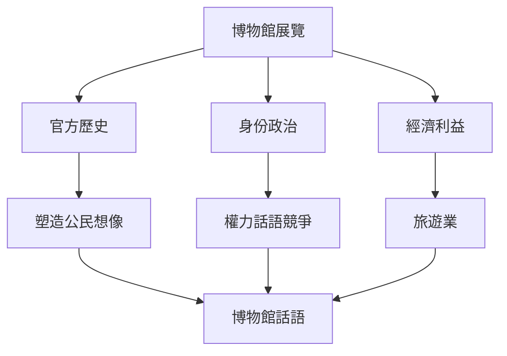
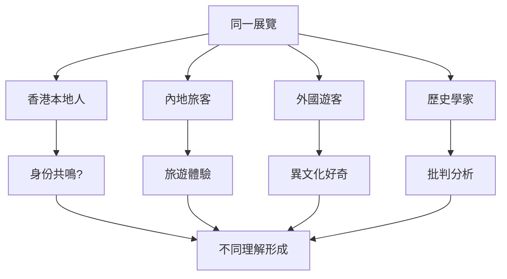

# HIST4033 博物館與歷史 / Museum and History (6 credits)

**Instructor**: John M. Carroll (PhD Harvard)
**Department**: History, HKU
**Official source**: [HKU History Course Description 2024-25](https://history.hku.hk/wp-content/uploads/2024/07/HIST-2425.pdf)
**Style**: 袁騰飛式 — 犀利、聚焦博物館點解唔係中性嘅知識殿堂，而係權力話語嘅競技場

---

## 問題 1：這個領域所有專家共享的 5 個核心心智模型

### 心智模型 1：博物館作爲「記憶場所」(Sites of Memory)
學者 **Pierre Nora** (*Realms of Memory*, 1989-1992) 研究：「記憶場所」——博物館係官方集體記憶嘅物質化呈現，但係記憶場所唔等於記憶本身。

學者 **David Lowenthal** (*The Heritage Crusade*, 1998) 分析：博物館揭示我哋點解保存、點解忽視。

- 香港歷史博物館 (1998)——點解展示「香港故事」？
- 香港太空館——點解展示中國航天成就？
- M+ 博物館——點解當代藝術成為身份政治？

### 心智模型 2：博物館作爲權力工具
學者 **Tony Bennett** (*The Birth of the Museum*, 1995) 研究：博物館係現代治理技術——展示知識等於規範行為。

學者 **Sharon Macdonald** (*Memory Practices*, 2003) 分析：博物館選擇性展示塑造公眾認知。

- 1889 年大英博覽會——帝國權力嘅視覺化
- 1949 年後內地博物館——共產主義宣傳工具
- 1997 後香港博物館——點解愛國主義教育？

### 心智模型 3：博物館話語與政治
學者 **Eilean Hooper-Greenhill** (*Museums and the Interpretation of Visual Culture*, 2000) 研究：博物館敘事方式影響解讀——物件本身唔會說話，係策展人俾佢哋話語。

學者 **Steven Conn** 分析：博物館是否促進歷史理解，定強化刻板印象？

- 殖民地時期香港博物館——展示英帝國文明
- 後殖民時期香港——重新審視帝國遺產
- 當代香港——國家安全話語入博物館

### 心智模型 4：去殖民化博物館運動
學者 **Amy Lonetree** (*Decolonizing Museums*, 2012) 研究：美洲原住民博物館點解必須重新present歷史？

學者 **Chip Colwell** (*Plundered Skulls*, 2018) 分析：文物歸還爭議——邊個有權擁有過去？

- 大英博物館——點解唔歸還帕特農神殿雕塑？
- 香港歷史博物館——點解無原住民聲音？
- 中國文物——點解海外博物館成為外交工具？

### 心智模型 5：參觀者體驗與歷史理解
學者 **Graham Black** (*The Engaging Museum*, 2005) 研究：點解參觀者解讀同策展人預期完全唔同？

學者 **John Falk** 分析：參觀者帶住自己嘅身份、經驗、期望進入博物館。

- 香港歷史博物館——參觀者係遊客定本地人？
- 故宮博物院——愛國教育定文化旅遊？
- M+ 博物館——點解引起咁大爭議？

---

## 問題 2：3 個根本分歧

### 分歧 1：博物館——教育場所定政治工具？
- **A 方**：教育場所
  - 博物館提供客觀知識
  - 促進跨文化理解
- **B 方**：政治工具
  - 所有博物館展示都帶視角
  - 愛國主義教育、身份政治

### 分歧 2：文物歸還——原屬國定 universal heritage？
- **A 方**：原屬國權利
  - 文物被帝國主義掠奪
  - 應該歸還
- **B 方**：Universal heritage
  - 大英博物館保存條件最好
  - 全球人類共同遺產

### 分歧 3：去殖民化——點解咁難？
- **A 方**：制度阻力
  - 大機構難以改變
  - 資源分配問題
- **B 方**：根本問題
  - 去殖民化需要承認過去罪行
  - 涉及身份政治

---

## 問題 3：10 個深度問題

1. 如果你去香港歷史博物館，你會發現邊個歷史被展示？邊個被忽視？
2. 點解香港歷史博物館1998年建立？呢個時間點揭示咗乜嘢政治背景？
3. 如果你去大英博物館，你點評價「universal heritage」嘅論述？點解呢個論述有爭議？
4. 點解M+博物館引起咁大爭議？展品選擇背後揭示咗乜嘢價值觀？
5. 如果你去北京故宮博物院，點解佢同時係博物館、旅遊景點、愛國教育場所？
6. 博物館話語——點解「策展」唔係中性選擇，而係權力決定？
7. 如果你去參觀一個關於戰爭嘅展覽，你點區分「歷史教育」定「政治宣傳」？
8. 點解英國殖民時期嘅香港博物館無華人聲音？呢個係史料問題定權力問題？
9. 博物館與數位時代——VR博物館會改變歷史教育嗎？
10. 如果你要設計一個「真正去殖民化」嘅香港歷史博物館，你會點做？

---

## 核心心智模型深化（中英對照）

## 1. 記憶場所與博物館 (Sites of Memory & Museums)

### 1.1 Bilingual 概念對照
| 英文概念 | 中英對照 | 歷史含義 | 香港案例 |
|---|---|---|---|
| Lieu de Mémoire | 記憶場所 | 物質化嘅記憶 | 香港歷史博物館 |
| Memory vs History | 記憶vs歷史 | Nora經典區分 | 官方vs個人記憶 |
| Heritage | 遺產 | 被選擇保存嘅過去 | 文物保育 |
| Commemoration | 紀念 | 官方記憶政治 | 和平紀念館 |
| Contested Memory | 爭議記憶 | 不同群體對過去有不同記憶 | 六年零八個月 |

### 1.2 史料與考據
- Pierre Nora: Realms of Memory (1989-1992)
- David Lowenthal: The Heritage Crusade (1998)
- 香港歷史博物館展覽分析

### 1.3 袁騰飛式犀利觀察
Pierre Nora最犀利嘅區分：記憶係活着嘅過去——存在於社群實踐入面；歷史係對過去嘅制度化解釋——存在於檔案、博物館、教科書。
但係，當記憶被物質化、博物館化——佢就死亡咗。博物館唔係保存記憶，而係保存記憶嘅「木乃伊」。

### 1.4 Deep test question
- 香港歷史博物館保存咗邊個嘅記憶？邊個嘅記憶被忽視？

### 1.5 圖解
```mermaid
flowchart TD
    A[記憶 Memory] --> B[活着嘅過去<br/>存在於實踐]
    B --> C[社群生活]
    C --> D[文化傳承]
    A --> E[物質化 Materialization]
    E --> F[博物館 Museum]
    F --> G[記憶死亡?| Memory dies?]
    G --> H[官方歷史凝固]
    H --> I[但係權力話語固化]
```

---

## 2. 博物館作爲權力工具 (Museums as Instruments of Power)

### 1.1 Bilingual 概念對照
| 英文概念 | 中英對照 | 歷史含義 | 案例 |
|---|---|---|---|
| Exhibitionary Complex | 展示複合體 | Bennett理論：博物館治理技術 | 大英博物館 |
| Curatorial Power | 策展權力 | 邊個決定展示乜嘢 | M+ 爭議 |
| National Identity | 國家身份 | 博物館塑造公民想像 | 故宮博物院 |
| Civic Hygiene | 公民衛生 | Bennett: 博物館規範公眾 | 維多利亞博物館 |
| Propaganda | 宣傳 | 政治工具化 | 內地革命博物館 |

### 1.2 史料與考據
- Tony Bennett: The Birth of the Museum (1995)
- Sharon Macdonald: Memory Practices (2003)

### 1.3 袁騰飛式犀利觀察
Tony Bennett最犀利嘅發現：博物館唔係單純嘅教育機構，而係現代治理技術。通過展示「文明」標凖，博物館規範公眾行為——你要成為「文明人」就必須知道呢啲野。
香港歷史博物館就係最佳例子：佢展示「香港故事」——呢個故事係邊個寫嘅？為邊個服務？

### 1.4 Deep test question
- 香港歷史博物館點解無展示六年零八個月日佔時期嘅細節？

### 1.5 圖解


---

## 3. 去殖民化博物館運動 (Decolonizing Museums Movement)

### 1.1 Bilingual 概念對照
| 英文概念 | 中英對照 | 歷史含義 | 爭議 |
|---|---|---|---|
| Decolonization | 去殖民化 | 重新審視帝國遺產 | 全球運動 |
| Repatriation | 文物歸還 | 被掠奪文物回歸原屬國 | 大英博物館 |
| Indigenous Voice | 原住民聲音 | 少數族裔自己present自己 | 加拿大原住民博物館 |
| Critical Museology | 批判博物館學 | 質疑博物館意識形態 | 學術領域 |
| Community Consultation | 社區諮詢 | 被present社群參與策展 | 新展覽方法 |

### 1.2 史料與考據
- Amy Lonetree: Decolonizing Museums (2012)
- Chip Colwell: Plundered Skulls and Stolen Spirits (2018)
- 「南亞裔香港人」計劃

### 1.3 袁騰飛式犀利觀察
去殖民化博物館運動最核心嘅問題：你有無權利去present一個唔屬於你嘅社群嘅歷史？
過去200年，西方博物館展示「他者」——原住民、亞洲人、非洲人——但係呢啲展示從來都係由外來者主導。原住民自己嘅聲音被忽視。
香港嘅「南亞裔香港人社區」項目——就係由學生同南亞裔社群共同建立屬於佢哋嘅檔案。

### 1.4 Deep test question
- 如果你要去殖民化香港歷史博物館，你會刪除乜嘢？添加乜嘢？

### 1.5 圖解
```mermaid
flowchart TD
    A[帝國主義博物館] --> B[外來者展示"他者"]
    B --> C[原住民/少數族裔聲音缺席]
    C --> D[去殖民化運動]
    D --> E[文物歸還]
    D --> F[原住民策展]
    D --> G[社區共同建立]
    E --> H[權力再分配]
    F --> H
    G --> H
```

---

## 4. 策展話語與政治 (Curatorial Discourse & Politics)

### 1.1 Bilingual 概念對照
| 英文概念 | 中英對照 | 歷史含義 | 案例 |
|---|---|---|---|
| Curatorial Voice | 策展話語 | 策展人賦予物件意義 | M+ 爭議 |
| Objects Don't Speak | 物件不說話 | 意義係被建構嘅 | 所有展覽 |
| Narrative Construction | 敘事建構 | 展覽係一個故事 | 故宮展覽 |
| Visitor Interpretation | 參觀者解讀 | 參觀者帶住自己視角 | Black研究 |
| Contested Narrative | 爭議敘事 | 不同群體對同一歷史有不同理解 | 抗戰史 |

### 1.2 史料與考據
- Eilean Hooper-Greenhill: Museums and the Interpretation of Visual Culture (2000)
- Steven Conn: Do Museums Still Need Objects? (2010)

### 1.3 袁騰飛式犀利觀察
Eilean Hooper-Greenhill最犀利嘅觀點：「物件唔會說話——係策展人俾佢哋說話。」每一個展覽都係一個敘事選擇——展示乜嘢、點解排列、標籤寫乜嘢——全部都係權力決定。
M+ 博物館事件——一幅可能「冒犯」某些政治群體嘅作品被刪除——就係策展政治化嘅最佳例證。

### 1.4 Deep test question
- 如果你去香港故宮文化博物館，你點解「故宮」同「香港」呢兩個元素點樣結合？

### 1.5 圖解


---

## 5. 數位時代與博物館未來 (Digital Age & Museum Futures)

### 1.1 Bilingual 概念對照
| 英文概念 | 中英對照 | 歷史含義 | 應用 |
|---|---|---|---|
| Virtual Museum | 虛擬博物館 | 網上展示空間 | Google Arts & Culture |
| Augmented Reality | 增強現實 | AR應用於展覽 | 故宮AR展覽 |
| Crowdsourced History | 眾包歷史 | 公眾參與建立博物館 | 群眾檔案 |
| Digital Preservation | 數位保存 | 文物數位化 | 故宮文物數據庫 |
| Online Controversy | 網上爭議 | 社交媒體影響策展 | M+ 事件 |

### 1.2 史料與考據
- Digital museum projects worldwide
- Google Arts & Culture platform
- 故宮博物院數位化項目

### 1.3 袁騰飛式犀利觀察
數位化可能係博物館最大嘅革命——但係亦有最大嘅風險。
一方面，虛擬博物館俾全世界任何人接觸到珍藏；另一方面，數位化嘅「香港」可能同真實物理空間嘅香港完全脫節。
而且，數位檔案可以被刪除、被修改——呢個係物理文物從來無面對過嘅問題。

### 1.4 Deep test question
- 如果你去過故宮博物院嘅虛擬展覽，你認為呢個體驗等同於親身去嗎？

### 1.5 圖解
```mermaid
flowchart TD
    A[數位博物館] --> B[全球可及性]
    A --> C[互動體驗]
    A --> D[數據永久保存]
    B --> E[民主化知識]
    C --> F[教育意義]
    D --> G[但係可被修改/刪除}
    E --> H[數位博物館革命]
    F --> H
    G --> I[數位風險]
    I --> H
```

---

## 深度自測問題詳解

### 詳解 1: 點解博物館唔係中性知識殿堂？
因為所有展示都涉及選擇——選擇展示乜嘢、忽視乜嘢、點解present。呢啲選擇從來唔係中性，而係反映當時權力結構。

### 詳解 2: Pierre Nora「記憶場所」理論點解重要？
Nora指出：記憶被物質化就係記憶死亡嘅開始。博物館保存嘅唔係記憶，而係記憶嘅替代品——標本化嘅過去。

### 詳解 3: Tony Bennett「博物館治理技術」理論點解犀利？
Bennett揭示：博物館唔只係教育場所，而係現代國家治理嘅工具。通過展示「文明標準」，博物館規範公眾行為，塑造理想公民。

### 詳解 4: 去殖民化運動點解咁難？
因為涉及權力再分配。大英博物館放棄帕特農神殿雕塑，就係承認英帝國主義罪行——呢個係政治決定，唔係純粹學術問題。

### 詳解 5: M+ 博物館爭議揭示咗乜嘢？
揭示咗博物館喺當代香港政治環境入面嘅特殊位置——策展唔再只係美學問題，而係政治話語問題。

### 詳解 6: 香港歷史博物館點解無展示原住民歷史？
因為「原住民」呢個範疇喺香港歷史上極少被官方記録。呢個本身就係歷史問題——邊個被記録、邊個被忽視？

### 詳解 7: 如果你要設計去殖民化展覽？
邀請被present社群參與策展；呈現多元視角；展示權力關係；容許爭議存在。

### 詳解 8: 虛擬博物館會取代實體博物館？
不會。實體博物館有不可替代嘅維度：空間感、觸感、社交體驗。但係虛擬博物館可以補充擴大接觸面。

### 詳解 9: 博物館點解重要？
因為佢係大多數人接觸歷史嘅主要途徑。博物館塑造公眾對過去嘅理解，呢個係非常大嘅權力。

### 詳解 10: 如果你去參觀一個爭議展覽？
帶住批判性眼光：呢個展覽服務邊個？展示咗邊個視角？忽視咗邊個聲音？

---

## 5 個 Mermaid 圖解

### 📊 Diagram 1: 博物館話語建構過程


### 📊 Diagram 2: 去殖民化運動層次


### 📊 Diagram 3: 香港博物館歷史分期


### 📊 Diagram 4: 博物館話語與政治


### 📊 Diagram 5: 參觀者解讀差異


---

## 總結

1. **博物館唔係中性知識殿堂**：所有展示都係權力選擇，揭示邊個歷史被保存、邊個被忽視。
2. **策展話語塑造歷史理解**：物件唔會說話——係策展人俾佢哋話語。呢個權力唔可以忽視。
3. **去殖民化係漫長過程**：涉及承認過去罪行、文物歸還、社群參與——唔係一蹴而就。
4. **香港博物館史揭示香港身份政治**：從服務英國殖民者到服務中港融合——博物館永遠服務當時權力話語。
5. **數位化改變但唔取代實體博物館**：虛擬博物館擴大接觸面，但係物理空間體驗有不可替代嘅價值。

**最後問題**: 如果你去香港歷史博物館，你最想發現邊個被忽視咗嘅歷史？

---
**版權所有 © HKU History Self-Study**
