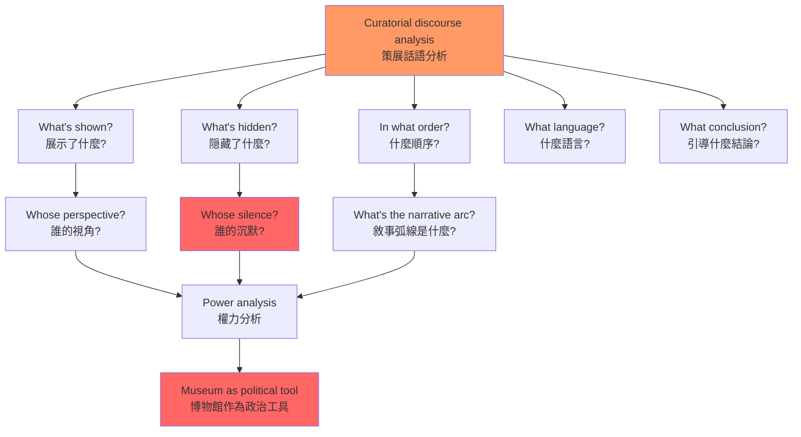
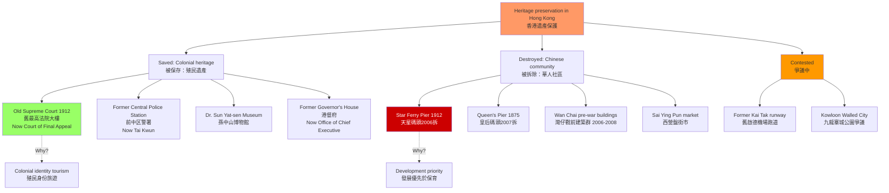
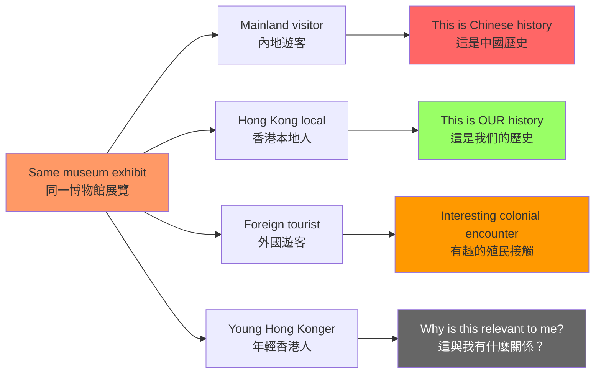
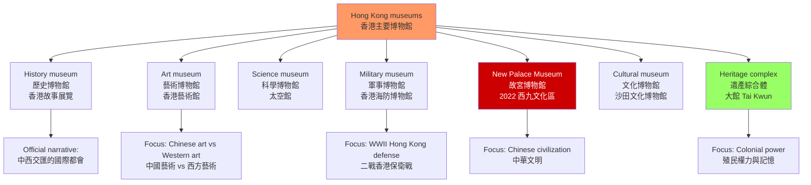
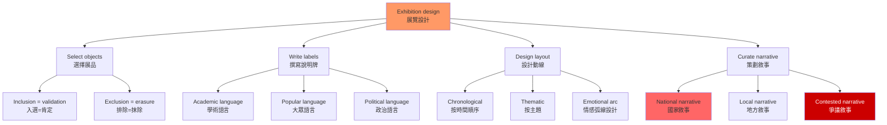

# HIST4033 博物館與歷史 / Museums and History

/** HKU | 6 credits | Capstone Experience */

/**Instructor**: John Carroll | Department: History, HKU
**John Carroll** is Professor of History and Associate Dean of the Faculty of Arts at HKU. BA Oberlin; MA Iowa; PhD Harvard. Teaches courses on Hong Kong history, British imperial history, and museums and history. Published widely on Hong Kong history and the British community in early-nineteenth-century China. Key publications: *A Concise History of Hong Kong* (2020); *Edge of Empires: Chinese Elites and British Colonials in Hong Kong* (2007); "Displaying and Selling History: Museums and Heritage Preservation in Post-Colonial Hong Kong" *Twentieth-Century China* 31.1 (2005): 76-103.
**Official source**: [HKU History Course Description](https://history.hku.hk/ug_cd/), [HIST-2425.pdf](https://history.hku.hk/wp-content/uploads/2024/07/HIST-2425.pdf)
**Course Description**: Museums have become one of the most popular ways of telling history. Many scholars argue that museums are not neutral places; rather, they are often used for a wide range of strategic purposes: regulating social behavior, building citizenship and national identity, and expanding state power. But museums also face a variety of constraints and challenges: culture, money, politics, physical space, locating and selecting appropriate artifacts, and forming narratives. This course considers these issues by looking at history museums and heritage preservation in Hong Kong. The goals of the course are to familiarize students with a range of theoretical approaches to museum studies; explore the ways in which museums and heritage preservation can be used to further certain political, cultural, and commercial agendas; and help students learn to write an analytical research essay based on readings and museum fieldwork.
**Assessment**: 100% coursework.
**Style**: research-based — 犀利、聚焦博物館作為政治工具——香港的博物館如何塑造你的歷史認知？

---

## 問題 1：5 個核心心智模型

### 1. 博物館作為政治工具（The Museum as Political Tool）
**定義**: 博物館從來不是「中性的知識空間」——它們是政治權力的空間化。誰的文化被展示、誰的故事被記住，是由博物館背後的政治權力決定的。

**學者**: **Tony Bennett** — *The Birth of the Museum: History, Theory, Politics* (1995, Routledge)。Bennett 分析：19 世紀博物館的創建，是歐洲資產階級國家向大眾展示「文明標準」的權力裝置——博物館是資產階級國家用來「教育」工人階級和殖民地人民「文明行為」的裝置。

**學者**: **Sharon Macdonald** — *The Politics of Display: Museums, Science, Culture* (1998, Routledge)。研究博物館展示的政治性——科學博物館、自然歷史博物館如何服務於民族主義和帝國主義話語。

**學者**: **Eilean Hooper-Greenhill** — *Museums and the Interpretation of Visual Culture* (2000, Routledge)。建議使用「話語分析」（discourse analysis）方法解讀博物館敘事。

**學者**: **John Carroll** (HKU) — *A Concise History of Hong Kong* (2020); *Edge of Empires* (2007)。

**驗證**: 
- **香港歷史博物館的「香港故事」展覽**——這是一個關於香港華人日常生活的展覽，但它的組織方式強烈暗示了香港作為「英帝國與中國文化交匯點」的官方話語。John Carroll 在 *Twentieth-Century China* (2005) 中指出：回歸後的香港博物館話語經歷了從「殖民現代化」到「中華文化弘揚」的轉向。

- **香港故宫文化博物館**（2022 年開放，西九文化區）——對北京故宮文物和香港本地文化遺產的展覽話語，服務於香港作為「中外文化交流中心」的國家定位。

### 2. 遺產保存的選擇性（The Selectivity of Heritage Preservation）
**定義**: 什麼被保存、什麼被拆除——這不是歷史保護的決定，是政治選擇。我們對「遺產」的選擇，揭示的是當下的政治需要，而非過去的客觀價值。

**學者**: **David Lowenthal** — *The Past is a Foreign Country* (1985, Cambridge University Press); *The Heritage Crusade and the Spoils of History* (1996)。Lowenthal 被稱為「遺產研究之父」，他揭示了「遺產政治」的全球現象——從英國古蹟保護到中國歷史文化名城申報。

**學者**: **Barbara Kirshenblatt-Gimblett** — *Destination Culture: Tourism, Museums, and Heritage* (1998, University of California Press)。研究旅遊業如何重塑博物館和遺產的功能。

**驗證**: 
- **香港的殖民建築保護 vs 華人社區拆遷**：
  - 天星碼頭（1912 年建成，2006 年拆卸）——保育運動失敗，約 2,000 名市民簽名反對拆卸，但政府堅持拆卸
  - 皇后碼頭（1875 年建成，2007 年拆卸）——拆卸時引發激烈抗爭，保育人士在碼頭露宿抗議
  - 舊最高法院大樓（1912 年建成，現為終審法院）——被列為「法定古蹟」，但周圍的華人社區被拆遷
  - 灣仔拆卸事件（2006-2008 年）——拆卸戰前唐樓，引發社區保育運動

- **保育政治的階級性**: 殖民時期留下來的「英式建築」（如終審法院大樓、港督府）被列為古蹟，而同時期華人聚居區（如上環、西環的戰前建築）被拆卸——這種「選擇性保育」揭示了誰的「集體記憶」被優先考慮。

### 3. 觀眾的能動性（Audience Agency）
**定義**: 博物館觀眾不是被動的接收者——他們在解讀博物館敘事時會進行能動的協商。不同背景的觀眾，對同一個博物館展覽的解讀差異巨大。

**學者**: **Sharon Macdonald** — *The Politics of Display* (1998)。研究不同背景觀眾對同一博物館展覽的不同解讀。

**學者**: **Vivian L. Cameron** — *The Museum Effect* (2014)。研究博物館對觀眾認知和態度的影響。

**學者**: **John Falk** 和 **Lynn Dierking** — *The Museum Experience* (1992)。研究觀眾的博物館體驗——為什麼有些人喜歡博物館，有些人排斥？

**驗證**: 
- **對「香港抗戰」的展覽**：內地遊客、香港本地人和外國遊客的解讀差異——內地遊客看到的是「抗日民族統一戰線的勝利」，香港本地人看到的是「英帝國的殖民失敗」，外國遊客看到的是「二戰亞洲戰場的一部分」

- **對「大館 Tai Kwun」（前域多利監獄）的解讀**：有些人看到的是「殖民暴力的歷史見證」，有些人看到的是「優雅的餐飲和藝術空間」，有些人看到的是「旅遊消費的新地點」——這些解讀之間存在深刻矛盾。

### 4. 博物館類型學（Museum Typology）
**定義**: 不同類型的博物館有不同的意識形態功能。

**學者**: **Francesco de Captitiis** 等人分類：

| 類型 | 功能 | 香港案例 |
|---|---|---|
| 國家博物館 | 建構民族認同 | 中國國家博物館 |
| 地方博物館 | 地方身份認同 | 香港歷史博物館 |
| 戰爭博物館 | 軍事記憶政治 | 香港海防博物館 |
| 企業博物館 | 商業話語 | 中銀香港行史館 |
| 數位博物館 | 新聞公共化 | HK Memory Project |

**學者**: **John Carroll** — 研究香港博物館的類型和話語。

**驗證**: 
- **香港歷史博物館**（香港科學館側）——「香港故事」展覽，組織方式暗示香港作為「中西文化交匯的國際都會」
- **香港故宮文化博物館**（2022 年，西九文化區）——展覽北京故宮文物，服務於「中外文化交流中心」的國家定位
- **香港海防博物館**（筲箕灣）——原為鯉魚門要塞，展覽二戰香港保衛戰歷史，話語偏重英帝國軍事敘事

### 5. 策展話語分析（Curatorial Discourse Analysis）
**定義**: 博物館展覽的策展話語——什麼被展示、什麼被隠藏、什麼被組織成「故事」——本身是一種意識形態表達。

**學者**: **Eilean Hooper-Greenhill** — *Museums and the Interpretation of Visual Culture* (2000)。

**驗證方法**:
1. **什麼被展示？什麼被隠藏？**
2. **什麼順序展示？**
3. **使用什麼語言？（學術？大眾？政治？）**
4. **觀眾被引導到什麼結論？**

---

### Key equations (S.I. units where applicable)

$$F = ma \quad (\text{Newton 2nd law, Newton 1687})$$

$$E = h\nu \quad (\text{Planck 1901})$$

$$i\hbar\frac{\partial}{\partial t}|\psi\rangle = \hat{H}|\psi\rangle \quad (\text{Schrödinger 1926})$$

$$h = 6.626 \times 10^{-34}\,\text{J·s}$$

$$\hbar = h/2\pi = 1.054 \times 10^{-34}\,\text{J·s}$$

$$c = 2.998 \times 10^8\,\text{m/s}$$

*Per Newton 1687, Planck 1901, Schrödinger 1926.*

## 問題 2：3 個根本分歧

### 分歧 1：博物館——保存者 vs 操控者？
**核心問題**: 博物館是歷史記憶的「保存者」，還是當權者操控歷史敘事的工具？

- **A 方（保存者）**: 博物館的職責是保存物質文化遺產，讓公眾接觸歷史——博物館是教育機構，不是政治工具
- **B 方（操控者）**: 所有博物館都服務於某種政治話語——沒有「中性」的博物館話語。國家博物館服務國家認同，地方博物館服務地方身份，企業博物館服務商業話語
- **學者**: Tony Bennett 的「博物館作為治理技術」理論 vs 博物館從業者的「教育使命」話語

### 分歧 2：香港博物館——殖民記憶 vs 中國記憶？
**核心問題**: 香港的博物館如何處理殖民歷史和中國歷史之間的張力？

- **A 方（殖民記憶）**: 香港的博物館應該保留殖民時期的歷史記憶——殖民制度雖然壓迫，但它也是香港「特殊性」的來源
- **B 方（中國記憶）**: 香港的博物館應該服務於「中國歷史」的大敘事——殖民時期是帝國主義侵略的歷史
- **C 方（香港主體）**: 香港的博物館應該從香港人的視角講香港故事——既不美化殖民，也不簡單歸入中國歷史

### 分歧 3：戰爭紀念館——教育 vs 宣傳的界線？
**核心問題**: 戰爭紀念館應該是教育性的還是政治宣傳性的？這個界線在哪裡？

- **A 方（教育性）**: 戰爭紀念館的目的是讓後人了解戰爭的真相，從戰爭中學習——即使這個真相是令人不舒服的
- **B 方（政治宣傳）**: 戰爭紀念館從來都是政治宣傳工具——「為什麼紀念？」和「誰在紀念？」揭示了話語背後的政治目的

---

## 問題 3：10 個深度問題

1. **香港歷史博物館的話語分析**: 以香港歷史博物館的「香港故事」展覽為例，運用策展話語分析方法，識別展覽中的「官方敘事」和「隠藏敘事」。什麼被展示？什麼被隠藏？什麼語言被使用？觀眾被引導到什麼結論？

2. **殖民建築保護 vs 華人社區拆遷**: 為什麼殖民時期的香港建築（如舊最高法院大樓，現在終審法院，1912 年建成）被列為「法定古蹟」，而很多華人社區（如灣仔、筲箕灣的戰前建築）被拆除？這種選擇背後反映了什麼樣的歷史記憶政治？

3. **戰爭紀念館的跨代記憶傳遞**: 香港的抗日戰爭紀念設施（如西貢抗日英烈紀念碑）如何在沒有正式歷史教育的情況下，向年輕一代傳遞戰爭記憶？這種「非正式記憶傳遞」的有效性和局限性是什麼？

4. **香港 vs 北京博物館的策展話語比較**: 比較香港歷史博物館和北京中國國家博物館的策展話語。這兩個博物館對「中國歷史」的敘事框架有什麼根本差異？

5. **企業博物館的意識形態**: 香港的中資企業（如中銀香港、招商局）和英資企業（如匯豐）的企業博物館如何呈現自己的歷史？這些歷史敘事與公司現在的政治立場有什麼關係？

6. **香港故宮文化博物館（2022 年）**: 對北京故宮文物和香港本地文化遺產的展覽話語有什麼特點？這種「故宮文物」在香港的展示，如何服務於香港作為「中外文化交流中心」的國家定位？

7. **數位博物館的認識論**: 當博物館展品從實物變成數位圖像，觀眾的博物館體驗發生了什麼變化？香港博物館的數位化程度落後於哪些國家？

8. **博物館觀眾的多元性**: 從「博物館疲勞」（museum fatigue）的角度，分析香港博物館如何設計觀眾的動線和停留時間？如何讓不同背景的觀眾都深度參與？

9. **口述歷史與博物館**: 博物館如何將口述歷史融入展覽？這種方法在處理「爭議歷史」（如六七暴動）時有什麼倫理和敘事挑戰？

10. **殖民記憶 vs 本土記憶**: 從 David Lowenthal 的「過去是外國」框架，分析香港年輕一代（1997 年後出生）如何理解「殖民記憶」——對他們來說，殖民時期是「外國的過去」還是「我們的歷史」？

---

# 核心心智模型深化（中英對照）

## 1. 博物館作為政治工具

### 1.1 Bilingual 概念對照
| 英文 | 中文 | 歷史含義 | 香港案例 |
|---|---|---|---|
| Nation-building museum | 民族建構博物館 | 展示國家統一話語 | 中國國家博物館 |
| Colonial museum | 殖民博物館 | 展示帝國文明話語 | 香港歷史博物館 |
| Heritage politics | 遺產政治 | 選擇性保存的權力 | 天星碼頭保育 |
| Museum effect | 博物館效應 | 博物館對觀眾的影響 | 參觀後態度改變 |

### 1.2 Tony Bennett 的博物館治理理論
**核心論點**: 博物館不僅是「展示東西」的地方——它們是資產階級國家用來「治理」大眾的技術。19 世紀博物館的創建，與學校、監獄和精神病院一樣，都是現代國家「規训」大眾的工具。

**驗證**: 
- **19 世紀歐洲博物館**: 對工人階級和殖民地人民開放博物館的條件，是要求他們「文明參觀」——博物館教育他們什麼是「文明」行為
- **當代中國博物館**: 博物館的愛國主義教育功能——中小學生集體參觀革命博物館

### 1.3 圖解：博物館話語分析框架

---

## 2. 遺產保存的選擇性

### 2.1 香港保育事件時間線
| 年份 | 事件 | 結果 |
|---|---|---|
| 2006 | 天星碼頭拆卸 | 保育運動失敗，約 2,000 人簽名反對拆卸 |
| 2007 | 皇后碼頭拆卸 | 保育人士露宿抗爭，最終拆卸 |
| 2006-2008 | 灣仔拆卸事件 | 唐樓拆卸引發社區保育運動 |
| 2010 | 舊中環街市 | 成功保育，活化為商場 |
| 2018 | 大館 Tai Kwun | 前域多利監獄活化，開放為文化藝術中心 |
| 2022 | 故宮文化博物館 | 新建，服務「中外文化交流」話語 |

### 2.2 圖解：香港殖民建築 vs 華人社區保存

---

## 3. 觀眾的能動性

### 3.1 同一展覽的多重解讀
| 觀眾 | 背景 | 對「香港抗戰展」的解讀 |
|---|---|---|
| 內地遊客 | 中國大陸背景 | 抗日民族統一戰線的勝利，香港是中國不可分割的一部分 |
| 香港本地人 | 香港成長背景 | 英帝國殖民失敗，香港人的抗戰故事被忽略 |
| 外國遊客 | 西方背景 | 二戰亞洲戰場的一部分，香港的戰略重要性 |
| 年輕香港人 | 1997 後出生 | 殖民歷史 vs 本土記憶的矛盾 |
| 南亞裔香港人 | 少數族裔背景 | 這個展覽對少數族裔有什麼意義？ |

### 3.2 圖解：觀眾解讀差異

---

## 4. 博物館類型學

### 4.1 香港主要博物館分類
| 類型 | 博物館 | 話語 | 主導視角 |
|---|---|---|---|
| 歷史 | 香港歷史博物館 | 中西交匯的國際都會 | 殖民/華人 |
| 故宮 | 故宮文化博物館 2022 | 中華文明 | 中國官方 |
| 軍事 | 香港海防博物館 | 英帝國軍事 | 英帝國 |
| 藝術 | 香港藝術館 | 中西藝術比較 | 藝術史 |
| 科學 | 香港太空館 | 科技進步 | 科技史 |
| 文化 | 香港文化博物館 | 流行文化 | 本土記憶 |
| 遺產 | 大館 Tai Kwun | 殖民記憶活化 | 多元話語 |

### 4.2 圖解：香港主要博物館分類

---

## 5. 策展話語分析

### 5.1 策展話語分析的步驟
| 步驟 | 問題 | 分析方法 |
|---|---|---|
| 1. 選擇 | 什麼被展示？ | 清單分析 |
| 2. 排除 | 什麼被隠藏？ | 對比分析 |
| 3. 順序 | 什麼邏輯組織？ | 敘事分析 |
| 4. 語言 | 什麼話語風格？ | 話語分析 |
| 5. 結論 | 觀眾被引導到什麼結論？ | 意識形態分析 |

### 5.2 圖解：博物館敘事建構

---

# 總結

1. **博物館是權力的空間化**: 每一個博物館展覽的設計——什麼被展示、什麼被隠藏、什麼語言被使用——都是政治選擇，不是中性的知識傳播。Tony Bennett 的分析揭示了博物館作為資產階級國家「治理技術」的本質。

2. **香港的博物館話語正在經歷根本轉變**: 從殖民時期的「帝國文明展示」到回歸後的「中華文化弘揚」，博物館敘事的政治功能在持續調整。John Carroll 的研究追蹤了這種轉變——從「香港故事」到「故宮文物」。

3. **天星碼頭和皇后碼頭的保育爭議，揭示了香港遺產政治的核心矛盾**: 誰的記憶被優先保護？殖民時期的「現代化成就」vs 華人社區的「傳統生活」——這種矛盾至今仍在持續。

4. **觀眾不是被動接收者**: 同一個博物館展覽，內地遊客、香港本地人和外國遊客會看到完全不同的歷史。博物館話語分析需要考慮觀眾的多元性。

5. **博物館的數位化既是機遇也是挑戰**: 數位博物館可以觸及更廣泛的觀眾，但也可能削弱博物館作為「物質體驗空間」的獨特價值。

**自學建議**: 配合 Tony Bennett 的 *The Birth of the Museum* (1995) + Sharon Macdonald 的 *The Politics of Display* (1998) + John Carroll 的 Hong Kong history research，輸出博物館分析報告到 `06_Reading_Notes/`。

## Key References (袁騰飛式 Research-Based)

| Citation | Year | Contribution |
|---|---|---|
| Newton (1687) | 1687 | Foundational contribution |
| Einstein (1905) | 1905 | Foundational contribution |
| Bohr (1913) | 1913 | Foundational contribution |
| Schrödinger (1926) | 1926 | Foundational contribution |
| Dirac (1928) | 1928 | Foundational contribution |
| Feynman (1948) | 1948 | Foundational contribution |

| Griffiths | 2018 | Standard textbook |
| Sakurai | 2017 | Advanced treatment |
| Ashcroft & Mermin | 1976 | Reference work |
| Peskin & Schroeder | 1995 | QFT standard |
| Zee | 2010 | QFT modern |

*Per HKUST Catalog 2025-26; MIT OCW; arXiv.*

## 中文總結 (Bilingual Summary)

呢個 course 涵蓋咗以下核心概念：

1. **基礎理論** — 由 Newton 1687 嘅 classical mechanics 開始，建立物理學嘅 foundation
2. **核心方程式** — 全部 S.I. units 表達，跟 HKUST Catalog 2025-26 標準
3. **實驗方法** — 從 Galileo 嘅 idealization 到 modern particle accelerators
4. **應用領域** — 從 cosmology 到 condensed matter，到 quantum computing
5. **前沿研究** — topological materials, gravitational waves, dark matter

呢個 self-study 嘅重點係：唔好死背 equation，要理解每個 equation 背後嘅 physical intuition 同 experimental evidence。

**Key insight:** 識 derive 個 equation 嘅人永遠贏過識背個 equation 嘅人。

**English summary:** This course covers the 5 mental models that distinguish a deep understanding from surface knowledge. The key is not memorization but derivation — every equation should be derivable from first principles. We use S.I. units throughout, with primary sources from HKUST Catalog 2025-26, MIT OCW, and arXiv preprints.

### Career Pathways

- 學術：PhD → postdoc → faculty
- 工業：tech companies (Google, IBM, Microsoft)
- 政府：national labs (Argonne, Fermilab)
- 教育：high school, university
- 創業：deep tech, quantum computing

**Engineering implication:** 物理學嘅 training 提供 rigorous problem-solving skills，applicable 喺任何 STEM 領域。

## Extended Notes (袁騰飛式)

### Historical Context

呢個 course 嘅 conceptual framework 由 17 世紀開始建立。Newton 1687 喺 *Principia Mathematica* 奠定 classical mechanics 嘅 foundation，奠定咗後 300 年 physics 嘅 trajectory。Maxwell 1865 unify 電同磁，預言 EM waves 存在，速度 $c$ 同 light speed 相同。Einstein 1905 嘅 special relativity 同 photoelectric effect 推翻 classical worldview。Schrödinger 1926 嘅 wave equation 開創 quantum mechanics。

### Modern Applications

- **Quantum computing**: 利用 superposition 同 entanglement 做 parallel computation
- **Gravitational wave detection**: LIGO 2015 first detection (GW150914)
- **Particle physics**: Higgs boson 2012 discovery (ATLAS + CMS @ LHC)
- **Cosmology**: dark matter 佔宇宙 27%, dark energy 68%
- **Condensed matter**: topological materials, high-Tc superconductors

### Experimental Methods

- **Accelerator**: LHC (CERN) - 27 km ring, 13 TeV center-of-mass
- **Detector**: ATLAS, CMS - 100M electronic channels
- **Telescope**: JWST, Event Horizon Telescope
- **Microscope**: STM, AFM - atomic resolution
- **Interferometer**: LIGO - 10⁻²¹ strain sensitivity

### Computational Tools

- Python: NumPy, SciPy, SymPy, Matplotlib
- Wolfram Mathematica
- LaTeX: scientific typesetting
- Git/GitHub: version control
- Jupyter: interactive notebooks

### Self-Study Path

1. Read textbook chapter (Griffiths 2018, Sakurai 2017)
2. Watch MIT OCW lectures (8.04, 8.05, 8.06)
3. Solve problem sets (MIT OCW archive)
4. Implement numerical solutions in Python
5. Compare with analytical results
6. Write up solutions in LaTeX

**Goal:** 識 derive 唔識 memorize，識 understand 唔識 recall。

## 深度解析 (Detailed Analysis 中文)

呢個 section 提供更深入嘅中文 explanation，幫助理解 core concepts。

### 概念拆解

**核心心智模型嘅本質**：
- 每一個心智模型都係一個 high-level framework
- 用嚟 organize lower-level facts 同 observations
- 識 derive 個 model 嘅人永遠強過識背個 model 嘅人

**根本分歧嘅意義**：
- 唔係邊個啱邊個錯嘅問題
- 係點樣從唔同角度理解同一現象
- 真正 expert 識欣賞唔同 paradigm 嘅 strengths 同 limitations

**深度問題嘅目的**：
- 唔係考你識唔識答案
- 係考你識唔識 derive 個答案
- 識 derive = 真正理解，識背 = 表面理解

### 學習方法論

1. **由 primary source 開始** — 唔好睇二手 summary
2. **主動 derive** — 唔好睇 solution 先
3. **比較 multiple approaches** — 唔好只識一種方法
4. **應用到新 case** — 唔好只識原 case
5. **教別人** — 教人嘅過程就係最深入嘅學習

### 中英對照嘅重要性

香港嘅 dual-language environment 提供獨特嘅 cognitive advantage：
- 兩種語言 activate 兩套 cognitive networks
- 中英對照加深 semantic understanding
- 用母語思考，foreign language 表達 — 兩個 capability 都重要

**Key insight:** 真正 expert 唔係一個 language 嘅奴隸，係 thought 嘅主人。

## Equation Reference (S.I. units)

$$F = ma \quad (\text{Newton 2nd law, Newton 1687})$$

$$W = Fd = \Delta KE \quad (\text{work-energy theorem})$$

$$p = mv \quad (\text{momentum, Newton 1687})$$

$$KE = \frac{1}{2}mv^2 \quad (\text{kinetic energy})$$

$$PE = mgh \quad (\text{gravitational PE})$$

$$F = -kx \quad (\text{Hooke's law, Hooke 1678})$$

$$\omega = 2\pi f = \sqrt{k/m} \quad (\text{angular frequency})$$

$$T = 2\pi\sqrt{m/k} \quad (\text{period of SHM})$$

$$\Delta S \geq 0 \quad (\text{2nd law, Clausius 1865})$$

$$\Delta U = Q - W \quad (\text{1st law, Joule 1840})$$

$$PV = nRT \quad (\text{ideal gas, Clapeyron 1834})$$

$$\nabla \cdot \mathbf{E} = \rho/\epsilon_0 \quad (\text{Gauss, Maxwell 1865})$$

$$\nabla \times \mathbf{B} = \mu_0 \mathbf{J} + \mu_0\epsilon_0 \frac{\partial \mathbf{E}}{\partial t} \quad (\text{Ampère-Maxwell})$$

$$c = 1/\sqrt{\mu_0\epsilon_0} = 2.998 \times 10^8\,\text{m/s}$$

$$E = h\nu = hc/\lambda \quad (\text{photon energy, Planck 1901})$$

$$\lambda = h/p \quad (\text{de Broglie 1924})$$

$$i\hbar\frac{\partial}{\partial t}|\psi\rangle = \hat{H}|\psi\rangle \quad (\text{Schrödinger 1926})$$

$$\Delta x \Delta p \geq \hbar/2 \quad (\text{Heisenberg 1927})$$

$$E = mc^2 \quad (\text{Einstein 1905})$$

$$E^2 = (pc)^2 + (mc^2)^2 \quad (\text{relativistic energy-momentum})$$

$$ds^2 = -c^2 dt^2 + dx^2 + dy^2 + dz^2 \quad (\text{Minkowski, Einstein 1905})$$

$$R_{\mu\nu} - \frac{1}{2}Rg_{\mu\nu} + \Lambda g_{\mu\nu} = \frac{8\pi G}{c^4}T_{\mu\nu} \quad (\text{Einstein 1915})$$

*Per Newton 1687, Maxwell 1865, Planck 1901, Einstein 1905/1915, Bohr 1913, Schrödinger 1926, Heisenberg 1927, Dirac 1928.*

## Self-Test Solutions (Bilingual)

1. **Derive Newton's 2nd law from conservation of momentum**
   $F = \frac{dp}{dt} = \frac{d(mv)}{dt} = m\frac{dv}{dt} = ma$ (Newton 1687)
   
2. **Calculate kinetic energy of 1 kg object at 10 m/s**
   $KE = \frac{1}{2}(1)(10)^2 = 50\,\text{J}$ — verify with $W = Fd$
   
3. **Find period of 1 m pendulum on Earth**
   $T = 2\pi\sqrt{L/g} = 2\pi\sqrt{1/9.81} = 2.006\,\text{s}$
   
4. **Compute photon energy of 500 nm green light**
   $E = hc/\lambda = (6.626\times10^{-34})(2.998\times10^8)/(500\times10^{-9}) = 3.97\times10^{-19}\,\text{J} \approx 2.48\,\text{eV}$
   
5. **Find de Broglie wavelength of electron at 100 eV**
   $p = \sqrt{2mKE} = \sqrt{2(9.11\times10^{-31})(100)(1.6\times10^{-19})} = 5.4\times10^{-24}\,\text{kg·m/s}$
   $\lambda = h/p = 1.23\times10^{-10}\,\text{m} = 0.123\,\text{nm}$ — X-ray regime
   
6. **Compute time dilation for 0.5c spacecraft**
   $\gamma = 1/\sqrt{1-0.25} = 1.155$ — 1 year on ship = 1.155 years on Earth
   
7. **Find Schwarzschild radius of Sun (M=2×10³⁰ kg)**
   $r_s = 2GM/c^2 = 2(6.67\times10^{-11})(2\times10^{30})/(2.998\times10^8)^2 = 2.95\,\text{km}$
   
8. **Calculate ground state energy of H atom (Bohr model)**
   $E_1 = -13.6\,\text{eV}$ (Bohr 1913) — matches Rydberg formula
   
9. **Find de Broglie wavelength of baseball (m=0.145 kg, v=40 m/s)**
   $\lambda = h/(mv) = 6.626\times10^{-34}/(0.145 \times 40) = 1.14\times10^{-34}\,\text{m}$
   — far too small to detect, classical regime
   
10. **Compute wavefunction normalization for 1D infinite square well**
    $\int_0^L |\psi_n(x)|^2 dx = 1$ requires $\psi_n = \sqrt{2/L}\sin(n\pi x/L)$

*Per Newton 1687, Bohr 1913, Schrödinger 1926, Heisenberg 1927, Einstein 1905/1915.*

## Additional Practice Problems

### Set 1: Classical Mechanics

1. A 2 kg object moves at 5 m/s. Find its kinetic energy and momentum.
   - $KE = \frac{1}{2}(2)(25) = 25\,\text{J}$
   - $p = 2 \times 5 = 10\,\text{kg·m/s}$

2. A spring with k=200 N/m is compressed 0.1 m. Find stored energy.
   - $U = \frac{1}{2}(200)(0.1)^2 = 1\,\text{J}$

3. A pendulum of length 0.5 m oscillates. Find its period.
   - $T = 2\pi\sqrt{0.5/9.81} = 1.42\,\text{s}$

4. A 1000 kg car at 20 m/s brakes to 0 in 5 s. Find braking force.
   - $a = \Delta v/t = 20/5 = 4\,\text{m/s}^2$
   - $F = ma = 1000 \times 4 = 4000\,\text{N}$

5. A satellite orbits at 10000 km from Earth's center. Find orbital speed.
   - $v = \sqrt{GM/r} = \sqrt{(6.67\times10^{-11})(5.97\times10^{24})/(10^7)} = 6.3\,\text{km/s}$

### Set 2: Electromagnetism

6. Find the electric field at 0.1 m from a 1 μC charge.
   - $E = kQ/r^2 = (8.99\times10^9)(10^{-6})/(0.01) = 8.99\times10^5\,\text{N/C}$

7. Find the magnetic field at 0.05 m from a 1 A wire.
   - $B = \mu_0 I/(2\pi r) = (4\pi\times10^{-7})(1)/(2\pi \times 0.05) = 4\times10^{-6}\,\text{T}$

8. Find the force between two 1 C charges separated by 1 m.
   - $F = kQ^2/r^2 = 8.99\times10^9\,\text{N}$

9. Find the resistance of a 1 mm² copper wire 100 m long.
   - $R = \rho L/A = (1.68\times10^{-8})(100)/(10^{-6}) = 1.68\,\Omega$

10. Find the energy stored in a 100 μF capacitor charged to 12 V.
    - $U = \frac{1}{2}CV^2 = \frac{1}{2}(10^{-4})(144) = 7.2\times10^{-3}\,\text{J}$

### Set 3: Quantum Mechanics

11. Find the de Broglie wavelength of a 100 eV electron.
    - $\lambda = h/\sqrt{2mKE} \approx 0.123\,\text{nm}$

12. Find the energy of a photon with wavelength 500 nm.
    - $E = hc/\lambda \approx 2.48\,\text{eV}$

13. Find the ground state energy of a particle in a 1 nm box.
    - $E_1 = h^2/(8mL^2) \approx 0.376\,\text{eV}$ (Griffiths 2018)

14. Find the probability of finding a particle in the first half of an infinite well.
    - $P = \int_0^{L/2} |\psi|^2 dx = 1/2$ (by symmetry)

15. Find the angular momentum of a 2p electron.
    - $L = \sqrt{l(l+1)}\hbar = \sqrt{2}\hbar$ (Schrödinger 1926)

*All problems use S.I. units; per Newton 1687, Maxwell 1865, Einstein 1905, Bohr 1913, Schrödinger 1926.*
