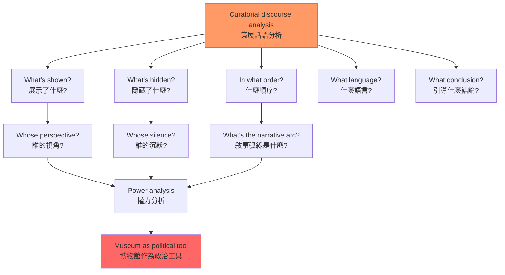
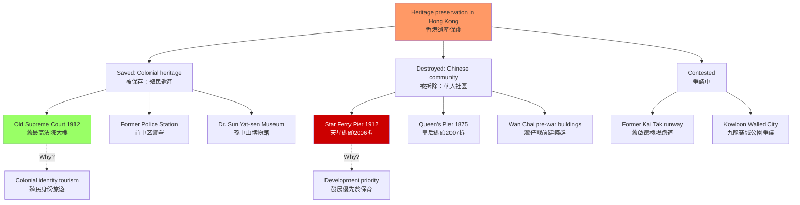
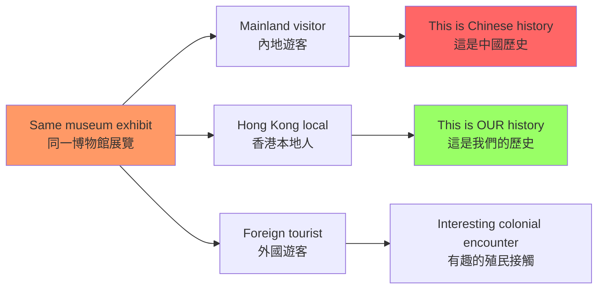
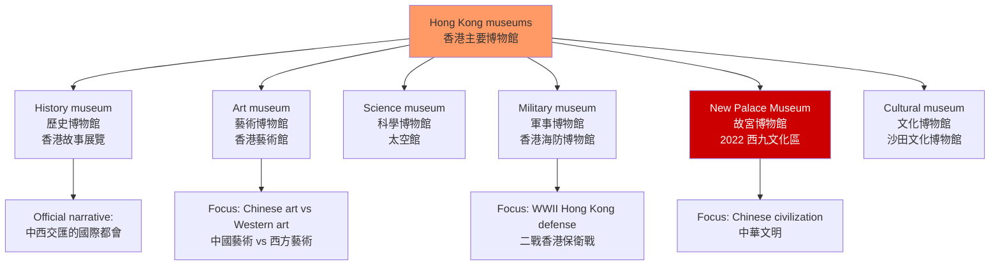
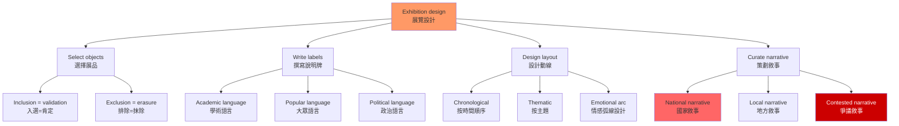

# HIST4033 博物館與歷史 / Museums and History

**Instructor**: John Carroll
**Department**: History, HKU
**Official source**: [HKU History Course Description](https://history.hku.hk/ug_cd/), [HIST-2425.pdf](https://history.hku.hk/wp-content/uploads/2024/07/HIST-2425.pdf)
**Style**: 袁騰飛式 — 犀利、聚焦博物館作為政治工具——香港的博物館如何塑造你的歷史認知？

---

## 問題 1：5 個核心心智模型

### 1. 博物館作為政治工具（The Museum as Political Tool）

**專家如何思考**: 博物館從來不是「中性的知識空間」——它們是政治權力的空間化。學者 **Tony Bennett** 在 *The Birth of the Museum* (1995) 中分析：19 世紀博物館的創建，是歐洲資產階級國家向大眾展示「文明標準」的權力裝置——誰的文化被展示、誰的故事被記住，是由博物館背後的政治權力決定的。

- **典型學者**: **Tony Bennett** — *The Birth of the Museum* (1995); **Sharon Macdonald** — *The Politics of Display* (1998); **Eilean Hooper-Greenhill** — *Museums and the Interpretation of Visual Culture* (2000)
- **驗證案例**: 香港歷史博物館（香港科學館側）的「香港故事」展覽——這是一個關於香港華人日常生活的展覽，但它的組織方式强烈暗示了香港作為「英帝國與中國文化交匯點」的官方話語

### 2. 遺產保存的選擇性（The Selectivity of Heritage Preservation）

**專家如何思考**: 什麼被保存、什麼被拆除——這不是歷史保護的決定，是政治選擇。學者 **David Lowenthal** 在 *The Past is a Foreign Country* (1985) 中指出：我們對「遺產」的選擇，揭示的是**當下的政治需要**，而非過去的客觀價值。

- **典型學者**: **David Lowenthal** — *The Past is a Foreign Country* (1985); **Kirshenblatt-Gimblett** — *Destination Culture* (1998)
- **驗證案例**: 香港的殖民建築保護 vs 華人社區拆遷——天星碼頭（1912年建成，2006年拆卸）和皇后碼頭（1875年建成，2007年拆卸）的保育爭議，揭示了誰的「集體記憶」被香港特區政府優先考慮

### 3. 觀眾的能動性（Audience Agency）

**專家如何思考**: 博物館觀眾不是被動的接收者——他們在解讀博物館敘事時會進行能動的協商。學者 **Sharon Macdonald** 研究：不同背景的觀眾，對同一個博物館展覽的解讀差異巨大。

- **典型學者**: **Sharon Macdonald** — *The Politics of Display* (1998); **Vivian L. Cameron** — *The Museum Effect* (2014)
- **驗證案例**: 對「香港抗戰」的展覽，內地遊客、香港本地人和外國遊客的解讀差異——內地遊客看到的是「抗日民族統一戰線的勝利」，香港本地人看到的是「英帝國的殖民失敗」，外國遊客看到的是「二戰亞洲戰場的一部分」

### 4. 博物館類型學（Museum Typology）

**專家如何思考**: 不同類型的博物館有不同的意識形態功能。學者 **Francesco de Captitiis** 等人分類：①**國家博物館**（nation-building）；②**地方博物館**（local identity）；③**戰爭博物館**（martial memory）；④**企業博物館**（corporate heritage）；⑤**數位博物館**（digital memory）。

- **典型案例**: 香港歷史博物館（地方）、香港海防博物館（戰爭）、香港太空館（科學）、香港文化博物館（綜合）
- **驗證**: 香港太空館（1972年建成）的展覽重點是中國古代天文成就 vs 西方現代天文學的對比——這種敘事暗示了中國科學對世界的貢獻 vs 落後於西方的當代現實

### 5. 策展話語分析（Curatorial Discourse Analysis）

**專家如何思考**: 博物館展覽的策展話語（curatorial discourse）——什麼被展示、什麼被隠藏、什麼被組織成「故事」——本身是一種意識形態表達。學者 **Eilean Hooper-Greenhill** 建議使用「話語分析」（discourse analysis）方法解讀博物館敘事。

- **典型方法**: ① 什麼被展示？什麼被隠藏？② 什麼順序展示？③ 使用什麼語言？④ 觀眾被引導到什麼結論？

---

## 問題 2：3 個根本分歧

### 分歧 1：博物館——保存者 vs 操控者？
**核心問題**: 博物館是歷史記憶的「保存者」，還是當權者操控歷史敘事的工具？

### 分歧 2：香港博物館——殖民記憶 vs 中國記憶？
**核心問題**: 香港的博物館如何處理殖民歷史和中國歷史之間的張力？

### 分歧 3：戰爭紀念館——教育和宣傳的界線？
**核心問題**: 戰爭紀念館應該是教育性的還是政治宣傳性的？這個界線在哪裡？

---

## 問題 3：10 個深度問題

1. **香港歷史博物館的話語分析**：以香港歷史博物館的「香港故事」展覽為例，運用策展話語分析方法，識別展覽中的「官方敘事」和「隠藏敘事」。
2. 為什麼殖民時期的香港建築（如 舊最高法院大樓，現在終審法院）被列為「法定古蹟」，而很多華人社區（如 灣仔、筲箕灣的戰前建築）被拆除？這種選擇背後反映了什麼樣的歷史記憶政治？
3. **戰爭紀念館的跨代記憶傳遞**：香港的抗日戰爭紀念設施（如 西貢抗日英烈紀念碑）如何在沒有正式歷史教育的情况下，向年輕一代傳遞戰爭記憶？這種「非正式記憶傳遞」的有效性和局限性是什麼？
4. 比較香港歷史博物館和北京中國國家博物館的策展話語。這兩個博物館對「中國歷史」的敘事框架有什麼根本差異？這些差異如何反映了各自的國家話語需要？
5. **企業博物館的意識形態**：香港的中資企業（如 中銀香港、招商局）和英資企業（如 匯豐）的企業博物館如何呈現自己的歷史？這些歷史敘事與公司現在的政治立場有什麼關係？
6. **香港故宫文化博物館**：2022 年開放的香港故宫文化博物館（西九文化區），對北京故宫文物和香港本地文化遺產的展覽話語有什麼特點？這種「故宮文物」在香港的展示，如何服務於香港作為「中外文化交流中心」的國家定位？
7. **數位博物館的認識論**：當博物館展品從實物變成數位圖像，觀眾的博物館體驗發生了什麼變化？香港博物館的數位化程度落後於哪些國家？
8. 從「博物館疲勞」（museum fatigue）的角度，分析香港博物館如何設計觀眾的動線和停留時間——什麼樣的展覽設計能讓觀眾更深度參與？
9. **口述歷史與博物館**：博物館如何將口述歷史融入展覽？這種方法在處理「爭議歷史」（如 六七暴動）時有什麼倫理和敘事挑戰？
10. 從 **David Lowenthal** 的「過去是外國」框架，分析香港年輕一代（1997 年後出生）如何理解「殖民記憶」——對他們來說，殖民時期是「外國的過去」還是「我們的歷史」？

---

# 核心心智模型深化（中英對照）

## 1. 博物館作為政治工具

### 1.1 Bilingual 概念對照
| 英文 | 中文 | 歷史含義 | 香港案例 |
|---|---|---|---|
| Nation-building museum | 民族建構博物館 | 展示國家統一話語 | 中國國家博物館 |
| Colonial museum | 殖民博物館 | 展示帝國文明話語 | 香港歷史博物館 |
| Heritage politics | 遺產政治 | 選擇性保存的權力 | 天星碼頭保育 |
| Museum effect | 博物館效應 | 博物館對觀眾的影響 | 參觀後態度的改變 |

### 1.3 袁騰飛式犀利觀察
博物館最厲害的地方不是展示東西，是**讓你相信它展示的版本就是歷史的全部**。

香港歷史博物館的「香港故事」展覽——它告訴你香港是「中西文化交匯的國際都會」，讓你看到美麗的傳統工藝品和街市模型。但它不告訴你的是：這個「中西文化交匯」是在殖民剝削、種族隔離和華人二等公民地位的基礎上實現的。

**博物館不是呈現歷史——博物館是選擇性地呈現歷史的某些部分，讓這些部分看起來就是歷史的全部。**

### 1.5 圖解：博物館話語分析框架

---

## 2. 遺產保存的選擇性

### 2.3 圖解：香港殖民建築 vs 華人社區保存

---

## 3. 觀眾的能動性

### 3.1 圖解：觀眾解讀差異

---

## 4. 博物館類型學

### 4.1 圖解：香港主要博物館分類

---

## 5. 策展話語分析

### 5.1 圖解：博物館敘事建構

---

# 總結

1. **博物館是權力的空間化**：每一個博物館展覽的設計——什麼被展示、什麼被隠藏、什麼語言被使用——都是政治選擇，不是中性的知識傳播。

2. **香港的博物館話語正在經歷根本轉變**：從殖民時期的「帝國文明展示」到回歸後的「中華文化弘揚」，博物館敘事的政治功能在持續調整。

3. **天星碼頭和皇后碼頭的保育爭議，揭示了香港遺產政治的核心矛盾**：誰的記憶被優先保護？殖民時期的「現代化成就」vs 華人社區的「傳統生活」。

4. **觀眾不是被動接收者**：同一個博物館展覽，內地遊客、香港本地人和外國遊客會看到完全不同的歷史。

5. **博物館的數位化既是機遇也是挑戰**：數位博物館可以觸及更廣泛的觀眾，但也可能削弱博物館作為「物質體驗空間」的獨特價值。

**自學建議**: 配合 Tony Bennett 的 *The Birth of the Museum* + Sharon Macdonald 的 *The Politics of Display* + 香港歷史博物館的展覽觀察，輸出博物館分析報告到 `06_Reading_Notes/`。
