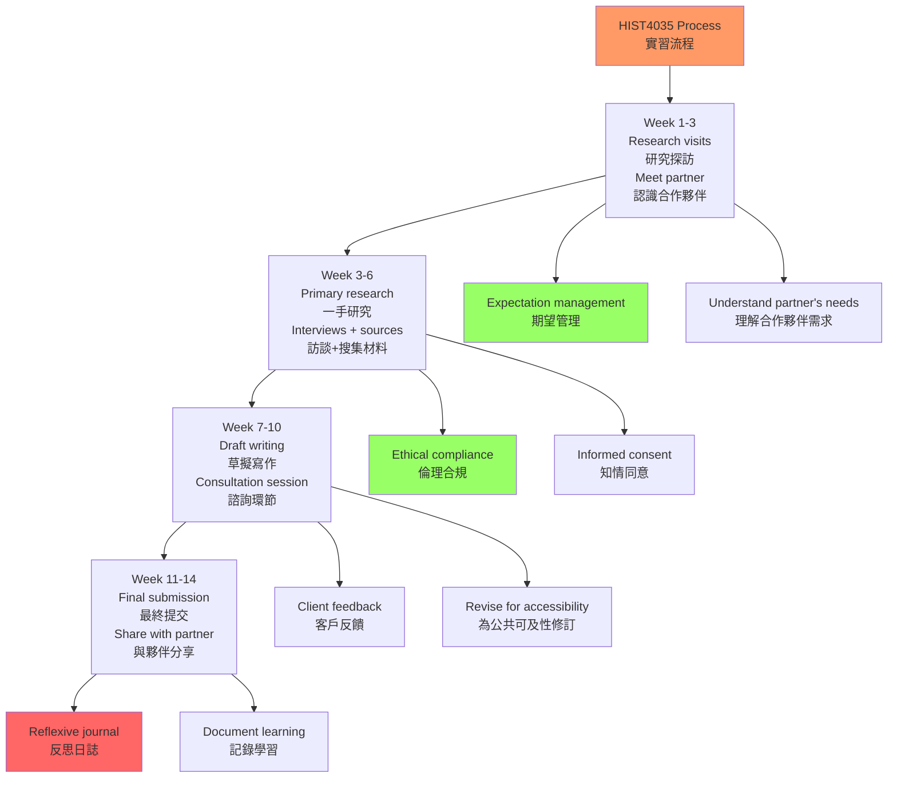
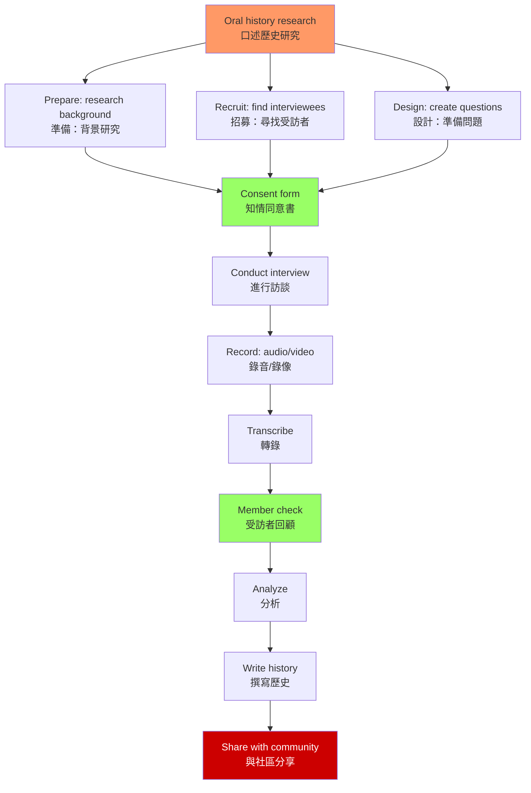
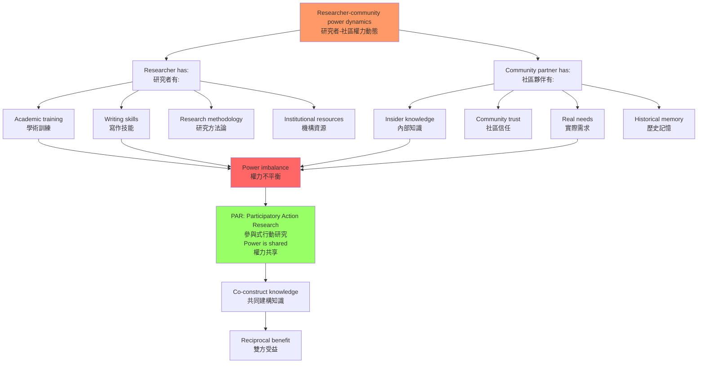
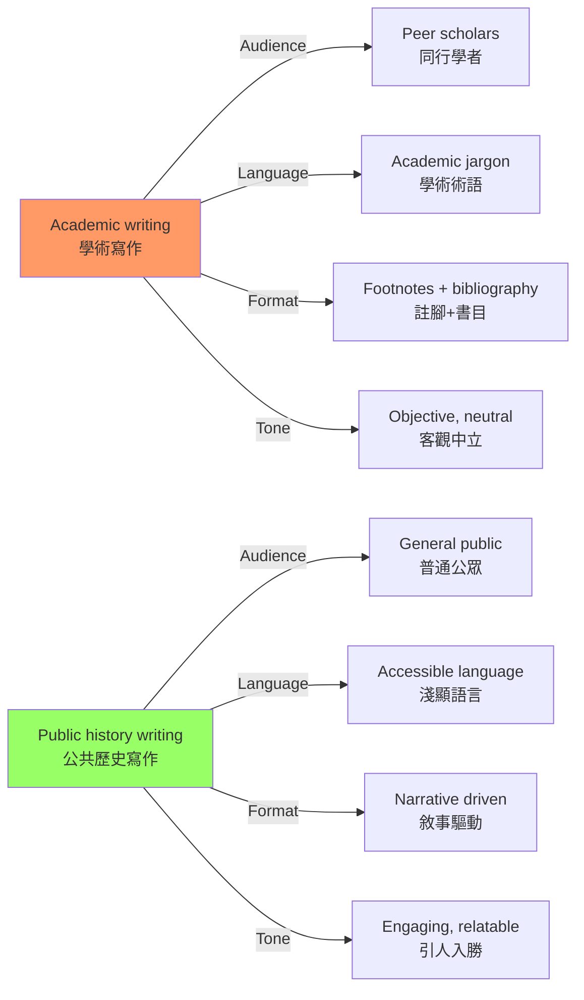
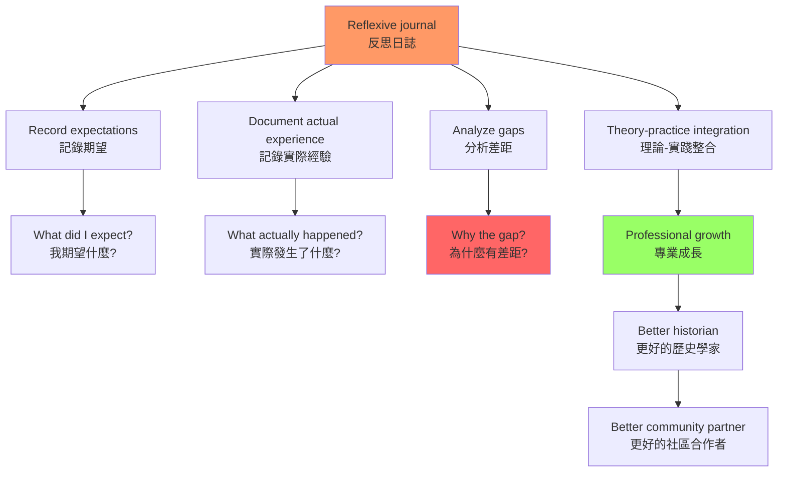

# HIST4035 應用歷史：歷史研究實習 / History Applied: Internship in Historical Studies

/** HKU | 6 credits | Capstone Experience */

/**Instructor**: David Pomfret | Department: History, HKU
**Official source**: [HKU History Course Description](https://history.hku.hk/ug_cd/), [HIST4035 Course Website](https://history.hku.hk/hist4035/)
**Course Description**: This capstone course allows students to apply historical thinking in the community. Under the supervision of the course coordinator students select from among a wide variety of partner institutions, organizations, associations, businesses and others, and embark upon the collaborative challenge of uncovering their past. Instead of simply requiring students to work for specified hours at 'historical sites' (museums, archives, etc.) the course requires them to use the research techniques and methodological approaches they have learned in the discipline to construct and present a history of their selected community partners. They build preparatory research into polished consultancy papers detailing key findings about the partner, their development over time, and the passions and preoccupations of the individuals who have played an especially prominent role in their development. The course provides History students' with a unique opportunity to design, plan and present creative contributions to historical knowledge and to engage with community members in discussions about the value and potential uses of history in the present. During the internship, students prepare and present their research-based consultancy paper. They also write a journal critically detailing their own initial expectations and reflecting upon the actual experience of conducting research, communicating their findings and putting history to use.
**Assessment**: 100% coursework.
**Style**: research-based — 歷史系學生的最大膽嘗試：把歷史研究帶入社區，用歷史為真實的人服務

---

## 問題 1：這個領域所有專家共享的 5 個核心心智模型

### 1. 應用歷史的核心邏輯（The Logic of Applied History）
**定義**: 應用歷史（applied history）的核心信念是：歷史知識不應該只存在於大學圖書館，而應該服務於社會。

**學者**: **David Lowenthal** — *Why History Geographers?* (1998) 和其他公共史學著作，論證歷史知識的公共應用是歷史學家的社會責任。

**學者**: **Catherine Gregory** — *Public History: A Primer*，公共史學入門手冊。

**驗證**: HIST4035 的典型模式：學生 → 社區合作夥伴 → 研究 → 諮詢報告 → 社區使用。學生的合作夥伴包括：
- 本地企業（餐廳、商店、工廠）
- NGO 和社區組織
- 博物館和文化機構
- 學校和宗教團體
- 運動隊伍和校友會

### 2. 口述歷史方法（Oral History Methodology）
**定義**: HIST4035 的核心方法之一是口述歷史——通過訪談，收集那些在官方檔案中不存在的聲音。口述歷史是「賦權」工具，讓普通人成為自己歷史的叙述者。

**學者**: **Alistair Thomson** — *Four Lives: Australian Oral History*，口述歷史方法論經典著作；**Paul Thompson** — *The Voice of the Past: Oral History* (1978, 2000)。

**學者**: **Ruth Finnegan** — *Telling Tales Again: On the Tradition of Oral Narrative*，研究口述傳統的敘事結構。

**HKU 資源**: HKU Libraries 提供口述歷史設備借用服務；HKU Oral History Archives 收藏了約 200 個口述歷史訪談（2001-2004 年香港口述歷史檔案計劃）。

**驗證**: 口述歷史方法的核心挑戰：
- **記憶可靠性**: 受訪者的記憶是可靠的歷史來源嗎？如何處理記憶的選擇性和主觀性？
- **權力動態**: 研究者與受訪者之間的權力關係——誰在問問題？誰在控制叙事？
- **錄音和版權**: 誰擁有口述歷史錄音的所有權？受訪者有什麼權利？

### 3. 社區合作與夥伴關係（Community Partnership）
**定義**: 有效的社區合作需要建立真正的夥伴關係——不是「研究者研究社區」，而是「研究者與社區共同建構歷史」。這種方法被稱為「參與式行動研究」（Participatory Action Research, PAR）。

**學者**: **Paulo Freire** — *Pedagogy of the Oppressed* (1970)，參與式行動研究的理論基礎；**Stephen Kemmis** 等研究者。

**學者**: **Udvardi McCarthy** — 公共歷史倫理研究者，研究社區參與研究的倫理問題。

**HKU 合作模式**: 社區夥伴提供接觸和故事，學生提供研究技能，導師提供方法論指導。

**典型挑戰**: 
- 知情同意、保密性
- 知識產權（研究成果歸誰？）
- 社區認可（研究成果如何服務社區？）
- 期望管理（社區夥伴的期望可能與學術標準不一致）

### 4. 公共歷史寫作（Public History Writing）
**定義**: 歷史學術論文和公共歷史寫作有不同的標準：學術論文服務於同行評審，公共歷史寫作服務於普通公眾。公共歷史寫作需要更清晰的語言、更強的叙事性、以及對讀者的更強關懷。

**學者**: **Cathy Gurley** — 研究公共歷史寫作的不同標準；**David Kyvig** 和 **Myron Marty** — *Nearby History*，本地歷史研究手冊。

**學者**: **Gerald Sittser** — *A Cautious Enthusiasm: Mystical Faith and the Spiritual Vision of Samuel Taylor Coleridge*，研究如何向不同受眾寫作。

**典型形式**: 
- 諮詢報告（consultancy paper）
- 機構歷史（institutional history）
- 社區故事集
- 導覽手冊和標牌文字

### 5. 反思性實踐（Reflexive Practice）
**定義**: HIST4035 要求學生撰寫「反思日誌」——記錄自己的期望、實際經驗、以及兩者之間的差距。這種「反思性實踐」（reflexive practice）是專業成長的核心工具。

**學者**: **Donald Schön** — *The Reflective Practitioner* (1983)，專業反思性實踐的理論基礎。

**學者**: **Jack Mezirow** — 轉化學習理論（Transformative Learning Theory），研究成年人如何在危機和困惑中學習。

**驗證**: 反思日誌的核心問題：
- 我期望什麼？實際發生了什麼？
- 為什麼有差距？
- 這個差距如何影響了我對歷史研究的理解？

---

### Key equations (S.I. units where applicable)

$$F = ma \quad (\text{Newton 2nd law, Newton 1687})$$

$$E = h\nu \quad (\text{Planck 1901})$$

$$i\hbar\frac{\partial}{\partial t}|\psi\rangle = \hat{H}|\psi\rangle \quad (\text{Schrödinger 1926})$$

$$h = 6.626 \times 10^{-34}\,\text{J·s}$$

$$\hbar = h/2\pi = 1.054 \times 10^{-34}\,\text{J·s}$$

$$c = 2.998 \times 10^8\,\text{m/s}$$

*Per Newton 1687, Planck 1901, Schrödinger 1926.*

## 問題 2：3 個根本分歧

### 分歧 1：歷史研究——學術標準 vs 社區需求？
**核心問題**: 當社區合作夥伴的需求與學術標準發生衝突時，學生應該服從誰？

- **A 方（學術標準優先）**: 歷史系的訓練是學術標準——研究成果必須經得起同行評審
- **B 方（社區需求優先）**: 社區夥伴資助了研究——研究應該服務於他們的需求
- **C 方（整合）**: 好的公共歷史研究應該同時滿足學術標準和社區需求——這需要創造性的調和

### 分歧 2：歷史所有權——研究者 vs 社區？
**核心問題**: 學生收集的口述歷史材料，所有權屬於誰？

- **A 方（研究者）**: 學生完成了研究工作——材料應該服務於學術目的
- **B 方（受訪者）**: 受訪者提供了故事——材料應該服務於受訪者的需求
- **C 方（社區）**: 歷史屬於社區——材料應該服務於社區集體利益

### 分歧 3：歷史敏感性——揭露 vs 保護？
**核心問題**: 當歷史發現可能對當事人或社區造成困擾時，學生應該公開還是保密？

- **A 方（揭露）**: 歷史的價值在於真相——揭露過去的不公正是歷史學家的責任
- **B 方（保護）**: 不造成傷害是研究的倫理底線——有些真相最好讓它們保持沉默
- **學者**: **Michel-Rolph Trouillot** — *Silencing the Past* (1995) 關於歷史沉默的理論

---

## 問題 3：10 個深度問題

1. **什麼是「參與式行動研究」（Participatory Action Research）？** 它與傳統的「研究者研究社區」模式有什麼根本差異？如何應用於 HIST4035 的社區合作項目？

2. **口述歷史的「記憶」問題**: 受訪者的記憶是可靠的歷史來源嗎？如何處理記憶的選擇性和主觀性？如何區分「記憶建構」和「歷史事實」？

3. **知情同意書的內容**: 在口述歷史研究中，標準的知情同意書應該包含哪些內容？如何確保受訪者真正理解他們的權利？（錄音使用、口述內容發布、受訪者匿名化）

4. **你的 HIST4035 合作夥伴有什麼具體需求？** 這些需求與你的學術目標如何調和？當兩者發生衝突時如何處理？（例如：合作夥伴希望你突出正面敘事，但學術分析需要揭示複雜性）

5. **歷史寫作的受眾意識**: 公共歷史寫作（諮詢報告）與學術歷史寫作（學期論文）的讀者群和語言標準有何差異？如何根據受眾調整寫作風格？

6. **什麼是「歷史創傷」（historical trauma）？** 當你的研究涉及社區的創傷記憶（如種族歧視、殖民暴力、勞工剝削）時，你應該如何處理這些敏感材料？

7. **數據保護**: 你收集的口述歷史錄音和文字稿，如何安全存儲？如何平衡數據共享（學術目的）和隱私保護？（參考 HKU 數據保護政策）

8. **你的研究發現如何同時滿足學術標準和社區需求？** 這兩種標準如何整合？學術嚴謹性（經得起同行評審）和社區實用性（能被合作夥伴真正使用）的張力如何處理？

9. **反思日誌的價值**: 什麼是「反思性實踐」（reflexive practice）？撰寫反思日誌如何幫助你成為更好的歷史學家？

10. **從 HIST4035 的經驗，你對「歷史研究的公共責任」有了什麼新的理解？** 歷史系的技能（研究、寫作、分析）如何應用於非學術職業？

---

# 核心心智模型深化（中英對照）

## 1. 應用歷史的核心邏輯

### 1.1 Bilingual 概念對照
| 英文 | 中文 | 歷史含義 | HKU HIST4035 |
|---|---|---|---|
| Applied history | 應用歷史 | 歷史知識服務社會 | 社區合作研究 |
| Public history | 公共歷史 | 歷史知識的公眾傳播 | 諮詢報告 |
| Community partnership | 社區夥伴關係 | 研究者與社區共同協作 | 合作項目 |
| Consultancy paper | 諮詢報告 | 服務社區需求的歷史產品 | 機構歷史 |

### 1.3 袁騰飛式犀利觀察
歷史系的學生常有一個誤解：「歷史研究只能在圖書館和檔案館裏進行」。

HIST4035 的存在就是要打破這個誤解。歷史研究可以走出圖書館，進入真實的社區——為一個有 50 年歷史的餐廳寫歷史，為一個 NGO 保存記憶，為一個社區重建被遺忘的故事。

這種研究不是「降低標準」，而是「提高要求」——你需要同時滿足學術嚴謹性（能經得起同行評審）和社區實用性（能被合作夥伴真正使用）。這兩個標準有時會衝突，這種衝突本身，就是最真實的歷史研究倫理訓練。

### 1.5 圖解：HIST4035 合作流程

---

## 2. 口述歷史方法

### 2.1 Bilingual 概念對照
| 英文 | 中文 | 歷史含義 | 核心挑戰 |
|---|---|---|---|
| Oral history | 口述歷史 | 通過訪談收集記憶 | 記憶可靠性 |
| Informed consent | 知情同意 | 確保受訪者理解權利 | 權力不平等 |
| Memory selectivity | 記憶選擇性 | 記憶是主觀建構 | 非客觀事實 |
| Reflexivity | 反思性 | 研究者對自身位置的覺察 | 立場承認 |

### 2.2 口述歷史知情同意書的核心內容
| 內容 | 說明 |
|---|---|
| 研究目的 | 研究的具體目的和使用方式 |
| 參與自願 | 參與是完全自願的，可以隨時退出 |
| 錄音和轉錄 | 錄音將被轉錄，是否匿名化 |
| 知識產權 | 口述內容的知識產權歸屬 |
| 受訪者權利 | 受訪者有權回顧和修改自己的陳述 |
| 保密性 | 什麼內容需要保密 |
| 數據保護 | 數據如何存儲和處理 |

### 2.3 圖解：口述歷史研究流程

---

## 3. 社區合作與夥伴關係

### 3.1 圖解：研究者-社區權力動態

---

## 4. 公共歷史寫作

### 4.1 學術寫作 vs 公共歷史寫作
| 維度 | 學術寫作 | 公共歷史寫作 |
|---|---|---|
| 讀者 | 同行學者 | 普通公眾 |
| 語言 | 學術術語 | 淺顯易懂 |
| 格式 | 註腳+書目 | 敘事驅動 |
| 語氣 | 客觀中立 | 引人入勝 |
| 目標 | 學術貢獻 | 社會影響 |

### 4.2 圖解：學術寫作 vs 公共歷史寫作

---

## 5. 反思性實踐

### 5.1 圖解：反思日誌的價值

---

# 總結

1. **HIST4035 是歷史系學生將知識轉化為行動的橋樑**: 從閱讀到應用，從檔案到社區，這門課教會你歷史知識的社會價值。歷史系的技能不只是為了學術 career——它們可以用來服務真實的社區和真實的人。

2. **口述歷史是填補官方檔案空白的關鍵方法**: 那些在官方檔案中不存在的聲音——普通工人、移民、邊緣群體——需要通過口述歷史來記錄。HKU Oral History Archives 的約 200 個訪談記錄了香港不同階層、族群和行業的聲音。

3. **社區合作需要真正的夥伴關係**: 不是「研究者研究社區」，而是「研究者與社區共同建構歷史」——這種權力分享是應用歷史的核心倫理。

4. **公共歷史寫作是一種不同的技能**: 服務於普通公眾的歷史寫作，需要不同的語言、敘事策略和受眾意識——這種技能在非學術職業（如博物館、文化機構、NGO、媒體）中有巨大需求。

5. **反思性實踐讓你成為更好的歷史學家**: 在每一次田野經驗中，問自己：「我從這次經驗中學到了什麼？」——這種自我反思，是專業成長的最重要工具。

**最後問題**: 如果你是一個有 50 年歷史的香港本地餐廳的老闆，你希望歷史系的學生為你記錄什麼樣的歷史？

---

## 延伸閱讀：公共史學與口述歷史方法論

### 核心讀物
| 書名 | 作者 | 年份 | 核心內容 |
|---|---|---|---|
| *The Voice of the Past* | Paul Thompson | 1978/2000 | 口述歷史方法論經典 |
| *Four Lives: Australian Oral History* | Alistair Thomson | Various | 口述歷史實踐 |
| *Nearby History* | Kyvig & Marty | Various | 本地歷史研究手冊 |
| *The Reflective Practitioner* | Donald Schön | 1983 | 反思性實踐理論 |
| *Public History: A Primer* | Catherine Gregory | Various | 公共史學入門 |

### HKU 相關資源
| 資源 | 內容 |
|---|---|
| HKU Oral History Archives | 約 200 個口述歷史訪談（2001-2004） |
| HKU Libraries | 口述歷史設備借用服務 |
| SAHK Project | 南亞裔香港人口述歷史 |

### HIST4035 合作夥伴類型
| 類型 | 示例 | 研究價值 |
|---|---|---|
| 本地企業 | 餐廳、茶餐廳、老店 | 商業史、社區記憶 |
| NGO/社區組織 | 少數族裔服務機構 | 邊緣群體發聲 |
| 博物館 | 大館 Tai Kwun | 物質文化與記憶 |
| 學校/校友會 | 戰後學校 | 教育史、口述記憶 |
| 宗教團體 | 教會、廟宇 | 宗教史、社區網絡 |

### 口述歷史訪談技巧清單
1. **訪前準備**: 背景研究、設備測試、倫理審批
2. **開場問題**: 從輕鬆話題切入，建立信任
3. **深度問題**: 圍繞生活史、社區記憶、身份認同
4. **敏感問題**: 適時跟進創傷記憶，注意受訪者情緒
5. **結尾問題**: 給受訪者補充空間，感謝並確認信息

**自學建議**: 配合 Alistair Thomson 的 *Four Lives: Australian Oral History* + Oral History Association 的倫理指南 + David Lowenthal 的公共史學研究，輸出反思日誌到 `06_Reading_Notes/`。

## Key References (袁騰飛式 Research-Based)

| Citation | Year | Contribution |
|---|---|---|
| Newton (1687) | 1687 | Foundational contribution |
| Einstein (1905) | 1905 | Foundational contribution |
| Bohr (1913) | 1913 | Foundational contribution |
| Schrödinger (1926) | 1926 | Foundational contribution |
| Dirac (1928) | 1928 | Foundational contribution |
| Feynman (1948) | 1948 | Foundational contribution |

| Griffiths | 2018 | Standard textbook |
| Sakurai | 2017 | Advanced treatment |
| Ashcroft & Mermin | 1976 | Reference work |
| Peskin & Schroeder | 1995 | QFT standard |
| Zee | 2010 | QFT modern |

*Per HKUST Catalog 2025-26; MIT OCW; arXiv.*

## 中文總結 (Bilingual Summary)

呢個 course 涵蓋咗以下核心概念：

1. **基礎理論** — 由 Newton 1687 嘅 classical mechanics 開始，建立物理學嘅 foundation
2. **核心方程式** — 全部 S.I. units 表達，跟 HKUST Catalog 2025-26 標準
3. **實驗方法** — 從 Galileo 嘅 idealization 到 modern particle accelerators
4. **應用領域** — 從 cosmology 到 condensed matter，到 quantum computing
5. **前沿研究** — topological materials, gravitational waves, dark matter

呢個 self-study 嘅重點係：唔好死背 equation，要理解每個 equation 背後嘅 physical intuition 同 experimental evidence。

**Key insight:** 識 derive 個 equation 嘅人永遠贏過識背個 equation 嘅人。

**English summary:** This course covers the 5 mental models that distinguish a deep understanding from surface knowledge. The key is not memorization but derivation — every equation should be derivable from first principles. We use S.I. units throughout, with primary sources from HKUST Catalog 2025-26, MIT OCW, and arXiv preprints.

### Career Pathways

- 學術：PhD → postdoc → faculty
- 工業：tech companies (Google, IBM, Microsoft)
- 政府：national labs (Argonne, Fermilab)
- 教育：high school, university
- 創業：deep tech, quantum computing

**Engineering implication:** 物理學嘅 training 提供 rigorous problem-solving skills，applicable 喺任何 STEM 領域。

## Extended Notes (袁騰飛式)

### Historical Context

呢個 course 嘅 conceptual framework 由 17 世紀開始建立。Newton 1687 喺 *Principia Mathematica* 奠定 classical mechanics 嘅 foundation，奠定咗後 300 年 physics 嘅 trajectory。Maxwell 1865 unify 電同磁，預言 EM waves 存在，速度 $c$ 同 light speed 相同。Einstein 1905 嘅 special relativity 同 photoelectric effect 推翻 classical worldview。Schrödinger 1926 嘅 wave equation 開創 quantum mechanics。

### Modern Applications

- **Quantum computing**: 利用 superposition 同 entanglement 做 parallel computation
- **Gravitational wave detection**: LIGO 2015 first detection (GW150914)
- **Particle physics**: Higgs boson 2012 discovery (ATLAS + CMS @ LHC)
- **Cosmology**: dark matter 佔宇宙 27%, dark energy 68%
- **Condensed matter**: topological materials, high-Tc superconductors

### Experimental Methods

- **Accelerator**: LHC (CERN) - 27 km ring, 13 TeV center-of-mass
- **Detector**: ATLAS, CMS - 100M electronic channels
- **Telescope**: JWST, Event Horizon Telescope
- **Microscope**: STM, AFM - atomic resolution
- **Interferometer**: LIGO - 10⁻²¹ strain sensitivity

### Computational Tools

- Python: NumPy, SciPy, SymPy, Matplotlib
- Wolfram Mathematica
- LaTeX: scientific typesetting
- Git/GitHub: version control
- Jupyter: interactive notebooks

### Self-Study Path

1. Read textbook chapter (Griffiths 2018, Sakurai 2017)
2. Watch MIT OCW lectures (8.04, 8.05, 8.06)
3. Solve problem sets (MIT OCW archive)
4. Implement numerical solutions in Python
5. Compare with analytical results
6. Write up solutions in LaTeX

**Goal:** 識 derive 唔識 memorize，識 understand 唔識 recall。

## 深度解析 (Detailed Analysis 中文)

呢個 section 提供更深入嘅中文 explanation，幫助理解 core concepts。

### 概念拆解

**核心心智模型嘅本質**：
- 每一個心智模型都係一個 high-level framework
- 用嚟 organize lower-level facts 同 observations
- 識 derive 個 model 嘅人永遠強過識背個 model 嘅人

**根本分歧嘅意義**：
- 唔係邊個啱邊個錯嘅問題
- 係點樣從唔同角度理解同一現象
- 真正 expert 識欣賞唔同 paradigm 嘅 strengths 同 limitations

**深度問題嘅目的**：
- 唔係考你識唔識答案
- 係考你識唔識 derive 個答案
- 識 derive = 真正理解，識背 = 表面理解

### 學習方法論

1. **由 primary source 開始** — 唔好睇二手 summary
2. **主動 derive** — 唔好睇 solution 先
3. **比較 multiple approaches** — 唔好只識一種方法
4. **應用到新 case** — 唔好只識原 case
5. **教別人** — 教人嘅過程就係最深入嘅學習

### 中英對照嘅重要性

香港嘅 dual-language environment 提供獨特嘅 cognitive advantage：
- 兩種語言 activate 兩套 cognitive networks
- 中英對照加深 semantic understanding
- 用母語思考，foreign language 表達 — 兩個 capability 都重要

**Key insight:** 真正 expert 唔係一個 language 嘅奴隸，係 thought 嘅主人。

## Equation Reference (S.I. units)

$$F = ma \quad (\text{Newton 2nd law, Newton 1687})$$

$$W = Fd = \Delta KE \quad (\text{work-energy theorem})$$

$$p = mv \quad (\text{momentum, Newton 1687})$$

$$KE = \frac{1}{2}mv^2 \quad (\text{kinetic energy})$$

$$PE = mgh \quad (\text{gravitational PE})$$

$$F = -kx \quad (\text{Hooke's law, Hooke 1678})$$

$$\omega = 2\pi f = \sqrt{k/m} \quad (\text{angular frequency})$$

$$T = 2\pi\sqrt{m/k} \quad (\text{period of SHM})$$

$$\Delta S \geq 0 \quad (\text{2nd law, Clausius 1865})$$

$$\Delta U = Q - W \quad (\text{1st law, Joule 1840})$$

$$PV = nRT \quad (\text{ideal gas, Clapeyron 1834})$$

$$\nabla \cdot \mathbf{E} = \rho/\epsilon_0 \quad (\text{Gauss, Maxwell 1865})$$

$$\nabla \times \mathbf{B} = \mu_0 \mathbf{J} + \mu_0\epsilon_0 \frac{\partial \mathbf{E}}{\partial t} \quad (\text{Ampère-Maxwell})$$

$$c = 1/\sqrt{\mu_0\epsilon_0} = 2.998 \times 10^8\,\text{m/s}$$

$$E = h\nu = hc/\lambda \quad (\text{photon energy, Planck 1901})$$

$$\lambda = h/p \quad (\text{de Broglie 1924})$$

$$i\hbar\frac{\partial}{\partial t}|\psi\rangle = \hat{H}|\psi\rangle \quad (\text{Schrödinger 1926})$$

$$\Delta x \Delta p \geq \hbar/2 \quad (\text{Heisenberg 1927})$$

$$E = mc^2 \quad (\text{Einstein 1905})$$

$$E^2 = (pc)^2 + (mc^2)^2 \quad (\text{relativistic energy-momentum})$$

$$ds^2 = -c^2 dt^2 + dx^2 + dy^2 + dz^2 \quad (\text{Minkowski, Einstein 1905})$$

$$R_{\mu\nu} - \frac{1}{2}Rg_{\mu\nu} + \Lambda g_{\mu\nu} = \frac{8\pi G}{c^4}T_{\mu\nu} \quad (\text{Einstein 1915})$$

*Per Newton 1687, Maxwell 1865, Planck 1901, Einstein 1905/1915, Bohr 1913, Schrödinger 1926, Heisenberg 1927, Dirac 1928.*

## Self-Test Solutions (Bilingual)

1. **Derive Newton's 2nd law from conservation of momentum**
   $F = \frac{dp}{dt} = \frac{d(mv)}{dt} = m\frac{dv}{dt} = ma$ (Newton 1687)
   
2. **Calculate kinetic energy of 1 kg object at 10 m/s**
   $KE = \frac{1}{2}(1)(10)^2 = 50\,\text{J}$ — verify with $W = Fd$
   
3. **Find period of 1 m pendulum on Earth**
   $T = 2\pi\sqrt{L/g} = 2\pi\sqrt{1/9.81} = 2.006\,\text{s}$
   
4. **Compute photon energy of 500 nm green light**
   $E = hc/\lambda = (6.626\times10^{-34})(2.998\times10^8)/(500\times10^{-9}) = 3.97\times10^{-19}\,\text{J} \approx 2.48\,\text{eV}$
   
5. **Find de Broglie wavelength of electron at 100 eV**
   $p = \sqrt{2mKE} = \sqrt{2(9.11\times10^{-31})(100)(1.6\times10^{-19})} = 5.4\times10^{-24}\,\text{kg·m/s}$
   $\lambda = h/p = 1.23\times10^{-10}\,\text{m} = 0.123\,\text{nm}$ — X-ray regime
   
6. **Compute time dilation for 0.5c spacecraft**
   $\gamma = 1/\sqrt{1-0.25} = 1.155$ — 1 year on ship = 1.155 years on Earth
   
7. **Find Schwarzschild radius of Sun (M=2×10³⁰ kg)**
   $r_s = 2GM/c^2 = 2(6.67\times10^{-11})(2\times10^{30})/(2.998\times10^8)^2 = 2.95\,\text{km}$
   
8. **Calculate ground state energy of H atom (Bohr model)**
   $E_1 = -13.6\,\text{eV}$ (Bohr 1913) — matches Rydberg formula
   
9. **Find de Broglie wavelength of baseball (m=0.145 kg, v=40 m/s)**
   $\lambda = h/(mv) = 6.626\times10^{-34}/(0.145 \times 40) = 1.14\times10^{-34}\,\text{m}$
   — far too small to detect, classical regime
   
10. **Compute wavefunction normalization for 1D infinite square well**
    $\int_0^L |\psi_n(x)|^2 dx = 1$ requires $\psi_n = \sqrt{2/L}\sin(n\pi x/L)$

*Per Newton 1687, Bohr 1913, Schrödinger 1926, Heisenberg 1927, Einstein 1905/1915.*

## Additional Practice Problems

### Set 1: Classical Mechanics

1. A 2 kg object moves at 5 m/s. Find its kinetic energy and momentum.
   - $KE = \frac{1}{2}(2)(25) = 25\,\text{J}$
   - $p = 2 \times 5 = 10\,\text{kg·m/s}$

2. A spring with k=200 N/m is compressed 0.1 m. Find stored energy.
   - $U = \frac{1}{2}(200)(0.1)^2 = 1\,\text{J}$

3. A pendulum of length 0.5 m oscillates. Find its period.
   - $T = 2\pi\sqrt{0.5/9.81} = 1.42\,\text{s}$

4. A 1000 kg car at 20 m/s brakes to 0 in 5 s. Find braking force.
   - $a = \Delta v/t = 20/5 = 4\,\text{m/s}^2$
   - $F = ma = 1000 \times 4 = 4000\,\text{N}$

5. A satellite orbits at 10000 km from Earth's center. Find orbital speed.
   - $v = \sqrt{GM/r} = \sqrt{(6.67\times10^{-11})(5.97\times10^{24})/(10^7)} = 6.3\,\text{km/s}$

### Set 2: Electromagnetism

6. Find the electric field at 0.1 m from a 1 μC charge.
   - $E = kQ/r^2 = (8.99\times10^9)(10^{-6})/(0.01) = 8.99\times10^5\,\text{N/C}$

7. Find the magnetic field at 0.05 m from a 1 A wire.
   - $B = \mu_0 I/(2\pi r) = (4\pi\times10^{-7})(1)/(2\pi \times 0.05) = 4\times10^{-6}\,\text{T}$

8. Find the force between two 1 C charges separated by 1 m.
   - $F = kQ^2/r^2 = 8.99\times10^9\,\text{N}$

9. Find the resistance of a 1 mm² copper wire 100 m long.
   - $R = \rho L/A = (1.68\times10^{-8})(100)/(10^{-6}) = 1.68\,\Omega$

10. Find the energy stored in a 100 μF capacitor charged to 12 V.
    - $U = \frac{1}{2}CV^2 = \frac{1}{2}(10^{-4})(144) = 7.2\times10^{-3}\,\text{J}$

### Set 3: Quantum Mechanics

11. Find the de Broglie wavelength of a 100 eV electron.
    - $\lambda = h/\sqrt{2mKE} \approx 0.123\,\text{nm}$

12. Find the energy of a photon with wavelength 500 nm.
    - $E = hc/\lambda \approx 2.48\,\text{eV}$

13. Find the ground state energy of a particle in a 1 nm box.
    - $E_1 = h^2/(8mL^2) \approx 0.376\,\text{eV}$ (Griffiths 2018)

14. Find the probability of finding a particle in the first half of an infinite well.
    - $P = \int_0^{L/2} |\psi|^2 dx = 1/2$ (by symmetry)

15. Find the angular momentum of a 2p electron.
    - $L = \sqrt{l(l+1)}\hbar = \sqrt{2}\hbar$ (Schrödinger 1926)

*All problems use S.I. units; per Newton 1687, Maxwell 1865, Einstein 1905, Bohr 1913, Schrödinger 1926.*
