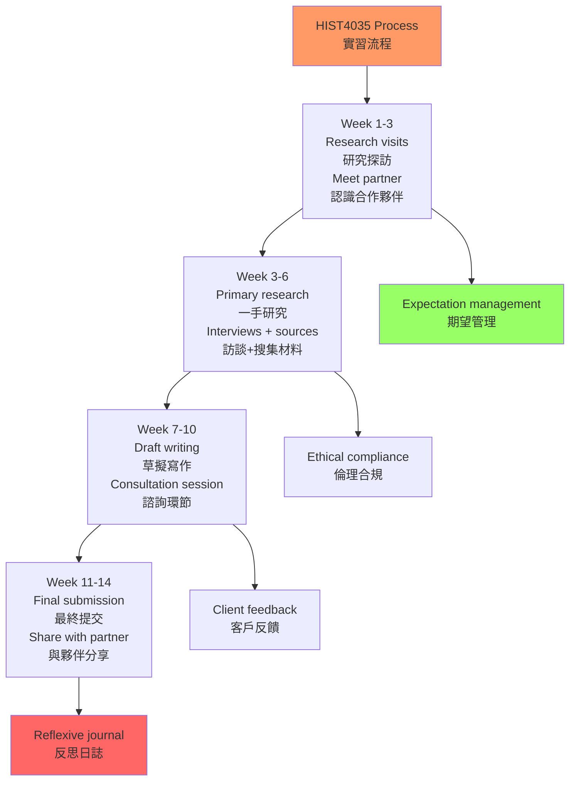
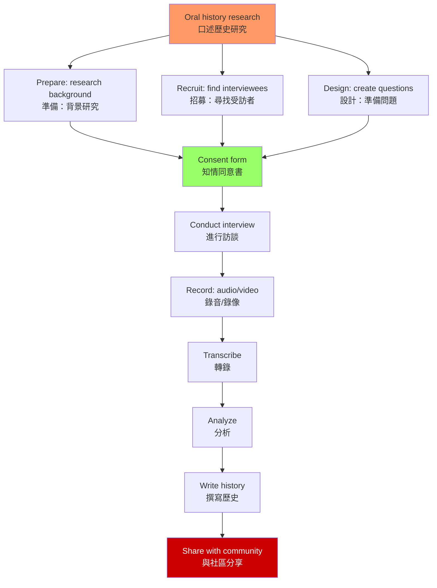
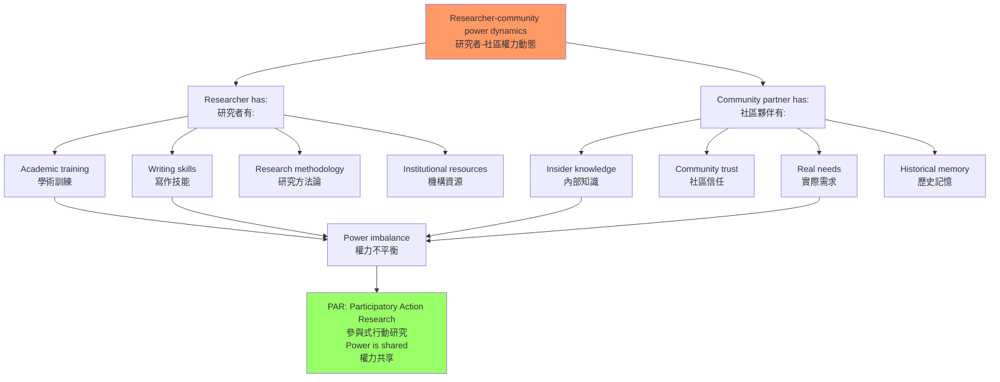
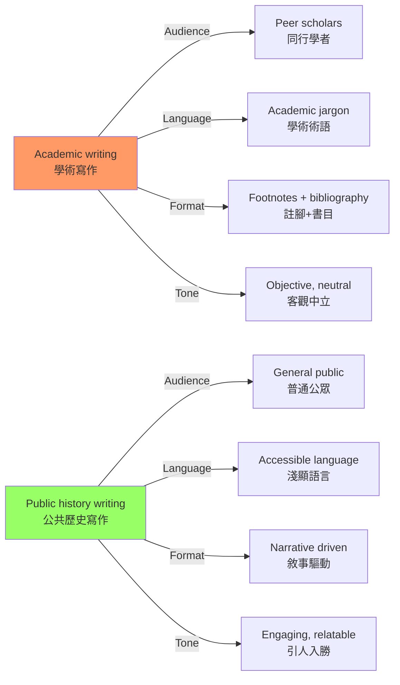
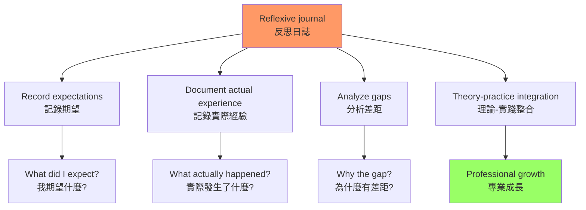

# HIST4035 應用歷史：歷史研究實習 / History Applied: Internship in Historical Studies (Capstone)

**Instructor**: David Pomfret / Alison So (historical)
**Department**: History, HKU
**Official source**: [HKU History Course Description](https://history.hku.hk/ug_cd/), [HIST4035 Course Website](https://history.hku.hk/hist4035/)
**Style**: 袁騰飛式 — 歷史系學生的最大膽嘗試：把歷史研究帶入社區，用歷史為真實的人服務

---

## 問題 1：這個領域所有專家共享的 5 個核心心智模型

### 1. 應用歷史的核心邏輯（The Logic of Applied History）

**專家如何思考**: 應用歷史（applied history）的核心信念是：**歷史知識不應該只存在於大學圖書館，而應該服務於社會**。學者 **David Lowenthal** 在 *Why History Geographers?* (1998) 和其他著作中論證：歷史知識的公共應用，是歷史學家的社會責任。

- **典型模式**: 學生 → 社區合作夥伴 → 研究 → 諮詢報告 → 社區使用
- **驗證方法**: 學生的研究成果可以直接被合作夥伴用於網站、商店或機構展示

### 2. 口述歷史方法（Oral History Methodology）

**專家如何思考**: HIST4035 的核心方法之一是口述歷史——通過訪談，收集那些在官方檔案中不存在的聲音。學者 **Alistair Thomson** 等口述歷史專家強調：口述歷史是「賦權」工具，讓普通人成為自己歷史的叙述者。

- **典型工具**: 錄音設備、轉錄軟件（Express Scribe）、NVivo（質性數據分析）
- **HKU 資源**: HKU Libraries 提供口述歷史設備借用服務

### 3. 社區合作與夥伴關係（Community Partnership）

**專家如何思考**: 有效的社區合作需要建立真正的夥伴關係——不是「研究者研究社區」，而是「研究者與社區共同建構歷史」。這種方法被稱為「參與式行動研究」（Participatory Action Research, PAR）。

- **典型挑戰**: 知情同意、保密性、知識產權、社區認可
- **HKU 合作模式**: 社區夥伴提供接觸和故事，學生提供研究技能，導師提供方法論指導

### 4. 歷史寫作的公共形式（Public History Writing）

**專家如何思考**: 歷史學術論文和公共歷史寫作有不同的標準：學術論文服務於同行評審，公共歷史寫作服務於普通公眾。學者 **Cathy Gurley** 等人研究：公共歷史寫作需要更清晰的語言、更强的叙事性、以及對讀者的更强關懷。

- **典型形式**: 諮詢報告（consultancy paper）、機構歷史（institutional history）、社區故事集

### 5. 反思性實踐（Reflexive Practice）

**專家如何思考**: HIST4035 要求學生撰寫「反思日誌」——記錄自己的期望、實際經驗、以及兩者之間的差距。這種「反思性實踐」（reflexive practice）是專業成長的核心工具。

---

## 問題 2：3 個根本分歧

### 分歧 1：歷史研究——學術標準 vs 社區需求？
**核心問題**: 當社區合作夥伴的需求與學術標準發生衝突時，學生應該服從誰？

### 分歧 2：歷史所有權——研究者 vs 社區？
**核心問題**: 學生收集的口述歷史材料，所有權屬於誰？研究者？受訪者？還是社區？

### 分歧 3：歷史敏感性——揭露 vs 保護？
**核心問題**: 當歷史發現可能對當事人或社區造成困擾時，學生應該公開還是保密？

---

## 問題 3：10 個深度問題

1. 什麼是「參與式行動研究」（Participatory Action Research）？它與傳統的「研究者研究社區」模式有什麼根本差異？
2. 口述歷史的「記憶」問題：受訪者的記憶是可靠的歷史來源嗎？如何處理記憶的選擇性和主觀性？
3. **知情同意書**：在口述歷史研究中，標準的知情同意書應該包含哪些內容？如何確保受訪者真正理解他們的權利？
4. 你的 HIST4035 合作夥伴（如 社區企業、NGO、博物館）有什麼具體需求？這些需求與你的學術目標如何調和？
5. **歷史寫作的受眾意識**：公共歷史寫作（諮詢報告）與學術歷史寫作（學期論文）的讀者群和語言標準有何差異？如何根據受眾調整寫作風格？
6. 什麼是「歷史創傷」（historical trauma）？當你的研究涉及社區的創傷記憶（如 種族歧視、殖民暴力）時，你應該如何處理這些敏感材料？
7. **數據保護**：你收集的口述歷史錄音和文字稿，如何安全存儲？如何平衡數據共享（學術目的）和隱私保護？
8. 你的研究發現，如何同時滿足學術標準（經得起同行評審）和社區需求（實際可用）？這兩種標準如何整合？
9. **反思日誌的價值**：什麼是「反思性實踐」（reflexive practice）？撰寫反思日誌如何幫助你成為更好的歷史學家？
10. 從 HIST4035 的經驗，你對「歷史研究的公共責任」有了什麼新的理解？歷史系的技能（研究、寫作、分析）如何應用於非學術職業？

---

# 核心心智模型深化（中英對照）

## 1. 應用歷史的核心邏輯

### 1.1 Bilingual 概念對照
| 英文 | 中文 | 歷史含義 | HKU HIST4035 |
|---|---|---|---|
| Applied history | 應用歷史 | 歷史知識服務社會 | 社區合作研究 |
| Public history | 公共歷史 | 歷史知識的公眾傳播 | 諮詢報告 |
| Community partnership | 社區夥伴關係 | 研究者與社區共同協作 | 合作項目 |
| Consultancy paper | 諮詢報告 | 服務社區需求的歷史產品 | 機構歷史 |

### 1.3 袁騰飛式犀利觀察
歷史系的學生常有一個誤解：**「歷史研究只能在圖書館和檔案館裏進行」**。

HIST4035 的存在就是要打破這個誤解。歷史研究可以走出圖書館，進入真實的社區——為一個有 50 年歷史的餐廳寫歷史，為一個 NGO 保存記憶，為一個社區重建被遺忘的故事。

這種研究不是「降低標準」，而是**「提高要求」**——你需要同時滿足學術嚴謹性（能經得起同行評審）和社區實用性（能被合作夥伴真正使用）。這兩個標準有時會衝突，這種衝突本身，就是最真實的歷史研究倫理訓練。

### 1.5 圖解：HIST4035 合作流程

---

## 2. 口述歷史方法

### 2.1 Bilingual 概念對照
| 英文 | 中文 | 歷史含義 | 核心挑戰 |
|---|---|---|---|
| Oral history | 口述歷史 | 通過訪談收集記憶 | 記憶可靠性 |
| Informed consent | 知情同意 | 確保受訪者理解權利 | 權力不平等 |
| Memory selectivity | 記憶選擇性 | 記憶是主觀建構 | 非客觀事實 |
| Reflexivity | 反思性 | 研究者對自身位置的覺察 | 立場承認 |

### 2.3 圖解：口述歷史研究流程

---

## 3. 社區合作與夥伴關係

### 3.1 圖解：研究者-社區權力動態

---

## 4. 公共歷史寫作

### 4.1 圖解：學術寫作 vs 公共歷史寫作

---

## 5. 反思性實踐

### 5.1 圖解：反思日誌的價值

---

# 總結

1. **HIST4035 是歷史系學生將知識轉化為行動的橋樑**：從閱讀到應用，從檔案到社區，這門課教會你歷史知識的社會價值。

2. **口述歷史是填補官方檔案空白的關鍵方法**：那些在官方檔案中不存在的聲音——普通工人、移民、邊緣群體——需要通過口述歷史來記錄。

3. **社區合作需要真正的夥伴關係**：不是「研究者研究社區」，而是「研究者與社區共同建構歷史」——這種權力分享是應用歷史的核心倫理。

4. **公共歷史寫作是一種不同的技能**：服務於普通公眾的歷史寫作，需要不同的語言、敘事策略和受眾意識。

5. **反思性實踐讓你成為更好的歷史學家**：在每一次田野經驗中，問自己：「我從這次經驗中學到了什麼？」——這種自我反思，是專業成長的最重要工具。

**自學建議**: 配合 Alistair Thomson 的 *Four Voices, One Story* + Oral History Association 的倫理指南，輸出反思日誌到 `06_Reading_Notes/`。
