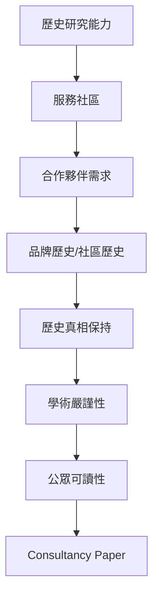
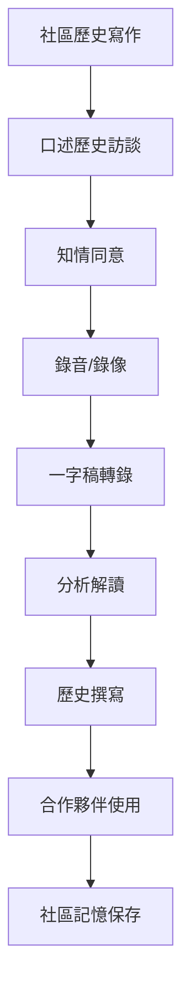
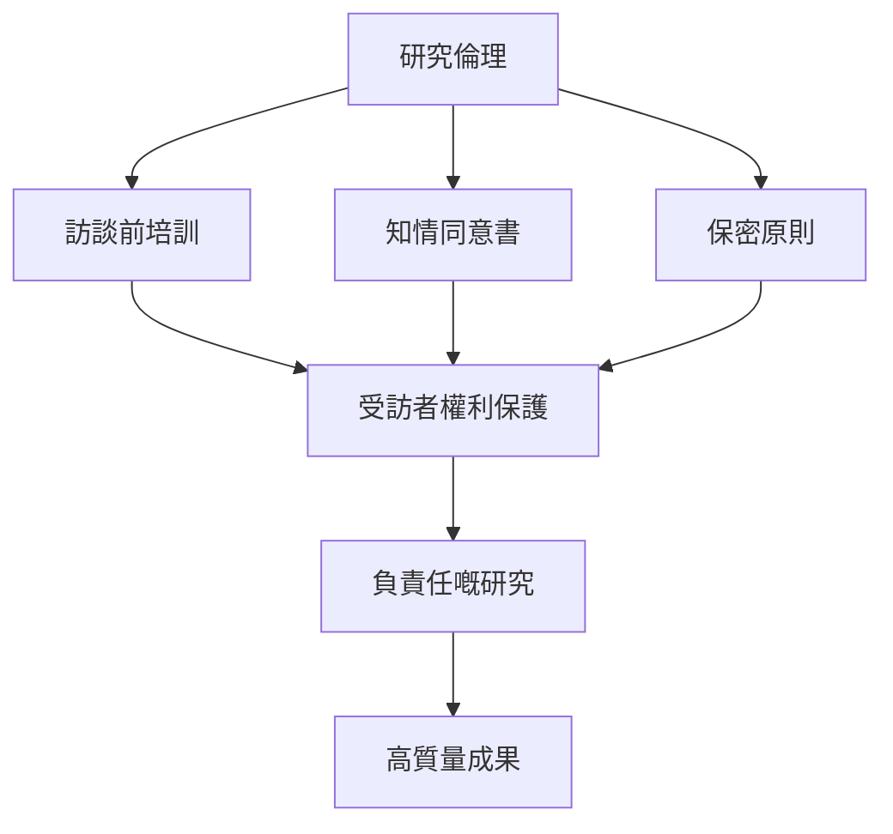
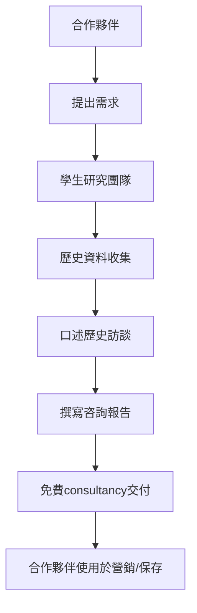
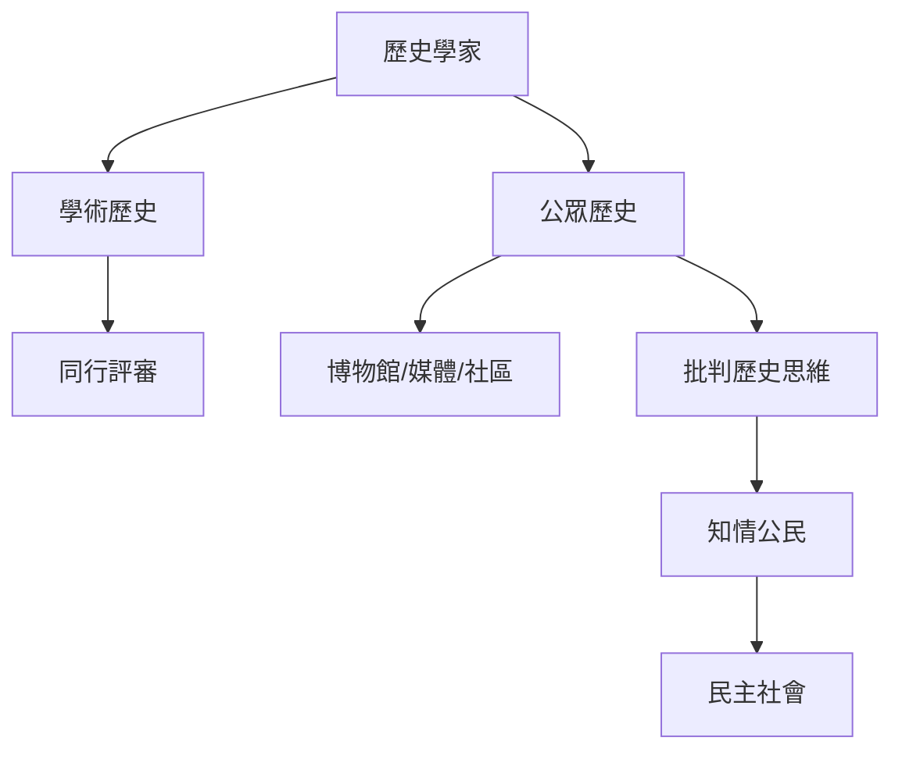
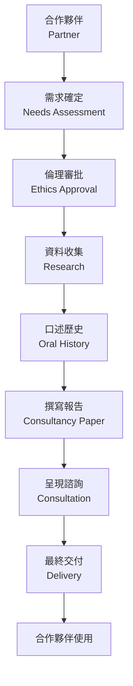
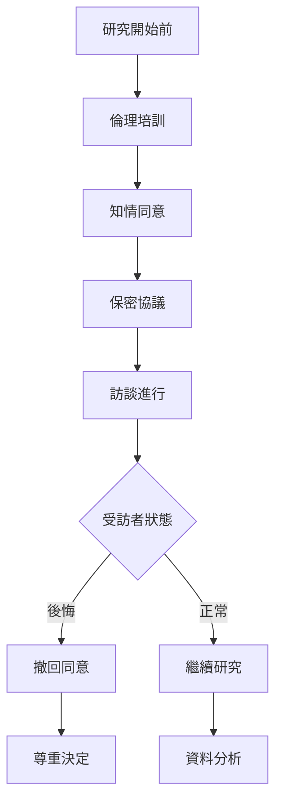
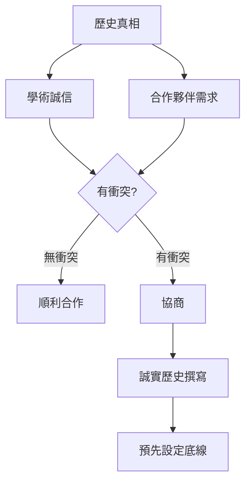
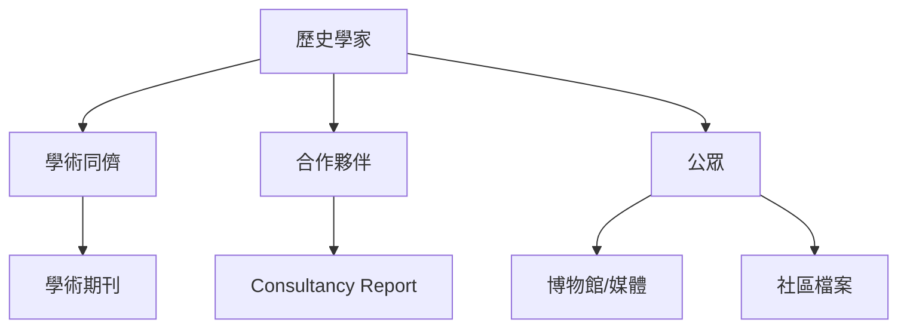
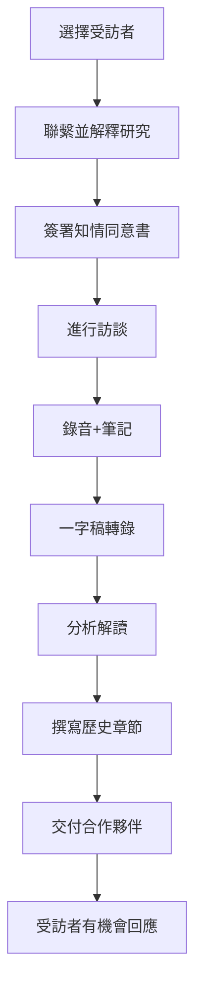

# HIST4035 應用歷史：歷史研究實習 / History Applied: Internship in Historical Studies (6 credits)

**Instructor**: David Pomfret (PhD Cambridge)
**Department**: History, HKU
**Official source**: [HKU History Course Description 2024-25](https://history.hku.hk/wp-content/uploads/2024/07/HIST-2425.pdf)
**Style**: 袁騰飛式 — 犀利、聚焦歷史點解唔只係學術，而係服務社區嘅工具

---

## 重要特點

**呢個係應用歷史課程，學生服務社區、合作夥伴機構——唔係傳統意義上嘅實習。**

---

## 問題 1：這個領域所有專家共享的 5 個核心心智模型

### 心智模型 1：應用歷史 (Public History) 概念
學者 **Robert Kelley** 研究：Public History——歷史學家喺博物館、檔案館、政府、公司工作，用歷史服務社會。

學者 **Thomas Caufield** 分析：應用歷史有別於學術歷史——目標受眾唔係同儕，而係公眾。

- HIST4035 獨特模式：學生為合作機構撰寫歷史——免費consultancy
- 合作夥伴：企業、NGO、社區團體、協會
- 最終產品：研究報告 (consultancy paper)

### 心智模型 2：社區歷史寫作 (Community History Writing)
學者 **David Lowenthal** (*The Heritage Crusade*, 1998) 研究：社區歷史揭示官方歷史忽視嘅維度。

學者 **Alison Booth** 分析：口述歷史、社區檔案——底層聲音。

- 合作夥伴訪談：收集口述歷史
- 一手史料研究：機構記録、照片、文件
- 撰寫歷史：清晰、有吸引力、公眾可讀

### 心智模型 3：歷史研究倫理
學者 **Punch** 研究：質性研究倫理——知情同意、保密、匿名處理。

學者 **David Flinders** 分析：研究者同受訪者關係——權力不平等等問題。

- 訪談倫理培訓——必須接受培訓先至可以開始訪談
- 保密原則：受訪者資料保護
- 研究成果分享：合作夥伴有使用權

### 心智模型 4：歷史作爲咨詢工具 (History as Consultancy)
學者 **Jannsen** 研究：歷史咨詢——企業、非牟利機構點解需要歷史？

學者 **Gardner** 分析：歷史故事可以係品牌建立、社區連結、政策辯論嘅工具。

- 品牌歷史：公司歷史可以係marketing工具
- 社區歷史：集體記憶可以團結社區
- 政策歷史：歷史先例影響政策辯論

### 心智模型 5：歷史同公眾嘅關係
學者 **Roy Rosenzweig** 研究：公眾歷史——點解普通人需要歷史？

學者 **David Thelen** 分析：歷史唔只係學術，而係每一個人理解自身嘅工具。

- 身份認同：個人/社區身份根植於歷史
- 批判思考：歷史訓練公共思辨能力
- 民主參與：知情公民需要歷史素養

---

## 問題 2：3 個根本分歧

### 分歧 1：應用歷史——服務定批判？
- **A 方**：服務導向
  - 為合作夥伴提供佢哋想要嘅歷史
  - 商業/機構目標優先
- **B 方**：批判導向
  - 歷史學家嘅公共責任
  - 必要時呈現不舒服嘅真相

### 分歧 2：歷史真相——可以妥協嗎？
- **A 方**：可以適度調整
  - 考慮受眾、語境、合作關係
  - 避免無必要嘅冒犯
- **B 方**：歷史真相唔可以妥協
  - 任何妥協都係背叛學術誠信
  - 如果合作夥伴要求造假，拒絕合作

### 分歧 3：受訪者權利——保護定記錄？
- **A 方**：保護優先
  - 受訪者福祉高於歷史價值
  - 必要時犧牲歷史材料
- **B 方**：記錄優先
  - 歷史如果消失就無得挽回了
  - 平衡保護同記錄

---

## 問題 3：10 個深度問題

1. 如果你為一間老字號茶餐廳寫歷史，你點平衡「品牌故事」同「批判分析」？
2. 點解歷史咨詢越嚟越受歡迎？但係歷史學家係咪變成商業工具？
3. 如果合作夥伴要求你刪除部分歷史（涉及敏感內容），你點做？
4. 訪談過程——點解受訪者有權隨時撤回同意？
5. 點解大學生可以為真實機構撰寫歷史？呢個模式有乜嘢優點同局限？
6. 如果你去訪問一位長者，佢分享咗一段好personal但係極具歷史價值嘅經歷，你點平衡？
7. 歷史寫作——點解「公眾可讀」同「學術嚴謹」可以共存？
8. 合作夥伴最後決定唔發表你嘅研究，點解可能？你點回應？
9. 點解社區歷史咁重要？但係為乜嘢好多機構願意參與？
10. 如果你去2020年，COVID-19期間，口述歷史研究者遇到乜嘢特殊挑戰？

---

## 核心心智模型深化（中英對照）

## 1. 應用歷史概念 (Public/Applied History)

### 1.1 Bilingual 概念對照
| 英文概念 | 中英對照 | 歷史含義 | 應用場景 |
|---|---|---|---|
| Public History | 公眾歷史 | 歷史服務公眾 | 博物館、媒體 |
| Applied History | 應用歷史 | 歷史服務特定需求 | HIST4035模式 |
| Community History | 社區歷史 | 為特定社區撰寫歷史 | 口述歷史 |
| History Consultancy | 歷史咨詢 | 為機構提供歷史服務 | 企業品牌 |
| Critical History | 批判歷史 | 歷史作社會批判工具 | 公共史學 |

### 1.2 史料與考據
- Robert Kelley: Public History
- 質性研究倫理準則
- HKU HIST4035 合作夥伴案例

### 1.3 袁騰飛式犀利觀察
HIST4035最犀利嘅創新就係：學生唔係去「實習」，而係用自己嘅歷史研究能力服務社區。
呢個模式挑戰咗傳統歷史教育——歷史唔只係學術，而係可以係實際嘅社會工具。
但係，歷史學家服務邊個？服務乜嘢目標？呢啲問題唔可以回避。

### 1.4 Deep test question
- 如果合作夥伴要求你撰寫一段「擦鞋」歷史，你點做？

### 1.5 圖解

---

## 2. 社區歷史寫作 (Community History Writing)

### 1.1 Bilingual 概念對照
| 英文概念 | 中英對照 | 歷史含義 | 方法 |
|---|---|---|---|
| Oral History | 口述歷史 | 訪問收集記憶 | 訪談技巧 |
| Community Archive | 社區檔案 | 社區自己建立嘅史料庫 | 共同建立 |
| Life History | 生命史 | 個人生命故事作為歷史 | 深度訪談 |
| Memory | 記憶 | 個人/集體過去 | 記憶政治 |
| Silenced Voices | 被忽視聲音 | 主流歷史無嘅群體 | 邊緣群體 |

### 1.2 史料與考據
- Paul Thompson: The Voice of the Past (1978)
- HK Oral History Archives

### 1.3 袁騰飛式犀利觀察
口述歷史係俾「被忽視聲音」發聲嘅工具——但係訪問過程本身就係一個權力關係。
研究者決定問乜嘢問題、記錄乜嘢片段、解讀乜嘢意義——呢個過程無辦法完全中性。
但係，唔做口述歷史就等於繼續忽視呢啲聲音。權力問題唔係放棄嘅理由，而係谨慎行事的提醒。

### 1.4 Deep test question
- 如果受訪者分享咗一個令你震驚嘅創傷經歷，你點處理？

### 1.5 圖解

---

## 3. 研究倫理 (Research Ethics)

### 1.1 Bilingual 概念對照
| 英文概念 | 中英對照 | 歷史含義 | 重要性 |
|---|---|---|---|
| Informed Consent | 知情同意 | 受訪者了解並同意參與 | 必須 |
| Confidentiality | 保密原則 | 保護受訪者身份 | 核心 |
| Right to Withdraw | 撤回權利 | 受訪者可隨時撤回 | 法律要求 |
| Harm Minimization | 傷害最小化 | 避免研究造成傷害 | 倫理核心 |
| Debriefing | 研究後跟進 | 訪談後關注受訪者 | 責任 |

### 1.2 史料與考據
- Qualitative Research Ethics guidelines
- HKU Research Ethics requirements

### 1.3 袁騰飛式犀利觀察
研究倫理唔係「限制」，而係「責任」。歷史研究涉及真實人物嘅真實經歷——呢啲經歷唔係學術論文嘅素材，而係一個人嘅生命。
研究者有責任確保自己嘅工作唔會傷害呢啲人——即使呢個意味着犧牲部分「學術價值」。

### 1.4 Deep test question
- 如果受訪者訪問後表示後悔，你已經完成咗consultancy paper，點做？

### 1.5 圖解

---

## 4. 歷史咨詢模式 (History Consultancy Model)

### 1.1 Bilingual 概念對照
| 英文概念 | 中英對照 | 歷史含義 | 應用 |
|---|---|---|---|
| Consultancy Paper | 咨詢報告 | HIST4035最終產品 | 合作夥伴使用 |
| Brand History | 品牌歷史 | 企業歷史服務營銷 | 商業機構 |
| Community History | 社區歷史 | 社區記憶保存 | NGO/社區組織 |
| Institutional History | 機構歷史 | 組織自身歷史 | 學校/醫院 |
| Memory Project | 記憶項目 | 記錄社區/家族記憶 | 口述歷史計劃 |

### 1.2 史料與考據
- History Consultancy practices worldwide
- HKU HIST4035 partnership examples

### 1.3 袁騰飛式犀利觀察
歷史咨詢模式最犀利嘅問題：歷史學家係咪變成商業寫手？當機構付錢（或者喺呢個情況免費服務），歷史學家嘅獨立性受到乜嘢影響？
呢個問題無標準答案——但係每一個歷史學家必須自己思考。

### 1.4 Deep test question
- 如果合作夥伴係一個有爭議歷史嘅機構（例如曾經剝削員工），你點做？

### 1.5 圖解

---

## 5. 歷史同公眾關係 (History & the Public)

### 1.1 Bilingual 概念對照
| 英文概念 | 中英對照 | 歷史含義 | 重要性 |
|---|---|---|---|
| Public History | 公眾歷史 | 歷史服務公眾 | 民主社會 |
| Historical Literacy | 歷史素養 | 公眾理解歷史能力 | 公民教育 |
| Historical Thinking | 歷史思維 | 批判分析過去 | 核心技能 |
| Commemoration | 紀念活動 | 官方歷史呈現 | 記憶政治 |
| Counter-memory | 反記憶 | 挑戰官方敘事 | 邊緣群體 |

### 1.2 史料與考據
- Roy Rosenzweig: "How People Learn About Their Community's Past"
- David Thelen: "The Practice of American History"

### 1.3 袁騰飛式犀利觀察
公眾歷史嘅核心命題：歷史唔只係學者嘅專利，而係每一個公民嘅權利同責任。
當大眾缺乏歷史素養，就容易被政客、媒體操控——歷史虛無主義、選擇性記憶、謊言重複一千遍就係真理。
歷史學家服務公眾唔係「降低標準」，而係「擴大受眾」。

### 1.4 Deep test question
- 如果你嘅歷史研究發現同合作夥伴嘅預期完全相反，你點做？

### 1.5 圖解

---

## 深度自測問題詳解

### 詳解 1: 點解公眾歷史咁重要？
因為大眾日常接觸歷史嘅主要途徑唔係學術論文，而係博物館、媒體、教科書、社交媒體。如果歷史學家唔參與呢啲領域，就會被其他聲音填補空白。

### 詳解 2: HIST4035模式同傳統實習有乜嘢唔同？
傳統實習：學生服務機構（例如打雜）。HIST4035：學生用專業歷史能力服務合作夥伴，撰寫具有長遠價值嘅歷史報告。係真正嘅知識轉移。

### 詳解 3: 如果合作夥伴想控制呈現方式？
呢個係真實張力。合作夥伴有商業/機構目標；歷史學家有學術標準。你需要預先協商呈現方式，並保留學術誠信底線。

### 詳解 4: 保密原則點解咁重要？
受訪者信任研究者，分享個人故事——呢個信任唔可以被滥用。即使內容係public knowledge，受訪者身份仍然需要保護。

### 詳解 5: 點解受訪者可以隨時撤回同意？
因為研究倫理原則——參與必須係自願的。撤回同意權係確保自願性嘅制度保障。如果受訪者後悔，必須尊重佢哋嘅決定。

### 詳解 6: 口述歷史價值——點解咁獨特？
口述歷史可以揭示官方檔案完全無記載嘅維度——情感、記憶、對過去嘅主觀體驗。呢啲係歷史嘅essential但係長期被忽視嘅維度。

### 詳解 7: 如果合作夥伴最後決定唔publish研究？
呢個係可能嘅結果。你需要預先在合同/協議入面確定使用權——即使合作夥伴唔publish，你都可以喺學術範圍内使用（經適當脫敏處理）。

### 詳解 8: 點解歷史寫作要有「公眾可讀性」？
因為歷史嘅價值唔只係學術對話，而係服務更廣嘅社會。如果得學者睇得明，歷史嘅公共價值就大打折扣。

### 詳解 9: 如果你要為一間老字號寫歷史，但係佢有剝削歷史？
呢個係最尖銳嘅倫理問題。你可以撰寫一個誠實嘅歷史——包括光明面同黑暗面。如果合作夥伴拒絕，你需要决定係咪繼續合作。

### 詳解 10: 應用歷史——係咪降低咗歷史嘅標準？
Absolutely not。公眾歷史唔係「低標準歷史」，而係「適合不同受眾嘅歷史」。學術嚴謹性同公眾可讀性完全可以共存。

---

## 5 個 Mermaid 圖解

### 📊 Diagram 1: HIST4035 研究流程

### 📊 Diagram 2: 研究倫理框架

### 📊 Diagram 3: 歷史真相 vs 合作夥伴需求

### 📊 Diagram 4: 公眾歷史受眾

### 📊 Diagram 5: 口述歷史訪談流程

---

## 總結

1. **應用歷史挑戰傳統歷史教育**：歷史唔只係學術工具，而係可以服務社區嘅實際技能。
2. **研究倫理係根本**：保密原則、撤回同意權、知情同意——呢啲唔係「麻煩程序」，而係對受訪者嘅基本尊重。
3. **歷史真相同商業需求可能衝突**：呢個係每一個應用歷史學家必須面對嘅核心張力，無法回避。
4. **社區歷史補救主流歷史嘅盲點**：口述歷史、記憶項目——呢啲係讓邊緣群體發聲嘅工具。
5. **公眾歷史唔係降低標準，而係擴大受眾**：學術嚴謹性同公眾可讀性完全可以共存。

**最後問題**: 如果你為一間有爭議歷史嘅機構撰寫歷史，你點平衡「合作夥伴需求」同「歷史真相」？

---
**版權所有 © HKU History Self-Study**
