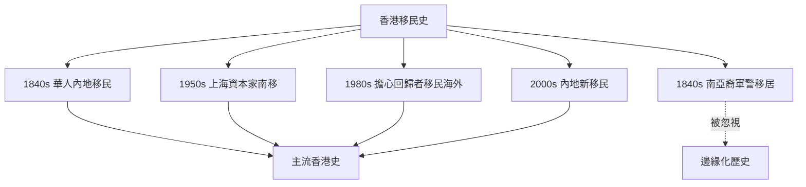
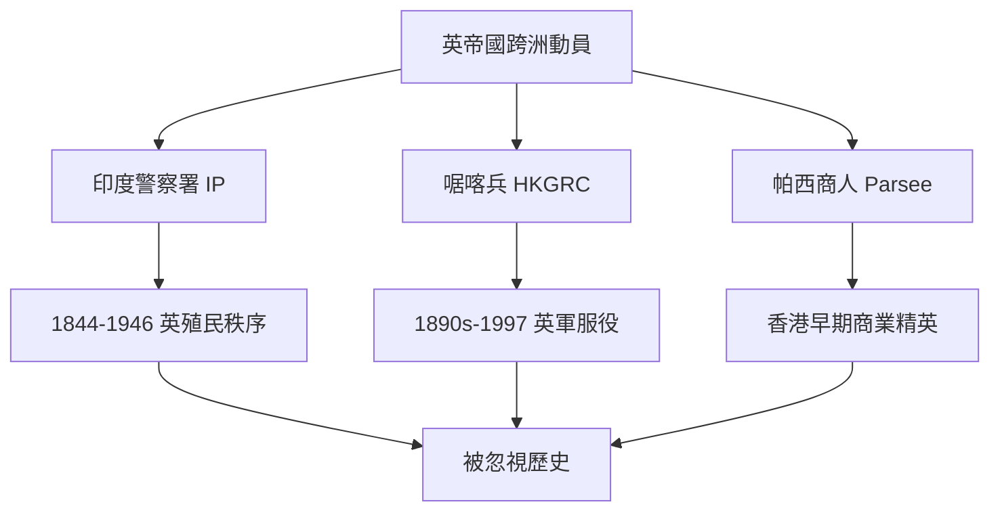
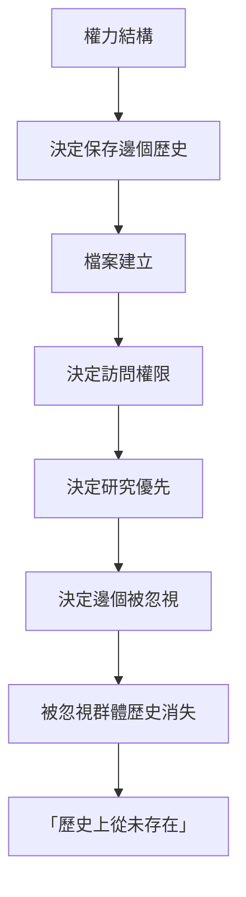
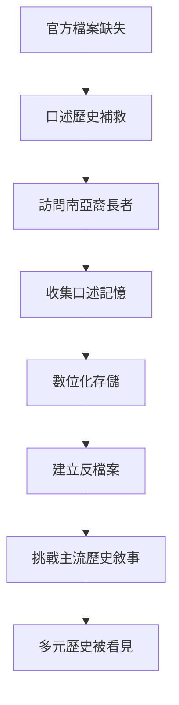
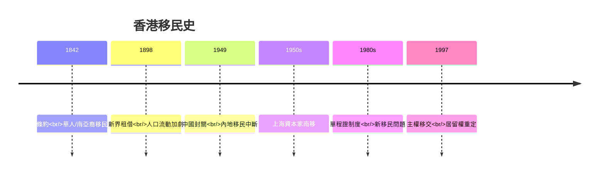
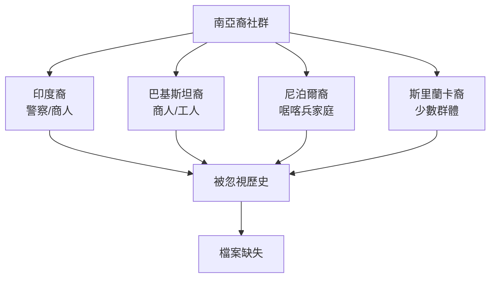
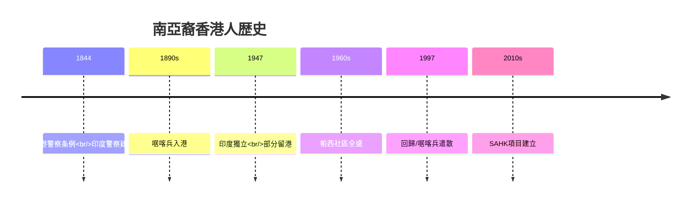

# HIST4038 遷移與檔案 / Migration and Archives in Hong Kong History (6 credits)

**Instructor**: 2025-26: South Asian Migration Focus
**Department**: History, HKU
**Official source**: [HKU History Course Description 2024-25](https://history.hku.hk/wp-content/uploads/2024/07/HIST-2425.pdf)
**Style**: 袁騰飛式 — 犀利、聚焦香港點解係一座移民城市，點解南亞裔社群嘅歷史長期被忽視

---

## 重要特點

**2025-26學年主要焦點：南亞裔社群移居香港 (South Asian Migration to Hong Kong)**

---

## 問題 1：這個領域所有專家共享的 5 個核心心智模型

### 心智模型 1：香港作爲移民城市
學者 **Philip A. Kuhn** (*Chinese Among Others*, 2008) 研究：香港係全球最大規模人口跨境流動之一——由1842年到今日，移民塑造香港身份。

學者 **Elizabeth Sinn** (*Growing Up with Hong Kong*, 1992) 分析：香港華人移民史——從內地嚟香港嘅勞工、商戶、知識分子。

- 1840s-1940s：華人移民由內地嚟港
- 1950s-1960s：大批上海資本家南移
- 1980s-1990s：回歸恐懼引發移民潮
- 2000s-：內地新移民
- 1840s-：南亞裔社群移居香港（印度、巴基斯坦、尼泊爾）

### 心智模型 2：邊界管控與人口流動
學者 **Aristide Zolberg** 研究：現代國家邊界係19世紀發明——移民管控係現代性嘅產物。

學者 **Adam McKLean** 分析：香港嘅邊界特殊地位——點解香港人可以同時有BNO、英國國民（海外）護照？

- 1842 年《南京條約》——人口跨境流動開始
- 1949 年中國邊境封閉——內地移民中斷
- 1960s-1970s：抵壘政策（部分容忍）
- 1980s：單程證制度確立
- 1997：《中英聯合聲明》——居留權規定

### 心智模型 3：南亞裔香港人歷史（2025-26重點）
學者 **John Cameron** 研究：英屬印度軍人喺香港（1840s-1940s）——警察、士兵。

學者 **Elizabeth Sinn** 分析：「南亞人在香港」計劃 (SAHK)——點解南亞裔社群長期被忽視？

- 1840s-1940s：印度警察署（IP）——英帝國跨洲際軍事動員
- 1840s-1940s：帕西人 (Parsee) 社區——香港早期商業精英
- 1947 年印度獨立——部分印度裔留港
- 1970s-：尼泊爾啹喀兵家庭留港
- 1997：啹喀兵遣散——特殊居留權安排

### 心智模型 4：檔案作爲歷史證據
學者 **Veronica Strong-Boag** 研究：移民檔案往往由國家權力書寫——移民自己嘅聲音極少被保存。

學者 **Anna L. Clarke** 分析：口述歷史方法如何補救官方檔案嘅不足。

- 香港政府檔案 (HKRS)——官方移民統計
- 英國國家檔案館 (NA)——CO 129/537 series
- 印度國家檔案館 (NAI)——英屬印度軍人記録
- 口述歷史——補救被忽視群體聲音

### 心智模型 5：檔案批判與身份建構
學者 **Stuart Hall** 分析：身份唔係固定本質，而係持續協商嘅過程——移民身份尤其如此。

學者 **James Clifford** 研究：檔案唔只保存歷史，而係建構緊邊個「屬於」呢個社會。

- 「香港人」身份係歷史建構
- 南亞裔香港人身份——華人為主嘅歷史敘事入面嘅位置
- 檔案缺失等於「從未存在過」？

---

## 問題 2：3 個根本分歧

### 分歧 1：香港身份——華人為主定多元文化？
- **A 方**：華人為主
  - 香港人口95%係華人
  - 華人歷史話語主導
- **B 方**：多元文化
  - 南亞裔、非裔、混血社群
  - 殖民時期多元文化真實存在

### 分歧 2：檔案缺失——歷史問題定政治問題？
- **A 方**：歷史問題
  - 官方檔案偏重統治者觀點
  - 技術性保存問題
- **B 方**：政治問題
  - 忽視特定群體係權力選擇
  - 檔案政策反映政治優先

### 分歧 3：少數族裔歷史——融合定保持差異？
- **A 方**：融合
  - 南亞裔香港人應該融入主流
  - 語言學習、公民參與
- **B 方**：保持差異
  - 多元文化主義
  - 獨特身份係香港財富

---

## 問題 3：10 個深度問題

1. 如果你去1840年香港，你會發現南亞裔社群點樣生活？點解英帝國軍人會嚟香港？
2. 點解香港政府檔案長期忽視南亞裔社群？呢個係技術問題定權力問題？
3. 如果你去訪問一位南亞裔長者，佢嘅回憶同官方檔案描述有乜嘢唔同？
4. 「南亞人在香港」(SAHK) 數位人文項目——點解咁重要？但係數位化本身有乜嘢問題？
5. 點解啹喀兵家庭留港問題咁複雜？1997年前英國政府點樣決定佢哋命運？
6. 如果你去英國國家檔案館，你會發現乜嘢關於南亞裔香港人嘅史料？但係點解英國檔案比香港本地檔案保存得更好？
7. 點解「香港人」身份長期被理解為華人身份？南亞裔社群點解被排除喺外？
8. 如果你要為南亞裔香港人社區建立一個口述歷史計劃，點樣確保佢哋係真正嘅「主角」？
9. 點解移民檔案往往由國家權力書寫？呢個對我哋理解歷史有乜嘢深遠影響？
10. 如果你去2050年，回望今日關於南亞裔香港人歷史研究，會點評價我哋呢個時代？

---

## 核心心智模型深化（中英對照）

## 1. 香港作爲移民城市 (Hong Kong as a City of Migration)

### 1.1 Bilingual 概念對照
| 英文概念 | 中英對照 | 歷史含義 | 數字 |
|---|---|---|---|
| Migration | 遷移 | 跨境人口流動 | 1850s高峰期 |
| Refugee | 庇護者 | 因戰亂/政治逃難 | 1950s內地移民 |
| Expatriate | 外籍人士 | 外國移居者 | 1940s前印度商人群體 |
| Statelessness | 無國籍 | 身份問題 | 啹喀兵後裔 |
| Right of Abode | 居留權 | 邊個有權住香港 | 1997後居留權規定 |

### 1.2 史料與考據
- HK Census data: 1841, 1861, 1911, 1961, 2011, 2021
- HKRS (Hong Kong Records Service)
- Elizabeth Sinn: Growing Up with Hong Kong (1992)

### 1.3 袁騰飛式犀利觀察
香港就係一座由移民建立嘅城市——但係「香港人」身份長期被等同為「華人香港人」。
呢個忽略咗：
- 1840s-1940s 印度警察 (IP) 維持殖民秩序
- 1840s-1940s 帕西人係香港早期商業精英
- 1940s- 尼泊爾啹喀兵為英軍服務
呢啲群體長期被「香港歷史」忽視——呢個唔係偶然，而係權力選擇。

### 1.4 Deep test question
- 如果你去香港歷史博物館，會發現南亞裔社群嘅歷史嗎？點解有或者無？

### 1.5 圖解


---

## 2. 南亞裔香港人歷史 (South Asian Hong Kongers)

### 1.1 Bilingual 概念對照
| 英文概念 | 中英對照 | 歷史含義 | 案例 |
|---|---|---|---|
| Indian Police | 印度警察 | 英帝國跨洲動員 | IP 1844-1946 |
| Parsee Community | 帕西人社區 | 香港早期商業精英 | 洋行、律師 |
| Gurkha Soldiers | 啹喀兵 | 英軍傭兵，尼泊爾裔 | HKGRC |
| Eurasian Community | 歐亞混血社群 | 殖民時期特殊群體 | 被雙重邊緣化 |
| South Asian Diaspora | 南亞裔離散 | 帝國主義流動結果 | 全球網絡 |

### 1.2 史料與考據
- John Cameron: 印度警察喺香港
- SAHK Project: southasianmigration@gmail.com
- National Archives UK: CO series

### 1.3 袁騰飛式犀利觀察
1844年香港警察条例確立咗一個奇怪嘅歷史安排：印度人被招募為香港警察——佢哋係英帝國跨洲動員嘅一部分。
呢啲印度裔警察嘅後裔，今日大部分仍然住喺香港，但係佢哋嘅歷史被完全忽視。
歷史嘅諷刺在於：無印度裔警察維持殖民秩序，就無殖民時期香港穩定——但係呢段歷史被歷史學家集體忽略。

### 1.4 Deep test question
- 如果你去香港警察歷史博物館，你會發現印度裔警察嘅歷史嗎？

### 1.5 圖解


---

## 3. 檔案批判與身份建構 (Archive Criticism & Identity Construction)

### 1.1 Bilingual 概念對照
| 英文概念 | 中英對照 | 歷史含義 | 重要性 |
|---|---|---|---|
| Archive | 檔案 | 權力選擇保存嘅記録 | 邊個被記録 |
| Silencing | 消音 | 特定群體被歷史忽視 | 檔案缺失 |
| Counter-archive | 反檔案 | 邊緣群體建立自己檔案 | 口述歷史 |
| Official Memory | 官方記憶 | 國家選擇記住嘅過去 | 權力建構 |
| Counter-memory | 反記憶 | 挑戰官方記憶 | 邊緣群體聲音 |

### 1.2 史料與考據
- Jacques Derrida: Archive Fever (1995)
- SAHK Project Archives: sahk.history.hku.hk
- HK Public Records Office

### 1.3 袁騰飛式犀利觀察
Derrida話「檔案熱」——我哋對保存記録有一種病態嘅執着。但係 Derrida同時指出：檔案唔係中性嘅——邊個建立檔案、邊個保存、邊個可以訪問——全部都係權力問題。
如果南亞裔香港人歷史無被檔案保存，咁就等於「歷史上佢哋從未存在過」——呢個就係權力嘅最極端表現。

### 1.4 Deep test question
- 如果檔案缺失等於歷史上「從未存在過」，咁歷史學家嘅責任係乜嘢？

### 1.5 圖解


---

## 4. 口述歷史與補救方法 (Oral History & Remediation)

### 1.1 Bilingual 概念對照
| 英文概念 | 中英對照 | 歷史含義 | 方法 |
|---|---|---|---|
| Oral History | 口述歷史 | 訪問收集記憶 | 訪談技巧 |
| Memory | 記憶 | 主觀過去經驗 | 個人/集體 |
| Testimony | 證言 | 創傷經驗口述 | 見證歷史 |
| Counter-narrative | 反敘事 | 挑戰官方版本 | 邊緣群體 |
| Digital Archive | 數位檔案 | 互聯網存儲歷史 | SAHK項目 |

### 1.2 史料與考據
- Paul Thompson: The Voice of the Past (1978)
- SAHK Digital Humanities project: sahk.history.hku.hk

### 1.3 袁騰飛式犀利觀察
口述歷史就係「反檔案」嘅工具——通過訪問被歷史忽視嘅群體，歷史學家可以補救檔案缺失。
但係口述歷史有佢自己嘅問題：記憶會被時間扭曲、情感會影響描述、權力關係影響訪問過程。
南亞裔長者嘅口述歷史——就係俾呢個被忽視群體發聲嘅唯一工具。

### 1.4 Deep test question
- 如果一位南亞裔長者嘅回憶同官方檔案描述有衝突，你信邊個？點解？

### 1.5 圖解


---

## 5. 邊界管控與公民權利 (Border Control & Citizenship)

### 1.1 Bilingual 概念對照
| 英文概念 | 中英對照 | 歷史含義 | 香港案例 |
|---|---|---|---|
| Border Control | 邊界管控 | 國家決定邊個可以入境 | 抵壘政策 |
| Right of Abode | 居留權 | 邊個有權住喺邊度 | 1997後規定 |
| Statelessness | 無國籍 | 權利被剝奪 | 啹喀兵後裔問題 |
| BNO Status | 英國國民（海外） | 1997前特殊安排 | 2020年後政策改變 |
| One-way Permit | 單程證 | 內地移民制度 | 1980s至今 |

### 1.2 史料與考據
- Basic Law Article 24
- HK Public Records Office: Immigration records
- UK National Archives: Hong Kong Governorship records

### 1.3 袁騰飛式犀利觀察
邊界管控就係現代國家最大嘅權力工具之一——邊個有權住喺邊度，呢個決定影響數以百萬計嘅人命運。
香港嘅邊界史尤其複雜：英國人建立邊界、中國邊境封閉、單程證制度、回歸後「一國兩制」——每一個階段都涉及權力鬥爭。

### 1.4 Deep test question
- 如果你去英國國家檔案館，你會發現乜嘢關於啹喀兵遣散嘅史料？

### 1.5 圖解
```mermaid
flowchart TD
    A[邊界管控制度] --> B[1842 邊界開放]
    B --> C[1949 內地封關]
    C --> D[1960s 抵壘政策]
    D --> E[1980 單程證制度]
    E --> F[1997 居留權重定}
    F --> G[2020 BNO政策改變}
```

---

## 深度自測問題詳解

### 詳解 1: 點解香港移民史長期被忽視？
因為移民史挑戰「香港人」作為固定身份嘅話語——如果香港人全部係移民後代，咁「香港人」身份嘅本質係乜嘢？

### 詳解 2: 南亞裔香港人歷史點解咁重要？
因為佢揭示咗殖民主義嘅另一面——唔只係英國人統治華人，而係跨洲帝國主義動員南亞裔軍警嚟維持秩序。

### 詳解 3: 如果你去英國國家檔案館，你會發現乜嘢？
會發現CO 129/537系列——英屬香港政府同英國殖民部嘅通信。呢啲檔案可能包含印度警察、啹喀兵相關記載。

### 詳解 4: 口述歷史價值——點解咁獨特？
口述歷史補救官方檔案嘅不足——尤其係被忽視群體。帕西人社區、尼泊爾裔家庭、印度裔警察後裔——呢啲聲音幾乎完全唔存在於官方檔案。

### 詳解 5: 如果你去訪問一位南亞裔長者？
你需要注意：受訪者可能對英帝國有複雜感情——佢哋可能係帝國主義受害者，但係同時因為服務帝國而獲得某些特權。呢個複雜性唔可以簡化。

### 詳解 6: 「南亞人在香港」(SAHK) 數位人文項目有乜嘢創新？
結合數位地圖——展示南亞裔人口歷史分佈；口述歷史數位化；建立互動式數據庫——係歷史研究同公眾參與結合嘅創新方式。

### 詳解 7: 點解啹喀兵遣散問題咁複雜？
因為1997前英國政府決定允許部分啹喀兵留港，但係唔俾佢哋英國公民身份——呢個導致大量無國籍問題。

### 詳解 8: 如果你去研究南亞裔香港人，你會遇到乜嘢方法論挑戰？
語言障礙（需要英語、烏爾都語、印地語、尼泊爾語）；口述歷史可信度問題；受訪者身份敏感（無國籍問題）。

### 詳解 9: 點解多元文化主義喺香港咁難實現？
因為「香港人」身份認同長期被等同為華人身份。少數族裔面對語言障礙（廣東話係官方語言）、教育歧視、就業困難。

### 詳解 10: 如果你要為南亞裔香港人社區建立一個口述歷史計劃？
你需要：社區參與（唔係外來者居高臨下研究）；多語言能力（英語、烏爾都語、粵語）；倫理意識（受訪者同意、保密）；長期承諾。

---

## 5 個 Mermaid 圖解

### 📊 Diagram 1: 香港移民史分期


### 📊 Diagram 2: 南亞裔香港人社區


### 📊 Diagram 3: 檔案權力批判
```mermaid
flowchart TD
    A[權力結構] --> B[建立檔案]
    B --> C[選擇保存邊個歴史]
    C --> D[忽視南亞裔歴史}
    D --> E[「歷史上從未存在」}
    E --> F[身份政治影響}
    F --> G[權力再生産}
    G --> A
```

### 📊 Diagram 4: 口述歷史補救過程
```mermaid
flowchart TD
    A[檔案缺失] --> B[口述歷史訪問]
    B --> C[南亞裔長者記憶]
    C --> D[多語言轉錄]
    D --> E[數位化存儲]
    E --> F[建立互動地圖]
    F --> G[挑戰主流歷史}
    G --> H[多元歷史被看見}
```

### 📊 Diagram 5: 南亞裔香港人歷史分期


---

## 總結

1. **香港係一座移民城市，但係「香港人」身份長期被等同為華人身份**——南亞裔社群長期被忽視係權力問題，唔係技術問題。
2. **檔案缺失唔係偶然，而係權力選擇**——官方檔案反映官方記憶，被忽視群體需要建立自己嘅「反檔案」。
3. **口述歷史係補救檔案缺失嘅關鍵工具**——但係口述歷史本身都有方法論局限，需要批判使用。
4. **南亞裔香港人歷史揭示殖民主義複雜性**——佢哋係帝國主義受害者，但係同時服務帝國主義——呢個矛盾唔可以簡化。
5. **數位人文項目提供新可能**——SAHK 數位互動地圖、口述歷史數位化——但係數位鴻溝同時係新嘅不平等。

**最後問題**: 如果你去訪問一位南亞裔香港長者，佢話「我係香港人，但係香港從來唔当我係香港人」——你呢個歷史學家點回應？

---
**版權所有 © HKU History Self-Study**
